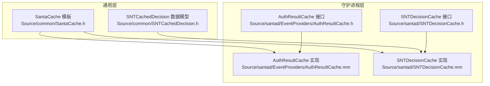
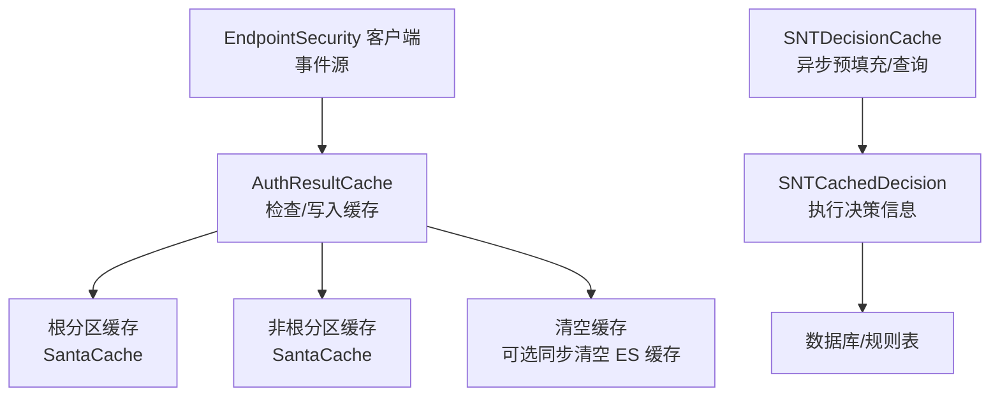
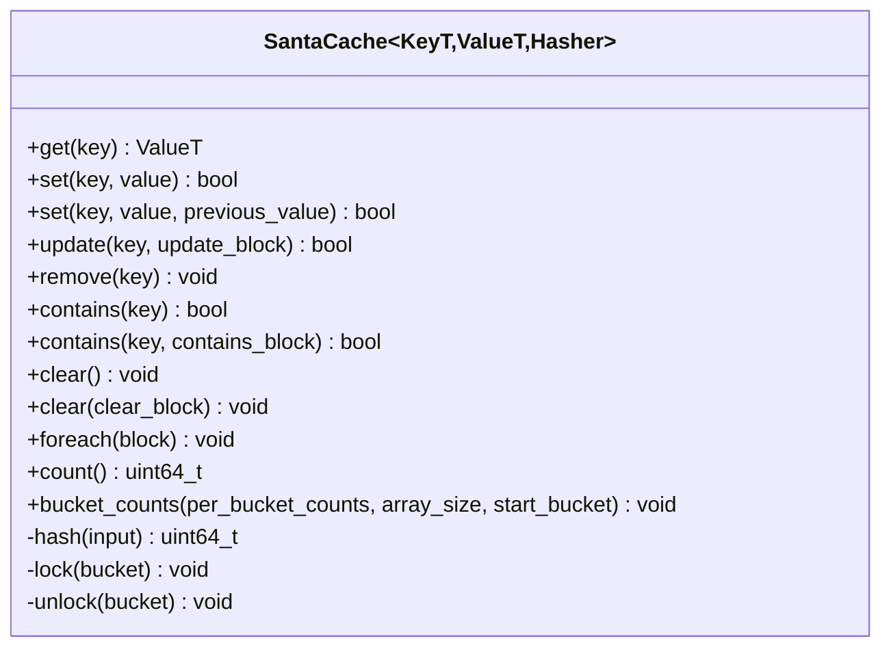
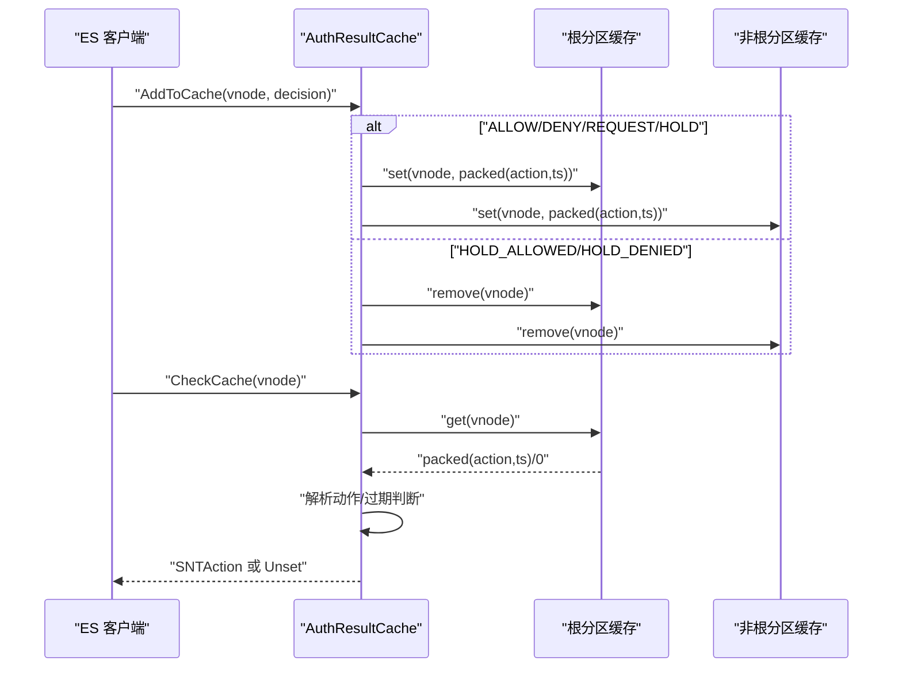
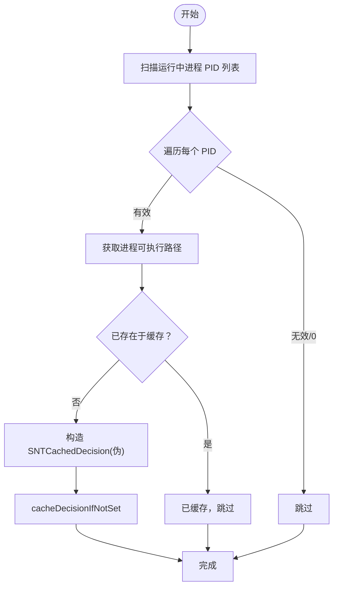
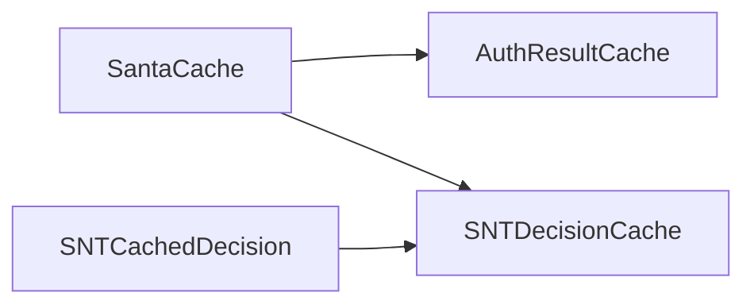

# 缓存策略

<cite>
**本文引用的文件**
- [SantaCache.h](file://Source/common/SantaCache.h)
- [SantaCacheTest.mm](file://Source/common/SantaCacheTest.mm)
- [AuthResultCache.h](file://Source/santad/EventProviders/AuthResultCache.h)
- [AuthResultCache.mm](file://Source/santad/EventProviders/AuthResultCache.mm)
- [SNTDecisionCache.h](file://Source/santad/SNTDecisionCache.h)
- [SNTDecisionCache.mm](file://Source/santad/SNTDecisionCache.mm)
- [SNTDecisionCacheTest.mm](file://Source/santad/SNTDecisionCacheTest.mm)
- [SNTCachedDecision.h](file://Source/common/SNTCachedDecision.h)
</cite>

## 目录
1. [引言](#引言)
2. [项目结构](#项目结构)
3. [核心组件](#核心组件)
4. [架构总览](#架构总览)
5. [详细组件分析](#详细组件分析)
6. [依赖关系分析](#依赖关系分析)
7. [性能考量](#性能考量)
8. [故障排除指南](#故障排除指南)
9. [结论](#结论)
10. [附录](#附录)

## 引言
本文件系统性梳理 Santa 中的缓存策略，重点覆盖三类缓存：认证结果缓存（AuthResultCache）、决策缓存（SNTDecisionCache）以及通用缓存模板（SantaCache）。我们将从设计原理、实现机制、键生成策略、失效与淘汰、内存控制、预填充（backfill）、异步构建与一致性保障等方面展开，并给出命中率优化、容量调优与性能监控建议，以及常见问题排查路径。

## 项目结构
Santa 的缓存相关代码主要分布在以下位置：
- 通用缓存模板：Source/common/SantaCache.h
- 认证结果缓存：Source/santad/EventProviders/AuthResultCache.h/.mm
- 决策缓存：Source/santad/SNTDecisionCache.h/.mm
- 决策缓存数据模型：Source/common/SNTCachedDecision.h
- 测试用例：Source/common/SantaCacheTest.mm、Source/santad/SNTDecisionCacheTest.mm

**图表来源**
- [SantaCache.h](file://Source/common/SantaCache.h#L48-L463)
- [AuthResultCache.h](file://Source/santad/EventProviders/AuthResultCache.h#L50-L93)
- [AuthResultCache.mm](file://Source/santad/EventProviders/AuthResultCache.mm#L87-L206)
- [SNTDecisionCache.h](file://Source/santad/SNTDecisionCache.h#L23-L34)
- [SNTDecisionCache.mm](file://Source/santad/SNTDecisionCache.mm#L45-L207)
- [SNTCachedDecision.h](file://Source/common/SNTCachedDecision.h#L23-L60)

**章节来源**
- [SantaCache.h](file://Source/common/SantaCache.h#L48-L463)
- [AuthResultCache.h](file://Source/santad/EventProviders/AuthResultCache.h#L50-L93)
- [AuthResultCache.mm](file://Source/santad/EventProviders/AuthResultCache.mm#L87-L206)
- [SNTDecisionCache.h](file://Source/santad/SNTDecisionCache.h#L23-L34)
- [SNTDecisionCache.mm](file://Source/santad/SNTDecisionCache.mm#L45-L207)
- [SNTCachedDecision.h](file://Source/common/SNTCachedDecision.h#L23-L60)

## 核心组件
- 通用缓存模板 SantaCache：提供并发链表哈希表实现，支持按桶加锁、容量上限触发全清空、CAS 更新、遍历与统计等能力。
- 认证结果缓存 AuthResultCache：基于 SantaCache 的 vnode 级别缓存，区分根分区与非根分区缓存，支持 DENY 结果的时效性失效，以及多种触发原因的缓存清空。
- 决策缓存 SNTDecisionCache：以 vnode 为键缓存执行决策信息，支持异步预填充（backfill）运行中进程的伪决策条目，用于降低首次执行延迟。

**章节来源**
- [SantaCache.h](file://Source/common/SantaCache.h#L48-L463)
- [AuthResultCache.h](file://Source/santad/EventProviders/AuthResultCache.h#L50-L93)
- [AuthResultCache.mm](file://Source/santad/EventProviders/AuthResultCache.mm#L87-L206)
- [SNTDecisionCache.h](file://Source/santad/SNTDecisionCache.h#L23-L34)
- [SNTDecisionCache.mm](file://Source/santad/SNTDecisionCache.mm#L45-L207)

## 架构总览
下图展示了认证结果缓存与决策缓存在系统中的交互关系及数据流。

**图表来源**
- [AuthResultCache.mm](file://Source/santad/EventProviders/AuthResultCache.mm#L148-L171)
- [AuthResultCache.mm](file://Source/santad/EventProviders/AuthResultCache.mm#L177-L197)
- [SNTDecisionCache.mm](file://Source/santad/SNTDecisionCache.mm#L114-L205)
- [SNTCachedDecision.h](file://Source/common/SNTCachedDecision.h#L23-L60)

## 详细组件分析

### 通用缓存模板 SantaCache
- 设计要点
  - 并发模型：按桶加锁，桶数量由最大容量与“每桶目标项数”共同决定，向上取整到 2 的幂，减少热点冲突。
  - 键值存储：每个桶为单链表，插入采用头插法；通过位操作复用指针最低位作为自旋锁标志。
  - 容量控制：达到最大容量时，新增元素会触发全清空，确保内存占用稳定。
  - 原子计数：使用原子增减维护当前条目数，避免全局锁竞争。
  - 辅助能力：支持 foreach 遍历（需外部持有所有桶锁）、contains 查询、bucket_counts 统计分布、clear 回调清理。
- 关键接口与行为
  - get/set/update/remove/contains/clear/foreach/bucket_counts/count/hash/lock/unlock
  - set 支持 CAS（compare-and-swap）模式，用于无锁更新场景。
- 复杂度与性能
  - 查找/插入/删除期望 O(1)，最坏退化至 O(n)（同桶冲突）。
  - 桶数与负载因子受 per_bucket 控制，影响冲突概率与内存占用。
- 使用注意
  - 键类型需满足相等比较与哈希要求；模板默认使用 absl::Hash，可通过特化或自定义 Hasher。
  - 清空是全量操作，适合容量上限触发；若频繁小规模更新，应评估对吞吐的影响。

**图表来源**
- [SantaCache.h](file://Source/common/SantaCache.h#L48-L463)

**章节来源**
- [SantaCache.h](file://Source/common/SantaCache.h#L48-L463)
- [SantaCacheTest.mm](file://Source/common/SantaCacheTest.mm#L34-L86)
- [SantaCacheTest.mm](file://Source/common/SantaCacheTest.mm#L115-L137)
- [SantaCacheTest.mm](file://Source/common/SantaCacheTest.mm#L169-L181)
- [SantaCacheTest.mm](file://Source/common/SantaCacheTest.mm#L218-L239)
- [SantaCacheTest.mm](file://Source/common/SantaCacheTest.mm#L288-L301)
- [SantaCacheTest.mm](file://Source/common/SantaCacheTest.mm#L302-L312)
- [SantaCacheTest.mm](file://Source/common/SantaCacheTest.mm#L313-L339)
- [SantaCacheTest.mm](file://Source/common/SantaCacheTest.mm#L355-L401)
- [SantaCacheTest.mm](file://Source/common/SantaCacheTest.mm#L402-L433)
- [SantaCacheTest.mm](file://Source/common/SantaCacheTest.mm#L435-L457)
- [SantaCacheTest.mm](file://Source/common/SantaCacheTest.mm#L459-L497)
- [SantaCacheTest.mm](file://Source/common/SantaCacheTest.mm#L499-L535)

### 认证结果缓存 AuthResultCache
- 设计与职责
  - 以 vnode 为键，缓存执行决策结果，区分根分区与非根分区两套缓存，便于按设备号快速选择。
  - 将决策动作与时间戳打包存储，利用高位保存动作、低位保存时间，节省空间并支持 DENY 的过期判断。
  - 提供统一的 Add/Remove/Check/Flush 接口，支持按原因分类的缓存清空，并在全量清空前异步通知 ES 客户端清空其本地缓存。
- 键生成策略
  - 使用文件的 vnode（fsid + fileid）作为键，确保跨进程/路径变更仍能命中同一缓存项。
- 失效机制
  - DENY 结果带过期时间，超过阈值自动移除；请求/保持类中间态不带时间戳，避免误判。
  - FlushCache 支持仅清非根缓存或同时清根缓存，并异步清空 ES 缓存，防止死锁。
- LRU 淘汰与内存控制
  - 该实现未内置 LRU；通过容量上限触发全清空，确保内存占用可控。若需要 LRU，可在上层封装或替换为带淘汰策略的容器。
- 性能特性
  - 读路径：O(1) 哈希定位 + 桶内线性扫描；写路径：头插 + 原子计数。
  - 分区缓存分离，避免跨设备的热点集中。

**图表来源**
- [AuthResultCache.mm](file://Source/santad/EventProviders/AuthResultCache.mm#L111-L141)
- [AuthResultCache.mm](file://Source/santad/EventProviders/AuthResultCache.mm#L148-L171)
- [AuthResultCache.h](file://Source/santad/EventProviders/AuthResultCache.h#L50-L93)

**章节来源**
- [AuthResultCache.h](file://Source/santad/EventProviders/AuthResultCache.h#L50-L93)
- [AuthResultCache.mm](file://Source/santad/EventProviders/AuthResultCache.mm#L87-L206)

### 决策缓存 SNTDecisionCache
- 设计与职责
  - 以 vnode 为键，缓存执行决策信息（如允许/拒绝、客户端模式、签名信息、权限过滤结果等），用于日志与审计。
  - 支持异步预填充（backfill）：扫描运行中进程，构造伪 SNTCachedDecision 条目，降低首次执行的评估开销。
- 键生成策略
  - 使用 stat 信息计算 vnode（fsid + fileid），作为缓存键。
- 预填充（Backfill）
  - 在后台队列中异步扫描进程列表，尝试填充缓存；若已有真实决策到达则跳过，避免覆盖。
  - 预填充条目标记为不可缓存，且部分字段置为未知，以避免误导后续逻辑。
- 其他能力
  - 提供按 vnode 忘记缓存项、重置可传递规则的时间戳等辅助功能。

**图表来源**
- [SNTDecisionCache.mm](file://Source/santad/SNTDecisionCache.mm#L114-L205)

**章节来源**
- [SNTDecisionCache.h](file://Source/santad/SNTDecisionCache.h#L23-L34)
- [SNTDecisionCache.mm](file://Source/santad/SNTDecisionCache.mm#L45-L207)
- [SNTDecisionCacheTest.mm](file://Source/santad/SNTDecisionCacheTest.mm#L55-L101)
- [SNTCachedDecision.h](file://Source/common/SNTCachedDecision.h#L23-L60)

## 依赖关系分析
- SantaCache 是 AuthResultCache 与 SNTDecisionCache 的底层支撑，前者用于存放打包的动作+时间戳，后者用于存放完整的决策对象。
- AuthResultCache 依据设备号选择根/非根缓存，避免跨设备热点。
- SNTDecisionCache 依赖 SNTCachedDecision 数据模型，承载签名、权限、客户端模式等丰富元信息。

**图表来源**
- [SantaCache.h](file://Source/common/SantaCache.h#L48-L463)
- [AuthResultCache.mm](file://Source/santad/EventProviders/AuthResultCache.mm#L173-L175)
- [SNTDecisionCache.mm](file://Source/santad/SNTDecisionCache.mm#L45-L91)
- [SNTCachedDecision.h](file://Source/common/SNTCachedDecision.h#L23-L60)

**章节来源**
- [SantaCache.h](file://Source/common/SantaCache.h#L48-L463)
- [AuthResultCache.mm](file://Source/santad/EventProviders/AuthResultCache.mm#L173-L175)
- [SNTDecisionCache.mm](file://Source/santad/SNTDecisionCache.mm#L45-L91)
- [SNTCachedDecision.h](file://Source/common/SNTCachedDecision.h#L23-L60)

## 性能考量
- 命中率优化
  - 合理设置 per_bucket：增大可降低冲突但提高内存；减小可提升命中但增加锁争用。建议结合业务热点进行 A/B 调参。
  - 对于 AuthResultCache，DENY 过期时间应平衡“及时生效新规则”与“连续执行的吞吐”。根据实现，默认约毫秒级窗口。
  - 对于 SNTDecisionCache，backfill 可显著降低冷启动延迟，建议在系统空闲时段或低优先级队列执行。
- 容量调优
  - SantaCache 的容量上限触发全清空，适合内存敏感场景；若追求更高命中率，可考虑引入 LRU 替换策略（例如在上层封装或替换容器）。
  - AuthResultCache 的根/非根分区分离可避免跨设备热点，建议保留此策略。
- 监控与可观测性
  - AuthResultCache 暴露缓存计数接口，可用于观察两缓存的规模变化。
  - Flush 次数按原因计数，可用于定位规则变更、模式切换等导致的缓存抖动。
- 并发与锁
  - 按桶加锁减少热点冲突；大量并发写入时建议评估 per_bucket 与桶数量的平衡。
  - 清空与重建是全量操作，应避免在高并发写入期间频繁触发。

[本节为通用性能讨论，无需列出具体文件来源]

## 故障排除指南
- 认证结果缓存异常
  - 现象：短时间内反复 DENY/ALLOW，或策略变更后判定不一致。
  - 排查：检查 FlushCache 触发原因与频率；确认 DENY 过期时间是否过短导致频繁失效。
  - 参考接口与行为
    - [AuthResultCache.h](file://Source/santad/EventProviders/AuthResultCache.h#L50-L93)
    - [AuthResultCache.mm](file://Source/santad/EventProviders/AuthResultCache.mm#L177-L197)
- 决策缓存缺失
  - 现象：执行日志缺少决策信息或签名信息不完整。
  - 排查：确认 backfill 是否成功执行；检查伪条目是否被真实决策覆盖；核对 vnode 计算是否一致。
  - 参考接口与行为
    - [SNTDecisionCache.mm](file://Source/santad/SNTDecisionCache.mm#L114-L205)
    - [SNTDecisionCacheTest.mm](file://Source/santad/SNTDecisionCacheTest.mm#L55-L101)
- 通用缓存问题
  - 现象：命中率低、内存占用异常。
  - 排查：检查 per_bucket 设置、桶数量是否合理；使用 bucket_counts 观察分布；确认是否存在大量热键集中在少数桶。
  - 参考接口与行为
    - [SantaCache.h](file://Source/common/SantaCache.h#L260-L303)
    - [SantaCacheTest.mm](file://Source/common/SantaCacheTest.mm#L270-L286)

**章节来源**
- [AuthResultCache.h](file://Source/santad/EventProviders/AuthResultCache.h#L50-L93)
- [AuthResultCache.mm](file://Source/santad/EventProviders/AuthResultCache.mm#L177-L197)
- [SNTDecisionCache.mm](file://Source/santad/SNTDecisionCache.mm#L114-L205)
- [SNTDecisionCacheTest.mm](file://Source/santad/SNTDecisionCacheTest.mm#L55-L101)
- [SantaCache.h](file://Source/common/SantaCache.h#L260-L303)
- [SantaCacheTest.mm](file://Source/common/SantaCacheTest.mm#L270-L286)

## 结论
Santa 的缓存体系以高性能并发哈希表为核心，分别针对认证结果与执行决策两类关键场景提供了专用缓存。通过分区缓存、打包存储、容量上限触发清空与异步 backfill 等手段，在保证正确性的同时兼顾了吞吐与内存占用。建议在生产环境中结合业务特征持续调参与监控，必要时引入更精细的淘汰策略以进一步提升命中率。

[本节为总结性内容，无需列出具体文件来源]

## 附录
- 配置参数与建议
  - SantaCache
    - maximum_size：缓存上限，达到即全清空
    - per_bucket：每桶目标项数，影响冲突与内存
  - AuthResultCache
    - cache_deny_time_ms：DENY 结果过期时间（实现中以纳秒存储）
    - FlushCacheMode/Reason：清空策略与原因分类
  - SNTDecisionCache
    - backfill 队列优先级：建议使用较低优先级以避免抢占前台任务
- 性能基准测试
  - 可参考单元测试中的多线程写入、分布均匀性、CAS 行为等用例，作为回归与容量规划的基础
  - 参考文件
    - [SantaCacheTest.mm](file://Source/common/SantaCacheTest.mm#L139-L168)
    - [SantaCacheTest.mm](file://Source/common/SantaCacheTest.mm#L115-L137)
    - [SantaCacheTest.mm](file://Source/common/SantaCacheTest.mm#L218-L239)
    - [SNTDecisionCacheTest.mm](file://Source/santad/SNTDecisionCacheTest.mm#L55-L101)

**章节来源**
- [SantaCacheTest.mm](file://Source/common/SantaCacheTest.mm#L139-L168)
- [SantaCacheTest.mm](file://Source/common/SantaCacheTest.mm#L115-L137)
- [SantaCacheTest.mm](file://Source/common/SantaCacheTest.mm#L218-L239)
- [SNTDecisionCacheTest.mm](file://Source/santad/SNTDecisionCacheTest.mm#L55-L101)