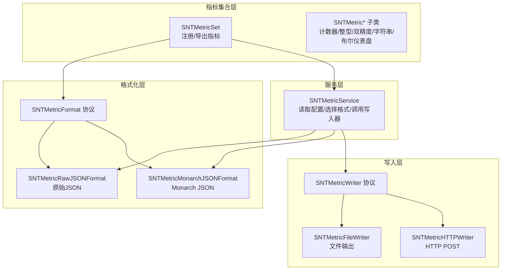
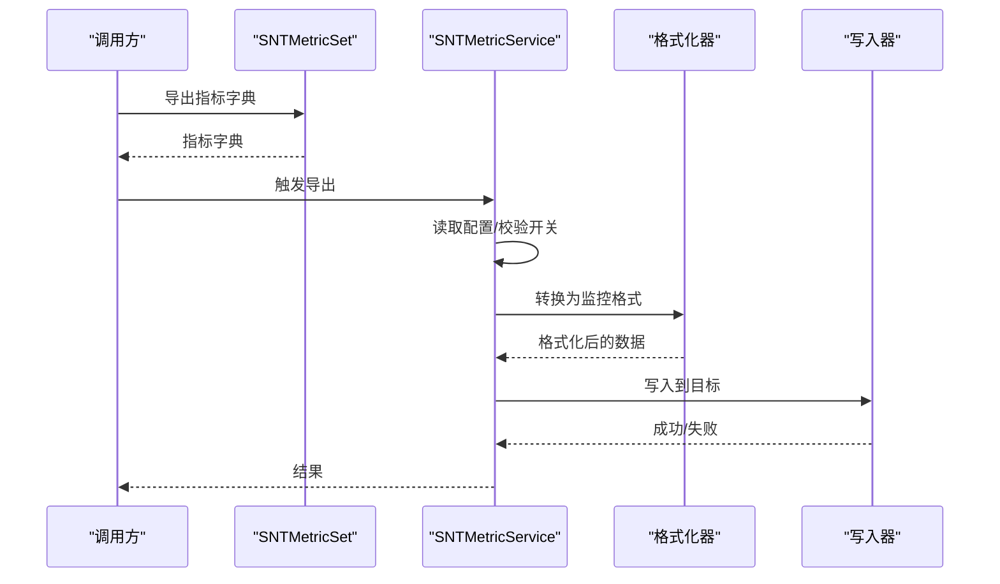
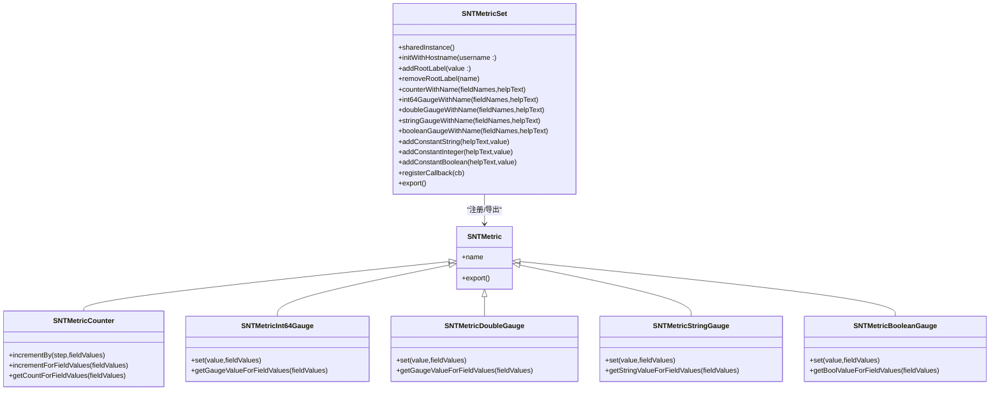
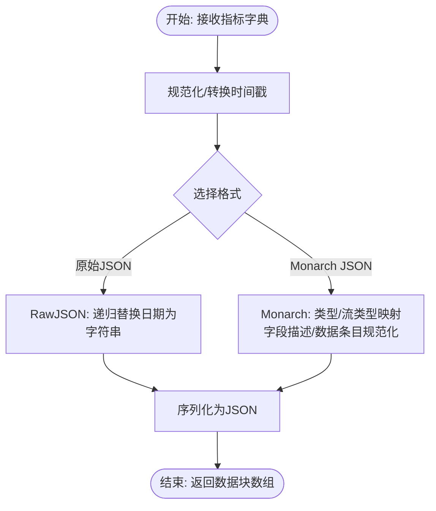
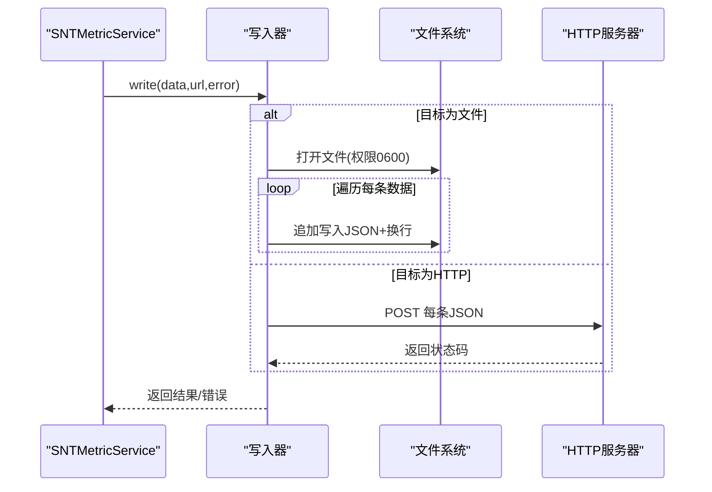
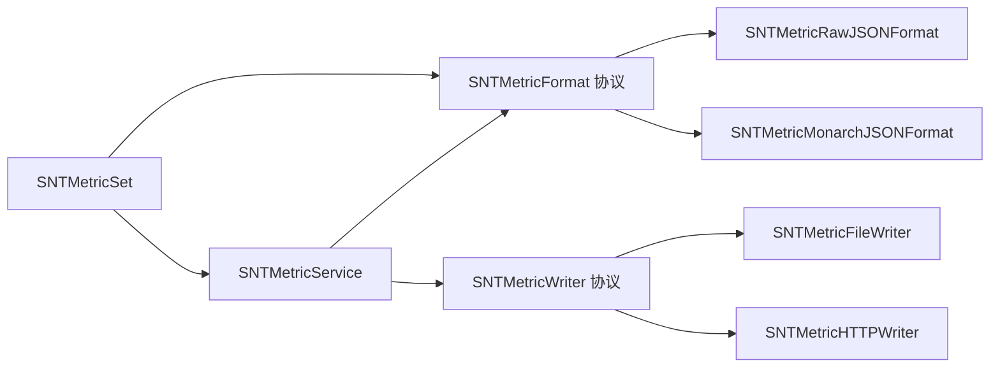

# 指标与监控

<cite>
**本文引用的文件**
- [SNTMetricSet.h](file://Source/common/SNTMetricSet.h)
- [SNTMetricSet.mm](file://Source/common/SNTMetricSet.mm)
- [SNTMetricService.h](file://Source/santametricservice/SNTMetricService.h)
- [SNTMetricService.mm](file://Source/santametricservice/SNTMetricService.mm)
- [SNTMetricFormat.h](file://Source/santametricservice/Formats/SNTMetricFormat.h)
- [SNTMetricMonarchJSONFormat.h](file://Source/santametricservice/Formats/SNTMetricMonarchJSONFormat.h)
- [SNTMetricMonarchJSONFormat.mm](file://Source/santametricservice/Formats/SNTMetricMonarchJSONFormat.mm)
- [SNTMetricRawJSONFormat.h](file://Source/santametricservice/Formats/SNTMetricRawJSONFormat.h)
- [SNTMetricRawJSONFormat.mm](file://Source/santametricservice/Formats/SNTMetricRawJSONFormat.mm)
- [SNTMetricWriter.h](file://Source/santametricservice/Writers/SNTMetricWriter.h)
- [SNTMetricFileWriter.h](file://Source/santametricservice/Writers/SNTMetricFileWriter.h)
- [SNTMetricFileWriter.mm](file://Source/santametricservice/Writers/SNTMetricFileWriter.mm)
- [SNTMetricHTTPWriter.h](file://Source/santametricservice/Writers/SNTMetricHTTPWriter.h)
- [SNTMetricHTTPWriter.mm](file://Source/santametricservice/Writers/SNTMetricHTTPWriter.mm)
- [SNTExportConfiguration.h](file://Source/common/SNTExportConfiguration.h)
</cite>

## 目录
1. [简介](#简介)
2. [项目结构](#项目结构)
3. [核心组件](#核心组件)
4. [架构总览](#架构总览)
5. [组件详解](#组件详解)
6. [依赖关系分析](#依赖关系分析)
7. [性能考量](#性能考量)
8. [故障排查指南](#故障排查指南)
9. [结论](#结论)
10. [附录](#附录)

## 简介
本文件面向Santa指标与监控系统，系统性梳理指标采集机制、统计类型与导出格式，解释指标服务的架构设计、格式转换器与写入器实现，阐述性能监控指标、系统健康状态与业务指标的定义与计算方法，并给出指标数据的存储、聚合与分析方案，以及监控集成、告警配置与仪表板展示思路。同时，结合仓库中的安全与合规能力，提出指标数据隐私保护、数据脱敏与合规要求的实践建议，并提供监控工具集成、自动化运维与容量规划建议。

## 项目结构
Santa指标与监控体系由“指标集合”“格式化器”“写入器”“指标服务”四层组成，围绕统一的指标导出接口向外扩展，支持多种监控系统与输出目标（文件、HTTP）。

图表来源
- [SNTMetricSet.h](file://Source/common/SNTMetricSet.h#L84-L192)
- [SNTMetricSet.mm](file://Source/common/SNTMetricSet.mm#L434-L668)
- [SNTMetricFormat.h](file://Source/santametricservice/Formats/SNTMetricFormat.h#L17-L22)
- [SNTMetricRawJSONFormat.h](file://Source/santametricservice/Formats/SNTMetricRawJSONFormat.h#L15-L21)
- [SNTMetricMonarchJSONFormat.h](file://Source/santametricservice/Formats/SNTMetricMonarchJSONFormat.h#L15-L21)
- [SNTMetricWriter.h](file://Source/santametricservice/Writers/SNTMetricWriter.h#L17-L24)
- [SNTMetricFileWriter.h](file://Source/santametricservice/Writers/SNTMetricFileWriter.h#L14-L18)
- [SNTMetricHTTPWriter.h](file://Source/santametricservice/Writers/SNTMetricHTTPWriter.h#L15-L21)
- [SNTMetricService.mm](file://Source/santametricservice/SNTMetricService.mm#L33-L129)

章节来源
- [SNTMetricService.mm](file://Source/santametricservice/SNTMetricService.mm#L33-L129)
- [SNTMetricSet.h](file://Source/common/SNTMetricSet.h#L84-L192)

## 核心组件
- 指标集合与类型
  - 提供统一的指标注册与导出接口，支持根标签、字段维度、回调注入等能力；内置计数器与多类型仪表盘（整型、双精度、字符串、布尔），并支持常量指标。
  - 关键路径：[SNTMetricSet.h](file://Source/common/SNTMetricSet.h#L84-L192)，[SNTMetricSet.mm](file://Source/common/SNTMetricSet.mm#L434-L668)
- 格式化器
  - 定义统一转换协议，提供两种实现：原始JSON与Monarch JSON，分别适配通用监控系统与特定平台工具链。
  - 关键路径：[SNTMetricFormat.h](file://Source/santametricservice/Formats/SNTMetricFormat.h#L17-L22)，[SNTMetricRawJSONFormat.mm](file://Source/santametricservice/Formats/SNTMetricRawJSONFormat.mm#L1-L107)，[SNTMetricMonarchJSONFormat.mm](file://Source/santametricservice/Formats/SNTMetricMonarchJSONFormat.mm#L1-L249)
- 写入器
  - 定义统一写入协议，提供文件与HTTP两种实现，分别用于本地持久化与远程上报。
  - 关键路径：[SNTMetricWriter.h](file://Source/santametricservice/Writers/SNTMetricWriter.h#L17-L24)，[SNTMetricFileWriter.mm](file://Source/santametricservice/Writers/SNTMetricFileWriter.mm#L1-L72)，[SNTMetricHTTPWriter.mm](file://Source/santametricservice/Writers/SNTMetricHTTPWriter.mm#L1-L119)
- 指标服务
  - 读取配置、选择格式、调用写入器完成指标导出；在后台队列执行，避免阻塞主流程。
  - 关键路径：[SNTMetricService.mm](file://Source/santametricservice/SNTMetricService.mm#L33-L129)

章节来源
- [SNTMetricSet.h](file://Source/common/SNTMetricSet.h#L84-L192)
- [SNTMetricSet.mm](file://Source/common/SNTMetricSet.mm#L434-L668)
- [SNTMetricFormat.h](file://Source/santametricservice/Formats/SNTMetricFormat.h#L17-L22)
- [SNTMetricRawJSONFormat.mm](file://Source/santametricservice/Formats/SNTMetricRawJSONFormat.mm#L1-L107)
- [SNTMetricMonarchJSONFormat.mm](file://Source/santametricservice/Formats/SNTMetricMonarchJSONFormat.mm#L1-L249)
- [SNTMetricWriter.h](file://Source/santametricservice/Writers/SNTMetricWriter.h#L17-L24)
- [SNTMetricFileWriter.mm](file://Source/santametricservice/Writers/SNTMetricFileWriter.mm#L1-L72)
- [SNTMetricHTTPWriter.mm](file://Source/santametricservice/Writers/SNTMetricHTTPWriter.mm#L1-L119)
- [SNTMetricService.mm](file://Source/santametricservice/SNTMetricService.mm#L33-L129)

## 架构总览
指标服务从指标集合导出原始指标字典，经格式化器转换为监控系统可消费的JSON，再由写入器输出到文件或HTTP端点。配置驱动格式与目标，错误通过日志记录并返回。

图表来源
- [SNTMetricService.mm](file://Source/santametricservice/SNTMetricService.mm#L94-L128)
- [SNTMetricRawJSONFormat.mm](file://Source/santametricservice/Formats/SNTMetricRawJSONFormat.mm#L80-L106)
- [SNTMetricMonarchJSONFormat.mm](file://Source/santametricservice/Formats/SNTMetricMonarchJSONFormat.mm#L233-L248)
- [SNTMetricFileWriter.mm](file://Source/santametricservice/Writers/SNTMetricFileWriter.mm#L36-L71)
- [SNTMetricHTTPWriter.mm](file://Source/santametricservice/Writers/SNTMetricHTTPWriter.mm#L51-L116)

## 组件详解

### 指标集合与类型（SNTMetricSet）
- 设计要点
  - 支持根标签（如主机名、用户名）统一标识实体。
  - 指标按名称注册，字段维度支持多维组合，值对象包含创建时间与最后更新时间。
  - 提供回调钩子，在每次导出前刷新动态指标值。
  - 时间戳标准化为ISO8601字符串，便于下游解析。
- 数据模型类图

图表来源
- [SNTMetricSet.h](file://Source/common/SNTMetricSet.h#L54-L192)
- [SNTMetricSet.mm](file://Source/common/SNTMetricSet.mm#L182-L433)

章节来源
- [SNTMetricSet.h](file://Source/common/SNTMetricSet.h#L54-L192)
- [SNTMetricSet.mm](file://Source/common/SNTMetricSet.mm#L182-L433)

### 格式化器（SNTMetricFormat 及其实现）
- 协议
  - 统一转换接口，接收指标字典与结束时间戳，返回序列化后的数据块数组。
- 原始JSON格式化器
  - 将日期统一转为ISO8601字符串，保证JSON可序列化；对非法输入返回错误。
- Monarch JSON格式化器
  - 将指标类型映射为流类型（GAUGE/CUMULATIVE）与值类型（BOOL/INT64/STRING/DOUBLE），并规范化字段描述与数据条目；所有结束时间戳均更新为传入的时间戳。

图表来源
- [SNTMetricRawJSONFormat.mm](file://Source/santametricservice/Formats/SNTMetricRawJSONFormat.mm#L33-L106)
- [SNTMetricMonarchJSONFormat.mm](file://Source/santametricservice/Formats/SNTMetricMonarchJSONFormat.mm#L101-L248)

章节来源
- [SNTMetricFormat.h](file://Source/santametricservice/Formats/SNTMetricFormat.h#L17-L22)
- [SNTMetricRawJSONFormat.mm](file://Source/santametricservice/Formats/SNTMetricRawJSONFormat.mm#L1-L107)
- [SNTMetricMonarchJSONFormat.mm](file://Source/santametricservice/Formats/SNTMetricMonarchJSONFormat.mm#L1-L249)

### 写入器（SNTMetricWriter 及其实现）
- 协议
  - 统一写入接口，接收格式化后的数据与目标URL，返回成功/失败及错误信息。
- 文件写入器
  - 以追加方式打开文件，逐条写入JSON对象并换行，权限控制为仅属主可读写。
- HTTP写入器
  - 使用认证会话，TLS最小版本限制为TLS1.2，启用管线化；逐条POST，记录最后一个错误并以是否出现错误判定整体成功。

图表来源
- [SNTMetricFileWriter.mm](file://Source/santametricservice/Writers/SNTMetricFileWriter.mm#L36-L71)
- [SNTMetricHTTPWriter.mm](file://Source/santametricservice/Writers/SNTMetricHTTPWriter.mm#L51-L116)

章节来源
- [SNTMetricWriter.h](file://Source/santametricservice/Writers/SNTMetricWriter.h#L17-L24)
- [SNTMetricFileWriter.mm](file://Source/santametricservice/Writers/SNTMetricFileWriter.mm#L1-L72)
- [SNTMetricHTTPWriter.mm](file://Source/santametricservice/Writers/SNTMetricHTTPWriter.mm#L1-L119)

### 指标服务（SNTMetricService）
- 功能
  - 读取配置决定是否导出、使用何种格式、目标URL的scheme对应写入器。
  - 在后台队列中执行转换与写入，避免阻塞。
  - 对错误进行日志记录与错误对象传递。
- 关键路径：[SNTMetricService.mm](file://Source/santametricservice/SNTMetricService.mm#L33-L129)

章节来源
- [SNTMetricService.mm](file://Source/santametricservice/SNTMetricService.mm#L33-L129)

## 依赖关系分析
- 松耦合设计
  - 指标集合与格式化器通过协议解耦；格式化器与写入器同样通过协议解耦。
  - 服务层仅依赖配置与协议接口，不直接依赖具体实现，便于扩展新格式或新写入器。
- 外部依赖
  - HTTP写入器依赖认证会话与TLS配置，确保传输安全。
  - 日志模块用于错误与调试信息输出。

图表来源
- [SNTMetricSet.h](file://Source/common/SNTMetricSet.h#L84-L192)
- [SNTMetricFormat.h](file://Source/santametricservice/Formats/SNTMetricFormat.h#L17-L22)
- [SNTMetricWriter.h](file://Source/santametricservice/Writers/SNTMetricWriter.h#L17-L24)
- [SNTMetricService.mm](file://Source/santametricservice/SNTMetricService.mm#L33-L129)

章节来源
- [SNTMetricService.mm](file://Source/santametricservice/SNTMetricService.mm#L33-L129)
- [SNTMetricFormat.h](file://Source/santametricservice/Formats/SNTMetricFormat.h#L17-L22)
- [SNTMetricWriter.h](file://Source/santametricservice/Writers/SNTMetricWriter.h#L17-L24)

## 性能考量
- 并发与线程
  - 指标值对象内部使用同步块保护，避免竞态；导出过程在后台队列执行，降低对主线程影响。
- 序列化与I/O
  - 原始JSON采用递归遍历替换日期字符串，复杂度与指标规模线性相关；Monarch JSON需额外进行类型映射与字段描述生成，注意批量指标时的CPU开销。
  - 文件写入逐条追加，适合流式落盘；HTTP写入逐条POST，网络延迟与服务端响应时间为主要瓶颈。
- 时间戳处理
  - 统一转换为ISO8601字符串，减少下游解析成本；Monarch JSON强制更新结束时间戳，便于聚合与对齐。

章节来源
- [SNTMetricSet.mm](file://Source/common/SNTMetricSet.mm#L100-L180)
- [SNTMetricService.mm](file://Source/santametricservice/SNTMetricService.mm#L40-L55)
- [SNTMetricRawJSONFormat.mm](file://Source/santametricservice/Formats/SNTMetricRawJSONFormat.mm#L33-L68)
- [SNTMetricMonarchJSONFormat.mm](file://Source/santametricservice/Formats/SNTMetricMonarchJSONFormat.mm#L101-L154)
- [SNTMetricHTTPWriter.mm](file://Source/santametricservice/Writers/SNTMetricHTTPWriter.mm#L51-L116)

## 故障排查指南
- 常见问题
  - 未开启导出：服务收到导出请求但配置关闭，将记录调试日志后忽略。
  - 格式化失败：当指标字典不符合JSON序列化条件时，原始JSON格式化器返回错误。
  - 写入失败：文件无法打开或HTTP返回非200状态码，错误信息会被记录并返回。
- 定位步骤
  - 检查配置项（导出开关、格式类型、目标URL、超时设置）。
  - 查看服务日志，确认格式化与写入阶段的错误信息。
  - 验证目标端点可达性与证书/鉴权配置（HTTP写入器使用认证会话与TLS1.2）。
- 相关路径
  - [SNTMetricService.mm](file://Source/santametricservice/SNTMetricService.mm#L94-L128)
  - [SNTMetricRawJSONFormat.mm](file://Source/santametricservice/Formats/SNTMetricRawJSONFormat.mm#L80-L106)
  - [SNTMetricHTTPWriter.mm](file://Source/santametricservice/Writers/SNTMetricHTTPWriter.mm#L51-L116)
  - [SNTMetricFileWriter.mm](file://Source/santametricservice/Writers/SNTMetricFileWriter.mm#L36-L71)

章节来源
- [SNTMetricService.mm](file://Source/santametricservice/SNTMetricService.mm#L94-L128)
- [SNTMetricRawJSONFormat.mm](file://Source/santametricservice/Formats/SNTMetricRawJSONFormat.mm#L80-L106)
- [SNTMetricHTTPWriter.mm](file://Source/santametricservice/Writers/SNTMetricHTTPWriter.mm#L51-L116)
- [SNTMetricFileWriter.mm](file://Source/santametricservice/Writers/SNTMetricFileWriter.mm#L36-L71)

## 结论
Santa指标与监控系统通过清晰的分层设计实现了高内聚、低耦合的指标采集与导出能力。指标集合提供统一抽象，格式化器适配不同监控系统，写入器覆盖本地与远端输出场景，服务层以配置驱动实现灵活扩展。配合仓库中的安全与合规能力，可在保证数据安全的前提下，构建稳定可靠的监控与告警体系。

## 附录

### 指标类型与定义
- 计数器（Counter）
  - 累加型指标，适用于事件次数统计；适合业务指标（如规则命中、策略触发次数）。
- 仪表盘（Gauge）
  - 整型/双精度/字符串/布尔仪表盘，适用于系统健康状态（如内存使用率、模式状态、布尔开关）。
- 常量指标（Constant）
  - 不随时间变化的元数据，如版本号、部署环境标签。

章节来源
- [SNTMetricSet.h](file://Source/common/SNTMetricSet.h#L39-L53)
- [SNTMetricSet.h](file://Source/common/SNTMetricSet.h#L174-L192)

### 导出格式与目标
- 原始JSON（Raw JSON）
  - 保留指标集合的原始结构，日期统一为ISO8601字符串；适合通用监控系统或自定义解析。
- Monarch JSON
  - 映射指标类型与流类型，规范化字段描述与数据条目；适合特定平台工具链。
- 输出目标
  - 文件：逐条JSON对象追加写入，权限0600。
  - HTTP：逐条POST，TLS1.2+，管线化启用，状态码非200视为错误。

章节来源
- [SNTMetricRawJSONFormat.mm](file://Source/santametricservice/Formats/SNTMetricRawJSONFormat.mm#L33-L106)
- [SNTMetricMonarchJSONFormat.mm](file://Source/santametricservice/Formats/SNTMetricMonarchJSONFormat.mm#L101-L248)
- [SNTMetricFileWriter.mm](file://Source/santametricservice/Writers/SNTMetricFileWriter.mm#L36-L71)
- [SNTMetricHTTPWriter.mm](file://Source/santametricservice/Writers/SNTMetricHTTPWriter.mm#L51-L116)

### 监控集成、告警与仪表板
- 集成建议
  - 选择与Monarch JSON兼容的监控系统（如Prometheus、Google Cloud Monitoring）或通用JSON解析器。
  - 使用文件输出作为中间态，便于离线分析与审计。
- 告警配置
  - 基于计数器速率与仪表盘阈值设定告警规则；对异常状态（如模式切换、错误率上升）触发即时通知。
- 仪表板展示
  - 展示系统健康状态（CPU/内存/磁盘）、业务指标（策略命中/规则数量）、运行时指标（进程数/缓存命中）。

[本节为概念性指导，无需源码引用]

### 隐私保护、数据脱敏与合规
- 数据脱敏
  - 在导出前对敏感字段（如路径、签名ID）进行脱敏处理；仅保留聚合统计所需的最小必要信息。
- 合规要求
  - 严格遵守最小化原则，避免采集个人身份信息；对本地存储的指标文件设置最小权限访问。
- 安全传输
  - HTTP写入器强制TLS1.2及以上，结合认证会话保障传输安全。

章节来源
- [SNTMetricHTTPWriter.mm](file://Source/santametricservice/Writers/SNTMetricHTTPWriter.mm#L37-L49)
- [SNTMetricFileWriter.mm](file://Source/santametricservice/Writers/SNTMetricFileWriter.mm#L23-L34)

### 自动化运维与容量规划
- 自动化
  - 通过配置管理工具下发指标导出配置；结合定时任务或事件触发导出。
- 容量规划
  - 评估指标规模与写入频率，合理设置HTTP超时与文件轮转策略；对高基数字段进行聚合降维。

[本节为通用建议，无需源码引用]