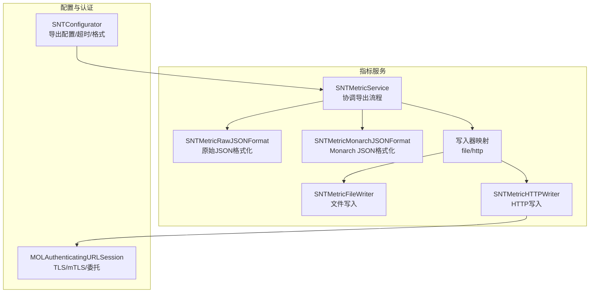
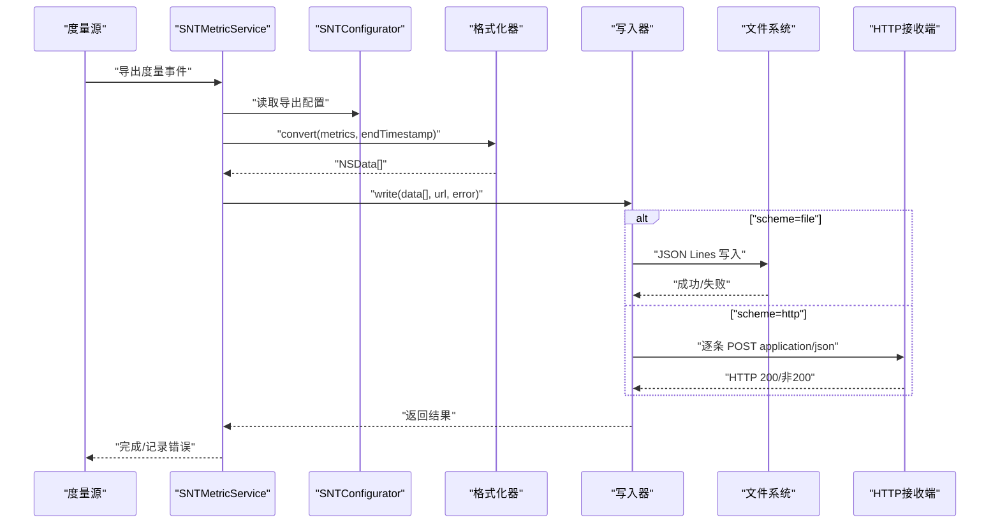
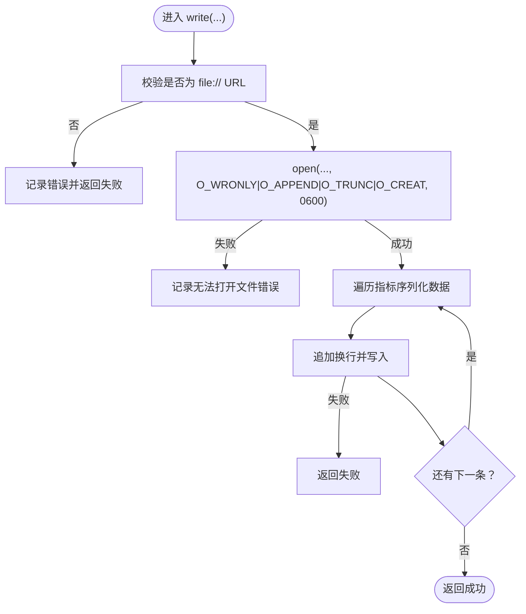
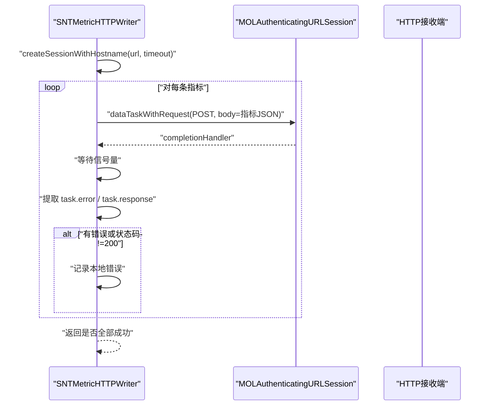
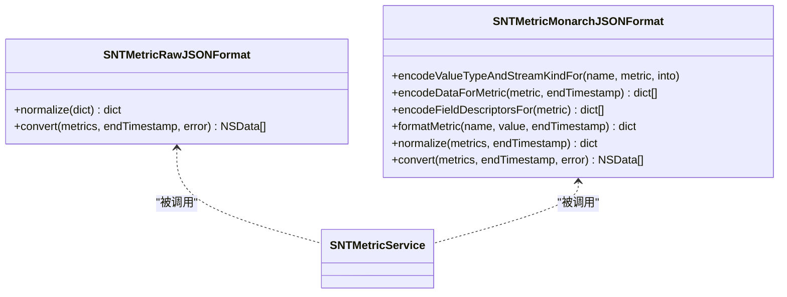
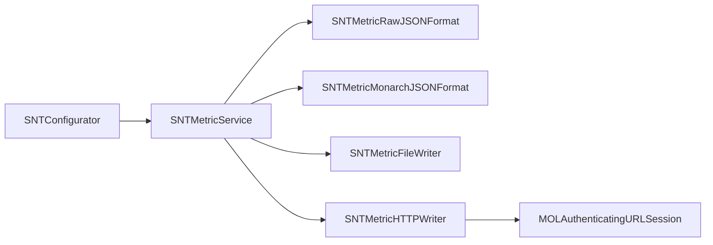

# 指标导出

<cite>
**本文引用的文件**
- [SNTExportConfiguration.h](file://Source/common/SNTExportConfiguration.h)
- [SNTExportConfiguration.mm](file://Source/common/SNTExportConfiguration.mm)
- [SNTMetricWriter.h](file://Source/santametricservice/Writers/SNTMetricWriter.h)
- [SNTMetricFileWriter.h](file://Source/santametricservice/Writers/SNTMetricFileWriter.h)
- [SNTMetricFileWriter.mm](file://Source/santametricservice/Writers/SNTMetricFileWriter.mm)
- [SNTMetricHTTPWriter.h](file://Source/santametricservice/Writers/SNTMetricHTTPWriter.h)
- [SNTMetricHTTPWriter.mm](file://Source/santametricservice/Writers/SNTMetricHTTPWriter.mm)
- [SNTMetricService.h](file://Source/santametricservice/SNTMetricService.h)
- [SNTMetricService.mm](file://Source/santametricservice/SNTMetricService.mm)
- [SNTMetricMonarchJSONFormat.h](file://Source/santametricservice/Formats/SNTMetricMonarchJSONFormat.h)
- [SNTMetricMonarchJSONFormat.mm](file://Source/santametricservice/Formats/SNTMetricMonarchJSONFormat.mm)
- [SNTMetricRawJSONFormat.h](file://Source/santametricservice/Formats/SNTMetricRawJSONFormat.h)
- [SNTMetricRawJSONFormat.mm](file://Source/santametricservice/Formats/SNTMetricRawJSONFormat.mm)
- [MOLAuthenticatingURLSession.h](file://Source/common/MOLAuthenticatingURLSession.h)
- [MOLAuthenticatingURLSession.mm](file://Source/common/MOLAuthenticatingURLSession.mm)
- [SNTConfigurator.h](file://Source/common/SNTConfigurator.h)
- [SNTConfigurator.mm](file://Source/common/SNTConfigurator.mm)
</cite>

## 目录
1. [简介](#简介)
2. [项目结构](#项目结构)
3. [核心组件](#核心组件)
4. [架构总览](#架构总览)
5. [详细组件分析](#详细组件分析)
6. [依赖关系分析](#依赖关系分析)
7. [性能考量](#性能考量)
8. [故障排查指南](#故障排查指南)
9. [结论](#结论)
10. [附录：配置参数与调度策略](#附录配置参数与调度策略)

## 简介
本文件系统性阐述 Santa 指标导出子系统的设计与实现，覆盖以下方面：
- 导出机制：文件写入器与 HTTP 写入器的工作原理与差异
- 数据格式：原始 JSON 与 Monarch JSON 的转换规则
- 存储与轮转：文件写入的路径、权限与换行分隔策略
- HTTP 导出：协议规范、请求格式、认证与 TLS 安全、错误处理
- 压缩与传输安全：TLS 版本、证书链验证、可选 mTLS 客户端认证
- 性能优化：并发与阻塞模型、批量发送策略建议
- 配置参数：导出开关、目标地址、格式、间隔与超时等
- 监控与告警：日志记录与错误域的使用
- 数据完整性与可靠性：逐条发送、状态码校验与失败聚合

## 项目结构
指标导出位于 santametricservice 子模块中，采用“格式化器 + 写入器”的插件式架构：
- 格式化器负责将内部度量集转换为外部监控系统可消费的 JSON 结构（Monarch 或 Raw）
- 写入器负责将格式化后的数据输出到文件或 HTTP 接收端
- SNTMetricService 作为协调者，读取配置、调用格式化器、选择写入器并执行导出

图表来源
- [SNTMetricService.mm](file://Source/santametricservice/SNTMetricService.mm#L33-L129)
- [SNTMetricRawJSONFormat.mm](file://Source/santametricservice/Formats/SNTMetricRawJSONFormat.mm#L1-L107)
- [SNTMetricMonarchJSONFormat.mm](file://Source/santametricservice/Formats/SNTMetricMonarchJSONFormat.mm#L1-L249)
- [SNTMetricFileWriter.mm](file://Source/santametricservice/Writers/SNTMetricFileWriter.mm#L1-L72)
- [SNTMetricHTTPWriter.mm](file://Source/santametricservice/Writers/SNTMetricHTTPWriter.mm#L1-L119)
- [MOLAuthenticatingURLSession.mm](file://Source/common/MOLAuthenticatingURLSession.mm#L1-L200)
- [SNTConfigurator.mm](file://Source/common/SNTConfigurator.mm#L350-L420)

章节来源
- [SNTMetricService.mm](file://Source/santametricservice/SNTMetricService.mm#L33-L129)
- [SNTMetricWriter.h](file://Source/santametricservice/Writers/SNTMetricWriter.h#L1-L24)
- [SNTMetricFileWriter.h](file://Source/santametricservice/Writers/SNTMetricFileWriter.h#L1-L18)
- [SNTMetricHTTPWriter.h](file://Source/santametricservice/Writers/SNTMetricHTTPWriter.h#L1-L21)

## 核心组件
- SNTMetricWriter 协议：定义统一的写入接口 write(data, url, error)
- SNTMetricRawJSONFormat：将内部度量字典标准化为 JSON，日期序列化为 ISO8601 字符串
- SNTMetricMonarchJSONFormat：将内部度量映射为 Monarch 所需的字段描述、流类型与值类型，并按时间窗口编码
- SNTMetricFileWriter：以 JSON Lines 方式写入文件，每条指标占一行，文件权限 0600
- SNTMetricHTTPWriter：逐条 POST 指标到指定 URL，使用 MOLAuthenticatingURLSession 进行 TLS/mTLS 认证，支持超时与状态码校验
- SNTMetricService：根据配置选择格式化器与写入器，执行导出并记录日志
- SNTConfigurator：提供导出开关、目标 URL、格式、导出间隔与超时等配置键
- SNTExportConfiguration：封装导出目标 URL 与表单参数，支持安全归档/反归档

章节来源
- [SNTMetricWriter.h](file://Source/santametricservice/Writers/SNTMetricWriter.h#L1-L24)
- [SNTMetricRawJSONFormat.mm](file://Source/santametricservice/Formats/SNTMetricRawJSONFormat.mm#L1-L107)
- [SNTMetricMonarchJSONFormat.mm](file://Source/santametricservice/Formats/SNTMetricMonarchJSONFormat.mm#L1-L249)
- [SNTMetricFileWriter.mm](file://Source/santametricservice/Writers/SNTMetricFileWriter.mm#L1-L72)
- [SNTMetricHTTPWriter.mm](file://Source/santametricservice/Writers/SNTMetricHTTPWriter.mm#L1-L119)
- [SNTMetricService.mm](file://Source/santametricservice/SNTMetricService.mm#L33-L129)
- [SNTConfigurator.mm](file://Source/common/SNTConfigurator.mm#L350-L420)
- [SNTExportConfiguration.h](file://Source/common/SNTExportConfiguration.h#L1-L28)
- [SNTExportConfiguration.mm](file://Source/common/SNTExportConfiguration.mm#L1-L89)

## 架构总览
指标导出的控制流如下：
- SNTMetricService 在收到度量后，读取 SNTConfigurator 中的导出配置
- 依据 MetricFormat 选择 Raw 或 Monarch 格式化器
- 将格式化后的 JSON 序列化为 NSData 数组（每条指标一条数据）
- 根据 MetricURL 的 scheme 选择写入器（file/http）
- 文件写入器以 JSON Lines 写入；HTTP 写入器逐条 POST 并检查状态码

图表来源
- [SNTMetricService.mm](file://Source/santametricservice/SNTMetricService.mm#L94-L129)
- [SNTMetricRawJSONFormat.mm](file://Source/santametricservice/Formats/SNTMetricRawJSONFormat.mm#L80-L107)
- [SNTMetricMonarchJSONFormat.mm](file://Source/santametricservice/Formats/SNTMetricMonarchJSONFormat.mm#L223-L249)
- [SNTMetricFileWriter.mm](file://Source/santametricservice/Writers/SNTMetricFileWriter.mm#L39-L72)
- [SNTMetricHTTPWriter.mm](file://Source/santametricservice/Writers/SNTMetricHTTPWriter.mm#L54-L119)

## 详细组件分析

### 文件写入器（SNTMetricFileWriter）
- 行为特征
  - 仅接受 file:// URL
  - 以追加方式打开文件，权限 0600
  - 每条指标序列化后追加换行，形成 JSON Lines
- 错误处理
  - 非 file:// URL 直接记录错误并返回失败
  - 打开文件失败记录错误
  - 写入失败直接返回失败
- 存储位置与格式
  - 具体路径由配置中的 MetricURL 决定
  - 文件权限 0600，避免其他用户读取
  - 每条指标一行，便于后续流式处理与轮转

图表来源
- [SNTMetricFileWriter.mm](file://Source/santametricservice/Writers/SNTMetricFileWriter.mm#L23-L72)

章节来源
- [SNTMetricFileWriter.h](file://Source/santametricservice/Writers/SNTMetricFileWriter.h#L1-L18)
- [SNTMetricFileWriter.mm](file://Source/santametricservice/Writers/SNTMetricFileWriter.mm#L1-L72)

### HTTP 写入器（SNTMetricHTTPWriter）
- 行为特征
  - 使用 MOLAuthenticatingURLSession 创建会话，启用 TLSv1.2 及管线化
  - 逐条 POST 指标，Content-Type: application/json
  - 使用信号量同步等待每个任务完成，累积最后一个错误
  - 校验 HTTP 状态码，非 200 统一包装为错误
- 认证与安全
  - 通过 SNTConfigurator 注入超时
  - MOLAuthenticatingURLSession 支持服务器证书链验证与可选 mTLS 客户端证书
  - 会话配置限制仅 HTTPS，拒绝不安全协议
- 错误处理
  - 任一指标发送失败即视为整体失败
  - 返回错误包含状态码与目标 URL 信息

图表来源
- [SNTMetricHTTPWriter.mm](file://Source/santametricservice/Writers/SNTMetricHTTPWriter.mm#L37-L119)
- [MOLAuthenticatingURLSession.mm](file://Source/common/MOLAuthenticatingURLSession.mm#L47-L72)

章节来源
- [SNTMetricHTTPWriter.h](file://Source/santametricservice/Writers/SNTMetricHTTPWriter.h#L1-L21)
- [SNTMetricHTTPWriter.mm](file://Source/santametricservice/Writers/SNTMetricHTTPWriter.mm#L1-L119)
- [MOLAuthenticatingURLSession.h](file://Source/common/MOLAuthenticatingURLSession.h#L1-L136)
- [MOLAuthenticatingURLSession.mm](file://Source/common/MOLAuthenticatingURLSession.mm#L1-L200)

### 格式化器（Raw 与 Monarch）
- Raw JSON 格式化
  - 将内部度量字典中的日期对象标准化为 ISO8601 字符串
  - 对嵌套数组与字典递归处理
  - 输出为单个 JSON 对象（数组长度为 1）
- Monarch JSON 格式化
  - 将度量类型映射为值类型（BOOL/INT64/STRING/DOUBLE）与流类型（GAUGE/CUMULATIVE）
  - 将字段名与字段值按逗号分隔拆分，生成字段描述
  - 为每条数据填充起止时间戳，结束时间设为导出结束时间
  - 输出为包含 metricsCollection 与 metricsDataSet 的结构

图表来源
- [SNTMetricRawJSONFormat.mm](file://Source/santametricservice/Formats/SNTMetricRawJSONFormat.mm#L33-L107)
- [SNTMetricMonarchJSONFormat.mm](file://Source/santametricservice/Formats/SNTMetricMonarchJSONFormat.mm#L55-L249)
- [SNTMetricService.mm](file://Source/santametricservice/SNTMetricService.mm#L76-L116)

章节来源
- [SNTMetricRawJSONFormat.h](file://Source/santametricservice/Formats/SNTMetricRawJSONFormat.h#L1-L21)
- [SNTMetricRawJSONFormat.mm](file://Source/santametricservice/Formats/SNTMetricRawJSONFormat.mm#L1-L107)
- [SNTMetricMonarchJSONFormat.h](file://Source/santametricservice/Formats/SNTMetricMonarchJSONFormat.h#L1-L21)
- [SNTMetricMonarchJSONFormat.mm](file://Source/santametricservice/Formats/SNTMetricMonarchJSONFormat.mm#L1-L249)

### 导出服务（SNTMetricService）
- 职责
  - 读取导出开关与目标 URL
  - 选择格式化器并转换度量
  - 依据 URL scheme 选择写入器并执行
  - 记录错误与调试日志
- 关键点
  - 使用后台队列执行导出，避免阻塞主流程
  - 对空度量与格式化失败进行早返回与日志记录

章节来源
- [SNTMetricService.h](file://Source/santametricservice/SNTMetricService.h#L1-L21)
- [SNTMetricService.mm](file://Source/santametricservice/SNTMetricService.mm#L33-L129)

### 导出配置（SNTExportConfiguration）
- 功能
  - 封装导出目标 URL 与表单参数
  - 提供安全归档/反归档能力（NSSecureCoding）
- 用途
  - 通过 SNTConfigurator.exportConfig 注入导出配置
  - 可用于后续扩展（如表单上传）

章节来源
- [SNTExportConfiguration.h](file://Source/common/SNTExportConfiguration.h#L1-L28)
- [SNTExportConfiguration.mm](file://Source/common/SNTExportConfiguration.mm#L1-L89)

## 依赖关系分析
- SNTMetricService 依赖
  - SNTConfigurator：导出开关、目标 URL、格式、超时
  - 格式化器：Raw/ Monarch
  - 写入器：File/ HTTP
- HTTP 写入器依赖
  - MOLAuthenticatingURLSession：TLS 与可选 mTLS
  - SNTConfigurator：超时配置
- 文件写入器依赖
  - Foundation：NSFileHandle 与文件权限
- 格式化器依赖
  - Foundation：JSON 序列化与日期格式化

图表来源
- [SNTMetricService.mm](file://Source/santametricservice/SNTMetricService.mm#L33-L129)
- [SNTConfigurator.mm](file://Source/common/SNTConfigurator.mm#L350-L420)
- [SNTMetricHTTPWriter.mm](file://Source/santametricservice/Writers/SNTMetricHTTPWriter.mm#L37-L60)
- [MOLAuthenticatingURLSession.mm](file://Source/common/MOLAuthenticatingURLSession.mm#L47-L72)

章节来源
- [SNTMetricService.mm](file://Source/santametricservice/SNTMetricService.mm#L33-L129)
- [SNTConfigurator.mm](file://Source/common/SNTConfigurator.mm#L350-L420)

## 性能考量
- 发送模式
  - HTTP 写入器采用逐条 POST，确保每条指标独立可见，但会带来较多连接开销
  - 若需要更高吞吐，可在上层聚合多条指标后再发送（当前实现未内置批量合并逻辑）
- 并发与阻塞
  - SNTMetricService 使用后台队列执行导出，避免阻塞主线程
  - HTTP 写入器在每条指标完成后才继续下一条，整体为串行发送
- TLS 与认证
  - 启用 TLSv1.2 与管线化，减少握手与连接延迟
  - 可通过 mTLS 提升双向信任，降低中间人风险
- 文件写入
  - JSON Lines 便于流式处理与后续轮转工具接入
  - 文件权限 0600，兼顾安全性与可读性

[本节为通用性能讨论，无需列出具体文件来源]

## 故障排查指南
- 常见问题定位
  - 非 file:// URL：文件写入器会记录错误并返回失败
  - 打不开文件：检查路径是否存在、权限是否正确（0600）
  - HTTP 非 200：查看错误域与状态码，确认目标端可达与鉴权有效
  - 格式化失败：检查度量字典结构与日期类型，确保可序列化
- 日志与错误域
  - HTTP 写入器将状态码与 URL 包装为 NSError，便于上层识别
  - 服务层对错误进行统一消息拼接与记录
- 建议
  - 在测试环境开启更详细的日志级别
  - 对 HTTP 导出增加重试与退避策略（当前实现未内置，可在上层封装）

章节来源
- [SNTMetricFileWriter.mm](file://Source/santametricservice/Writers/SNTMetricFileWriter.mm#L40-L72)
- [SNTMetricHTTPWriter.mm](file://Source/santametricservice/Writers/SNTMetricHTTPWriter.mm#L91-L119)
- [SNTMetricService.mm](file://Source/santametricservice/SNTMetricService.mm#L60-L129)

## 结论
Santa 指标导出系统采用清晰的职责分离：格式化器负责数据结构转换，写入器负责输出介质，服务层负责编排与配置读取。文件写入器提供简单可靠的本地落盘方案，HTTP 写入器结合 MOLAuthenticatingURLSession 实现安全的远程传输。当前实现以逐条发送保证可观测性，若需更高吞吐，可在上层引入批量合并与重试机制。

[本节为总结性内容，无需列出具体文件来源]

## 附录：配置参数与调度策略
- 导出开关与目标
  - EnableMetricsExport（建议键名）：是否启用指标导出
  - MetricURL：导出目标 URL（file:// 或 http(s)://）
  - MetricFormat：格式化器类型（Raw/ Monarch）
- 调度与超时
  - MetricExportInterval：导出周期（秒）
  - MetricExportTimeout：单次导出超时（秒）
- 认证与安全
  - 同步/导出使用的服务器根证书与客户端证书配置（参考同步模块的配置键）
- 其他
  - MetricExtraLabels：附加标签（可选）
  - ExportConfiguration：导出配置对象（包含 URL 与表单参数）

章节来源
- [SNTConfigurator.mm](file://Source/common/SNTConfigurator.mm#L350-L420)
- [SNTExportConfiguration.h](file://Source/common/SNTExportConfiguration.h#L1-L28)
- [SNTExportConfiguration.mm](file://Source/common/SNTExportConfiguration.mm#L1-L89)