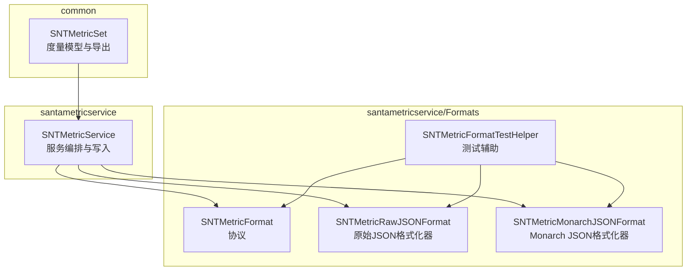
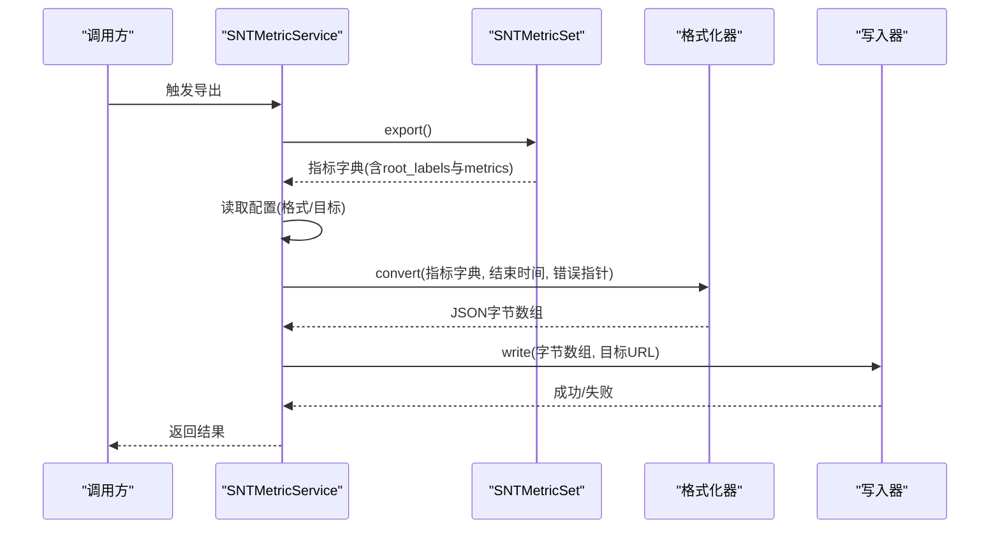
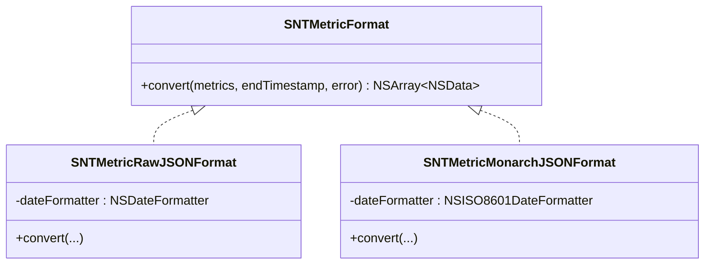
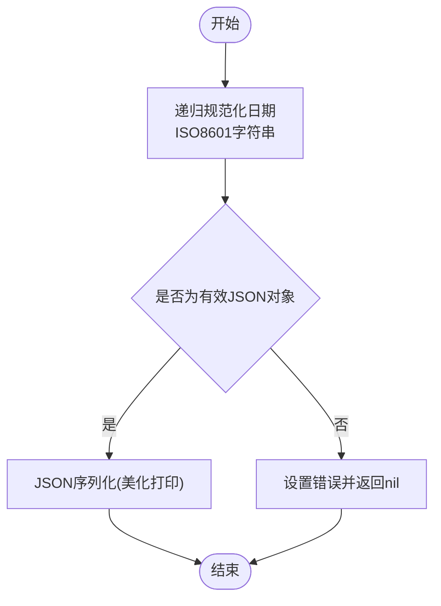
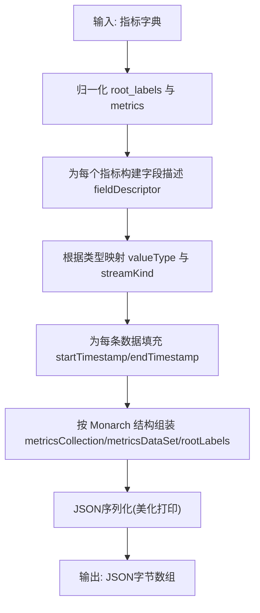
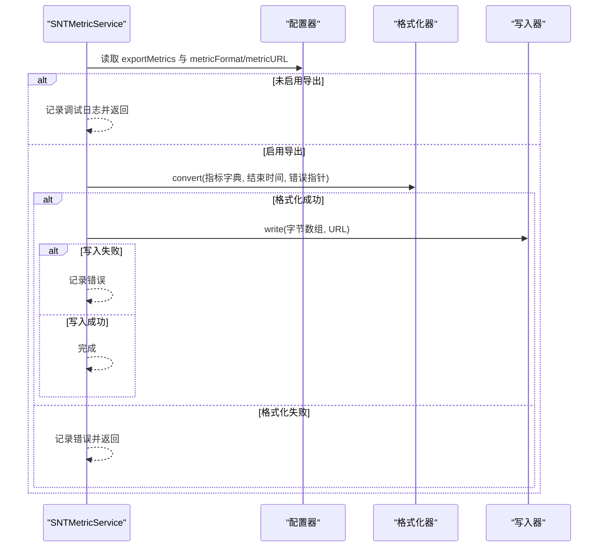
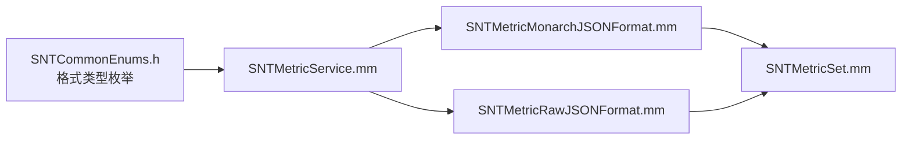

# 指标格式化

<cite>
**本文引用的文件**
- [SNTMetricFormat.h](file://Source/santametricservice/Formats/SNTMetricFormat.h)
- [SNTMetricMonarchJSONFormat.h](file://Source/santametricservice/Formats/SNTMetricMonarchJSONFormat.h)
- [SNTMetricMonarchJSONFormat.mm](file://Source/santametricservice/Formats/SNTMetricMonarchJSONFormat.mm)
- [SNTMetricRawJSONFormat.h](file://Source/santametricservice/Formats/SNTMetricRawJSONFormat.h)
- [SNTMetricRawJSONFormat.mm](file://Source/santametricservice/Formats/SNTMetricRawJSONFormat.mm)
- [SNTMetricMonarchJSONFormatTest.mm](file://Source/santametricservice/Formats/SNTMetricMonarchJSONFormatTest.mm)
- [SNTMetricRawJSONFormatTest.mm](file://Source/santametricservice/Formats/SNTMetricRawJSONFormatTest.mm)
- [SNTMetricFormatTestHelper.h](file://Source/santametricservice/Formats/SNTMetricFormatTestHelper.h)
- [SNTMetricFormatTestHelper.mm](file://Source/santametricservice/Formats/SNTMetricFormatTestHelper.mm)
- [SNTMetricSet.h](file://Source/common/SNTMetricSet.h)
- [SNTMetricSet.mm](file://Source/common/SNTMetricSet.mm)
- [SNTCommonEnums.h](file://Source/common/SNTCommonEnums.h)
- [SNTMetricService.h](file://Source/santametricservice/SNTMetricService.h)
- [SNTMetricService.mm](file://Source/santametricservice/SNTMetricService.mm)
- [monarch.json](file://Source/santametricservice/Formats/testdata/json/monarch.json)
- [test.json](file://Source/santametricservice/Formats/testdata/json/test.json)
</cite>

## 目录
1. [简介](#简介)
2. [项目结构](#项目结构)
3. [核心组件](#核心组件)
4. [架构总览](#架构总览)
5. [详细组件分析](#详细组件分析)
6. [依赖关系分析](#依赖关系分析)
7. [性能考虑](#性能考虑)
8. [故障排查指南](#故障排查指南)
9. [结论](#结论)
10. [附录](#附录)

## 简介
本文件系统性地梳理 Santa 指标格式化子系统，重点覆盖以下方面：
- 指标数据的来源与内部表示：基于 SNTMetricSet 的度量模型与导出字典结构。
- 格式化器接口与实现：SNTMetricFormat 协议、Monarch JSON 格式化器与原始 JSON 格式化器。
- 数据转换流程：从 SNTMetricSet 导出到格式化器，再到最终 JSON 序列化。
- 格式差异与适用场景：Monarch JSON 与原始 JSON 的字段定义、编码规范与使用边界。
- 验证规则与错误处理：类型校验、时间戳规范化、非法输入处理。
- 性能优化与内存管理：对象复用、日期格式化器缓存、避免不必要的拷贝。
- 扩展与兼容性：如何新增自定义格式化器、版本演进与向后兼容策略。

## 项目结构
指标格式化位于 santametricservice 子模块中，围绕“度量模型 → 格式化器 → 写入器”的流水线组织代码；公共度量模型在 common 子模块中。

图示来源
- [SNTMetricSet.h](file://Source/common/SNTMetricSet.h#L1-L203)
- [SNTMetricSet.mm](file://Source/common/SNTMetricSet.mm#L606-L668)
- [SNTMetricFormat.h](file://Source/santametricservice/Formats/SNTMetricFormat.h#L1-L22)
- [SNTMetricRawJSONFormat.h](file://Source/santametricservice/Formats/SNTMetricRawJSONFormat.h#L1-L21)
- [SNTMetricMonarchJSONFormat.h](file://Source/santametricservice/Formats/SNTMetricMonarchJSONFormat.h#L1-L21)
- [SNTMetricService.mm](file://Source/santametricservice/SNTMetricService.mm#L33-L129)

章节来源
- [SNTMetricService.mm](file://Source/santametricservice/SNTMetricService.mm#L33-L129)
- [SNTMetricSet.mm](file://Source/common/SNTMetricSet.mm#L606-L668)

## 核心组件
- SNTMetricFormat 协议：统一的格式化接口，定义了 convert/endTimestamp/error 参数签名，返回 JSON 字节序列数组。
- SNTMetricRawJSONFormat：对任意 NSDictionary 进行日期规范化（ISO8601）与 JSON 序列化，不做结构重写。
- SNTMetricMonarchJSONFormat：将 SNTMetricSet 导出的指标字典转换为 Monarch 友好的集合结构，包含 metricsCollection、metricsDataSet、rootLabels、字段描述、时间戳与值类型等。
- SNTMetricSet：指标注册、回调、导出与日期规范化工具方法。
- SNTMetricService：根据配置选择格式化器与写入器，完成指标导出与落盘/上报。

章节来源
- [SNTMetricFormat.h](file://Source/santametricservice/Formats/SNTMetricFormat.h#L1-L22)
- [SNTMetricRawJSONFormat.mm](file://Source/santametricservice/Formats/SNTMetricRawJSONFormat.mm#L33-L106)
- [SNTMetricMonarchJSONFormat.mm](file://Source/santametricservice/Formats/SNTMetricMonarchJSONFormat.mm#L156-L248)
- [SNTMetricSet.h](file://Source/common/SNTMetricSet.h#L1-L203)
- [SNTMetricSet.mm](file://Source/common/SNTMetricSet.mm#L606-L668)
- [SNTMetricService.mm](file://Source/santametricservice/SNTMetricService.mm#L76-L128)

## 架构总览
指标导出的端到端流程如下：

图示来源
- [SNTMetricService.mm](file://Source/santametricservice/SNTMetricService.mm#L94-L128)
- [SNTMetricSet.mm](file://Source/common/SNTMetricSet.mm#L606-L633)
- [SNTMetricRawJSONFormat.mm](file://Source/santametricservice/Formats/SNTMetricRawJSONFormat.mm#L80-L106)
- [SNTMetricMonarchJSONFormat.mm](file://Source/santametricservice/Formats/SNTMetricMonarchJSONFormat.mm#L223-L248)

## 详细组件分析

### 接口设计与职责分离
- SNTMetricFormat 协议：仅定义统一的 convert 方法签名，便于替换与扩展新的格式化器。
- SNTMetricRawJSONFormat：专注于“原样”序列化，负责将 NSDate 转换为 ISO8601 字符串，确保 JSON 可序列化。
- SNTMetricMonarchJSONFormat：专注于“结构化重写”，将指标字典包装为 Monarch 的集合结构，并进行类型与流类型的映射。

图示来源
- [SNTMetricFormat.h](file://Source/santametricservice/Formats/SNTMetricFormat.h#L1-L22)
- [SNTMetricRawJSONFormat.h](file://Source/santametricservice/Formats/SNTMetricRawJSONFormat.h#L1-L21)
- [SNTMetricMonarchJSONFormat.h](file://Source/santametricservice/Formats/SNTMetricMonarchJSONFormat.h#L1-L21)

章节来源
- [SNTMetricFormat.h](file://Source/santametricservice/Formats/SNTMetricFormat.h#L1-L22)
- [SNTMetricRawJSONFormat.mm](file://Source/santametricservice/Formats/SNTMetricRawJSONFormat.mm#L18-L31)
- [SNTMetricMonarchJSONFormat.mm](file://Source/santametricservice/Formats/SNTMetricMonarchJSONFormat.mm#L41-L53)

### 原始 JSON 格式（Raw JSON）
- 输入：SNTMetricSet.export() 返回的字典，包含 root_labels 与 metrics。
- 处理逻辑：
  - 递归遍历字典，将 NSDate 替换为 ISO8601 字符串（UTC，带毫秒）。
  - 使用 JSON 序列化生成 JSON 字节。
- 输出：单个 JSON 文档的 NSData 数组。

图示来源
- [SNTMetricRawJSONFormat.mm](file://Source/santametricservice/Formats/SNTMetricRawJSONFormat.mm#L33-L106)

章节来源
- [SNTMetricRawJSONFormat.mm](file://Source/santametricservice/Formats/SNTMetricRawJSONFormat.mm#L33-L106)

### Monarch JSON 格式
- 输入：SNTMetricSet.export() 返回的字典。
- 处理逻辑：
  - 归一化：将 root_labels 转换为键值对列表；将每个指标的 fields 展开为数据条目。
  - 类型映射：根据指标类型映射 valueType 与 streamKind；支持 BOOL/INT64/STRING/DOUBLE 与 GAUGE/CUMULATIVE。
  - 字段描述：将多字段名以逗号分隔并在 Monarch 结构中标注 fieldDescriptor。
  - 时间戳：startTimestamp 与 endTimestamp 均为 ISO8601 字符串；endTimestamp 统一更新。
- 输出：符合 Monarch 集合结构的 JSON 文档，包含 metricsCollection、metricsDataSet、rootLabels 等顶层键。

图示来源
- [SNTMetricMonarchJSONFormat.mm](file://Source/santametricservice/Formats/SNTMetricMonarchJSONFormat.mm#L156-L248)

章节来源
- [SNTMetricMonarchJSONFormat.mm](file://Source/santametricservice/Formats/SNTMetricMonarchJSONFormat.mm#L156-L248)

### 数据结构与字段定义
- 原始 JSON（test.json）关键字段
  - metrics: 指标名称到指标定义的映射
  - root_labels: 实体标签键值对
  - 指标定义包含 type、description、fields
  - fields 中的每个条目包含 value、created、last_updated、data
- Monarch JSON（monarch.json）关键字段
  - metricsCollection: 包含一个或多个 metricsDataSet
  - metricsDataSet: 每个指标的集合
  - metricName/description/valueType/streamKind/fieldDescriptor/data
  - data 条目包含 startTimestamp/endTimestamp、可选 field 列表、以及对应类型的值字段（boolValue/int64Value/stringValue/doubleValue）

章节来源
- [test.json](file://Source/santametricservice/Formats/testdata/json/test.json#L1-L119)
- [monarch.json](file://Source/santametricservice/Formats/testdata/json/monarch.json#L1-L165)

### 编码规范与验证规则
- 日期与时区
  - 原始 JSON：使用固定 UTC 格式（ISO8601 毫秒）。
  - Monarch JSON：使用 ISO8601 互联网日期格式（含分数秒）。
- 类型与值
  - Monarch JSON 对 valueType 与 streamKind 有严格映射；未知类型会记录日志但不中断。
  - 原始 JSON 通过 isValidJSONObject 校验，非法输入返回错误。
- 字段完整性
  - Monarch JSON 在缺少 type 或字段不一致时记录日志并跳过该条目。
  - root_labels 被转换为包含 key 与 stringValue 的数组。

章节来源
- [SNTMetricRawJSONFormat.mm](file://Source/santametricservice/Formats/SNTMetricRawJSONFormat.mm#L80-L106)
- [SNTMetricMonarchJSONFormat.mm](file://Source/santametricservice/Formats/SNTMetricMonarchJSONFormat.mm#L55-L154)

### 流程与控制流
- SNTMetricService 根据配置选择格式化器与写入器，若格式化失败或写入失败则记录错误。
- SNTMetricSet.export() 支持注册回调，在导出前更新动态指标值。

图示来源
- [SNTMetricService.mm](file://Source/santametricservice/SNTMetricService.mm#L94-L128)

章节来源
- [SNTMetricService.mm](file://Source/santametricservice/SNTMetricService.mm#L76-L128)
- [SNTMetricSet.mm](file://Source/common/SNTMetricSet.mm#L606-L633)

### 自定义格式化器开发指南
- 实现步骤
  - 遵循 SNTMetricFormat 协议，实现 convert/endTimestamp/error 方法。
  - 在 init 中初始化必要的共享资源（如日期格式化器），减少重复创建。
  - 将输入指标字典转换为目标格式的 JSON 文档，返回包含单个或多个 NSData 的数组。
  - 对非法输入进行显式校验与错误设置，避免返回空 JSON。
- 扩展点
  - 可在 SNTMetricService 中注册新的写入器（如 http/file），并配合新格式化器使用。
  - 可通过 SNTMetricSet 的回调在导出前注入或更新指标值。
- 最佳实践
  - 复用日期格式化器实例，避免频繁分配。
  - 对大字典采用就地修改策略，减少中间副本。
  - 对未知类型与异常路径记录日志，便于定位问题。

章节来源
- [SNTMetricFormat.h](file://Source/santametricservice/Formats/SNTMetricFormat.h#L1-L22)
- [SNTMetricService.mm](file://Source/santametricservice/SNTMetricService.mm#L33-L55)
- [SNTMetricSet.mm](file://Source/common/SNTMetricSet.mm#L610-L633)

## 依赖关系分析
- SNTMetricService 依赖 SNTMetricFormat 的具体实现与写入器。
- SNTMetricMonarchJSONFormat 依赖 SNTMetricSet 的导出结构与类型枚举。
- SNTMetricRawJSONFormat 依赖通用日期规范化工具与 JSON 序列化。
- SNTCommonEnums.h 提供格式类型枚举，驱动服务侧的分支选择。

图示来源
- [SNTCommonEnums.h](file://Source/common/SNTCommonEnums.h#L169-L173)
- [SNTMetricService.mm](file://Source/santametricservice/SNTMetricService.mm#L76-L86)
- [SNTMetricMonarchJSONFormat.mm](file://Source/santametricservice/Formats/SNTMetricMonarchJSONFormat.mm#L156-L248)
- [SNTMetricRawJSONFormat.mm](file://Source/santametricservice/Formats/SNTMetricRawJSONFormat.mm#L80-L106)
- [SNTMetricSet.mm](file://Source/common/SNTMetricSet.mm#L606-L668)

章节来源
- [SNTCommonEnums.h](file://Source/common/SNTCommonEnums.h#L169-L173)
- [SNTMetricService.mm](file://Source/santametricservice/SNTMetricService.mm#L76-L86)

## 性能考虑
- 对象复用
  - Monarch 格式化器在 init 中创建 NSISO8601DateFormatter，避免每次转换重复创建。
  - 原始 JSON 格式化器在 init 中创建 NSDateFormatter，同样减少分配。
- 减少拷贝
  - SNTMetricSet.export() 返回字典后，格式化器尽量采用就地修改与共享引用，降低内存峰值。
- 序列化策略
  - 使用“美化打印”选项便于调试，生产环境可根据需要调整为紧凑格式以节省空间。
- 并发与队列
  - SNTMetricService 使用后台全局队列执行导出任务，避免阻塞主线程。

章节来源
- [SNTMetricMonarchJSONFormat.mm](file://Source/santametricservice/Formats/SNTMetricMonarchJSONFormat.mm#L41-L53)
- [SNTMetricRawJSONFormat.mm](file://Source/santametricservice/Formats/SNTMetricRawJSONFormat.mm#L22-L31)
- [SNTMetricService.mm](file://Source/santametricservice/SNTMetricService.mm#L40-L55)

## 故障排查指南
- 常见错误来源
  - 原始 JSON：输入包含不可序列化对象（非日期/字典/数组），isValidJSONObject 校验失败。
  - Monarch JSON：指标缺少 type、类型未知、字段数量与值数量不匹配、日期格式异常。
- 日志与诊断
  - 格式化器在遇到异常时记录错误日志，服务层捕获并记录详细信息。
  - 测试用例通过金标准 JSON 文件比对，确保输出稳定。
- 快速定位
  - 检查 SNTMetricSet.export() 是否正确注册指标与回调。
  - 确认配置项 exportMetrics、metricFormat、metricURL 是否正确。
  - 对照 monarch.json 与 test.json 的字段差异，核对类型映射与时间戳格式。

章节来源
- [SNTMetricRawJSONFormat.mm](file://Source/santametricservice/Formats/SNTMetricRawJSONFormat.mm#L80-L106)
- [SNTMetricMonarchJSONFormat.mm](file://Source/santametricservice/Formats/SNTMetricMonarchJSONFormat.mm#L55-L154)
- [SNTMetricService.mm](file://Source/santametricservice/SNTMetricService.mm#L107-L128)
- [SNTMetricMonarchJSONFormatTest.mm](file://Source/santametricservice/Formats/SNTMetricMonarchJSONFormatTest.mm#L12-L46)
- [SNTMetricRawJSONFormatTest.mm](file://Source/santametricservice/Formats/SNTMetricRawJSONFormatTest.mm#L11-L41)

## 结论
Santa 的指标格式化体系以协议化接口为核心，结合两类格式化器分别满足“原样序列化”与“结构化输出”的需求。通过 SNTMetricSet 的统一导出与 SNTMetricService 的编排，系统实现了可扩展、可验证且具备良好性能的指标导出能力。Monarch JSON 适配监控平台的结构化要求，而原始 JSON 则适合通用采集与二次加工场景。

## 附录

### 格式对比与适用场景
- 原始 JSON（Raw JSON）
  - 适合：通用采集、快速接入、二次加工。
  - 特点：保持指标字典原貌，仅做日期规范化与序列化。
- Monarch JSON
  - 适合：Google Monarch 生态、结构化监控平台。
  - 特点：标准化集合结构、字段描述、值类型与流类型映射、统一结束时间戳。

章节来源
- [test.json](file://Source/santametricservice/Formats/testdata/json/test.json#L1-L119)
- [monarch.json](file://Source/santametricservice/Formats/testdata/json/monarch.json#L1-L165)

### 版本演进与兼容性
- 类型枚举稳定：SNTMetricType 与 SNTMetricFormatType 的整数值在代码中被数据库与跨模块使用，应避免改动。
- 输出结构演进：Monarch JSON 的字段与结构由外部平台定义，内部实现遵循其约定；新增字段需谨慎并与平台兼容。
- 向后兼容：保留对未知类型的容错处理与日志记录，避免因个别指标异常导致整体导出失败。

章节来源
- [SNTCommonEnums.h](file://Source/common/SNTCommonEnums.h#L169-L173)
- [SNTMetricMonarchJSONFormat.mm](file://Source/santametricservice/Formats/SNTMetricMonarchJSONFormat.mm#L55-L154)