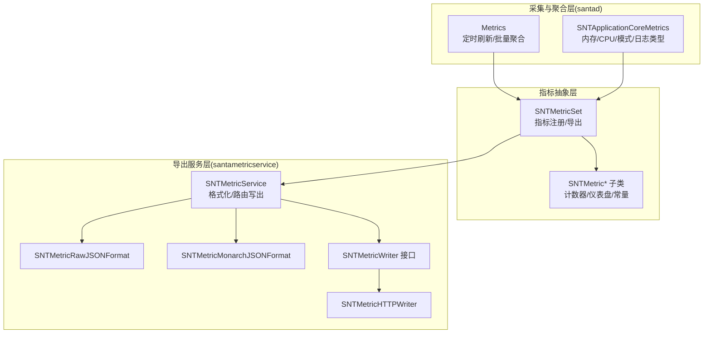
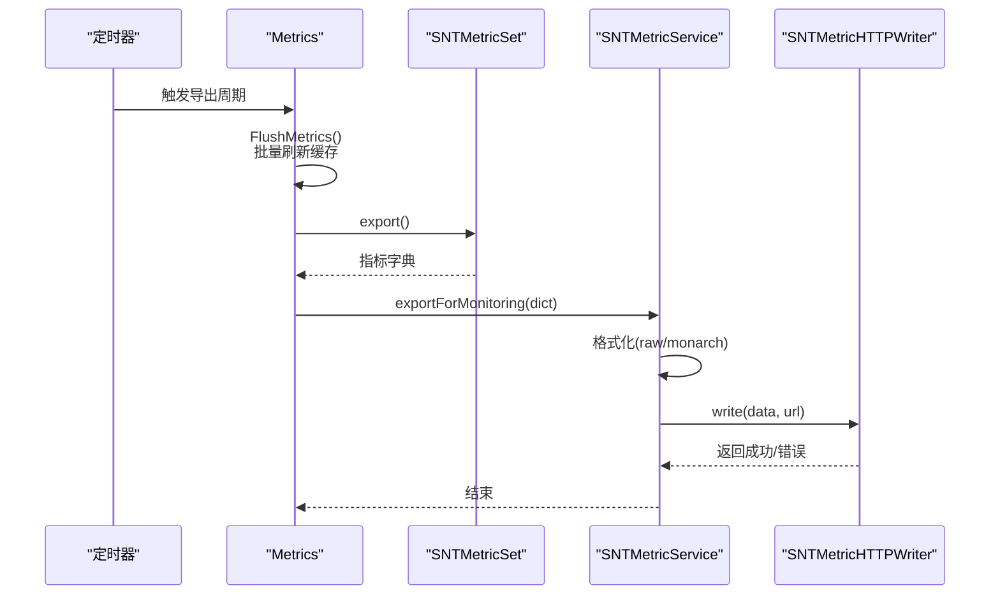
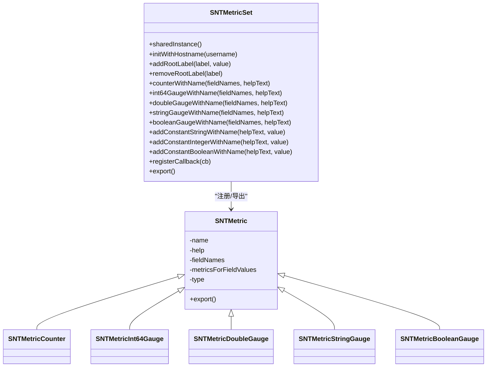
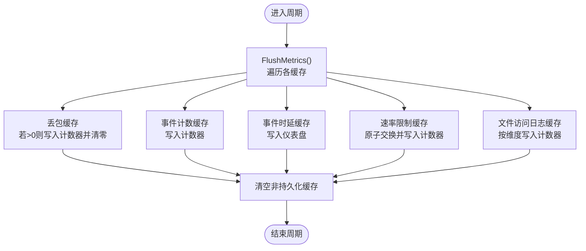
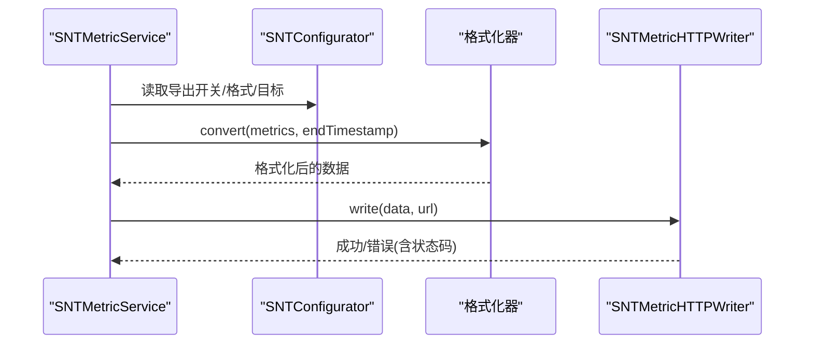
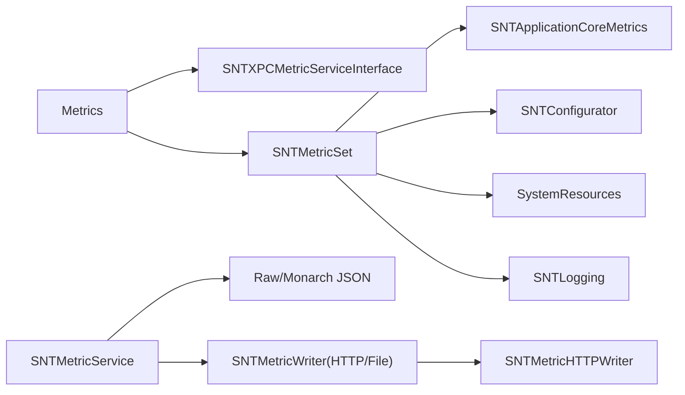

# 指标类型与收集

<cite>
**本文引用的文件**
- [SNTMetricSet.h](file://Source/common/SNTMetricSet.h)
- [SNTMetricSet.mm](file://Source/common/SNTMetricSet.mm)
- [Metrics.h](file://Source/santad/Metrics.h)
- [Metrics.mm](file://Source/santad/Metrics.mm)
- [SNTApplicationCoreMetrics.h](file://Source/santad/SNTApplicationCoreMetrics.h)
- [SNTApplicationCoreMetrics.mm](file://Source/santad/SNTApplicationCoreMetrics.mm)
- [SNTMetricService.h](file://Source/santametricservice/SNTMetricService.h)
- [SNTMetricService.mm](file://Source/santametricservice/SNTMetricService.mm)
- [SNTMetricWriter.h](file://Source/santametricservice/Writers/SNTMetricWriter.h)
- [SNTMetricHTTPWriter.h](file://Source/santametricservice/Writers/SNTMetricHTTPWriter.h)
- [SNTMetricHTTPWriter.mm](file://Source/santametricservice/Writers/SNTMetricHTTPWriter.mm)
- [SNTMetricMonarchJSONFormat.h](file://Source/santametricservice/Formats/SNTMetricMonarchJSONFormat.h)
- [SNTMetricRawJSONFormat.h](file://Source/santametricservice/Formats/SNTMetricRawJSONFormat.h)
- [SNTConfigurator.h](file://Source/common/SNTConfigurator.h)
</cite>

## 目录
1. [简介](#简介)
2. [项目结构](#项目结构)
3. [核心组件](#核心组件)
4. [架构总览](#架构总览)
5. [详细组件分析](#详细组件分析)
6. [依赖关系分析](#依赖关系分析)
7. [性能考量](#性能考量)
8. [故障排查指南](#故障排查指南)
9. [结论](#结论)
10. [附录](#附录)

## 简介
本文件系统性梳理 Santa 中的指标类型与采集机制，覆盖以下方面：
- 指标类型：计数器、整型/双精度/布尔/字符串仪表盘（gauge）、常量标签
- 指标采集：触发条件、采样频率、批量统计与聚合
- 核心应用指标：进程模式、日志类型、内存与 CPU 使用、事件处理时延与丢包、文件访问授权日志计数、速率限制计数
- 数据流转：实时采集、批量刷新、导出与写入
- 最佳实践：命名规范、字段维度设计、数据精度控制
- 性能开销与优化策略

## 项目结构
Santa 的指标体系由“指标抽象层”“采集与聚合层”“导出服务层”三部分组成：
- 指标抽象层：统一的指标注册、命名、字段维度与导出接口
- 采集与聚合层：在守护进程内按周期汇总事件计数、处理时延、丢包、速率限制与文件访问日志计数
- 导出服务层：将指标序列化为监控系统可读格式并通过 HTTP 或文件写出

图表来源
- [SNTMetricSet.h](file://Source/common/SNTMetricSet.h#L39-L202)
- [SNTMetricSet.mm](file://Source/common/SNTMetricSet.mm#L434-L668)
- [Metrics.h](file://Source/santad/Metrics.h#L69-L142)
- [Metrics.mm](file://Source/santad/Metrics.mm#L216-L480)
- [SNTApplicationCoreMetrics.mm](file://Source/santad/SNTApplicationCoreMetrics.mm#L169-L175)
- [SNTMetricService.mm](file://Source/santametricservice/SNTMetricService.mm#L33-L130)
- [SNTMetricRawJSONFormat.h](file://Source/santametricservice/Formats/SNTMetricRawJSONFormat.h#L1-L21)
- [SNTMetricMonarchJSONFormat.h](file://Source/santametricservice/Formats/SNTMetricMonarchJSONFormat.h#L1-L21)
- [SNTMetricWriter.h](file://Source/santametricservice/Writers/SNTMetricWriter.h#L1-L24)
- [SNTMetricHTTPWriter.mm](file://Source/santametricservice/Writers/SNTMetricHTTPWriter.mm#L1-L119)

章节来源
- [SNTMetricSet.h](file://Source/common/SNTMetricSet.h#L39-L202)
- [SNTMetricSet.mm](file://Source/common/SNTMetricSet.mm#L434-L668)
- [Metrics.h](file://Source/santad/Metrics.h#L69-L142)
- [Metrics.mm](file://Source/santad/Metrics.mm#L216-L480)
- [SNTApplicationCoreMetrics.mm](file://Source/santad/SNTApplicationCoreMetrics.mm#L169-L175)
- [SNTMetricService.mm](file://Source/santametricservice/SNTMetricService.mm#L33-L130)
- [SNTMetricHTTPWriter.mm](file://Source/santametricservice/Writers/SNTMetricHTTPWriter.mm#L1-L119)

## 核心组件
- 指标集合与类型
  - 指标集合：集中注册、维护与导出所有指标；支持根级标签、回调注入、重置
  - 指标类型：计数器、整型/双精度/布尔/字符串仪表盘、常量标签
  - 字段维度：通过字段名数组与字段值元组组织多维指标
- 采集与聚合
  - 定时器驱动：周期性导出与刷新
  - 批量聚合：事件计数、处理时延、丢包、速率限制、文件访问日志计数分别缓存后批量写入
- 导出服务
  - 格式化：原始 JSON 与 Monarch JSON
  - 写出：HTTP POST 或文件写入，支持超时与状态码校验

章节来源
- [SNTMetricSet.h](file://Source/common/SNTMetricSet.h#L39-L202)
- [SNTMetricSet.mm](file://Source/common/SNTMetricSet.mm#L434-L668)
- [Metrics.h](file://Source/santad/Metrics.h#L69-L142)
- [Metrics.mm](file://Source/santad/Metrics.mm#L216-L480)
- [SNTMetricService.mm](file://Source/santametricservice/SNTMetricService.mm#L33-L130)

## 架构总览
指标从采集到导出的关键流程如下：

图表来源
- [Metrics.mm](file://Source/santad/Metrics.mm#L319-L323)
- [SNTMetricService.mm](file://Source/santametricservice/SNTMetricService.mm#L94-L129)
- [SNTMetricHTTPWriter.mm](file://Source/santametricservice/Writers/SNTMetricHTTPWriter.mm#L54-L116)

## 详细组件分析

### 指标抽象层（SNTMetricSet 与子类）
- 设计要点
  - 统一指标注册与导出，支持字段维度与时间戳记录
  - 提供回调机制在每次导出前更新动态指标
  - 支持根级标签（如主机名、用户名）统一注入
- 关键能力
  - 计数器：按字段值增量计数
  - 仪表盘：按字段值设置最新值（整型/双精度/布尔/字符串）
  - 常量：无字段的只读标签（版本、启动时间、OS 版本等）

图表来源
- [SNTMetricSet.h](file://Source/common/SNTMetricSet.h#L39-L202)
- [SNTMetricSet.mm](file://Source/common/SNTMetricSet.mm#L182-L292)

章节来源
- [SNTMetricSet.h](file://Source/common/SNTMetricSet.h#L39-L202)
- [SNTMetricSet.mm](file://Source/common/SNTMetricSet.mm#L182-L292)

### 采集与聚合层（Metrics）
- 指标类别
  - 事件处理时延：按处理器与事件类型记录纳秒级处理时间
  - 事件计数：按处理器、事件类型、处置结果（已处理/丢弃）计数
  - 丢包计数：基于序列号差值统计事件丢包数量
  - 速率限制计数：记录文件访问授权日志被限流次数
  - 文件访问日志计数：按策略版本、规则名、状态、操作、决策计数
- 采集与聚合
  - 事件计数与处理时延：每周期将缓存中的计数与最新时延写入对应仪表盘
  - 速率限制计数：使用原子交换一次性取出并清零，避免锁竞争
  - 丢包计数：基于事件与全局序列号计算差值，仅在有新增丢包时写入
  - 文件访问日志计数：按策略维度聚合后写入计数器
- 导出与控制
  - 定时器周期导出，支持启动/停止与间隔调整
  - 首次启动时注册核心指标并建立与导出服务的连接

图表来源
- [Metrics.mm](file://Source/santad/Metrics.mm#L324-L382)

章节来源
- [Metrics.h](file://Source/santad/Metrics.h#L69-L142)
- [Metrics.mm](file://Source/santad/Metrics.mm#L216-L480)

### 导出服务层（SNTMetricService 与 HTTP 写出）
- 服务职责
  - 读取配置决定是否导出与导出格式
  - 将指标字典转换为指定格式（原始 JSON 或 Monarch JSON）
  - 路由写出器（HTTP 或文件），执行实际传输或落盘
- HTTP 写出
  - 使用认证会话，TLS 最低版本、管线化、超时控制
  - 逐条发送，记录最后一条错误与状态码，失败即返回错误

图表来源
- [SNTMetricService.mm](file://Source/santametricservice/SNTMetricService.mm#L94-L129)
- [SNTMetricHTTPWriter.mm](file://Source/santametricservice/Writers/SNTMetricHTTPWriter.mm#L54-L116)

章节来源
- [SNTMetricService.h](file://Source/santametricservice/SNTMetricService.h#L1-L21)
- [SNTMetricService.mm](file://Source/santametricservice/SNTMetricService.mm#L33-L130)
- [SNTMetricHTTPWriter.h](file://Source/santametricservice/Writers/SNTMetricHTTPWriter.h#L1-L21)
- [SNTMetricHTTPWriter.mm](file://Source/santametricservice/Writers/SNTMetricHTTPWriter.mm#L1-L119)

### 核心应用指标（SNTApplicationCoreMetrics）
- 注册内容
  - 进程模式（监控/锁定/独立）
  - 事件日志类型（syslog/file/protobuf 等）
  - 内存：虚拟/驻留大小（字节）
  - CPU：用户态/系统态累计时间（秒）
  - 常量：构建版本、启动时间（微秒）、OS 版本
  - 根级标签：主机名、用户名、作业名、服务名，以及配置扩展标签
- 更新策略
  - 通过回调在每次导出前读取配置与系统信息，确保指标实时反映当前状态

章节来源
- [SNTApplicationCoreMetrics.h](file://Source/santad/SNTApplicationCoreMetrics.h#L1-L23)
- [SNTApplicationCoreMetrics.mm](file://Source/santad/SNTApplicationCoreMetrics.mm#L169-L175)

## 依赖关系分析
- 指标抽象层依赖
  - 字段维度与导出格式：统一由 SNTMetricSet 管理
  - 时间戳与日期格式化：导出时将时间标准化为 ISO8601 字符串
- 采集层依赖
  - XPC 接口：与导出服务通信
  - 配置：导出开关、格式、目标 URL、超时等
  - 系统信息：内存/CPU 采样
- 导出层依赖
  - 写出器：HTTP 或文件
  - 格式化器：原始 JSON 或 Monarch JSON

图表来源
- [Metrics.mm](file://Source/santad/Metrics.mm#L301-L323)
- [SNTMetricService.mm](file://Source/santametricservice/SNTMetricService.mm#L94-L129)
- [SNTApplicationCoreMetrics.mm](file://Source/santad/SNTApplicationCoreMetrics.mm#L82-L116)
- [SNTMetricHTTPWriter.mm](file://Source/santametricservice/Writers/SNTMetricHTTPWriter.mm#L37-L116)

章节来源
- [Metrics.mm](file://Source/santad/Metrics.mm#L301-L323)
- [SNTMetricService.mm](file://Source/santametricservice/SNTMetricService.mm#L94-L129)
- [SNTApplicationCoreMetrics.mm](file://Source/santad/SNTApplicationCoreMetrics.mm#L82-L116)
- [SNTMetricHTTPWriter.mm](file://Source/santametricservice/Writers/SNTMetricHTTPWriter.mm#L37-L116)

## 性能考量
- 采样与导出频率
  - 通过定时器设置导出周期，周期越短，导出压力越大；周期过长可能丢失实时性
  - 建议根据事件吞吐量与监控需求折中选择
- 缓存与批量写入
  - 事件计数与时延采用缓存后批量写入，减少频繁加锁与导出调用
  - 速率限制计数使用原子交换，避免锁竞争
- 写出器与网络
  - HTTP 写出器支持 TLS1.2、管线化与超时控制，建议结合服务端限流与幂等消费
  - 失败重试策略需谨慎，避免放大导出压力
- 指标基数与维度
  - 过多字段组合会导致指标基数膨胀，增加序列化与存储成本
  - 建议合并低频维度或使用常量标签替代

[本节为通用指导，不直接分析具体文件]

## 故障排查指南
- 导出未生效
  - 检查导出开关与格式配置项
  - 查看导出服务日志与写出器返回的错误与状态码
- 指标缺失或异常
  - 确认回调是否注册（核心指标通过回调动态更新）
  - 检查定时器状态（启动/停止/间隔）
- 丢包检测
  - 根据事件与全局序列号差值判断丢包，关注日志中的丢包提示
- HTTP 写出失败
  - 检查服务器可达性、证书与超时设置
  - 关注非 200 状态码与错误信息

章节来源
- [SNTMetricService.mm](file://Source/santametricservice/SNTMetricService.mm#L94-L129)
- [SNTMetricHTTPWriter.mm](file://Source/santametricservice/Writers/SNTMetricHTTPWriter.mm#L91-L116)
- [Metrics.mm](file://Source/santad/Metrics.mm#L422-L464)

## 结论
Santa 的指标体系以统一抽象层为基础，通过守护进程内的定时聚合与导出服务的格式化写出，实现了对运行状态、事件处理性能与系统资源的可观测。通过合理的字段维度设计、批量写入与导出频率控制，可在保证可观测性的同时将开销维持在可控范围。

[本节为总结性内容，不直接分析具体文件]

## 附录

### 指标类型与命名规范
- 类型
  - 计数器：累积事件数量（如事件计数、丢包计数、速率限制计数、文件访问日志计数）
  - 仪表盘（整型/双精度/布尔/字符串）：瞬时或周期性最新值（如事件处理时延、内存/CPU、模式/日志类型）
  - 常量：不可变标签（如版本、启动时间、OS 版本）
- 命名建议
  - 采用分层路径命名（如 /santa/...、/proc/...），便于分类与检索
  - 字段名应语义明确（如 Processor、Event、Disposition、mode）
- 数据精度
  - 时间：纳秒级时延记录，导出时标准化为 ISO8601
  - 内存/CPU：字节与秒级精度，注意单位一致性

章节来源
- [SNTMetricSet.h](file://Source/common/SNTMetricSet.h#L39-L202)
- [SNTMetricSet.mm](file://Source/common/SNTMetricSet.mm#L244-L292)
- [SNTApplicationCoreMetrics.mm](file://Source/santad/SNTApplicationCoreMetrics.mm#L82-L116)
- [Metrics.mm](file://Source/santad/Metrics.mm#L222-L248)

### 采集触发条件与频率
- 触发条件
  - 定时器到期（周期性导出）
  - 首次启动（注册核心指标并建立连接）
- 采样频率
  - 由导出周期决定；事件计数与时延在周期开始前批量刷新
- 聚合方式
  - 事件计数与处理时延：按处理器/事件类型维度累加/更新最新值
  - 丢包：基于序列号差值统计
  - 速率限制与文件访问日志：按策略维度聚合

章节来源
- [Metrics.h](file://Source/santad/Metrics.h#L69-L142)
- [Metrics.mm](file://Source/santad/Metrics.mm#L216-L480)

### 核心应用指标计算逻辑
- 决策缓存命中率
  - 当前代码未直接暴露“决策缓存命中率”指标；可通过事件计数与处置结果维度推导
- 事件处理延迟
  - 以纳秒为单位记录，导出时标准化为 ISO8601 时间戳
- 数据库操作性能
  - 当前指标聚焦于事件处理与系统资源，未见数据库操作专用指标；可通过事件计数与处理时延间接评估

章节来源
- [Metrics.mm](file://Source/santad/Metrics.mm#L222-L248)
- [SNTApplicationCoreMetrics.mm](file://Source/santad/SNTApplicationCoreMetrics.mm#L82-L116)

### 实时收集、批量统计与历史存储
- 实时收集
  - 事件计数与时延在事件处理路径上增量更新
- 批量统计
  - 周期开始时批量刷新缓存并写入指标
- 历史存储
  - 通过导出服务将指标序列化为 JSON 并写出至 HTTP 或文件

章节来源
- [Metrics.mm](file://Source/santad/Metrics.mm#L324-L382)
- [SNTMetricService.mm](file://Source/santametricservice/SNTMetricService.mm#L94-L129)

### 配置项与导出控制
- 导出开关与格式
  - 由配置器提供导出开关、格式类型与目标 URL
- 超时与安全
  - HTTP 写出器设置最小 TLS 协议版本与超时，保障传输安全与稳定性

章节来源
- [SNTConfigurator.h](file://Source/common/SNTConfigurator.h#L624-L649)
- [SNTMetricHTTPWriter.mm](file://Source/santametricservice/Writers/SNTMetricHTTPWriter.mm#L37-L60)