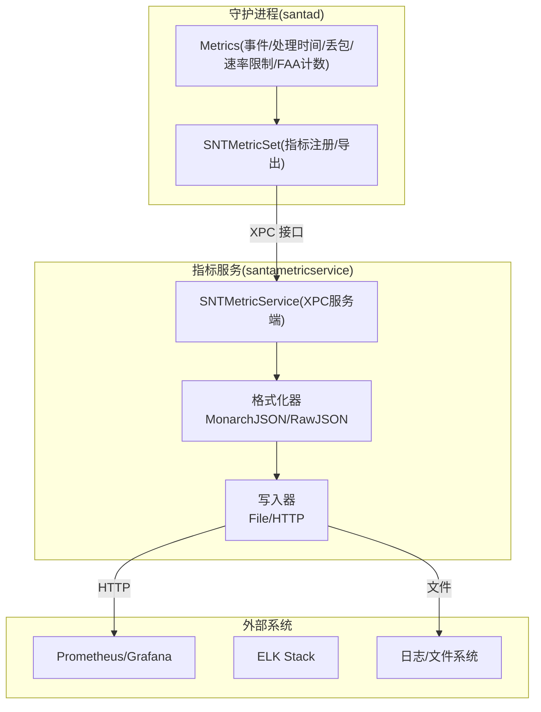
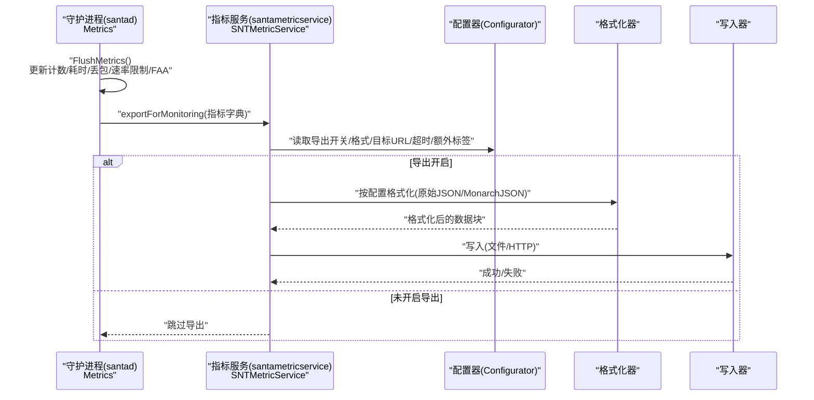
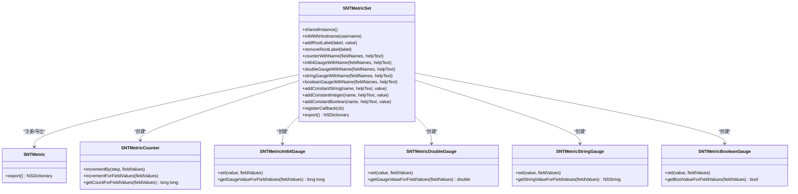
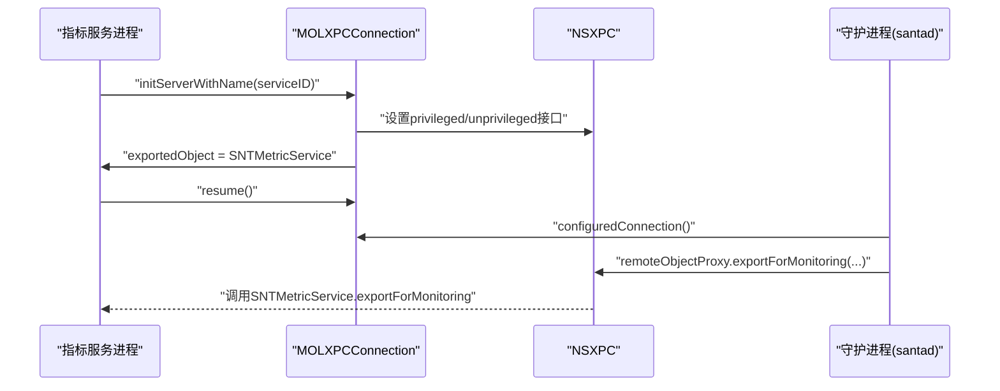
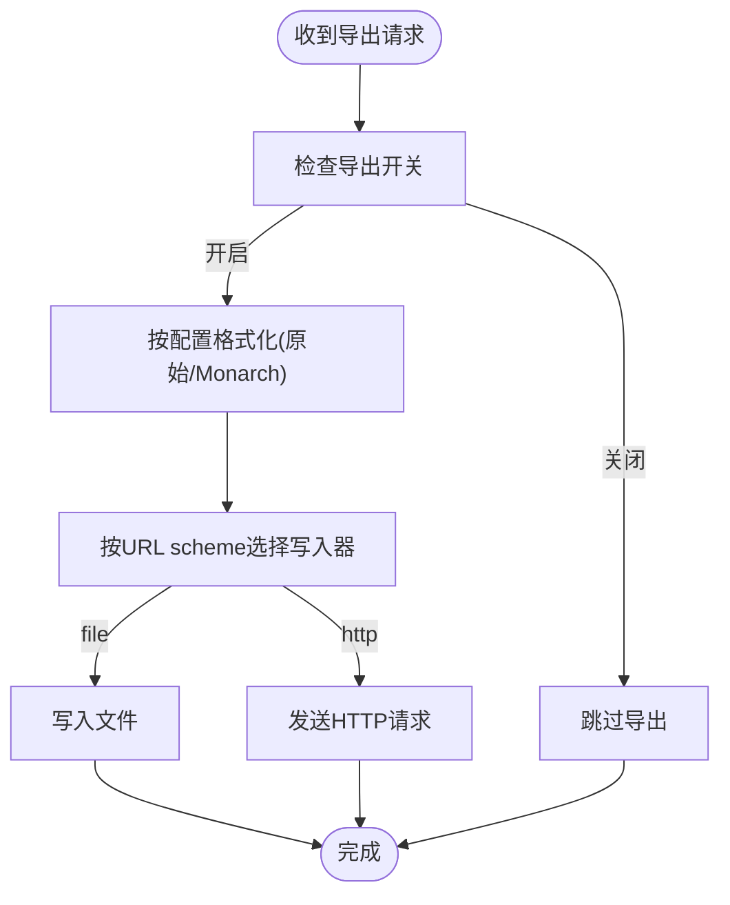
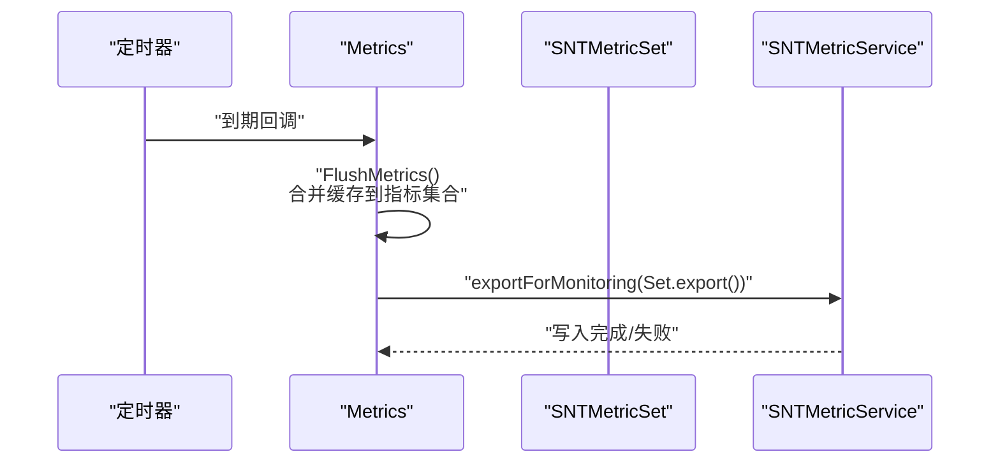
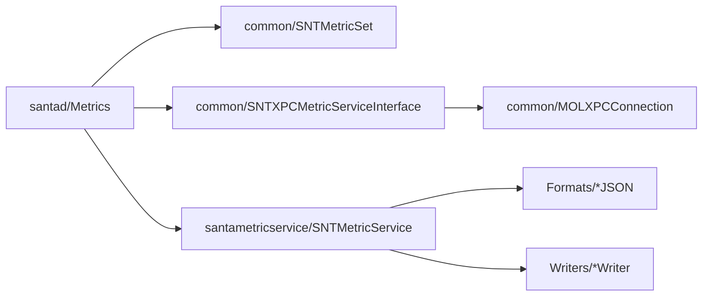

# 监控集成

<cite>
**本文引用的文件**
- [SNTMetricSet.h](file://Source/common/SNTMetricSet.h)
- [SNTMetricSet.mm](file://Source/common/SNTMetricSet.mm)
- [SNTXPCMetricServiceInterface.h](file://Source/common/SNTXPCMetricServiceInterface.h)
- [SNTMetricService.h](file://Source/santametricservice/SNTMetricService.h)
- [SNTMetricService.mm](file://Source/santametricservice/SNTMetricService.mm)
- [SNTMetricServiceTest.mm](file://Source/santametricservice/SNTMetricServiceTest.mm)
- [SNTMetricMonarchJSONFormat.h](file://Source/santametricservice/Formats/SNTMetricMonarchJSONFormat.h)
- [SNTMetricRawJSONFormat.h](file://Source/santametricservice/Formats/SNTMetricRawJSONFormat.h)
- [SNTMetricFileWriter.h](file://Source/santametricservice/Writers/SNTMetricFileWriter.h)
- [SNTMetricHTTPWriter.h](file://Source/santametricservice/Writers/SNTMetricHTTPWriter.h)
- [SNTMetricService 主程序入口](file://Source/santametricservice/main.mm)
- [Metrics.h](file://Source/santad/Metrics.h)
- [Metrics.mm](file://Source/santad/Metrics.mm)
- [MOLXPCConnection.h](file://Source/common/MOLXPCConnection.h)
- [MOLXPCConnection.mm](file://Source/common/MOLXPCConnection.mm)
- [com.northpolesec.santa.metricservice.plist](file://Conf/com.northpolesec.santa.metricservice.plist)
- [metrics-prettyprint.txt](file://Source/santactl/Commands/testdata/metrics-prettyprint.txt)
- [monarch.json](file://Source/santametricservice/Formats/testdata/json/monarch.json)
- [santaconfig.ts](file://docs/src/lib/santaconfig.ts)
</cite>

## 目录
1. [简介](#简介)
2. [项目结构](#项目结构)
3. [核心组件](#核心组件)
4. [架构总览](#架构总览)
5. [详细组件分析](#详细组件分析)
6. [依赖关系分析](#依赖关系分析)
7. [性能考虑](#性能考虑)
8. [故障排查指南](#故障排查指南)
9. [结论](#结论)
10. [附录](#附录)

## 简介
本文件面向Santa监控集成方案，系统化阐述指标服务的系统集成架构、XPC接口设计、服务注册与生命周期管理、部署拓扑与服务发现、与外部监控平台（Prometheus、Grafana、ELK Stack）的对接方式、告警与通知机制、仪表板与可视化方案、数据聚合与趋势预测、容量规划支持，以及维护策略、性能调优与故障排查。

## 项目结构
Santa监控体系由三部分组成：
- 指标采集与导出：位于守护进程侧，负责事件统计、速率限制、丢包检测、文件访问授权计数等，并周期性导出到指标服务。
- 指标服务：独立的用户态服务，通过XPC暴露接口，接收来自守护进程的指标数据，按配置格式化并写入文件或HTTP目标。
- 配置与部署：通过Plist服务注册、Launchd启动、配置项控制导出开关、格式与目标、超时与标签等。

图示来源
- [Metrics.mm](file://Source/santad/Metrics.mm#L301-L322)
- [SNTMetricService.mm](file://Source/santametricservice/SNTMetricService.mm#L94-L128)
- [SNTMetricMonarchJSONFormat.h](file://Source/santametricservice/Formats/SNTMetricMonarchJSONFormat.h#L1-L21)
- [SNTMetricRawJSONFormat.h](file://Source/santametricservice/Formats/SNTMetricRawJSONFormat.h#L1-L21)
- [SNTMetricFileWriter.h](file://Source/santametricservice/Writers/SNTMetricFileWriter.h#L1-L18)
- [SNTMetricHTTPWriter.h](file://Source/santametricservice/Writers/SNTMetricHTTPWriter.h#L1-L21)

章节来源
- [SNTMetricService 主程序入口](file://Source/santametricservice/main.mm#L24-L41)
- [com.northpolesec.santa.metricservice.plist](file://Conf/com.northpolesec.santa.metricservice.plist#L1-L27)

## 核心组件
- 指标集合与类型
  - SNTMetricSet：统一注册与导出指标，支持根标签、回调、日期标准化、多种指标类型（计数器、整型/双精度/字符串/布尔仪表盘）。
  - 关键能力：命名空间化的指标名、字段维度、时间戳规范化、线程安全更新。
- XPC接口与连接
  - SNTMetricServiceXPC协议：定义exportForMonitoring方法，供守护进程调用。
  - SNTXPCMetricServiceInterface：提供XPC接口描述、服务ID、已配置连接工厂。
  - MOLXPCConnection：封装XPC连接建立、鉴权、失效处理、超时等待。
- 指标服务实现
  - SNTMetricService：根据配置选择格式化器与写入器，将指标序列化后输出至文件或HTTP。
- 守护进程指标模块
  - Metrics：周期性汇总事件计数、处理耗时、丢包、速率限制、FAA事件，通过XPC发送给指标服务。
- 写入与格式化
  - MonarchJSON/RawJSON格式化器：将SNTMetricSet导出字典转换为监控平台可消费格式。
  - File/HTTP写入器：分别落地文件或推送HTTP端点。

章节来源
- [SNTMetricSet.h](file://Source/common/SNTMetricSet.h#L39-L202)
- [SNTMetricSet.mm](file://Source/common/SNTMetricSet.mm#L434-L668)
- [SNTXPCMetricServiceInterface.h](file://Source/common/SNTXPCMetricServiceInterface.h#L20-L52)
- [MOLXPCConnection.h](file://Source/common/MOLXPCConnection.h#L149-L163)
- [MOLXPCConnection.mm](file://Source/common/MOLXPCConnection.mm#L84-L175)
- [SNTMetricService.h](file://Source/santametricservice/SNTMetricService.h#L15-L21)
- [SNTMetricService.mm](file://Source/santametricservice/SNTMetricService.mm#L40-L128)
- [Metrics.h](file://Source/santad/Metrics.h#L69-L142)
- [Metrics.mm](file://Source/santad/Metrics.mm#L216-L323)

## 架构总览
下图展示了从守护进程采集到指标服务导出的关键交互流程。

图示来源
- [Metrics.mm](file://Source/santad/Metrics.mm#L319-L322)
- [SNTMetricService.mm](file://Source/santametricservice/SNTMetricService.mm#L94-L128)

章节来源
- [SNTMetricService.mm](file://Source/santametricservice/SNTMetricService.mm#L67-L128)
- [Metrics.mm](file://Source/santad/Metrics.mm#L313-L322)

## 详细组件分析

### 指标集合与导出（SNTMetricSet）
- 设计要点
  - 支持常量与仪表盘指标，按字段维度分组存储。
  - 提供回调在每次导出前刷新指标值，确保实时性。
  - 导出字典包含root_labels与metrics，便于下游解析。
  - 日期标准化为ISO8601字符串，提升跨系统一致性。
- 数据结构与复杂度
  - 字典映射字段值到指标值对象，线程安全加锁，适合高并发写入场景。
  - 导出遍历所有指标，时间复杂度O(N)；字段维度越多，内部枚举开销增加。

图示来源
- [SNTMetricSet.h](file://Source/common/SNTMetricSet.h#L39-L202)
- [SNTMetricSet.mm](file://Source/common/SNTMetricSet.mm#L434-L668)

章节来源
- [SNTMetricSet.h](file://Source/common/SNTMetricSet.h#L84-L192)
- [SNTMetricSet.mm](file://Source/common/SNTMetricSet.mm#L501-L668)

### XPC接口与服务生命周期
- 接口设计
  - SNTMetricServiceXPC：单方法exportForMonitoring，参数为SNTMetricSet导出的字典。
  - SNTXPCMetricServiceInterface：提供XPC接口描述、服务ID、已配置连接工厂。
- 连接与鉴权
  - MOLXPCConnection：支持以服务名或Mach服务名建立连接，具备超时等待与失效处理。
  - 守护进程侧通过SNTXPCMetricServiceInterface获取已配置连接并resume。
- 服务注册与启动
  - Launchd通过Plist注册Mach服务，随应用加载自动启动并保持存活。
  - 指标服务主程序初始化XPC监听、设置接口、导出对象并进入RunLoop。

图示来源
- [SNTMetricService 主程序入口](file://Source/santametricservice/main.mm#L24-L41)
- [SNTXPCMetricServiceInterface.h](file://Source/common/SNTXPCMetricServiceInterface.h#L31-L52)
- [MOLXPCConnection.mm](file://Source/common/MOLXPCConnection.mm#L84-L175)
- [Metrics.mm](file://Source/santad/Metrics.mm#L301-L322)

章节来源
- [SNTXPCMetricServiceInterface.h](file://Source/common/SNTXPCMetricServiceInterface.h#L20-L52)
- [MOLXPCConnection.h](file://Source/common/MOLXPCConnection.h#L149-L163)
- [MOLXPCConnection.mm](file://Source/common/MOLXPCConnection.mm#L84-L175)
- [com.northpolesec.santa.metricservice.plist](file://Conf/com.northpolesec.santa.metricservice.plist#L1-L27)
- [SNTMetricService 主程序入口](file://Source/santametricservice/main.mm#L24-L41)

### 指标服务导出流程
- 条件判断：若未开启导出则直接返回；否则进行格式化与写入。
- 格式化：根据配置选择RawJSON或MonarchJSON格式。
- 写入：依据URL scheme选择文件或HTTP写入器。
- 错误处理：记录错误信息并返回，不影响守护进程主流程。

图示来源
- [SNTMetricService.mm](file://Source/santametricservice/SNTMetricService.mm#L94-L128)

章节来源
- [SNTMetricService.mm](file://Source/santametricservice/SNTMetricService.mm#L67-L128)
- [SNTMetricServiceTest.mm](file://Source/santametricservice/SNTMetricServiceTest.mm#L93-L138)

### 守护进程指标模块（Metrics）
- 指标来源
  - 事件计数、处理耗时、丢包检测、速率限制、FAA事件计数。
- 缓存与刷新
  - 使用独立队列缓存增量，定时器触发FlushMetrics，再批量写入SNTMetricSet。
- XPC导出
  - 通过远程代理调用指标服务的exportForMonitoring，实现解耦与可靠性。

图示来源
- [Metrics.mm](file://Source/santad/Metrics.mm#L216-L267)
- [Metrics.mm](file://Source/santad/Metrics.mm#L319-L322)

章节来源
- [Metrics.h](file://Source/santad/Metrics.h#L69-L142)
- [Metrics.mm](file://Source/santad/Metrics.mm#L216-L323)

## 依赖关系分析
- 组件耦合
  - 守护进程Metrics依赖SNTMetricSet与XPC接口，低耦合通过接口抽象实现。
  - 指标服务通过格式化器与写入器扩展性强，新增格式/目标只需实现对应协议。
- 外部依赖
  - Launchd服务注册与Mach服务通信。
  - Foundation与Dispatch框架用于异步与定时任务。
- 循环依赖
  - 无直接循环依赖；XPC接口为单向调用。

图示来源
- [Metrics.mm](file://Source/santad/Metrics.mm#L301-L322)
- [SNTMetricService.mm](file://Source/santametricservice/SNTMetricService.mm#L40-L86)

章节来源
- [Metrics.mm](file://Source/santad/Metrics.mm#L301-L322)
- [SNTMetricService.mm](file://Source/santametricservice/SNTMetricService.mm#L40-L86)

## 性能考虑
- 导出频率
  - 通过配置项控制导出间隔，避免频繁IO与网络开销。
- 写入器选择
  - 文件写入适合离线收集与批处理；HTTP写入适合实时监控系统。
- 线程模型
  - 指标采集与导出分离队列，降低阻塞风险。
- 资源降噪
  - 丢包检测基于序列号差值，避免重复统计与抖动。

章节来源
- [Metrics.mm](file://Source/santad/Metrics.mm#L384-L408)
- [santaconfig.ts](file://docs/src/lib/santaconfig.ts#L723-L741)

## 故障排查指南
- 常见问题定位
  - 导出未生效：确认导出开关、格式、目标URL是否正确配置。
  - 写入失败：查看错误日志，检查HTTP可达性或文件权限。
  - XPC连接异常：关注连接失效与重连日志，验证签名匹配与Mach服务可用。
- 日志与诊断
  - 启动版本日志、导出开关状态、格式化错误、写入错误均有明确日志输出。
  - 测试用例覆盖默认不导出、文件写入、HTTP写入等场景，便于对照验证。

章节来源
- [SNTMetricService.mm](file://Source/santametricservice/SNTMetricService.mm#L67-L128)
- [SNTMetricService 主程序入口](file://Source/santametricservice/main.mm#L24-L41)
- [SNTMetricServiceTest.mm](file://Source/santametricservice/SNTMetricServiceTest.mm#L93-L138)

## 结论
Santa监控集成通过清晰的指标抽象、稳定的XPC接口与灵活的导出策略，实现了从内核事件到外部监控平台的可靠链路。结合配置化导出、格式化与写入器扩展，可无缝对接Prometheus、Grafana与ELK等生态工具，满足可观测性与运维需求。

## 附录

### 部署拓扑与服务发现
- 服务注册
  - 通过Launchd Plist注册Mach服务，随应用加载并保持常驻。
- 服务发现
  - 守护进程使用MOLXPCConnection的已配置连接工厂，按服务ID建立连接。
- 负载均衡与高可用
  - 当前实现为单实例指标服务；可通过多实例与外部负载均衡器（如反向代理）实现高可用。

章节来源
- [com.northpolesec.santa.metricservice.plist](file://Conf/com.northpolesec.santa.metricservice.plist#L1-L27)
- [SNTXPCMetricServiceInterface.h](file://Source/common/SNTXPCMetricServiceInterface.h#L31-L52)
- [MOLXPCConnection.mm](file://Source/common/MOLXPCConnection.mm#L84-L175)

### 与外部监控平台集成方案
- Prometheus
  - 使用HTTP写入器将指标推送到Prometheus Pushgateway或通过Exporter适配。
  - MonarchJSON格式更贴近Prometheus时间序列模型，便于解析与入库。
- Grafana
  - 作为Prometheus的可视化前端，可直接展示指标面板与告警。
- ELK Stack
  - 将Monarch/原始JSON写入文件，由Logstash/Beats采集，经Elasticsearch索引，Kibana展示。

章节来源
- [SNTMetricHTTPWriter.h](file://Source/santametricservice/Writers/SNTMetricHTTPWriter.h#L1-L21)
- [SNTMetricMonarchJSONFormat.h](file://Source/santametricservice/Formats/SNTMetricMonarchJSONFormat.h#L1-L21)
- [monarch.json](file://Source/santametricservice/Formats/testdata/json/monarch.json#L1-L53)

### 告警与通知配置
- 阈值设置
  - 在监控系统侧针对事件计数、丢包率、处理耗时、速率限制等指标设置阈值。
- 通知机制
  - Prometheus Alertmanager与Grafana告警通道联动，结合邮件/IM/电话等通知渠道。
- 仪表板设计
  - 事件处理耗时热力图、事件计数趋势、丢包率与速率限制柱状图、FAA决策分布饼图。

章节来源
- [metrics-prettyprint.txt](file://Source/santactl/Commands/testdata/metrics-prettyprint.txt#L1-L28)

### 数据聚合、趋势预测与容量规划
- 聚合分析
  - 按处理器、事件类型、处置结果、字段维度进行聚合，识别热点与异常。
- 趋势预测
  - 基于历史窗口计算移动平均、同比/环比，辅助容量与资源规划。
- 容量规划
  - 评估事件峰值、导出频率与目标吞吐，预留冗余与弹性扩容。

章节来源
- [SNTMetricSet.h](file://Source/common/SNTMetricSet.h#L84-L192)
- [SNTMetricSet.mm](file://Source/common/SNTMetricSet.mm#L501-L668)

### 维护策略与性能调优
- 维护策略
  - 定期校验导出配置、格式兼容性与目标可达性。
  - 对接新监控平台时优先采用MonarchJSON格式，保证字段语义一致。
- 性能调优
  - 调整导出间隔与缓冲队列大小，平衡实时性与系统开销。
  - 优化HTTP写入超时与重试策略，避免阻塞守护进程主流程。

章节来源
- [Metrics.mm](file://Source/santad/Metrics.mm#L384-L408)
- [SNTMetricService.mm](file://Source/santametricservice/SNTMetricService.mm#L94-L128)
- [santaconfig.ts](file://docs/src/lib/santaconfig.ts#L723-L741)