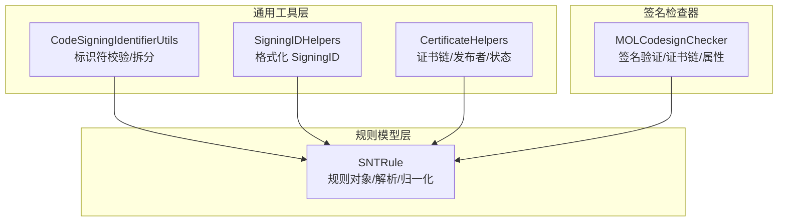
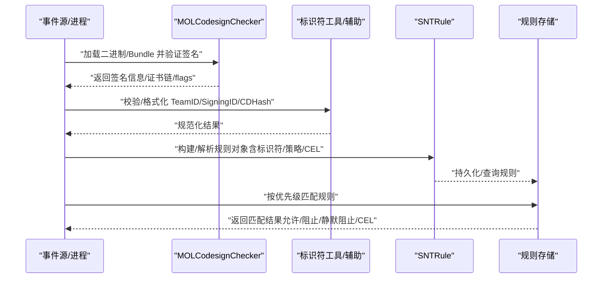
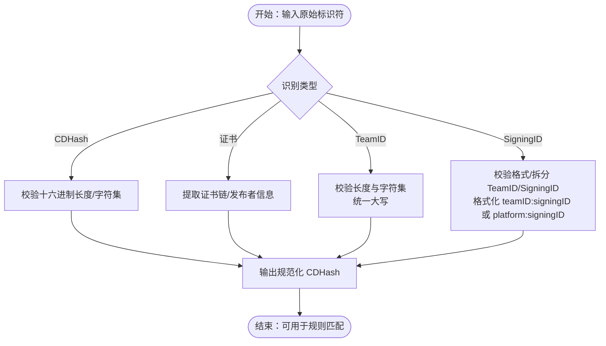
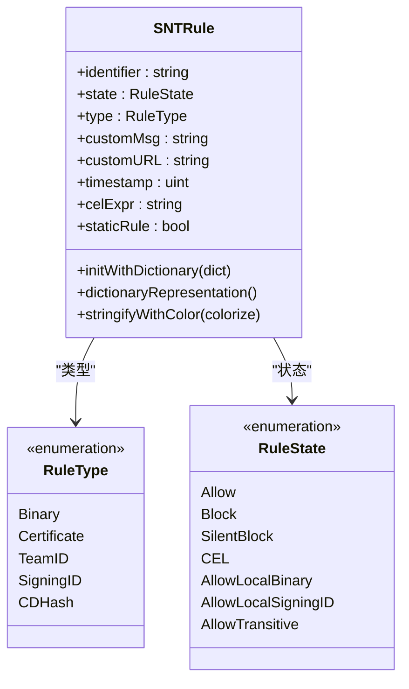
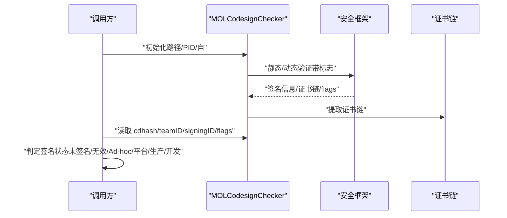
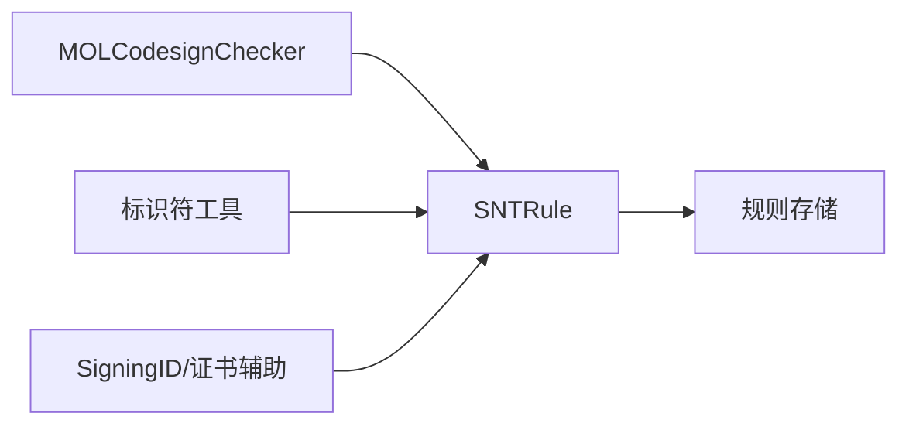

# 代码签名规则

<cite>
**本文引用的文件**
- [Source/common/CodeSigningIdentifierUtils.h](file://Source/common/CodeSigningIdentifierUtils.h)
- [Source/common/CodeSigningIdentifierUtils.mm](file://Source/common/CodeSigningIdentifierUtils.mm)
- [Source/common/SigningIDHelpers.h](file://Source/common/SigningIDHelpers.h)
- [Source/common/SigningIDHelpers.mm](file://Source/common/SigningIDHelpers.mm)
- [Source/common/CertificateHelpers.h](file://Source/common/CertificateHelpers.h)
- [Source/common/CertificateHelpers.mm](file://Source/common/CertificateHelpers.mm)
- [Source/common/MOLCodesignChecker.h](file://Source/common/MOLCodesignChecker.h)
- [Source/common/MOLCodesignChecker.mm](file://Source/common/MOLCodesignChecker.mm)
- [Source/common/SNTRule.h](file://Source/common/SNTRule.h)
- [Source/common/SNTRule.mm](file://Source/common/SNTRule.mm)
</cite>

## 目录
1. [引言](#引言)
2. [项目结构](#项目结构)
3. [核心组件](#核心组件)
4. [架构总览](#架构总览)
5. [组件详解](#组件详解)
6. [依赖关系分析](#依赖关系分析)
7. [性能考量](#性能考量)
8. [故障排查指南](#故障排查指南)
9. [结论](#结论)
10. [附录](#附录)

## 引言
本技术文档围绕 Santa 的代码签名规则系统，系统性阐述四种代码签名标识符（CDHash、证书指纹、TeamID、SigningID）的工作原理、匹配机制、优先级与性能特征，并结合证书链验证与信任根管理，给出规则创建最佳实践、常见匹配模式、调试技巧、测试方法、批量导入与规则优化策略。文档面向不同技术背景的读者，既提供高层概览，也包含代码级细节与可视化图示，便于快速定位实现位置与扩展点。

## 项目结构
Santa 将“代码签名规则”相关能力分布在通用工具层与规则模型层：
- 通用工具层：负责标识符校验、规范化与格式化（如 SigningID 格式化），以及证书链辅助函数（发布者信息、生产证书判定、签名状态）。
- 规则模型层：定义规则对象及其解析、归一化与序列化逻辑，支撑不同类型的规则标识符（二进制哈希、证书指纹、TeamID、SigningID、CDHash）。
- 签名检查器：封装对磁盘或运行中二进制的签名验证、证书链获取、签名标志与时间戳等关键属性。

**图表来源**
- [Source/common/CodeSigningIdentifierUtils.h](file://Source/common/CodeSigningIdentifierUtils.h#L1-L44)
- [Source/common/CodeSigningIdentifierUtils.mm](file://Source/common/CodeSigningIdentifierUtils.mm#L1-L63)
- [Source/common/SigningIDHelpers.h](file://Source/common/SigningIDHelpers.h#L1-L33)
- [Source/common/SigningIDHelpers.mm](file://Source/common/SigningIDHelpers.mm#L1-L35)
- [Source/common/CertificateHelpers.h](file://Source/common/CertificateHelpers.h#L1-L68)
- [Source/common/CertificateHelpers.mm](file://Source/common/CertificateHelpers.mm#L1-L104)
- [Source/common/SNTRule.h](file://Source/common/SNTRule.h#L1-L129)
- [Source/common/SNTRule.mm](file://Source/common/SNTRule.mm#L1-L558)
- [Source/common/MOLCodesignChecker.h](file://Source/common/MOLCodesignChecker.h#L1-L210)
- [Source/common/MOLCodesignChecker.mm](file://Source/common/MOLCodesignChecker.mm#L1-L453)

**章节来源**
- [Source/common/CodeSigningIdentifierUtils.h](file://Source/common/CodeSigningIdentifierUtils.h#L1-L44)
- [Source/common/CodeSigningIdentifierUtils.mm](file://Source/common/CodeSigningIdentifierUtils.mm#L1-L63)
- [Source/common/SigningIDHelpers.h](file://Source/common/SigningIDHelpers.h#L1-L33)
- [Source/common/SigningIDHelpers.mm](file://Source/common/SigningIDHelpers.mm#L1-L35)
- [Source/common/CertificateHelpers.h](file://Source/common/CertificateHelpers.h#L1-L68)
- [Source/common/CertificateHelpers.mm](file://Source/common/CertificateHelpers.mm#L1-L104)
- [Source/common/SNTRule.h](file://Source/common/SNTRule.h#L1-L129)
- [Source/common/SNTRule.mm](file://Source/common/SNTRule.mm#L1-L558)
- [Source/common/MOLCodesignChecker.h](file://Source/common/MOLCodesignChecker.h#L1-L210)
- [Source/common/MOLCodesignChecker.mm](file://Source/common/MOLCodesignChecker.mm#L1-L453)

## 核心组件
- 标识符工具：提供 TeamID/SigningID/CDHash 的合法性校验与拆分；定义平台 TeamID 前缀常量。
- SigningID 辅助：将签名检查器中的 teamID 与 signingID 统一格式化为 teamID:signingID，或在平台二进制场景使用 platform:signingID。
- 证书辅助：从证书链提取发布者信息、判断是否为生产签名证书、根据错误与标志推导签名状态。
- 规则模型：统一解析/归一化规则字典，支持多种规则类型（二进制、证书、TeamID、SigningID、CDHash），并进行大小写/长度/格式规范化。
- 签名检查器：封装对磁盘/内存二进制的签名验证，暴露 cdhash、teamID、signingID、证书链、签名标志、时间戳等属性。

**章节来源**
- [Source/common/CodeSigningIdentifierUtils.h](file://Source/common/CodeSigningIdentifierUtils.h#L1-L44)
- [Source/common/CodeSigningIdentifierUtils.mm](file://Source/common/CodeSigningIdentifierUtils.mm#L1-L63)
- [Source/common/SigningIDHelpers.h](file://Source/common/SigningIDHelpers.h#L1-L33)
- [Source/common/SigningIDHelpers.mm](file://Source/common/SigningIDHelpers.mm#L1-L35)
- [Source/common/CertificateHelpers.h](file://Source/common/CertificateHelpers.h#L1-L68)
- [Source/common/CertificateHelpers.mm](file://Source/common/CertificateHelpers.mm#L1-L104)
- [Source/common/SNTRule.h](file://Source/common/SNTRule.h#L1-L129)
- [Source/common/SNTRule.mm](file://Source/common/SNTRule.mm#L1-L558)
- [Source/common/MOLCodesignChecker.h](file://Source/common/MOLCodesignChecker.h#L1-L210)
- [Source/common/MOLCodesignChecker.mm](file://Source/common/MOLCodesignChecker.mm#L1-L453)

## 架构总览
Santa 的代码签名规则系统以“签名检查器”为核心输入，通过“标识符工具/辅助”完成标准化，再由“规则模型”统一解析与存储，最终用于执行匹配与决策。

**图表来源**
- [Source/common/MOLCodesignChecker.h](file://Source/common/MOLCodesignChecker.h#L1-L210)
- [Source/common/MOLCodesignChecker.mm](file://Source/common/MOLCodesignChecker.mm#L1-L453)
- [Source/common/CodeSigningIdentifierUtils.h](file://Source/common/CodeSigningIdentifierUtils.h#L1-L44)
- [Source/common/CodeSigningIdentifierUtils.mm](file://Source/common/CodeSigningIdentifierUtils.mm#L1-L63)
- [Source/common/SigningIDHelpers.h](file://Source/common/SigningIDHelpers.h#L1-L33)
- [Source/common/SigningIDHelpers.mm](file://Source/common/SigningIDHelpers.mm#L1-L35)
- [Source/common/SNTRule.h](file://Source/common/SNTRule.h#L1-L129)
- [Source/common/SNTRule.mm](file://Source/common/SNTRule.mm#L1-L558)

## 组件详解

### 四种代码签名标识符与匹配机制
- CDHash
  - 定义与用途：基于安全框架的二进制唯一哈希，用于精确匹配二进制内容。
  - 校验规则：十六进制字符串，长度与安全框架常量一致。
  - 匹配特性：强匹配，适合“二进制级别”的白名单/黑名单。
- 证书指纹（证书链）
  - 定义与用途：通过证书链（尤其是叶子证书）进行发布者级别的匹配。
  - 校验规则：由证书辅助模块提供证书链与发布者信息提取。
  - 匹配特性：跨二进制可复用，适合组织级发布者控制。
- TeamID
  - 定义与用途：开发者团队标识，长度固定且字母数字组成。
  - 校验规则：长度与字符集校验，统一大写。
  - 匹配特性：适合按团队维度的策略控制。
- SigningID
  - 定义与用途：开发者提供的签名标识，通常与 TeamID 组合为 teamID:signingID。
  - 格式化规则：若无 TeamID 则在平台二进制场景使用 platform:signingID；否则使用实际 TeamID。
  - 校验规则：支持“platform:SigningID”前缀与“TeamID:SigningID”两种形式，TeamID 长度与字符集校验，大小写规范化。
  - 匹配特性：细粒度到开发者/应用级别，适合精细化授权。

**图表来源**
- [Source/common/CodeSigningIdentifierUtils.h](file://Source/common/CodeSigningIdentifierUtils.h#L1-L44)
- [Source/common/CodeSigningIdentifierUtils.mm](file://Source/common/CodeSigningIdentifierUtils.mm#L1-L63)
- [Source/common/SigningIDHelpers.h](file://Source/common/SigningIDHelpers.h#L1-L33)
- [Source/common/SigningIDHelpers.mm](file://Source/common/SigningIDHelpers.mm#L1-L35)
- [Source/common/CertificateHelpers.h](file://Source/common/CertificateHelpers.h#L1-L68)
- [Source/common/CertificateHelpers.mm](file://Source/common/CertificateHelpers.mm#L1-L104)

**章节来源**
- [Source/common/CodeSigningIdentifierUtils.h](file://Source/common/CodeSigningIdentifierUtils.h#L1-L44)
- [Source/common/CodeSigningIdentifierUtils.mm](file://Source/common/CodeSigningIdentifierUtils.mm#L1-L63)
- [Source/common/SigningIDHelpers.h](file://Source/common/SigningIDHelpers.h#L1-L33)
- [Source/common/SigningIDHelpers.mm](file://Source/common/SigningIDHelpers.mm#L1-L35)
- [Source/common/CertificateHelpers.h](file://Source/common/CertificateHelpers.h#L1-L68)
- [Source/common/CertificateHelpers.mm](file://Source/common/CertificateHelpers.mm#L1-L104)

### 规则模型与优先级
- 规则类型与标识符
  - 二进制：二进制 SHA-256（小写十六进制）。
  - 证书：证书指纹（小写十六进制）。
  - TeamID：10 字母数字（大写）。
  - SigningID：teamID:signingID 或 platform:signingID（teamID 大写或 platform 小写）。
  - CDHash：安全框架 CDHash 长度的十六进制（小写）。
- 解析与归一化
  - 规则字典解析时会进行键名小写化、策略与类型的大写化，确保一致性。
  - 对于缺失标识符的情况，可回退到其他字段（如 SHA-256）。
- 优先级与匹配顺序
  - 在执行阶段，建议遵循以下优先级（从高到低）：
    1) 明确的二进制规则（SHA-256）。
    2) 明确的 CDHash 规则。
    3) 明确的 SigningID 规则（teamID:signingID 或 platform:signingID）。
    4) 明确的 TeamID 规则。
    5) 明确的证书规则（证书指纹）。
    6) 通用规则（如 CEL 表达式）。
  - 若存在多条规则命中，应以“最具体”的规则为准；当规则冲突时，可通过策略状态（允许/阻止/静默阻止/CEL）决定最终行为。

**图表来源**
- [Source/common/SNTRule.h](file://Source/common/SNTRule.h#L1-L129)
- [Source/common/SNTRule.mm](file://Source/common/SNTRule.mm#L1-L558)

**章节来源**
- [Source/common/SNTRule.h](file://Source/common/SNTRule.h#L1-L129)
- [Source/common/SNTRule.mm](file://Source/common/SNTRule.mm#L1-L558)

### 代码签名验证流程与证书链
- 验证流程
  - 使用签名检查器对磁盘或运行中的二进制进行签名验证，获取签名信息、证书链、签名标志与时间戳。
  - 对于多架构二进制，进行全架构签名一致性检查。
- 证书链与信任根
  - 证书链用于提取发布者信息与判定是否为生产签名证书。
  - 生产签名证书通过 OID 判定，不替代运行时的安全检查，仅作为辅助判断。
- 签名状态判定
  - 依据错误码与标志位综合判断：未签名、无效、adhoc、平台二进制、生产、开发。

**图表来源**
- [Source/common/MOLCodesignChecker.h](file://Source/common/MOLCodesignChecker.h#L1-L210)
- [Source/common/MOLCodesignChecker.mm](file://Source/common/MOLCodesignChecker.mm#L1-L453)
- [Source/common/CertificateHelpers.h](file://Source/common/CertificateHelpers.h#L1-L68)
- [Source/common/CertificateHelpers.mm](file://Source/common/CertificateHelpers.mm#L1-L104)

**章节来源**
- [Source/common/MOLCodesignChecker.h](file://Source/common/MOLCodesignChecker.h#L1-L210)
- [Source/common/MOLCodesignChecker.mm](file://Source/common/MOLCodesignChecker.mm#L1-L453)
- [Source/common/CertificateHelpers.h](file://Source/common/CertificateHelpers.h#L1-L68)
- [Source/common/CertificateHelpers.mm](file://Source/common/CertificateHelpers.mm#L1-L104)

### 最佳实践与常见匹配模式
- 规则创建最佳实践
  - 优先使用二进制 SHA-256 或 CDHash 进行强匹配，避免误伤。
  - 对于组织内应用，使用 TeamID 或 SigningID 规则，提升可维护性。
  - 证书规则适用于发布者级控制，但需注意证书链变化带来的影响。
- 常见匹配模式
  - 白名单：二进制 SHA-256 或 CDHash 允许；SigningID/TeamID 限制来源。
  - 黑名单：二进制 SHA-256 或 CDHash 阻止；SigningID/TeamID 阻止特定来源。
  - 静默阻止：对已知风险应用采用静默阻止，减少用户干扰。
  - CEL 规则：对复杂条件（如版本、时间、环境变量）进行动态判定。
- 调试技巧
  - 输出签名状态与标志，确认是否为 adhoc 或平台二进制。
  - 比较证书链一致性，排查多架构签名不一致问题。
  - 校验标识符大小写与长度，避免因大小写导致的不匹配。

**章节来源**
- [Source/common/SNTRule.mm](file://Source/common/SNTRule.mm#L1-L558)
- [Source/common/MOLCodesignChecker.mm](file://Source/common/MOLCodesignChecker.mm#L1-L453)
- [Source/common/CertificateHelpers.mm](file://Source/common/CertificateHelpers.mm#L1-L104)

### 测试方法、批量导入与优化策略
- 测试方法
  - 单元测试：针对标识符校验与拆分、SigningID 格式化、规则解析与归一化进行覆盖。
  - 集成测试：模拟签名检查器输出，验证规则匹配与优先级。
  - 性能测试：对多架构二进制与大量规则进行匹配耗时评估。
- 批量导入
  - 使用规则模型的字典解析接口，批量导入并进行规范化与校验。
  - 导入后进行一致性检查（大小写、长度、格式）与去重。
- 规则优化策略
  - 合理组合规则类型，优先使用更具体的标识符（二进制/CDHash）。
  - 对频繁访问的规则建立缓存或索引，降低匹配开销。
  - 使用 CEL 规则表达动态条件，减少静态规则数量。

**章节来源**
- [Source/common/SNTRule.mm](file://Source/common/SNTRule.mm#L1-L558)

## 依赖关系分析
- 组件耦合
  - 规则模型依赖标识符工具与辅助模块，确保输入规范化。
  - 规则模型依赖签名检查器提供的属性（cdhash、teamID、signingID、证书链）。
  - 证书辅助模块独立于规则模型，服务于签名状态与发布者信息展示。
- 外部依赖
  - 安全框架（签名验证、证书链、要求）。
  - 内核常量（CDHash 长度）。

**图表来源**
- [Source/common/MOLCodesignChecker.h](file://Source/common/MOLCodesignChecker.h#L1-L210)
- [Source/common/MOLCodesignChecker.mm](file://Source/common/MOLCodesignChecker.mm#L1-L453)
- [Source/common/CodeSigningIdentifierUtils.h](file://Source/common/CodeSigningIdentifierUtils.h#L1-L44)
- [Source/common/CodeSigningIdentifierUtils.mm](file://Source/common/CodeSigningIdentifierUtils.mm#L1-L63)
- [Source/common/SigningIDHelpers.h](file://Source/common/SigningIDHelpers.h#L1-L33)
- [Source/common/SigningIDHelpers.mm](file://Source/common/SigningIDHelpers.mm#L1-L35)
- [Source/common/SNTRule.h](file://Source/common/SNTRule.h#L1-L129)
- [Source/common/SNTRule.mm](file://Source/common/SNTRule.mm#L1-L558)

**章节来源**
- [Source/common/MOLCodesignChecker.h](file://Source/common/MOLCodesignChecker.h#L1-L210)
- [Source/common/MOLCodesignChecker.mm](file://Source/common/MOLCodesignChecker.mm#L1-L453)
- [Source/common/CodeSigningIdentifierUtils.h](file://Source/common/CodeSigningIdentifierUtils.h#L1-L44)
- [Source/common/CodeSigningIdentifierUtils.mm](file://Source/common/CodeSigningIdentifierUtils.mm#L1-L63)
- [Source/common/SigningIDHelpers.h](file://Source/common/SigningIDHelpers.h#L1-L33)
- [Source/common/SigningIDHelpers.mm](file://Source/common/SigningIDHelpers.mm#L1-L35)
- [Source/common/SNTRule.h](file://Source/common/SNTRule.h#L1-L129)
- [Source/common/SNTRule.mm](file://Source/common/SNTRule.mm#L1-L558)

## 性能考量
- 验证标志优化
  - 静态验证关闭资源校验、启用嵌套代码校验与全架构校验，并禁用网络访问，显著降低验证耗时。
- 多架构二进制
  - 对全架构签名一致性进行检查，避免跨架构签名不一致导致的失败。
- 规则匹配
  - 优先使用二进制 SHA-256/CDHash，其次 SigningID/TeamID，最后证书指纹与通用规则，减少不必要的匹配成本。
- 缓存与索引
  - 对热点规则建立缓存或索引，降低重复匹配开销。

**章节来源**
- [Source/common/MOLCodesignChecker.mm](file://Source/common/MOLCodesignChecker.mm#L1-L453)
- [Source/common/SNTRule.mm](file://Source/common/SNTRule.mm#L1-L558)

## 故障排查指南
- 常见问题
  - 未签名或签名无效：检查错误码与标志位，确认是否为 adhoc 或平台二进制。
  - 多架构签名不一致：检查各架构签名信息是否一致。
  - 标识符大小写/长度错误：确保 TeamID 大写、SigningID 格式正确、CDHash 小写十六进制。
  - 规则解析失败：检查规则字典键名大小写与策略/类型字符串格式。
- 排查步骤
  - 输出签名状态与标志，确认签名有效性。
  - 校验标识符格式与长度，必要时重新生成。
  - 对比证书链与发布者信息，确认是否为生产签名证书。
  - 检查规则解析日志，定位键名/策略/类型不规范项。

**章节来源**
- [Source/common/MOLCodesignChecker.mm](file://Source/common/MOLCodesignChecker.mm#L1-L453)
- [Source/common/CertificateHelpers.mm](file://Source/common/CertificateHelpers.mm#L1-L104)
- [Source/common/SNTRule.mm](file://Source/common/SNTRule.mm#L1-L558)

## 结论
Santa 的代码签名规则系统通过“签名检查器 + 标识符工具/辅助 + 规则模型”的分层设计，实现了对 CDHash、证书、TeamID、SigningID 的统一建模与高效匹配。遵循本文的优先级与最佳实践，可在保证安全性的同时提升策略的可维护性与性能表现。建议在生产环境中结合单元/集成测试与性能测试，持续优化规则集与匹配策略。

## 附录
- 关键实现位置参考
  - 标识符校验与拆分：[Source/common/CodeSigningIdentifierUtils.mm](file://Source/common/CodeSigningIdentifierUtils.mm#L1-L63)
  - SigningID 格式化：[Source/common/SigningIDHelpers.mm](file://Source/common/SigningIDHelpers.mm#L1-L35)
  - 证书链与签名状态：[Source/common/CertificateHelpers.mm](file://Source/common/CertificateHelpers.mm#L1-L104)
  - 规则解析与归一化：[Source/common/SNTRule.mm](file://Source/common/SNTRule.mm#L1-L558)
  - 签名验证与属性提取：[Source/common/MOLCodesignChecker.mm](file://Source/common/MOLCodesignChecker.mm#L1-L453)