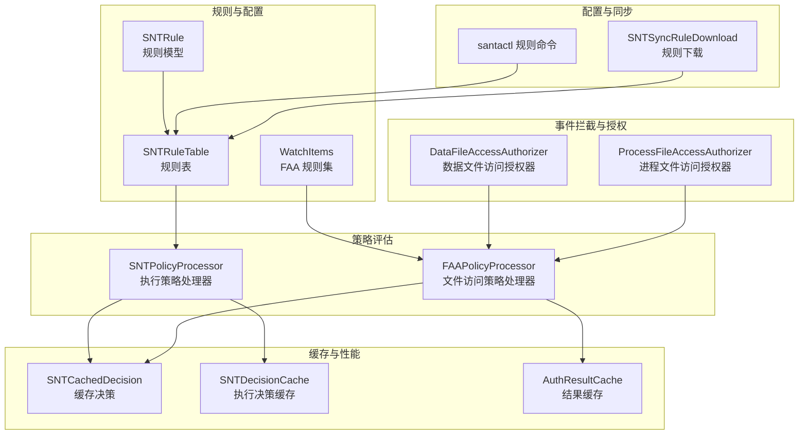
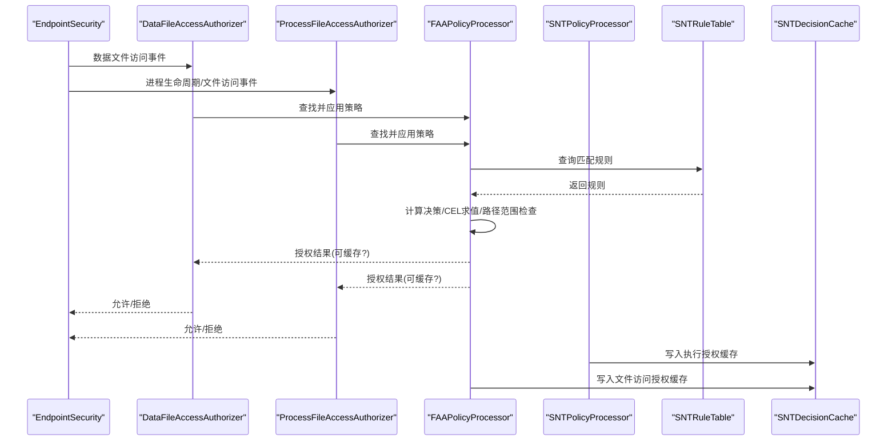
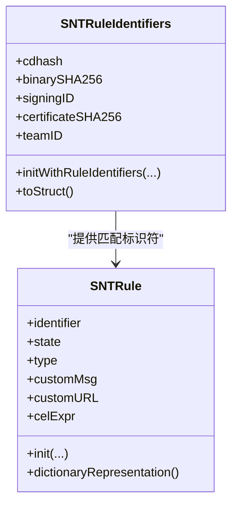
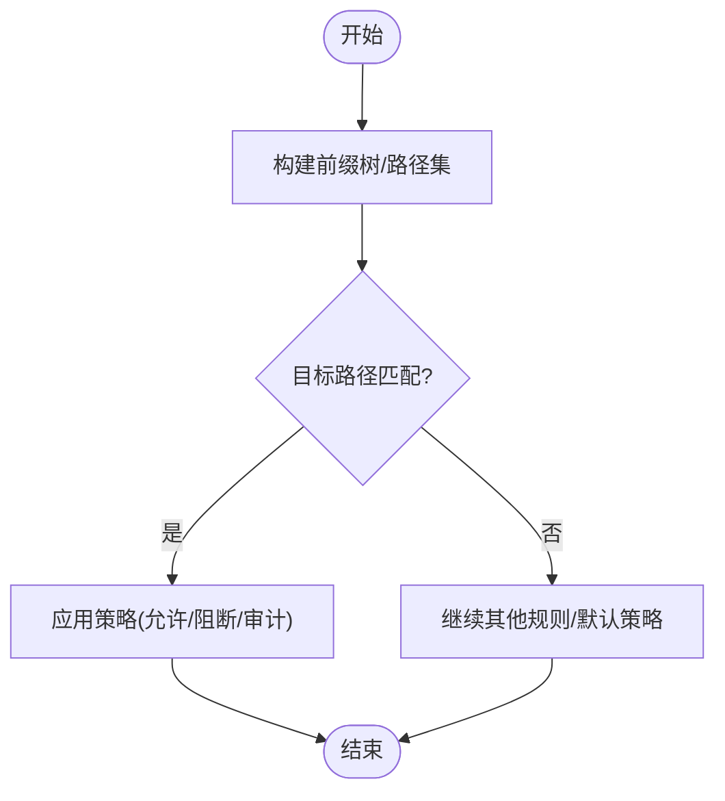
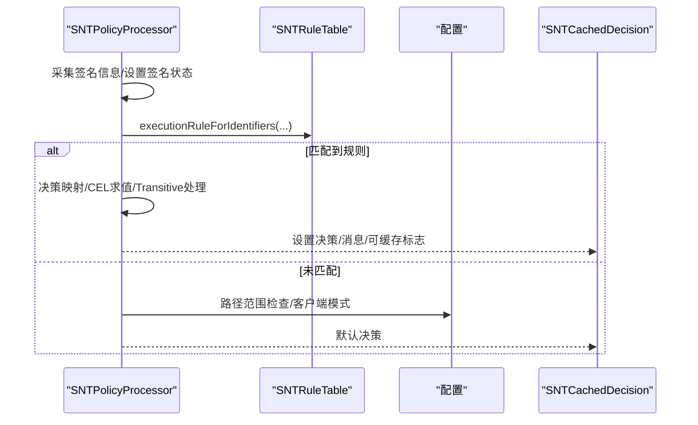
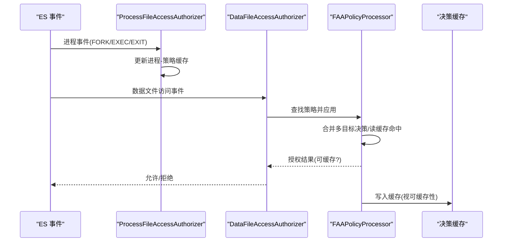
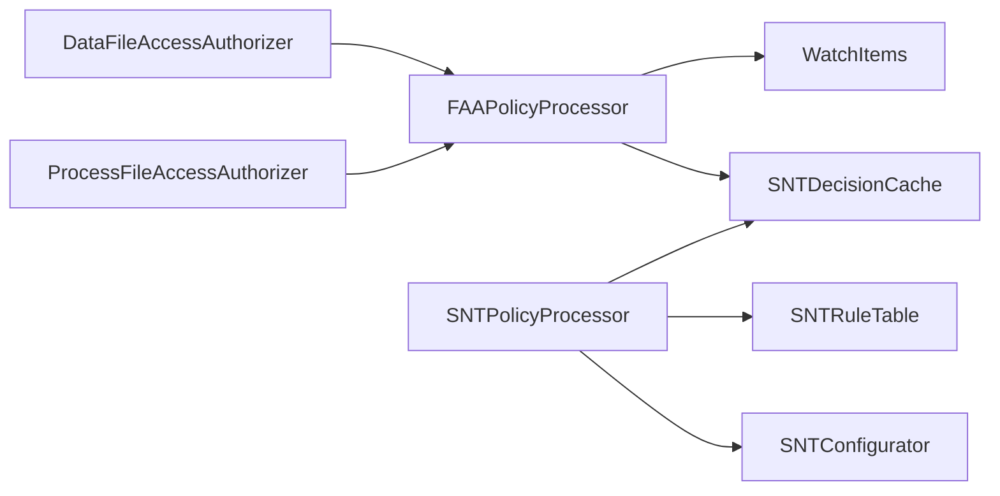

# 授权策略系统

<cite>
**本文引用的文件**
- [Source/common/SNTRule.mm](file://Source/common/SNTRule.mm)
- [Source/common/SNTRuleIdentifiers.mm](file://Source/common/SNTRuleIdentifiers.mm)
- [Source/santad/SNTPolicyProcessor.mm](file://Source/santad/SNTPolicyProcessor.mm)
- [Source/santad/EventProviders/FAAPolicyProcessor.mm](file://Source/santad/EventProviders/FAAPolicyProcessor.mm)
- [Source/santad/EventProviders/SNTEndpointSecurityDataFileAccessAuthorizer.mm](file://Source/santad/EventProviders/SNTEndpointSecurityDataFileAccessAuthorizer.mm)
- [Source/santad/EventProviders/SNTEndpointSecurityProcessFileAccessAuthorizer.mm](file://Source/santad/EventProviders/SNTEndpointSecurityProcessFileAccessAuthorizer.mm)
- [Source/common/SNTCachedDecision.mm](file://Source/common/SNTCachedDecision.mm)
- [Source/common/faa/WatchItems.mm](file://Source/common/faa/WatchItems.mm)
- [Source/santactl/Commands/SNTCommandRule.mm](file://Source/santactl/Commands/SNTCommandRule.mm)
- [Source/santasyncservice/SNTSyncRuleDownload.mm](file://Source/santasyncservice/SNTSyncRuleDownload.mm)
- [Source/santad/DataLayer/SNTRuleTable.mm](file://Source/santad/DataLayer/SNTRuleTable.mm)
</cite>

## 目录
1. [简介](#简介)
2. [项目结构](#项目结构)
3. [核心组件](#核心组件)
4. [架构总览](#架构总览)
5. [详细组件分析](#详细组件分析)
6. [依赖关系分析](#依赖关系分析)
7. [性能考量](#性能考量)
8. [故障排除指南](#故障排除指南)
9. [结论](#结论)
10. [附录](#附录)

## 简介
本技术文档围绕 Santa 的授权策略系统，系统性阐述基于代码签名的规则机制（CDHash、证书、TeamID、SigningID）、路径规则（正则表达式与通配）、静态规则与优先级体系；详解策略评估流程、决策缓存与性能优化；深入解析文件访问授权（FAA）的工作原理、数据文件访问控制与进程文件访问控制的区别；并提供规则创建最佳实践、常见策略模式、测试与批量管理、以及审计与故障排除方法。

## 项目结构
Santa 的授权策略系统由“规则定义与存储”“策略评估引擎”“事件拦截与授权器”“缓存与性能优化”“配置与同步”等模块组成。策略评估贯穿执行授权与文件访问授权两类场景：前者面向二进制执行，后者面向数据文件与进程文件访问。

图表来源
- [Source/common/SNTRule.mm](file://Source/common/SNTRule.mm#L1-L558)
- [Source/santad/DataLayer/SNTRuleTable.mm](file://Source/santad/DataLayer/SNTRuleTable.mm#L1-L200)
- [Source/common/faa/WatchItems.mm](file://Source/common/faa/WatchItems.mm#L1-L800)
- [Source/santad/SNTPolicyProcessor.mm](file://Source/santad/SNTPolicyProcessor.mm#L1-L517)
- [Source/santad/EventProviders/FAAPolicyProcessor.mm](file://Source/santad/EventProviders/FAAPolicyProcessor.mm#L1-L568)
- [Source/santad/EventProviders/SNTEndpointSecurityDataFileAccessAuthorizer.mm](file://Source/santad/EventProviders/SNTEndpointSecurityDataFileAccessAuthorizer.mm#L1-L206)
- [Source/santad/EventProviders/SNTEndpointSecurityProcessFileAccessAuthorizer.mm](file://Source/santad/EventProviders/SNTEndpointSecurityProcessFileAccessAuthorizer.mm#L1-L298)
- [Source/common/SNTCachedDecision.mm](file://Source/common/SNTCachedDecision.mm#L1-L38)
- [Source/santactl/Commands/SNTCommandRule.mm](file://Source/santactl/Commands/SNTCommandRule.mm#L1-L200)
- [Source/santasyncservice/SNTSyncRuleDownload.mm](file://Source/santasyncservice/SNTSyncRuleDownload.mm#L1-L200)

章节来源
- [Source/common/SNTRule.mm](file://Source/common/SNTRule.mm#L1-L558)
- [Source/common/faa/WatchItems.mm](file://Source/common/faa/WatchItems.mm#L1-L800)
- [Source/santad/SNTPolicyProcessor.mm](file://Source/santad/SNTPolicyProcessor.mm#L1-L517)
- [Source/santad/EventProviders/FAAPolicyProcessor.mm](file://Source/santad/EventProviders/FAAPolicyProcessor.mm#L1-L568)

## 核心组件
- 规则模型与标识符
  - SNTRule：统一规则对象，支持二进制哈希、证书哈希、TeamID、SigningID、CDHash 等多种类型，并进行规范化与校验。
  - SNTRuleIdentifiers：根据签名状态按“最宽松到最严格”的顺序选择可用标识符集合，用于匹配规则。
- 执行策略处理器
  - SNTPolicyProcessor：负责执行授权策略评估，包括 CEL 表达式求值、路径范围检查、系统二进制快速通道、Transitive 规则处理与决策映射。
- 文件访问策略处理器
  - FAAPolicyProcessor：负责数据文件与进程文件访问授权，实现多目标决策合并、速率限制、TTY 消息、日志与指标上报、读缓存加速等。
- 授权器
  - DataFileAccessAuthorizer：订阅数据文件访问事件，查找目标策略并调用处理器生成授权结果。
  - ProcessFileAccessAuthorizer：订阅进程生命周期事件，按进程树匹配策略并缓存策略，提升后续事件处理性能。
- 缓存与性能
  - SNTCachedDecision：封装一次授权决策及其可缓存性。
  - SNTDecisionCache：执行授权决策缓存。
  - AuthResultCache：事件结果缓存。
- 配置与同步
  - WatchItems：解析与验证 FAA 规则配置，构建前缀树与进程规则集。
  - santactl 规则命令与同步服务：规则导入、导出、批量管理与分发。

章节来源
- [Source/common/SNTRule.mm](file://Source/common/SNTRule.mm#L1-L558)
- [Source/common/SNTRuleIdentifiers.mm](file://Source/common/SNTRuleIdentifiers.mm#L1-L117)
- [Source/santad/SNTPolicyProcessor.mm](file://Source/santad/SNTPolicyProcessor.mm#L1-L517)
- [Source/santad/EventProviders/FAAPolicyProcessor.mm](file://Source/santad/EventProviders/FAAPolicyProcessor.mm#L1-L568)
- [Source/santad/EventProviders/SNTEndpointSecurityDataFileAccessAuthorizer.mm](file://Source/santad/EventProviders/SNTEndpointSecurityDataFileAccessAuthorizer.mm#L1-L206)
- [Source/santad/EventProviders/SNTEndpointSecurityProcessFileAccessAuthorizer.mm](file://Source/santad/EventProviders/SNTEndpointSecurityProcessFileAccessAuthorizer.mm#L1-L298)
- [Source/common/SNTCachedDecision.mm](file://Source/common/SNTCachedDecision.mm#L1-L38)
- [Source/common/faa/WatchItems.mm](file://Source/common/faa/WatchItems.mm#L1-L800)
- [Source/santactl/Commands/SNTCommandRule.mm](file://Source/santactl/Commands/SNTCommandRule.mm#L1-L200)
- [Source/santasyncservice/SNTSyncRuleDownload.mm](file://Source/santasyncservice/SNTSyncRuleDownload.mm#L1-L200)

## 架构总览
Santa 的授权策略系统以“规则驱动 + 事件驱动”的方式工作。执行授权与文件访问授权分别由独立处理器完成，但共享相同的规则来源与缓存层，确保一致的策略语义与性能表现。

图表来源
- [Source/santad/EventProviders/SNTEndpointSecurityDataFileAccessAuthorizer.mm](file://Source/santad/EventProviders/SNTEndpointSecurityDataFileAccessAuthorizer.mm#L90-L170)
- [Source/santad/EventProviders/SNTEndpointSecurityProcessFileAccessAuthorizer.mm](file://Source/santad/EventProviders/SNTEndpointSecurityProcessFileAccessAuthorizer.mm#L70-L180)
- [Source/santad/EventProviders/FAAPolicyProcessor.mm](file://Source/santad/EventProviders/FAAPolicyProcessor.mm#L300-L568)
- [Source/santad/SNTPolicyProcessor.mm](file://Source/santad/SNTPolicyProcessor.mm#L300-L517)
- [Source/santad/DataLayer/SNTRuleTable.mm](file://Source/santad/DataLayer/SNTRuleTable.mm#L1-L200)

## 详细组件分析

### 基于代码签名的规则机制
- 规则类型与标识符
  - 二进制 SHA-256、证书 SHA-256、TeamID、SigningID、CDHash。
  - 标识符大小写与格式规范化：如十六进制小写、TeamID 大写、SigningID 中 TeamID 部分大写或平台二进制使用小写“platform”。
- 签名状态与标识符选择
  - 按签名状态从宽松到严格依次选择可用标识符集合，避免开发签名误放行。
- 规则状态与策略映射
  - Allow、Block、SilentBlock、CEL、AllowTransitive 等状态映射为具体事件状态，支持编译器允许与静默阻断。

图表来源
- [Source/common/SNTRule.mm](file://Source/common/SNTRule.mm#L1-L200)
- [Source/common/SNTRuleIdentifiers.mm](file://Source/common/SNTRuleIdentifiers.mm#L1-L117)

章节来源
- [Source/common/SNTRule.mm](file://Source/common/SNTRule.mm#L1-L200)
- [Source/common/SNTRuleIdentifiers.mm](file://Source/common/SNTRuleIdentifiers.mm#L1-L117)

### 路径规则与静态规则
- 路径规则
  - 支持字面量与前缀两种路径类型，构建前缀树以加速最长前缀匹配。
  - 支持正则表达式范围检查（允许/阻止路径），在执行策略中用于快速判定。
- 静态规则
  - 通过初始化参数标记为静态规则，用于区分动态下发规则。

图表来源
- [Source/common/faa/WatchItems.mm](file://Source/common/faa/WatchItems.mm#L680-L760)

章节来源
- [Source/common/faa/WatchItems.mm](file://Source/common/faa/WatchItems.mm#L1-L200)
- [Source/common/faa/WatchItems.mm](file://Source/common/faa/WatchItems.mm#L680-L760)

### 策略评估流程与优先级
- 执行授权（二进制执行）
  - 快速通道：系统关键二进制直接返回已知决策。
  - 签名信息采集：证书链、TeamID、SigningID、签名时间等。
  - 规则匹配：按标识符集合查询规则表，优先匹配精确类型（Binary、CDHash、SigningID、Certificate、TeamID）。
  - 特殊状态处理：CEL 表达式求值、Transitive 规则、编译器允许、静默阻断。
  - 路径范围检查：允许/阻止路径正则，缺失 __PAGEZERO 等保护检查。
  - 客户端模式：Monitor/Lockdown/Standalone 下的默认行为。
- 文件访问授权（FAA）
  - 数据文件访问授权器：订阅数据文件访问事件，逐目标应用策略，合并决策，支持读缓存与速率限制。
  - 进程文件访问授权器：订阅进程生命周期事件，按进程树匹配策略，缓存策略以减少重复查找。
  - 决策合并：任一目标拒绝即拒绝，否则允许；审计仅阻断时可转为审计放行。
  - 可缓存性：仅当所有目标均允许且非特殊情形时才可缓存。

图表来源
- [Source/santad/SNTPolicyProcessor.mm](file://Source/santad/SNTPolicyProcessor.mm#L300-L517)
- [Source/santad/DataLayer/SNTRuleTable.mm](file://Source/santad/DataLayer/SNTRuleTable.mm#L1-L200)

章节来源
- [Source/santad/SNTPolicyProcessor.mm](file://Source/santad/SNTPolicyProcessor.mm#L1-L517)
- [Source/santad/EventProviders/FAAPolicyProcessor.mm](file://Source/santad/EventProviders/FAAPolicyProcessor.mm#L1-L568)

### 决策缓存机制与性能优化
- 执行授权缓存
  - SNTCachedDecision 标记可缓存性；SNTDecisionCache 存储执行授权结果，避免重复计算。
- 文件访问授权缓存
  - FAAPolicyProcessor 维护 per-process 读缓存（dev/ino 对），命中后立即允许并清空可缓存标志，防止后续事件被错误缓存。
  - TTY 消息去重缓存，避免同一进程短时间内重复提示。
  - AuthResultCache：事件结果缓存，降低重复决策成本。
- 性能优化要点
  - 前缀树匹配路径规则，减少正则遍历。
  - 签名状态瀑布式选择标识符，减少无效匹配。
  - 速率限制与异步日志，平衡可观测性与吞吐。
  - 进程规则缓存与进程树匹配，降低策略查找开销。

章节来源
- [Source/common/SNTCachedDecision.mm](file://Source/common/SNTCachedDecision.mm#L1-L38)
- [Source/santad/EventProviders/FAAPolicyProcessor.mm](file://Source/santad/EventProviders/FAAPolicyProcessor.mm#L1-L200)
- [Source/santad/EventProviders/SNTEndpointSecurityProcessFileAccessAuthorizer.mm](file://Source/santad/EventProviders/SNTEndpointSecurityProcessFileAccessAuthorizer.mm#L1-L120)

### 文件访问授权（FAA）工作原理
- 数据文件访问授权器
  - 订阅数据文件访问事件，逐目标查找策略，应用策略后合并结果，必要时记录日志、TTY 消息与指标。
  - 读缓存：对允许读取的目标建立 dev/ino 缓存项，命中后立即允许。
- 进程文件访问授权器
  - 订阅进程生命周期事件（EXEC/FORK/EXIT），维护进程-策略映射缓存，按进程树匹配策略。
  - 在 EXEC/FORK 时迁移策略缓存，EXIT 时清理。
- 策略匹配
  - 支持路径规则与进程规则组合，支持“允许/阻断”反转（DenyProcesses/AllowedPaths 等）。
  - 支持只读访问特例（allow_read_access），在写操作时仍受策略约束。

图表来源
- [Source/santad/EventProviders/SNTEndpointSecurityProcessFileAccessAuthorizer.mm](file://Source/santad/EventProviders/SNTEndpointSecurityProcessFileAccessAuthorizer.mm#L120-L220)
- [Source/santad/EventProviders/SNTEndpointSecurityDataFileAccessAuthorizer.mm](file://Source/santad/EventProviders/SNTEndpointSecurityDataFileAccessAuthorizer.mm#L90-L170)
- [Source/santad/EventProviders/FAAPolicyProcessor.mm](file://Source/santad/EventProviders/FAAPolicyProcessor.mm#L430-L568)

章节来源
- [Source/santad/EventProviders/SNTEndpointSecurityDataFileAccessAuthorizer.mm](file://Source/santad/EventProviders/SNTEndpointSecurityDataFileAccessAuthorizer.mm#L1-L206)
- [Source/santad/EventProviders/SNTEndpointSecurityProcessFileAccessAuthorizer.mm](file://Source/santad/EventProviders/SNTEndpointSecurityProcessFileAccessAuthorizer.mm#L1-L298)
- [Source/santad/EventProviders/FAAPolicyProcessor.mm](file://Source/santad/EventProviders/FAAPolicyProcessor.mm#L1-L568)

### 数据文件访问控制 vs 进程文件访问控制
- 数据文件访问控制（Data FAA）
  - 面向“文件路径”维度，按目标路径匹配策略，适合细粒度路径白名单/黑名单。
  - 支持读缓存加速，命中后立即允许。
- 进程文件访问控制（Process FAA）
  - 面向“进程身份”维度，按进程签名属性（TeamID/SigningID/CDHash/证书）与二进制路径匹配策略，适合组织级策略。
  - 通过进程树匹配，自动继承父子进程关系，减少重复配置。
- 两者区别
  - 匹配维度不同：路径 vs 进程。
  - 缓存策略不同：数据 FAA 以路径为键，进程 FAA 以进程 PID+版本为键。
  - 适用场景不同：数据 FAA 更灵活，进程 FAA 更可控。

章节来源
- [Source/common/faa/WatchItems.mm](file://Source/common/faa/WatchItems.mm#L1-L200)
- [Source/santad/EventProviders/SNTEndpointSecurityDataFileAccessAuthorizer.mm](file://Source/santad/EventProviders/SNTEndpointSecurityDataFileAccessAuthorizer.mm#L1-L206)
- [Source/santad/EventProviders/SNTEndpointSecurityProcessFileAccessAuthorizer.mm](file://Source/santad/EventProviders/SNTEndpointSecurityProcessFileAccessAuthorizer.mm#L1-L298)

### 规则创建最佳实践与常见模式
- 规则类型选择
  - 二进制 SHA-256：精准控制单个二进制。
  - CDHash：针对签名页哈希变化后的二进制放宽。
  - SigningID：按团队与签名标识放宽，适合跨版本应用。
  - TeamID：按组织放宽，需谨慎使用。
  - 证书 SHA-256：按证书链根部放宽，适合信任链策略。
- 路径规则
  - 使用前缀匹配减少规则数量；结合正则表达式限定范围。
  - 将允许/阻止路径分离，避免相互覆盖。
- 静态规则与动态规则
  - 静态规则用于内置策略；动态规则用于远程下发与热更新。
- CEL 表达式
  - 利用表达式实现复杂条件判断；注意 fail-closed 配置影响异常处理。
- 常见模式
  - “组织白名单 + 个人黑名单”：组织内默认允许，个人行为阻断。
  - “编译器允许（Transitive）”：允许编译器类工具链运行，同时限制其输出产物。
  - “只读放行”：允许读取但禁止写入，适用于日志/缓存目录。

章节来源
- [Source/common/SNTRule.mm](file://Source/common/SNTRule.mm#L1-L200)
- [Source/common/faa/WatchItems.mm](file://Source/common/faa/WatchItems.mm#L400-L680)
- [Source/santad/SNTPolicyProcessor.mm](file://Source/santad/SNTPolicyProcessor.mm#L1-L200)

### 规则测试、批量管理与审计
- 规则测试
  - 使用 santactl 规则命令进行规则导入/导出与验证；结合日志与指标观察策略效果。
- 批量管理
  - 通过同步服务批量下发规则；支持增量更新与版本化管理。
- 审计与可观测性
  - FAA 处理器记录事件指标、速率限制、TTY 提示与日志；支持事件详情链接。
  - 执行授权缓存与事件缓存配合，便于回溯与审计。

章节来源
- [Source/santactl/Commands/SNTCommandRule.mm](file://Source/santactl/Commands/SNTCommandRule.mm#L1-L200)
- [Source/santasyncservice/SNTSyncRuleDownload.mm](file://Source/santasyncservice/SNTSyncRuleDownload.mm#L1-L200)
- [Source/santad/EventProviders/FAAPolicyProcessor.mm](file://Source/santad/EventProviders/FAAPolicyProcessor.mm#L300-L568)

## 依赖关系分析
- 组件耦合
  - SNTPolicyProcessor 依赖 SNTRuleTable 与配置器；FAAPolicyProcessor 依赖 WatchItems 与决策缓存。
  - 授权器通过 EndpointSecurity API 接收事件，调用处理器生成授权结果。
- 外部依赖
  - 代码签名检查、证书链解析、CEL 表达式求值、日志与指标系统。
- 循环依赖
  - 未发现循环依赖；各模块职责清晰，接口边界明确。

图表来源
- [Source/santad/SNTPolicyProcessor.mm](file://Source/santad/SNTPolicyProcessor.mm#L1-L120)
- [Source/santad/EventProviders/FAAPolicyProcessor.mm](file://Source/santad/EventProviders/FAAPolicyProcessor.mm#L1-L120)
- [Source/santad/EventProviders/SNTEndpointSecurityDataFileAccessAuthorizer.mm](file://Source/santad/EventProviders/SNTEndpointSecurityDataFileAccessAuthorizer.mm#L1-L120)
- [Source/santad/EventProviders/SNTEndpointSecurityProcessFileAccessAuthorizer.mm](file://Source/santad/EventProviders/SNTEndpointSecurityProcessFileAccessAuthorizer.mm#L1-L120)

章节来源
- [Source/santad/SNTPolicyProcessor.mm](file://Source/santad/SNTPolicyProcessor.mm#L1-L120)
- [Source/santad/EventProviders/FAAPolicyProcessor.mm](file://Source/santad/EventProviders/FAAPolicyProcessor.mm#L1-L120)

## 性能考量
- 匹配效率
  - 前缀树与路径集加速；签名状态瀑布式选择减少无效匹配。
- 缓存策略
  - 执行授权与文件访问授权分别缓存；FAA 读缓存命中即放行，避免重复策略计算。
- 异步与限流
  - 日志与指标异步上报；速率限制避免噪声事件影响系统。
- 客户端模式
  - Monitor 模式下尽可能放行，减少阻断；Lockdown/Standalone 模式下更严格。

[本节为通用指导，不涉及具体文件分析]

## 故障排除指南
- 规则无效或未生效
  - 检查规则类型与标识符格式是否正确；确认大小写与长度规范。
  - 确认签名状态是否导致标识符未填充（开发签名可能不包含 TeamID/SigningID）。
- 执行被阻断
  - 检查路径范围正则与客户端模式；查看签名错误提示与签名状态。
- 文件访问频繁弹窗
  - 检查 TTY 消息缓存与速率限制设置；确认 allow_read_access 是否启用。
- 性能问题
  - 检查缓存命中率；优化路径规则数量与前缀树深度；减少 CEL 表达式复杂度。

章节来源
- [Source/common/SNTRule.mm](file://Source/common/SNTRule.mm#L1-L200)
- [Source/santad/SNTPolicyProcessor.mm](file://Source/santad/SNTPolicyProcessor.mm#L300-L517)
- [Source/santad/EventProviders/FAAPolicyProcessor.mm](file://Source/santad/EventProviders/FAAPolicyProcessor.mm#L1-L200)

## 结论
Santa 的授权策略系统以“规则驱动 + 事件驱动”为核心，通过精细的签名标识符选择、路径规则与静态规则、CEL 表达式扩展，实现了高可定制与高性能的授权能力。执行授权与文件访问授权分别针对二进制执行与文件访问场景，辅以完善的缓存与可观测性机制，满足企业级安全管控需求。

[本节为总结性内容，不涉及具体文件分析]

## 附录
- 关键术语
  - CDHash：签名页哈希，用于检测二进制修改。
  - TeamID：组织团队标识。
  - SigningID：签名标识，通常为 TeamID:SigningID 形式。
  - Transitive：编译器允许，允许工具链运行但不扩大权限。
  - FAA：文件访问授权，分为数据文件与进程文件两类。
- 常用配置键
  - 路径规则：Path、IsPrefix
  - 进程规则：BinaryPath、TeamID、SigningID、CDHash、CertificateSha256、PlatformBinary
  - 策略选项：AllowReadAccess、AuditOnly、RuleType、EnableSilentMode、EnableSilentTTYMode、BlockMessage、EventDetailURL、EventDetailText、Version

[本节为概念性内容，不涉及具体文件分析]