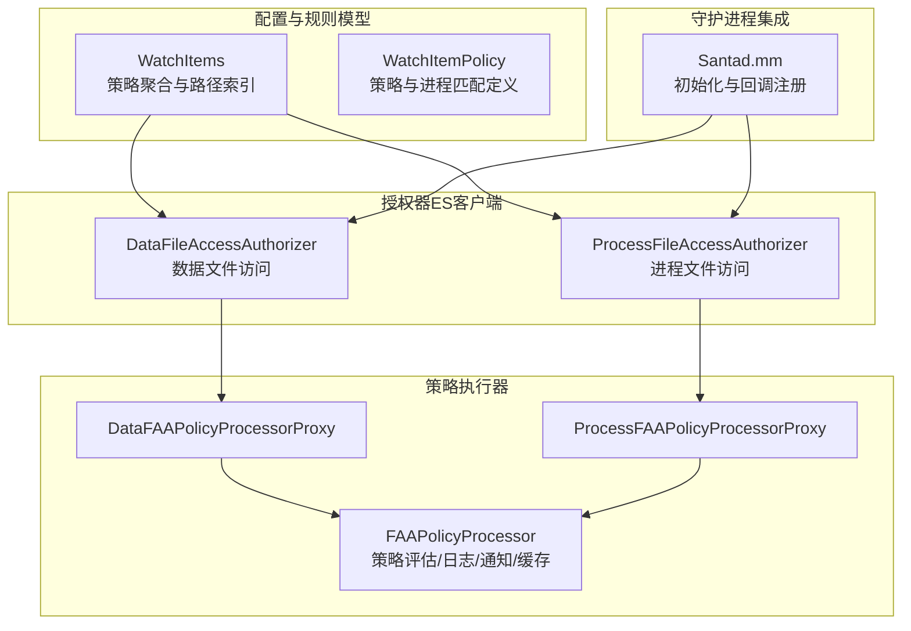
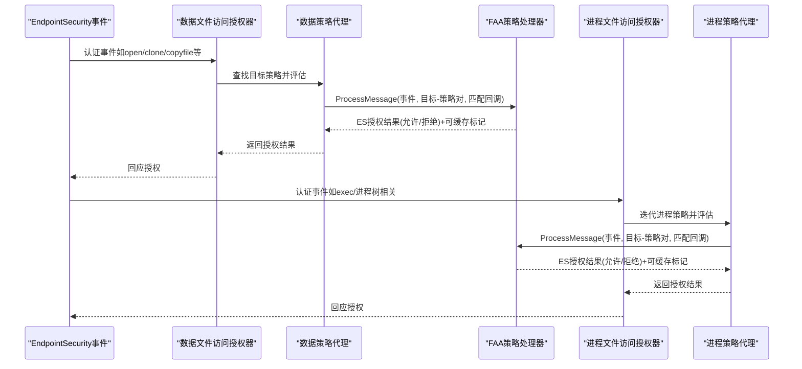
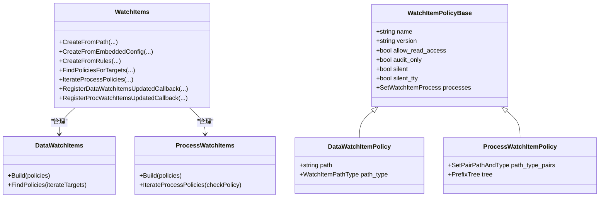
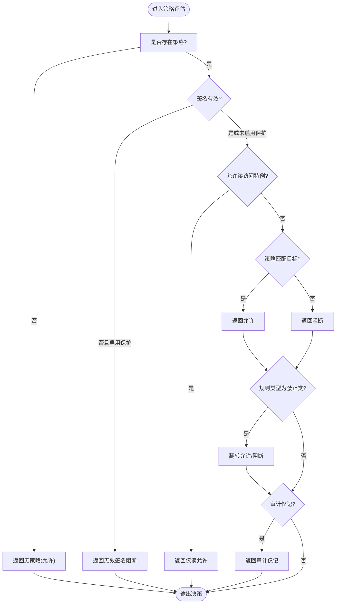
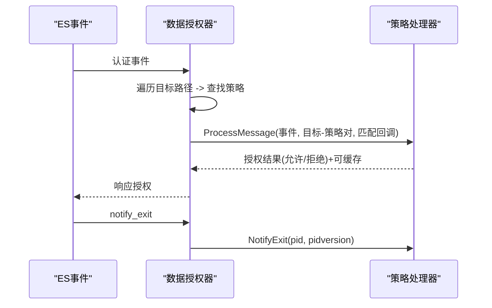
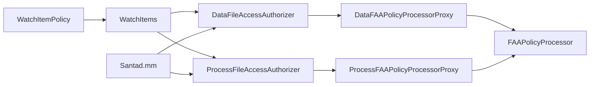

# 文件访问授权机制

<cite>
**本文引用的文件**
- [Source/common/faa/WatchItems.h](file://Source/common/faa/WatchItems.h)
- [Source/common/faa/WatchItems.mm](file://Source/common/faa/WatchItems.mm)
- [Source/common/faa/WatchItemPolicy.h](file://Source/common/faa/WatchItemPolicy.h)
- [Source/santad/EventProviders/FAAPolicyProcessor.h](file://Source/santad/EventProviders/FAAPolicyProcessor.h)
- [Source/santad/EventProviders/FAAPolicyProcessor.mm](file://Source/santad/EventProviders/FAAPolicyProcessor.mm)
- [Source/santad/EventProviders/SNTEndpointSecurityDataFileAccessAuthorizer.h](file://Source/santad/EventProviders/SNTEndpointSecurityDataFileAccessAuthorizer.h)
- [Source/santad/EventProviders/SNTEndpointSecurityDataFileAccessAuthorizer.mm](file://Source/santad/EventProviders/SNTEndpointSecurityDataFileAccessAuthorizer.mm)
- [Source/santad/EventProviders/SNTEndpointSecurityProcessFileAccessAuthorizer.h](file://Source/santad/EventProviders/SNTEndpointSecurityProcessFileAccessAuthorizer.h)
- [Source/santad/EventProviders/SNTEndpointSecurityProcessFileAccessAuthorizer.mm](file://Source/santad/EventProviders/SNTEndpointSecurityProcessFileAccessAuthorizer.mm)
- [Source/santad/Santad.mm](file://Source/santad/Santad.mm)
- [docs/docs/features/faa.md](file://docs/docs/features/faa.md)
- [docs/docs/configuration/faa.md](file://docs/docs/configuration/faa.md)
- [docs/docs/cookbook/faa.md](file://docs/docs/cookbook/faa.md)
- [Source/santad/EventProviders/FAAPolicyProcessorTest.mm](file://Source/santad/EventProviders/FAAPolicyProcessorTest.mm)
- [Source/common/faa/WatchItemsTest.mm](file://Source/common/faa/WatchItemsTest.mm)
</cite>

## 目录
1. [引言](#引言)
2. [项目结构](#项目结构)
3. [核心组件](#核心组件)
4. [架构总览](#架构总览)
5. [详细组件分析](#详细组件分析)
6. [依赖关系分析](#依赖关系分析)
7. [性能考虑](#性能考虑)
8. [故障排除指南](#故障排除指南)
9. [结论](#结论)
10. [附录](#附录)

## 引言
本文件面向Santa的文件访问授权（File Access Authorization, FAA）机制，系统性阐述其概念、工作原理、与二进制授权的区别、数据文件访问控制与进程文件访问控制的实现方式、策略处理器的工作流程与事件捕获、权限决策过程、配置最佳实践、常见使用场景与管理策略，并提供测试方法、性能优化建议与故障排除技巧。目标是帮助读者在不深入源码细节的前提下理解并正确使用FAA。

## 项目结构
FAA相关代码主要分布在以下模块：
- 配置与规则模型：common/faa目录下的WatchItems与WatchItemPolicy，负责解析与维护策略配置、路径匹配与进程匹配。
- 策略执行器：santad/EventProviders目录下的FAAPolicyProcessor及其代理类，负责对Endpoint Security事件进行策略评估、日志与遥测、UI与TTY通知、缓存与速率限制等。
- 授权器：针对数据文件访问与进程文件访问的两个ES客户端，分别对接策略执行器，完成事件订阅、目标路径匹配、即时响应与最终授权结果下发。
- 守护进程集成：Santad.mm中初始化数据与进程两类FAA客户端，并注册回调以生成阻断通知与事件存储。

图表来源
- [Source/common/faa/WatchItems.h](file://Source/common/faa/WatchItems.h#L146-L228)
- [Source/common/faa/WatchItemPolicy.h](file://Source/common/faa/WatchItemPolicy.h#L193-L321)
- [Source/santad/EventProviders/FAAPolicyProcessor.h](file://Source/santad/EventProviders/FAAPolicyProcessor.h#L120-L216)
- [Source/santad/EventProviders/SNTEndpointSecurityDataFileAccessAuthorizer.h](file://Source/santad/EventProviders/SNTEndpointSecurityDataFileAccessAuthorizer.h#L31-L46)
- [Source/santad/EventProviders/SNTEndpointSecurityProcessFileAccessAuthorizer.h](file://Source/santad/EventProviders/SNTEndpointSecurityProcessFileAccessAuthorizer.h#L26-L40)
- [Source/santad/Santad.mm](file://Source/santad/Santad.mm#L186-L210)

章节来源
- [Source/common/faa/WatchItems.h](file://Source/common/faa/WatchItems.h#L146-L228)
- [Source/common/faa/WatchItemPolicy.h](file://Source/common/faa/WatchItemPolicy.h#L193-L321)
- [Source/santad/EventProviders/FAAPolicyProcessor.h](file://Source/santad/EventProviders/FAAPolicyProcessor.h#L120-L216)
- [Source/santad/EventProviders/SNTEndpointSecurityDataFileAccessAuthorizer.h](file://Source/santad/EventProviders/SNTEndpointSecurityDataFileAccessAuthorizer.h#L31-L46)
- [Source/santad/EventProviders/SNTEndpointSecurityProcessFileAccessAuthorizer.h](file://Source/santad/EventProviders/SNTEndpointSecurityProcessFileAccessAuthorizer.h#L26-L40)
- [Source/santad/Santad.mm](file://Source/santad/Santad.mm#L186-L210)

## 核心组件
- WatchItems：负责从配置文件或嵌入式配置加载策略，构建数据与进程两类规则集合；维护路径前缀树与进程集合，支持周期性重载与变更回调。
- WatchItemPolicy：定义策略基类与派生类（数据/进程），封装路径类型（字面量/前缀）、规则类型（数据/进程两类）、进程匹配条件（签名ID、团队ID、平台二进制、证书哈希、CDHash、二进制路径）等。
- FAAPolicyProcessor：核心策略评估引擎，处理事件、评估策略、生成决策、记录遥测与日志、控制UI与TTY通知、维护读缓存与TTY消息去重缓存、应用审计仅记模式与禁用策略覆盖。
- Data/Process FAAPolicyProcessorProxy：对外屏蔽客户端类型，统一调用入口。
- Data/Process FileAccessAuthorizer（ES客户端）：订阅Endpoint Security事件，按目标路径查找策略，调用策略处理器，下发授权结果；支持即时响应（如已允许的读操作快速放行）与退出清理。

章节来源
- [Source/common/faa/WatchItems.h](file://Source/common/faa/WatchItems.h#L92-L145)
- [Source/common/faa/WatchItemPolicy.h](file://Source/common/faa/WatchItemPolicy.h#L193-L321)
- [Source/santad/EventProviders/FAAPolicyProcessor.h](file://Source/santad/EventProviders/FAAPolicyProcessor.h#L120-L216)
- [Source/santad/EventProviders/SNTEndpointSecurityDataFileAccessAuthorizer.mm](file://Source/santad/EventProviders/SNTEndpointSecurityDataFileAccessAuthorizer.mm#L97-L128)
- [Source/santad/EventProviders/SNTEndpointSecurityProcessFileAccessAuthorizer.mm](file://Source/santad/EventProviders/SNTEndpointSecurityProcessFileAccessAuthorizer.mm#L75-L108)

## 架构总览
FAA采用“配置驱动 + 策略评估 + ES事件驱动”的架构。配置通过WatchItems加载并构建索引；事件由ES客户端订阅后交由FAAPolicyProcessor评估；评估结果决定是否允许、审计仅记或阻断，并触发日志、遥测、UI与TTY通知。

图表来源
- [Source/santad/EventProviders/SNTEndpointSecurityDataFileAccessAuthorizer.mm](file://Source/santad/EventProviders/SNTEndpointSecurityDataFileAccessAuthorizer.mm#L97-L128)
- [Source/santad/EventProviders/SNTEndpointSecurityProcessFileAccessAuthorizer.mm](file://Source/santad/EventProviders/SNTEndpointSecurityProcessFileAccessAuthorizer.mm#L75-L108)
- [Source/santad/EventProviders/FAAPolicyProcessor.h](file://Source/santad/EventProviders/FAAPolicyProcessor.h#L502-L560)

## 详细组件分析

### 组件A：策略模型与配置加载（WatchItems/WatchItemPolicy）
- WatchItems负责：
  - 解析顶层版本、全局事件详情链接与规则集。
  - 校验每条规则的名称合法性、路径数组、进程属性、选项键值范围与默认值。
  - 将规则转换为数据/进程两类策略集合，并构建路径前缀树（数据侧）或直接持有进程策略集合（进程侧）。
  - 支持从外部配置文件、嵌入式配置或数据库规则动态加载与周期性重载。
- WatchItemPolicy负责：
  - 定义策略基类与派生类，包含规则类型（数据/进程两类）、读访问许可、审计仅记、静默模式、自定义消息与事件详情链接等。
  - 定义进程匹配结构体，支持平台二进制、团队ID、签名ID（含通配前后缀）、证书哈希、CDHash与二进制路径等多维匹配。

图表来源
- [Source/common/faa/WatchItems.h](file://Source/common/faa/WatchItems.h#L92-L145)
- [Source/common/faa/WatchItems.h](file://Source/common/faa/WatchItems.h#L146-L228)
- [Source/common/faa/WatchItemPolicy.h](file://Source/common/faa/WatchItemPolicy.h#L193-L321)

章节来源
- [Source/common/faa/WatchItems.mm](file://Source/common/faa/WatchItems.mm#L437-L572)
- [Source/common/faa/WatchItems.mm](file://Source/common/faa/WatchItems.mm#L685-L740)
- [Source/common/faa/WatchItems.mm](file://Source/common/faa/WatchItems.mm#L740-L800)
- [Source/common/faa/WatchItemPolicy.h](file://Source/common/faa/WatchItemPolicy.h#L193-L321)

### 组件B：策略处理器（FAAPolicyProcessor）
- 职责：
  - 对单个目标与策略组合进行决策评估，支持“读访问特例”（写标志判断、克隆/复制文件的源只读目标等）。
  - 应用规则类型反转（允许/禁止列表）、审计仅记覆盖、无效签名保护。
  - 记录遥测与日志、生成阻断事件对象、触发UI阻断通知与TTY消息（受静默与TTY静默开关控制）。
  - 维护“最近读取缓存”（基于进程PID+版本+客户端类型与设备号inode对）与TTY消息去重缓存，支持进程退出清理。
  - 提供“即时响应”能力：对已允许的读取在相同文件上快速放行，避免重复评估。
- 关键流程：
  - ApplyPolicy：根据事件类型与目标属性、策略选项与匹配结果生成决策。
  - ProcessTargetAndPolicy：结合覆盖动作、日志/遥测、事件对象构造、UI/TUI通知。
  - ProcessMessage：遍历所有目标-策略对，合并授权结果，决定是否可缓存。

图表来源
- [Source/santad/EventProviders/FAAPolicyProcessor.mm](file://Source/santad/EventProviders/FAAPolicyProcessor.mm#L311-L363)
- [Source/santad/EventProviders/FAAPolicyProcessor.mm](file://Source/santad/EventProviders/FAAPolicyProcessor.mm#L365-L495)
- [Source/santad/EventProviders/FAAPolicyProcessor.mm](file://Source/santad/EventProviders/FAAPolicyProcessor.mm#L502-L560)

章节来源
- [Source/santad/EventProviders/FAAPolicyProcessor.h](file://Source/santad/EventProviders/FAAPolicyProcessor.h#L54-L87)
- [Source/santad/EventProviders/FAAPolicyProcessor.mm](file://Source/santad/EventProviders/FAAPolicyProcessor.mm#L120-L216)
- [Source/santad/EventProviders/FAAPolicyProcessor.mm](file://Source/santad/EventProviders/FAAPolicyProcessor.mm#L311-L363)
- [Source/santad/EventProviders/FAAPolicyProcessor.mm](file://Source/santad/EventProviders/FAAPolicyProcessor.mm#L435-L495)
- [Source/santad/EventProviders/FAAPolicyProcessor.mm](file://Source/santad/EventProviders/FAAPolicyProcessor.mm#L502-L560)

### 组件C：数据文件访问授权器（DataFileAccessAuthorizer）
- 功能要点：
  - 订阅多种认证事件类型（open/clone/copyfile/link/rename/truncate/unlink等）。
  - 通过FindPoliciesForTargetsBlock按目标路径查找策略，构造“目标索引-策略”对。
  - 使用PolicyMatchesProcess逐条检查进程匹配条件。
  - 支持覆盖动作（禁用/审计仅记）与即时响应（已允许读取快速放行）。
  - 在进程退出时通知策略处理器清理缓存。

图表来源
- [Source/santad/EventProviders/SNTEndpointSecurityDataFileAccessAuthorizer.mm](file://Source/santad/EventProviders/SNTEndpointSecurityDataFileAccessAuthorizer.mm#L97-L128)
- [Source/santad/EventProviders/SNTEndpointSecurityDataFileAccessAuthorizer.mm](file://Source/santad/EventProviders/SNTEndpointSecurityDataFileAccessAuthorizer.mm#L143-L159)
- [Source/santad/EventProviders/FAAPolicyProcessor.h](file://Source/santad/EventProviders/FAAPolicyProcessor.h#L502-L560)

章节来源
- [Source/santad/EventProviders/SNTEndpointSecurityDataFileAccessAuthorizer.h](file://Source/santad/EventProviders/SNTEndpointSecurityDataFileAccessAuthorizer.h#L31-L46)
- [Source/santad/EventProviders/SNTEndpointSecurityDataFileAccessAuthorizer.mm](file://Source/santad/EventProviders/SNTEndpointSecurityDataFileAccessAuthorizer.mm#L97-L128)
- [Source/santad/EventProviders/SNTEndpointSecurityDataFileAccessAuthorizer.mm](file://Source/santad/EventProviders/SNTEndpointSecurityDataFileAccessAuthorizer.mm#L143-L159)

### 组件D：进程文件访问授权器（ProcessFileAccessAuthorizer）
- 功能要点：
  - 针对进程维度的策略（进程白/黑名单限制其可访问的路径）。
  - 通过迭代进程策略，对每个目标路径进行匹配评估。
  - 与数据侧类似，支持覆盖动作、即时响应与退出清理。

章节来源
- [Source/santad/EventProviders/SNTEndpointSecurityProcessFileAccessAuthorizer.h](file://Source/santad/EventProviders/SNTEndpointSecurityProcessFileAccessAuthorizer.h#L26-L40)
- [Source/santad/EventProviders/SNTEndpointSecurityProcessFileAccessAuthorizer.mm](file://Source/santad/EventProviders/SNTEndpointSecurityProcessFileAccessAuthorizer.mm#L75-L108)

### 组件E：守护进程集成与通知
- 在Santad.mm中：
  - 初始化数据与进程两类FAA客户端。
  - 注册文件访问阻断通知回调，向通知队列发送阻断事件与自定义消息/链接。
  - 将策略更新回调传递给两类授权器，以便动态生效。

章节来源
- [Source/santad/Santad.mm](file://Source/santad/Santad.mm#L186-L210)

## 依赖关系分析
- WatchItems与WatchItemPolicy：前者持有两类策略集合与路径前缀树，后者定义策略与进程匹配规则。
- 授权器与策略处理器：授权器通过代理类调用策略处理器，二者通过目标-策略对与匹配回调解耦。
- 策略处理器与日志/遥测/TTY：策略处理器内部依赖决策缓存、日志器、TTY写入器与指标收集器。
- 守护进程与授权器：Santad.mm负责初始化并注入回调，确保阻断事件能被通知与持久化。

图表来源
- [Source/common/faa/WatchItems.h](file://Source/common/faa/WatchItems.h#L146-L228)
- [Source/common/faa/WatchItemPolicy.h](file://Source/common/faa/WatchItemPolicy.h#L193-L321)
- [Source/santad/EventProviders/SNTEndpointSecurityDataFileAccessAuthorizer.h](file://Source/santad/EventProviders/SNTEndpointSecurityDataFileAccessAuthorizer.h#L31-L46)
- [Source/santad/EventProviders/SNTEndpointSecurityProcessFileAccessAuthorizer.h](file://Source/santad/EventProviders/SNTEndpointSecurityProcessFileAccessAuthorizer.h#L26-L40)
- [Source/santad/EventProviders/FAAPolicyProcessor.h](file://Source/santad/EventProviders/FAAPolicyProcessor.h#L120-L216)
- [Source/santad/Santad.mm](file://Source/santad/Santad.mm#L186-L210)

## 性能考虑
- 路径匹配效率：数据侧使用前缀树索引，进程侧直接遍历策略集合。合理设置路径规则数量与通配符范围，避免过多长尾匹配。
- 即时响应与读缓存：对已允许的读取建立缓存，避免重复评估；仅当全部目标均允许且非无效签名时才可缓存，确保审计完整性。
- 速率限制与日志：策略处理器内置速率限制器，防止高频阻断事件导致日志风暴。
- 静默模式与TTY静默：在大规模阻断场景下启用静默模式减少用户干扰，同时保留日志与遥测。
- 配置重载频率：通过配置项控制策略重载周期，平衡实时性与系统开销。

[本节为通用指导，无需列出具体文件来源]

## 故障排除指南
- 策略未生效
  - 检查规则名称与路径合法性，确认配置文件格式正确且未出现重复路径导致行为不确定。
  - 确认授权器已启用并订阅了相应事件类型。
- 误报/漏报
  - 核对规则类型（允许/禁止列表）与读访问特例逻辑是否符合预期。
  - 检查进程匹配条件（签名ID、团队ID、平台二进制、证书哈希、CDHash、二进制路径）是否准确。
- 日志与遥测
  - 确认日志类型与输出位置配置正确；检查遥测指标是否正常上报。
- UI与TTY通知
  - 若未显示阻断通知，检查静默模式与事件详情链接配置；TTY消息可能因去重缓存而被抑制。

章节来源
- [docs/docs/features/faa.md](file://docs/docs/features/faa.md#L386-L413)
- [docs/docs/configuration/faa.md](file://docs/docs/configuration/faa.md#L163-L226)
- [Source/santad/EventProviders/FAAPolicyProcessor.mm](file://Source/santad/EventProviders/FAAPolicyProcessor.mm#L365-L495)

## 结论
FAA通过“配置驱动 + ES事件驱动 + 策略评估引擎”的设计，在不改变系统二进制授权机制的前提下，提供了细粒度的数据文件访问控制与进程文件访问控制能力。其优势在于：
- 规则灵活：支持数据侧与进程侧两类规则，路径与进程多维匹配。
- 可观测性强：完整日志、遥测与阻断通知，便于审计与排障。
- 可扩展性好：代理类隔离客户端类型，策略处理器集中处理决策与副作用。
建议在生产环境先以审计仅记模式运行，逐步收紧策略，配合静默模式与速率限制，确保用户体验与安全性的平衡。

[本节为总结性内容，无需列出具体文件来源]

## 附录

### FAQ与最佳实践
- 与二进制授权的区别
  - 二进制授权关注“是否允许运行某个二进制”，FAA关注“某个进程是否可以访问特定文件”。两者互补，可在同一系统中并行部署。
- 规则类型选择
  - 数据侧（PathsWithAllowedProcesses/PathsWithDeniedProcesses）：保护特定文件/路径，限制谁可以访问。
  - 进程侧（ProcessesWithAllowedPaths/ProcessesWithDeniedPaths）：限制某个进程只能访问哪些路径。
- 配置最佳实践
  - 先监控再阻断；路径尽量精确，避免通配符泛滥；定期审查与精简规则；利用静默模式降低干扰。
- 常见使用场景
  - 保护浏览器Cookie、sudoers配置、Spotlight导入器、Docker Desktop设置等敏感资源。
- 测试方法
  - 使用单元测试验证策略匹配、决策分支与覆盖动作；通过模拟ES事件验证授权器与策略处理器的端到端流程。

章节来源
- [docs/docs/features/faa.md](file://docs/docs/features/faa.md#L1-L112)
- [docs/docs/features/faa.md](file://docs/docs/features/faa.md#L214-L239)
- [docs/docs/cookbook/faa.md](file://docs/docs/cookbook/faa.md#L1-L120)
- [docs/docs/cookbook/faa.md](file://docs/docs/cookbook/faa.md#L181-L228)
- [docs/docs/cookbook/faa.md](file://docs/docs/cookbook/faa.md#L303-L347)
- [docs/docs/configuration/faa.md](file://docs/docs/configuration/faa.md#L163-L226)
- [Source/santad/EventProviders/FAAPolicyProcessorTest.mm](file://Source/santad/EventProviders/FAAPolicyProcessorTest.mm#L88-L135)
- [Source/common/faa/WatchItemsTest.mm](file://Source/common/faa/WatchItemsTest.mm#L1-L200)