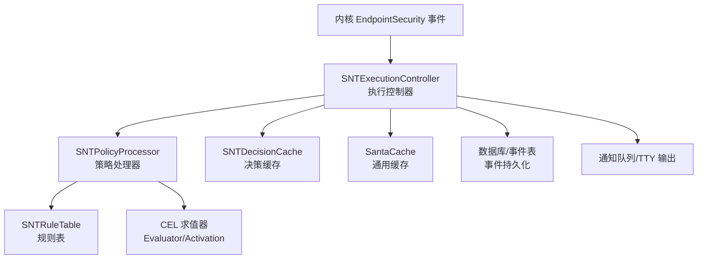
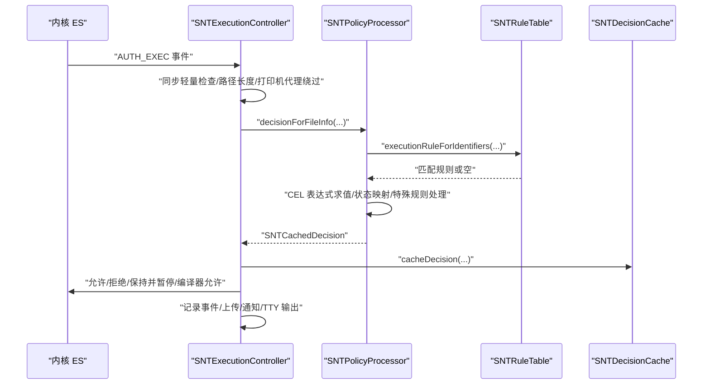
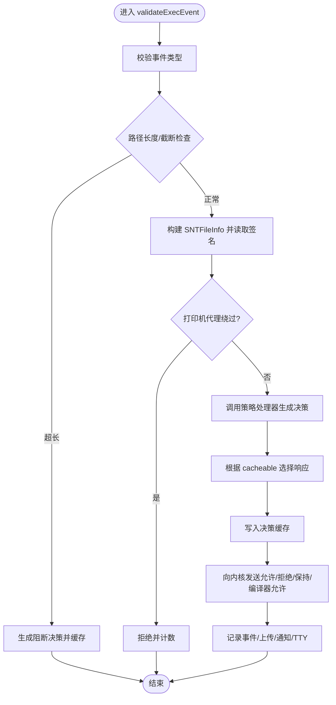
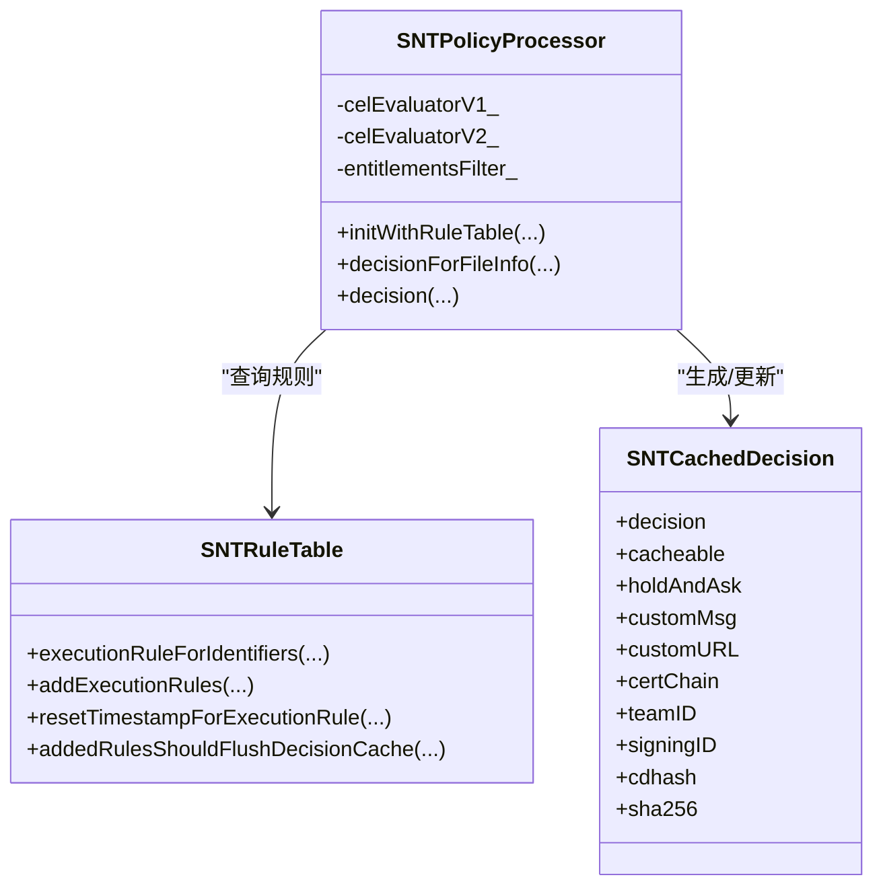
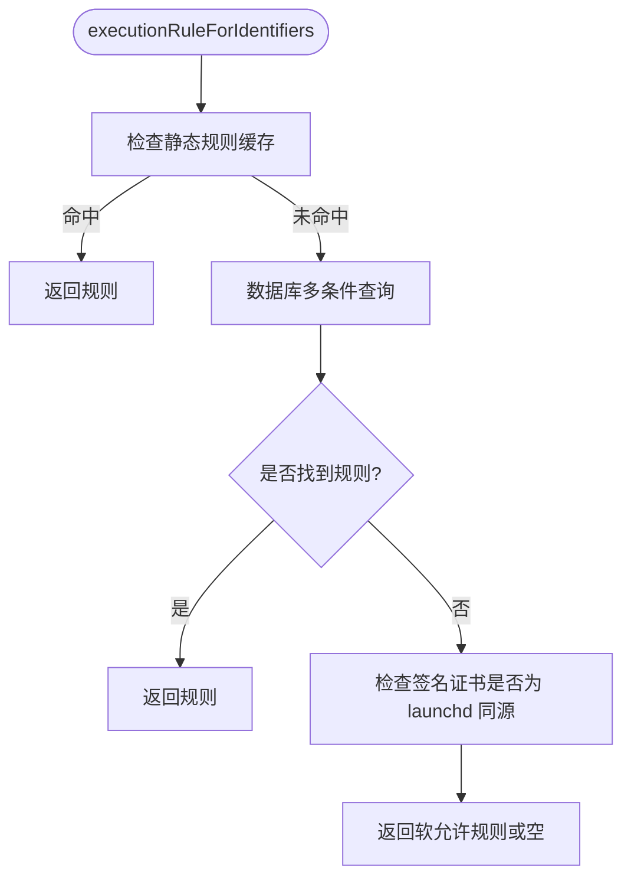
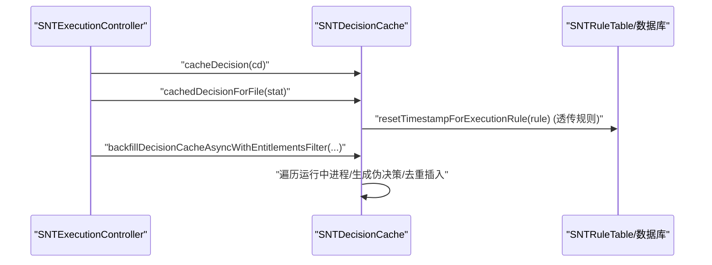
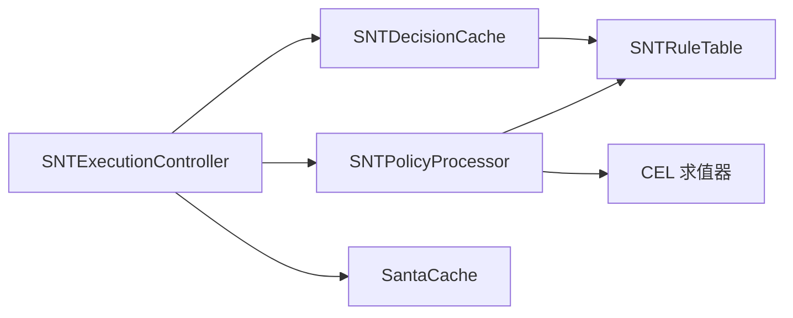

# 策略评估流程

<cite>
**本文引用的文件**
- [SNTDecisionCache.h](file://Source/santad/SNTDecisionCache.h)
- [SNTDecisionCache.mm](file://Source/santad/SNTDecisionCache.mm)
- [SNTPolicyProcessor.h](file://Source/santad/SNTPolicyProcessor.h)
- [SNTPolicyProcessor.mm](file://Source/santad/SNTPolicyProcessor.mm)
- [SNTExecutionController.h](file://Source/santad/SNTExecutionController.h)
- [SNTExecutionController.mm](file://Source/santad/SNTExecutionController.mm)
- [SNTRuleTable.h](file://Source/santad/DataLayer/SNTRuleTable.h)
- [SNTRuleTable.mm](file://Source/santad/DataLayer/SNTRuleTable.mm)
- [SantaCache.h](file://Source/common/SantaCache.h)
- [SNTCachedDecision.h](file://Source/common/SNTCachedDecision.h)
- [SNTFileInfo.h](file://Source/common/SNTFileInfo.h)
- [SNTCommonEnums.h](file://Source/common/SNTCommonEnums.h)
- [SNTConfigurator.h](file://Source/common/SNTConfigurator.h)
- [cel/Evaluator.h](file://Source/common/cel/Evaluator.h)
- [cel/Activation.h](file://Source/common/cel/Activation.h)
</cite>

## 目录
1. [引言](#引言)
2. [项目结构](#项目结构)
3. [核心组件](#核心组件)
4. [架构总览](#架构总览)
5. [详细组件分析](#详细组件分析)
6. [依赖关系分析](#依赖关系分析)
7. [性能考量](#性能考量)
8. [故障排除指南](#故障排除指南)
9. [结论](#结论)
10. [附录](#附录)

## 引言
本技术文档围绕 Santa 的“策略评估流程”展开，系统性阐述从内核事件到最终决策的完整生命周期、规则匹配算法、优先级排序与冲突解决机制、决策缓存的设计与内存管理、性能优化策略、监控指标与故障排除方法，并给出测试与批量处理建议。目标是帮助开发者与运维人员在理解代码实现细节的同时，能够高效地定位问题、优化性能并稳定运行策略评估链路。

## 项目结构
Santa 的策略评估主要由以下模块协作完成：
- 执行控制器：接收内核 EndpointSecurity 事件，构建上下文并委托策略处理器生成决策。
- 策略处理器：基于规则表与签名信息进行规则匹配、CEL 表达式求值、状态映射与特殊规则处理（如静默阻止、编译器规则）。
- 规则表：维护执行规则与文件访问规则，提供优先级查询、哈希校验、过期清理与缓存一致性控制。
- 决策缓存：对已评估的执行决策进行短期缓存，加速重复命中场景并支持回填与时间戳重置。
- 通用缓存：高性能并发哈希表，用于内核态/用户态共享的键值缓存（如进程信号缓存）。
- 公共模型：SNTCachedDecision、SNTFileInfo、SNTCommonEnums、SNTConfigurator 等支撑数据与配置。

图表来源
- [SNTExecutionController.mm](file://Source/santad/SNTExecutionController.mm#L192-L437)
- [SNTPolicyProcessor.mm](file://Source/santad/SNTPolicyProcessor.mm#L105-L258)
- [SNTRuleTable.mm](file://Source/santad/DataLayer/SNTRuleTable.mm#L438-L516)
- [SNTDecisionCache.mm](file://Source/santad/SNTDecisionCache.mm#L73-L112)
- [SantaCache.h](file://Source/common/SantaCache.h#L48-L113)

章节来源
- [SNTExecutionController.h](file://Source/santad/SNTExecutionController.h#L55-L107)
- [SNTExecutionController.mm](file://Source/santad/SNTExecutionController.mm#L192-L437)
- [SNTPolicyProcessor.h](file://Source/santad/SNTPolicyProcessor.h#L33-L77)
- [SNTPolicyProcessor.mm](file://Source/santad/SNTPolicyProcessor.mm#L105-L258)
- [SNTRuleTable.h](file://Source/santad/DataLayer/SNTRuleTable.h#L83-L171)
- [SNTRuleTable.mm](file://Source/santad/DataLayer/SNTRuleTable.mm#L438-L516)
- [SNTDecisionCache.h](file://Source/santad/SNTDecisionCache.h#L23-L34)
- [SNTDecisionCache.mm](file://Source/santad/SNTDecisionCache.mm#L73-L112)
- [SantaCache.h](file://Source/common/SantaCache.h#L48-L113)

## 核心组件
- 执行控制器（SNTExecutionController）
  - 负责接收 EXEC 事件，快速判定是否需要进一步处理；构造 SNTFileInfo、获取签名信息；调用策略处理器生成决策；根据决策结果向内核响应、记录事件、触发 GUI 通知或 TTY 输出。
  - 关键职责：同步轻量检查、异步事件落库、用户交互（Hold/Resume）、计数器统计。
- 策略处理器（SNTPolicyProcessor）
  - 基于 RuleIdentifiers（cdhash/binarySHA256/signingID/certSHA256/teamID）查询规则表；若匹配 CEL 规则则通过 CEL 求值器计算；将规则状态映射为事件状态；处理编译器/静默阻止等特殊规则；更新自定义消息与 URL。
- 规则表（SNTRuleTable）
  - 提供按优先级顺序的规则查找（cdhash > binary > signingID > certificate > teamID）；支持静态规则缓存、CEL 表达式预编译、规则增删改事务、哈希校验与缓存一致性控制（flushDecisionCache）。
- 决策缓存（SNTDecisionCache）
  - 以 vnode 为键缓存 SNTCachedDecision；提供回填（backfill）能力，扫描运行中进程填充伪决策；支持重置可传递规则的时间戳以避免频繁写库。
- 通用缓存（SantaCache）
  - 高并发、分桶锁的哈希表，支持 get/set/update/remove/foreach/clear 等操作，用于进程信号缓存等高频场景。

章节来源
- [SNTExecutionController.mm](file://Source/santad/SNTExecutionController.mm#L157-L437)
- [SNTPolicyProcessor.mm](file://Source/santad/SNTPolicyProcessor.mm#L105-L258)
- [SNTRuleTable.mm](file://Source/santad/DataLayer/SNTRuleTable.mm#L438-L516)
- [SNTDecisionCache.mm](file://Source/santad/SNTDecisionCache.mm#L114-L205)
- [SantaCache.h](file://Source/common/SantaCache.h#L48-L113)

## 架构总览
策略评估从内核事件进入，经过执行控制器的轻量前置检查后，进入策略处理器的规则匹配与 CEL 求值阶段，随后将决策写入决策缓存并返回给内核。同时，根据配置决定是否记录事件、上传、通知用户或暂停进程等待授权。

图表来源
- [SNTExecutionController.mm](file://Source/santad/SNTExecutionController.mm#L192-L437)
- [SNTPolicyProcessor.mm](file://Source/santad/SNTPolicyProcessor.mm#L305-L402)
- [SNTRuleTable.mm](file://Source/santad/DataLayer/SNTRuleTable.mm#L438-L516)
- [SNTDecisionCache.mm](file://Source/santad/SNTDecisionCache.mm#L73-L112)

## 详细组件分析

### 组件一：执行控制器（SNTExecutionController）
- 同步轻量检查
  - 校验事件类型、路径长度与截断标志；对超长路径直接生成阻断决策并缓存，避免后续昂贵处理。
- 文件信息与签名
  - 通过 SNTFileInfo 获取路径、大小、bundle 信息等；必要时读取签名信息并更新 SNTCachedDecision。
- 策略决策与内核响应
  - 调用 SNTPolicyProcessor 生成决策；根据 cacheable 字段选择带缓存/不带缓存的允许响应；对编译器规则转换为内核可识别的编译器允许。
- 用户交互与进程控制
  - 对需要 Hold 的情况暂停新进程，等待用户授权；授权后恢复，否则终止；使用进程版本号作为键防止误放行。
- 事件记录与上报
  - 根据配置决定是否记录事件；对阻断事件可立即触发上传；TTY 输出阻断详情；GUI 通知携带自定义消息与链接。
- 计数器与度量
  - 统计各类事件响应，便于监控与告警。

图表来源
- [SNTExecutionController.mm](file://Source/santad/SNTExecutionController.mm#L157-L437)

章节来源
- [SNTExecutionController.h](file://Source/santad/SNTExecutionController.h#L55-L107)
- [SNTExecutionController.mm](file://Source/santad/SNTExecutionController.mm#L157-L437)

### 组件二：策略处理器（SNTPolicyProcessor）
- 规则标识符生成
  - 基于 SNTCachedDecision 中的 cdhash、sha256、signingID、certSHA256、teamID 与签名状态生成 RuleIdentifiers。
- 规则匹配与优先级
  - 先查静态规则缓存，再查数据库；按 cdhash > binary > signingID > certificate > teamID 的顺序查找，确保最具体规则优先。
- CEL 表达式求值
  - 支持 v1/v2 两种激活对象；编译表达式并求值；失败时根据 failClosed 配置决定阻断或降级处理；根据返回值映射为允许/阻止/静默阻止/编译器允许等状态。
- 特殊规则处理
  - 编译器规则：当禁用透传规则时，将其视为未命中；静默阻止设置 silentBlock 标志；REQUIRE_TOUCHID 规则不可缓存且需用户授权。
- 状态映射与消息
  - 将规则类型与状态映射为事件状态；设置自定义消息与链接；更新签名相关字段（证书链、团队 ID、签名时间等）。

图表来源
- [SNTPolicyProcessor.h](file://Source/santad/SNTPolicyProcessor.h#L33-L77)
- [SNTPolicyProcessor.mm](file://Source/santad/SNTPolicyProcessor.mm#L105-L258)
- [SNTRuleTable.h](file://Source/santad/DataLayer/SNTRuleTable.h#L83-L171)
- [SNTCachedDecision.h](file://Source/common/SNTCachedDecision.h)

章节来源
- [SNTPolicyProcessor.h](file://Source/santad/SNTPolicyProcessor.h#L33-L77)
- [SNTPolicyProcessor.mm](file://Source/santad/SNTPolicyProcessor.mm#L105-L258)
- [SNTRuleTable.mm](file://Source/santad/DataLayer/SNTRuleTable.mm#L438-L516)

### 组件三：规则表（SNTRuleTable）
- 优先级查询
  - 通过一次多条件查询覆盖 cdhash/binary/signingID/certificate/teamID 的查找，保证优先级与最具体匹配。
- 静态规则缓存
  - 在初始化与配置更新时加载静态规则，减少数据库访问。
- CEL 表达式验证
  - 新增规则前预编译 CEL 表达式，失败即拒绝入库。
- 冲突与一致性
  - 判断新增规则是否需要刷新内核决策缓存：非 Allow 规则数量超过阈值、替换编译器规则、CEL 表达式变更等均触发刷新。
- 过期清理
  - 定期清理长时间未使用的透传规则，降低数据库与缓存压力。

图表来源
- [SNTRuleTable.mm](file://Source/santad/DataLayer/SNTRuleTable.mm#L438-L516)

章节来源
- [SNTRuleTable.h](file://Source/santad/DataLayer/SNTRuleTable.h#L83-L171)
- [SNTRuleTable.mm](file://Source/santad/DataLayer/SNTRuleTable.mm#L438-L516)

### 组件四：决策缓存（SNTDecisionCache）
- 缓存结构
  - 使用 SantaCache<SantaVnode, SNTCachedDecision*> 存储决策；提供 set/get/remove/resetTimestamp 等接口。
- 回填策略
  - 异步扫描运行中进程，为每个进程生成伪 SNTCachedDecision（未知决策、未知客户端模式、不可缓存），填充签名与 entitlements 等信息，避免真实执行时的重复开销。
- 时间戳重置
  - 对透传允许规则，使用时间窗口（默认 3600 秒）限制数据库写频率，减少 I/O 压力。
- 内存管理
  - 采用固定容量上限与分桶锁，满载自动清空，避免无限增长；NSCache 作为辅助的最近使用时间映射。

图表来源
- [SNTDecisionCache.mm](file://Source/santad/SNTDecisionCache.mm#L73-L112)
- [SNTDecisionCache.mm](file://Source/santad/SNTDecisionCache.mm#L114-L205)
- [SNTExecutionController.mm](file://Source/santad/SNTExecutionController.mm#L235-L264)

章节来源
- [SNTDecisionCache.h](file://Source/santad/SNTDecisionCache.h#L23-L34)
- [SNTDecisionCache.mm](file://Source/santad/SNTDecisionCache.mm#L73-L112)
- [SNTDecisionCache.mm](file://Source/santad/SNTDecisionCache.mm#L114-L205)

### 组件五：通用缓存（SantaCache）
- 设计特性
  - 分桶锁、按最大容量动态清空、支持 CAS 更新、遍历与统计；适用于高并发读写场景（如进程信号缓存）。
- 性能要点
  - per_bucket 参数影响命中率与内存占用；容量达到上限时整体清空，避免热点失效导致的持续扩容。

章节来源
- [SantaCache.h](file://Source/common/SantaCache.h#L48-L113)
- [SNTExecutionController.mm](file://Source/santad/SNTExecutionController.mm#L107-L112)

## 依赖关系分析
- 执行控制器依赖策略处理器与决策缓存；策略处理器依赖规则表与 CEL 求值器；规则表依赖数据库层与配置器；决策缓存依赖规则表与数据库控制器。
- 关键耦合点
  - 规则表的 addedRulesShouldFlushDecisionCache 与数据库事务，确保规则变更后内核缓存一致性。
  - 决策缓存的回填与时间戳重置，平衡性能与准确性。

图表来源
- [SNTExecutionController.mm](file://Source/santad/SNTExecutionController.mm#L192-L437)
- [SNTPolicyProcessor.mm](file://Source/santad/SNTPolicyProcessor.mm#L105-L258)
- [SNTRuleTable.mm](file://Source/santad/DataLayer/SNTRuleTable.mm#L707-L769)
- [SNTDecisionCache.mm](file://Source/santad/SNTDecisionCache.mm#L114-L205)

章节来源
- [SNTExecutionController.h](file://Source/santad/SNTExecutionController.h#L55-L107)
- [SNTPolicyProcessor.h](file://Source/santad/SNTPolicyProcessor.h#L33-L77)
- [SNTRuleTable.h](file://Source/santad/DataLayer/SNTRuleTable.h#L113-L171)
- [SNTDecisionCache.h](file://Source/santad/SNTDecisionCache.h#L23-L34)

## 性能考量
- 规则匹配性能
  - 优先级查询仅一次多条件查询，避免多次往返；静态规则缓存显著降低数据库访问。
  - CEL 表达式预编译与缓存，避免重复解析。
- 缓存策略
  - 决策缓存容量上限与分桶锁，满载自动清空；回填策略提前填充热点进程决策。
  - 透传规则时间戳重置采用时间窗口，降低数据库写放大。
- I/O 优化
  - 事件上传使用串行队列异步写入，避免阻塞主线程。
- 并发与锁
  - SantaCache 分桶锁降低竞争；NSCache 限制最近使用条目数量，减少内存占用。
- 监控指标
  - 事件计数器覆盖各类响应类型，便于观察策略命中分布与异常峰值。

章节来源
- [SNTRuleTable.mm](file://Source/santad/DataLayer/SNTRuleTable.mm#L438-L516)
- [SNTPolicyProcessor.mm](file://Source/santad/SNTPolicyProcessor.mm#L105-L258)
- [SNTDecisionCache.mm](file://Source/santad/SNTDecisionCache.mm#L114-L205)
- [SNTExecutionController.mm](file://Source/santad/SNTExecutionController.mm#L125-L154)
- [SantaCache.h](file://Source/common/SantaCache.h#L48-L113)

## 故障排除指南
- 策略评估失败
  - 若 CEL 表达式求值失败且 failClosed 开启，则阻断；否则降级处理。检查规则表达式语法与激活对象字段完整性。
- 决策未缓存
  - REQUIRE_TOUCHID 等规则不可缓存；确认 cacheable 字段；检查策略处理器的状态映射逻辑。
- 透传规则未生效
  - 确认启用透传规则；检查时间戳重置窗口是否过短；核对规则状态与类型映射。
- 规则变更未即时生效
  - 新增/删除/替换规则可能触发内核决策缓存刷新；确认 addedRulesShouldFlushDecisionCache 判定逻辑与数据库事务。
- 事件未上传或延迟
  - 检查 enableAllEventUpload/disableUnknownEventUpload 配置；确认 syncBaseURL 设置；查看事件队列异步写入状态。
- 进程暂停/恢复异常
  - 核对 procSignalCache 键（pid+pidVersion）；确保 Hold 流程结束后正确 Resume/Kill 并移除缓存项。

章节来源
- [SNTPolicyProcessor.mm](file://Source/santad/SNTPolicyProcessor.mm#L136-L181)
- [SNTExecutionController.mm](file://Source/santad/SNTExecutionController.mm#L265-L437)
- [SNTRuleTable.mm](file://Source/santad/DataLayer/SNTRuleTable.mm#L707-L769)
- [SNTDecisionCache.mm](file://Source/santad/SNTDecisionCache.mm#L93-L112)

## 结论
Santa 的策略评估流程通过“执行控制器 + 策略处理器 + 规则表 + 决策缓存”的分层设计，在保证安全性的前提下实现了高性能与可观测性。规则优先级与冲突处理清晰明确，CEL 表达式提供了强大的扩展能力；决策缓存与回填策略有效降低了重复评估成本；严格的数据库一致性与过期清理机制保障了长期稳定性。结合本文提供的性能优化建议与故障排除清单，可在生产环境中获得更稳健的策略评估体验。

## 附录
- 测试方法
  - 单元测试：针对 SNTPolicyProcessor 的规则匹配、CEL 求值、状态映射进行覆盖；对 SNTDecisionCache 的回填与时间戳重置进行行为测试。
  - 集成测试：模拟 EndpointSecurity 事件流，验证从事件接收、策略评估到内核响应与事件落库的端到端流程。
  - 压力测试：构造大量并发执行请求，观测 SantaCache 命中率、规则查询耗时与数据库写入频率。
- 批量处理与优化建议
  - 批量导入规则时使用事务一次性提交，减少刷新次数；对大量阻断规则采用分批导入并监控刷新阈值。
  - 启用静态规则缓存与 CEL 预编译，缩短首次评估耗时。
  - 调整 per_bucket 与容量参数以适配业务规模；定期清理过期透传规则，维持缓存健康度。
- 监控指标建议
  - 事件计数器：Allow/Block/Unknown/Scope/Compiler 等各类响应占比；
  - 规则命中率：不同规则类型的匹配次数与命中率；
  - 缓存命中率：决策缓存 get/set 比例；
  - 数据库写入速率：规则更新与事件落库频率；
  - CEL 求值耗时：表达式编译与执行时间分布。