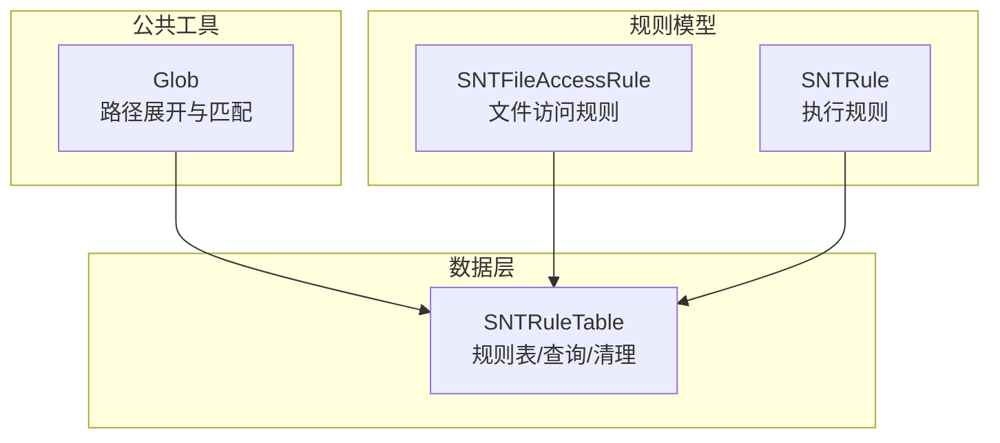
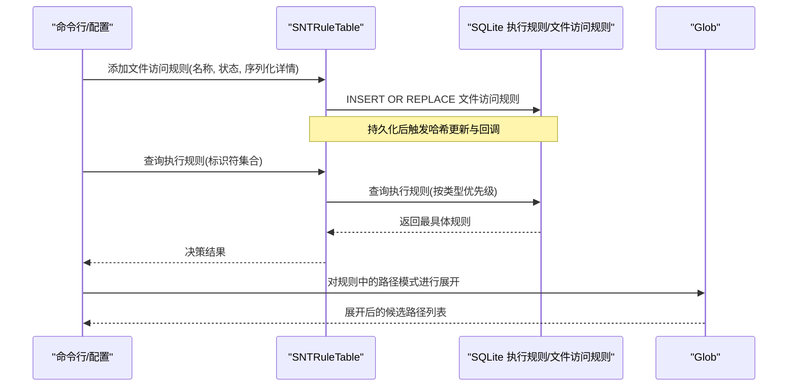
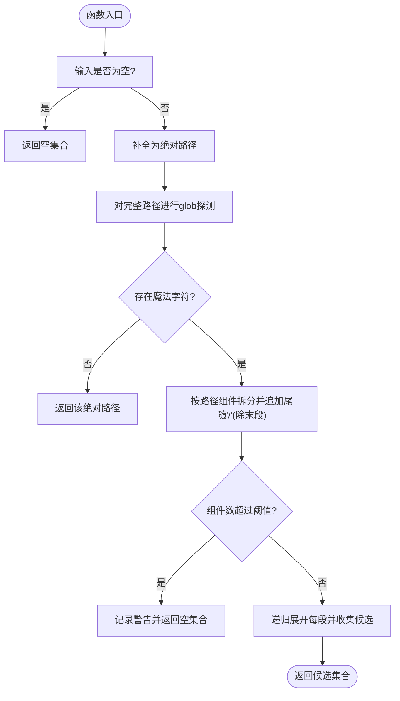
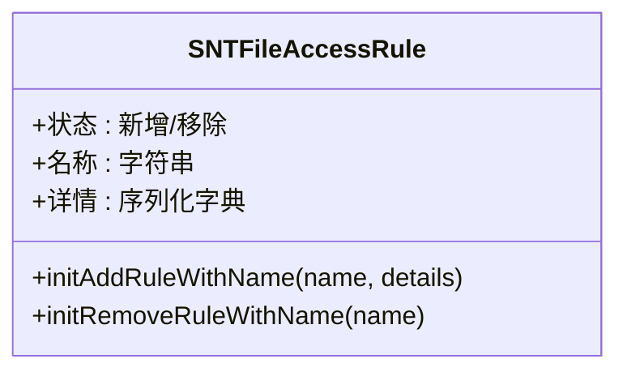
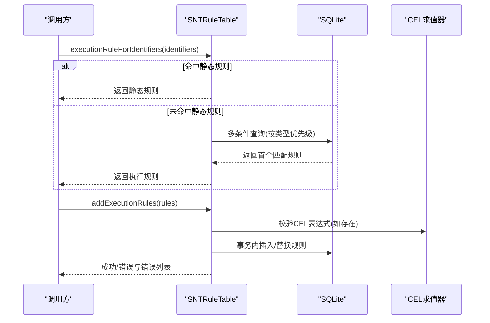
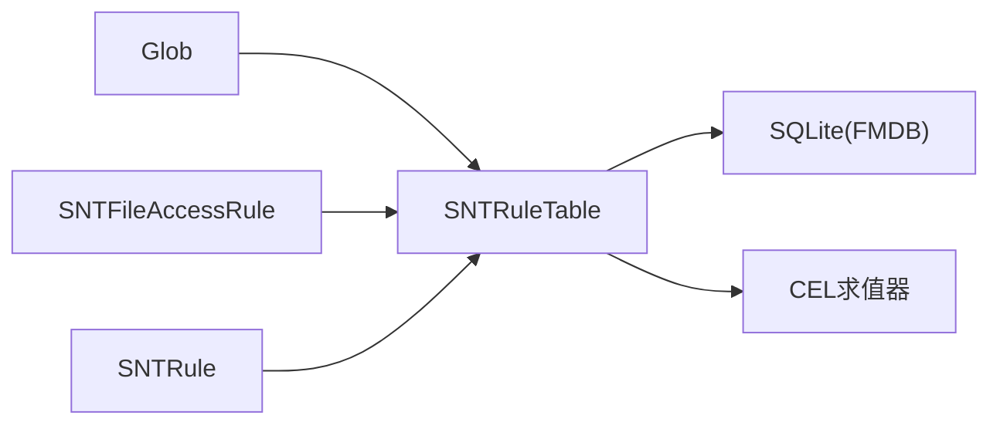

# 路径规则

<cite>
**本文引用的文件**
- [Glob.h](file://Source/common/Glob.h)
- [Glob.mm](file://Source/common/Glob.mm)
- [SNTFileAccessRule.h](file://Source/common/SNTFileAccessRule.h)
- [SNTFileAccessRule.mm](file://Source/common/SNTFileAccessRule.mm)
- [SNTRule.h](file://Source/common/SNTRule.h)
- [SNTRule.mm](file://Source/common/SNTRule.mm)
- [SNTRuleTable.h](file://Source/santad/DataLayer/SNTRuleTable.h)
- [SNTRuleTable.mm](file://Source/santad/DataLayer/SNTRuleTable.mm)
</cite>

## 目录
1. [简介](#简介)
2. [项目结构](#项目结构)
3. [核心组件](#核心组件)
4. [架构总览](#架构总览)
5. [详细组件分析](#详细组件分析)
6. [依赖关系分析](#依赖关系分析)
7. [性能考量](#性能考量)
8. [故障排查指南](#故障排查指南)
9. [结论](#结论)
10. [附录](#附录)

## 简介
本文件面向Santa的“路径规则”能力，聚焦于文件访问规则（File Access Rules）的创建、存储、匹配与管理。尽管Santa的核心执行规则（二进制/证书/签名ID/团队ID/CDHash）采用基于标识符的精确或语义化匹配，但文件访问规则通过名称与序列化细节（含路径模式）实现对文件系统访问事件的控制。本文将系统性说明：
- 基于glob的路径匹配机制与递归展开流程
- 通配符语法与glob模式支持范围
- 规则优先级与冲突解决策略
- 绝对路径、相对路径与动态路径的处理方式
- 创建最佳实践、常见匹配模式与性能调优
- 测试方法、批量管理与规则冲突解决方案

## 项目结构
围绕路径规则的关键代码分布在以下模块：
- 公共工具：Glob（路径展开与匹配）
- 规则模型：SNTFileAccessRule（文件访问规则对象）、SNTRule（执行规则模型）
- 数据层：SNTRuleTable（规则表，负责规则持久化、查询与清理）

图表来源
- [Glob.h](file://Source/common/Glob.h#L1-L30)
- [Glob.mm](file://Source/common/Glob.mm#L1-L138)
- [SNTFileAccessRule.h](file://Source/common/SNTFileAccessRule.h#L1-L33)
- [SNTFileAccessRule.mm](file://Source/common/SNTFileAccessRule.mm#L1-L82)
- [SNTRule.h](file://Source/common/SNTRule.h#L1-L129)
- [SNTRule.mm](file://Source/common/SNTRule.mm#L1-L558)
- [SNTRuleTable.h](file://Source/santad/DataLayer/SNTRuleTable.h#L1-L172)
- [SNTRuleTable.mm](file://Source/santad/DataLayer/SNTRuleTable.mm#L1-L937)

章节来源
- [Glob.h](file://Source/common/Glob.h#L1-L30)
- [Glob.mm](file://Source/common/Glob.mm#L1-L138)
- [SNTFileAccessRule.h](file://Source/common/SNTFileAccessRule.h#L1-L33)
- [SNTFileAccessRule.mm](file://Source/common/SNTFileAccessRule.mm#L1-L82)
- [SNTRule.h](file://Source/common/SNTRule.h#L1-L129)
- [SNTRule.mm](file://Source/common/SNTRule.mm#L1-L558)
- [SNTRuleTable.h](file://Source/santad/DataLayer/SNTRuleTable.h#L1-L172)
- [SNTRuleTable.mm](file://Source/santad/DataLayer/SNTRuleTable.mm#L1-L937)

## 核心组件
- Glob：提供路径组件级的glob展开与递归匹配，支持在不直接匹配到文件系统的情况下，对剩余路径进行“无魔法字符”判定以决定是否监控。
- SNTFileAccessRule：封装文件访问规则的名称、状态（新增/移除）与序列化细节（含路径模式等），用于数据库持久化与同步。
- SNTRule：通用规则模型，用于执行决策（二进制/证书/签名ID/团队ID/CDHash），并支持CEL表达式扩展。
- SNTRuleTable：规则表接口与实现，负责规则入库、查询、清理、哈希校验与缓存刷新策略。

章节来源
- [Glob.mm](file://Source/common/Glob.mm#L1-L138)
- [SNTFileAccessRule.h](file://Source/common/SNTFileAccessRule.h#L1-L33)
- [SNTFileAccessRule.mm](file://Source/common/SNTFileAccessRule.mm#L1-L82)
- [SNTRule.h](file://Source/common/SNTRule.h#L1-L129)
- [SNTRule.mm](file://Source/common/SNTRule.mm#L1-L558)
- [SNTRuleTable.h](file://Source/santad/DataLayer/SNTRuleTable.h#L1-L172)
- [SNTRuleTable.mm](file://Source/santad/DataLayer/SNTRuleTable.mm#L1-L937)

## 架构总览
文件访问规则的生命周期从“创建/导入”到“持久化/查询/清理”，贯穿glob展开与规则优先级判定：

图表来源
- [SNTRuleTable.mm](file://Source/santad/DataLayer/SNTRuleTable.mm#L518-L705)
- [Glob.mm](file://Source/common/Glob.mm#L78-L135)

## 详细组件分析

### Glob：路径展开与匹配
- 功能要点
  - 将输入路径按组件拆分，并在每个组件上应用glob展开；若某组件无匹配且后续无魔法字符，则尝试将剩余路径整体加入候选。
  - 若输入非绝对路径，会自动补全为以“/”开头的绝对路径。
  - 对路径组件数量设置上限，防止过深路径导致递归膨胀。
  - 在组件级追加尾随斜杠以确保仅目录匹配，避免误将文件纳入候选。
- 匹配流程
  - 首先对完整路径进行一次glob探测，若存在魔法字符则逐段展开；若不存在魔法字符则直接返回该路径。
  - 当某段展开为空时，检查是否存在“无魔法字符”的剩余路径，若是则将其拼接作为候选。
  - 递归遍历所有可能的子路径组合，收集最终候选集。

图表来源
- [Glob.mm](file://Source/common/Glob.mm#L78-L135)

章节来源
- [Glob.h](file://Source/common/Glob.h#L1-L30)
- [Glob.mm](file://Source/common/Glob.mm#L1-L138)

### SNTFileAccessRule：文件访问规则对象
- 结构与职责
  - 状态：新增/移除两类。
  - 名称：规则唯一标识，用于命名与检索。
  - 细节：序列化字典，包含路径模式、动作、上下文等字段。
- 编解码与校验
  - 支持安全编码/解码，保证跨进程传输一致性。
  - 新增规则必须提供非空详情，移除规则可仅凭名称删除。

图表来源
- [SNTFileAccessRule.h](file://Source/common/SNTFileAccessRule.h#L1-L33)
- [SNTFileAccessRule.mm](file://Source/common/SNTFileAccessRule.mm#L1-L82)

章节来源
- [SNTFileAccessRule.h](file://Source/common/SNTFileAccessRule.h#L1-L33)
- [SNTFileAccessRule.mm](file://Source/common/SNTFileAccessRule.mm#L1-L82)

### SNTRule：执行规则模型
- 适用范围
  - 用于执行决策（二进制、证书、签名ID、团队ID、CDHash），并支持CEL表达式扩展。
- 关键属性
  - 标识符、状态、类型、自定义消息/链接、时间戳、注释、CEL表达式、静态规则标记。
- 解析与规范化
  - 支持从字典解析并进行大小写规范化，确保规则输入的一致性。
  - 对不同类型的标识符（如二进制/证书强制小写十六进制、团队ID强制大写等）进行格式化。

章节来源
- [SNTRule.h](file://Source/common/SNTRule.h#L1-L129)
- [SNTRule.mm](file://Source/common/SNTRule.mm#L1-L558)

### SNTRuleTable：规则表与查询
- 存储结构
  - 执行规则表：identifier + type 唯一索引，支持多类型规则并存。
  - 文件访问规则表：name 主键，rule_data 二进制存储。
- 查询优先级
  - 静态规则命中顺序：CDHash → 二进制 → 签名ID → 证书 → 团队ID，严格遵循“最具体优先”。
  - 数据库查询采用多条件OR + LIMIT 1，按预设顺序命中首个规则。
- 清理与维护
  - 支持全量/非瞬态/执行规则/文件访问规则清理策略。
  - 定期清理过期瞬态规则，降低数据库规模。
- 决策缓存刷新
  - 当新增规则可能影响既有决策（如引入阻断/CEL变更/覆盖编译器规则）时，触发内核决策缓存刷新。

图表来源
- [SNTRuleTable.h](file://Source/santad/DataLayer/SNTRuleTable.h#L1-L172)
- [SNTRuleTable.mm](file://Source/santad/DataLayer/SNTRuleTable.mm#L438-L516)
- [SNTRuleTable.mm](file://Source/santad/DataLayer/SNTRuleTable.mm#L562-L705)

章节来源
- [SNTRuleTable.h](file://Source/santad/DataLayer/SNTRuleTable.h#L1-L172)
- [SNTRuleTable.mm](file://Source/santad/DataLayer/SNTRuleTable.mm#L1-L937)

## 依赖关系分析
- Glob与SNTRuleTable的耦合
  - 文件访问规则中的路径模式由Glob负责展开；SNTRuleTable负责规则持久化与查询。
- 规则模型间的关系
  - SNTFileAccessRule与SNTRule分别服务于“文件访问控制”和“执行决策”，二者共享统一的规则管理框架（添加、清理、哈希校验）。
- 外部依赖
  - SQLite（FMDB封装）用于规则持久化。
  - CEL求值器用于执行规则的表达式校验与运行（当规则状态为CEL/CELv2）。

图表来源
- [Glob.mm](file://Source/common/Glob.mm#L1-L138)
- [SNTRuleTable.mm](file://Source/santad/DataLayer/SNTRuleTable.mm#L1-L937)
- [SNTFileAccessRule.mm](file://Source/common/SNTFileAccessRule.mm#L1-L82)
- [SNTRule.mm](file://Source/common/SNTRule.mm#L1-L558)

章节来源
- [Glob.mm](file://Source/common/Glob.mm#L1-L138)
- [SNTRuleTable.mm](file://Source/santad/DataLayer/SNTRuleTable.mm#L1-L937)
- [SNTFileAccessRule.mm](file://Source/common/SNTFileAccessRule.mm#L1-L82)
- [SNTRule.mm](file://Source/common/SNTRule.mm#L1-L558)

## 性能考量
- Glob展开
  - 限制路径组件数量，避免深层递归导致的指数爆炸。
  - 在组件级追加尾随斜杠，减少文件误匹配，提高后续筛选效率。
- 规则查询
  - 静态规则命中顺序固定，数据库查询使用多条件OR + LIMIT 1，避免不必要的排序与全表扫描。
  - 对CEL表达式进行预编译校验，失败即早返回，减少无效计算。
- 决策缓存刷新
  - 当新增规则可能改变既有决策时才刷新缓存，避免频繁刷新带来的抖动。
- 数据库维护
  - 定期清理过期瞬态规则，保持规则表规模可控，提升查询性能。

章节来源
- [Glob.mm](file://Source/common/Glob.mm#L111-L135)
- [SNTRuleTable.mm](file://Source/santad/DataLayer/SNTRuleTable.mm#L438-L516)
- [SNTRuleTable.mm](file://Source/santad/DataLayer/SNTRuleTable.mm#L707-L769)
- [SNTRuleTable.mm](file://Source/santad/DataLayer/SNTRuleTable.mm#L783-L800)

## 故障排查指南
- 规则添加失败
  - 检查规则有效性（类型、状态、标识符格式）与CEL表达式合法性。
  - 查看数据库错误信息与错误码，定位插入/替换失败原因。
- 查询不到预期规则
  - 确认静态规则命中顺序与数据库查询条件是否一致。
  - 核对标识符大小写与格式（二进制/证书强制小写十六进制，团队ID强制大写）。
- 决策异常波动
  - 关注是否触发了决策缓存刷新（新增阻断/CEL变更/覆盖编译器规则）。
  - 检查是否存在大量新规则同时生效导致的缓存重算。
- 路径模式不生效
  - 使用Glob展开验证路径组件是否正确拆分与展开。
  - 确认路径是否为绝对路径，必要时手动补全前缀“/”。

章节来源
- [SNTRuleTable.mm](file://Source/santad/DataLayer/SNTRuleTable.mm#L562-L705)
- [SNTRule.mm](file://Source/common/SNTRule.mm#L1-L558)
- [Glob.mm](file://Source/common/Glob.mm#L1-L138)

## 结论
Santa的路径规则体系以“文件访问规则”为核心，结合Glob路径展开与严格的规则优先级，实现了对文件系统访问事件的细粒度控制。通过SQLite持久化、CEL表达式扩展与定期清理策略，系统在保证灵活性的同时兼顾性能与稳定性。建议在实践中遵循“最小权限原则”与“明确优先级”，并通过批量管理与测试验证确保规则质量。

## 附录

### 通配符语法与glob模式支持
- 支持范围
  - 基于POSIX glob语义，支持常见通配符（如“*”、“?”、“[]”等）。
  - 在组件级展开，逐段匹配，最后对剩余路径进行“无魔法字符”判定以决定是否纳入候选。
- 注意事项
  - 非绝对路径将被自动补全为绝对路径。
  - 过深路径会被限制，防止递归膨胀。

章节来源
- [Glob.mm](file://Source/common/Glob.mm#L78-L135)

### 绝对路径、相对路径与动态路径
- 绝对路径
  - 直接参与glob展开；若无魔法字符，直接作为候选。
- 相对路径
  - 自动补全为绝对路径后再展开。
- 动态路径
  - 通过glob魔法字符实现动态匹配；若某段无匹配且剩余路径无魔法字符，则将剩余路径拼接为候选。

章节来源
- [Glob.mm](file://Source/common/Glob.mm#L78-L135)

### 规则优先级与冲突解决
- 静态规则优先级（命中顺序）
  - CDHash → 二进制 → 签名ID → 证书 → 团队ID。
- 数据库规则查询
  - 多条件OR + LIMIT 1，确保命中首个最具体规则。
- 决策缓存刷新
  - 新增阻断/CEL变更/覆盖编译器规则时刷新缓存，确保新规则生效。

章节来源
- [SNTRuleTable.mm](file://Source/santad/DataLayer/SNTRuleTable.mm#L438-L516)
- [SNTRuleTable.mm](file://Source/santad/DataLayer/SNTRuleTable.mm#L707-L769)

### 最佳实践与常见模式
- 最佳实践
  - 明确规则目标（允许/阻断/静默阻断），尽量使用精确路径或最小必要通配符。
  - 对动态路径使用“无魔法字符”的剩余路径判定，避免过度展开。
  - 合理使用CEL表达式进行条件控制，避免复杂表达式导致的性能问题。
- 常见模式
  - 允许特定目录下的任意文件：/Applications/*/*.app/*
  - 阻断特定扩展名：/**/*.ext
  - 允许系统关键路径：/usr/bin/*、/System/Library/** 等（结合默认静默集）

章节来源
- [Glob.mm](file://Source/common/Glob.mm#L78-L135)
- [SNTRuleTable.mm](file://Source/santad/DataLayer/SNTRuleTable.mm#L438-L516)

### 测试方法与批量管理
- 测试方法
  - 使用Glob展开验证路径模式是否符合预期。
  - 对规则添加/删除/替换进行端到端回归测试，关注数据库错误与CEL表达式校验。
- 批量管理
  - 通过清理策略（全量/非瞬态/执行规则/文件访问规则）进行批量导入与清理。
  - 导入后触发哈希更新与回调，便于感知规则变化。

章节来源
- [SNTRuleTable.mm](file://Source/santad/DataLayer/SNTRuleTable.mm#L631-L705)
- [Glob.mm](file://Source/common/Glob.mm#L78-L135)