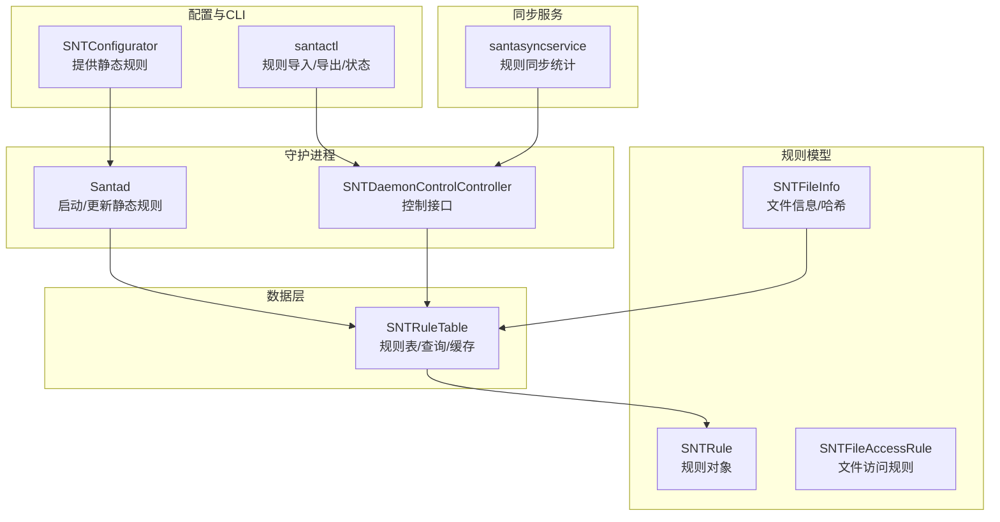
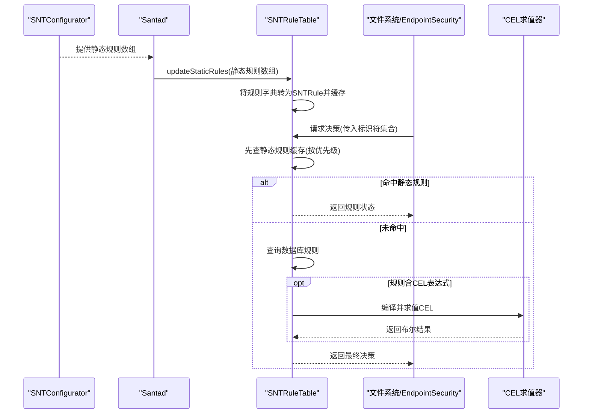
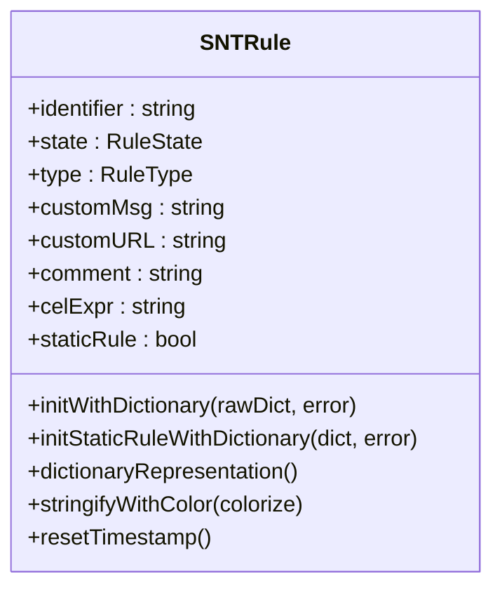
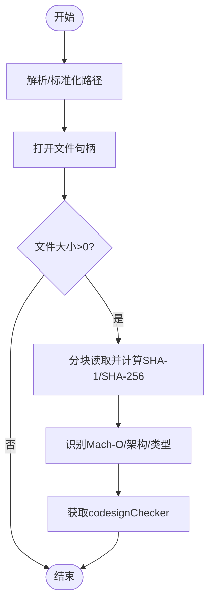
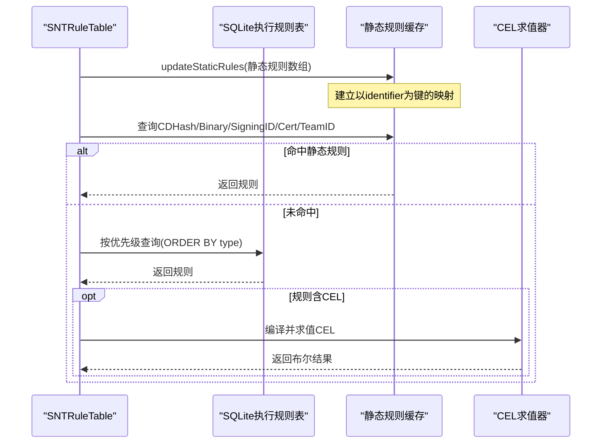
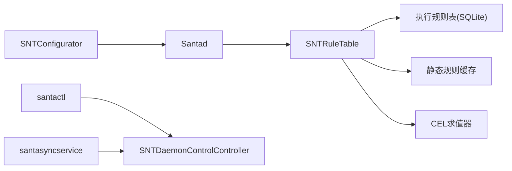

# 静态规则

<cite>
**本文引用的文件**
- [Source/common/SNTRule.h](file://Source/common/SNTRule.h)
- [Source/common/SNTRule.mm](file://Source/common/SNTRule.mm)
- [Source/common/SNTFileInfo.h](file://Source/common/SNTFileInfo.h)
- [Source/common/SNTFileInfo.mm](file://Source/common/SNTFileInfo.mm)
- [Source/common/SNTFileAccessRule.h](file://Source/common/SNTFileAccessRule.h)
- [Source/common/SNTFileAccessRule.mm](file://Source/common/SNTFileAccessRule.mm)
- [Source/santad/DataLayer/SNTRuleTable.mm](file://Source/santad/DataLayer/SNTRuleTable.mm)
- [Source/santad/DataLayer/SNTRuleTable.h](file://Source/santad/DataLayer/SNTRuleTable.h)
- [Source/santad/SNTDaemonControlController.mm](file://Source/santad/SNTDaemonControlController.mm)
- [Source/santad/Santad.mm](file://Source/santad/Santad.mm)
- [Source/santactl/Commands/SNTCommandRule.mm](file://Source/santactl/Commands/SNTCommandRule.mm)
- [Source/santactl/Commands/SNTCommandStatus.mm](file://Source/santactl/Commands/SNTCommandStatus.mm)
- [Source/common/SNTConfigurator.mm](file://Source/common/SNTConfigurator.mm)
- [Source/santasyncservice/SNTSyncPostflight.mm](file://Source/santasyncservice/SNTSyncPostflight.mm)
</cite>

## 目录
1. [引言](#引言)
2. [项目结构](#项目结构)
3. [核心组件](#核心组件)
4. [架构总览](#架构总览)
5. [详细组件分析](#详细组件分析)
6. [依赖关系分析](#依赖关系分析)
7. [性能考量](#性能考量)
8. [故障排查指南](#故障排查指南)
9. [结论](#结论)
10. [附录](#附录)

## 引言
本文件面向Santa的“静态规则”系统，系统性阐述其概念、应用场景、实现机制与最佳实践。静态规则是通过配置注入到守护进程中的规则集合，不依赖云端同步，具备高性能、低延迟的特点；与动态规则（由同步服务下发）相比，静态规则在启动阶段即加载入内存缓存，查询时优先匹配，从而显著降低决策延迟。同时，静态规则支持多种标识符类型（如二进制哈希、签名ID、证书哈希、团队ID、CDHash），并可与CEL表达式结合，实现灵活的条件化授权。

## 项目结构
围绕静态规则的关键代码分布在以下模块：
- 规则模型与解析：SNTRule（规则对象）、SNTFileInfo（文件信息与哈希提取）
- 数据层与查询：SNTRuleTable（规则表、静态规则缓存、查询逻辑）
- 守护进程集成：Santad（启动时加载静态规则）、SNTDaemonControlController（控制面交互）
- 配置来源：SNTConfigurator（提供静态规则数组）
- 命令行工具：santactl（规则导入导出、状态查看）
- 同步服务：santasyncservice（规则同步统计上报）

图示来源
- [Source/common/SNTRule.mm](file://Source/common/SNTRule.mm#L253-L365)
- [Source/common/SNTFileInfo.mm](file://Source/common/SNTFileInfo.mm#L156-L222)
- [Source/santad/DataLayer/SNTRuleTable.mm](file://Source/santad/DataLayer/SNTRuleTable.mm#L330-L334)
- [Source/santad/Santad.mm](file://Source/santad/Santad.mm#L408-L415)
- [Source/common/SNTConfigurator.mm](file://Source/common/SNTConfigurator.mm#L964-L964)
- [Source/santactl/Commands/SNTCommandRule.mm](file://Source/santactl/Commands/SNTCommandRule.mm#L126-L126)
- [Source/santasyncservice/SNTSyncPostflight.mm](file://Source/santasyncservice/SNTSyncPostflight.mm#L35-L36)

章节来源
- [Source/common/SNTRule.h](file://Source/common/SNTRule.h#L1-L129)
- [Source/common/SNTRule.mm](file://Source/common/SNTRule.mm#L253-L365)
- [Source/common/SNTFileInfo.h](file://Source/common/SNTFileInfo.h#L1-L248)
- [Source/common/SNTFileInfo.mm](file://Source/common/SNTFileInfo.mm#L156-L222)
- [Source/santad/DataLayer/SNTRuleTable.mm](file://Source/santad/DataLayer/SNTRuleTable.mm#L330-L334)
- [Source/santad/Santad.mm](file://Source/santad/Santad.mm#L408-L415)
- [Source/common/SNTConfigurator.mm](file://Source/common/SNTConfigurator.mm#L964-L964)
- [Source/santactl/Commands/SNTCommandRule.mm](file://Source/santactl/Commands/SNTCommandRule.mm#L126-L126)
- [Source/santasyncservice/SNTSyncPostflight.mm](file://Source/santasyncservice/SNTSyncPostflight.mm#L35-L36)

## 核心组件
- SNTRule：规则对象，支持多种规则类型与状态，内置字典初始化与序列化能力，并标记是否为静态规则。
- SNTFileInfo：文件信息与哈希提取，提供SHA-1/SHA-256等摘要，用于规则匹配。
- SNTRuleTable：规则表与查询引擎，负责将静态规则缓存到内存、按优先级顺序查询、执行CEL表达式、维护规则哈希与清理过期规则。
- SNTConfigurator：提供静态规则数组，作为静态规则的数据源。
- Santad：在启动或配置变更时调用规则表更新静态规则缓存。
- SNTDaemonControlController：控制面接口，暴露静态规则数量查询与限制行为（当存在静态规则或同步URL时的行为）。
- santactl：命令行工具，支持从JSON导入/导出规则，展示静态规则计数等状态信息。

章节来源
- [Source/common/SNTRule.h](file://Source/common/SNTRule.h#L1-L129)
- [Source/common/SNTRule.mm](file://Source/common/SNTRule.mm#L253-L365)
- [Source/common/SNTFileInfo.h](file://Source/common/SNTFileInfo.h#L1-L248)
- [Source/common/SNTFileInfo.mm](file://Source/common/SNTFileInfo.mm#L156-L222)
- [Source/santad/DataLayer/SNTRuleTable.mm](file://Source/santad/DataLayer/SNTRuleTable.mm#L330-L334)
- [Source/common/SNTConfigurator.mm](file://Source/common/SNTConfigurator.mm#L964-L964)
- [Source/santad/Santad.mm](file://Source/santad/Santad.mm#L408-L415)
- [Source/santactl/Commands/SNTCommandRule.mm](file://Source/santactl/Commands/SNTCommandRule.mm#L126-L126)
- [Source/santactl/Commands/SNTCommandStatus.mm](file://Source/santactl/Commands/SNTCommandStatus.mm#L290-L290)

## 架构总览
静态规则的生命周期如下：
- 配置阶段：SNTConfigurator提供静态规则数组（通常来自本地配置文件或打包资源）。
- 加载阶段：Santad在启动或配置变更时调用SNTRuleTable.updateStaticRules，将静态规则字典转换为SNTRule对象并建立以标识符为键的内存映射。
- 查询阶段：当发生执行事件时，SNTRuleTable先在静态规则缓存中按CDHash→二进制SHA-256→SigningID→证书SHA-256→TeamID的顺序进行匹配；若未命中再查询数据库规则。
- 决策阶段：若匹配到CEL表达式规则，则通过CEL求值器进行计算；否则直接返回规则状态（允许/阻止等）。
- 维护阶段：定期清理过期的Transitive规则，保持规则集规模可控。

图示来源
- [Source/common/SNTConfigurator.mm](file://Source/common/SNTConfigurator.mm#L964-L964)
- [Source/santad/Santad.mm](file://Source/santad/Santad.mm#L408-L415)
- [Source/santad/DataLayer/SNTRuleTable.mm](file://Source/santad/DataLayer/SNTRuleTable.mm#L330-L334)
- [Source/santad/DataLayer/SNTRuleTable.mm](file://Source/santad/DataLayer/SNTRuleTable.mm#L438-L516)

## 详细组件分析

### 组件A：SNTRule（规则对象）
- 职责：封装单条规则的标识符、类型、状态、自定义消息/链接、注释、CEL表达式以及是否为静态规则等属性；提供字典初始化、序列化与字符串化输出。
- 关键点：
  - 字典初始化会规范化键名大小写与值大小写（如策略与类型字段统一为大写），并校验标识符格式（不同规则类型有不同的长度与字符要求）。
  - 支持CEL表达式规则（CEL/CELv2），在添加或更新时进行编译校验。
  - 标记staticRule属性，便于在CLI输出中区分静态规则。

图示来源
- [Source/common/SNTRule.h](file://Source/common/SNTRule.h#L1-L129)
- [Source/common/SNTRule.mm](file://Source/common/SNTRule.mm#L253-L365)
- [Source/common/SNTRule.mm](file://Source/common/SNTRule.mm#L367-L407)

章节来源
- [Source/common/SNTRule.h](file://Source/common/SNTRule.h#L1-L129)
- [Source/common/SNTRule.mm](file://Source/common/SNTRule.mm#L253-L365)
- [Source/common/SNTRule.mm](file://Source/common/SNTRule.mm#L367-L407)

### 组件B：SNTFileInfo（文件信息与哈希）
- 职责：从磁盘路径获取文件信息，计算SHA-1/SHA-256摘要，识别Mach-O类型、架构、bundle信息、隔离数据等；为规则匹配提供输入。
- 关键点：
  - 摘要计算采用分块读取与预读建议，兼顾性能与稳定性。
  - 提供codesignCheckerWithError以获取签名链信息，用于后续决策。

图示来源
- [Source/common/SNTFileInfo.mm](file://Source/common/SNTFileInfo.mm#L156-L222)
- [Source/common/SNTFileInfo.mm](file://Source/common/SNTFileInfo.mm#L224-L238)
- [Source/common/SNTFileInfo.mm](file://Source/common/SNTFileInfo.mm#L240-L302)
- [Source/common/SNTFileInfo.mm](file://Source/common/SNTFileInfo.mm#L792-L800)

章节来源
- [Source/common/SNTFileInfo.h](file://Source/common/SNTFileInfo.h#L1-L248)
- [Source/common/SNTFileInfo.mm](file://Source/common/SNTFileInfo.mm#L156-L222)
- [Source/common/SNTFileInfo.mm](file://Source/common/SNTFileInfo.mm#L224-L238)
- [Source/common/SNTFileInfo.mm](file://Source/common/SNTFileInfo.mm#L240-L302)
- [Source/common/SNTFileInfo.mm](file://Source/common/SNTFileInfo.mm#L792-L800)

### 组件C：SNTRuleTable（规则表/查询/缓存）
- 职责：维护执行规则数据库、缓存静态规则、按优先级查询规则、编译CEL表达式、计算规则哈希、清理过期规则。
- 关键点：
  - 初始化数据库版本迁移、添加CEL表达式列、拆分执行规则与文件访问规则表。
  - 在启动时从配置加载静态规则并建立缓存；查询时优先检查静态规则缓存，再查询数据库。
  - 对于CEL规则，分别使用CEL与CELv2求值器进行编译与求值。
  - 定期清理过期Transitive规则，避免规则库膨胀。

图示来源
- [Source/santad/DataLayer/SNTRuleTable.mm](file://Source/santad/DataLayer/SNTRuleTable.mm#L330-L334)
- [Source/santad/DataLayer/SNTRuleTable.mm](file://Source/santad/DataLayer/SNTRuleTable.mm#L438-L516)
- [Source/santad/DataLayer/SNTRuleTable.mm](file://Source/santad/DataLayer/SNTRuleTable.mm#L562-L620)
- [Source/santad/DataLayer/SNTRuleTable.mm](file://Source/santad/DataLayer/SNTRuleTable.mm#L835-L866)

章节来源
- [Source/santad/DataLayer/SNTRuleTable.mm](file://Source/santad/DataLayer/SNTRuleTable.mm#L330-L334)
- [Source/santad/DataLayer/SNTRuleTable.mm](file://Source/santad/DataLayer/SNTRuleTable.mm#L438-L516)
- [Source/santad/DataLayer/SNTRuleTable.mm](file://Source/santad/DataLayer/SNTRuleTable.mm#L562-L620)
- [Source/santad/DataLayer/SNTRuleTable.mm](file://Source/santad/DataLayer/SNTRuleTable.mm#L835-L866)

### 组件D：Santad与SNTDaemonControlController（集成与控制）
- 职责：Santad在启动或配置变更时更新静态规则缓存；SNTDaemonControlController在控制面暴露静态规则数量查询，并在存在同步URL或静态规则时限制某些行为。
- 关键点：
  - 配置变更回调触发SNTRuleTable.updateStaticRules。
  - 控制面接口在特定条件下返回静态规则计数，并限制外部导入非静态规则的行为。

章节来源
- [Source/santad/Santad.mm](file://Source/santad/Santad.mm#L408-L415)
- [Source/santad/SNTDaemonControlController.mm](file://Source/santad/SNTDaemonControlController.mm#L165-L165)
- [Source/santad/SNTDaemonControlController.mm](file://Source/santad/SNTDaemonControlController.mm#L236-L243)

### 组件E：santactl（CLI工具）
- 职责：支持从JSON导入/导出规则、打印状态（包括静态规则计数）、doctor诊断等。
- 关键点：
  - 导入/导出规则时，会区分静态规则与其他规则；状态输出包含静态规则计数。

章节来源
- [Source/santactl/Commands/SNTCommandRule.mm](file://Source/santactl/Commands/SNTCommandRule.mm#L126-L126)
- [Source/santactl/Commands/SNTCommandStatus.mm](file://Source/santactl/Commands/SNTCommandStatus.mm#L290-L290)

## 依赖关系分析
- 静态规则数据源：SNTConfigurator → Santad → SNTRuleTable.updateStaticRules
- 查询路径：SNTFileInfo（提供标识符） → SNTRuleTable（静态缓存优先，再查数据库） → CEL求值器（可选）
- 控制面约束：SNTDaemonControlController在存在静态规则或同步URL时限制行为
- 同步统计：santasyncservice上报规则接收/处理计数，与静态规则无直接耦合但共享规则表

图示来源
- [Source/common/SNTConfigurator.mm](file://Source/common/SNTConfigurator.mm#L964-L964)
- [Source/santad/Santad.mm](file://Source/santad/Santad.mm#L408-L415)
- [Source/santad/DataLayer/SNTRuleTable.mm](file://Source/santad/DataLayer/SNTRuleTable.mm#L330-L334)
- [Source/santactl/Commands/SNTCommandRule.mm](file://Source/santactl/Commands/SNTCommandRule.mm#L126-L126)
- [Source/santasyncservice/SNTSyncPostflight.mm](file://Source/santasyncservice/SNTSyncPostflight.mm#L35-L36)

章节来源
- [Source/common/SNTConfigurator.mm](file://Source/common/SNTConfigurator.mm#L964-L964)
- [Source/santad/Santad.mm](file://Source/santad/Santad.mm#L408-L415)
- [Source/santad/DataLayer/SNTRuleTable.mm](file://Source/santad/DataLayer/SNTRuleTable.mm#L330-L334)
- [Source/santactl/Commands/SNTCommandRule.mm](file://Source/santactl/Commands/SNTCommandRule.mm#L126-L126)
- [Source/santasyncservice/SNTSyncPostflight.mm](file://Source/santasyncservice/SNTSyncPostflight.mm#L35-L36)

## 性能考量
- 静态规则的优势
  - 内存缓存：静态规则在启动时加载到内存字典，查询为O(1)平均复杂度，避免每次查询都走数据库。
  - 优先级匹配：按CDHash→二进制SHA-256→SigningID→证书SHA-256→TeamID顺序检查，减少数据库扫描次数。
- 动态规则的权衡
  - 动态规则需要网络同步与数据库查询，存在额外延迟；静态规则适合高频、确定性强的策略。
- CEL表达式
  - 静态规则中的CEL表达式在加载时编译，运行时仅做求值；建议表达式尽量简洁，避免复杂过滤导致求值开销增大。
- 规则清理
  - 定期清理过期Transitive规则，防止规则表膨胀影响查询性能。

[本节为通用性能讨论，无需列出具体文件来源]

## 故障排查指南
- 静态规则未生效
  - 检查Santad是否成功调用updateStaticRules；确认配置中staticRules数组有效。
  - 确认规则字典键名大小写与值格式符合规范（如策略/类型统一为大写，标识符长度与字符合法）。
- CEL表达式错误
  - 添加/更新规则时若CEL表达式无效，会记录错误日志；请修正表达式语法后重试。
- 查询不到预期规则
  - 确认事件中提供的标识符（CDHash/Binary/SigningID/Cert/TeamID）与静态规则一致；注意大小写与格式（如二进制/证书哈希需小写，TeamID需大写）。
- 控制面限制
  - 当存在syncBaseURL或staticRules.count>0时，某些导入行为会被限制；请根据控制面返回信息调整操作。

章节来源
- [Source/santad/DataLayer/SNTRuleTable.mm](file://Source/santad/DataLayer/SNTRuleTable.mm#L835-L866)
- [Source/common/SNTRule.mm](file://Source/common/SNTRule.mm#L253-L365)
- [Source/santad/SNTDaemonControlController.mm](file://Source/santad/SNTDaemonControlController.mm#L236-L243)

## 结论
静态规则通过“配置注入+内存缓存”的方式，在Santa的执行决策路径中提供了低延迟、高确定性的策略覆盖。它与动态规则互补：静态规则适用于高频、稳定策略，动态规则适用于需要集中管理与快速迭代的场景。合理设计静态规则的标识符与CEL表达式，配合定期清理与监控，可在保证安全的同时获得优异的性能表现。

[本节为总结性内容，无需列出具体文件来源]

## 附录

### 静态规则与动态规则的区别
- 生命周期：静态规则由配置注入，启动即生效；动态规则由同步服务下发，可能随时间变化。
- 性能：静态规则查询走内存缓存，延迟更低；动态规则需数据库/网络参与。
- 使用限制：当存在静态规则或同步URL时，控制面可能限制部分导入/删除行为，确保策略一致性。

章节来源
- [Source/santad/SNTDaemonControlController.mm](file://Source/santad/SNTDaemonControlController.mm#L165-L165)
- [Source/santad/SNTDaemonControlController.mm](file://Source/santad/SNTDaemonControlController.mm#L236-L243)

### 创建流程与文件信息提取
- 创建流程
  - 准备规则字典（包含标识符、策略、类型、CEL表达式等字段），交由SNTConfigurator提供给Santad。
  - Santad调用SNTRuleTable.updateStaticRules，将字典转换为SNTRule并缓存。
  - 运行时事件到来时，先查静态缓存，再查数据库，必要时编译并求值CEL。
- 文件信息提取
  - 使用SNTFileInfo计算二进制SHA-256、提取签名信息，作为规则匹配的输入。

章节来源
- [Source/common/SNTConfigurator.mm](file://Source/common/SNTConfigurator.mm#L964-L964)
- [Source/santad/Santad.mm](file://Source/santad/Santad.mm#L408-L415)
- [Source/santad/DataLayer/SNTRuleTable.mm](file://Source/santad/DataLayer/SNTRuleTable.mm#L835-L866)
- [Source/common/SNTFileInfo.mm](file://Source/common/SNTFileInfo.mm#L156-L222)

### 最佳实践
- 标识符格式
  - 二进制/证书哈希使用小写十六进制；TeamID使用大写字母数字；SigningID遵循“TeamID:SigningID”格式。
- CEL表达式
  - 表达式应简洁明确，避免复杂嵌套；在加载阶段完成编译，运行时仅做求值。
- 规则组织
  - 将高频命中规则放入静态规则；动态规则用于临时策略与集中管理。
- 监控与维护
  - 定期清理过期Transitive规则；关注控制面返回的静态规则计数与错误日志。

章节来源
- [Source/common/SNTRule.mm](file://Source/common/SNTRule.mm#L253-L365)
- [Source/santad/DataLayer/SNTRuleTable.mm](file://Source/santad/DataLayer/SNTRuleTable.mm#L800-L804)

### 测试方法、批量处理与维护技巧
- 测试
  - 使用santactl doctor与status检查静态规则计数与规则有效性；对CEL表达式进行单元验证。
- 批量处理
  - 通过santactl导入/导出JSON批量管理规则；注意控制面限制与错误日志。
- 维护
  - 定期评估规则命中率与CEL表达式复杂度；清理不再使用的静态规则，保持缓存命中率。

章节来源
- [Source/santactl/Commands/SNTCommandStatus.mm](file://Source/santactl/Commands/SNTCommandStatus.mm#L290-L290)
- [Source/santactl/Commands/SNTCommandRule.mm](file://Source/santactl/Commands/SNTCommandRule.mm#L126-L126)
- [Source/santasyncservice/SNTSyncPostflight.mm](file://Source/santasyncservice/SNTSyncPostflight.mm#L35-L36)