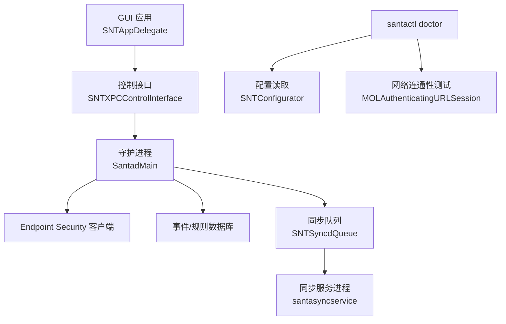
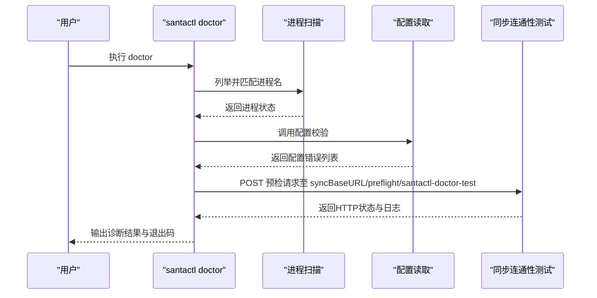
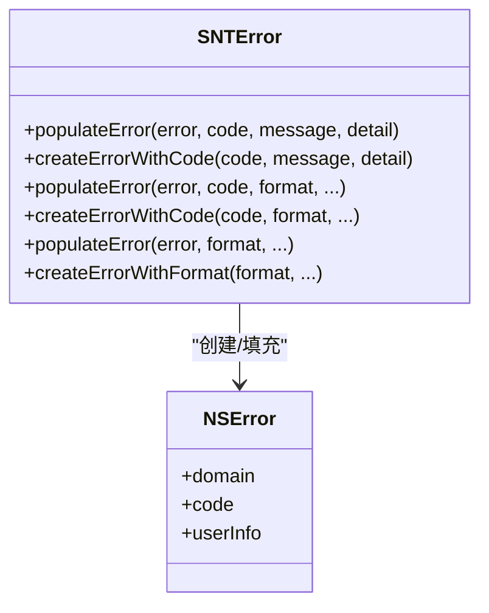
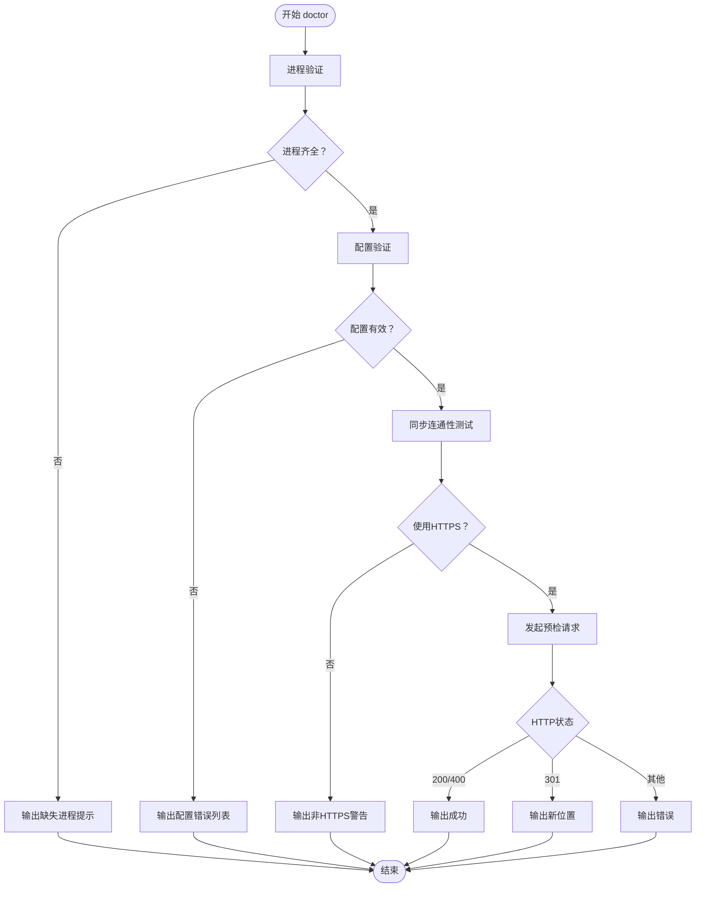
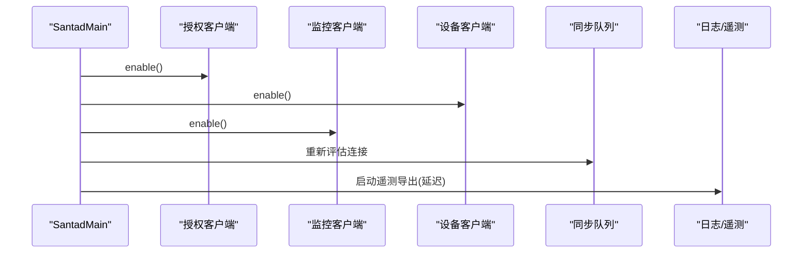
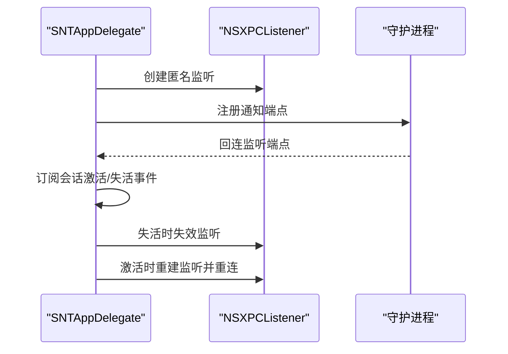
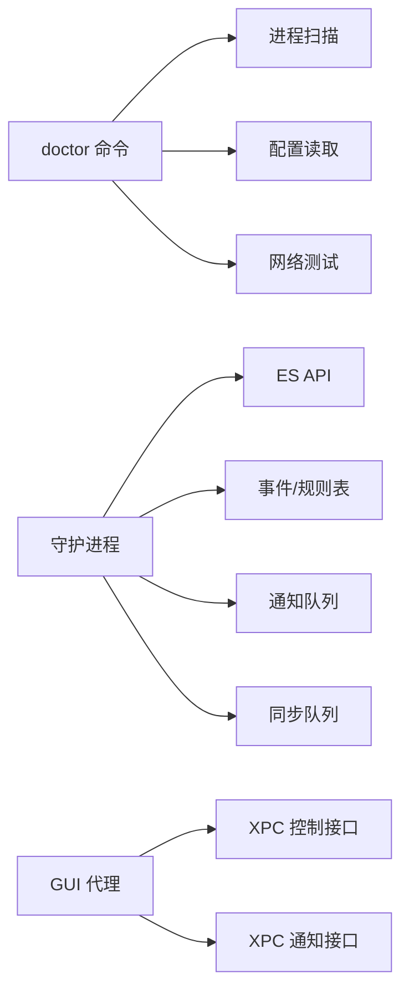

# 常见问题诊断

<cite>
**本文引用的文件**
- [SNTError.h](file://Source/common/SNTError.h)
- [SNTError.mm](file://Source/common/SNTError.mm)
- [SNTCommandDoctor.mm](file://Source/santactl/Commands/SNTCommandDoctor.mm)
- [Santad.mm](file://Source/santad/Santad.mm)
- [SNTAppDelegate.mm](file://Source/gui/SNTAppDelegate.mm)
- [SNTConfigurator.h](file://Source/common/SNTConfigurator.h)
- [SNTConfigurator.mm](file://Source/common/SNTConfigurator.mm)
</cite>

## 目录
1. [简介](#简介)
2. [项目结构](#项目结构)
3. [核心组件](#核心组件)
4. [架构总览](#架构总览)
5. [详细组件分析](#详细组件分析)
6. [依赖关系分析](#依赖关系分析)
7. [性能注意事项](#性能注意事项)
8. [故障排查指南](#故障排查指南)
9. [结论](#结论)
10. [附录](#附录)

## 简介
本指南面向Santa系统的管理员与支持工程师，聚焦于“系统扩展加载失败”“守护进程无法启动”“GUI代理无响应”等典型问题的快速诊断流程。文档基于仓库中的错误码定义、诊断命令实现与关键运行时组件，提供可操作的检查清单、日志定位方法、配置验证步骤，并详解如何使用santactl doctor进行自动化诊断及解读其输出。

## 项目结构
Santa由三大部分组成：GUI前端（通知与交互）、系统扩展/守护进程（santad）与同步服务（可选）。santactl作为命令行工具，提供诊断、规则管理、状态查询等功能。

图表来源
- [Santad.mm](file://Source/santad/Santad.mm#L73-L120)
- [SNTAppDelegate.mm](file://Source/gui/SNTAppDelegate.mm#L121-L157)
- [SNTCommandDoctor.mm](file://Source/santactl/Commands/SNTCommandDoctor.mm#L87-L126)
- [SNTConfigurator.h](file://Source/common/SNTConfigurator.h#L544-L583)

章节来源
- [Santad.mm](file://Source/santad/Santad.mm#L73-L120)
- [SNTAppDelegate.mm](file://Source/gui/SNTAppDelegate.mm#L121-L157)
- [SNTCommandDoctor.mm](file://Source/santactl/Commands/SNTCommandDoctor.mm#L87-L126)
- [SNTConfigurator.h](file://Source/common/SNTConfigurator.h#L544-L583)

## 核心组件
- 错误码与错误对象
  - 错误域与错误码集中定义在SNTError中，覆盖通用、I/O、同步、配置校验、数据库等类别，便于统一识别与处理。
  - 错误对象构造器提供格式化消息与细节填充，便于在CLI与GUI中一致呈现。
- 诊断命令doctor
  - 自动检查进程状态（GUI、系统扩展、同步服务），配置有效性，以及与同步服务器的HTTPS连通性与证书认证设置。
- 运行时守护进程
  - 负责Endpoint Security客户端启用、设备与网络挂载策略、执行授权、遥测导出、配置热更新等。
- GUI代理
  - 通过XPC与守护进程建立双向连接；会话切换时自动重连，确保界面可用性。

章节来源
- [SNTError.h](file://Source/common/SNTError.h#L19-L51)
- [SNTError.mm](file://Source/common/SNTError.mm#L19-L34)
- [SNTCommandDoctor.mm](file://Source/santactl/Commands/SNTCommandDoctor.mm#L87-L126)
- [Santad.mm](file://Source/santad/Santad.mm#L73-L120)
- [SNTAppDelegate.mm](file://Source/gui/SNTAppDelegate.mm#L121-L157)

## 架构总览
下图展示从santactl doctor到各子系统的调用链与数据流。

图表来源
- [SNTCommandDoctor.mm](file://Source/santactl/Commands/SNTCommandDoctor.mm#L79-L126)
- [SNTCommandDoctor.mm](file://Source/santactl/Commands/SNTCommandDoctor.mm#L145-L246)
- [SNTConfigurator.h](file://Source/common/SNTConfigurator.h#L544-L583)

## 详细组件分析

### 组件A：错误码与错误对象（SNTError）
- 错误域与错误码
  - 错误域：用于统一标识Santa相关错误来源。
  - 错误码分类：通用、I/O、同步、配置校验、数据库等，便于脚本化判断与告警。
- 错误对象构造
  - 支持带格式的消息生成与细节字段填充，便于在CLI/GUI中一致呈现。

图表来源
- [SNTError.h](file://Source/common/SNTError.h#L19-L91)
- [SNTError.mm](file://Source/common/SNTError.mm#L23-L34)

章节来源
- [SNTError.h](file://Source/common/SNTError.h#L19-L51)
- [SNTError.mm](file://Source/common/SNTError.mm#L23-L34)

### 组件B：诊断命令doctor（SNTCommandDoctor）
- 进程验证
  - 检查GUI、系统扩展、同步服务是否在运行；若缺失则输出相应提示。
- 配置验证
  - 调用配置器的校验逻辑，逐条输出配置错误。
- 同步连通性验证
  - 若启用同步，强制HTTPS；使用认证会话发起预检请求，记录HTTP状态与重定向位置；对证书/密钥配置进行最小化测试。

图表来源
- [SNTCommandDoctor.mm](file://Source/santactl/Commands/SNTCommandDoctor.mm#L87-L126)
- [SNTCommandDoctor.mm](file://Source/santactl/Commands/SNTCommandDoctor.mm#L145-L246)

章节来源
- [SNTCommandDoctor.mm](file://Source/santactl/Commands/SNTCommandDoctor.mm#L79-L126)
- [SNTCommandDoctor.mm](file://Source/santactl/Commands/SNTCommandDoctor.mm#L145-L246)

### 组件C：守护进程（Santad）
- 客户端启用顺序
  - 先启用授权客户端以订阅EXEC事件，再启用监控与设备客户端，避免第三方执行被阻断。
- 配置热更新
  - 通过KVO监听多项配置变更，必要时刷新缓存或重启以应用更改。
- 同步队列与遥测
  - 在启用遥测导出时延迟启动定时器，避免启动抖动。

图表来源
- [Santad.mm](file://Source/santad/Santad.mm#L73-L120)
- [Santad.mm](file://Source/santad/Santad.mm#L780-L793)

章节来源
- [Santad.mm](file://Source/santad/Santad.mm#L73-L120)
- [Santad.mm](file://Source/santad/Santad.mm#L780-L793)

### 组件D：GUI代理（SNTAppDelegate）
- XPC连接生命周期
  - 创建匿名监听，向守护进程注册通知端点；会话激活/失活时自动重建连接。
- 用户体验
  - 窗口关闭后恢复为Accessory激活策略，避免常驻菜单异常。

图表来源
- [SNTAppDelegate.mm](file://Source/gui/SNTAppDelegate.mm#L121-L157)

章节来源
- [SNTAppDelegate.mm](file://Source/gui/SNTAppDelegate.mm#L121-L157)

## 依赖关系分析
- doctor命令依赖
  - 进程扫描：通过系统API获取PID列表并解析进程名。
  - 配置读取：通过SNTConfigurator读取配置并触发校验。
  - 网络测试：使用认证会话访问同步服务器预检端点。
- 守护进程依赖
  - Endpoint Security API、事件表/规则表、通知队列、同步队列、TTY写入器、进程树等。
- GUI依赖
  - XPC控制接口与通知接口，以及系统工作空间通知中心。

图表来源
- [SNTCommandDoctor.mm](file://Source/santactl/Commands/SNTCommandDoctor.mm#L87-L126)
- [Santad.mm](file://Source/santad/Santad.mm#L73-L120)
- [SNTAppDelegate.mm](file://Source/gui/SNTAppDelegate.mm#L121-L157)

章节来源
- [SNTCommandDoctor.mm](file://Source/santactl/Commands/SNTCommandDoctor.mm#L87-L126)
- [Santad.mm](file://Source/santad/Santad.mm#L73-L120)
- [SNTAppDelegate.mm](file://Source/gui/SNTAppDelegate.mm#L121-L157)

## 性能注意事项
- 启动阶段的客户端启用顺序避免了ES缓存空窗期导致的第三方执行阻断。
- 遥测导出在守护进程启动后延迟启动，减少启动抖动。
- 文件访问策略的日志速率限制参数可在高负载场景下调低日志量，避免磁盘压力。

章节来源
- [Santad.mm](file://Source/santad/Santad.mm#L758-L793)
- [SNTConfigurator.h](file://Source/common/SNTConfigurator.h#L355-L377)

## 故障排查指南

### 快速诊断清单
- 系统扩展/守护进程状态
  - 使用进程扫描确认GUI、系统扩展、同步服务是否在运行。
  - 若缺失，优先检查系统扩展是否已安装并获得许可，以及守护进程是否被安全策略阻止。
- 配置有效性
  - 使用doctor的配置校验输出逐条核对，修正类型不匹配、路径不存在、规则字段缺失等问题。
- 同步连通性
  - 确认同步基地址为HTTPS；若非HTTPS，doctor会标记风险。
  - 检查代理、服务器根证书、客户端证书/密码或系统钥匙串中的CN/Issuer配置是否正确。
- GUI代理无响应
  - 观察会话激活/失活事件下的重连行为；若长时间无回连，检查XPC连接与守护进程状态。

章节来源
- [SNTCommandDoctor.mm](file://Source/santactl/Commands/SNTCommandDoctor.mm#L87-L126)
- [SNTCommandDoctor.mm](file://Source/santactl/Commands/SNTCommandDoctor.mm#L145-L246)
- [SNTAppDelegate.mm](file://Source/gui/SNTAppDelegate.mm#L121-L157)

### 日志查看与系统状态检查
- 日志位置与格式
  - 可通过配置选择syslog、文件、Protobuf等多种日志输出；默认文件路径与轮转阈值可配置。
- 关键日志入口
  - 守护进程主循环与客户端启用处有关键日志，便于定位启动阶段问题。
- 状态检查要点
  - 进程是否存在、XPC连接是否建立、同步队列是否在评估连接、配置变更是否触发缓存刷新。

章节来源
- [SNTConfigurator.h](file://Source/common/SNTConfigurator.h#L191-L210)
- [SNTConfigurator.h](file://Source/common/SNTConfigurator.h#L211-L270)
- [Santad.mm](file://Source/santad/Santad.mm#L73-L120)
- [Santad.mm](file://Source/santad/Santad.mm#L780-L793)

### 配置验证、权限检查与依赖确认
- 配置验证
  - 使用doctor的配置校验输出，逐条修正规则字段、正则表达式、路径存在性等。
- 权限检查
  - doctor要求root权限以完整收集系统信息；请以具备足够权限的账户执行。
- 依赖确认
  - 确认同步服务器可达且返回期望状态；如需代理，请在配置中正确设置；证书/密钥配置需与服务器要求一致。

章节来源
- [SNTCommandDoctor.mm](file://Source/santactl/Commands/SNTCommandDoctor.mm#L56-L63)
- [SNTCommandDoctor.mm](file://Source/santactl/Commands/SNTCommandDoctor.mm#L145-L246)
- [SNTConfigurator.h](file://Source/common/SNTConfigurator.h#L544-L583)

### 使用santactl doctor进行自动化诊断
- 命令行为
  - 自动执行进程验证、配置验证、同步验证；任一问题导致非零退出码。
- 输出解读
  - “+”表示通过，“-”表示发现问题；HTTPS与预检请求状态用于判断网络与证书配置。
- 建议流程
  - 以root运行；结合配置校验与网络测试结果，优先修复缺失进程与HTTPS风险；随后逐一修正配置错误。

章节来源
- [SNTCommandDoctor.mm](file://Source/santactl/Commands/SNTCommandDoctor.mm#L79-L126)
- [SNTCommandDoctor.mm](file://Source/santactl/Commands/SNTCommandDoctor.mm#L145-L246)

### 错误代码与处理建议（SNTErrorCode）
- 通用类
  - 无效类型、手动规则禁用：检查调用方传参与功能开关。
- I/O类
  - 路径解析失败、空路径、打开失败、非常规文件：核查路径存在性与权限。
- 同步类
  - JSON/Proto解析失败、HTTP错误：检查服务器返回格式与网络连通性。
- 配置校验类
  - 规则字段缺失或非法、CEL表达式错误：对照规则字段规范修正。
- 数据库类
  - 规则数组为空、插入/替换失败、删除失败：检查数据库状态与事务一致性。

章节来源
- [SNTError.h](file://Source/common/SNTError.h#L19-L51)
- [SNTError.mm](file://Source/common/SNTError.mm#L23-L34)

## 结论
通过doctor命令的自动化诊断、配置校验与网络测试，可快速定位系统扩展加载失败、守护进程无法启动、GUI代理无响应等常见问题。结合错误码体系与日志定位，能够高效完成问题归因与修复闭环。建议在日常运维中定期执行doctor，并将输出纳入变更基线，以便快速识别回归问题。

## 附录

### 常见问题与对应处理步骤
- 系统扩展加载失败
  - 步骤：确认系统扩展已安装并获得许可；检查安全策略与内核扩展签名；查看守护进程日志。
  - 参考：守护进程启用顺序与客户端生命周期。
- 守护进程无法启动
  - 步骤：检查配置文件合法性；核对日志输出；验证同步服务器连通性与证书配置。
  - 参考：doctor的配置校验与网络测试。
- GUI代理无响应
  - 步骤：确认XPC监听与回连是否建立；观察会话激活/失活事件；必要时重启GUI应用。
  - 参考：GUI代理的连接生命周期。

章节来源
- [Santad.mm](file://Source/santad/Santad.mm#L73-L120)
- [SNTCommandDoctor.mm](file://Source/santactl/Commands/SNTCommandDoctor.mm#L145-L246)
- [SNTAppDelegate.mm](file://Source/gui/SNTAppDelegate.mm#L121-L157)