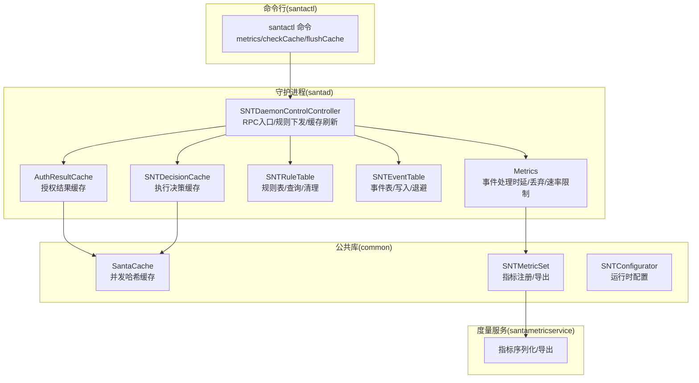
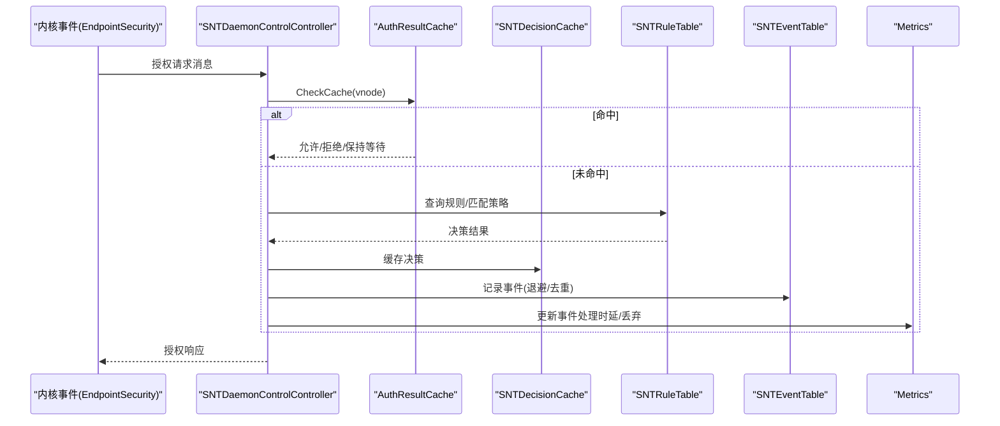
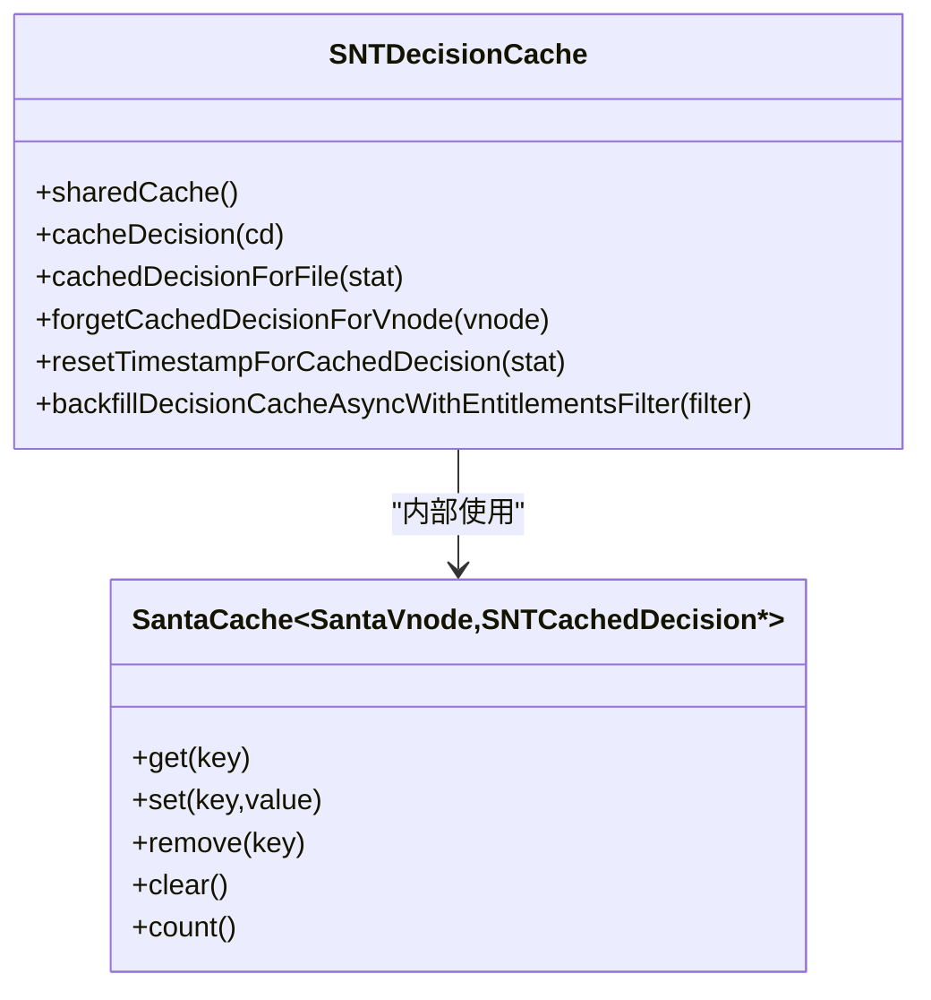
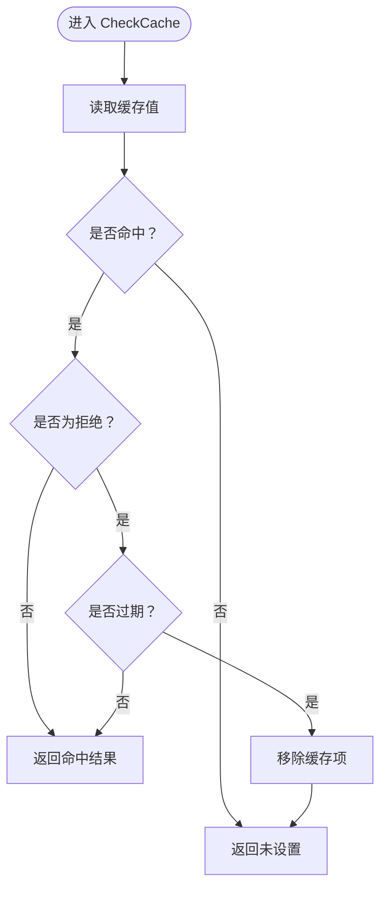
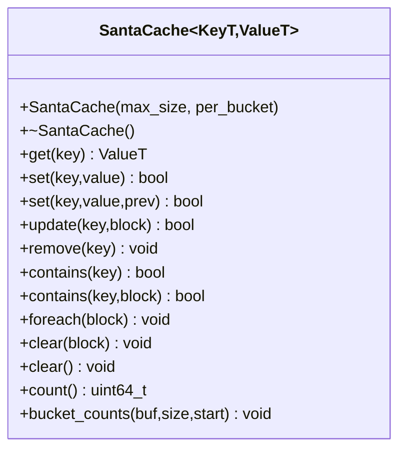
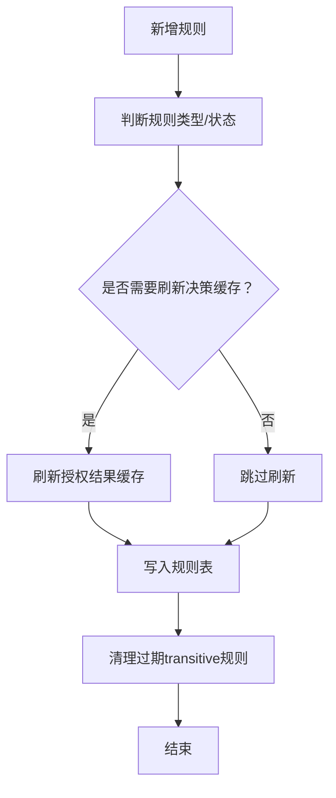
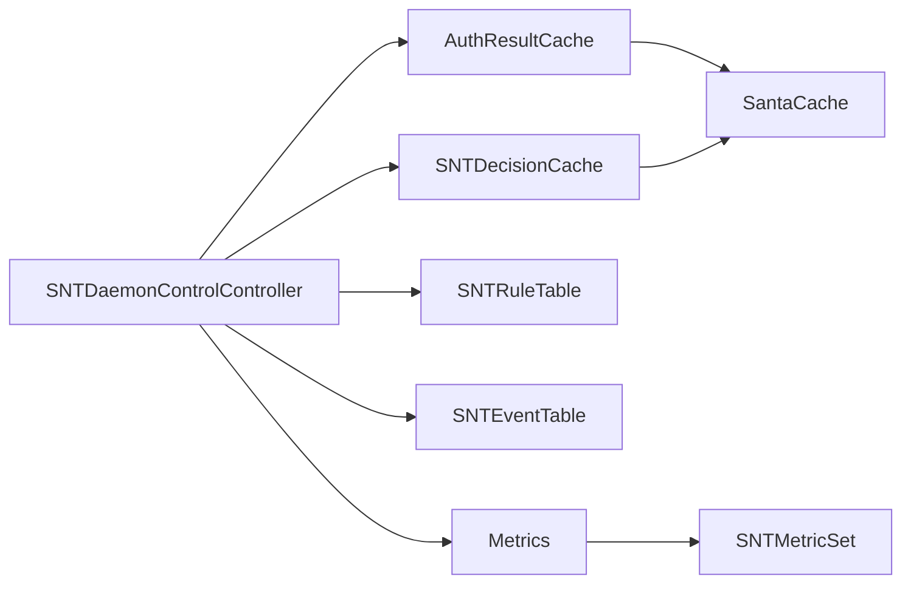

# 性能问题排查

<cite>
**本文引用的文件**
- [SNTDecisionCache.h](file://Source/santad/SNTDecisionCache.h)
- [SNTDecisionCache.mm](file://Source/santad/SNTDecisionCache.mm)
- [SNTDecisionCacheTest.mm](file://Source/santad/SNTDecisionCacheTest.mm)
- [AuthResultCache.h](file://Source/santad/EventProviders/AuthResultCache.h)
- [AuthResultCache.mm](file://Source/santad/EventProviders/AuthResultCache.mm)
- [AuthResultCacheTest.mm](file://Source/santad/EventProviders/AuthResultCacheTest.mm)
- [SantaCache.h](file://Source/common/SantaCache.h)
- [SNTDaemonControlController.h](file://Source/santad/SNTDaemonControlController.h)
- [SNTDaemonControlController.mm](file://Source/santad/SNTDaemonControlController.mm)
- [SNTRuleTable.mm](file://Source/santad/DataLayer/SNTRuleTable.mm)
- [SNTEventTable.mm](file://Source/santad/DataLayer/SNTEventTable.mm)
- [SNTEventTableTest.mm](file://Source/santad/DataLayer/SNTEventTableTest.mm)
- [Metrics.h](file://Source/santad/Metrics.h)
- [Metrics.mm](file://Source/santad/Metrics.mm)
- [SNTApplicationCoreMetrics.mm](file://Source/santad/SNTApplicationCoreMetrics.mm)
- [SNTMetricSetTest.mm](file://Source/common/SNTMetricSetTest.mm)
- [SNTConfigurator.h](file://Source/common/SNTConfigurator.h)
- [SNTCommandMetricsTest.mm](file://Source/santactl/Commands/SNTCommandMetricsTest.mm)
- [SNTDaemonControlControllerTest.mm](file://Source/santactl/Commands/SNTDaemonControlControllerTest.mm)
- [santacache_fuzzer_main.cpp](file://Fuzzing/santacache/src/main.cpp)
</cite>

## 目录
1. [简介](#简介)
2. [项目结构](#项目结构)
3. [核心组件](#核心组件)
4. [架构总览](#架构总览)
5. [详细组件分析](#详细组件分析)
6. [依赖关系分析](#依赖关系分析)
7. [性能考量](#性能考量)
8. [故障排查指南](#故障排查指南)
9. [结论](#结论)
10. [附录](#附录)

## 简介
本指南面向Santa项目的运维与开发人员，聚焦于性能问题的系统化排查与优化。重点覆盖以下方面：
- 决策缓存失效与命中率对性能的影响
- 内存占用过高、磁盘I/O瓶颈与网络延迟的识别与缓解
- SNTDecisionCache与AuthResultCache的工作机制与调优
- 系统资源监控、性能指标分析与瓶颈定位
- 缓存优化配置、内存泄漏检测与资源使用分析
- 规则匹配算法与数据库查询性能优化
- 基准测试与负载压力测试的实施方法

## 项目结构
Santa由守护进程、命令行工具、度量服务与数据层组成。与性能密切相关的模块包括：
- 守护进程（santad）：事件授权、规则匹配、缓存管理、数据库访问、日志落盘与度量导出
- 公共库（common）：通用缓存实现（SantaCache）、度量集（SNTMetricSet）、配置器（SNTConfigurator）
- 度量服务（santametricservice）：指标序列化与导出
- 命令行工具（santactl）：缓存检查、指标打印、规则增删等运维操作

图表来源
- [SNTDaemonControlController.mm](file://Source/santad/SNTDaemonControlController.mm#L1-L200)
- [AuthResultCache.h](file://Source/santad/EventProviders/AuthResultCache.h#L1-L98)
- [AuthResultCache.mm](file://Source/santad/EventProviders/AuthResultCache.mm#L76-L207)
- [SNTDecisionCache.h](file://Source/santad/SNTDecisionCache.h#L1-L35)
- [SNTDecisionCache.mm](file://Source/santad/SNTDecisionCache.mm#L39-L83)
- [SNTRuleTable.mm](file://Source/santad/DataLayer/SNTRuleTable.mm#L419-L788)
- [SNTEventTable.mm](file://Source/santad/DataLayer/SNTEventTable.mm#L135-L174)
- [Metrics.h](file://Source/santad/Metrics.h#L1-L143)
- [Metrics.mm](file://Source/santad/Metrics.mm#L301-L337)
- [SantaCache.h](file://Source/common/SantaCache.h#L1-L468)
- [SNTConfigurator.h](file://Source/common/SNTConfigurator.h#L1-L200)

章节来源
- [SNTDaemonControlController.mm](file://Source/santad/SNTDaemonControlController.mm#L1-L200)
- [SNTConfigurator.h](file://Source/common/SNTConfigurator.h#L1-L200)

## 核心组件
- SNTDecisionCache：执行决策缓存，基于SantaCache按vnode键缓存决策对象，支持异步回填与时间戳重置。
- AuthResultCache：授权结果缓存，区分根文件系统与非根文件系统的两套缓存，支持deny过期淘汰与ES缓存同步清空。
- SantaCache：通用并发哈希缓存，按桶锁分段加锁，满载自动清空以维持容量上限。
- Metrics：事件处理时延、丢弃计数、速率限制统计与定期导出。
- SNTEventTable/SNTRuleTable：事件入库退避、规则查询与过期清理。

章节来源
- [SNTDecisionCache.h](file://Source/santad/SNTDecisionCache.h#L1-L35)
- [SNTDecisionCache.mm](file://Source/santad/SNTDecisionCache.mm#L39-L83)
- [AuthResultCache.h](file://Source/santad/EventProviders/AuthResultCache.h#L1-L98)
- [AuthResultCache.mm](file://Source/santad/EventProviders/AuthResultCache.mm#L76-L207)
- [SantaCache.h](file://Source/common/SantaCache.h#L1-L468)
- [Metrics.h](file://Source/santad/Metrics.h#L1-L143)
- [Metrics.mm](file://Source/santad/Metrics.mm#L301-L337)
- [SNTRuleTable.mm](file://Source/santad/DataLayer/SNTRuleTable.mm#L419-L788)
- [SNTEventTable.mm](file://Source/santad/DataLayer/SNTEventTable.mm#L135-L174)

## 架构总览
下图展示从事件产生到授权决策、缓存命中与指标导出的关键路径。

图表来源
- [SNTDaemonControlController.mm](file://Source/santad/SNTDaemonControlController.mm#L105-L200)
- [AuthResultCache.mm](file://Source/santad/EventProviders/AuthResultCache.mm#L148-L171)
- [SNTDecisionCache.mm](file://Source/santad/SNTDecisionCache.mm#L73-L83)
- [SNTRuleTable.mm](file://Source/santad/DataLayer/SNTRuleTable.mm#L419-L788)
- [SNTEventTable.mm](file://Source/santad/DataLayer/SNTEventTable.mm#L135-L174)
- [Metrics.h](file://Source/santad/Metrics.h#L69-L141)

## 详细组件分析

### SNTDecisionCache 分析
- 设计要点
  - 使用SantaCache作为底层存储，键为vnode，值为决策对象。
  - 提供缓存写入、命中查询、忘记缓存项、重置时间戳与异步回填接口。
  - 初始化时设置时间戳重置映射与回填队列，平衡完成时间与CPU占用。
- 关键行为
  - cacheDecision：直接写入；cacheDecisionIfNotSet：条件写入（CAS语义）。
  - cachedDecisionForFile：按vnode查找；resetTimestampForCachedDecision：更新时间戳。
  - backfillDecisionCacheAsyncWithEntitlementsFilter：异步回填，避免阻塞主路径。
- 性能影响
  - 命中率直接影响授权延迟；容量与桶参数决定并发下的锁竞争与内存占用。
  - 回填队列QoS选择在活跃系统上可显著影响回填耗时。

图表来源
- [SNTDecisionCache.h](file://Source/santad/SNTDecisionCache.h#L1-L35)
- [SNTDecisionCache.mm](file://Source/santad/SNTDecisionCache.mm#L39-L83)
- [SantaCache.h](file://Source/common/SantaCache.h#L1-L468)

章节来源
- [SNTDecisionCache.h](file://Source/santad/SNTDecisionCache.h#L1-L35)
- [SNTDecisionCache.mm](file://Source/santad/SNTDecisionCache.mm#L39-L83)
- [SNTDecisionCacheTest.mm](file://Source/santad/SNTDecisionCacheTest.mm#L55-L85)

### AuthResultCache 分析
- 设计要点
  - 根/非根双缓存分离，按设备号区分；deny结果带过期时间，到期自动移除。
  - 支持按需清空（仅非根或全部），并异步通知ES客户端同步清空其缓存。
  - 提供缓存计数查询与Flush原因计数指标。
- 关键行为
  - CheckCache：先查缓存，命中且为deny则校验过期；未命中返回未设置。
  - AddToCache/RemoveFromCache：写入/删除缓存项。
  - FlushCache：根据模式清空并触发ES缓存清空。
- 性能影响
  - deny过期时间过短会降低命中率，过长会延迟新规则生效；根/非根分离减少锁争用。
  - ES缓存清空异步化避免阻塞授权主路径。

图表来源
- [AuthResultCache.mm](file://Source/santad/EventProviders/AuthResultCache.mm#L148-L171)

章节来源
- [AuthResultCache.h](file://Source/santad/EventProviders/AuthResultCache.h#L1-L98)
- [AuthResultCache.mm](file://Source/santad/EventProviders/AuthResultCache.mm#L76-L207)
- [AuthResultCacheTest.mm](file://Source/santad/EventProviders/AuthResultCacheTest.mm#L42-L187)

### SantaCache 并发哈希缓存
- 设计要点
  - 桶数≈最大容量/每桶目标条目数，向上取整为2的幂；每桶独立锁。
  - 满载插入时自动清空所有条目，确保容量上限；提供foreach/clear等遍历与清理能力。
  - set支持CAS与更新块，便于无锁原子更新。
- 性能特性
  - 锁粒度小、桶多时并发高但内存占用上升；per_bucket越大吞吐越高但内存更高。
  - 清空策略保证上限，避免无限增长导致的碎片与锁争用。

图表来源
- [SantaCache.h](file://Source/common/SantaCache.h#L1-L468)

章节来源
- [SantaCache.h](file://Source/common/SantaCache.h#L1-L468)
- [santacache_fuzzer_main.cpp](file://Fuzzing/santacache/src/main.cpp#L1-L43)

### 数据层：规则与事件
- 规则表（SNTRuleTable）
  - 执行规则查询与静态规则缓存；新增规则时根据类型与状态判断是否需要刷新决策缓存。
  - 定期清理过期transitive规则，维护数据库规模。
- 事件表（SNTEventTable）
  - 事件入库采用去重与冲突保护；对“不可行动”事件引入退避窗口，避免重复插入与抖动。

图表来源
- [SNTRuleTable.mm](file://Source/santad/DataLayer/SNTRuleTable.mm#L419-L788)
- [SNTRuleTable.mm](file://Source/santad/DataLayer/SNTRuleTable.mm#L783-L819)

章节来源
- [SNTRuleTable.mm](file://Source/santad/DataLayer/SNTRuleTable.mm#L419-L788)
- [SNTRuleTable.mm](file://Source/santad/DataLayer/SNTRuleTable.mm#L783-L819)
- [SNTEventTable.mm](file://Source/santad/DataLayer/SNTEventTable.mm#L135-L174)
- [SNTEventTableTest.mm](file://Source/santad/DataLayer/SNTEventTableTest.mm#L227-L267)

## 依赖关系分析
- 组件耦合
  - SNTDaemonControlController 同时依赖 AuthResultCache、SNTDecisionCache、SNTRuleTable、SNTEventTable、Metrics。
  - AuthResultCache/SNTDecisionCache 依赖 SantaCache 与配置器/指标集。
  - Metrics 通过 SNTMetricSet 与度量服务交互。
- 外部依赖
  - EndpointSecurity API用于事件授权与缓存清空。
  - SQLite（通过FMDB封装）用于规则与事件持久化。

图表来源
- [SNTDaemonControlController.mm](file://Source/santad/SNTDaemonControlController.mm#L1-L200)
- [AuthResultCache.h](file://Source/santad/EventProviders/AuthResultCache.h#L1-L98)
- [SNTDecisionCache.h](file://Source/santad/SNTDecisionCache.h#L1-L35)
- [SantaCache.h](file://Source/common/SantaCache.h#L1-L468)
- [Metrics.h](file://Source/santad/Metrics.h#L1-L143)

章节来源
- [SNTDaemonControlController.mm](file://Source/santad/SNTDaemonControlController.mm#L1-L200)
- [Metrics.h](file://Source/santad/Metrics.h#L1-L143)

## 性能考量
- 缓存命中率
  - 命中率提升可显著降低规则查询与数据库访问次数，减少授权延迟与CPU占用。
  - AuthResultCache的deny过期时间与根/非根分离直接影响命中稳定性与一致性。
- 内存占用
  - SantaCache的max_size与per_bucket决定桶数量与内存占用；满载清空策略避免长期增长。
  - 运行时指标（虚拟/常驻内存、CPU时间）可用于监控峰值与趋势。
- 磁盘I/O瓶颈
  - 事件入库退避与去重可减少写放大；spool目录阈值与批量导出策略影响磁盘写入节奏。
  - 规则表定期清理过期transitive规则，控制数据库规模。
- 网络延迟
  - 同步与度量导出的超时与批处理阈值影响端到端延迟；应结合网络环境调优。

章节来源
- [SNTApplicationCoreMetrics.mm](file://Source/santad/SNTApplicationCoreMetrics.mm#L1-L174)
- [Metrics.mm](file://Source/santad/Metrics.mm#L301-L337)
- [SNTConfigurator.h](file://Source/common/SNTConfigurator.h#L190-L320)
- [SNTEventTable.mm](file://Source/santad/DataLayer/SNTEventTable.mm#L135-L174)
- [SNTRuleTable.mm](file://Source/santad/DataLayer/SNTRuleTable.mm#L783-L819)

## 故障排查指南

### 1. 决策缓存失效与命中率下降
- 现象
  - 授权延迟升高、CPU占用上升、规则查询频繁。
- 诊断步骤
  - 通过命令行查看缓存计数与命中情况（如可用metrics输出）。
  - 检查是否频繁刷新授权结果缓存（规则变更、模式切换等）。
  - 核对deny过期时间设置是否过短导致频繁重新授权。
- 优化建议
  - 调整AuthResultCache的deny过期时间，兼顾新规则生效速度与命中率。
  - 评估SNTDecisionCache容量与SantaCache的per_bucket，平衡吞吐与内存。
  - 对热点文件/目录增加静态规则，减少动态匹配开销。

章节来源
- [SNTDaemonControlController.mm](file://Source/santad/SNTDaemonControlController.mm#L105-L200)
- [AuthResultCache.mm](file://Source/santad/EventProviders/AuthResultCache.mm#L76-L207)
- [SNTDecisionCache.mm](file://Source/santad/SNTDecisionCache.mm#L39-L83)
- [SantaCache.h](file://Source/common/SantaCache.h#L1-L468)

### 2. 内存占用过高
- 现象
  - 常驻内存持续增长、系统出现页面抖动。
- 诊断步骤
  - 采集运行时内存指标（虚拟/常驻内存、CPU时间）。
  - 检查SantaCache容量上限与当前条目数，确认是否存在异常增长。
  - 关注事件/规则表规模变化与清理策略是否生效。
- 优化建议
  - 适当降低SantaCache容量或减小per_bucket以降低内存占用。
  - 确保transitive规则定期清理与事件退避策略正常工作。
  - 配置度量导出间隔与批处理阈值，避免瞬时内存峰值。

章节来源
- [SNTApplicationCoreMetrics.mm](file://Source/santad/SNTApplicationCoreMetrics.mm#L82-L116)
- [Metrics.mm](file://Source/santad/Metrics.mm#L301-L337)
- [SNTRuleTable.mm](file://Source/santad/DataLayer/SNTRuleTable.mm#L783-L819)
- [SNTEventTable.mm](file://Source/santad/DataLayer/SNTEventTable.mm#L135-L174)

### 3. 磁盘I/O瓶颈
- 现象
  - 磁盘写入延迟升高、队列长度增长、事件积压。
- 诊断步骤
  - 检查事件表退避窗口与去重策略是否生效。
  - 查看spool目录阈值、批量导出策略与压缩格式对写入节奏的影响。
  - 关注规则表清理过期规则的频率与开销。
- 优化建议
  - 调整spool阈值与flush时间，平滑写入峰值。
  - 优先使用更高效的序列化/压缩格式（如zstd）。
  - 控制规则数量与transitive规则规模，减少数据库写放大。

章节来源
- [SNTConfigurator.h](file://Source/common/SNTConfigurator.h#L210-L270)
- [SNTEventTable.mm](file://Source/santad/DataLayer/SNTEventTable.mm#L135-L174)
- [SNTRuleTable.mm](file://Source/santad/DataLayer/SNTRuleTable.mm#L783-L819)

### 4. 网络延迟与导出失败
- 现象
  - 度量导出超时、批次堆积、上传失败。
- 诊断步骤
  - 检查导出超时与批次阈值配置，评估网络带宽与延迟。
  - 关注连接失效与重连逻辑。
- 优化建议
  - 适度提高导出超时与批次阈值，减少频繁小包传输。
  - 在网络波动环境下启用指数退避与重试策略（若存在）。

章节来源
- [Metrics.mm](file://Source/santad/Metrics.mm#L301-L337)
- [SNTConfigurator.h](file://Source/common/SNTConfigurator.h#L270-L320)

### 5. 规则匹配与数据库查询性能
- 现象
  - 规则查询耗时上升、授权延迟增大。
- 诊断步骤
  - 检查规则表索引与查询路径（静态规则缓存命中、SQL查询效率）。
  - 关注transitive规则数量与清理频率。
- 优化建议
  - 减少不必要的规则数量，优先使用静态规则。
  - 优化规则表达式与匹配逻辑，避免复杂正则/CEL表达式。
  - 定期清理过期规则，保持规则表规模可控。

章节来源
- [SNTRuleTable.mm](file://Source/santad/DataLayer/SNTRuleTable.mm#L419-L788)
- [SNTRuleTable.mm](file://Source/santad/DataLayer/SNTRuleTable.mm#L783-L819)

### 6. 系统资源监控与性能指标
- 指标采集
  - 虚拟/常驻内存、CPU用户/系统时间、事件处理时延、丢弃计数、速率限制计数。
- 导出与可视化
  - 通过度量服务定期导出指标，结合外部监控平台进行趋势分析。
- 操作步骤
  - 启用核心指标注册与定时导出。
  - 使用命令行工具打印/过滤指标，定位异常时段与事件类型。

章节来源
- [SNTApplicationCoreMetrics.mm](file://Source/santad/SNTApplicationCoreMetrics.mm#L1-L174)
- [Metrics.h](file://Source/santad/Metrics.h#L69-L141)
- [Metrics.mm](file://Source/santad/Metrics.mm#L301-L337)
- [SNTCommandMetricsTest.mm](file://Source/santactl/Commands/SNTCommandMetricsTest.mm#L1-L42)
- [SNTMetricSetTest.mm](file://Source/common/SNTMetricSetTest.mm#L585-L618)

### 7. 缓存优化配置与操作
- 配置项参考
  - 授权结果缓存deny过期时间（毫秒级）。
  - 事件日志类型、spool阈值、flush时间、telemetry导出间隔与超时。
- 操作步骤
  - 通过命令行触发缓存检查与清空，验证缓存状态。
  - 在规则变更后观察授权延迟与命中率变化，必要时手动清空缓存。

章节来源
- [AuthResultCache.h](file://Source/santad/EventProviders/AuthResultCache.h#L50-L70)
- [SNTConfigurator.h](file://Source/common/SNTConfigurator.h#L190-L320)
- [SNTDaemonControlController.mm](file://Source/santad/SNTDaemonControlController.mm#L105-L121)

### 8. 内存泄漏检测与资源使用分析
- 方法
  - 结合系统工具与指标趋势，定位异常增长点。
  - 关注SantaCache的clear与foreach使用场景，避免持有大对象引用。
- 建议
  - 定期巡检指标峰值与持续时间，制定告警阈值。
  - 对热点路径增加采样与日志，辅助定位。

章节来源
- [SantaCache.h](file://Source/common/SantaCache.h#L1-L468)
- [SNTApplicationCoreMetrics.mm](file://Source/santad/SNTApplicationCoreMetrics.mm#L82-L116)

### 9. 基准测试与负载压力测试
- 基准测试
  - 使用fuzzer对缓存正确性与边界条件进行验证，确保容量/过期/并发场景稳定。
- 负载压力测试
  - 生成高并发授权请求，测量事件处理时延、丢弃率与内存/CPU占用。
  - 逐步调整缓存容量、规则数量与导出策略，记录性能曲线。

章节来源
- [santacache_fuzzer_main.cpp](file://Fuzzing/santacache/src/main.cpp#L1-L43)
- [Metrics.h](file://Source/santad/Metrics.h#L69-L141)

## 结论
通过对SNTDecisionCache与AuthResultCache工作机制的深入理解，结合SantaCache的并发设计与Metrics的指标体系，可以系统化地定位与缓解性能问题。建议以命中率、内存/CPU占用、磁盘I/O与网络延迟为核心观测指标，配合规则与缓存配置调优，持续进行基准与压力测试，形成闭环的性能治理流程。

## 附录
- 常用运维命令与指标
  - 缓存检查与清空：通过RPC入口调用缓存检查与清空接口。
  - 指标导出：启用定时导出，结合命令行工具过滤与打印。
- 参考配置键
  - 事件日志类型、spool阈值、telemetry导出间隔与超时、deny过期时间等。

章节来源
- [SNTDaemonControlController.mm](file://Source/santad/SNTDaemonControlController.mm#L105-L121)
- [SNTConfigurator.h](file://Source/common/SNTConfigurator.h#L190-L320)
- [SNTCommandMetricsTest.mm](file://Source/santactl/Commands/SNTCommandMetricsTest.mm#L1-L42)