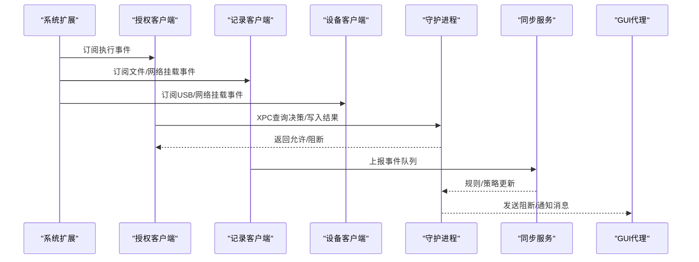
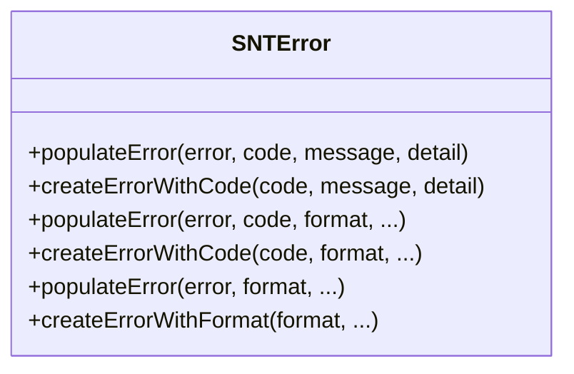
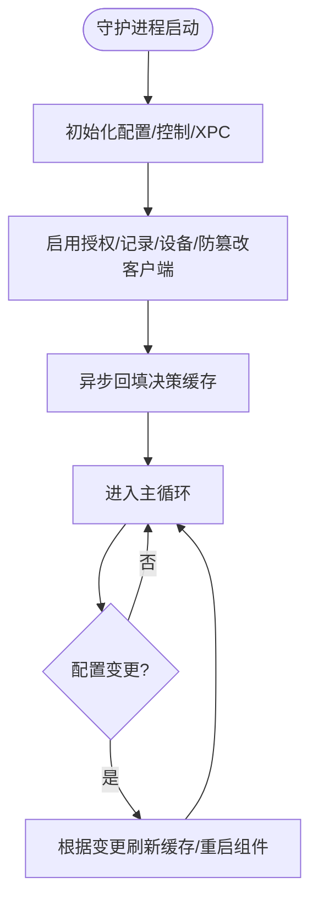
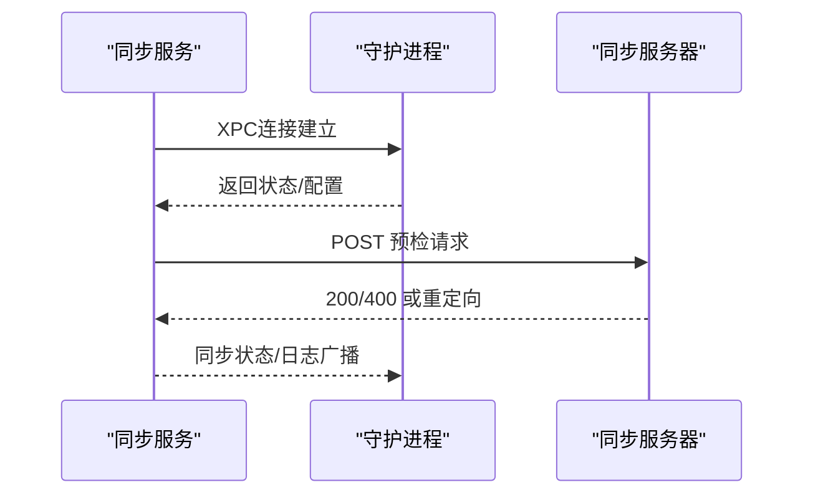

# 故障排除

<cite>
**本文引用的文件**
- [README.md](file://README.md)
- [docs/docs/deployment/troubleshooting.md](file://docs/docs/deployment/troubleshooting.md)
- [Source/common/SNTError.h](file://Source/common/SNTError.h)
- [Source/common/SNTError.mm](file://Source/common/SNTError.mm)
- [Source/common/SNTLogging.h](file://Source/common/SNTLogging.h)
- [Source/santad/Santad.mm](file://Source/santad/Santad.mm)
- [Source/santasyncservice/SNTSyncService.mm](file://Source/santasyncservice/SNTSyncService.mm)
- [Source/santactl/Commands/SNTCommandDoctor.mm](file://Source/santactl/Commands/SNTCommandDoctor.mm)
- [Source/santad/EventProviders/EndpointSecurity/EndpointSecurityAPI.h](file://Source/santad/EventProviders/EndpointSecurity/EndpointSecurityAPI.h)
</cite>

## 目录
1. [简介](#简介)
2. [项目结构](#项目结构)
3. [核心组件](#核心组件)
4. [架构总览](#架构总览)
5. [详细组件分析](#详细组件分析)
6. [依赖关系分析](#依赖关系分析)
7. [性能考虑](#性能考虑)
8. [故障排除指南](#故障排除指南)
9. [结论](#结论)
10. [附录](#附录)

## 简介
本指南面向Santa项目的运维与开发人员，聚焦于系统扩展加载失败、守护进程崩溃、GUI代理异常、同步故障、性能问题、内存泄漏与资源耗尽等常见问题的诊断与解决。文档提供日志分析方法、调试工具使用、自动化诊断命令、健康检查脚本思路与监控告警建议，并给出问题报告流程与社区支持渠道。

## 项目结构
Santa由系统扩展（监听执行与文件访问）、守护进程（决策与缓存）、GUI代理（用户通知）、同步服务（策略与事件上传）以及命令行工具（管理与诊断）组成。各组件通过XPC通信并共享配置状态。

```mermaid
graph TB
subgraph "用户态组件"
GUI["GUI代理<br/>显示阻断/通知"]
CTL["命令行工具<br/>santactl"]
METRICS["指标服务<br/>可选导出"]
end
subgraph "内核态/系统扩展"
ES["系统扩展<br/>Endpoint Security"]
end
subgraph "守护进程"
D["守护进程<br/>决策/缓存/日志/度量"]
SYNC["同步服务<br/>规则/事件/推送"]
end
GUI --> D
CTL --> D
METRICS --> D
ES --> D
D < --> SYNC
```

图示来源
- [Source/santad/Santad.mm](file://Source/santad/Santad.mm#L73-L120)
- [Source/santasyncservice/SNTSyncService.mm](file://Source/santasyncservice/SNTSyncService.mm#L44-L88)

章节来源
- [README.md](file://README.md#L13-L21)
- [docs/docs/deployment/troubleshooting.md](file://docs/docs/deployment/troubleshooting.md#L10-L22)

## 核心组件
- 错误域与错误码：统一的错误域与错误码定义，便于在日志与API中一致化表达问题类型。
- 日志接口：封装os_log与tee输出，支持调试/信息/默认/错误级别输出，便于终端与系统日志双通道查看。
- 守护进程主流程：初始化配置、XPC控制对象、设备/记录/授权/防篡改客户端、决策缓存预热、运行主循环。
- 同步服务：与守护进程XPC连接、按需启动、权限降级、统计上报定时器、遥测导出。
- doctor命令：系统进程校验、配置校验、HTTPS与同步连通性测试。

章节来源
- [Source/common/SNTError.h](file://Source/common/SNTError.h#L19-L51)
- [Source/common/SNTError.mm](file://Source/common/SNTError.mm#L19-L34)
- [Source/common/SNTLogging.h](file://Source/common/SNTLogging.h#L25-L65)
- [Source/santad/Santad.mm](file://Source/santad/Santad.mm#L73-L120)
- [Source/santasyncservice/SNTSyncService.mm](file://Source/santasyncservice/SNTSyncService.mm#L44-L88)
- [Source/santactl/Commands/SNTCommandDoctor.mm](file://Source/santactl/Commands/SNTCommandDoctor.mm#L79-L85)

## 架构总览
系统扩展负责事件订阅与响应；守护进程进行策略评估与缓存；GUI代理负责用户交互；同步服务负责规则与事件的远端同步；命令行工具用于诊断与管理。



图示来源
- [Source/santad/Santad.mm](file://Source/santad/Santad.mm#L122-L223)
- [Source/santasyncservice/SNTSyncService.mm](file://Source/santasyncservice/SNTSyncService.mm#L108-L186)

## 详细组件分析

### 组件A：错误域与错误码
- 设计要点
  - 统一错误域，便于跨模块识别。
  - 分类覆盖通用、I/O、同步、配置验证、数据库等场景。
  - 提供创建与填充错误的方法，支持格式化消息与细节描述。
- 典型用途
  - 配置校验失败时返回规则无效、标识符缺失或非法等错误码。
  - 数据库操作失败时返回插入/替换/删除规则失败等错误码。
  - 同步失败时返回JSON/PB解析失败或HTTP请求失败等错误码。



图示来源
- [Source/common/SNTError.h](file://Source/common/SNTError.h#L19-L91)
- [Source/common/SNTError.mm](file://Source/common/SNTError.mm#L23-L99)

章节来源
- [Source/common/SNTError.h](file://Source/common/SNTError.h#L19-L51)
- [Source/common/SNTError.mm](file://Source/common/SNTError.mm#L19-L34)

### 组件B：守护进程主流程与配置变更
- 关键行为
  - 初始化控制对象并通过XPC导出，接受外部管理。
  - 启动设备/记录/授权/防篡改客户端，确保执行策略优先订阅。
  - 响应配置变更（模式、正则、静态规则、指标导出、USB阻断等），必要时刷新缓存或重启。
  - 决策缓存异步回填，提升首次稳定性。
- 变更触发点
  - 客户端模式切换、路径正则变化、静态规则变化、事件日志类型变化、指标导出开关/间隔变化等。



图示来源
- [Source/santad/Santad.mm](file://Source/santad/Santad.mm#L73-L120)
- [Source/santad/Santad.mm](file://Source/santad/Santad.mm#L228-L325)
- [Source/santad/Santad.mm](file://Source/santad/Santad.mm#L325-L408)

章节来源
- [Source/santad/Santad.mm](file://Source/santad/Santad.mm#L73-L120)
- [Source/santad/Santad.mm](file://Source/santad/Santad.mm#L228-L325)
- [Source/santad/Santad.mm](file://Source/santad/Santad.mm#L325-L408)

### 组件C：同步服务与健康检查
- 关键行为
  - 与守护进程建立XPC连接，失效即自旋退出，避免僵尸进程。
  - 权限降级后初始化配置，禁用默认URL缓存以规避沙箱警告。
  - 按需启动同步任务，支持日志广播与事件上传。
  - 统计上报定时器：每小时尝试一次，24小时最小间隔，版本变化才提交。
- doctor同步校验
  - 通过HTTPS向同步服务器发起预检请求，检测证书链、重定向与状态码。



图示来源
- [Source/santasyncservice/SNTSyncService.mm](file://Source/santasyncservice/SNTSyncService.mm#L44-L88)
- [Source/santasyncservice/SNTSyncService.mm](file://Source/santasyncservice/SNTSyncService.mm#L108-L186)
- [Source/santactl/Commands/SNTCommandDoctor.mm](file://Source/santactl/Commands/SNTCommandDoctor.mm#L145-L246)

章节来源
- [Source/santasyncservice/SNTSyncService.mm](file://Source/santasyncservice/SNTSyncService.mm#L44-L88)
- [Source/santasyncservice/SNTSyncService.mm](file://Source/santasyncservice/SNTSyncService.mm#L187-L246)
- [Source/santactl/Commands/SNTCommandDoctor.mm](file://Source/santactl/Commands/SNTCommandDoctor.mm#L145-L246)

### 组件D：日志与调试
- 日志宏
  - 支持OS系统日志与标准输出/错误输出双通道输出，便于终端直视与系统日志聚合。
- 调试建议
  - 使用系统日志流筛选特定进程域，结合错误码与配置变更日志定位问题。

章节来源
- [Source/common/SNTLogging.h](file://Source/common/SNTLogging.h#L25-L65)

## 依赖关系分析
- 组件耦合
  - 守护进程依赖系统扩展API、配置器、日志、指标、数据库表、通知队列、同步队列、执行控制器等。
  - 同步服务依赖守护进程XPC、配置器、导出配置、流式上传组件。
  - doctor命令依赖配置器、认证会话、进程枚举与同步预检。
- 外部依赖
  - macOS Endpoint Security框架、os_log、XPC、NSURLSession、Keychain（仅doctor中临时禁用交互）。

```mermaid
graph LR
ESAPI["EndpointSecurityAPI"] --> D["守护进程"]
CFG["配置器"] --> D
LOG["日志接口"] --> D
MET["指标"] --> D
DB["数据库表"] --> D
NOTI["通知队列"] --> D
SYNCQ["同步队列"] --> D
EXE["执行控制器"] --> D
D < --> SYNC["同步服务"]
DOCTOR["doctor命令"] --> CFG
DOCTOR --> SYNC
```

图示来源
- [Source/santad/Santad.mm](file://Source/santad/Santad.mm#L122-L223)
- [Source/santasyncservice/SNTSyncService.mm](file://Source/santasyncservice/SNTSyncService.mm#L44-L88)
- [Source/santactl/Commands/SNTCommandDoctor.mm](file://Source/santactl/Commands/SNTCommandDoctor.mm#L145-L246)
- [Source/santad/EventProviders/EndpointSecurity/EndpointSecurityAPI.h](file://Source/santad/EventProviders/EndpointSecurity/EndpointSecurityAPI.h#L30-L75)

章节来源
- [Source/santad/Santad.mm](file://Source/santad/Santad.mm#L122-L223)
- [Source/santasyncservice/SNTSyncService.mm](file://Source/santasyncservice/SNTSyncService.mm#L44-L88)
- [Source/santactl/Commands/SNTCommandDoctor.mm](file://Source/santactl/Commands/SNTCommandDoctor.mm#L145-L246)
- [Source/santad/EventProviders/EndpointSecurity/EndpointSecurityAPI.h](file://Source/santad/EventProviders/EndpointSecurity/EndpointSecurityAPI.h#L30-L75)

## 性能考虑
- 缓存与回填
  - 决策缓存异步回填，减少首次高峰压力；配置变更时按需刷新缓存，避免全量重建。
- 日志与指标
  - 事件日志类型变更时优雅重启，确保缓冲数据落盘与指标导出一致性。
  - 指标导出开关/间隔变化即时生效，避免不必要的开销。
- 文件访问策略
  - 全局速率限制参数变化时动态调整，平衡吞吐与资源占用。
- 同步与上传
  - 遥测导出采用流式multipart，按批次阈值与最大文件数控制内存峰值。
  - 统计上报最小间隔约24小时，降低频繁IO与网络开销。

章节来源
- [Source/santad/Santad.mm](file://Source/santad/Santad.mm#L438-L452)
- [Source/santad/Santad.mm](file://Source/santad/Santad.mm#L724-L743)
- [Source/santasyncservice/SNTSyncService.mm](file://Source/santasyncservice/SNTSyncService.mm#L125-L166)
- [Source/santasyncservice/SNTSyncService.mm](file://Source/santasyncservice/SNTSyncService.mm#L212-L246)

## 故障排除指南

### 一、系统扩展加载失败
- 现象
  - systemextensionsctl显示“等待用户批准”或未处于“已激活且启用”状态。
- 排查步骤
  - 在系统设置中确认“登录项与扩展”中的Endpoint Security扩展列表存在Santa并已开启。
  - 如仍为等待状态，尝试通过应用强制加载系统扩展。
  - 若多次加载无效，考虑重新安装Santa。
- 参考命令
  - 列出系统扩展状态与加载系统扩展的命令见部署故障排除文档。

章节来源
- [docs/docs/deployment/troubleshooting.md](file://docs/docs/deployment/troubleshooting.md#L46-L76)

### 二、守护进程崩溃或无法通信
- 现象
  - 执行状态命令提示无法与守护进程通信。
- 排查步骤
  - 使用doctor命令进行系统进程、配置与同步连通性检查。
  - 查看守护进程日志，关注错误级别输出与配置变更重启记录。
  - 若因配置变更导致重启，确认变更是否合理（如事件日志类型变更会触发优雅重启）。
- 参考命令
  - doctor命令与状态命令见部署故障排除文档。

章节来源
- [docs/docs/deployment/troubleshooting.md](file://docs/docs/deployment/troubleshooting.md#L10-L22)
- [Source/santactl/Commands/SNTCommandDoctor.mm](file://Source/santactl/Commands/SNTCommandDoctor.mm#L79-L85)
- [Source/santad/Santad.mm](file://Source/santad/Santad.mm#L438-L452)

### 三、GUI代理异常
- 现象
  - 阻断通知未出现或界面无响应。
- 排查步骤
  - 确认GUI进程存在且与守护进程通过XPC正常通信。
  - 检查守护进程对通知队列的回调是否被正确触发。
  - 结合日志确认通知发送路径与配置状态传递是否正常。
- 参考路径
  - 守护进程对通知队列的回调与配置状态传递逻辑。

章节来源
- [Source/santad/Santad.mm](file://Source/santad/Santad.mm#L190-L222)

### 四、同步故障
- 现象
  - 规则/事件无法同步，或预检请求失败。
- 排查步骤
  - doctor命令对同步服务器进行HTTPS与预检请求测试，观察状态码与重定向。
  - 检查同步服务与守护进程XPC连接是否稳定，连接失效将触发同步服务自旋退出。
  - 确认证书链配置（根证书/客户端证书/密码）与代理设置正确。
- 参考路径
  - doctor同步校验与同步服务日志广播。

章节来源
- [Source/santactl/Commands/SNTCommandDoctor.mm](file://Source/santactl/Commands/SNTCommandDoctor.mm#L145-L246)
- [Source/santasyncservice/SNTSyncService.mm](file://Source/santasyncservice/SNTSyncService.mm#L44-L88)
- [Source/santasyncservice/SNTSyncService.mm](file://Source/santasyncservice/SNTSyncService.mm#L108-L186)

### 五、性能问题排查
- 缓存与回填
  - 关注决策缓存回填完成后再处理新事件，避免并发抖动。
- 日志与指标
  - 调整事件日志类型与指标导出开关/间隔，避免在高峰期产生额外压力。
- 文件访问策略
  - 动态修改全局速率限制参数时，观察系统吞吐与CPU/内存占用变化。
- 同步与上传
  - 控制遥测导出批次大小与文件数量，避免内存峰值过高。

章节来源
- [Source/santad/Santad.mm](file://Source/santad/Santad.mm#L771-L793)
- [Source/santad/Santad.mm](file://Source/santad/Santad.mm#L724-L743)
- [Source/santasyncservice/SNTSyncService.mm](file://Source/santasyncservice/SNTSyncService.mm#L125-L166)

### 六、内存泄漏与资源耗尽
- 建议措施
  - 使用系统日志流过滤守护进程与同步服务，持续观察错误与警告级别输出。
  - 对长时间运行的服务定期执行doctor检查，确认进程与配置健康。
  - 在高负载场景下，适当降低事件日志类型、指标导出频率与遥测批次阈值。
- 参考路径
  - 日志接口与守护进程主循环。

章节来源
- [Source/common/SNTLogging.h](file://Source/common/SNTLogging.h#L25-L65)
- [Source/santad/Santad.mm](file://Source/santad/Santad.mm#L793-L795)

### 七、配置错误修复与规则冲突
- 规则冲突
  - 代码签名规则与路径规则存在优先级差异，优先匹配最具体规则。
  - 静态规则变更会触发缓存刷新，确认变更后策略生效。
- 配置验证
  - 使用doctor命令的配置校验输出，逐条修正无效标识符、缺失策略、非法CEL表达式等问题。
- 参考路径
  - 错误码定义与守护进程配置变更处理。

章节来源
- [Source/common/SNTError.h](file://Source/common/SNTError.h#L38-L51)
- [Source/santad/Santad.mm](file://Source/santad/Santad.mm#L410-L422)

### 八、自动化诊断工具与健康检查
- doctor命令
  - 进程校验：确认Santa GUI、守护进程、同步服务是否存在。
  - 配置校验：输出配置错误清单。
  - 同步校验：HTTPS与预检请求测试，输出状态码与重定向信息。
- 健康检查脚本建议
  - 定时执行doctor命令并捕获非零退出码。
  - 定时检查systemextensionsctl状态与守护进程日志错误级别峰值。
  - 定时检查同步服务与守护进程XPC连接状态。

章节来源
- [Source/santactl/Commands/SNTCommandDoctor.mm](file://Source/santactl/Commands/SNTCommandDoctor.mm#L79-L85)
- [docs/docs/deployment/troubleshooting.md](file://docs/docs/deployment/troubleshooting.md#L10-L22)

### 九、日志分析方法与调试工具
- 日志来源
  - 使用系统日志流筛选守护进程与同步服务的sender域，结合TEE输出定位命令行侧输出。
- 调试要点
  - 关注错误码与配置变更日志，快速定位问题根因。
  - doctor命令在Keychain交互上禁用用户提示，避免非预期阻塞。

章节来源
- [docs/docs/deployment/troubleshooting.md](file://docs/docs/deployment/troubleshooting.md#L77-L86)
- [Source/common/SNTLogging.h](file://Source/common/SNTLogging.h#L25-L65)
- [Source/santactl/Commands/SNTCommandDoctor.mm](file://Source/santactl/Commands/SNTCommandDoctor.mm#L200-L209)

### 十、问题报告流程与社区支持
- 报告流程
  - 准备环境信息、日志片段、doctor输出、配置摘要与复现步骤。
  - 在GitHub Issue中描述症状、已尝试的排查步骤与期望行为。
- 社区支持
  - Slack频道作为初步咨询入口。
  - 安全漏洞请遵循安全政策进行披露。

章节来源
- [README.md](file://README.md#L31-L43)

## 结论
通过doctor命令、系统日志与配置变更追踪，可高效定位Santa各组件的常见问题。针对系统扩展加载、守护进程通信、GUI通知、同步连通性与性能瓶颈，建议建立标准化的诊断流程与自动化健康检查脚本，并结合监控告警实现早期发现与自动恢复。

## 附录

### A. 常见错误码速览（节选）
- 通用：输入类型无效、手动规则被禁用
- I/O：路径解析失败、空路径、打开失败、非常规文件
- 同步：JSON解析失败、Proto解析失败、HTTP请求失败
- 配置验证：规则无效、缺少标识符/策略/规则类型、CEL表达式非法
- 数据库：规则数组为空、插入/替换规则失败、删除规则失败

章节来源
- [Source/common/SNTError.h](file://Source/common/SNTError.h#L19-L51)

### B. 关键流程时序参考
- doctor同步预检
  - 从doctor命令发起预检请求到同步服务处理与回复。
- 守护进程配置变更
  - 配置变更触发缓存刷新或优雅重启，确保策略一致性。

章节来源
- [Source/santactl/Commands/SNTCommandDoctor.mm](file://Source/santactl/Commands/SNTCommandDoctor.mm#L145-L246)
- [Source/santad/Santad.mm](file://Source/santad/Santad.mm#L228-L325)