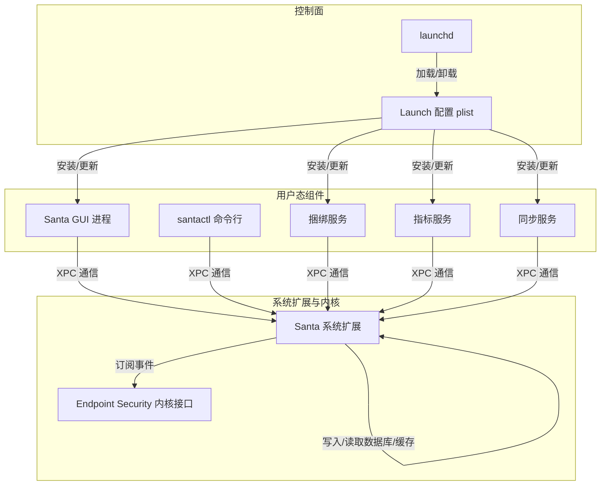
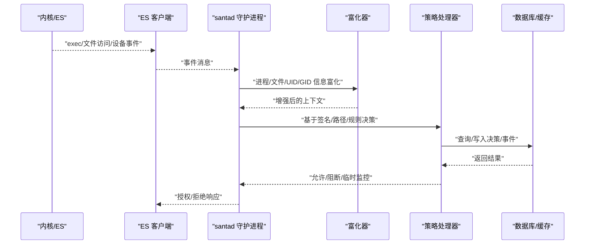
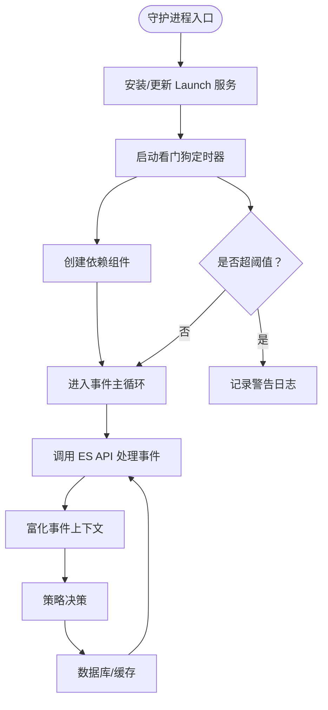
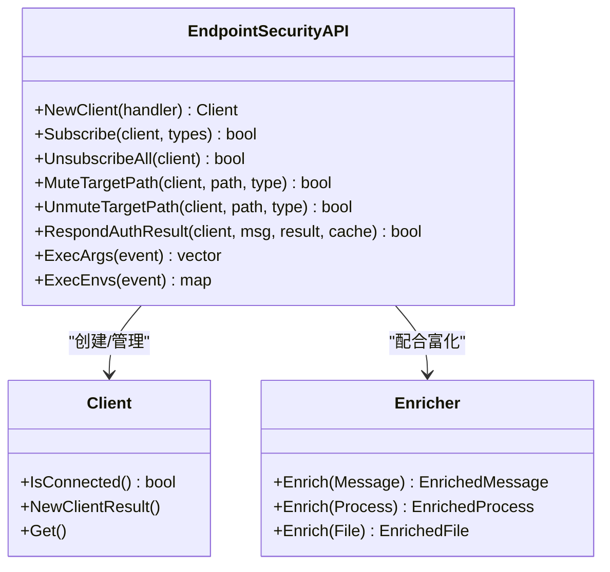
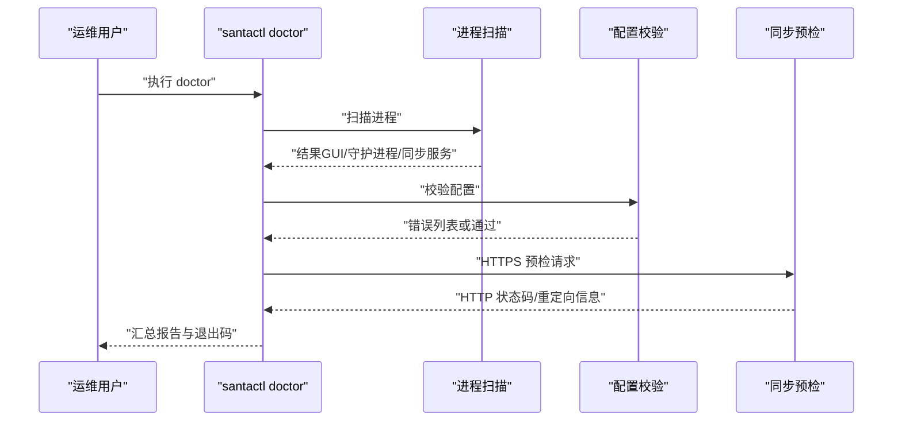
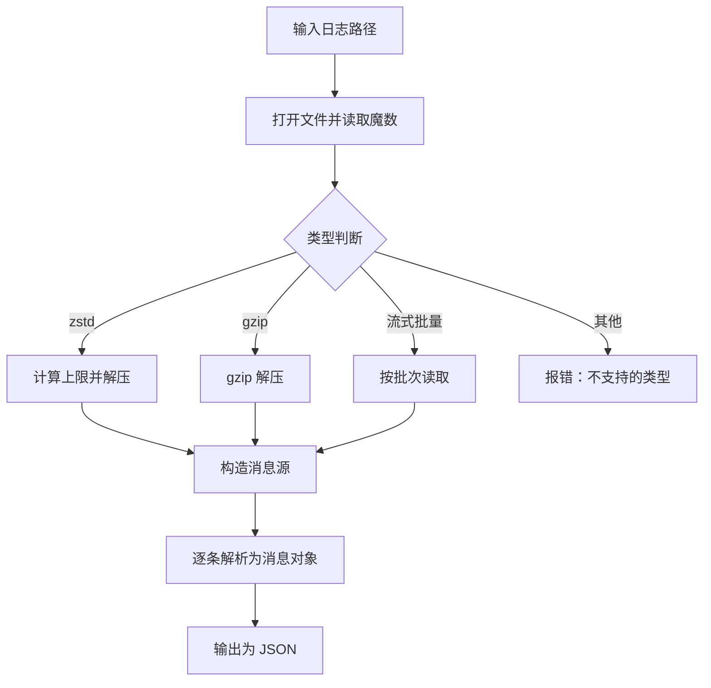
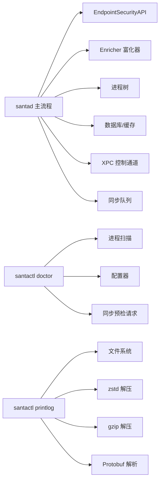

# 系统问题排查

<cite>
**本文引用的文件**
- [README.md](file://README.md)
- [Conf/com.northpolesec.santa.plist](file://Conf/com.northpolesec.santa.plist)
- [Conf/install_services.sh](file://Conf/install_services.sh)
- [Conf/uninstall.sh](file://Conf/uninstall.sh)
- [Source/santad/main.mm](file://Source/santad/main.mm)
- [Source/common/SystemResources.h](file://Source/common/SystemResources.h)
- [Source/common/AuditUtilities.h](file://Source/common/AuditUtilities.h)
- [Source/santad/EventProviders/EndpointSecurity/EndpointSecurityAPI.h](file://Source/santad/EventProviders/EndpointSecurity/EndpointSecurityAPI.h)
- [Source/santad/EventProviders/EndpointSecurity/Client.h](file://Source/santad/EventProviders/EndpointSecurity/Client.h)
- [Source/santad/EventProviders/EndpointSecurity/Enricher.h](file://Source/santad/EventProviders/EndpointSecurity/Enricher.h)
- [Source/santactl/Commands/SNTCommandDoctor.mm](file://Source/santactl/Commands/SNTCommandDoctor.mm)
- [Source/santactl/Commands/SNTCommandPrintLog.mm](file://Source/santactl/Commands/SNTCommandPrintLog.mm)
</cite>

## 目录
1. [简介](#简介)
2. [项目结构](#项目结构)
3. [核心组件](#核心组件)
4. [架构总览](#架构总览)
5. [详细组件分析](#详细组件分析)
6. [依赖关系分析](#依赖关系分析)
7. [性能考量](#性能考量)
8. [故障排除指南](#故障排除指南)
9. [结论](#结论)
10. [附录](#附录)

## 简介
本指南面向系统管理员与技术支持人员，围绕 Santa 在 macOS 上的系统级问题进行系统化排查。重点覆盖以下方面：
- 系统扩展加载失败与 Endpoint Security 连接异常
- 内核事件捕获异常与进程树/富化信息缺失
- 进程间通信（XPC）中断与证书校验不通过
- LaunchDaemon/LaunchAgent 启动状态检查与权限验证
- 系统兼容性、内核版本适配与系统资源监控
- 服务重启、重新安装与卸载重装操作步骤
- 如何检查系统日志、内核消息与安全审计记录以定位根因

## 项目结构
Santa 由多个用户态组件与系统扩展组成，采用“守护进程 + 多个辅助服务 + 命令行工具”的分层设计。关键入口包括：
- 守护进程入口：负责系统扩展生命周期、Endpoint Security 客户端初始化、事件处理与策略执行
- 用户态服务：捆绑服务、指标服务、同步服务
- 命令行工具：doctor 检查、日志打印、规则管理等
- 配置与安装脚本：LaunchDaemon/LaunchAgent 的安装与迁移逻辑

图表来源
- [Source/santad/main.mm](file://Source/santad/main.mm#L104-L151)
- [Conf/install_services.sh](file://Conf/install_services.sh#L47-L64)
- [Conf/com.northpolesec.santa.plist](file://Conf/com.northpolesec.santa.plist#L1-L22)

章节来源
- [README.md](file://README.md#L13-L21)
- [Conf/install_services.sh](file://Conf/install_services.sh#L47-L64)
- [Conf/com.northpolesec.santa.plist](file://Conf/com.northpolesec.santa.plist#L1-L22)

## 核心组件
- 守护进程主流程：负责安装服务、启动看门狗线程、创建依赖并进入事件循环
- Endpoint Security 接口：封装客户端创建、订阅、响应、富化与进程树集成
- Doctor 命令：系统自检，检查进程、配置与同步连通性
- 日志打印命令：解析并输出压缩/二进制日志为 JSON，便于离线分析
- 系统资源监控：获取当前进程列表与守护进程资源使用情况

章节来源
- [Source/santad/main.mm](file://Source/santad/main.mm#L90-L151)
- [Source/santactl/Commands/SNTCommandDoctor.mm](file://Source/santactl/Commands/SNTCommandDoctor.mm#L87-L126)
- [Source/santactl/Commands/SNTCommandPrintLog.mm](file://Source/santactl/Commands/SNTCommandPrintLog.mm#L313-L409)
- [Source/common/SystemResources.h](file://Source/common/SystemResources.h#L27-L49)

## 架构总览
下图展示 Santa 在 macOS 上的关键交互路径：守护进程通过 Endpoint Security 订阅内核事件，经富化器与进程树增强后进入策略决策与事件落库；用户态服务通过 XPC 与守护进程通信；doctor/printlog 提供诊断与日志解析能力。

图表来源
- [Source/santad/EventProviders/EndpointSecurity/EndpointSecurityAPI.h](file://Source/santad/EventProviders/EndpointSecurity/EndpointSecurityAPI.h#L30-L77)
- [Source/santad/EventProviders/EndpointSecurity/Client.h](file://Source/santad/EventProviders/EndpointSecurity/Client.h#L24-L65)
- [Source/santad/EventProviders/EndpointSecurity/Enricher.h](file://Source/santad/EventProviders/EndpointSecurity/Enricher.h#L26-L71)
- [Source/santad/main.mm](file://Source/santad/main.mm#L137-L147)

## 详细组件分析

### 组件一：守护进程与看门狗
- 职责：安装服务、启动看门狗线程、创建依赖并进入主事件循环
- 关键点：
  - 看门狗周期性检查 CPU/内存使用，超过阈值发出告警
  - 通过 install_services.sh 安装/更新 Launch 配置
  - 创建 ES 客户端、日志、指标、编译器控制器、通知队列、同步队列、执行控制器、进程树、权限过滤器等依赖

图表来源
- [Source/santad/main.mm](file://Source/santad/main.mm#L90-L151)
- [Conf/install_services.sh](file://Conf/install_services.sh#L47-L64)

章节来源
- [Source/santad/main.mm](file://Source/santad/main.mm#L90-L151)

### 组件二：Endpoint Security 客户端与 API
- 职责：封装 ES 客户端生命周期、订阅事件类型、消息保留/释放、响应授权结果、路径/进程静音控制、参数/环境变量提取
- 关键点：
  - Client 封装 es_client_t 生命周期，提供连接状态判断
  - EndpointSecurityAPI 提供统一的订阅/取消订阅、静音/反向静音、响应授权、清理缓存等接口
  - 与富化器/进程树协作，增强事件上下文

图表来源
- [Source/santad/EventProviders/EndpointSecurity/Client.h](file://Source/santad/EventProviders/EndpointSecurity/Client.h#L24-L65)
- [Source/santad/EventProviders/EndpointSecurity/EndpointSecurityAPI.h](file://Source/santad/EventProviders/EndpointSecurity/EndpointSecurityAPI.h#L30-L77)
- [Source/santad/EventProviders/EndpointSecurity/Enricher.h](file://Source/santad/EventProviders/EndpointSecurity/Enricher.h#L26-L71)

章节来源
- [Source/santad/EventProviders/EndpointSecurity/Client.h](file://Source/santad/EventProviders/EndpointSecurity/Client.h#L24-L65)
- [Source/santad/EventProviders/EndpointSecurity/EndpointSecurityAPI.h](file://Source/santad/EventProviders/EndpointSecurity/EndpointSecurityAPI.h#L30-L77)
- [Source/santad/EventProviders/EndpointSecurity/Enricher.h](file://Source/santad/EventProviders/EndpointSecurity/Enricher.h#L26-L71)

### 组件三：Doctor 自检命令
- 职责：检查 GUI、守护进程、同步服务是否存在；校验配置有效性；对同步服务器发起预检请求
- 关键点：
  - 通过进程名扫描判断组件运行状态
  - 使用配置器校验配置项
  - 通过认证会话向同步服务器发起预检请求，输出 HTTP 状态码与日志

图表来源
- [Source/santactl/Commands/SNTCommandDoctor.mm](file://Source/santactl/Commands/SNTCommandDoctor.mm#L87-L126)
- [Source/santactl/Commands/SNTCommandDoctor.mm](file://Source/santactl/Commands/SNTCommandDoctor.mm#L145-L246)

章节来源
- [Source/santactl/Commands/SNTCommandDoctor.mm](file://Source/santactl/Commands/SNTCommandDoctor.mm#L87-L126)
- [Source/santactl/Commands/SNTCommandDoctor.mm](file://Source/santactl/Commands/SNTCommandDoctor.mm#L145-L246)

### 组件四：日志打印命令
- 职责：解析压缩/二进制日志文件，输出为 JSON，支持 zstd/gzip/流式批量格式
- 关键点：
  - 识别文件类型（魔数）
  - 解压/解码后逐条解析为消息对象
  - 输出为 JSON 列表，便于离线分析

图表来源
- [Source/santactl/Commands/SNTCommandPrintLog.mm](file://Source/santactl/Commands/SNTCommandPrintLog.mm#L274-L311)
- [Source/santactl/Commands/SNTCommandPrintLog.mm](file://Source/santactl/Commands/SNTCommandPrintLog.mm#L313-L409)

章节来源
- [Source/santactl/Commands/SNTCommandPrintLog.mm](file://Source/santactl/Commands/SNTCommandPrintLog.mm#L274-L311)
- [Source/santactl/Commands/SNTCommandPrintLog.mm](file://Source/santactl/Commands/SNTCommandPrintLog.mm#L313-L409)

## 依赖关系分析
- 守护进程依赖 Endpoint Security API、富化器、进程树、数据库/缓存、日志/指标、XPC 控制通道、同步队列等
- Doctor 依赖进程扫描、配置器、认证会话与同步服务器
- 日志打印命令依赖文件系统、压缩库、Protobuf 解析器

图表来源
- [Source/santad/main.mm](file://Source/santad/main.mm#L137-L147)
- [Source/santactl/Commands/SNTCommandDoctor.mm](file://Source/santactl/Commands/SNTCommandDoctor.mm#L87-L126)
- [Source/santactl/Commands/SNTCommandPrintLog.mm](file://Source/santactl/Commands/SNTCommandPrintLog.mm#L274-L311)

章节来源
- [Source/santad/main.mm](file://Source/santad/main.mm#L137-L147)
- [Source/santactl/Commands/SNTCommandDoctor.mm](file://Source/santactl/Commands/SNTCommandDoctor.mm#L87-L126)
- [Source/santactl/Commands/SNTCommandPrintLog.mm](file://Source/santactl/Commands/SNTCommandPrintLog.mm#L274-L311)

## 性能考量
- 看门狗监控：定期采样守护进程 CPU/内存，超过阈值记录警告并统计事件次数，峰值跟踪用于趋势分析
- 富化器与进程树：在热路径上尽量使用本地信息，必要时可切换到仅本地富化模式减少外部调用
- 日志写入：批量/压缩写入，避免频繁 IO；doctor/printlog 支持离线分析，减少在线解析压力

章节来源
- [Source/santad/main.mm](file://Source/santad/main.mm#L45-L88)
- [Source/santad/EventProviders/EndpointSecurity/Enricher.h](file://Source/santad/EventProviders/EndpointSecurity/Enricher.h#L26-L71)
- [Source/santactl/Commands/SNTCommandPrintLog.mm](file://Source/santactl/Commands/SNTCommandPrintLog.mm#L313-L409)

## 故障排除指南

### 一、系统扩展加载失败
- 现象：守护进程未运行、ES 客户端连接失败、事件无响应
- 诊断步骤：
  - 使用 doctor 检查守护进程是否存在
  - 查看系统扩展加载状态与签名完整性
  - 检查安装脚本是否成功加载 Launch 服务
- 参考路径：
  - [守护进程入口与安装服务](file://Source/santad/main.mm#L90-L151)
  - [安装/更新 Launch 服务脚本](file://Conf/install_services.sh#L47-L64)
  - [Doctor 进程检查](file://Source/santactl/Commands/SNTCommandDoctor.mm#L87-L126)

章节来源
- [Source/santad/main.mm](file://Source/santad/main.mm#L90-L151)
- [Conf/install_services.sh](file://Conf/install_services.sh#L47-L64)
- [Source/santactl/Commands/SNTCommandDoctor.mm](file://Source/santactl/Commands/SNTCommandDoctor.mm#L87-L126)

### 二、Endpoint Security 连接异常
- 现象：ES 客户端无法建立连接、订阅失败、事件无回调
- 诊断步骤：
  - 检查 ES 客户端连接状态
  - 确认订阅的事件类型集合
  - 验证富化器与进程树是否正常工作
- 参考路径：
  - [ES 客户端连接状态](file://Source/santad/EventProviders/EndpointSecurity/Client.h#L56-L62)
  - [ES API 接口](file://Source/santad/EventProviders/EndpointSecurity/EndpointSecurityAPI.h#L30-L77)
  - [富化器接口](file://Source/santad/EventProviders/EndpointSecurity/Enricher.h#L26-L71)

章节来源
- [Source/santad/EventProviders/EndpointSecurity/Client.h](file://Source/santad/EventProviders/EndpointSecurity/Client.h#L56-L62)
- [Source/santad/EventProviders/EndpointSecurity/EndpointSecurityAPI.h](file://Source/santad/EventProviders/EndpointSecurity/EndpointSecurityAPI.h#L30-L77)
- [Source/santad/EventProviders/EndpointSecurity/Enricher.h](file://Source/santad/EventProviders/EndpointSecurity/Enricher.h#L26-L71)

### 三、进程间通信（XPC）中断
- 现象：GUI 与守护进程通信失败、命令行工具无法连接
- 诊断步骤：
  - 使用 doctor 检查 GUI/守护进程是否存在
  - 校验配置器中签名证书一致性要求
  - 检查 Launch 服务是否正确加载
- 参考路径：
  - [Doctor 进程检查](file://Source/santactl/Commands/SNTCommandDoctor.mm#L87-L126)
  - [Launch 配置](file://Conf/com.northpolesec.santa.plist#L1-L22)

章节来源
- [Source/santactl/Commands/SNTCommandDoctor.mm](file://Source/santactl/Commands/SNTCommandDoctor.mm#L87-L126)
- [Conf/com.northpolesec.santa.plist](file://Conf/com.northpolesec.santa.plist#L1-L22)

### 四、LaunchDaemon/LaunchAgent 启动状态检查
- 检查要点：
  - LaunchDaemon 是否已加载（捆绑/指标/同步服务）
  - LaunchAgent 是否已加载（GUI）
  - 迁移旧版本残留 plist 并清理
- 参考路径：
  - [安装脚本加载/卸载服务](file://Conf/install_services.sh#L47-L64)
  - [卸载脚本](file://Conf/uninstall.sh#L1-L42)

章节来源
- [Conf/install_services.sh](file://Conf/install_services.sh#L47-L64)
- [Conf/uninstall.sh](file://Conf/uninstall.sh#L1-L42)

### 五、系统兼容性与内核版本适配
- 建议：
  - 确保 macOS 版本满足 Endpoint Security 要求
  - 升级至最新版本 Santa 以获得内核接口适配
  - 使用 doctor 检查同步服务器 HTTPS 与证书链配置
- 参考路径：
  - [README 功能描述](file://README.md#L45-L82)
  - [Doctor 同步预检](file://Source/santactl/Commands/SNTCommandDoctor.mm#L145-L246)

章节来源
- [README.md](file://README.md#L45-L82)
- [Source/santactl/Commands/SNTCommandDoctor.mm](file://Source/santactl/Commands/SNTCommandDoctor.mm#L145-L246)

### 六、系统资源监控
- 方法：
  - 使用看门狗输出的峰值与事件计数评估资源占用
  - 获取当前进程列表，确认守护进程与相关服务存在
- 参考路径：
  - [看门狗实现](file://Source/santad/main.mm#L45-L88)
  - [进程列表获取](file://Source/common/SystemResources.h#L43-L49)

章节来源
- [Source/santad/main.mm](file://Source/santad/main.mm#L45-L88)
- [Source/common/SystemResources.h](file://Source/common/SystemResources.h#L43-L49)

### 七、服务重启、重新安装与卸载重装
- 服务重启：
  - 卸载系统扩展（如需要）
  - 重新加载 Launch 服务
- 重新安装：
  - 执行安装脚本，自动迁移旧版本并加载新服务
- 卸载重装：
  - 卸载脚本卸载所有组件并删除残留
  - 重新安装包并加载服务
- 参考路径：
  - [卸载脚本](file://Conf/uninstall.sh#L1-L42)
  - [安装脚本](file://Conf/install_services.sh#L47-L64)

章节来源
- [Conf/uninstall.sh](file://Conf/uninstall.sh#L1-L42)
- [Conf/install_services.sh](file://Conf/install_services.sh#L47-L64)

### 八、日志、内核消息与安全审计记录
- 系统日志：
  - 使用 printlog 解析日志文件，输出 JSON 便于分析
- 内核消息：
  - 观察系统扩展加载与 ES 客户端连接相关日志
- 安全审计记录：
  - 使用审计工具获取进程/文件访问上下文
- 参考路径：
  - [日志打印命令](file://Source/santactl/Commands/SNTCommandPrintLog.mm#L313-L409)
  - [审计工具函数](file://Source/common/AuditUtilities.h#L23-L81)

章节来源
- [Source/santactl/Commands/SNTCommandPrintLog.mm](file://Source/santactl/Commands/SNTCommandPrintLog.mm#L313-L409)
- [Source/common/AuditUtilities.h](file://Source/common/AuditUtilities.h#L23-L81)

## 结论
通过 doctor、printlog、安装/卸载脚本与守护进程看门狗，可以系统化地定位 Santa 在 macOS 上的扩展加载、ES 连接、XPC 通信、资源占用与日志解析等问题。建议在生产环境中定期运行 doctor，并结合 printlog 对历史事件进行离线分析，以提升问题定位效率与稳定性。

## 附录
- 常用命令与入口参考：
  - 守护进程入口：[守护进程主流程](file://Source/santad/main.mm#L104-L151)
  - Doctor：[进程/配置/同步检查](file://Source/santactl/Commands/SNTCommandDoctor.mm#L87-L126)
  - 日志打印：[日志解析与输出](file://Source/santactl/Commands/SNTCommandPrintLog.mm#L313-L409)
  - 安装/卸载：[安装脚本](file://Conf/install_services.sh#L47-L64)、[卸载脚本](file://Conf/uninstall.sh#L1-L42)
  - ES 接口：[客户端/API/富化器](file://Source/santad/EventProviders/EndpointSecurity/Client.h#L24-L65)