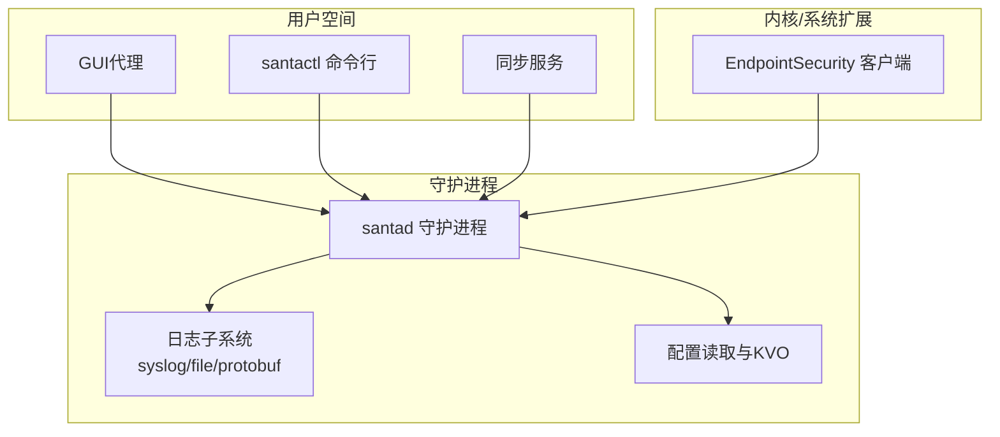
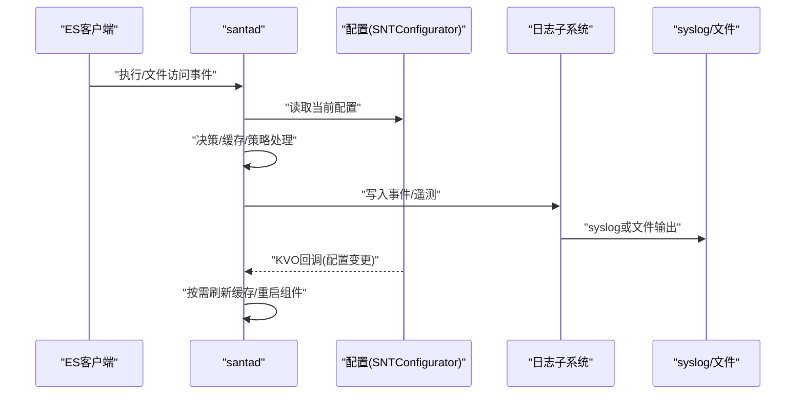
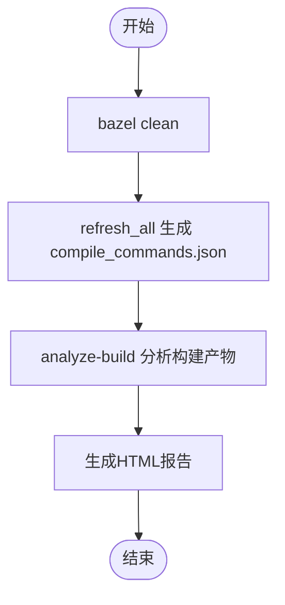
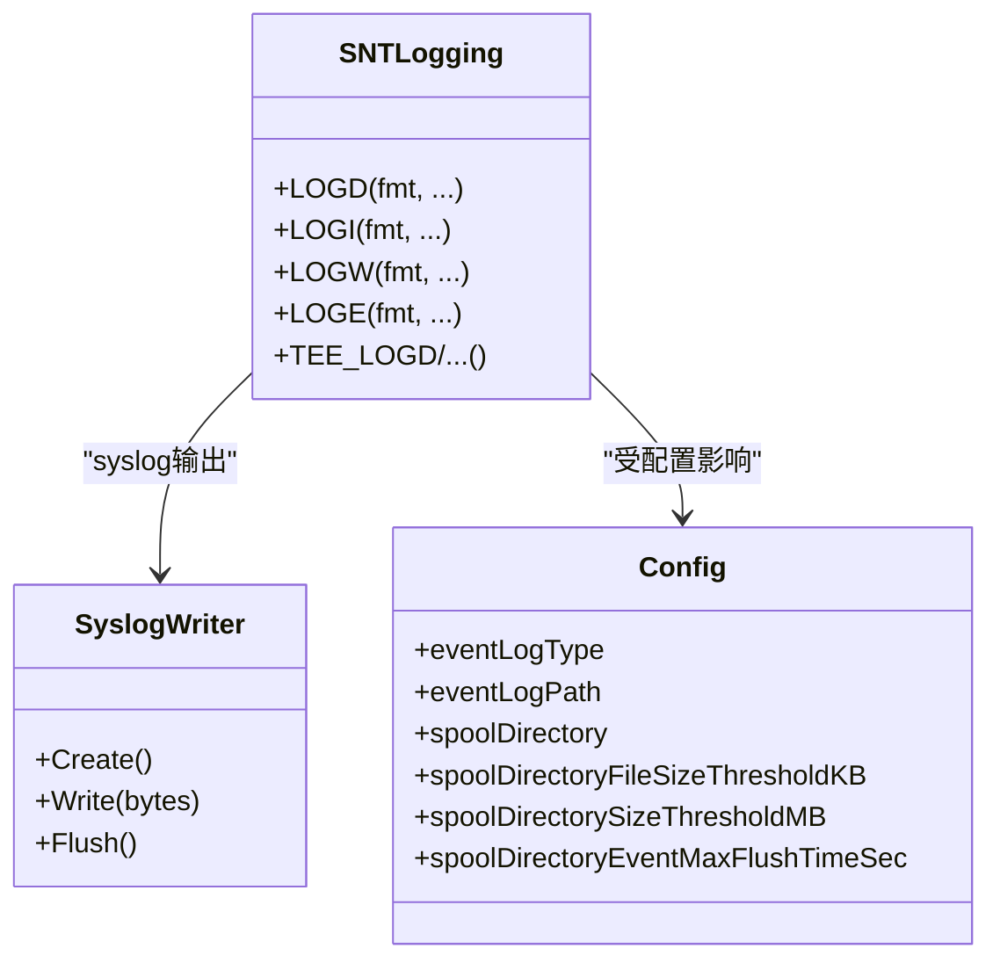
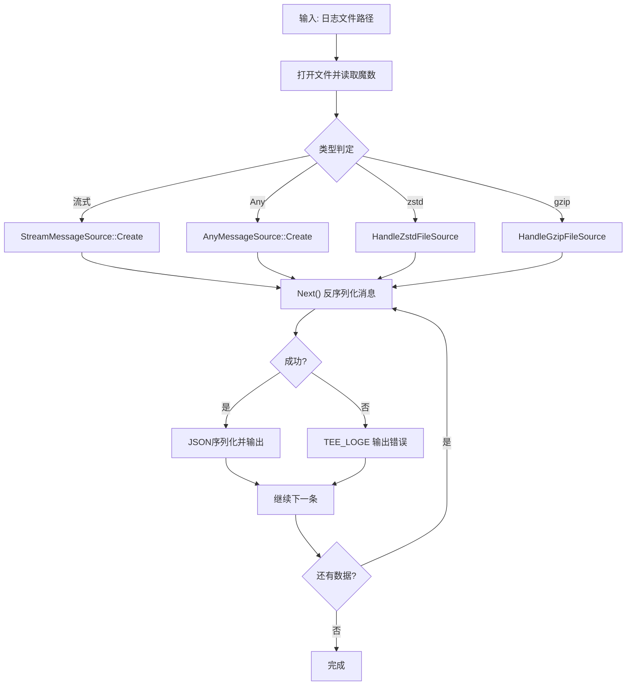
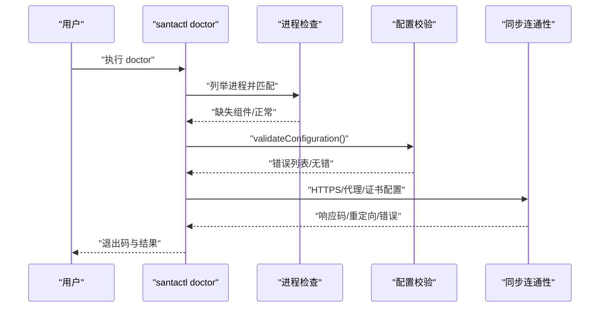
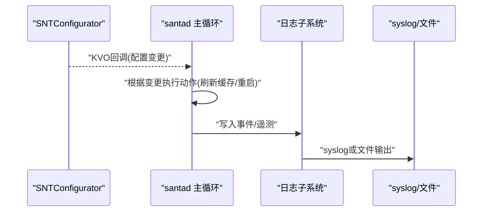
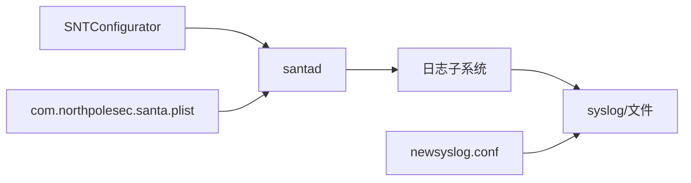

# 调试工具使用

<cite>
**本文引用的文件**
- [README.md](file://README.md)
- [run_clang_analyzer.sh](file://Testing/clang_analyzer/run_clang_analyzer.sh)
- [lint.sh](file://Testing/lint.sh)
- [fix.sh](file://Testing/fix.sh)
- [SNTLogging.h](file://Source/common/SNTLogging.h)
- [SNTConfigurator.h](file://Source/common/SNTConfigurator.h)
- [SNTConfigurator.mm](file://Source/common/SNTConfigurator.mm)
- [com.northpolesec.santa.plist](file://Conf/com.northpolesec.santa.plist)
- [com.northpolesec.santa.newsyslog.conf](file://Conf/com.northpolesec.santa.newsyslog.conf)
- [SNTCommandDoctor.mm](file://Source/santactl/Commands/SNTCommandDoctor.mm)
- [SNTCommandPrintLog.mm](file://Source/santactl/Commands/SNTCommandPrintLog.mm)
- [Santad.mm](file://Source/santad/Santad.mm)
- [Syslog.h](file://Source/santad/Logs/EndpointSecurity/Writers/Syslog.h)
- [Syslog.mm](file://Source/santad/Logs/EndpointSecurity/Writers/Syslog.mm)
- [generate_cov.sh](file://generate_cov.sh)
</cite>

## 目录
1. [简介](#简介)
2. [项目结构](#项目结构)
3. [核心组件](#核心组件)
4. [架构总览](#架构总览)
5. [详细组件分析](#详细组件分析)
6. [依赖关系分析](#依赖关系分析)
7. [性能考量](#性能考量)
8. [故障排查指南](#故障排查指南)
9. [结论](#结论)
10. [附录](#附录)

## 简介
本指南面向Santa项目的开发者与运维人员，聚焦于调试工具链的使用：包括clang静态分析器、代码检查工具、日志分析工具；同时覆盖日志级别与轮转配置、日志文件定位、调试模式与详细日志输出、问题复现技巧，以及动态调试（Xcode调试器、lldb）与性能/内存/网络监控方法。文档以仓库中现有实现为依据，提供可操作的步骤与可视化图示，帮助快速定位与解决问题。

## 项目结构
Santa由系统扩展（监控执行与文件访问）、守护进程（决策与事件处理）、GUI代理（用户提示）、同步服务（策略拉取）与命令行工具（管理与诊断）组成。调试相关的关键位置包括：
- 日志与配置：日志接口、配置读取与KVO监听、日志落盘与syslog输出
- 命令行工具：doctor（系统健康检查）、printlog（protobuf日志解析）
- 静态分析与代码规范：clang静态分析脚本、格式化与lint脚本
- 运行与轮转：launchd服务定义、newsyslog配置

图表来源
- [Santad.mm](file://Source/santad/Santad.mm#L73-L120)
- [Syslog.h](file://Source/santad/Logs/EndpointSecurity/Writers/Syslog.h#L1-L34)
- [Syslog.mm](file://Source/santad/Logs/EndpointSecurity/Writers/Syslog.mm#L1-L38)
- [SNTConfigurator.h](file://Source/common/SNTConfigurator.h#L190-L210)
- [SNTConfigurator.mm](file://Source/common/SNTConfigurator.mm#L331-L340)

章节来源
- [README.md](file://README.md#L1-L152)
- [com.northpolesec.santa.plist](file://Conf/com.northpolesec.santa.plist#L1-L22)
- [com.northpolesec.santa.newsyslog.conf](file://Conf/com.northpolesec.santa.newsyslog.conf#L1-L3)

## 核心组件
- 日志接口与级别
  - 使用统一的日志宏封装，支持OS_LOG_TYPE_DEBUG/INFO/WARNING/ERROR，并提供tee到stdout/stderr的变体，便于santactl输出。
- 配置与KVO
  - SNTConfigurator集中管理配置键值，大量配置项通过KVO监听变化，触发守护进程内部状态更新（如日志类型、遥测开关、USB挂载策略等）。
- 日志落盘与syslog
  - 支持syslog、文件、protobuf、protobuf流式等多种输出；syslog路径由Syslog Writer实现；文件路径与轮转由newsyslog.conf控制。
- 命令行诊断工具
  - doctor：检查进程、配置、同步连通性；printlog：解析并打印protobuf日志为JSON，支持zstd/gzip/stream等格式探测与解压。

章节来源
- [SNTLogging.h](file://Source/common/SNTLogging.h#L25-L68)
- [SNTConfigurator.h](file://Source/common/SNTConfigurator.h#L190-L210)
- [SNTConfigurator.mm](file://Source/common/SNTConfigurator.mm#L331-L340)
- [Syslog.h](file://Source/santad/Logs/EndpointSecurity/Writers/Syslog.h#L1-L34)
- [Syslog.mm](file://Source/santad/Logs/EndpointSecurity/Writers/Syslog.mm#L1-L38)
- [SNTCommandDoctor.mm](file://Source/santactl/Commands/SNTCommandDoctor.mm#L1-L249)
- [SNTCommandPrintLog.mm](file://Source/santactl/Commands/SNTCommandPrintLog.mm#L1-L410)

## 架构总览
下图展示从系统扩展事件到守护进程决策、日志记录与配置变更响应的整体流程。

图表来源
- [Santad.mm](file://Source/santad/Santad.mm#L73-L120)
- [SNTConfigurator.h](file://Source/common/SNTConfigurator.h#L190-L210)
- [Syslog.mm](file://Source/santad/Logs/EndpointSecurity/Writers/Syslog.mm#L1-L38)

## 详细组件分析

### 组件A：clang静态分析器与代码检查工具
- clang静态分析器
  - 使用仓库提供的脚本生成clang静态分析报告，基于Bazel编译数据库，调用analyze-build对构建产物进行分析。
  - 步骤要点：清理缓存、刷新compile_commands.json、指定HTML标题、选择clang作为分析器。
- 代码检查与格式化
  - lint脚本：统一clang-format、swift-format、空白字符检查、buildifier校验。
  - fix脚本：一键修复格式与构建规则，提升一致性。
- 性能与覆盖率
  - generate_cov.sh：演示如何在测试中开启LLVM覆盖率、合并报告并打包原始覆盖率数据，便于持续集成中的质量度量。

图表来源
- [run_clang_analyzer.sh](file://Testing/clang_analyzer/run_clang_analyzer.sh#L1-L16)
- [lint.sh](file://Testing/lint.sh#L1-L22)
- [fix.sh](file://Testing/fix.sh#L1-L8)
- [generate_cov.sh](file://generate_cov.sh#L1-L30)

章节来源
- [run_clang_analyzer.sh](file://Testing/clang_analyzer/run_clang_analyzer.sh#L1-L16)
- [lint.sh](file://Testing/lint.sh#L1-L22)
- [fix.sh](file://Testing/fix.sh#L1-L8)
- [generate_cov.sh](file://generate_cov.sh#L1-L30)

### 组件B：日志级别、轮转与文件定位
- 日志级别
  - 使用统一日志宏，支持DEBUG/INFO/WARNING/ERROR四档；tee变体同时输出到终端与系统日志。
- 日志类型与路径
  - 通过配置键EventLogType决定输出类型（syslog/file/protobuf等），文件路径由EventLogPath或SpoolDirectory控制。
  - syslog输出由Syslog Writer实现，直接调用os_log。
- 日志轮转
  - 使用newsyslog.conf配置日志文件轮转参数（文件数量、大小阈值、压缩标志等）。
- 文件定位
  - 默认文件路径与轮转阈值在配置中定义；syslog模式下通过系统日志查看器检索。

图表来源
- [SNTLogging.h](file://Source/common/SNTLogging.h#L25-L68)
- [Syslog.h](file://Source/santad/Logs/EndpointSecurity/Writers/Syslog.h#L1-L34)
- [Syslog.mm](file://Source/santad/Logs/EndpointSecurity/Writers/Syslog.mm#L1-L38)
- [SNTConfigurator.h](file://Source/common/SNTConfigurator.h#L190-L210)
- [SNTConfigurator.h](file://Source/common/SNTConfigurator.h#L220-L270)
- [com.northpolesec.santa.newsyslog.conf](file://Conf/com.northpolesec.santa.newsyslog.conf#L1-L3)

章节来源
- [SNTLogging.h](file://Source/common/SNTLogging.h#L25-L68)
- [Syslog.h](file://Source/santad/Logs/EndpointSecurity/Writers/Syslog.h#L1-L34)
- [Syslog.mm](file://Source/santad/Logs/EndpointSecurity/Writers/Syslog.mm#L1-L38)
- [SNTConfigurator.h](file://Source/common/SNTConfigurator.h#L190-L210)
- [SNTConfigurator.h](file://Source/common/SNTConfigurator.h#L220-L270)
- [com.northpolesec.santa.newsyslog.conf](file://Conf/com.northpolesec.santa.newsyslog.conf#L1-L3)

### 组件C：日志分析工具（printlog）
- 功能概述
  - 解析并打印protobuf序列化日志为JSON，支持多种格式探测（流式、zstd、gzip、Any）。
  - 对压缩文件进行安全大小限制，避免内存压力。
- 关键流程
  - 打开文件，读取魔数判断类型，选择对应解析器（流式/Any/zstd/gzip）。
  - 逐条消息反序列化，转换为JSON并输出，错误时通过tee日志打印。

图表来源
- [SNTCommandPrintLog.mm](file://Source/santactl/Commands/SNTCommandPrintLog.mm#L184-L311)
- [SNTCommandPrintLog.mm](file://Source/santactl/Commands/SNTCommandPrintLog.mm#L218-L272)
- [SNTCommandPrintLog.mm](file://Source/santactl/Commands/SNTCommandPrintLog.mm#L111-L178)

章节来源
- [SNTCommandPrintLog.mm](file://Source/santactl/Commands/SNTCommandPrintLog.mm#L1-L410)

### 组件D：系统健康检查（doctor）
- 功能概述
  - 检查关键进程是否运行（GUI、守护进程、同步服务），验证配置有效性，测试同步连通性（HTTPS、重定向、证书配置等）。
- 关键流程
  - 列举进程并匹配名称，返回缺失组件。
  - 读取配置并输出错误列表。
  - 若启用同步，构造认证会话，发起预检请求，打印响应码与重定向信息。

图表来源
- [SNTCommandDoctor.mm](file://Source/santactl/Commands/SNTCommandDoctor.mm#L79-L126)
- [SNTCommandDoctor.mm](file://Source/santactl/Commands/SNTCommandDoctor.mm#L128-L143)
- [SNTCommandDoctor.mm](file://Source/santactl/Commands/SNTCommandDoctor.mm#L145-L246)

章节来源
- [SNTCommandDoctor.mm](file://Source/santactl/Commands/SNTCommandDoctor.mm#L1-L249)

### 组件E：守护进程配置变更与日志输出
- 关键点
  - 守护进程启动后注册多项KVO回调，监听配置变更（如日志类型、遥测、USB挂载、规则等），并在必要时刷新缓存或重启组件。
  - syslog输出由Syslog Writer实现，确保事件与遥测按配置落地。

图表来源
- [Santad.mm](file://Source/santad/Santad.mm#L224-L260)
- [Santad.mm](file://Source/santad/Santad.mm#L438-L452)
- [Syslog.mm](file://Source/santad/Logs/EndpointSecurity/Writers/Syslog.mm#L1-L38)

章节来源
- [Santad.mm](file://Source/santad/Santad.mm#L224-L260)
- [Santad.mm](file://Source/santad/Santad.mm#L438-L452)
- [Syslog.mm](file://Source/santad/Logs/EndpointSecurity/Writers/Syslog.mm#L1-L38)

## 依赖关系分析
- 组件耦合
  - 日志接口与日志实现（syslog/file/protobuf）通过抽象Writer解耦；配置中心通过KVO驱动守护进程行为。
- 外部依赖
  - 新系统日志轮转（newsyslog.conf）与launchd服务定义（plist）共同决定日志文件生命周期与守护进程启动方式。
- 潜在风险
  - 配置变更可能触发守护进程重启（如日志类型切换），应结合KVO回调与日志输出进行验证。

图表来源
- [SNTConfigurator.h](file://Source/common/SNTConfigurator.h#L190-L210)
- [Santad.mm](file://Source/santad/Santad.mm#L438-L452)
- [Syslog.mm](file://Source/santad/Logs/EndpointSecurity/Writers/Syslog.mm#L1-L38)
- [com.northpolesec.santa.plist](file://Conf/com.northpolesec.santa.plist#L1-L22)
- [com.northpolesec.santa.newsyslog.conf](file://Conf/com.northpolesec.santa.newsyslog.conf#L1-L3)

章节来源
- [SNTConfigurator.h](file://Source/common/SNTConfigurator.h#L190-L210)
- [Santad.mm](file://Source/santad/Santad.mm#L438-L452)
- [Syslog.mm](file://Source/santad/Logs/EndpointSecurity/Writers/Syslog.mm#L1-L38)
- [com.northpolesec.santa.plist](file://Conf/com.northpolesec.santa.plist#L1-L22)
- [com.northpolesec.santa.newsyslog.conf](file://Conf/com.northpolesec.santa.newsyslog.conf#L1-L3)

## 性能考量
- 日志输出
  - syslog模式单行长度有限制，避免超长日志导致截断；文件模式支持轮转与阈值控制，防止磁盘膨胀。
- 遥测导出
  - 遥测批量阈值、最大文件数、导出间隔与超时均可配置，避免高负载时的抖动。
- 缓存与策略
  - 配置变更（如正则、规则、USB挂载）会触发缓存刷新，注意在大规模变更时的瞬时开销。

章节来源
- [Syslog.mm](file://Source/santad/Logs/EndpointSecurity/Writers/Syslog.mm#L21-L32)
- [SNTConfigurator.h](file://Source/common/SNTConfigurator.h#L270-L317)
- [Santad.mm](file://Source/santad/Santad.mm#L244-L259)

## 故障排查指南
- 启用调试模式与详细日志
  - 通过配置键调整日志类型（syslog/file/protobuf）与路径；启用机器ID装饰便于关联事件。
  - 使用doctor检查进程、配置与同步连通性，定位缺失组件或证书/代理问题。
- 日志文件定位与轮转
  - syslog：通过系统日志查看器检索；文件模式：默认路径与轮转阈值在配置中定义。
  - 使用printlog解析protobuf日志，支持zstd/gzip/流式格式自动识别。
- 问题复现技巧
  - 在非生产环境临时提高日志级别或开启遥测，观察事件序列；利用doctor的同步预检快速确认网络/证书链问题。
- 动态调试（Xcode/lldb）
  - 在本地构建并使用Xcode附加到守护进程或命令行工具；结合日志与断点定位异常路径；注意守护进程在DEBUG构建下禁用某些保护逻辑。
- 性能/内存/网络监控
  - 使用系统工具（如活动监视器、Instruments）观察守护进程CPU/内存占用；结合printlog与doctor输出进行关联分析；必要时降低日志量或调整遥测阈值。

章节来源
- [SNTCommandDoctor.mm](file://Source/santactl/Commands/SNTCommandDoctor.mm#L1-L249)
- [SNTCommandPrintLog.mm](file://Source/santactl/Commands/SNTCommandPrintLog.mm#L1-L410)
- [Santad.mm](file://Source/santad/Santad.mm#L764-L791)

## 结论
Santa的调试工具链覆盖静态分析、代码规范、日志落盘与解析、系统健康检查与动态调试。通过合理配置日志类型与轮转、使用doctor与printlog进行问题定位、结合Xcode/lldb与系统工具进行动态分析，可以高效地发现并解决运行时问题。建议在开发与测试环境中优先启用详细日志与遥测，在生产环境保持适度日志量以平衡可观测性与性能。

## 附录
- 常用命令与入口
  - clang静态分析：参考脚本路径与参数
  - 代码检查/修复：lint/fix脚本
  - 日志解析：printlog
  - 系统健康：doctor
- 配置键参考（节选）
  - 日志类型与路径：EventLogType、EventLogPath、SpoolDirectory、阈值与刷新时间
  - 遥测导出：EnableTelemetryExport、ExportInterval、Timeout、Batch阈值与文件数
  - USB/网络挂载：BlockUSBMount、RemountUSBMode、BlockNetworkMount、AllowedNetworkMountHosts
  - 其他：EnableSilentTTYMode、EnableMachineIDDecoration、Telemetry等

章节来源
- [SNTConfigurator.h](file://Source/common/SNTConfigurator.h#L190-L210)
- [SNTConfigurator.h](file://Source/common/SNTConfigurator.h#L270-L317)
- [SNTConfigurator.h](file://Source/common/SNTConfigurator.h#L686-L724)
- [SNTConfigurator.h](file://Source/common/SNTConfigurator.h#L725-L757)
- [SNTConfigurator.h](file://Source/common/SNTConfigurator.h#L380-L418)