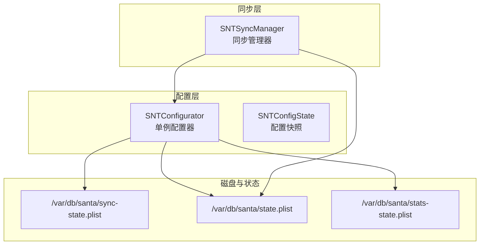
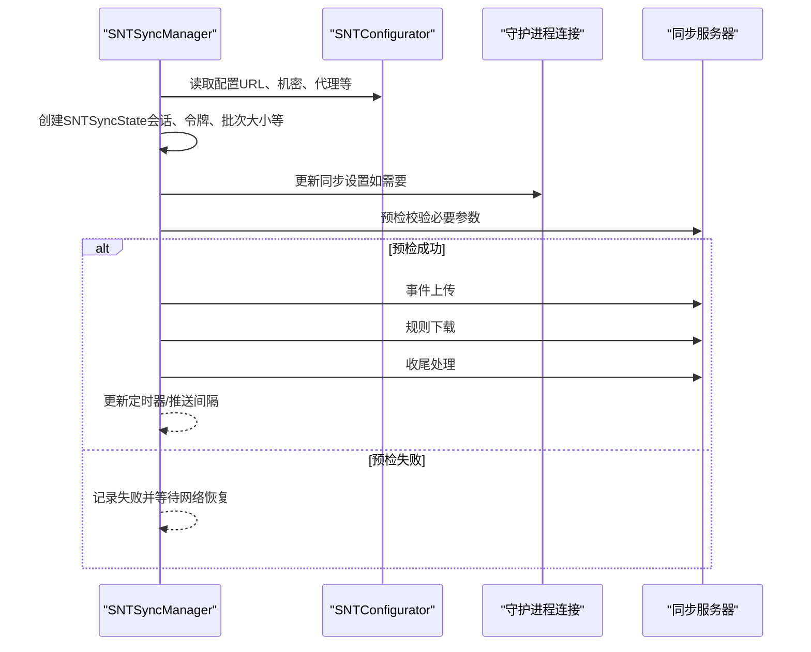
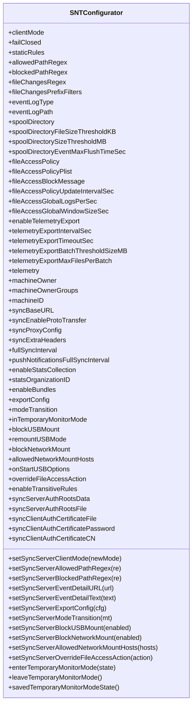
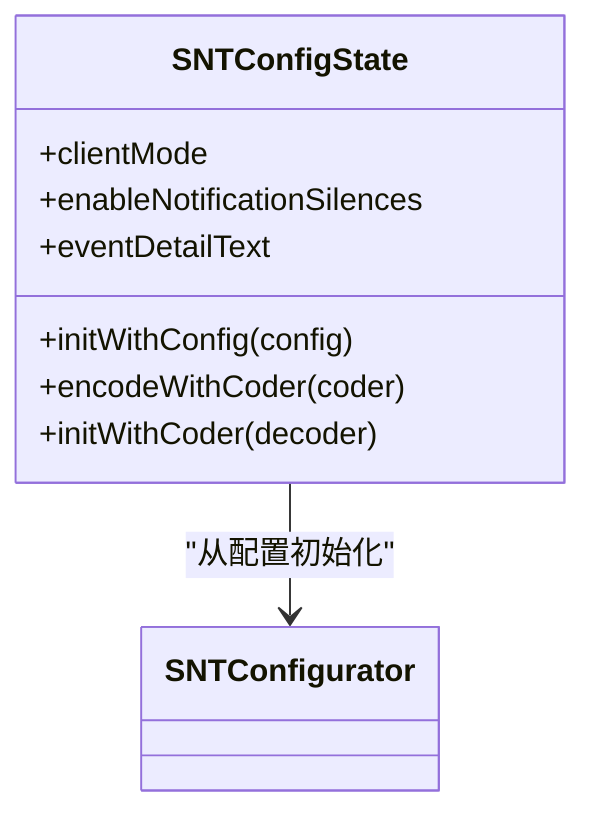
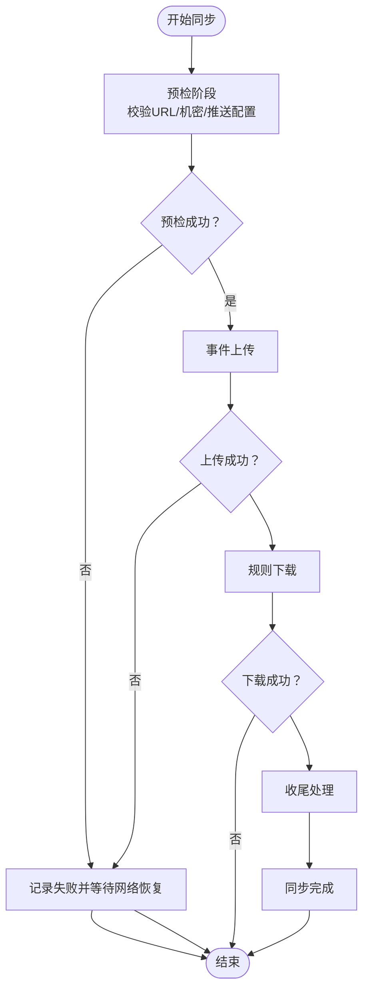
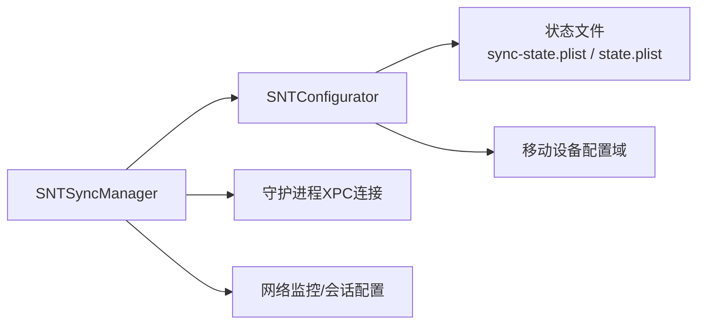

# 配置问题修复

<cite>
**本文引用的文件**
- [SNTConfigurator.h](file://Source/common/SNTConfigurator.h)
- [SNTConfigurator.mm](file://Source/common/SNTConfigurator.mm)
- [SNTConfigState.h](file://Source/common/SNTConfigState.h)
- [SNTConfigState.mm](file://Source/common/SNTConfigState.mm)
- [SNTSyncManager.h](file://Source/santasyncservice/SNTSyncManager.h)
- [SNTSyncManager.mm](file://Source/santasyncservice/SNTSyncManager.mm)
</cite>

## 目录
1. [简介](#简介)
2. [项目结构](#项目结构)
3. [核心组件](#核心组件)
4. [架构总览](#架构总览)
5. [详细组件分析](#详细组件分析)
6. [依赖关系分析](#依赖关系分析)
7. [性能考量](#性能考量)
8. [故障排查指南](#故障排查指南)
9. [结论](#结论)
10. [附录](#附录)

## 简介
本指南面向Santa（SNT）配置问题的诊断与修复，聚焦以下场景：
- 配置文件解析错误
- 规则验证失败
- 同步配置异常
- 配置变更生效机制
- 语法检查、规则冲突检测与策略验证
- 配置回滚、默认值恢复与重置
- 配置文件损坏、权限问题与格式错误的处理
- 修复有效性验证

文档基于代码实现进行分析，并提供可操作的排障步骤与图示，帮助非专业读者也能快速定位与解决问题。

## 项目结构
与配置相关的关键模块位于“common”与“santasyncservice”目录中：
- 配置读取与状态：SNTConfigurator（单例，负责从磁盘与同步状态合并配置）、SNTConfigState（快照化配置）
- 同步流程：SNTSyncManager（调度预检、事件上传、规则下载、收尾与推送通知）
- 关键路径与文件：
  - 同步状态文件：/var/db/santa/sync-state.plist
  - 运行状态文件：/var/db/santa/state.plist
  - 旧状态文件迁移：/var/db/santa/stats-state.plist
  - 移动设备配置域：com.northpolesec.santa

图表来源
- [SNTConfigurator.mm](file://Source/common/SNTConfigurator.mm#L71-L86)
- [SNTSyncManager.mm](file://Source/santasyncservice/SNTSyncManager.mm#L418-L500)

章节来源
- [SNTConfigurator.mm](file://Source/common/SNTConfigurator.mm#L71-L86)
- [SNTSyncManager.mm](file://Source/santasyncservice/SNTSyncManager.mm#L418-L500)

## 核心组件
- SNTConfigurator（单例）
  - 职责：统一读取与合并配置来源（强制配置、同步状态、移动设备配置），暴露KVO属性供运行时使用；维护同步状态与运行状态文件；提供临时监控模式等能力。
  - 关键点：
    - 强制配置键类型校验与默认值策略
    - 同步状态与运行状态文件的读写与迁移
    - KVO依赖链，确保属性变更能正确触发
- SNTConfigState
  - 职责：对某一时刻的配置进行安全编码快照，便于持久化或跨进程传递
- SNTSyncManager
  - 职责：周期性与按需触发同步；在预检阶段校验必要参数（如SyncBaseURL、MachineID）；串行执行事件上传、规则下载、后置处理；支持推送通知与网络可达性监听

章节来源
- [SNTConfigurator.h](file://Source/common/SNTConfigurator.h#L29-L120)
- [SNTConfigurator.mm](file://Source/common/SNTConfigurator.mm#L233-L395)
- [SNTConfigState.h](file://Source/common/SNTConfigState.h#L20-L32)
- [SNTConfigState.mm](file://Source/common/SNTConfigState.mm#L22-L53)
- [SNTSyncManager.h](file://Source/santasyncservice/SNTSyncManager.h#L24-L78)
- [SNTSyncManager.mm](file://Source/santasyncservice/SNTSyncManager.mm#L66-L103)

## 架构总览
下图展示配置与同步的整体交互：SNTConfigurator作为配置中心，SNTSyncManager基于其配置发起同步流程，期间通过SNTSyncState传递会话与参数。

图表来源
- [SNTSyncManager.mm](file://Source/santasyncservice/SNTSyncManager.mm#L196-L228)
- [SNTSyncManager.mm](file://Source/santasyncservice/SNTSyncManager.mm#L297-L400)
- [SNTSyncManager.mm](file://Source/santasyncservice/SNTSyncManager.mm#L418-L500)

章节来源
- [SNTSyncManager.mm](file://Source/santasyncservice/SNTSyncManager.mm#L196-L228)
- [SNTSyncManager.mm](file://Source/santasyncservice/SNTSyncManager.mm#L297-L400)
- [SNTSyncManager.mm](file://Source/santasyncservice/SNTSyncManager.mm#L418-L500)

## 详细组件分析

### SNTConfigurator：配置解析与合并
- 初始化与状态文件
  - 读取强制配置（来自移动设备配置与静态键集）
  - 读取同步状态（/var/db/santa/sync-state.plist），必要时迁移过时键
  - 仅在授权条件下读取运行状态（/var/db/santa/state.plist 或旧路径）
  - 启动KVO监听以响应配置变化
- 键类型与默认值
  - 对同步端与强制端的键分别定义期望类型集合，用于解析与校验
  - 未满足类型要求的键会被忽略或回退到默认行为
- KVO依赖链
  - 多个属性的依赖集合被显式声明，确保变更传播正确（例如客户端模式由同步状态与临时监控模式共同决定）

图表来源
- [SNTConfigurator.h](file://Source/common/SNTConfigurator.h#L31-L800)

章节来源
- [SNTConfigurator.mm](file://Source/common/SNTConfigurator.mm#L233-L395)
- [SNTConfigurator.mm](file://Source/common/SNTConfigurator.mm#L454-L785)

### SNTConfigState：配置快照
- 将某一时刻的关键配置项（如客户端模式、通知静默开关、事件详情文本）编码为可安全归档对象，便于持久化或跨组件传递
- 提供编码/解码接口，保证序列化一致性

图表来源
- [SNTConfigState.h](file://Source/common/SNTConfigState.h#L20-L32)
- [SNTConfigState.mm](file://Source/common/SNTConfigState.mm#L22-L53)

章节来源
- [SNTConfigState.mm](file://Source/common/SNTConfigState.mm#L22-L53)

### SNTSyncManager：同步流程与异常处理
- 同步入口
  - 支持立即同步、延时同步、带类型的同步（含清理型）
  - 使用信号量限制并发同步任务数量
- 同步阶段
  - 预检：校验SyncBaseURL、MachineID等必要参数；根据推送配置调整全量同步周期
  - 事件上传：批量上传事件，失败时启动网络可达性监听
  - 规则下载：拉取远端规则并应用
  - 收尾：完成状态更新与日志记录
- 异常与回退
  - 缺少必要参数（如SyncBaseURL或MachineID）直接返回失败状态
  - 网络不可达时记录错误并等待恢复后重试
  - 推送启用但预检失败时缩短下次全量同步间隔

图表来源
- [SNTSyncManager.mm](file://Source/santasyncservice/SNTSyncManager.mm#L297-L400)
- [SNTSyncManager.mm](file://Source/santasyncservice/SNTSyncManager.mm#L402-L539)

章节来源
- [SNTSyncManager.h](file://Source/santasyncservice/SNTSyncManager.h#L41-L78)
- [SNTSyncManager.mm](file://Source/santasyncservice/SNTSyncManager.mm#L196-L228)
- [SNTSyncManager.mm](file://Source/santasyncservice/SNTSyncManager.mm#L297-L400)
- [SNTSyncManager.mm](file://Source/santasyncservice/SNTSyncManager.mm#L402-L539)

## 依赖关系分析
- SNTConfigurator依赖：
  - 状态文件（同步状态、运行状态）与移动设备配置域
  - KVO键路径集合，确保属性变更传播
- SNTSyncManager依赖：
  - SNTConfigurator提供的配置（URL、认证、代理、推送等）
  - 守护进程XPC连接以更新同步设置
  - 网络监控与会话配置（HTTPS、证书固定/信任链、客户端证书）

图表来源
- [SNTConfigurator.mm](file://Source/common/SNTConfigurator.mm#L71-L86)
- [SNTSyncManager.mm](file://Source/santasyncservice/SNTSyncManager.mm#L66-L103)
- [SNTSyncManager.mm](file://Source/santasyncservice/SNTSyncManager.mm#L418-L500)

章节来源
- [SNTConfigurator.mm](file://Source/common/SNTConfigurator.mm#L71-L86)
- [SNTSyncManager.mm](file://Source/santasyncservice/SNTSyncManager.mm#L66-L103)
- [SNTSyncManager.mm](file://Source/santasyncservice/SNTSyncManager.mm#L418-L500)

## 性能考量
- 文件前缀过滤（内核侧）：通过路径前缀过滤减少内核生成文件变更日志，降低开销；注意节点总数限制与UTF-8编码影响
- 日志落盘策略：事件日志类型、刷盘阈值、批次大小与超时时间均可调，避免磁盘压力过大
- 同步并发控制：同步队列与信号量限制同时进行的同步次数，防止资源争用
- 推送通知：启用推送可缩短全量同步周期，提升实时性；预检失败时自动缩短重试间隔

章节来源
- [SNTConfigurator.h](file://Source/common/SNTConfigurator.h#L118-L167)
- [SNTConfigurator.h](file://Source/common/SNTConfigurator.h#L191-L210)
- [SNTConfigurator.h](file://Source/common/SNTConfigurator.h#L213-L270)
- [SNTSyncManager.mm](file://Source/santasyncservice/SNTSyncManager.mm#L41-L53)
- [SNTSyncManager.mm](file://Source/santasyncservice/SNTSyncManager.mm#L349-L364)

## 故障排查指南

### 一、配置文件解析错误
症状
- 配置未生效或出现默认行为
- 属性类型不匹配导致被忽略

诊断步骤
- 检查强制配置键类型是否符合预期（字符串、数组、字典、数值、正则表达式等）
- 确认移动设备配置域com.northpolesec.santa中的键是否存在且拼写正确
- 查看同步状态与运行状态文件是否存在且可读

修复建议
- 修正键类型（如将数组改为字符串或将字符串改为数组）
- 删除或更正无效键，保留受支持的键集
- 确保文件权限允许进程读取（通常需要root）

章节来源
- [SNTConfigurator.mm](file://Source/common/SNTConfigurator.mm#L247-L368)
- [SNTConfigurator.mm](file://Source/common/SNTConfigurator.mm#L379-L391)

### 二、规则验证失败
症状
- 规则下载失败或规则未生效
- 同步状态中规则字段为空或格式异常

诊断步骤
- 在预检阶段检查SyncBaseURL与MachineID是否齐全
- 若启用推送，确认推送连接状态与全量同步间隔
- 检查事件上传阶段是否成功，失败时关注网络可达性

修复建议
- 补充缺失的必要参数（如SyncBaseURL、MachineID）
- 修复网络或代理配置，确保HTTPS可达
- 如启用推送，检查推送凭据与服务器地址

章节来源
- [SNTSyncManager.mm](file://Source/santasyncservice/SNTSyncManager.mm#L418-L500)
- [SNTSyncManager.mm](file://Source/santasyncservice/SNTSyncManager.mm#L297-L364)

### 三、同步配置异常
症状
- 同步频繁失败或长时间不触发
- 全量同步周期异常

诊断步骤
- 检查同步定时器是否被正确重设（预检成功后会根据推送配置或默认值重设）
- 观察网络可达性监听是否被触发（断网后恢复时应自动触发同步）
- 查看同步状态文件是否被正确写入与迁移

修复建议
- 确保配置器在授权条件下读取运行状态文件
- 修复状态文件路径与权限问题
- 如使用推送，确认推送客户端已连接并返回有效地址

章节来源
- [SNTSyncManager.mm](file://Source/santasyncservice/SNTSyncManager.mm#L317-L348)
- [SNTSyncManager.mm](file://Source/santasyncservice/SNTSyncManager.mm#L504-L539)
- [SNTConfigurator.mm](file://Source/common/SNTConfigurator.mm#L387-L391)

### 四、配置变更生效机制
- SNTConfigurator通过KVO键路径集合声明属性依赖，确保任一配置源变化都会触发相关属性的重新计算
- 临时监控模式可覆盖客户端模式，优先级高于其他配置源
- 配置变更后，依赖该配置的组件（如日志、规则、USB策略等）会按KVO链路自动更新

章节来源
- [SNTConfigurator.mm](file://Source/common/SNTConfigurator.mm#L454-L785)
- [SNTConfigurator.mm](file://Source/common/SNTConfigurator.mm#L787-L800)

### 五、配置文件语法检查、规则冲突检测与策略验证
- 语法检查
  - 使用强制配置键类型表进行键值类型校验，不符合类型的键将被忽略
  - 正则表达式键（如路径白/黑名单）需符合ICU格式
- 规则冲突检测
  - 下载规则阶段由远端服务器决定冲突解决策略；本地可关注规则数量与最近一次规则同步时间
- 策略验证
  - 通过预检阶段验证必要参数（URL、机密、推送配置），确保后续流程可用

章节来源
- [SNTConfigurator.mm](file://Source/common/SNTConfigurator.mm#L247-L368)
- [SNTConfigurator.h](file://Source/common/SNTConfigurator.h#L80-L116)
- [SNTSyncManager.mm](file://Source/santasyncservice/SNTSyncManager.mm#L297-L364)

### 六、配置回滚、默认值恢复与重置
- 回滚
  - 通过恢复旧的状态文件或移除当前状态文件，使配置回到上一个稳定版本
  - 注意：仅在授权条件下读取运行状态文件，避免误操作
- 默认值恢复
  - 删除无效键或恢复到受支持的键集，系统将采用默认行为
- 重置
  - 清空或重建状态文件与同步状态文件，重启相关服务后生效

章节来源
- [SNTConfigurator.mm](file://Source/common/SNTConfigurator.mm#L387-L391)
- [SNTConfigurator.mm](file://Source/common/SNTConfigurator.mm#L71-L86)

### 七、配置文件损坏、权限问题与格式错误
- 损坏
  - 症状：解析失败、属性为空、同步失败
  - 处理：备份后删除状态文件，让系统重新生成；或从可信副本恢复
- 权限问题
  - 症状：无法读取状态文件、KVO不生效
  - 处理：确保进程以root身份运行，且状态文件具备读权限
- 格式错误
  - 症状：键类型不符、正则表达式非法
  - 处理：修正键类型与正则表达式格式，参考强制配置键类型表

章节来源
- [SNTConfigurator.mm](file://Source/common/SNTConfigurator.mm#L71-L86)
- [SNTConfigurator.mm](file://Source/common/SNTConfigurator.mm#L247-L368)

### 八、验证配置修复的有效性
- 功能验证
  - 观察客户端模式切换、日志输出、USB/网络挂载策略是否按预期工作
  - 检查最近一次规则同步时间与事件上传状态
- 性能验证
  - 监控日志刷盘与事件批次大小，确认未出现磁盘压力
  - 检查推送连接状态与全量同步周期是否合理

章节来源
- [SNTSyncManager.mm](file://Source/santasyncservice/SNTSyncManager.mm#L317-L348)
- [SNTConfigurator.h](file://Source/common/SNTConfigurator.h#L191-L210)
- [SNTConfigurator.h](file://Source/common/SNTConfigurator.h#L213-L270)

## 结论
Santa的配置体系通过SNTConfigurator集中管理，结合SNTSyncManager的严格同步流程，能够有效支撑生产环境的配置治理。针对配置问题，建议遵循“先校验键类型与格式，再验证同步参数与网络，最后通过状态文件回滚与默认值恢复”的闭环流程，确保快速定位与修复。

## 附录
- 常用键与职责概览（节选）
  - 客户端模式与安全策略：ClientMode、FailClosed、EnablePageZeroProtection、EnableBadSignatureProtection、EnableAntiTamperProcessSuspendResume
  - 日志与遥测：EventLogType、EventLogPath、SpoolDirectory、EnableTelemetryExport、TelemetryExport相关
  - 文件访问策略：FileAccessPolicy、FileAccessPolicyPlist、FileAccessBlockMessage、FileAccessPolicyUpdateIntervalSec、FileAccessGlobalLogsPerSec、FileAccessGlobalWindowSizeSec
  - 同步与推送：SyncBaseURL、SyncEnableProtoTransfer、SyncProxyConfig、SyncExtraHeaders、EnablePushNotifications、FCM相关
  - USB与网络挂载：BlockUSBMount、RemountUSBMode、BlockNetworkMount、AllowedNetworkMountHosts、OnStartUSBOptions
  - 统计与导出：EnableStatsCollection、StatsOrganizationID、ExportConfiguration、ModeTransition

章节来源
- [SNTConfigurator.h](file://Source/common/SNTConfigurator.h#L31-L800)