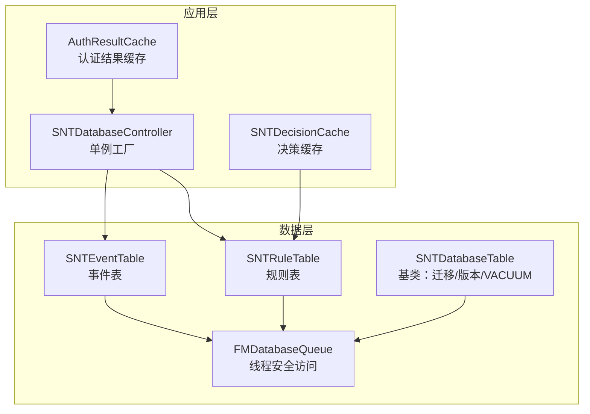
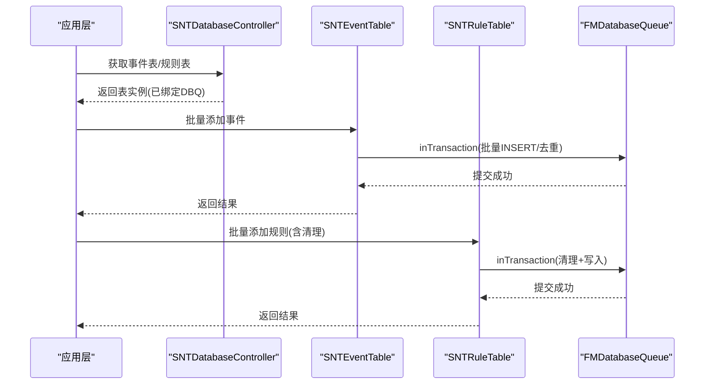
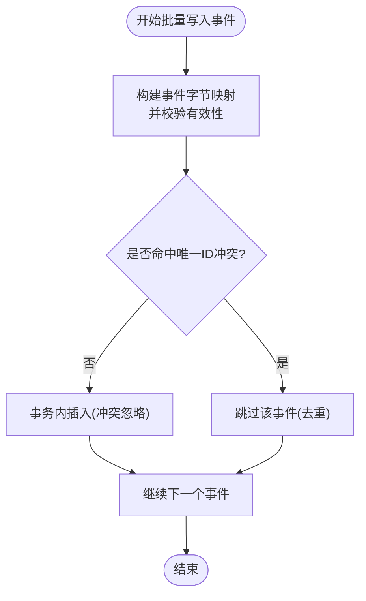
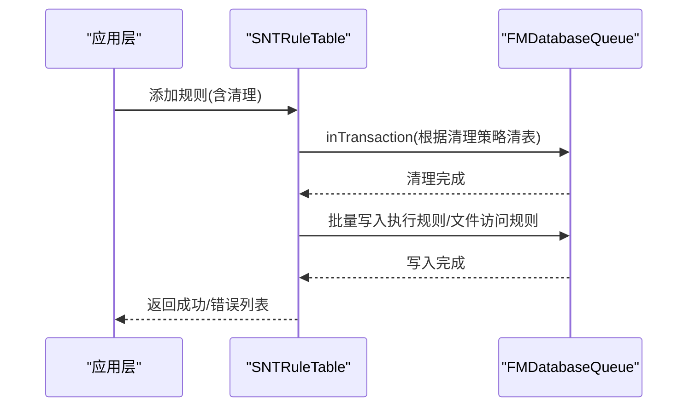
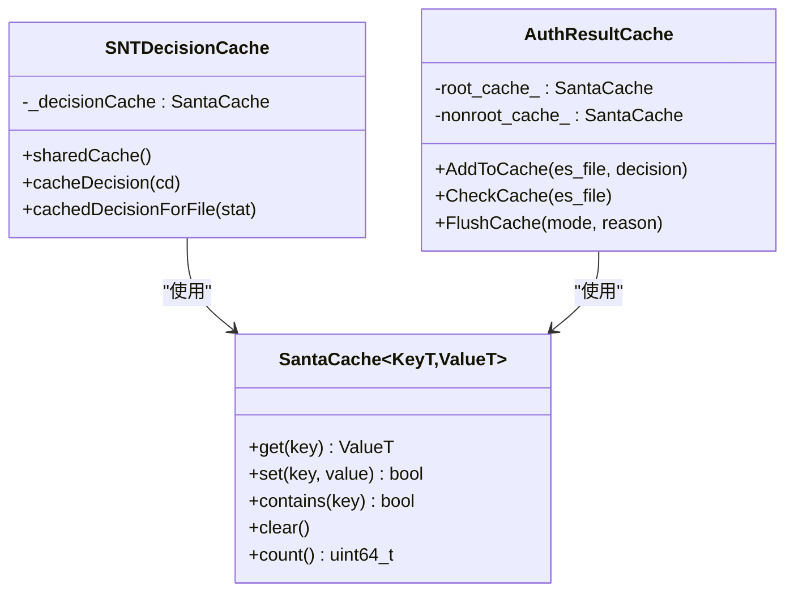
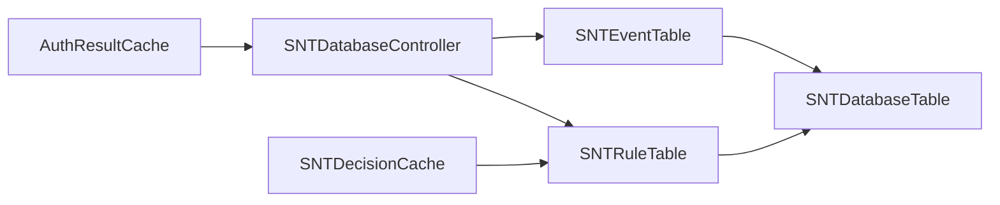

# 性能优化

<cite>
**本文引用的文件**
- [SNTDatabaseController.h](file://Source/santad/SNTDatabaseController.h)
- [SNTDatabaseController.mm](file://Source/santad/SNTDatabaseController.mm)
- [SNTDatabaseTable.h](file://Source/santad/DataLayer/SNTDatabaseTable.h)
- [SNTDatabaseTable.mm](file://Source/santad/DataLayer/SNTDatabaseTable.mm)
- [SNTEventTable.h](file://Source/santad/DataLayer/SNTEventTable.h)
- [SNTEventTable.mm](file://Source/santad/DataLayer/SNTEventTable.mm)
- [SNTRuleTable.h](file://Source/santad/DataLayer/SNTRuleTable.h)
- [SNTRuleTable.mm](file://Source/santad/DataLayer/SNTRuleTable.mm)
- [SNTDecisionCache.h](file://Source/santad/SNTDecisionCache.h)
- [SNTDecisionCache.mm](file://Source/santad/SNTDecisionCache.mm)
- [AuthResultCache.h](file://Source/santad/EventProviders/AuthResultCache.h)
- [AuthResultCache.mm](file://Source/santad/EventProviders/AuthResultCache.mm)
- [SantaCache.h](file://Source/common/SantaCache.h)
- [SNTDaemonControlController.mm](file://Source/santad/SNTDaemonControlController.mm)
- [SNTMetricSet.mm](file://Source/common/SNTMetricSet.mm)
</cite>

## 目录
1. [简介](#简介)
2. [项目结构](#项目结构)
3. [核心组件](#核心组件)
4. [架构总览](#架构总览)
5. [详细组件分析](#详细组件分析)
6. [依赖关系分析](#依赖关系分析)
7. [性能考量](#性能考量)
8. [故障排查指南](#故障排查指南)
9. [结论](#结论)
10. [附录](#附录)

## 简介
本技术文档聚焦 Santa 的数据库性能优化，围绕查询优化策略、索引设计与执行计划分析、缓存机制、批量写入与事务、数据库参数与维护、并发控制与锁竞争、监控指标与瓶颈定位、以及大数据量下的分页与流式处理策略展开。文档旨在帮助开发者与运维人员在保证正确性的前提下，系统性地提升 Santa 数据层的吞吐与稳定性。

## 项目结构
Santa 将数据库访问抽象为统一的数据层控制器，并通过 FMDB 的队列封装实现线程安全与事务控制；事件表与规则表分别承载运行时事件与授权规则，二者共享统一的表基类以复用迁移、版本管理与 VACUUM 清理逻辑。

图表来源
- [SNTDatabaseController.mm](file://Source/santad/SNTDatabaseController.mm#L34-L79)
- [SNTEventTable.mm](file://Source/santad/DataLayer/SNTEventTable.mm#L107-L160)
- [SNTRuleTable.mm](file://Source/santad/DataLayer/SNTRuleTable.mm#L651-L705)
- [SNTDatabaseTable.mm](file://Source/santad/DataLayer/SNTDatabaseTable.mm#L115-L151)

章节来源
- [SNTDatabaseController.h](file://Source/santad/SNTDatabaseController.h#L15-L41)
- [SNTDatabaseController.mm](file://Source/santad/SNTDatabaseController.mm#L34-L79)

## 核心组件
- 数据库控制器：负责事件库与规则库的初始化、权限设置与单例获取。
- 表基类：统一处理数据库版本升级、完整性检查、迁移与 VACUUM。
- 事件表：支持批量插入、去重、计数、拉取与删除；内置“不可行动作”退避缓存。
- 规则表：支持执行规则与文件访问规则的批量写入、清理策略、哈希校验、过期规则清理与优先级查询。
- 缓存层：本地决策缓存与认证结果缓存，减少重复查询与内核交互。

章节来源
- [SNTDatabaseController.mm](file://Source/santad/SNTDatabaseController.mm#L34-L79)
- [SNTDatabaseTable.mm](file://Source/santad/DataLayer/SNTDatabaseTable.mm#L115-L151)
- [SNTEventTable.h](file://Source/santad/DataLayer/SNTEventTable.h#L1-L72)
- [SNTEventTable.mm](file://Source/santad/DataLayer/SNTEventTable.mm#L107-L160)
- [SNTRuleTable.h](file://Source/santad/DataLayer/SNTRuleTable.h#L1-L172)
- [SNTRuleTable.mm](file://Source/santad/DataLayer/SNTRuleTable.mm#L651-L705)
- [SNTDecisionCache.mm](file://Source/santad/SNTDecisionCache.mm#L39-L83)
- [AuthResultCache.mm](file://Source/santad/EventProviders/AuthResultCache.mm#L111-L171)

## 架构总览
数据库层采用“控制器-表-队列”的分层设计，所有数据库操作通过 FMDatabaseQueue 串行化，确保并发安全；表基类在初始化阶段完成模式升级与完整性修复；事件与规则表各自提供批量写入、清理与统计接口，配合缓存层降低热点查询压力。

图表来源
- [SNTDatabaseController.mm](file://Source/santad/SNTDatabaseController.mm#L34-L79)
- [SNTEventTable.mm](file://Source/santad/DataLayer/SNTEventTable.mm#L128-L160)
- [SNTRuleTable.mm](file://Source/santad/DataLayer/SNTRuleTable.mm#L651-L705)

## 详细组件分析

### 事件表（SNTEventTable）
- 批量写入与去重
  - 使用事务包裹批量插入，避免逐条提交带来的锁竞争与日志开销。
  - 插入时使用“按唯一标识冲突忽略”的策略，减少重复事件入库。
- 去重与唯一索引
  - 版本演进中将唯一标识字段从文件哈希调整为通用唯一ID，并建立唯一索引，显著降低重复率与查询成本。
- 计数与拉取
  - 计数采用 COUNT(*) 查询；拉取时逐行反序列化并清理无效记录，避免一次性全量加载导致内存峰值。
- 不可行动作退避
  - 对短时间内重复的“不可行动作”事件进行退避，降低存储与上传压力。

图表来源
- [SNTEventTable.mm](file://Source/santad/DataLayer/SNTEventTable.mm#L128-L160)
- [SNTEventTable.mm](file://Source/santad/DataLayer/SNTEventTable.mm#L176-L203)

章节来源
- [SNTEventTable.h](file://Source/santad/DataLayer/SNTEventTable.h#L1-L72)
- [SNTEventTable.mm](file://Source/santad/DataLayer/SNTEventTable.mm#L107-L160)
- [SNTEventTable.mm](file://Source/santad/DataLayer/SNTEventTable.mm#L176-L203)

### 规则表（SNTRuleTable）
- 批量写入与清理
  - 在单个事务中执行清理策略与写入，保证一致性与原子性。
  - 支持多种清理模式：全量、非瞬态、仅执行规则、仅文件访问规则。
- 查询优先级与性能
  - 静态规则优先于数据库查询；数据库查询按类型顺序匹配，避免不必要的排序与回表。
- 过期规则清理
  - 定期清理长时间未使用的瞬态规则，阈值与过期时间可配置，降低规则表规模。
- 文件访问规则哈希
  - 维护文件访问规则哈希，用于检测变更并触发回调。

图表来源
- [SNTRuleTable.mm](file://Source/santad/DataLayer/SNTRuleTable.mm#L651-L705)

章节来源
- [SNTRuleTable.h](file://Source/santad/DataLayer/SNTRuleTable.h#L1-L172)
- [SNTRuleTable.mm](file://Source/santad/DataLayer/SNTRuleTable.mm#L651-L705)
- [SNTRuleTable.mm](file://Source/santad/DataLayer/SNTRuleTable.mm#L783-L800)

### 缓存层（SNTDecisionCache 与 AuthResultCache）
- 本地决策缓存
  - 基于高性能并发哈希表，按 vnode 维度缓存决策，支持容量限制与后台回填队列，降低规则查询频率。
- 认证结果缓存
  - 按根分区与非根分区分别维护两份缓存，支持状态机转换与 Deny 过期控制，避免内核缓存陈旧导致的误判。
- 缓存刷新
  - 当规则或模式变更时，按需刷新本地与内核缓存，确保一致性。

图表来源
- [SNTDecisionCache.mm](file://Source/santad/SNTDecisionCache.mm#L39-L83)
- [AuthResultCache.mm](file://Source/santad/EventProviders/AuthResultCache.mm#L111-L171)
- [SantaCache.h](file://Source/common/SantaCache.h#L1-L468)

章节来源
- [SNTDecisionCache.mm](file://Source/santad/SNTDecisionCache.mm#L39-L83)
- [AuthResultCache.mm](file://Source/santad/EventProviders/AuthResultCache.mm#L111-L171)
- [AuthResultCache.mm](file://Source/santad/EventProviders/AuthResultCache.mm#L177-L197)

### 表基类与维护（SNTDatabaseTable）
- 初始化与迁移
  - 在初始化阶段检查连接、版本与完整性，必要时执行修复与重建。
- 版本升级与 VACUUM
  - 升级完成后执行 VACUUM，回收空闲页，降低碎片与文件膨胀。
- 事务封装
  - 提供 inDatabase/inTransaction 封装，简化并发与一致性控制。

章节来源
- [SNTDatabaseTable.h](file://Source/santad/DataLayer/SNTDatabaseTable.h#L36-L58)
- [SNTDatabaseTable.mm](file://Source/santad/DataLayer/SNTDatabaseTable.mm#L115-L151)

## 依赖关系分析
- 控制器依赖：SNTDatabaseController 通过 FMDatabaseQueue 为事件表与规则表提供统一的数据库访问入口。
- 表依赖：事件表与规则表均继承自 SNTDatabaseTable，共享迁移、版本与维护能力。
- 缓存依赖：SNTDecisionCache 依赖规则表统计数据与静态规则；AuthResultCache 依赖数据库控制器提供的表实例与内核客户端。

图表来源
- [SNTDatabaseController.mm](file://Source/santad/SNTDatabaseController.mm#L34-L79)
- [SNTEventTable.h](file://Source/santad/DataLayer/SNTEventTable.h#L1-L25)
- [SNTRuleTable.h](file://Source/santad/DataLayer/SNTRuleTable.h#L1-L36)

章节来源
- [SNTDatabaseController.mm](file://Source/santad/SNTDatabaseController.mm#L34-L79)
- [SNTEventTable.h](file://Source/santad/DataLayer/SNTEventTable.h#L1-L25)
- [SNTRuleTable.h](file://Source/santad/DataLayer/SNTRuleTable.h#L1-L36)

## 性能考量

### 查询优化策略
- 事件表
  - 拉取时逐行反序列化并清理无效记录，避免一次性全量加载导致内存峰值。
  - 计数采用 COUNT(*)，复杂度 O(n) 但无全表扫描风险。
- 规则表
  - 静态规则优先匹配，减少数据库查询次数。
  - 查询按类型顺序匹配，避免 ORDER BY 导致的额外排序成本。

章节来源
- [SNTEventTable.mm](file://Source/santad/DataLayer/SNTEventTable.mm#L176-L203)
- [SNTRuleTable.mm](file://Source/santad/DataLayer/SNTRuleTable.mm#L438-L516)

### 索引设计与执行计划
- 事件表
  - 唯一索引覆盖唯一标识列，插入时冲突忽略，显著降低重复事件入库成本。
- 规则表
  - 执行规则表按 (identifier, type) 建立唯一索引，查询命中率高。
  - 文件访问规则表以名称为主键，适合按名称检索与替换式更新。

章节来源
- [SNTEventTable.mm](file://Source/santad/DataLayer/SNTEventTable.mm#L52-L103)
- [SNTRuleTable.mm](file://Source/santad/DataLayer/SNTRuleTable.mm#L294-L307)

### 批量操作与事务
- 事件批量写入
  - 事务内批量 INSERT，使用冲突忽略策略，避免重复写入。
- 规则批量写入
  - 事务内先执行清理策略，再批量写入，保证一致性与原子性。

章节来源
- [SNTEventTable.mm](file://Source/santad/DataLayer/SNTEventTable.mm#L128-L160)
- [SNTRuleTable.mm](file://Source/santad/DataLayer/SNTRuleTable.mm#L651-L705)

### 缓存机制
- 本地决策缓存
  - 基于并发哈希表，容量限制与后台回填队列平衡命中率与内存占用。
- 认证结果缓存
  - 分区缓存与状态机转换，Deny 结果带过期时间，避免内核缓存陈旧。

章节来源
- [SNTDecisionCache.mm](file://Source/santad/SNTDecisionCache.mm#L39-L83)
- [AuthResultCache.mm](file://Source/santad/EventProviders/AuthResultCache.mm#L111-L171)

### 并发控制与锁竞争
- FMDatabaseQueue 串行化访问，避免多线程写入竞争。
- 表基类在初始化阶段设置独占锁模式，减少外部进程干扰。
- 事务封装确保批量写入原子性，降低锁持有时间。

章节来源
- [SNTDatabaseController.mm](file://Source/santad/SNTDatabaseController.mm#L34-L79)
- [SNTDatabaseTable.mm](file://Source/santad/DataLayer/SNTDatabaseTable.mm#L212-L216)

### 数据库参数与维护
- 锁定模式
  - 初始化时设置独占锁定模式，降低锁竞争与死锁概率。
- VACUUM
  - 升级后自动执行 VACUUM，回收空闲页，降低碎片与文件膨胀。
- 完整性检查
  - 启动时执行完整性检查，必要时执行 REINDEX 与 VACUUM 修复。

章节来源
- [SNTDatabaseTable.mm](file://Source/santad/DataLayer/SNTDatabaseTable.mm#L212-L216)
- [SNTDatabaseTable.mm](file://Source/santad/DataLayer/SNTDatabaseTable.mm#L115-L151)

### 大数据量处理、分页与流式
- 事件拉取
  - 逐行读取并反序列化，避免一次性加载全量数据。
- 分页建议
  - 可基于主键范围分页（如按 idx 范围），结合 LIMIT/OFFSET 实现稳定分页。
- 流式处理
  - 对于事件上传，建议按批次读取并流式发送，结合退避策略与错误重试。

章节来源
- [SNTEventTable.mm](file://Source/santad/DataLayer/SNTEventTable.mm#L184-L203)

## 故障排查指南
- 数据库被其他进程锁定
  - 初始化阶段检测 SQLITE_LOCKED 并关闭、删除、重建数据库，避免长期阻塞。
- 数据库损坏
  - 执行完整性检查，失败时尝试 REINDEX 与 VACUUM 修复；修复失败则删除重建。
- 规则变更导致的缓存不一致
  - 新增规则时根据规则类型与状态判断是否需要刷新本地与内核缓存。
- 事件重复入库
  - 利用唯一标识冲突忽略策略与退避缓存，减少重复事件写入。

章节来源
- [SNTDatabaseTable.mm](file://Source/santad/DataLayer/SNTDatabaseTable.mm#L36-L60)
- [SNTDaemonControlController.mm](file://Source/santad/SNTDaemonControlController.mm#L185-L201)
- [SNTEventTable.mm](file://Source/santad/DataLayer/SNTEventTable.mm#L135-L172)

## 结论
Santa 的数据库性能优化以“缓存优先、事务批处理、索引去重、维护自动化”为核心策略。通过合理的表结构设计、批量写入与清理、并发控制与锁策略，以及定期维护与完整性检查，系统在高并发场景下仍能保持稳定的吞吐与较低的延迟。建议在生产环境中持续关注规则规模增长与事件量变化，动态调整缓存容量与清理策略，并结合监控指标进行容量与性能评估。

## 附录

### 性能监控指标
- 计数型指标
  - 缓存刷新次数（按原因分类）
  - 事件入库计数
  - 规则写入计数
- 指标定义
  - 计数器与整型仪表盘用于记录事件与规则数量、缓存命中与刷新情况。

章节来源
- [SNTMetricSet.mm](file://Source/common/SNTMetricSet.mm#L294-L337)
- [AuthResultCache.mm](file://Source/santad/EventProviders/AuthResultCache.mm#L76-L85)