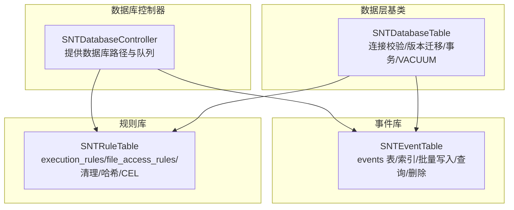
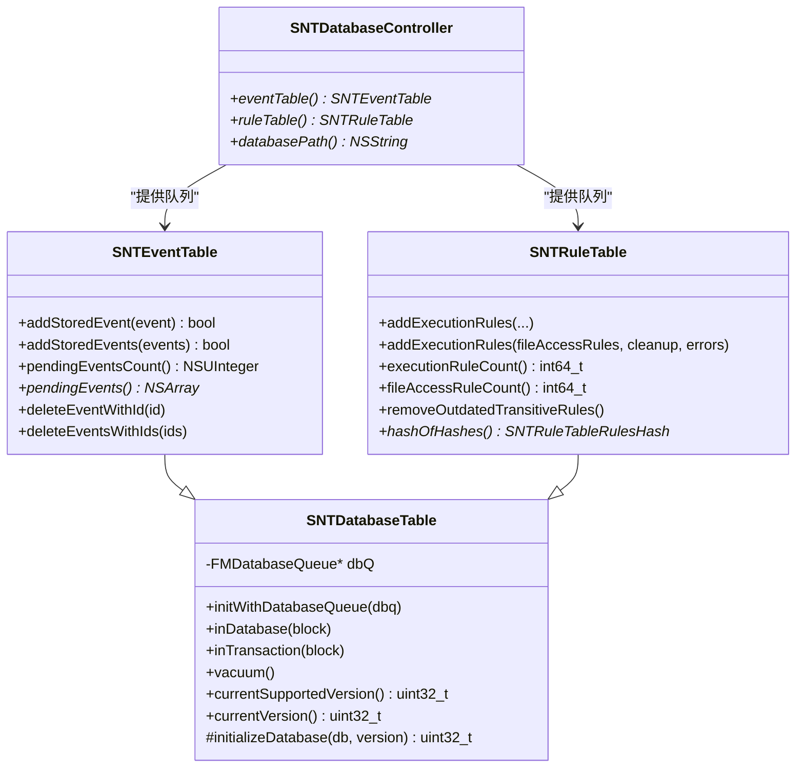
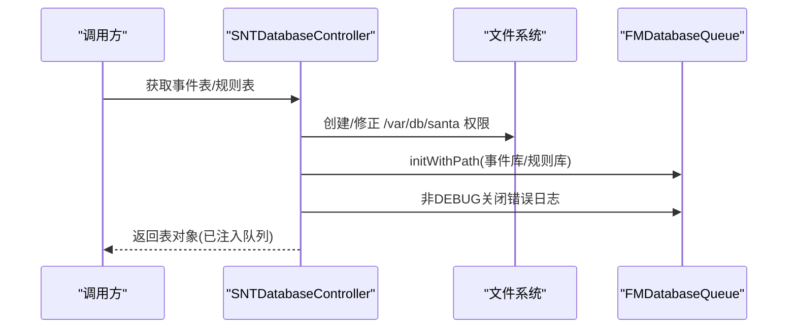
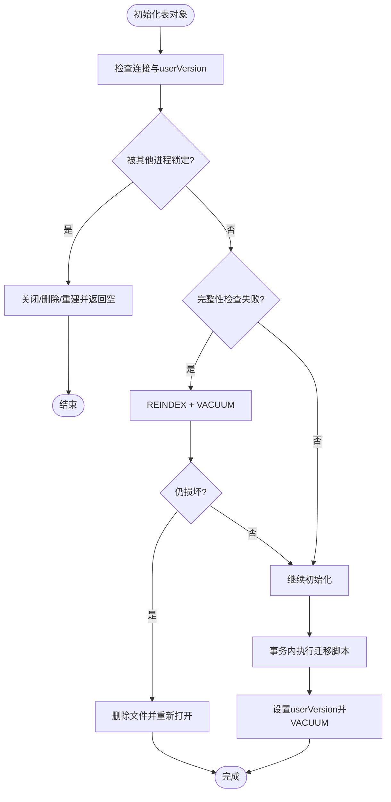
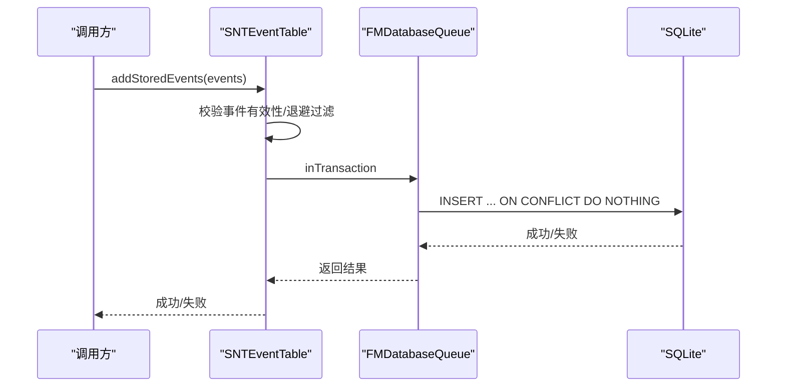
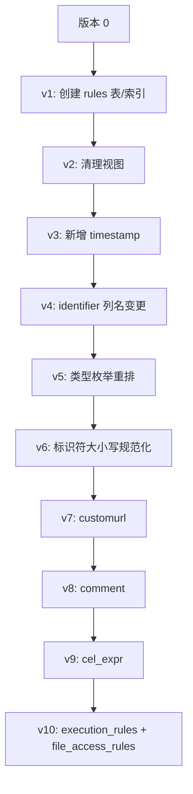
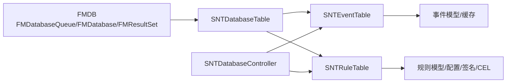

# 数据库架构

<cite>
**本文引用的文件**
- [SNTDatabaseController.h](file://Source/santad/SNTDatabaseController.h)
- [SNTDatabaseController.mm](file://Source/santad/SNTDatabaseController.mm)
- [SNTDatabaseTable.h](file://Source/santad/DataLayer/SNTDatabaseTable.h)
- [SNTDatabaseTable.mm](file://Source/santad/DataLayer/SNTDatabaseTable.mm)
- [SNTEventTable.h](file://Source/santad/DataLayer/SNTEventTable.h)
- [SNTEventTable.mm](file://Source/santad/DataLayer/SNTEventTable.mm)
- [SNTRuleTable.h](file://Source/santad/DataLayer/SNTRuleTable.h)
- [SNTRuleTable.mm](file://Source/santad/DataLayer/SNTRuleTable.mm)
</cite>

## 目录
1. [简介](#简介)
2. [项目结构](#项目结构)
3. [核心组件](#核心组件)
4. [架构总览](#架构总览)
5. [组件详解](#组件详解)
6. [依赖关系分析](#依赖关系分析)
7. [性能与优化](#性能与优化)
8. [故障排查指南](#故障排查指南)
9. [结论](#结论)

## 简介
本文件系统化梳理 Santa 的数据库架构，重点覆盖以下方面：
- 整体架构：以 SQLite 为核心，通过 FMDB 的数据库队列（FMDatabaseQueue）提供线程安全访问；事件与规则分别存储在独立数据库中，便于职责分离与维护。
- FMDB 使用方式：统一通过 SNTDatabaseController 提供数据库路径与队列实例，并在初始化时设置权限与日志策略；各数据层表对象继承自 SNTDatabaseTable，封装了连接校验、版本迁移、事务与 VACUUM 等通用能力。
- 连接管理与并发：采用 FMDatabaseQueue 将数据库操作串行化到单一线程，避免锁竞争；同时在表级初始化阶段进行完整性检查与修复，提升鲁棒性。
- 版本管理与迁移：每个表定义当前支持版本号，并在 initializeDatabase:fromVersion: 中按版本顺序执行迁移脚本；迁移完成后设置 userVersion 并执行 VACUUM。
- 锁机制与并发控制：规则库显式启用 EXCLUSIVE 模式；事件库通过队列串行化避免并发写入冲突；对锁等待与损坏数据库进行自动恢复。
- 性能优化：索引设计（唯一索引去重）、UNIQUE 约束减少重复写入、批量插入、按需清理过期规则、VACUUM 清理碎片。
- 健康检查与异常处理：启动时进行连接有效性、userVersion 超前检测、PRAGMA integrity_check 完整性校验；损坏时尝试 REINDEX + VACUUM，仍失败则删除重建。

## 项目结构
数据库相关代码集中在 Source/santad/DataLayer 与 SNTDatabaseController，采用“控制器 + 表对象”的分层设计：
- SNTDatabaseController：负责数据库目录创建、数据库路径、事件库与规则库的队列初始化与权限设置。
- SNTDatabaseTable：抽象基类，提供连接校验、版本迁移、事务包装、VACUUM 等通用逻辑。
- SNTEventTable：事件库，包含事件表与索引，支持批量写入、计数、查询与删除。
- SNTRuleTable：规则库，包含执行规则与文件访问规则两部分，支持规则增删改查、哈希计算、过期规则清理、决策缓存刷新判断等。

**图表来源**
- [SNTDatabaseController.mm](file://Source/santad/SNTDatabaseController.mm#L34-L79)
- [SNTDatabaseTable.mm](file://Source/santad/DataLayer/SNTDatabaseTable.mm#L29-L69)
- [SNTEventTable.mm](file://Source/santad/DataLayer/SNTEventTable.mm#L42-L103)
- [SNTRuleTable.mm](file://Source/santad/DataLayer/SNTRuleTable.mm#L208-L334)

**章节来源**
- [SNTDatabaseController.h](file://Source/santad/SNTDatabaseController.h#L25-L40)
- [SNTDatabaseController.mm](file://Source/santad/SNTDatabaseController.mm#L26-L101)
- [SNTDatabaseTable.h](file://Source/santad/DataLayer/SNTDatabaseTable.h#L22-L59)
- [SNTDatabaseTable.mm](file://Source/santad/DataLayer/SNTDatabaseTable.mm#L27-L69)

## 核心组件
- SNTDatabaseController
  - 单例式提供事件表与规则表的数据库队列，确保跨线程安全与一致性。
  - 初始化时创建数据库目录并设置权限（属主 root/wheel、权限 0755），事件库与规则库文件设置为 0600。
  - 在非调试构建下关闭 FMDatabase 的错误日志输出，降低噪声。
- SNTDatabaseTable
  - 初始化阶段校验连接状态、userVersion 是否超前、是否损坏；若损坏则尝试 REINDEX + VACUUM，仍失败则删除重建并重新打开。
  - 统一封装 inDatabase/inTransaction/vacuum，子类只需关注业务 SQL。
  - updateTableSchema 在事务内执行迁移并设置 userVersion，随后执行 VACUUM。
- SNTEventTable
  - 当前支持版本 5；事件表包含 idx、uniqueid、eventdata 字段，uniqueid 唯一索引用于去重。
  - 批量写入使用 INSERT ... ON CONFLICT(uniqueid) DO NOTHING，避免重复事件入库。
  - 支持按需退避（unactionableEventCacheTimeSeconds）过滤重复事件，减少冗余写入。
- SNTRuleTable
  - 当前支持版本 10；规则库拆分为 execution_rules 与 file_access_rules 两张表。
  - 规则写入在事务中执行，支持按清理策略清空或保留特定类型规则。
  - 提供哈希计算（hashOfHashes）、过期规则清理（transitive rules）、CEL 表达式编译与校验、关键系统二进制白名单预热等高级功能。

**章节来源**
- [SNTDatabaseController.mm](file://Source/santad/SNTDatabaseController.mm#L34-L79)
- [SNTDatabaseTable.mm](file://Source/santad/DataLayer/SNTDatabaseTable.mm#L29-L69)
- [SNTEventTable.mm](file://Source/santad/DataLayer/SNTEventTable.mm#L29-L103)
- [SNTRuleTable.mm](file://Source/santad/DataLayer/SNTRuleTable.mm#L208-L334)

## 架构总览
整体采用“控制器-表对象-队列”的分层架构，所有数据库操作通过 FMDatabaseQueue 串行化，确保线程安全与一致性。

**图表来源**
- [SNTDatabaseController.h](file://Source/santad/SNTDatabaseController.h#L25-L40)
- [SNTDatabaseTable.h](file://Source/santad/DataLayer/SNTDatabaseTable.h#L22-L59)
- [SNTEventTable.h](file://Source/santad/DataLayer/SNTEventTable.h#L22-L72)
- [SNTRuleTable.h](file://Source/santad/DataLayer/SNTRuleTable.h#L33-L172)

## 组件详解

### SNTDatabaseController：数据库路径与队列管理
- 数据库目录：/var/db/santa，创建时设置属主 root/wheel、权限 0755；若已存在则更新属性。
- 事件库：events.db，权限 0600，属主 root/wheel；非调试构建关闭 FMDatabase 错误日志。
- 规则库：rules.db，权限 0600，属主 root/wheel；非调试构建关闭 FMDatabase 错误日志。
- 初始化策略：dispatch_once 确保只初始化一次；每个库一个 FMDatabaseQueue，避免跨库并发问题。

**图表来源**
- [SNTDatabaseController.mm](file://Source/santad/SNTDatabaseController.mm#L34-L79)
- [SNTDatabaseController.mm](file://Source/santad/SNTDatabaseController.mm#L83-L101)

**章节来源**
- [SNTDatabaseController.mm](file://Source/santad/SNTDatabaseController.mm#L26-L101)

### SNTDatabaseTable：连接校验、版本迁移与事务封装
- 连接校验：goodConnection 检测，若 SQLITE_LOCKED 则记录告警并关闭、删除、重建数据库；若 userVersion 超前则删除重建。
- 损坏检测：PRAGMA integrity_check，若损坏先尝试 REINDEX + VACUUM，仍失败则删除重建并重新打开。
- 迁移流程：在事务中执行 initializeDatabase:fromVersion:，返回新版本号并与 currentSupportedVersion 对比断言；成功后设置 userVersion 并执行 VACUUM。
- 事务封装：inDatabase/inTransaction 统一调度，子类无需关心串行化细节。

**图表来源**
- [SNTDatabaseTable.mm](file://Source/santad/DataLayer/SNTDatabaseTable.mm#L29-L69)
- [SNTDatabaseTable.mm](file://Source/santad/DataLayer/SNTDatabaseTable.mm#L91-L105)
- [SNTDatabaseTable.mm](file://Source/santad/DataLayer/SNTDatabaseTable.mm#L118-L134)

**章节来源**
- [SNTDatabaseTable.h](file://Source/santad/DataLayer/SNTDatabaseTable.h#L22-L59)
- [SNTDatabaseTable.mm](file://Source/santad/DataLayer/SNTDatabaseTable.mm#L29-L151)

### SNTEventTable：事件库设计与写入策略
- 当前版本：5
- 表结构：idx（自增/已调整为主键）、uniqueid（唯一索引）、eventdata（序列化事件）
- 写入策略：
  - 批量写入使用 INSERT ... ON CONFLICT(uniqueid) DO NOTHING，避免重复事件入库。
  - 对不可处置事件（unactionable）使用退避缓存（默认 4 小时）过滤重复上报。
- 查询与删除：
  - COUNT(*) 快速统计待处理事件数量。
  - 全量查询时逐条反序列化，失败则删除对应记录，保持表整洁。

**图表来源**
- [SNTEventTable.mm](file://Source/santad/DataLayer/SNTEventTable.mm#L128-L160)
- [SNTEventTable.mm](file://Source/santad/DataLayer/SNTEventTable.mm#L162-L172)

**章节来源**
- [SNTEventTable.h](file://Source/santad/DataLayer/SNTEventTable.h#L22-L72)
- [SNTEventTable.mm](file://Source/santad/DataLayer/SNTEventTable.mm#L29-L103)
- [SNTEventTable.mm](file://Source/santad/DataLayer/SNTEventTable.mm#L128-L160)

### SNTRuleTable：规则库设计与迁移演进
- 当前版本：10
- 表结构演进：
  - v1：rules 表 + 唯一索引
  - v2：清理视图
  - v3：新增 timestamp 列
  - v4：列名 shasum -> identifier
  - v5：类型枚举值重排
  - v6：标识符大小写规范化
  - v7~v8：新增 customurl/comment
  - v9：新增 cel_expr
  - v10：表重命名为 execution_rules，新增 file_access_rules
- 关键能力：
  - 事务内批量写入，支持多种清理策略（全部、非传递、仅执行规则、仅文件访问规则、无清理、独立模式）。
  - 哈希计算（hashOfHashes）用于同步前后对比。
  - 过期传递规则清理（阈值与过期时间常量定义）。
  - 决策缓存刷新判断（addedRulesShouldFlushDecisionCache），基于规则类型与状态决定是否需要刷新内核缓存。

**图表来源**
- [SNTRuleTable.mm](file://Source/santad/DataLayer/SNTRuleTable.mm#L212-L334)

**章节来源**
- [SNTRuleTable.h](file://Source/santad/DataLayer/SNTRuleTable.h#L33-L172)
- [SNTRuleTable.mm](file://Source/santad/DataLayer/SNTRuleTable.mm#L208-L334)
- [SNTRuleTable.mm](file://Source/santad/DataLayer/SNTRuleTable.mm#L518-L705)
- [SNTRuleTable.mm](file://Source/santad/DataLayer/SNTRuleTable.mm#L783-L800)

## 依赖关系分析
- 外部依赖：FMDB（FMDatabaseQueue、FMDatabase、FMResultSet）。
- 内部依赖：
  - SNTDatabaseController 依赖 NSFileManager 设置目录权限，依赖 SNTEventTable/SNTRuleTable 的初始化。
  - SNTDatabaseTable 依赖 SQLite PRAGMA 与用户版本号，依赖日志模块进行告警。
  - SNTEventTable 依赖事件模型（SNTStoredEvent 及其子类）与缓存工具。
  - SNTRuleTable 依赖规则模型、配置器、签名检查器、CEL 编译器与关键系统二进制列表。

**图表来源**
- [SNTDatabaseController.mm](file://Source/santad/SNTDatabaseController.mm#L34-L79)
- [SNTDatabaseTable.mm](file://Source/santad/DataLayer/SNTDatabaseTable.mm#L29-L69)
- [SNTEventTable.mm](file://Source/santad/DataLayer/SNTEventTable.mm#L128-L160)
- [SNTRuleTable.mm](file://Source/santad/DataLayer/SNTRuleTable.mm#L518-L705)

**章节来源**
- [SNTDatabaseController.h](file://Source/santad/SNTDatabaseController.h#L17-L24)
- [SNTDatabaseTable.h](file://Source/santad/DataLayer/SNTDatabaseTable.h#L16-L21)
- [SNTRuleTable.mm](file://Source/santad/DataLayer/SNTRuleTable.mm#L1-L36)

## 性能与优化
- 并发与锁：
  - 使用 FMDatabaseQueue 将数据库操作串行化，避免锁竞争与死锁风险。
  - 规则库显式设置 PRAGMA locking_mode = EXCLUSIVE，减少锁等待概率。
- 索引与约束：
  - 事件库 uniqueid 唯一索引，配合 INSERT ... ON CONFLICT DO NOTHING，避免重复写入。
  - 规则库执行规则表 identifier+type 唯一索引，保证规则幂等性。
- 写入优化：
  - 事件库批量写入使用事务，减少提交开销。
  - 规则库批量写入使用事务，支持清理策略一次性完成。
- 存储清理：
  - 迁移后执行 VACUUM，释放回收站空间。
  - 定期清理过期传递规则，控制表规模增长。
- I/O 优化：
  - 事件库对不可处置事件采用退避缓存，减少频繁写入。
  - 文件访问规则采用序列化存储，查询时按需解包。

**章节来源**
- [SNTDatabaseTable.mm](file://Source/santad/DataLayer/SNTDatabaseTable.mm#L136-L151)
- [SNTEventTable.mm](file://Source/santad/DataLayer/SNTEventTable.mm#L128-L160)
- [SNTRuleTable.mm](file://Source/santad/DataLayer/SNTRuleTable.mm#L698-L705)
- [SNTRuleTable.mm](file://Source/santad/DataLayer/SNTRuleTable.mm#L783-L800)

## 故障排查指南
- 数据库被锁定
  - 现象：初始化时报“数据库被其他进程锁定”，随后关闭并删除重建。
  - 排查：确认是否有其他进程持有数据库文件；等待锁释放或重启服务。
  - 参考路径：[SNTDatabaseTable.mm](file://Source/santad/DataLayer/SNTDatabaseTable.mm#L36-L47)
- userVersion 超前
  - 现象：检测到数据库版本高于当前支持版本，触发删除重建。
  - 排查：确认是否使用更高版本的 Santa；如需降级，备份并迁移回旧版本。
  - 参考路径：[SNTDatabaseTable.mm](file://Source/santad/DataLayer/SNTDatabaseTable.mm#L47-L50)
- 数据库损坏
  - 现象：PRAGMA integrity_check 失败，尝试 REINDEX + VACUUM；仍失败则删除重建。
  - 排查：检查磁盘空间与权限；必要时手动备份并删除数据库文件后重启。
  - 参考路径：[SNTDatabaseTable.mm](file://Source/santad/DataLayer/SNTDatabaseTable.mm#L50-L60)
- 写入失败
  - 现象：规则或事件写入返回失败，错误信息来自 db lastErrorMessage。
  - 排查：检查事务中 SQL 语句、唯一索引冲突、磁盘空间与权限。
  - 参考路径：[SNTRuleTable.mm](file://Source/santad/DataLayer/SNTRuleTable.mm#L538-L557)
  - 参考路径：[SNTRuleTable.mm](file://Source/santad/DataLayer/SNTRuleTable.mm#L604-L616)
  - 参考路径：[SNTEventTable.mm](file://Source/santad/DataLayer/SNTEventTable.mm#L148-L158)

**章节来源**
- [SNTDatabaseTable.mm](file://Source/santad/DataLayer/SNTDatabaseTable.mm#L36-L60)
- [SNTRuleTable.mm](file://Source/santad/DataLayer/SNTRuleTable.mm#L538-L616)
- [SNTEventTable.mm](file://Source/santad/DataLayer/SNTEventTable.mm#L148-L158)

## 结论
Santa 的数据库架构以 FMDB 队列为基石，结合严格的版本迁移、完整性校验与自动修复机制，实现了高可靠、可维护的事件与规则存储体系。通过串行化访问、索引与约束设计、事务批量写入以及定期清理策略，兼顾了性能与稳定性。建议在生产环境中：
- 严格遵循版本迁移流程，避免 userVersion 超前导致的重建。
- 监控数据库文件权限与属主，确保 0600 与 root/wheel。
- 关注磁盘空间与 I/O 性能，定期执行 VACUUM 与清理过期规则。
- 在大规模规则导入时使用事务与清理策略，避免一次性写入造成锁争用。