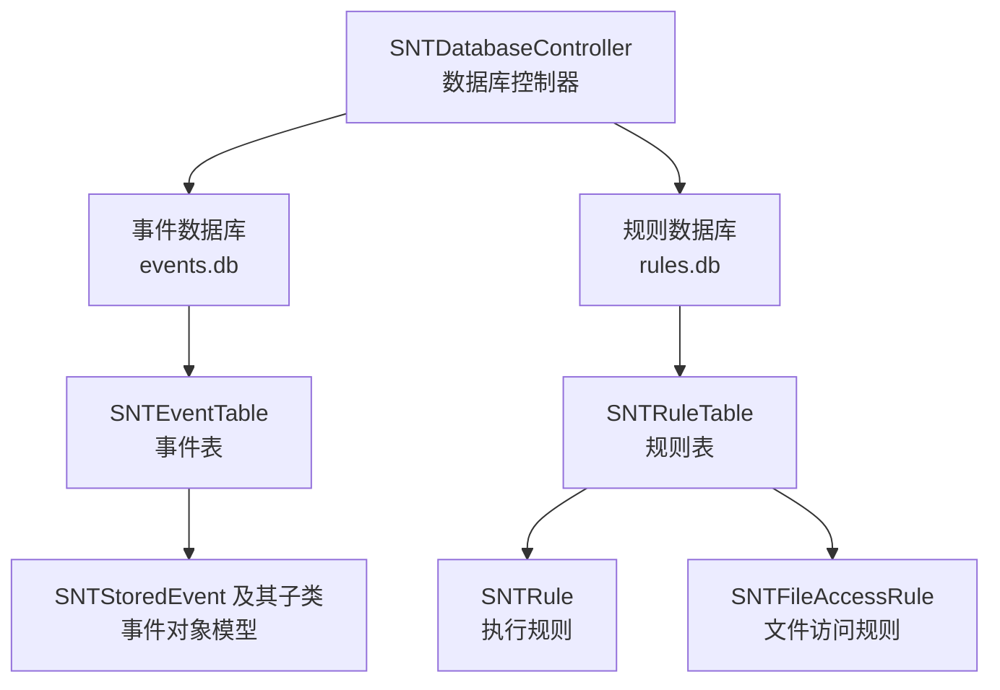
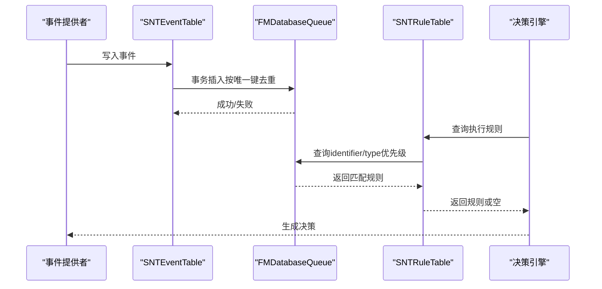
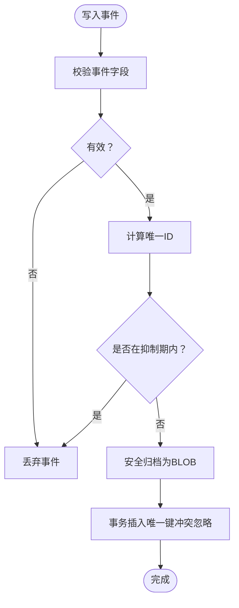
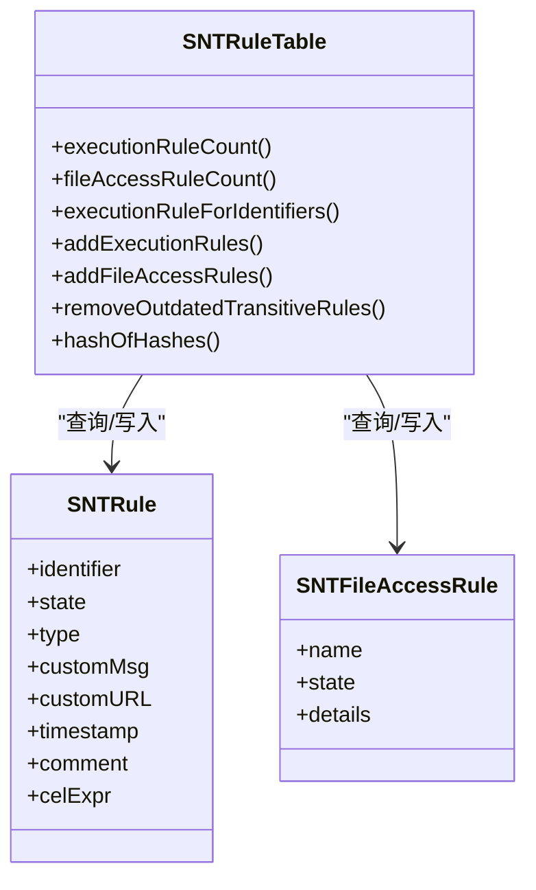
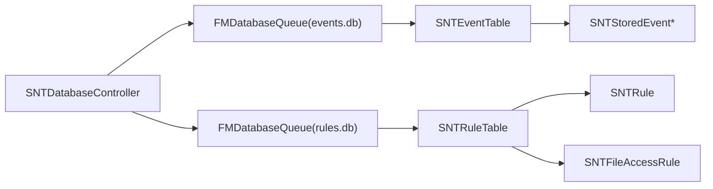

# 数据库设计

<cite>
**本文引用的文件**
- [SNTDatabaseController.mm](file://Source/santad/SNTDatabaseController.mm)
- [SNTDatabaseTable.mm](file://Source/santad/DataLayer/SNTDatabaseTable.mm)
- [SNTEventTable.mm](file://Source/santad/DataLayer/SNTEventTable.mm)
- [SNTRuleTable.mm](file://Source/santad/DataLayer/SNTRuleTable.mm)
- [migration.sh](file://Conf/Package/migration.sh)
- [SNTStoredEvent.h](file://Source/common/SNTStoredEvent.h)
- [SNTStoredExecutionEvent.h](file://Source/common/SNTStoredExecutionEvent.h)
- [SNTStoredFileAccessEvent.h](file://Source/common/SNTStoredFileAccessEvent.h)
- [SNTStoredTemporaryMonitorModeAuditEvent.h](file://Source/common/SNTStoredTemporaryMonitorModeAuditEvent.h)
</cite>

## 目录
1. [简介](#简介)
2. [项目结构](#项目结构)
3. [核心组件](#核心组件)
4. [架构总览](#架构总览)
5. [详细组件分析](#详细组件分析)
6. [依赖关系分析](#依赖关系分析)
7. [性能考量](#性能考量)
8. [故障排查指南](#故障排查指南)
9. [结论](#结论)
10. [附录](#附录)

## 简介
本文件面向Santa项目的数据库设计，系统化阐述其架构、表结构、索引策略、数据访问模式、查询优化、事务处理、数据生命周期管理、性能调优、备份恢复与迁移升级方案，并解释SQLite选择的原因、版本兼容性与扩展性考虑。文中所有技术细节均基于仓库中的源码实现进行归纳总结。

## 项目结构
Santa在守护进程模块中通过统一的数据库控制器管理两个独立数据库：
- 事件数据库：存放待上传或待处理的事件记录
- 规则数据库：存放执行规则与文件访问规则（FAA）

数据库控制器负责：
- 统一路径管理与权限设置
- 初始化事件表与规则表
- 提供线程安全的数据库队列访问
- 在启动时进行版本校验与修复

图表来源
- [SNTDatabaseController.mm](file://Source/santad/SNTDatabaseController.mm#L26-L79)
- [SNTEventTable.mm](file://Source/santad/DataLayer/SNTEventTable.mm#L42-L103)
- [SNTRuleTable.mm](file://Source/santad/DataLayer/SNTRuleTable.mm#L208-L334)

章节来源
- [SNTDatabaseController.mm](file://Source/santad/SNTDatabaseController.mm#L26-L101)

## 核心组件
- 数据库控制器：负责数据库目录创建、权限设置、数据库队列初始化与表实例化。
- 数据库基类：提供连接健康检查、损坏检测与修复、版本迁移框架、事务封装与VACUUM清理。
- 事件表：事件入库、去重、查询、删除；带“不可行动作”缓存抑制。
- 规则表：执行规则与文件访问规则的增删改查、哈希校验、过期清理、静态规则缓存、事务批量写入。

章节来源
- [SNTDatabaseTable.mm](file://Source/santad/DataLayer/SNTDatabaseTable.mm#L36-L150)
- [SNTEventTable.mm](file://Source/santad/DataLayer/SNTEventTable.mm#L105-L243)
- [SNTRuleTable.mm](file://Source/santad/DataLayer/SNTRuleTable.mm#L336-L937)

## 架构总览
下图展示数据库层的整体交互流程：事件采集后写入事件表，规则从同步服务加载并写入规则表，决策流程根据规则表查询结果生成决策。

图表来源
- [SNTEventTable.mm](file://Source/santad/DataLayer/SNTEventTable.mm#L128-L160)
- [SNTRuleTable.mm](file://Source/santad/DataLayer/SNTRuleTable.mm#L438-L516)

## 详细组件分析

### 数据库控制器与初始化
- 路径与权限：统一在系统目录下创建数据库目录并设置属主与权限；事件与规则数据库文件分别初始化。
- 连接日志：非调试构建下关闭底层错误日志输出以降低噪声。
- 安全属性：对数据库文件设置属主与权限，确保只有特权用户可访问。
- 单例化：事件表与规则表通过一次性初始化，避免重复创建。

章节来源
- [SNTDatabaseController.mm](file://Source/santad/SNTDatabaseController.mm#L26-L101)

### 数据库基类与版本迁移框架
- 健康检查：启动时检测锁状态与连接有效性，必要时重建数据库。
- 损坏检测与修复：使用完整性检查与REINDEX+VACUUM尝试修复；若仍损坏则删除重建。
- 版本迁移：以事务方式执行多版本迁移脚本，最终设置userVersion并执行VACUUM。
- 事务封装：提供通用inTransaction与inDatabase块，保证并发安全与一致性。

章节来源
- [SNTDatabaseTable.mm](file://Source/santad/DataLayer/SNTDatabaseTable.mm#L36-L150)

### 事件表（事件数据库）
- 表结构演进：
  - 初始版本：包含自增主键与文件哈希列，建立普通索引。
  - 版本2：清空数据并移除AUTOINCREMENT。
  - 版本3：去除AUTOINCREMENT，保留唯一性。
  - 版本4：引入唯一索引，先清理重复再建唯一索引。
  - 版本5：列名从文件哈希改为更通用的唯一标识列，保持唯一索引。
- 去重策略：INSERT … ON CONFLICT(uniqueid) DO NOTHING，避免重复事件入库。
- 缓存抑制：对“不可行动作”事件使用短时缓存，减少重复入库与抖动。
- 序列化存储：事件对象以安全归档形式存入BLOB列，读取时反序列化并做类型校验。
- 查询与清理：支持统计、全量读取、按索引删除等操作。

图表来源
- [SNTEventTable.mm](file://Source/santad/DataLayer/SNTEventTable.mm#L107-L160)

章节来源
- [SNTEventTable.mm](file://Source/santad/DataLayer/SNTEventTable.mm#L42-L103)
- [SNTEventTable.mm](file://Source/santad/DataLayer/SNTEventTable.mm#L105-L243)
- [SNTStoredEvent.h](file://Source/common/SNTStoredEvent.h)
- [SNTStoredExecutionEvent.h](file://Source/common/SNTStoredExecutionEvent.h)
- [SNTStoredFileAccessEvent.h](file://Source/common/SNTStoredFileAccessEvent.h)
- [SNTStoredTemporaryMonitorModeAuditEvent.h](file://Source/common/SNTStoredTemporaryMonitorModeAuditEvent.h)

### 规则表（规则数据库）
- 执行规则表：
  - 字段：标识符、状态、类型、自定义消息、自定义链接、时间戳、注释、CEL表达式。
  - 索引：identifier+type的唯一索引，保证同一标识符在同一类型下的唯一性。
  - 查询顺序：优先匹配CDHash → 二进制 → 签名ID → 证书 → 团队ID，以保证精确度优先。
  - 静态规则缓存：将配置中的静态规则预热到内存字典，加速常见命中。
  - 批量写入：事务内批量插入/替换与删除，支持多种清理策略（全部、仅非传递、仅执行规则、仅文件访问规则、无清理、独立模式）。
  - 决策缓存刷新：当新增规则可能影响已有决策时触发缓存刷新，确保一致性。
- 文件访问规则表（FAA）：
  - 字段：名称为主键，规则数据为BLOB。
  - 支持增删改查，提供哈希校验用于变更检测。
- 过期清理：
  - 传递型规则超过阈值与时间窗口后定期清理，降低数据库膨胀。
- CEL表达式支持：
  - 支持CEL与CELv2表达式编译与校验，规则状态为CEL/CELv2时需表达式有效。

图表来源
- [SNTRuleTable.mm](file://Source/santad/DataLayer/SNTRuleTable.mm#L336-L937)

章节来源
- [SNTRuleTable.mm](file://Source/santad/DataLayer/SNTRuleTable.mm#L208-L334)
- [SNTRuleTable.mm](file://Source/santad/DataLayer/SNTRuleTable.mm#L336-L937)

## 依赖关系分析
- 控制器依赖：事件表与规则表依赖FMDB的数据库队列进行并发安全访问。
- 对象模型：事件表依赖事件对象模型（执行、文件访问、临时监控审计等），规则表依赖规则与文件访问规则对象。
- 外部接口：规则表在启动时需要访问系统签名信息与默认静音路径集合，以维护关键系统二进制白名单。

图表来源
- [SNTDatabaseController.mm](file://Source/santad/SNTDatabaseController.mm#L26-L79)
- [SNTEventTable.mm](file://Source/santad/DataLayer/SNTEventTable.mm#L105-L243)
- [SNTRuleTable.mm](file://Source/santad/DataLayer/SNTRuleTable.mm#L336-L937)

章节来源
- [SNTDatabaseController.mm](file://Source/santad/SNTDatabaseController.mm#L26-L101)

## 性能考量
- 并发与事务：
  - 使用FMDatabaseQueue提供串行化访问，避免锁竞争；所有写操作置于事务中，提升吞吐并保证原子性。
- 索引与查询：
  - 事件表：唯一索引uniqueid用于去重与快速查找；查询按唯一键与范围扫描结合，避免全表扫描。
  - 规则表：执行规则表对identifier+type建立唯一索引，查询采用多条件OR组合并在内存中按优先级匹配，减少排序开销。
- 缓存与抑制：
  - 事件表对不可行动作事件使用短时缓存，降低重复入库与抖动。
  - 规则表对静态规则进行内存缓存，显著减少频繁查询的磁盘IO。
- 清理与碎片整理：
  - 版本升级后执行VACUUM，减少碎片与文件膨胀。
  - 传递型规则定期清理，控制数据库规模增长。
- I/O与序列化：
  - 事件与FAA规则均以BLOB形式存储，减少复杂SQL拼接带来的解析成本；读取时进行类型白名单反序列化，兼顾安全性与性能。

章节来源
- [SNTDatabaseTable.mm](file://Source/santad/DataLayer/SNTDatabaseTable.mm#L116-L150)
- [SNTEventTable.mm](file://Source/santad/DataLayer/SNTEventTable.mm#L128-L160)
- [SNTRuleTable.mm](file://Source/santad/DataLayer/SNTRuleTable.mm#L438-L516)
- [SNTRuleTable.mm](file://Source/santad/DataLayer/SNTRuleTable.mm#L771-L804)

## 故障排查指南
- 数据库被锁定：
  - 当检测到锁状态时，记录警告并关闭连接，随后删除重建数据库，确保可用性。
- 损坏检测与修复：
  - 使用完整性检查判断损坏；尝试REINDEX+VACUUM修复；若仍失败则删除重建。
- 启动前服务状态：
  - 迁移脚本在卸载旧版服务后再安装新版本，避免数据库被占用导致初始化失败。
- 错误日志：
  - 非调试构建下关闭底层错误日志输出，建议在问题定位时临时开启以便收集诊断信息。

章节来源
- [SNTDatabaseTable.mm](file://Source/santad/DataLayer/SNTDatabaseTable.mm#L36-L60)
- [SNTDatabaseTable.mm](file://Source/santad/DataLayer/SNTDatabaseTable.mm#L91-L95)
- [migration.sh](file://Conf/Package/migration.sh#L1-L41)

## 结论
Santa的数据库设计围绕“事件与规则分离”的双库架构展开：事件库专注高吞吐写入与去重，规则库强调精确匹配与高效查询。通过严格的版本迁移框架、事务化写入、索引与缓存策略以及定期清理机制，系统在保证数据一致性的同时实现了良好的性能与可维护性。SQLite作为嵌入式数据库满足了端侧部署的低延迟与高可靠性需求。

## 附录

### 表结构与字段定义（事件表）
- 表名：events
- 字段：
  - idx：整数主键
  - uniqueid：文本，唯一索引
  - eventdata：二进制，存储事件对象
- 约束与索引：
  - 唯一索引：uniqueid
- 典型用途：
  - 存放待上传事件，按唯一ID去重
  - 快速统计与批量读取

章节来源
- [SNTEventTable.mm](file://Source/santad/DataLayer/SNTEventTable.mm#L42-L103)

### 表结构与字段定义（规则表）
- 执行规则表：execution_rules
  - 字段：identifier、state、type、custommsg、customurl、timestamp、comment、cel_expr
  - 索引：identifier+type唯一索引
- 文件访问规则表：file_access_rules
  - 字段：name（主键）、rule_data（BLOB）
- 典型用途：
  - 执行决策依据
  - 文件访问控制策略

章节来源
- [SNTRuleTable.mm](file://Source/santad/DataLayer/SNTRuleTable.mm#L212-L334)
- [SNTRuleTable.mm](file://Source/santad/DataLayer/SNTRuleTable.mm#L336-L424)

### 数据生命周期管理
- 事件：
  - 写入即去重，未消费事件可通过查询与删除接口管理。
  - 不可行动作事件具备短期抑制，避免抖动。
- 规则：
  - 传递型规则在达到阈值与时间窗口后定期清理。
  - 批量导入时支持多种清理策略，保障规则集整洁。

章节来源
- [SNTEventTable.mm](file://Source/santad/DataLayer/SNTEventTable.mm#L128-L160)
- [SNTRuleTable.mm](file://Source/santad/DataLayer/SNTRuleTable.mm#L783-L804)

### 备份、恢复与迁移升级
- 备份与恢复：
  - 建议在系统层面进行卷级快照或文件级备份；数据库文件位于统一目录，便于整体打包。
- 迁移升级：
  - 通过版本迁移框架逐版本升级，升级后执行VACUUM。
  - 迁移脚本负责卸载旧版服务与应用，再安装新版并加载系统扩展。

章节来源
- [SNTDatabaseTable.mm](file://Source/santad/DataLayer/SNTDatabaseTable.mm#L116-L150)
- [migration.sh](file://Conf/Package/migration.sh#L1-L41)

### 并发控制与数据完整性
- 并发控制：
  - 使用FMDatabaseQueue串行化访问，事务化写入保证原子性。
- 数据完整性：
  - 唯一索引防止重复事件入库；规则表唯一索引保证同一标识符同一类型的唯一性。
  - 完整性检查与修复流程保障数据库健康。

章节来源
- [SNTEventTable.mm](file://Source/santad/DataLayer/SNTEventTable.mm#L128-L160)
- [SNTRuleTable.mm](file://Source/santad/DataLayer/SNTRuleTable.mm#L295-L307)
- [SNTDatabaseTable.mm](file://Source/santad/DataLayer/SNTDatabaseTable.mm#L76-L95)

### SQLite选择原因与扩展性
- 选择原因：
  - 嵌入式、零配置、跨平台、成熟稳定、与FMDB生态契合。
- 版本兼容性：
  - 通过userVersion与迁移脚本管理版本演进，确保向后兼容。
- 扩展性考虑：
  - 双库分离降低耦合；索引与缓存策略适配高并发写入场景；定期清理与VACUUM维持长期稳定性。

章节来源
- [SNTDatabaseController.mm](file://Source/santad/SNTDatabaseController.mm#L26-L79)
- [SNTDatabaseTable.mm](file://Source/santad/DataLayer/SNTDatabaseTable.mm#L116-L150)