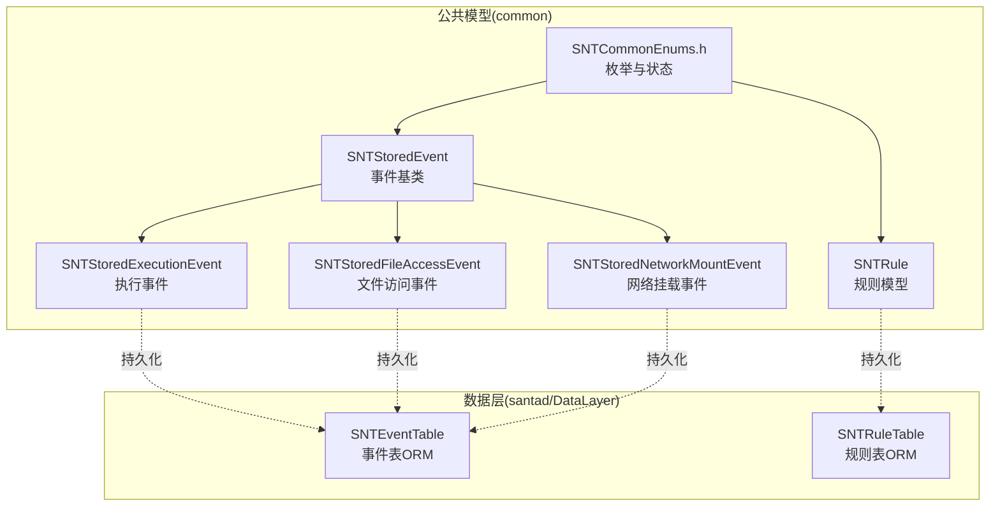
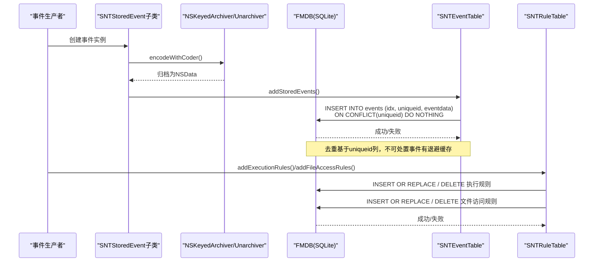
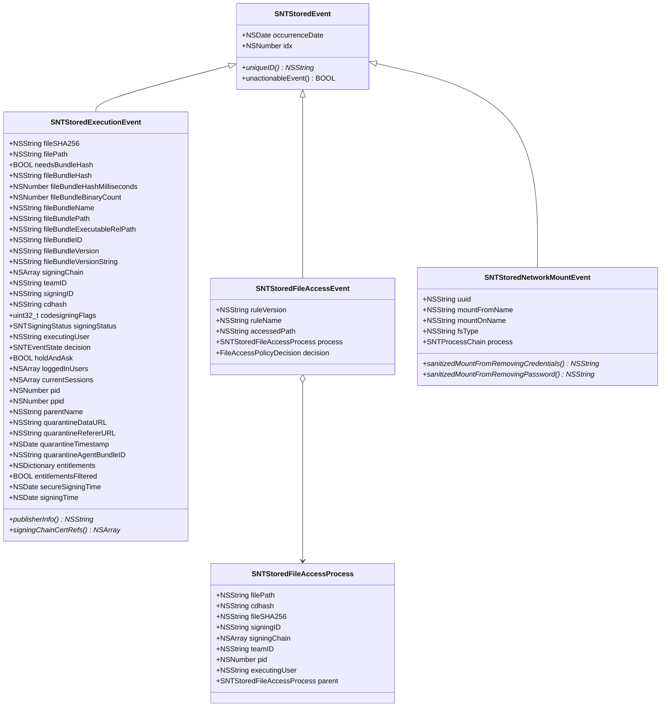
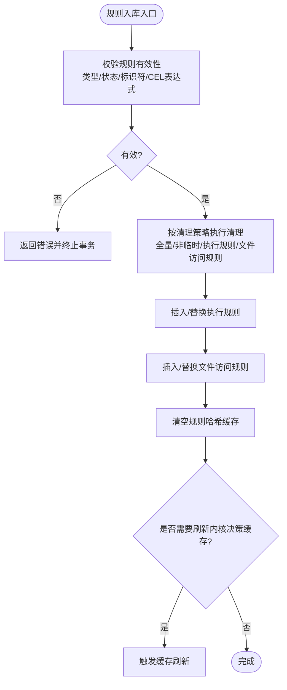
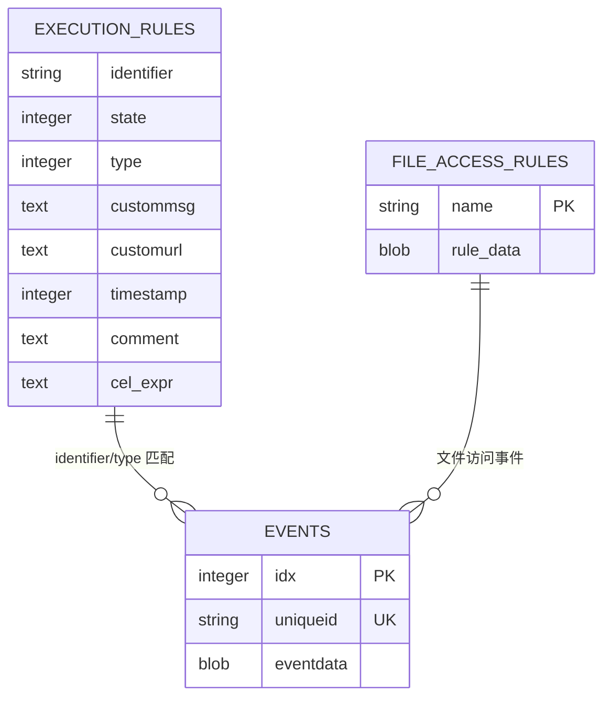
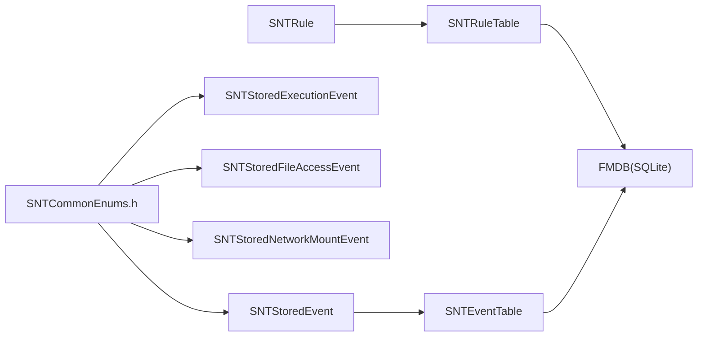

# 数据模型

<cite>
**本文引用的文件**
- [SNTStoredEvent.h](file://Source/common/SNTStoredEvent.h)
- [SNTStoredEvent.mm](file://Source/common/SNTStoredEvent.mm)
- [SNTRule.h](file://Source/common/SNTRule.h)
- [SNTRule.mm](file://Source/common/SNTRule.mm)
- [SNTStoredExecutionEvent.h](file://Source/common/SNTStoredExecutionEvent.h)
- [SNTStoredExecutionEvent.mm](file://Source/common/SNTStoredExecutionEvent.mm)
- [SNTStoredFileAccessEvent.h](file://Source/common/SNTStoredFileAccessEvent.h)
- [SNTStoredFileAccessEvent.mm](file://Source/common/SNTStoredFileAccessEvent.mm)
- [SNTStoredNetworkMountEvent.h](file://Source/common/SNTStoredNetworkMountEvent.h)
- [SNTStoredNetworkMountEvent.mm](file://Source/common/SNTStoredNetworkMountEvent.mm)
- [SNTCommonEnums.h](file://Source/common/SNTCommonEnums.h)
- [SNTEventTable.h](file://Source/santad/DataLayer/SNTEventTable.h)
- [SNTEventTable.mm](file://Source/santad/DataLayer/SNTEventTable.mm)
- [SNTRuleTable.h](file://Source/santad/DataLayer/SNTRuleTable.h)
- [SNTRuleTable.mm](file://Source/santad/DataLayer/SNTRuleTable.mm)
</cite>

## 目录
1. [引言](#引言)
2. [项目结构](#项目结构)
3. [核心组件](#核心组件)
4. [架构总览](#架构总览)
5. [详细组件分析](#详细组件分析)
6. [依赖分析](#依赖分析)
7. [性能考虑](#性能考虑)
8. [故障排查指南](#故障排查指南)
9. [结论](#结论)
10. [附录](#附录)

## 引言
本文件面向Santa的数据模型，系统性梳理事件模型（SNTStoredEvent系列）与规则模型（SNTRule）的设计理念、实现细节与运行机制。重点覆盖：
- 数据实体的属性定义、关系映射与继承体系
- 序列化/反序列化与持久化流程
- 数据校验规则、业务约束与完整性检查
- 版本管理、向后兼容与迁移策略
- 缓存机制、懒加载与性能优化
- 数据模型与数据库表的映射关系及ORM实现

## 项目结构
Santa的数据模型主要分布在“common”层（领域对象与枚举）与“santad/DataLayer”层（数据库表与ORM）。事件模型以SNTStoredEvent为基类，派生出执行事件、文件访问事件与网络挂载事件；规则模型以SNTRule为核心，配合SNTRuleTable进行持久化与查询。

图示来源
- [SNTStoredEvent.h](file://Source/common/SNTStoredEvent.h#L1-L36)
- [SNTStoredExecutionEvent.h](file://Source/common/SNTStoredExecutionEvent.h#L1-L142)
- [SNTStoredFileAccessEvent.h](file://Source/common/SNTStoredFileAccessEvent.h#L1-L74)
- [SNTStoredNetworkMountEvent.h](file://Source/common/SNTStoredNetworkMountEvent.h#L1-L42)
- [SNTRule.h](file://Source/common/SNTRule.h#L1-L129)
- [SNTCommonEnums.h](file://Source/common/SNTCommonEnums.h#L50-L125)
- [SNTEventTable.h](file://Source/santad/DataLayer/SNTEventTable.h#L1-L72)
- [SNTRuleTable.h](file://Source/santad/DataLayer/SNTRuleTable.h#L1-L172)

章节来源
- [SNTStoredEvent.h](file://Source/common/SNTStoredEvent.h#L1-L36)
- [SNTStoredEvent.mm](file://Source/common/SNTStoredEvent.mm#L1-L74)
- [SNTRule.h](file://Source/common/SNTRule.h#L1-L129)
- [SNTRule.mm](file://Source/common/SNTRule.mm#L1-L120)
- [SNTStoredExecutionEvent.h](file://Source/common/SNTStoredExecutionEvent.h#L1-L142)
- [SNTStoredExecutionEvent.mm](file://Source/common/SNTStoredExecutionEvent.mm#L1-L181)
- [SNTStoredFileAccessEvent.h](file://Source/common/SNTStoredFileAccessEvent.h#L1-L74)
- [SNTStoredFileAccessEvent.mm](file://Source/common/SNTStoredFileAccessEvent.mm#L1-L111)
- [SNTStoredNetworkMountEvent.h](file://Source/common/SNTStoredNetworkMountEvent.h#L1-L42)
- [SNTStoredNetworkMountEvent.mm](file://Source/common/SNTStoredNetworkMountEvent.mm#L1-L108)
- [SNTCommonEnums.h](file://Source/common/SNTCommonEnums.h#L50-L125)
- [SNTEventTable.h](file://Source/santad/DataLayer/SNTEventTable.h#L1-L72)
- [SNTEventTable.mm](file://Source/santad/DataLayer/SNTEventTable.mm#L1-L244)
- [SNTRuleTable.h](file://Source/santad/DataLayer/SNTRuleTable.h#L1-L172)
- [SNTRuleTable.mm](file://Source/santad/DataLayer/SNTRuleTable.mm#L1-L200)

## 核心组件
- 事件基类SNTStoredEvent：提供统一的序列化接口、索引与唯一标识约定，要求子类实现唯一ID与可处置性判断。
- 执行事件SNTStoredExecutionEvent：承载二进制执行上下文（签名链、团队ID、签名ID、cdhash、权限、会话等），并定义决策与可处置性语义。
- 文件访问事件SNTStoredFileAccessEvent：记录被监控路径、违规规则名/版本与触发进程信息，并定义可处置性。
- 网络挂载事件SNTStoredNetworkMountEvent：记录挂载源、目标与文件系统类型，提供凭据清洗方法。
- 规则模型SNTRule：统一规则标识符、状态、类型、自定义消息/链接、时间戳、注释、CEL表达式与静态标记；提供多种初始化器与序列化支持。
- 事件表ORM SNTEventTable：负责事件入库、去重、查询、删除与版本迁移；内置对不可处置事件的缓存退避。
- 规则表ORM SNTRuleTable：负责执行规则与文件访问规则的入库、清理、查询、哈希计算、CEL表达式编译与系统关键二进制白名单预热。

章节来源
- [SNTStoredEvent.h](file://Source/common/SNTStoredEvent.h#L18-L36)
- [SNTStoredEvent.mm](file://Source/common/SNTStoredEvent.mm#L20-L74)
- [SNTStoredExecutionEvent.h](file://Source/common/SNTStoredExecutionEvent.h#L23-L142)
- [SNTStoredExecutionEvent.mm](file://Source/common/SNTStoredExecutionEvent.mm#L143-L181)
- [SNTStoredFileAccessEvent.h](file://Source/common/SNTStoredFileAccessEvent.h#L23-L74)
- [SNTStoredFileAccessEvent.mm](file://Source/common/SNTStoredFileAccessEvent.mm#L53-L111)
- [SNTStoredNetworkMountEvent.h](file://Source/common/SNTStoredNetworkMountEvent.h#L20-L42)
- [SNTStoredNetworkMountEvent.mm](file://Source/common/SNTStoredNetworkMountEvent.mm#L55-L108)
- [SNTRule.h](file://Source/common/SNTRule.h#L22-L129)
- [SNTRule.mm](file://Source/common/SNTRule.mm#L375-L558)
- [SNTEventTable.h](file://Source/santad/DataLayer/SNTEventTable.h#L25-L72)
- [SNTEventTable.mm](file://Source/santad/DataLayer/SNTEventTable.mm#L105-L244)
- [SNTRuleTable.h](file://Source/santad/DataLayer/SNTRuleTable.h#L33-L172)
- [SNTRuleTable.mm](file://Source/santad/DataLayer/SNTRuleTable.mm#L208-L334)

## 架构总览
事件与规则通过NSSecureCoding在内存与磁盘之间传递，事件表ORM使用FMDB进行SQLite持久化，规则表ORM同时维护执行规则与文件访问规则两张表，并在版本迁移中引入CEL表达式与索引优化。

图示来源
- [SNTStoredEvent.mm](file://Source/common/SNTStoredEvent.mm#L26-L30)
- [SNTEventTable.mm](file://Source/santad/DataLayer/SNTEventTable.mm#L139-L159)
- [SNTRuleTable.mm](file://Source/santad/DataLayer/SNTRuleTable.mm#L562-L620)

## 详细组件分析

### 事件模型：SNTStoredEvent与派生类
- 继承与职责
  - SNTStoredEvent：提供occurrenceDate、idx与NSSecureCoding支持；要求子类实现uniqueID与unactionableEvent。
  - SNTStoredExecutionEvent：扩展文件哈希、路径、签名链、团队/签名ID、cdhash、代码签名标志、决策、用户与会话、隔离区数据等；uniqueID采用fileSHA256；unactionableEvent当决策允许时返回真。
  - SNTStoredFileAccessEvent：扩展规则版本/名称、被访问路径、触发进程及其父进程、决策；uniqueID由规则名/版本与进程哈希组合；unactionableEvent当仅审计允许时返回真。
  - SNTStoredNetworkMountEvent：扩展挂载源/目标/类型与进程链；uniqueID采用挂载源URL；unactionableEvent返回真以纳入退避缓存。
- 序列化与反序列化
  - 所有事件类均实现NSSecureCoding，使用宏进行编码/解码，确保跨版本兼容与安全归档。
- 唯一性与可处置性
  - uniqueID用于冲突消重与去噪；unactionableEvent用于退避缓存策略，避免高频重复事件上传。
- 关系映射
  - 执行事件与文件访问事件分别映射到事件表的同一张表，通过uniqueid区分不同事件类型；网络挂载事件独立使用相同表结构。

图示来源
- [SNTStoredEvent.h](file://Source/common/SNTStoredEvent.h#L18-L36)
- [SNTStoredExecutionEvent.h](file://Source/common/SNTStoredExecutionEvent.h#L23-L142)
- [SNTStoredFileAccessEvent.h](file://Source/common/SNTStoredFileAccessEvent.h#L23-L74)
- [SNTStoredNetworkMountEvent.h](file://Source/common/SNTStoredNetworkMountEvent.h#L20-L42)

章节来源
- [SNTStoredEvent.h](file://Source/common/SNTStoredEvent.h#L18-L36)
- [SNTStoredEvent.mm](file://Source/common/SNTStoredEvent.mm#L20-L74)
- [SNTStoredExecutionEvent.h](file://Source/common/SNTStoredExecutionEvent.h#L23-L142)
- [SNTStoredExecutionEvent.mm](file://Source/common/SNTStoredExecutionEvent.mm#L54-L181)
- [SNTStoredFileAccessEvent.h](file://Source/common/SNTStoredFileAccessEvent.h#L23-L74)
- [SNTStoredFileAccessEvent.mm](file://Source/common/SNTStoredFileAccessEvent.mm#L22-L111)
- [SNTStoredNetworkMountEvent.h](file://Source/common/SNTStoredNetworkMountEvent.h#L20-L42)
- [SNTStoredNetworkMountEvent.mm](file://Source/common/SNTStoredNetworkMountEvent.mm#L21-L108)

### 规则模型：SNTRule与SNTRuleTable
- 规则标识与规范化
  - identifier根据规则类型（二进制、证书、团队ID、签名ID、cdhash）进行长度与字符集校验与大小写规范化；签名ID包含“团队ID:签名ID”组合，团队ID强制大写（平台例外）。
  - 支持从字典初始化，自动归一化键名大小写与值格式。
- 规则状态与CEL表达式
  - state涵盖允许/阻止/静默阻止/移除/编译器/临时允许/本地二进制/本地签名ID/CEL/CELv2；当state为CEL/CELv2时需提供有效表达式，否则拒绝入库。
- 持久化与查询
  - 执行规则与文件访问规则分别存储于execution_rules与file_access_rules表；按identifier+type建立唯一索引；提供批量插入/替换与删除。
  - 查询时优先静态规则，再按类型顺序精确匹配（cdhash/binaries/signingID/certificate/teamID），并处理系统关键证书特例。
- 版本迁移与兼容
  - 多次迁移将shasum重命名为identifier，添加customurl/comment/cel_expr等列，执行规则表重命名为execution_rules并重建唯一索引，新增file_access_rules表。
- 性能与缓存
  - 预热critical system binaries缓存，避免关键系统二进制被误阻断；对文件访问规则变更提供回调；对大量阻断规则或覆盖编译器规则场景触发内核决策缓存刷新。

图示来源
- [SNTRule.mm](file://Source/common/SNTRule.mm#L409-L475)
- [SNTRuleTable.mm](file://Source/santad/DataLayer/SNTRuleTable.mm#L562-L705)

章节来源
- [SNTRule.h](file://Source/common/SNTRule.h#L22-L129)
- [SNTRule.mm](file://Source/common/SNTRule.mm#L409-L558)
- [SNTRuleTable.h](file://Source/santad/DataLayer/SNTRuleTable.h#L33-L172)
- [SNTRuleTable.mm](file://Source/santad/DataLayer/SNTRuleTable.mm#L212-L334)

### 数据库表映射与ORM实现
- 事件表events
  - 字段：idx（主键）、uniqueid（唯一索引，替代旧版filesha256）、eventdata（BLOB，事件归档数据）
  - 入库：按uniqueid去重，避免重复事件上传；对不可处置事件使用退避缓存（4小时窗口）减少噪声。
  - 查询：支持计数与全量读取，读取时限定允许类集合并校验有效性。
  - 删除：按idx单条或批量删除。
- 规则表execution_rules与file_access_rules
  - execution_rules：identifier、state、type、custommsg、customurl、timestamp、comment、cel_expr；identifier+type唯一索引。
  - file_access_rules：name（主键）、rule_data（BLOB，序列化后的规则字典）。
  - 版本迁移：历史多次ALTER/RENAME/ADD COLUMN，最终形成当前schema。
  - 规则查询：先查静态规则，再按类型顺序精确匹配；支持系统关键证书特例放行。

图示来源
- [SNTEventTable.mm](file://Source/santad/DataLayer/SNTEventTable.mm#L52-L103)
- [SNTRuleTable.mm](file://Source/santad/DataLayer/SNTRuleTable.mm#L212-L307)

章节来源
- [SNTEventTable.h](file://Source/santad/DataLayer/SNTEventTable.h#L25-L72)
- [SNTEventTable.mm](file://Source/santad/DataLayer/SNTEventTable.mm#L105-L244)
- [SNTRuleTable.h](file://Source/santad/DataLayer/SNTRuleTable.h#L33-L172)
- [SNTRuleTable.mm](file://Source/santad/DataLayer/SNTRuleTable.mm#L336-L437)

## 依赖分析
- 事件侧
  - SNTStoredEvent系列依赖SNTCommonEnums中的事件状态与规则类型枚举；执行事件依赖签名工具与证书辅助类；网络挂载事件依赖进程链。
- 规则侧
  - SNTRule依赖SNTCommonEnums与错误/同步常量；SNTRuleTable依赖CEL求值器、配置器、关键二进制信息与文件访问规则。
- ORM侧
  - 事件表与规则表均基于FMDB；事件表使用ON CONFLICT去重；规则表使用事务保证一致性。

图示来源
- [SNTCommonEnums.h](file://Source/common/SNTCommonEnums.h#L50-L125)
- [SNTStoredEvent.h](file://Source/common/SNTStoredEvent.h#L18-L36)
- [SNTStoredExecutionEvent.h](file://Source/common/SNTStoredExecutionEvent.h#L17-L23)
- [SNTStoredFileAccessEvent.h](file://Source/common/SNTStoredFileAccessEvent.h#L17-L23)
- [SNTStoredNetworkMountEvent.h](file://Source/common/SNTStoredNetworkMountEvent.h#L17-L20)
- [SNTRule.h](file://Source/common/SNTRule.h#L16-L22)
- [SNTRuleTable.h](file://Source/santad/DataLayer/SNTRuleTable.h#L16-L27)
- [SNTEventTable.h](file://Source/santad/DataLayer/SNTEventTable.h#L16-L25)

章节来源
- [SNTCommonEnums.h](file://Source/common/SNTCommonEnums.h#L50-L125)
- [SNTEventTable.mm](file://Source/santad/DataLayer/SNTEventTable.mm#L105-L244)
- [SNTRuleTable.mm](file://Source/santad/DataLayer/SNTRuleTable.mm#L336-L437)

## 性能考虑
- 事件入库
  - 使用uniqueid去重与事务批量插入，降低重复与锁竞争；对不可处置事件设置4小时退避缓存，显著降低上传压力。
- 规则查询
  - 静态规则优先命中，随后按类型顺序精确匹配，避免不必要的全表扫描；系统关键证书特例直接放行，减少数据库查询。
- 规则变更
  - 当新增阻断规则或覆盖编译器规则时，触发内核决策缓存刷新，确保新规则生效且不污染旧缓存。
- 存储演进
  - 多次迁移优化索引与列设计，提升查询与写入效率；文件访问规则采用BLOB存储字典，便于快速序列化/反序列化。

章节来源
- [SNTEventTable.mm](file://Source/santad/DataLayer/SNTEventTable.mm#L162-L172)
- [SNTRuleTable.mm](file://Source/santad/DataLayer/SNTRuleTable.mm#L707-L769)

## 故障排查指南
- 事件无法入库
  - 检查事件有效性：执行事件需满足idx、uniqueID、filePath、occurrenceDate、decision齐全；文件访问事件需满足ruleVersion/ruleName/accessedPath/process等字段齐全。
  - 查看退避缓存：若事件unactionableEvent为真且在4小时内，会被丢弃。
  - 参考路径：[SNTEventTable.isValidStoredEvent](file://Source/santad/DataLayer/SNTEventTable.mm#L111-L126)，[SNTEventTable.backoffForPrimaryHash](file://Source/santad/DataLayer/SNTEventTable.mm#L162-L172)
- 规则入库失败
  - 校验identifier合法性与类型匹配；当state为CEL/CELv2时必须提供有效表达式；检查清理策略是否导致删除。
  - 参考路径：[SNTRuleTable.addExecutionRules](file://Source/santad/DataLayer/SNTRuleTable.mm#L562-L620)，[SNTRuleTable.addFileAccessRules](file://Source/santad/DataLayer/SNTRuleTable.mm#L520-L560)
- 规则查询无结果
  - 确认静态规则缓存是否命中；检查identifier大小写与规范化（二进制/证书小写、团队ID大写、签名ID团队ID大写）。
  - 参考路径：[SNTRuleTable.executionRuleForIdentifiers](file://Source/santad/DataLayer/SNTRuleTable.mm#L438-L516)
- 数据库版本问题
  - 检查迁移日志与当前版本号；确认identifier列已规范化、唯一索引存在、新增列已添加。
  - 参考路径：[SNTEventTable.initializeDatabase](file://Source/santad/DataLayer/SNTEventTable.mm#L46-L103)，[SNTRuleTable.initializeDatabase](file://Source/santad/DataLayer/SNTRuleTable.mm#L212-L307)

章节来源
- [SNTEventTable.mm](file://Source/santad/DataLayer/SNTEventTable.mm#L111-L172)
- [SNTRuleTable.mm](file://Source/santad/DataLayer/SNTRuleTable.mm#L438-L516)
- [SNTRuleTable.mm](file://Source/santad/DataLayer/SNTRuleTable.mm#L520-L620)

## 结论
Santa的数据模型围绕“事件”与“规则”两条主线构建：事件模型通过统一的序列化与去重策略保障高效、稳定的数据采集；规则模型通过严格的标识符规范化、CEL表达式支持与多级查询优化实现灵活、可扩展的策略控制。数据库层通过版本迁移与索引优化持续提升性能与可靠性。整体设计兼顾安全性、可维护性与可扩展性。

## 附录
- 版本管理与迁移要点
  - 事件表：从filesha256迁移到uniqueid，增加唯一索引，支持ON CONFLICT去重。
  - 规则表：shasum→identifier，新增timestamp/customurl/comment/cel_expr列，execution_rules与file_access_rules分离。
- 向后兼容性
  - 通过NSSecureCoding与枚举值保留策略，确保历史数据可读；迁移脚本清理不兼容数据并重建索引。
- 运行时约束
  - 规则state与type组合约束；identifier长度与字符集约束；CEL表达式编译校验；文件访问规则名称唯一。

章节来源
- [SNTEventTable.mm](file://Source/santad/DataLayer/SNTEventTable.mm#L46-L103)
- [SNTRuleTable.mm](file://Source/santad/DataLayer/SNTRuleTable.mm#L212-L307)
- [SNTRule.mm](file://Source/common/SNTRule.mm#L409-L475)