# 维护策略

<cite>
**本文引用的文件**
- [SNTDatabaseTable.mm](file://Source/santad/DataLayer/SNTDatabaseTable.mm)
- [SNTDatabaseTable.h](file://Source/santad/DataLayer/SNTDatabaseTable.h)
- [SNTEventTable.mm](file://Source/santad/DataLayer/SNTEventTable.mm)
- [SNTEventTable.h](file://Source/santad/DataLayer/SNTEventTable.h)
- [SNTRuleTable.mm](file://Source/santad/DataLayer/SNTRuleTable.mm)
- [SNTRuleTable.h](file://Source/santad/DataLayer/SNTRuleTable.h)
- [SNTDaemonControlController.mm](file://Source/santad/SNTDaemonControlController.mm)
- [migration.sh](file://Conf/Package/migration.sh)
- [com.northpolesec.santa.migration.plist](file://Conf/com.northpolesec.santa.migration.plist)
- [ZstdOutputStream.h](file://Source/santad/Logs/EndpointSecurity/Writers/FSSpool/ZstdOutputStream.h)
- [ZstdOutputStream.mm](file://Source/santad/Logs/EndpointSecurity/Writers/FSSpool/ZstdOutputStream.mm)
- [SNTCommandPrintLog.mm](file://Source/santactl/Commands/SNTCommandPrintLog.mm)
- [SNTConfigurator.mm](file://Source/common/SNTConfigurator.mm)
- [SNTApplicationCoreMetrics.mm](file://Source/santad/SNTApplicationCoreMetrics.mm)
- [Metrics.mm](file://Source/santad/Metrics.mm)
- [SNTMetricSetTest.mm](file://Source/common/SNTMetricSetTest.mm)
- [ES_Client_Architecture_Decision.md](file://ES_Client_Architecture_Decision.md)
</cite>

## 目录
1. [引言](#引言)
2. [项目结构](#项目结构)
3. [核心组件](#核心组件)
4. [架构总览](#架构总览)
5. [详细组件分析](#详细组件分析)
6. [依赖关系分析](#依赖关系分析)
7. [性能考量](#性能考量)
8. [故障排查指南](#故障排查指南)
9. [结论](#结论)
10. [附录](#附录)

## 引言
本文件面向Santa数据库的运维与维护，围绕备份策略（全量/增量）、数据库压缩与VACUUM、空间回收、数据归档与历史清理、存储生命周期管理、监控与健康检查、故障恢复与高可用、升级迁移与版本兼容、以及运维自动化与批量维护任务进行系统化技术说明。文档基于仓库中的实际实现进行分析，并提供可操作的维护建议。

## 项目结构
Santa数据库维护涉及以下关键模块：
- 数据层基类与表：SNTDatabaseTable（基类）、SNTEventTable（事件表）、SNTRuleTable（规则表）
- 日志与写入：FSSpool压缩输出流（Zstd）
- 控制与查询：SNTDaemonControlController（规则哈希查询）
- 配置与指标：SNTConfigurator（配置项）、SNTApplicationCoreMetrics（运行模式与日志类型指标）、Metrics（事件计数与处理时长）
- 迁移与服务：migration脚本与LaunchDaemon配置

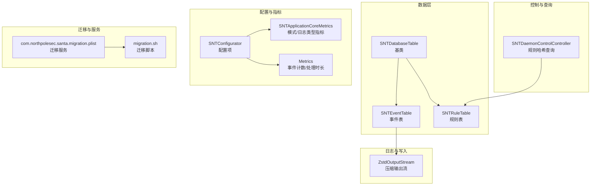

**图表来源**
- [SNTDatabaseTable.mm](file://Source/santad/DataLayer/SNTDatabaseTable.mm#L32-L150)
- [SNTEventTable.mm](file://Source/santad/DataLayer/SNTEventTable.mm#L1-L244)
- [SNTRuleTable.mm](file://Source/santad/DataLayer/SNTRuleTable.mm#L1-L200)
- [ZstdOutputStream.mm](file://Source/santad/Logs/EndpointSecurity/Writers/FSSpool/ZstdOutputStream.mm#L1-L151)
- [SNTDaemonControlController.mm](file://Source/santad/SNTDaemonControlController.mm#L254-L289)
- [SNTConfigurator.mm](file://Source/common/SNTConfigurator.mm#L573-L631)
- [SNTApplicationCoreMetrics.mm](file://Source/santad/SNTApplicationCoreMetrics.mm#L36-L58)
- [Metrics.mm](file://Source/santad/Metrics.mm#L216-L242)
- [migration.sh](file://Conf/Package/migration.sh#L1-L41)
- [com.northpolesec.santa.migration.plist](file://Conf/com.northpolesec.santa.migration.plist#L1-L21)

**章节来源**
- [SNTDatabaseTable.mm](file://Source/santad/DataLayer/SNTDatabaseTable.mm#L32-L150)
- [SNTEventTable.mm](file://Source/santad/DataLayer/SNTEventTable.mm#L1-L244)
- [SNTRuleTable.mm](file://Source/santad/DataLayer/SNTRuleTable.mm#L1-L200)
- [ZstdOutputStream.mm](file://Source/santad/Logs/EndpointSecurity/Writers/FSSpool/ZstdOutputStream.mm#L1-L151)
- [SNTDaemonControlController.mm](file://Source/santad/SNTDaemonControlController.mm#L254-L289)
- [SNTConfigurator.mm](file://Source/common/SNTConfigurator.mm#L573-L631)
- [SNTApplicationCoreMetrics.mm](file://Source/santad/SNTApplicationCoreMetrics.mm#L36-L58)
- [Metrics.mm](file://Source/santad/Metrics.mm#L216-L242)
- [migration.sh](file://Conf/Package/migration.sh#L1-L41)
- [com.northpolesec.santa.migration.plist](file://Conf/com.northpolesec.santa.migration.plist#L1-L21)

## 核心组件
- 数据库初始化与完整性校验：启动时对数据库进行连接状态、版本与完整性检查；若损坏则执行修复与VACUUM；必要时删除重建并重新打开。
- 版本迁移与升级：通过基类事务更新userVersion并在升级后执行VACUUM，确保schema一致性与空间回收。
- 事件表维护：支持批量插入、唯一索引去重、按唯一ID冲突忽略、定期统计与清理。
- 规则表维护：支持规则清理（全量/非传递/执行规则/文件访问规则）、规则哈希计算、过期传递规则清理。
- 压缩与日志写入：使用Zstd对事件批次进行压缩输出，降低磁盘占用与I/O压力。
- 监控与健康检查：通过指标注册器上报运行模式、日志类型、事件计数与时延等关键指标。
- 迁移与服务：提供迁移脚本与LaunchDaemon，保障升级过程的服务平滑切换与旧版产物清理。

**章节来源**
- [SNTDatabaseTable.mm](file://Source/santad/DataLayer/SNTDatabaseTable.mm#L32-L150)
- [SNTEventTable.mm](file://Source/santad/DataLayer/SNTEventTable.mm#L107-L160)
- [SNTRuleTable.mm](file://Source/santad/DataLayer/SNTRuleTable.mm#L559-L688)
- [ZstdOutputStream.mm](file://Source/santad/Logs/EndpointSecurity/Writers/FSSpool/ZstdOutputStream.mm#L1-L151)
- [SNTApplicationCoreMetrics.mm](file://Source/santad/SNTApplicationCoreMetrics.mm#L36-L58)
- [Metrics.mm](file://Source/santad/Metrics.mm#L216-L242)
- [migration.sh](file://Conf/Package/migration.sh#L1-L41)

## 架构总览
下图展示数据库维护在系统中的位置与交互关系：数据层负责表结构与维护，事件表承载待上传事件，规则表承载决策依据，日志写入采用Zstd压缩，监控模块采集关键指标，迁移服务保障升级流程。

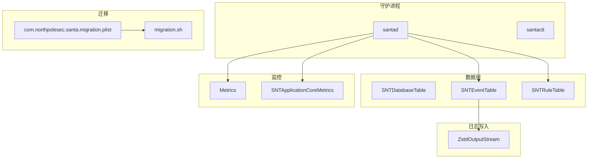

**图表来源**
- [SNTEventTable.mm](file://Source/santad/DataLayer/SNTEventTable.mm#L1-L244)
- [SNTRuleTable.mm](file://Source/santad/DataLayer/SNTRuleTable.mm#L1-L200)
- [ZstdOutputStream.mm](file://Source/santad/Logs/EndpointSecurity/Writers/FSSpool/ZstdOutputStream.mm#L1-L151)
- [Metrics.mm](file://Source/santad/Metrics.mm#L216-L242)
- [SNTApplicationCoreMetrics.mm](file://Source/santad/SNTApplicationCoreMetrics.mm#L36-L58)
- [migration.sh](file://Conf/Package/migration.sh#L1-L41)
- [com.northpolesec.santa.migration.plist](file://Conf/com.northpolesec.santa.migration.plist#L1-L21)

## 详细组件分析

### 数据库初始化与完整性校验
- 启动连接检查：若数据库被锁定或连接异常，记录警告并尝试关闭、删除、重建与重新打开。
- 版本检查：当数据库版本高于当前支持版本时，删除并重建数据库。
- 完整性检查：通过PRAGMA integrity_check检测，若损坏则执行REINDEX与VACUUM；若仍失败则删除并重建。
- 升级后VACUUM：在版本迁移完成后调用VACUUM以回收空间。

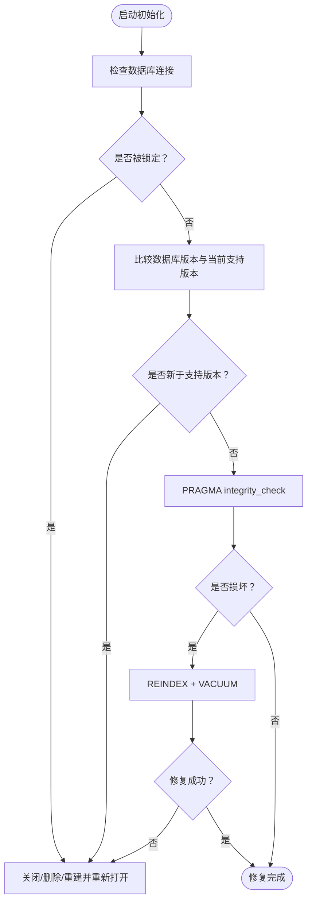

**图表来源**
- [SNTDatabaseTable.mm](file://Source/santad/DataLayer/SNTDatabaseTable.mm#L32-L150)

**章节来源**
- [SNTDatabaseTable.mm](file://Source/santad/DataLayer/SNTDatabaseTable.mm#L32-L150)

### 事件表维护（批量插入、去重、统计与清理）
- 批量插入：在事务中将事件序列化后写入，使用唯一ID冲突忽略策略，避免重复。
- 唯一索引：为uniqueid建立唯一索引，提升去重效率与查询稳定性。
- 统计与查询：提供pendingEventsCount与pendingEvents接口，支持按ID删除单条或多条事件。
- 去抖缓存：对不可处置事件设置回退缓存窗口，减少重复入库。

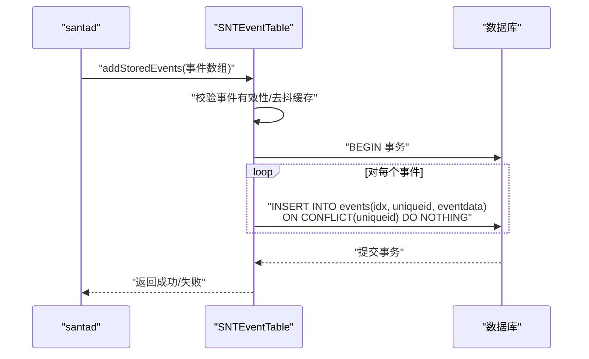

**图表来源**
- [SNTEventTable.mm](file://Source/santad/DataLayer/SNTEventTable.mm#L107-L160)

**章节来源**
- [SNTEventTable.mm](file://Source/santad/DataLayer/SNTEventTable.mm#L107-L160)
- [SNTEventTable.h](file://Source/santad/DataLayer/SNTEventTable.h#L1-L72)

### 规则表维护（清理、哈希与过期规则）
- 清理策略：支持全量清理、仅清理非传递规则、仅清理执行规则、仅清理文件访问规则等。
- 写入与校验：在事务中写入规则，校验CEL表达式合法性；支持删除与替换。
- 哈希计算：提供执行规则与文件访问规则的哈希，用于同步与变更检测。
- 过期传递规则：当规则数量超过阈值且超过有效期未使用，则清理。

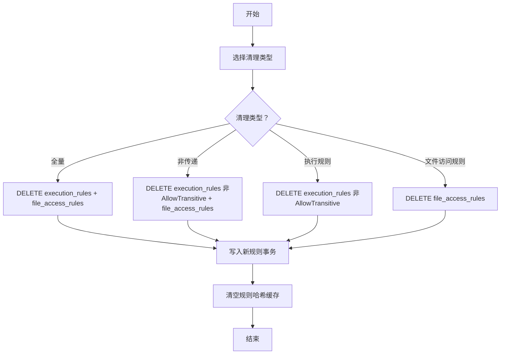

**图表来源**
- [SNTRuleTable.mm](file://Source/santad/DataLayer/SNTRuleTable.mm#L559-L688)

**章节来源**
- [SNTRuleTable.mm](file://Source/santad/DataLayer/SNTRuleTable.mm#L559-L688)
- [SNTRuleTable.h](file://Source/santad/DataLayer/SNTRuleTable.h#L1-L172)

### 数据库压缩、VACUUM与空间回收
- 压缩：事件写入采用Zstd压缩输出流，显著降低磁盘占用与I/O开销。
- VACUUM：在版本升级后自动执行，回收碎片化空间；在完整性修复后亦会执行。
- 空间回收：结合事务写入、唯一索引与VACUUM，持续优化存储空间利用率。

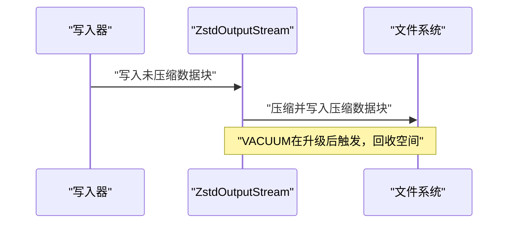

**图表来源**
- [ZstdOutputStream.mm](file://Source/santad/Logs/EndpointSecurity/Writers/FSSpool/ZstdOutputStream.mm#L1-L151)
- [SNTDatabaseTable.mm](file://Source/santad/DataLayer/SNTDatabaseTable.mm#L132-L134)

**章节来源**
- [ZstdOutputStream.h](file://Source/santad/Logs/EndpointSecurity/Writers/FSSpool/ZstdOutputStream.h#L1-L65)
- [ZstdOutputStream.mm](file://Source/santad/Logs/EndpointSecurity/Writers/FSSpool/ZstdOutputStream.mm#L1-L151)
- [SNTDatabaseTable.mm](file://Source/santad/DataLayer/SNTDatabaseTable.mm#L132-L134)

### 数据归档、历史数据清理与存储生命周期
- 归档路径：事件表支持从数据库导出并打印，便于外部归档工具处理。
- 历史清理：事件表提供按ID删除接口；规则表提供清理策略（如仅清理非传递规则）。
- 生命周期管理：通过配置项控制事件日志类型与落盘路径，结合压缩与VACUUM维持长期稳定运行。

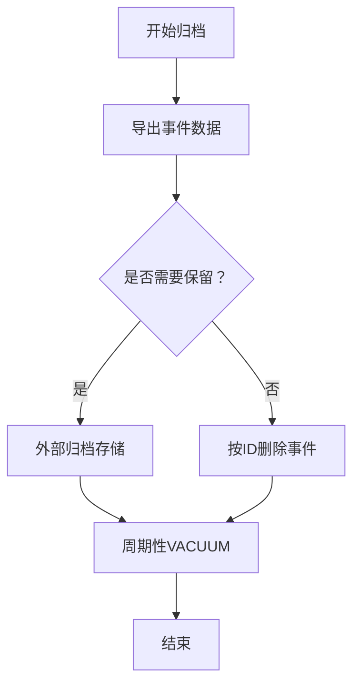

**图表来源**
- [SNTCommandPrintLog.mm](file://Source/santactl/Commands/SNTCommandPrintLog.mm#L21-L55)
- [SNTEventTable.mm](file://Source/santad/DataLayer/SNTEventTable.mm#L227-L244)
- [SNTRuleTable.mm](file://Source/santad/DataLayer/SNTRuleTable.mm#L651-L688)

**章节来源**
- [SNTCommandPrintLog.mm](file://Source/santactl/Commands/SNTCommandPrintLog.mm#L21-L55)
- [SNTEventTable.mm](file://Source/santad/DataLayer/SNTEventTable.mm#L227-L244)
- [SNTConfigurator.mm](file://Source/common/SNTConfigurator.mm#L573-L631)

### 监控、健康检查与预警机制
- 指标注册：注册运行模式、日志类型、事件计数与时延等指标，便于监控与告警。
- 事件计数与时延：通过Metrics定时器采集事件处理时长与各类事件计数，辅助容量规划与性能优化。
- 健康检查：数据库完整性检查与VACUUM可视为健康检查的一部分，异常时自动修复。

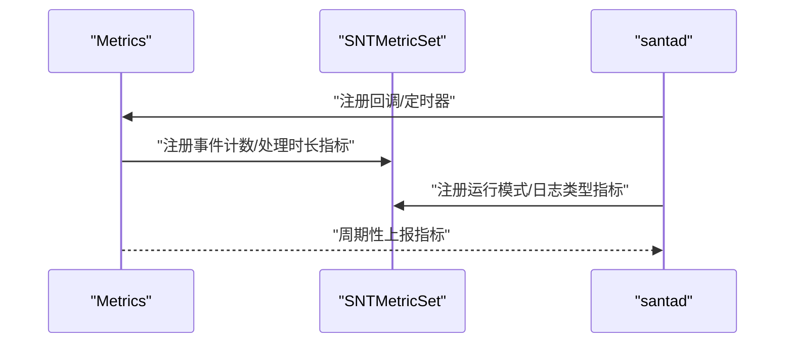

**图表来源**
- [Metrics.mm](file://Source/santad/Metrics.mm#L216-L242)
- [SNTApplicationCoreMetrics.mm](file://Source/santad/SNTApplicationCoreMetrics.mm#L36-L58)
- [SNTMetricSetTest.mm](file://Source/common/SNTMetricSetTest.mm#L514-L588)

**章节来源**
- [Metrics.mm](file://Source/santad/Metrics.mm#L216-L242)
- [SNTApplicationCoreMetrics.mm](file://Source/santad/SNTApplicationCoreMetrics.mm#L36-L58)
- [SNTMetricSetTest.mm](file://Source/common/SNTMetricSetTest.mm#L514-L588)

### 故障恢复、灾难备份与高可用
- 数据库修复：完整性检查失败时执行REINDEX与VACUUM；仍失败则删除并重建数据库。
- 迁移与高可用：迁移脚本在升级过程中停止旧版服务、清理旧产物、安装新版并加载系统扩展，随后清理迁移服务与临时目录，保证升级期间服务连续性。
- 高可用建议：结合多客户端冗余与监控告警，参考端点安全客户端架构决策文档的最佳实践。

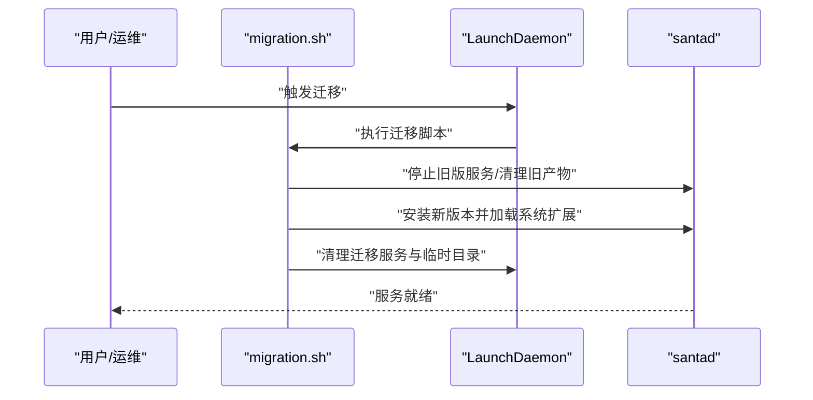

**图表来源**
- [migration.sh](file://Conf/Package/migration.sh#L1-L41)
- [com.northpolesec.santa.migration.plist](file://Conf/com.northpolesec.santa.migration.plist#L1-L21)

**章节来源**
- [SNTDatabaseTable.mm](file://Source/santad/DataLayer/SNTDatabaseTable.mm#L32-L150)
- [migration.sh](file://Conf/Package/migration.sh#L1-L41)
- [ES_Client_Architecture_Decision.md](file://ES_Client_Architecture_Decision.md#L515-L616)

### 数据库升级、迁移与版本兼容
- 版本迁移：SNTDatabaseTable在updateTableSchema中根据currentSupportedVersion执行迁移逻辑，并在升级后调用VACUUM。
- 规则表版本：SNTRuleTable定义了当前版本号，迁移逻辑中对规则表进行清理与写入。
- 兼容性：当数据库版本高于当前支持版本时，采取删除重建策略，确保与当前版本兼容。

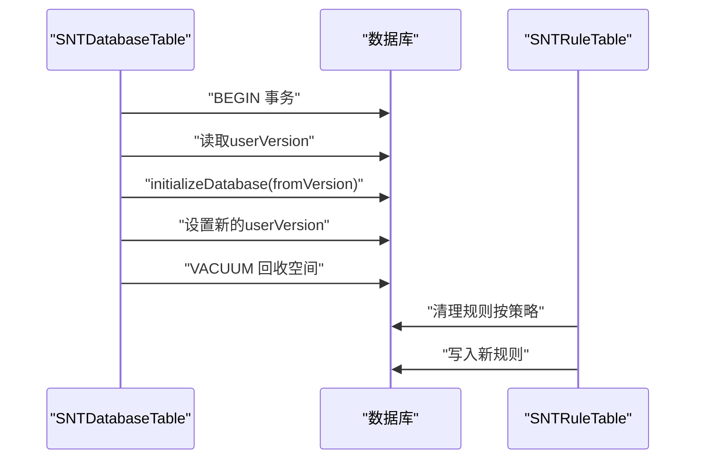

**图表来源**
- [SNTDatabaseTable.mm](file://Source/santad/DataLayer/SNTDatabaseTable.mm#L116-L134)
- [SNTRuleTable.mm](file://Source/santad/DataLayer/SNTRuleTable.mm#L559-L688)

**章节来源**
- [SNTDatabaseTable.mm](file://Source/santad/DataLayer/SNTDatabaseTable.mm#L116-L134)
- [SNTRuleTable.mm](file://Source/santad/DataLayer/SNTRuleTable.mm#L1-L200)

### 运维自动化、脚本管理与批量维护任务
- 自动化脚本：migration.sh负责停止旧版服务、清理旧产物、安装新版本并加载系统扩展，最后清理迁移服务与临时目录。
- 批量维护：事件表支持批量插入与删除；规则表支持批量清理与写入；数据库层提供VACUUM统一回收空间。
- 配置驱动：通过SNTConfigurator的配置项控制事件日志类型、落盘路径、缓冲区大小与刷新间隔，便于批量维护策略的统一管理。

**章节来源**
- [migration.sh](file://Conf/Package/migration.sh#L1-L41)
- [SNTEventTable.mm](file://Source/santad/DataLayer/SNTEventTable.mm#L107-L160)
- [SNTRuleTable.mm](file://Source/santad/DataLayer/SNTRuleTable.mm#L559-L688)
- [SNTConfigurator.mm](file://Source/common/SNTConfigurator.mm#L573-L631)

## 依赖关系分析
- 组件耦合：SNTEventTable与SNTRuleTable均继承自SNTDatabaseTable，共享初始化、完整性检查与VACUUM能力。
- 外部依赖：ZstdOutputStream依赖zstd库进行压缩；日志导出依赖Protobuf与zstd解压工具。
- 配置依赖：SNTConfigurator提供事件日志类型、路径与缓冲阈值等配置，影响事件写入与归档策略。

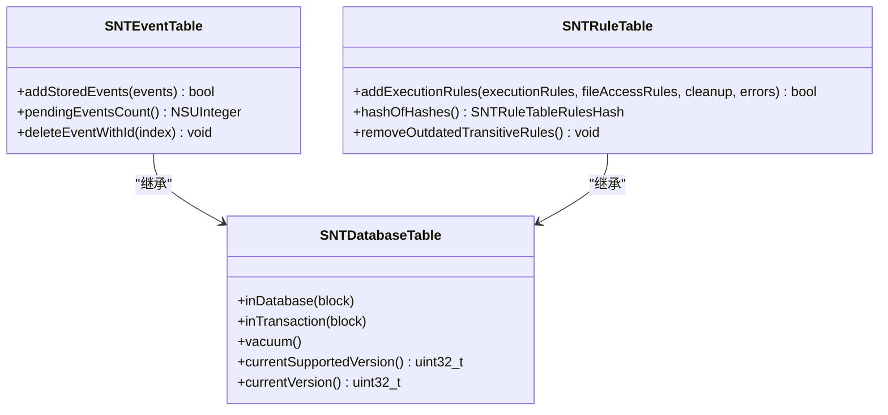

**图表来源**
- [SNTDatabaseTable.h](file://Source/santad/DataLayer/SNTDatabaseTable.h#L36-L58)
- [SNTEventTable.h](file://Source/santad/DataLayer/SNTEventTable.h#L1-L72)
- [SNTRuleTable.h](file://Source/santad/DataLayer/SNTRuleTable.h#L1-L172)

**章节来源**
- [SNTDatabaseTable.h](file://Source/santad/DataLayer/SNTDatabaseTable.h#L36-L58)
- [SNTEventTable.h](file://Source/santad/DataLayer/SNTEventTable.h#L1-L72)
- [SNTRuleTable.h](file://Source/santad/DataLayer/SNTRuleTable.h#L1-L172)

## 性能考量
- 压缩比与内存：ZstdOutputStream采用缓冲区与流式压缩，避免一次性大内存分配；测试用例验证压缩效果与字节数一致。
- 事务与索引：事件表使用唯一索引与冲突忽略策略，减少重复写入；规则表在事务中批量写入，提高吞吐。
- VACUUM时机：版本升级与完整性修复后执行VACUUM，降低碎片化，提升后续写入与查询性能。
- 指标监控：通过事件计数与时延指标评估系统负载，指导容量与资源规划。

**章节来源**
- [ZstdOutputStream.mm](file://Source/santad/Logs/EndpointSecurity/Writers/FSSpool/ZstdOutputStream.mm#L1-L151)
- [SNTEventTable.mm](file://Source/santad/DataLayer/SNTEventTable.mm#L107-L160)
- [SNTDatabaseTable.mm](file://Source/santad/DataLayer/SNTDatabaseTable.mm#L132-L134)
- [Metrics.mm](file://Source/santad/Metrics.mm#L216-L242)

## 故障排查指南
- 数据库被锁定：检查是否有其他进程持有锁；等待或终止冲突进程后重启服务。
- 版本不兼容：若数据库版本高于当前支持版本，系统会删除并重建数据库；确认升级流程正确执行。
- 完整性错误：系统会尝试REINDEX与VACUUM；若仍失败，删除并重建数据库。
- 规则写入失败：检查规则合法性（如CEL表达式），并查看错误信息定位问题。
- 事件积压：通过指标观察事件计数与时延，必要时增加缓冲阈值或调整刷新间隔。

**章节来源**
- [SNTDatabaseTable.mm](file://Source/santad/DataLayer/SNTDatabaseTable.mm#L32-L150)
- [SNTRuleTable.mm](file://Source/santad/DataLayer/SNTRuleTable.mm#L559-L688)
- [Metrics.mm](file://Source/santad/Metrics.mm#L216-L242)

## 结论
Santa数据库维护策略以“完整性校验+事务写入+压缩+VACUUM”为核心，结合规则清理与生命周期管理，形成闭环的运维体系。通过指标监控与迁移脚本，保障系统在升级与故障场景下的稳定性与可维护性。建议在生产环境中配合定期VACUUM、合理阈值与告警策略，持续优化存储与性能。

## 附录
- 高可用与客户端冗余：参考端点安全客户端架构决策文档的最佳实践，实施deadline管理与fail-closed/fail-open策略，提升整体安全性与可用性。

**章节来源**
- [ES_Client_Architecture_Decision.md](file://ES_Client_Architecture_Decision.md#L515-L616)