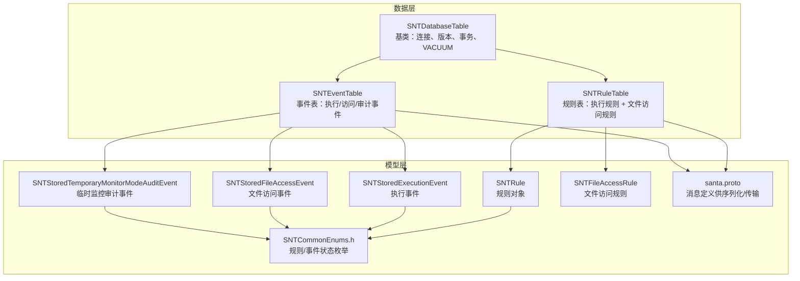
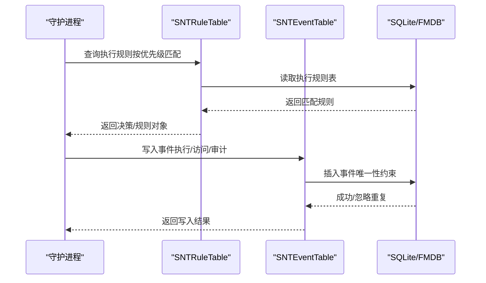
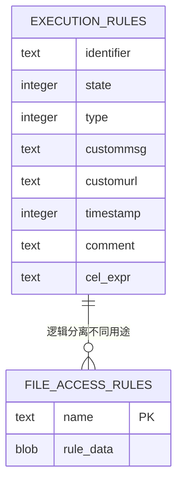
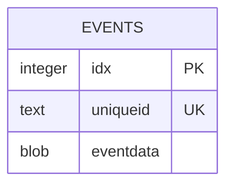
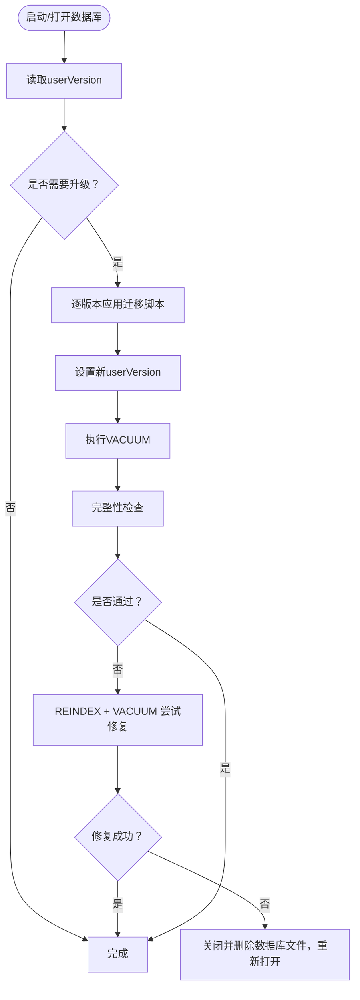
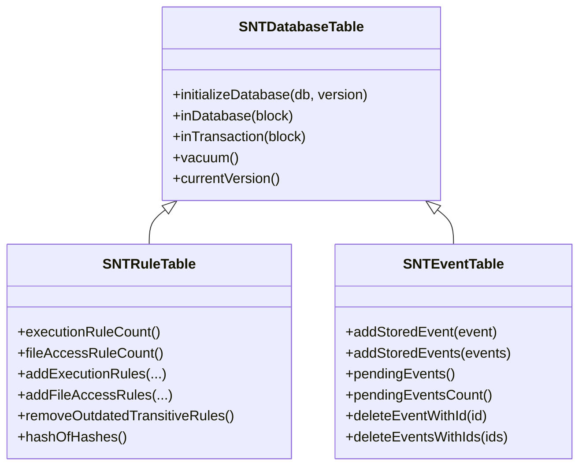

# 表结构设计

<cite>
**本文引用的文件**
- [SNTRuleTable.h](file://Source/santad/DataLayer/SNTRuleTable.h)
- [SNTRuleTable.mm](file://Source/santad/DataLayer/SNTRuleTable.mm)
- [SNTEventTable.h](file://Source/santad/DataLayer/SNTEventTable.h)
- [SNTEventTable.mm](file://Source/santad/DataLayer/SNTEventTable.mm)
- [SNTDatabaseTable.h](file://Source/santad/DataLayer/SNTDatabaseTable.h)
- [SNTDatabaseTable.mm](file://Source/santad/DataLayer/SNTDatabaseTable.mm)
- [SNTRule.h](file://Source/common/SNTRule.h)
- [SNTStoredEvent.h](file://Source/common/SNTStoredEvent.h)
- [SNTStoredExecutionEvent.h](file://Source/common/SNTStoredExecutionEvent.h)
- [SNTStoredFileAccessEvent.h](file://Source/common/SNTStoredFileAccessEvent.h)
- [SNTStoredTemporaryMonitorModeAuditEvent.h](file://Source/common/SNTStoredTemporaryMonitorModeAuditEvent.h)
- [SNTFileAccessRule.h](file://Source/common/SNTFileAccessRule.h)
- [SNTCommonEnums.h](file://Source/common/SNTCommonEnums.h)
- [santa.proto](file://Source/common/santa.proto)
</cite>

## 目录
1. [简介](#简介)
2. [项目结构](#项目结构)
3. [核心组件](#核心组件)
4. [架构总览](#架构总览)
5. [详细组件分析](#详细组件分析)
6. [依赖分析](#依赖分析)
7. [性能考虑](#性能考虑)
8. [故障排查指南](#故障排查指南)
9. [结论](#结论)
10. [附录](#附录)

## 简介
本文件面向Santa项目中的数据库层，系统化梳理并解释规则表（SNTRuleTable）与事件表（SNTEventTable）的表结构设计、字段定义、数据类型选择、约束条件、索引策略、查询优化、存储引擎选择、表结构演进历史、版本兼容性与迁移方案、表空间管理、自动增长与分区策略、以及数据字典与元数据管理等。同时给出关键流程的时序图与类图，帮助读者快速理解两表在系统中的角色与交互。

## 项目结构
Santa的数据层由统一的基类SNTDatabaseTable提供数据库生命周期与版本升级能力，具体表实现位于SNTEventTable与SNTRuleTable中。事件表用于持久化各类执行与访问事件；规则表用于持久化执行规则与文件访问规则，并维护规则哈希与清理策略。

图表来源
- [SNTDatabaseTable.h](file://Source/santad/DataLayer/SNTDatabaseTable.h#L1-L59)
- [SNTDatabaseTable.mm](file://Source/santad/DataLayer/SNTDatabaseTable.mm#L1-L151)
- [SNTRuleTable.h](file://Source/santad/DataLayer/SNTRuleTable.h#L1-L172)
- [SNTRuleTable.mm](file://Source/santad/DataLayer/SNTRuleTable.mm#L1-L334)
- [SNTEventTable.h](file://Source/santad/DataLayer/SNTEventTable.h#L1-L72)
- [SNTEventTable.mm](file://Source/santad/DataLayer/SNTEventTable.mm#L1-L103)
- [SNTRule.h](file://Source/common/SNTRule.h#L1-L129)
- [SNTStoredEvent.h](file://Source/common/SNTStoredEvent.h#L1-L36)
- [SNTStoredExecutionEvent.h](file://Source/common/SNTStoredExecutionEvent.h#L1-L142)
- [SNTStoredFileAccessEvent.h](file://Source/common/SNTStoredFileAccessEvent.h#L1-L74)
- [SNTStoredTemporaryMonitorModeAuditEvent.h](file://Source/common/SNTStoredTemporaryMonitorModeAuditEvent.h#L1-L92)
- [SNTFileAccessRule.h](file://Source/common/SNTFileAccessRule.h#L1-L33)
- [SNTCommonEnums.h](file://Source/common/SNTCommonEnums.h#L50-L126)
- [santa.proto](file://Source/common/santa.proto#L268-L346)

章节来源
- [SNTDatabaseTable.h](file://Source/santad/DataLayer/SNTDatabaseTable.h#L1-L59)
- [SNTDatabaseTable.mm](file://Source/santad/DataLayer/SNTDatabaseTable.mm#L1-L151)
- [SNTRuleTable.h](file://Source/santad/DataLayer/SNTRuleTable.h#L1-L172)
- [SNTRuleTable.mm](file://Source/santad/DataLayer/SNTRuleTable.mm#L1-L334)
- [SNTEventTable.h](file://Source/santad/DataLayer/SNTEventTable.h#L1-L72)
- [SNTEventTable.mm](file://Source/santad/DataLayer/SNTEventTable.mm#L1-L103)

## 核心组件
- 规则表（SNTRuleTable）
  - 负责执行规则与文件访问规则的增删改查、批量导入、清理策略、规则哈希计算与缓存、以及决策缓存刷新判断。
  - 支持多类型规则（二进制、签名ID、证书、团队ID、CDHash、编译器、本地二进制/签名ID、传递式等），并按优先级顺序匹配。
  - 提供文件访问规则的归档/解档与唯一性约束。
- 事件表（SNTEventTable）
  - 负责事件的入库、去重、查询与删除。
  - 使用唯一标识列避免重复事件上传导致的冗余。
  - 对不可处理事件采用退避策略，降低重复写入压力。
- 数据库基类（SNTDatabaseTable）
  - 统一初始化、版本升级、完整性检查、修复与VACUUM。
  - 提供事务封装与数据库队列访问。

章节来源
- [SNTRuleTable.h](file://Source/santad/DataLayer/SNTRuleTable.h#L33-L172)
- [SNTRuleTable.mm](file://Source/santad/DataLayer/SNTRuleTable.mm#L336-L800)
- [SNTEventTable.h](file://Source/santad/DataLayer/SNTEventTable.h#L23-L72)
- [SNTEventTable.mm](file://Source/santad/DataLayer/SNTEventTable.mm#L104-L244)
- [SNTDatabaseTable.h](file://Source/santad/DataLayer/SNTDatabaseTable.h#L22-L59)
- [SNTDatabaseTable.mm](file://Source/santad/DataLayer/SNTDatabaseTable.mm#L71-L151)

## 架构总览
下图展示规则表与事件表在系统中的职责边界与协作方式：规则表负责决策依据（规则），事件表负责记录行为事实（事件）。两者均通过SNTDatabaseTable进行版本化管理与事务控制。

图表来源
- [SNTRuleTable.mm](file://Source/santad/DataLayer/SNTRuleTable.mm#L438-L516)
- [SNTEventTable.mm](file://Source/santad/DataLayer/SNTEventTable.mm#L128-L160)
- [SNTDatabaseTable.h](file://Source/santad/DataLayer/SNTDatabaseTable.h#L36-L59)

## 详细组件分析

### 规则表（SNTRuleTable）结构设计
- 执行规则表（execution_rules）
  - 字段
    - identifier：规则标识符（如二进制SHA256、签名ID、证书SHA256、团队ID或CDHash），TEXT，非空。
    - state：规则状态（允许/阻止/静默阻止/移除/编译器/传递式/本地等），INTEGER，非空。
    - type：规则类型（CDHash、二进制、签名ID、证书、团队ID），INTEGER，非空。
    - custommsg：自定义提示文本，TEXT。
    - customurl：自定义跳转链接，TEXT。
    - timestamp：时间戳（用于传递式规则老化判定），INTEGER。
    - comment：本地注释，TEXT。
    - cel_expr：CEL表达式（当state为CEL/CELv2时），TEXT。
  - 约束与索引
    - 唯一索引：identifier + type，确保同一标识在同一类型上只有一条生效规则。
    - 外键：无显式外键约束，但逻辑上identifier与type共同决定规则范围。
  - 数据类型选择
    - identifier使用TEXT以支持大小写规范化（二进制/证书强制小写，团队ID强制大写）。
    - state/type使用INTEGER以节省空间并便于枚举映射。
    - timestamp使用INTEGER存储自2001-01-01起的秒数。
    - cel_expr使用TEXT存储表达式字符串。
  - 约束条件
    - identifier非空；state/type非未知；可选字段为空时为默认值。
    - 删除/替换规则时保持原子性（事务）。
- 文件访问规则表（file_access_rules）
  - 字段
    - name：规则名称，TEXT，主键。
    - rule_data：规则详情的归档二进制，BLOB，非空。
  - 约束与索引
    - 主键：name。
    - 唯一性：通过INSERT OR REPLACE保证同名覆盖。
  - 数据类型选择
    - name使用TEXT作为键；rule_data使用BLOB以承载复杂规则结构。
  - 约束条件
    - 添加规则时校验状态与名称；删除规则时按name精确匹配。

图表来源
- [SNTRuleTable.mm](file://Source/santad/DataLayer/SNTRuleTable.mm#L294-L334)
- [SNTRuleTable.mm](file://Source/santad/DataLayer/SNTRuleTable.mm#L518-L705)

章节来源
- [SNTRuleTable.mm](file://Source/santad/DataLayer/SNTRuleTable.mm#L212-L334)
- [SNTRuleTable.mm](file://Source/santad/DataLayer/SNTRuleTable.mm#L518-L705)
- [SNTRuleTable.h](file://Source/santad/DataLayer/SNTRuleTable.h#L83-L170)
- [SNTRule.h](file://Source/common/SNTRule.h#L21-L129)
- [SNTFileAccessRule.h](file://Source/common/SNTFileAccessRule.h#L15-L33)
- [SNTCommonEnums.h](file://Source/common/SNTCommonEnums.h#L50-L126)

### 事件表（SNTEventTable）结构设计
- 事件表（events）
  - 字段
    - idx：自增主键（早期版本使用AUTOINCREMENT，后改为普通自增并在迁移中重建表）。
    - uniqueid：唯一标识，TEXT，唯一索引。
    - eventdata：事件对象的归档二进制，BLOB，非空。
  - 约束与索引
    - 唯一索引：uniqueid，用于去重。
    - 外键：无显式外键约束。
  - 数据类型选择
    - idx使用INTEGER；uniqueid使用TEXT以承载多种事件类型的唯一ID；eventdata使用BLOB承载任意事件对象。
  - 约束条件
    - 写入时使用ON CONFLICT(uniqueid) DO NOTHING实现幂等插入。
    - 读取时对损坏或无法反序列化的记录执行清理。

图表来源
- [SNTEventTable.mm](file://Source/santad/DataLayer/SNTEventTable.mm#L46-L103)
- [SNTEventTable.mm](file://Source/santad/DataLayer/SNTEventTable.mm#L128-L160)

章节来源
- [SNTEventTable.mm](file://Source/santad/DataLayer/SNTEventTable.mm#L46-L103)
- [SNTEventTable.mm](file://Source/santad/DataLayer/SNTEventTable.mm#L128-L204)
- [SNTStoredEvent.h](file://Source/common/SNTStoredEvent.h#L16-L36)
- [SNTStoredExecutionEvent.h](file://Source/common/SNTStoredExecutionEvent.h#L20-L142)
- [SNTStoredFileAccessEvent.h](file://Source/common/SNTStoredFileAccessEvent.h#L20-L74)
- [SNTStoredTemporaryMonitorModeAuditEvent.h](file://Source/common/SNTStoredTemporaryMonitorModeAuditEvent.h#L53-L92)

### 关系设计、外键与引用完整性
- 规则表
  - 执行规则表与文件访问规则表逻辑分离，无直接外键关联。
  - identifier + type构成规则的业务唯一性，通过唯一索引保障。
- 事件表
  - 事件表仅保存归档后的事件对象，不直接引用规则表或系统对象，保持低耦合。
  - 唯一索引uniqueid用于去重，避免重复上传造成冗余。

章节来源
- [SNTRuleTable.mm](file://Source/santad/DataLayer/SNTRuleTable.mm#L294-L334)
- [SNTEventTable.mm](file://Source/santad/DataLayer/SNTEventTable.mm#L80-L103)

### 索引策略、查询优化与存储引擎
- 规则表
  - 唯一索引：execution_rules(identifier, type)，用于快速定位规则并避免重复。
  - 匹配查询：按优先级顺序构造多条件OR查询，结合业务逻辑避免不必要的排序开销。
  - 传递式规则清理：基于timestamp字段定期删除过期规则，阈值与周期可配置。
- 事件表
  - 唯一索引：events(uniqueid)，用于幂等插入与去重。
  - AUTOINCREMENT迁移：从v3到v4版本移除了AUTOINCREMENT，减少空洞与碎片。
- 存储引擎
  - 基于SQLite/FMDB实现，使用事务与VACUUM维护一致性与空间效率。

章节来源
- [SNTRuleTable.mm](file://Source/santad/DataLayer/SNTRuleTable.mm#L438-L516)
- [SNTRuleTable.mm](file://Source/santad/DataLayer/SNTRuleTable.mm#L783-L800)
- [SNTEventTable.mm](file://Source/santad/DataLayer/SNTEventTable.mm#L67-L103)
- [SNTDatabaseTable.mm](file://Source/santad/DataLayer/SNTDatabaseTable.mm#L132-L151)

### 表结构演进历史、版本兼容性与迁移方案
- 规则表（SNTRuleTable）
  - v1 → v2：删除视图，保留表结构。
  - v2 → v3：新增timestamp列，用于传递式规则老化。
  - v3 → v4：列名从shasum重命名为identifier。
  - v4 → v5：重排规则类型枚举值，确保优先级顺序。
  - v5 → v6：对标识符进行大小写规范化（二进制/证书强制小写，团队ID强制大写）。
  - v6 → v7：新增customurl列。
  - v7 → v8：新增comment列。
  - v8 → v9：新增cel_expr列。
  - v9 → v10：表重命名为execution_rules，唯一索引更新；新增file_access_rules表。
  - 兼容性：每次迁移均返回新版本号，失败时回滚；升级完成后执行VACUUM。
- 事件表（SNTEventTable）
  - v1 → v2：清空表并重建，避免旧数据不一致。
  - v2 → v3：移除AUTOINCREMENT，重建表以优化自增值。
  - v3 → v4：删除重复uniqueid记录，添加唯一索引。
  - v4 → v5：列名从filesha256重命名为uniqueid，重建唯一索引。
  - 兼容性：完整性检查失败时尝试REINDEX; VACUUM修复，仍失败则删除重建。

图表来源
- [SNTRuleTable.mm](file://Source/santad/DataLayer/SNTRuleTable.mm#L212-L334)
- [SNTEventTable.mm](file://Source/santad/DataLayer/SNTEventTable.mm#L46-L103)
- [SNTDatabaseTable.mm](file://Source/santad/DataLayer/SNTDatabaseTable.mm#L71-L115)

章节来源
- [SNTRuleTable.mm](file://Source/santad/DataLayer/SNTRuleTable.mm#L212-L334)
- [SNTEventTable.mm](file://Source/santad/DataLayer/SNTEventTable.mm#L46-L103)
- [SNTDatabaseTable.mm](file://Source/santad/DataLayer/SNTDatabaseTable.mm#L71-L115)

### 表空间管理、自动增长与分区策略
- 表空间管理
  - 升级后执行VACUUM回收碎片与空洞。
  - 完整性检查失败时尝试REINDEX + VACUUM，仍失败则删除重建。
- 自动增长
  - 事件表在v3→v4阶段移除了AUTOINCREMENT，避免空洞；后续通过普通自增列维持递增。
- 分区策略
  - 当前未见显式分区（按时间/大小）策略；可通过业务层（如事件表的唯一ID与时间戳）配合外部归档实现冷热分离。

章节来源
- [SNTDatabaseTable.mm](file://Source/santad/DataLayer/SNTDatabaseTable.mm#L132-L151)
- [SNTEventTable.mm](file://Source/santad/DataLayer/SNTEventTable.mm#L67-L103)

### 数据字典、元数据管理与统计信息收集
- 数据字典
  - 规则类型与状态枚举集中定义于SNTCommonEnums.h，确保数据库与代码一致。
  - 规则对象SNTRule提供序列化/反序列化接口，便于导出与导入。
- 元数据管理
  - 规则表维护规则哈希（执行规则与文件访问规则分别计算），用于同步一致性校验。
  - 事件表使用uniqueid作为事件元数据键，避免重复上传。
- 统计信息
  - 提供规则数量查询接口（按类型/传递式/编译器等）。
  - 事件表提供待上传事件计数与列表查询接口。

章节来源
- [SNTCommonEnums.h](file://Source/common/SNTCommonEnums.h#L50-L126)
- [SNTRuleTable.h](file://Source/santad/DataLayer/SNTRuleTable.h#L38-L82)
- [SNTRuleTable.h](file://Source/santad/DataLayer/SNTRuleTable.h#L133-L157)
- [SNTEventTable.h](file://Source/santad/DataLayer/SNTEventTable.h#L33-L71)
- [SNTEventTable.h](file://Source/santad/DataLayer/SNTEventTable.h#L43-L55)

## 依赖分析
- 组件耦合
  - 规则表与事件表均依赖SNTDatabaseTable提供的版本化与事务能力。
  - 规则表依赖SNTCommonEnums.h中的枚举定义与SNTRule对象。
  - 事件表依赖SNTStoredEvent及其子类对象。
- 外部依赖
  - SQLite/FMDB作为底层存储；CEL表达式解析器用于动态规则评估。

图表来源
- [SNTDatabaseTable.h](file://Source/santad/DataLayer/SNTDatabaseTable.h#L22-L59)
- [SNTRuleTable.h](file://Source/santad/DataLayer/SNTRuleTable.h#L33-L172)
- [SNTEventTable.h](file://Source/santad/DataLayer/SNTEventTable.h#L23-L72)

章节来源
- [SNTDatabaseTable.h](file://Source/santad/DataLayer/SNTDatabaseTable.h#L22-L59)
- [SNTRuleTable.h](file://Source/santad/DataLayer/SNTRuleTable.h#L33-L172)
- [SNTEventTable.h](file://Source/santad/DataLayer/SNTEventTable.h#L23-L72)

## 性能考虑
- 规则表
  - 唯一索引避免重复规则写入；匹配查询按优先级构造，减少排序成本。
  - 传递式规则定期清理，防止规则膨胀影响查询性能。
- 事件表
  - 唯一索引uniqueid实现幂等插入；对不可处理事件采用退避策略，降低重复写入。
  - AUTOINCREMENT移除后，自增值更紧凑，减少空洞。
- 通用
  - 升级后执行VACUUM，释放碎片空间，提升整体性能稳定性。

章节来源
- [SNTRuleTable.mm](file://Source/santad/DataLayer/SNTRuleTable.mm#L783-L800)
- [SNTEventTable.mm](file://Source/santad/DataLayer/SNTEventTable.mm#L128-L160)
- [SNTDatabaseTable.mm](file://Source/santad/DataLayer/SNTDatabaseTable.mm#L132-L151)

## 故障排查指南
- 数据库被锁或连接异常
  - 初始化时检测到锁或连接异常会记录告警并尝试重启数据库；必要时删除重建。
- 完整性问题
  - 运行PRAGMA integrity_check，若失败则REINDEX + VACUUM；仍失败则删除重建。
- 规则/事件写入失败
  - 检查参数合法性（如identifier/state/type、name、details等）；查看错误码与最后错误信息。
- 传递式规则过多
  - 启用清理阈值与过期策略，定期删除长时间未使用的传递式规则。

章节来源
- [SNTDatabaseTable.mm](file://Source/santad/DataLayer/SNTDatabaseTable.mm#L36-L60)
- [SNTDatabaseTable.mm](file://Source/santad/DataLayer/SNTDatabaseTable.mm#L76-L115)
- [SNTRuleTable.mm](file://Source/santad/DataLayer/SNTRuleTable.mm#L518-L705)
- [SNTEventTable.mm](file://Source/santad/DataLayer/SNTEventTable.mm#L128-L160)

## 结论
Santa的规则表与事件表通过清晰的字段设计、严格的唯一性约束与索引策略、完善的版本迁移与修复机制，实现了高性能、可维护的规则与事件持久化。规则表侧重“决策依据”，事件表侧重“行为记录”，二者在SNTDatabaseTable的统一治理下协同工作，满足生产环境对一致性、可扩展性与稳定性的要求。

## 附录
- 关键流程时序
  - 规则匹配与决策缓存刷新
  - 事件入库与去重
- 数据模型参考
  - 执行事件、文件访问事件、临时监控审计事件的消息定义（用于序列化/传输）

章节来源
- [SNTRuleTable.mm](file://Source/santad/DataLayer/SNTRuleTable.mm#L438-L516)
- [SNTRuleTable.mm](file://Source/santad/DataLayer/SNTRuleTable.mm#L707-L769)
- [SNTEventTable.mm](file://Source/santad/DataLayer/SNTEventTable.mm#L128-L160)
- [santa.proto](file://Source/common/santa.proto#L268-L346)