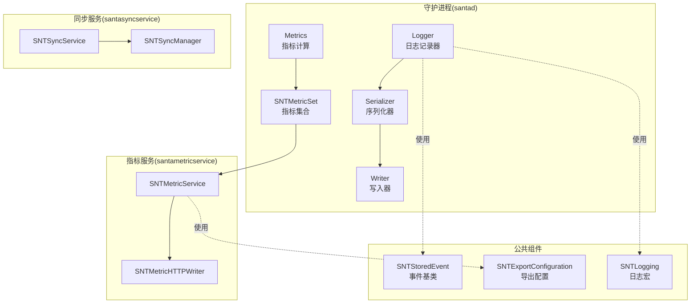
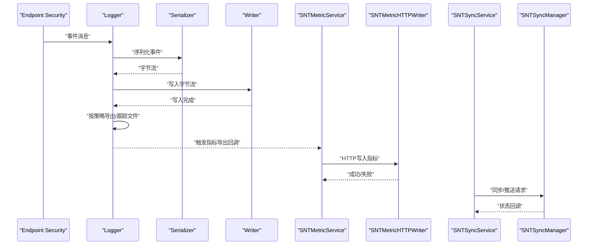
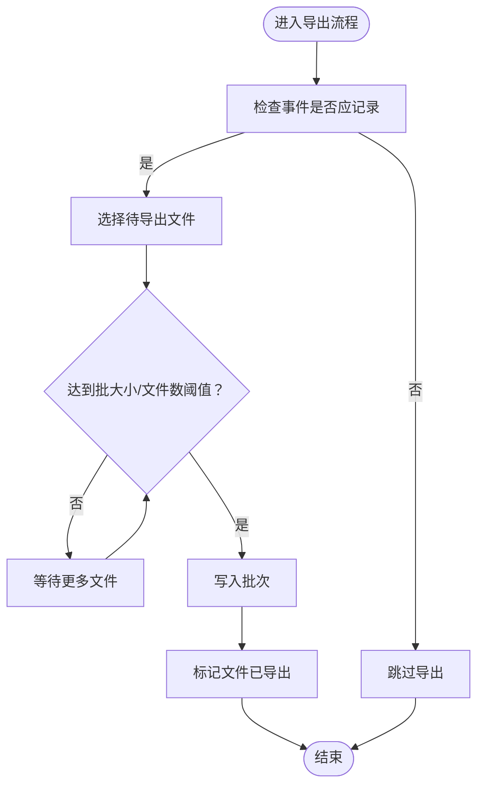
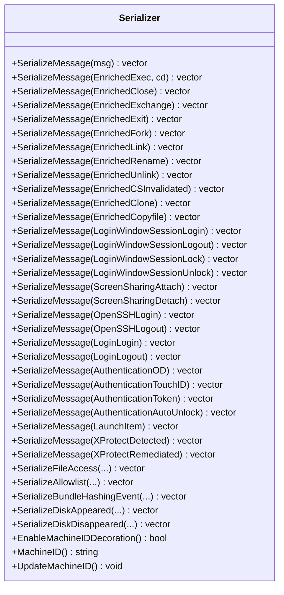
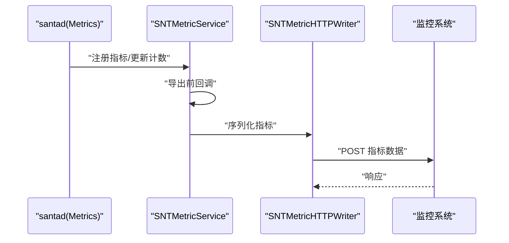
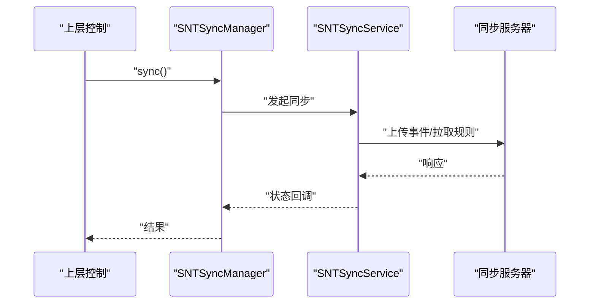
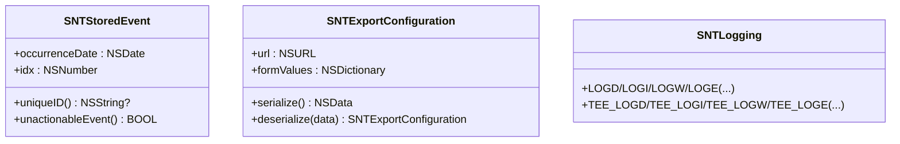
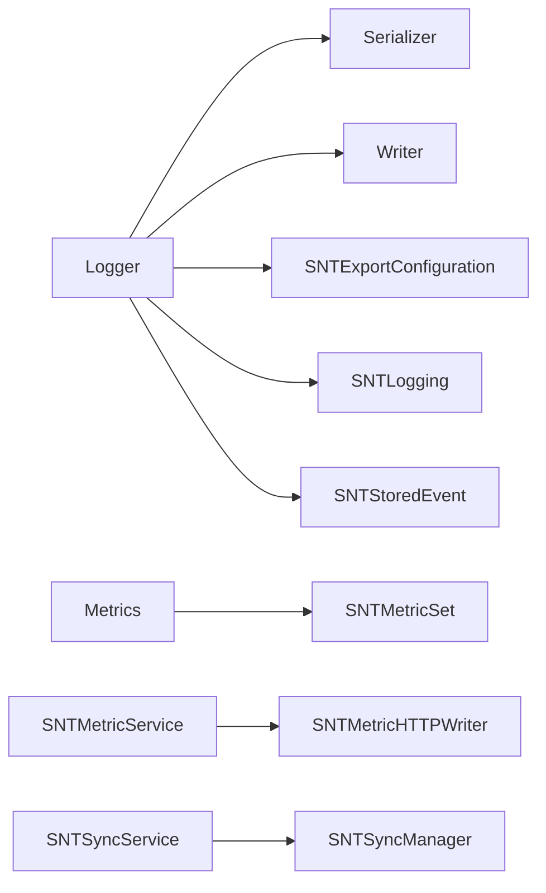

# 日志分析与监控

<cite>
**本文引用的文件**
- [Source/common/SNTLogging.h](file://Source/common/SNTLogging.h)
- [Source/santad/Logs/EndpointSecurity/Logger.h](file://Source/santad/Logs/EndpointSecurity/Logger.h)
- [Source/santad/Logs/EndpointSecurity/Serializers/Serializer.h](file://Source/santad/Logs/EndpointSecurity/Serializers/Serializer.h)
- [Source/santad/Logs/EndpointSecurity/Writers/Writer.h](file://Source/santad/Logs/EndpointSecurity/Writers/Writer.h)
- [Source/common/SNTStoredEvent.h](file://Source/common/SNTStoredEvent.h)
- [Source/common/SNTExportConfiguration.h](file://Source/common/SNTExportConfiguration.h)
- [Source/santad/Metrics.h](file://Source/santad/Metrics.h)
- [Source/common/SNTMetricSet.h](file://Source/common/SNTMetricSet.h)
- [Source/santametricservice/SNTMetricService.h](file://Source/santametricservice/SNTMetricService.h)
- [Source/santametricservice/Writers/SNTMetricHTTPWriter.h](file://Source/santametricservice/Writers/SNTMetricHTTPWriter.h)
- [Source/santasyncservice/SNTSyncService.h](file://Source/santasyncservice/SNTSyncService.h)
- [Source/santasyncservice/SNTSyncManager.h](file://Source/santasyncservice/SNTSyncManager.h)
- [Conf/com.northpolesec.santa.metricservice.plist](file://Conf/com.northpolesec.santa.metricservice.plist)
- [Conf/com.northpolesec.santa.syncservice.plist](file://Conf/com.northpolesec.santa.syncservice.plist)
</cite>

## 目录
1. [简介](#简介)
2. [项目结构](#项目结构)
3. [核心组件](#核心组件)
4. [架构总览](#架构总览)
5. [详细组件分析](#详细组件分析)
6. [依赖关系分析](#依赖关系分析)
7. [性能考量](#性能考量)
8. [故障排除指南](#故障排除指南)
9. [结论](#结论)
10. [附录](#附录)

## 简介
本文件面向Santa日志分析与监控系统，系统性阐述日志采集、序列化、写入、导出、指标抽取与上报、告警与通知、隐私与合规、以及性能优化与故障排查等主题。文档以仓库中的实际实现为依据，结合Mermaid图示帮助读者快速理解各模块职责与交互路径。

## 项目结构
Santa由守护进程(santad)、指标服务(santametricservice)、同步服务(santasyncservice)及通用公共组件组成。日志侧通过Endpoint Security事件进行采集，经序列化与写入后，按策略导出；指标侧在santad内聚指标计算与缓存，并通过指标服务对外导出。

图表来源
- [Source/santad/Logs/EndpointSecurity/Logger.h](file://Source/santad/Logs/EndpointSecurity/Logger.h#L47-L114)
- [Source/santad/Logs/EndpointSecurity/Serializers/Serializer.h](file://Source/santad/Logs/EndpointSecurity/Serializers/Serializer.h#L38-L129)
- [Source/santad/Logs/EndpointSecurity/Writers/Writer.h](file://Source/santad/Logs/EndpointSecurity/Writers/Writer.h#L28-L47)
- [Source/santad/Metrics.h](file://Source/santad/Metrics.h#L69-L141)
- [Source/common/SNTMetricSet.h](file://Source/common/SNTMetricSet.h#L84-L192)
- [Source/santametricservice/SNTMetricService.h](file://Source/santametricservice/SNTMetricService.h#L19-L20)
- [Source/santametricservice/Writers/SNTMetricHTTPWriter.h](file://Source/santametricservice/Writers/SNTMetricHTTPWriter.h#L19-L20)
- [Source/santasyncservice/SNTSyncService.h](file://Source/santasyncservice/SNTSyncService.h#L19-L20)
- [Source/santasyncservice/SNTSyncManager.h](file://Source/santasyncservice/SNTSyncManager.h#L27-L78)
- [Source/common/SNTStoredEvent.h](file://Source/common/SNTStoredEvent.h#L18-L36)
- [Source/common/SNTExportConfiguration.h](file://Source/common/SNTExportConfiguration.h#L17-L27)
- [Source/common/SNTLogging.h](file://Source/common/SNTLogging.h#L25-L64)

章节来源
- [Source/santad/Logs/EndpointSecurity/Logger.h](file://Source/santad/Logs/EndpointSecurity/Logger.h#L47-L114)
- [Source/santad/Metrics.h](file://Source/santad/Metrics.h#L69-L141)
- [Source/common/SNTMetricSet.h](file://Source/common/SNTMetricSet.h#L84-L192)
- [Source/santametricservice/SNTMetricService.h](file://Source/santametricservice/SNTMetricService.h#L19-L20)
- [Source/santasyncservice/SNTSyncService.h](file://Source/santasyncservice/SNTSyncService.h#L19-L20)
- [Source/santasyncservice/SNTSyncManager.h](file://Source/santasyncservice/SNTSyncManager.h#L27-L78)
- [Source/common/SNTStoredEvent.h](file://Source/common/SNTStoredEvent.h#L18-L36)
- [Source/common/SNTExportConfiguration.h](file://Source/common/SNTExportConfiguration.h#L17-L27)
- [Source/common/SNTLogging.h](file://Source/common/SNTLogging.h#L25-L64)

## 核心组件
- 日志记录器(Logger)：负责接收Endpoint Security事件，按策略决定是否记录，支持批量导出与文件跟踪。
- 序列化器(Serializer)：将事件对象转换为字节流，支持多种事件类型与文件访问事件序列化。
- 写入器(Writer)：抽象写入接口，支持文件列表导出与批量导出确认。
- 指标集合(SNTMetricSet)：提供计数器、整型/双精度/字符串/布尔仪表盘等指标类型注册与导出。
- 指标服务(SNTMetricService)：通过XPC接口暴露指标服务能力，供外部导出。
- 同步服务(SNTSyncService)与管理器(SNTSyncManager)：负责推送通知与周期性同步，支持事件上传与规则下载。
- 公共事件(SNTStoredEvent)与导出配置(SNTExportConfiguration)：事件基类与导出目标配置。
- 日志宏(SNTLogging)：统一的日志输出入口，支持tee到控制台与系统日志。

章节来源
- [Source/santad/Logs/EndpointSecurity/Logger.h](file://Source/santad/Logs/EndpointSecurity/Logger.h#L47-L114)
- [Source/santad/Logs/EndpointSecurity/Serializers/Serializer.h](file://Source/santad/Logs/EndpointSecurity/Serializers/Serializer.h#L38-L129)
- [Source/santad/Logs/EndpointSecurity/Writers/Writer.h](file://Source/santad/Logs/EndpointSecurity/Writers/Writer.h#L28-L47)
- [Source/common/SNTMetricSet.h](file://Source/common/SNTMetricSet.h#L84-L192)
- [Source/santametricservice/SNTMetricService.h](file://Source/santametricservice/SNTMetricService.h#L19-L20)
- [Source/santasyncservice/SNTSyncService.h](file://Source/santasyncservice/SNTSyncService.h#L19-L20)
- [Source/santasyncservice/SNTSyncManager.h](file://Source/santasyncservice/SNTSyncManager.h#L27-L78)
- [Source/common/SNTStoredEvent.h](file://Source/common/SNTStoredEvent.h#L18-L36)
- [Source/common/SNTExportConfiguration.h](file://Source/common/SNTExportConfiguration.h#L17-L27)
- [Source/common/SNTLogging.h](file://Source/common/SNTLogging.h#L25-L64)

## 架构总览
下图展示日志采集、序列化、写入与导出的整体流程，以及指标服务与同步服务的职责边界。

图表来源
- [Source/santad/Logs/EndpointSecurity/Logger.h](file://Source/santad/Logs/EndpointSecurity/Logger.h#L78-L114)
- [Source/santad/Logs/EndpointSecurity/Serializers/Serializer.h](file://Source/santad/Logs/EndpointSecurity/Serializers/Serializer.h#L43-L64)
- [Source/santad/Logs/EndpointSecurity/Writers/Writer.h](file://Source/santad/Logs/EndpointSecurity/Writers/Writer.h#L32-L46)
- [Source/santametricservice/SNTMetricService.h](file://Source/santametricservice/SNTMetricService.h#L19-L20)
- [Source/santametricservice/Writers/SNTMetricHTTPWriter.h](file://Source/santametricservice/Writers/SNTMetricHTTPWriter.h#L19-L20)
- [Source/santasyncservice/SNTSyncService.h](file://Source/santasyncservice/SNTSyncService.h#L19-L20)
- [Source/santasyncservice/SNTSyncManager.h](file://Source/santasyncservice/SNTSyncManager.h#L45-L76)

## 详细组件分析

### 日志记录器与导出流程
- 职责：接收事件、按遥测掩码过滤、序列化、写入、定时导出、文件导出跟踪与批处理阈值控制。
- 关键点：支持压缩类型判定、内容类型与扩展名映射、导出批大小与文件数量限制、超时控制、导出队列与线程安全。
- 导出流程：Logger在定时器触发或显式调用时，遍历待导出文件，交由Writer选择文件并标记完成，避免重复导出。

图表来源
- [Source/santad/Logs/EndpointSecurity/Logger.h](file://Source/santad/Logs/EndpointSecurity/Logger.h#L99-L114)
- [Source/santad/Logs/EndpointSecurity/Writers/Writer.h](file://Source/santad/Logs/EndpointSecurity/Writers/Writer.h#L35-L46)

章节来源
- [Source/santad/Logs/EndpointSecurity/Logger.h](file://Source/santad/Logs/EndpointSecurity/Logger.h#L47-L114)
- [Source/santad/Logs/EndpointSecurity/Writers/Writer.h](file://Source/santad/Logs/EndpointSecurity/Writers/Writer.h#L28-L47)

### 序列化器接口与事件类型
- 职责：将不同类型的Endpoint Security事件序列化为字节流，支持执行、退出、fork、重命名、链接、复制文件、登录会话、认证、启动项、XProtect、磁盘插拔等。
- 设计：采用模板与多态组合，保证新增事件类型时可扩展；提供文件访问事件专用序列化接口。
- 机器ID装饰：可选启用，用于在序列化结果中附加设备标识。

图表来源
- [Source/santad/Logs/EndpointSecurity/Serializers/Serializer.h](file://Source/santad/Logs/EndpointSecurity/Serializers/Serializer.h#L38-L129)

章节来源
- [Source/santad/Logs/EndpointSecurity/Serializers/Serializer.h](file://Source/santad/Logs/EndpointSecurity/Serializers/Serializer.h#L38-L129)

### 指标服务与导出
- 指标集合(SNTMetricSet)：提供计数器、整型/双精度/字符串/布尔仪表盘，支持根标签、常量指标、导出前回调、日期标准化。
- 指标服务(SNTMetricService)：通过XPC接口暴露能力，供指标服务进程消费。
- HTTP写入器(SNTMetricHTTPWriter)：将指标以JSON格式通过HTTP发送至远端监控系统。

图表来源
- [Source/common/SNTMetricSet.h](file://Source/common/SNTMetricSet.h#L84-L192)
- [Source/santametricservice/SNTMetricService.h](file://Source/santametricservice/SNTMetricService.h#L19-L20)
- [Source/santametricservice/Writers/SNTMetricHTTPWriter.h](file://Source/santametricservice/Writers/SNTMetricHTTPWriter.h#L19-L20)

章节来源
- [Source/common/SNTMetricSet.h](file://Source/common/SNTMetricSet.h#L84-L192)
- [Source/santametricservice/SNTMetricService.h](file://Source/santametricservice/SNTMetricService.h#L19-L20)
- [Source/santametricservice/Writers/SNTMetricHTTPWriter.h](file://Source/santametricservice/Writers/SNTMetricHTTPWriter.h#L19-L20)

### 同步与事件上传
- 同步服务(SNTSyncService)：通过XPC接口与守护进程交互。
- 同步管理器(SNTSyncManager)：支持立即同步、延时同步、带回复的状态同步、事件上传、包事件上传、推送通知状态查询与服务器地址查询。

图表来源
- [Source/santasyncservice/SNTSyncService.h](file://Source/santasyncservice/SNTSyncService.h#L19-L20)
- [Source/santasyncservice/SNTSyncManager.h](file://Source/santasyncservice/SNTSyncManager.h#L45-L76)

章节来源
- [Source/santasyncservice/SNTSyncService.h](file://Source/santasyncservice/SNTSyncService.h#L19-L20)
- [Source/santasyncservice/SNTSyncManager.h](file://Source/santasyncservice/SNTSyncManager.h#L27-L78)

### 日志与事件模型
- 日志宏(SNTLogging)：统一的os_log封装与tee到stdout/stderr的能力，便于调试与审计。
- 事件基类(SNTStoredEvent)：所有存储事件的基类，包含发生时间、索引、唯一ID与不可处理事件标记。

图表来源
- [Source/common/SNTStoredEvent.h](file://Source/common/SNTStoredEvent.h#L18-L36)
- [Source/common/SNTExportConfiguration.h](file://Source/common/SNTExportConfiguration.h#L17-L27)
- [Source/common/SNTLogging.h](file://Source/common/SNTLogging.h#L25-L64)

章节来源
- [Source/common/SNTStoredEvent.h](file://Source/common/SNTStoredEvent.h#L18-L36)
- [Source/common/SNTExportConfiguration.h](file://Source/common/SNTExportConfiguration.h#L17-L27)
- [Source/common/SNTLogging.h](file://Source/common/SNTLogging.h#L25-L64)

## 依赖关系分析
- Logger依赖Serializer与Writer进行序列化与写入；依赖ExportConfiguration与导出参数控制导出行为；内部维护导出跟踪器与导出队列。
- Metrics依赖SNTMetricSet进行指标登记与导出；通过定时器周期刷新；与事件处理链路解耦，避免导出阻塞采集。
- 指标服务与同步服务通过XPC接口与守护进程交互，避免直接耦合。
- 日志宏与事件基类为通用支撑组件，被多个模块复用。

图表来源
- [Source/santad/Logs/EndpointSecurity/Logger.h](file://Source/santad/Logs/EndpointSecurity/Logger.h#L47-L114)
- [Source/santad/Logs/EndpointSecurity/Serializers/Serializer.h](file://Source/santad/Logs/EndpointSecurity/Serializers/Serializer.h#L38-L129)
- [Source/santad/Logs/EndpointSecurity/Writers/Writer.h](file://Source/santad/Logs/EndpointSecurity/Writers/Writer.h#L28-L47)
- [Source/common/SNTExportConfiguration.h](file://Source/common/SNTExportConfiguration.h#L17-L27)
- [Source/santad/Metrics.h](file://Source/santad/Metrics.h#L69-L141)
- [Source/common/SNTMetricSet.h](file://Source/common/SNTMetricSet.h#L84-L192)
- [Source/santametricservice/SNTMetricService.h](file://Source/santametricservice/SNTMetricService.h#L19-L20)
- [Source/santametricservice/Writers/SNTMetricHTTPWriter.h](file://Source/santametricservice/Writers/SNTMetricHTTPWriter.h#L19-L20)
- [Source/santasyncservice/SNTSyncService.h](file://Source/santasyncservice/SNTSyncService.h#L19-L20)
- [Source/santasyncservice/SNTSyncManager.h](file://Source/santasyncservice/SNTSyncManager.h#L27-L78)
- [Source/common/SNTStoredEvent.h](file://Source/common/SNTStoredEvent.h#L18-L36)
- [Source/common/SNTLogging.h](file://Source/common/SNTLogging.h#L25-L64)

章节来源
- [Source/santad/Logs/EndpointSecurity/Logger.h](file://Source/santad/Logs/EndpointSecurity/Logger.h#L47-L114)
- [Source/santad/Metrics.h](file://Source/santad/Metrics.h#L69-L141)
- [Source/common/SNTMetricSet.h](file://Source/common/SNTMetricSet.h#L84-L192)
- [Source/santametricservice/SNTMetricService.h](file://Source/santametricservice/SNTMetricService.h#L19-L20)
- [Source/santasyncservice/SNTSyncService.h](file://Source/santasyncservice/SNTSyncService.h#L19-L20)
- [Source/santasyncservice/SNTSyncManager.h](file://Source/santasyncservice/SNTSyncManager.h#L27-L78)
- [Source/common/SNTStoredEvent.h](file://Source/common/SNTStoredEvent.h#L18-L36)
- [Source/common/SNTExportConfiguration.h](file://Source/common/SNTExportConfiguration.h#L17-L27)
- [Source/common/SNTLogging.h](file://Source/common/SNTLogging.h#L25-L64)

## 性能考量
- 批处理与阈值控制：Logger支持按文件大小与最大文件数的批处理阈值，避免单次导出过大导致延迟抖动。
- 定时导出与超时：通过定时器与超时参数控制导出节奏，防止长时间占用资源。
- 指标导出解耦：Metrics使用独立队列与缓存，避免导出阻塞事件采集路径。
- 写入器抽象：Writer接口允许替换实现（如文件/HTTP），便于按环境选择最优写入方式。
- 日志输出：SNTLogging提供tee能力，便于在不影响系统日志的前提下输出到终端进行实时观测。

章节来源
- [Source/santad/Logs/EndpointSecurity/Logger.h](file://Source/santad/Logs/EndpointSecurity/Logger.h#L106-L114)
- [Source/santad/Metrics.h](file://Source/santad/Metrics.h#L110-L139)
- [Source/santad/Logs/EndpointSecurity/Writers/Writer.h](file://Source/santad/Logs/EndpointSecurity/Writers/Writer.h#L28-L47)
- [Source/common/SNTLogging.h](file://Source/common/SNTLogging.h#L37-L64)

## 故障排除指南
- 日志输出定位：使用SNTLogging宏输出DEBUG/INFO/ERROR级别日志，并可通过tee输出到控制台辅助排查。
- 导出问题排查：检查Logger的导出阈值、超时与文件跟踪状态，确认Writer是否返回导出文件列表与完成标记。
- 指标导出问题：确认SNTMetricSet回调是否触发、SNTMetricHTTPWriter是否可达、监控系统响应状态。
- 同步问题排查：通过SNTSyncManager的同步接口与回调状态判断同步是否成功，必要时重试或调整同步间隔。
- 配置问题：核对SNTExportConfiguration的URL与表单参数，确保与远端服务一致。

章节来源
- [Source/common/SNTLogging.h](file://Source/common/SNTLogging.h#L25-L64)
- [Source/santad/Logs/EndpointSecurity/Logger.h](file://Source/santad/Logs/EndpointSecurity/Logger.h#L106-L114)
- [Source/santametricservice/Writers/SNTMetricHTTPWriter.h](file://Source/santametricservice/Writers/SNTMetricHTTPWriter.h#L19-L20)
- [Source/santasyncservice/SNTSyncManager.h](file://Source/santasyncservice/SNTSyncManager.h#L45-L76)
- [Source/common/SNTExportConfiguration.h](file://Source/common/SNTExportConfiguration.h#L17-L27)

## 结论
Santa的日志与监控体系以“事件采集—序列化—写入—导出”为主线，配合指标服务与同步服务形成闭环。通过可插拔的序列化与写入器、可配置的导出阈值与超时、以及指标集的灵活注册与导出回调，系统具备良好的扩展性与可观测性。建议在生产环境中结合业务需求设定合理的导出阈值与同步策略，并完善告警与通知机制以提升运维效率。

## 附录
- 进程与服务配置参考
  - 指标服务进程配置：见 [Conf/com.northpolesec.santa.metricservice.plist](file://Conf/com.northpolesec.santa.metricservice.plist#L1-L27)
  - 同步服务进程配置：见 [Conf/com.northpolesec.santa.syncservice.plist](file://Conf/com.northpolesec.santa.syncservice.plist#L1-L27)

章节来源
- [Conf/com.northpolesec.santa.metricservice.plist](file://Conf/com.northpolesec.santa.metricservice.plist#L1-L27)
- [Conf/com.northpolesec.santa.syncservice.plist](file://Conf/com.northpolesec.santa.syncservice.plist#L1-L27)