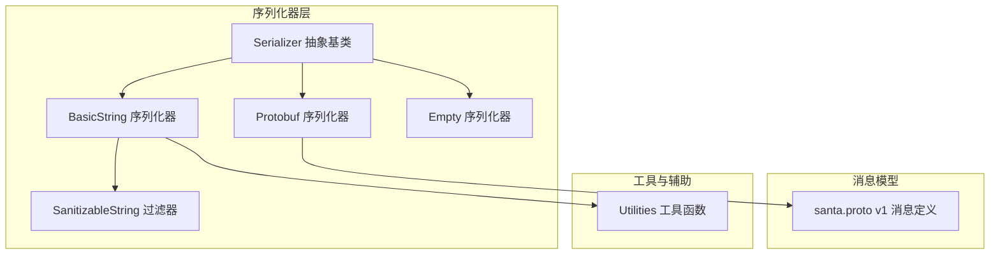
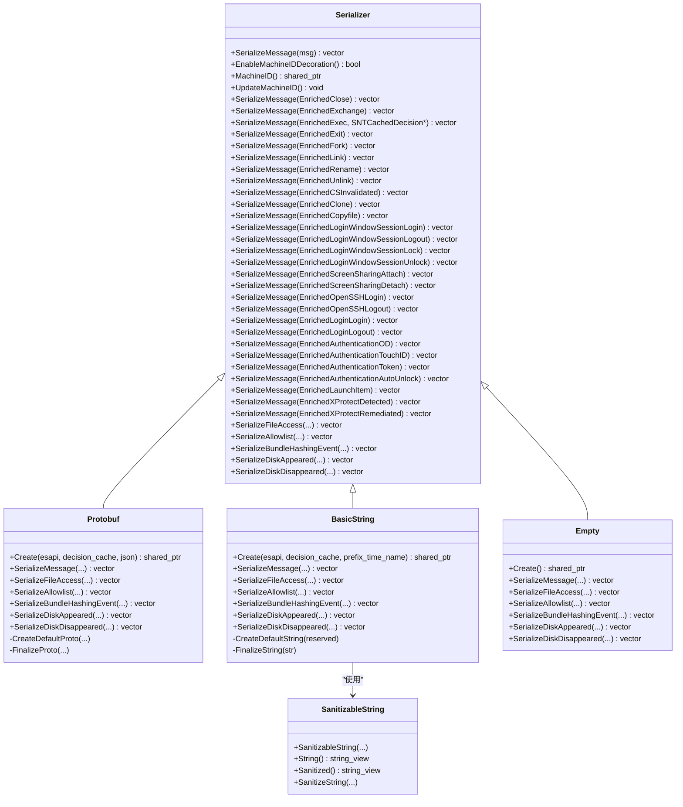
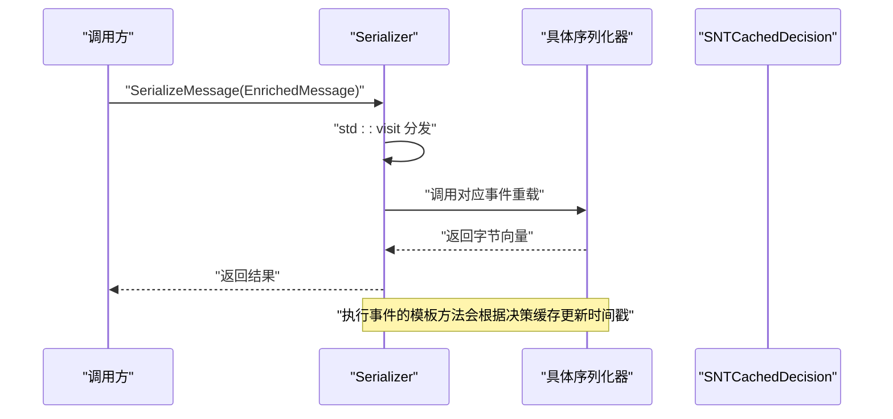
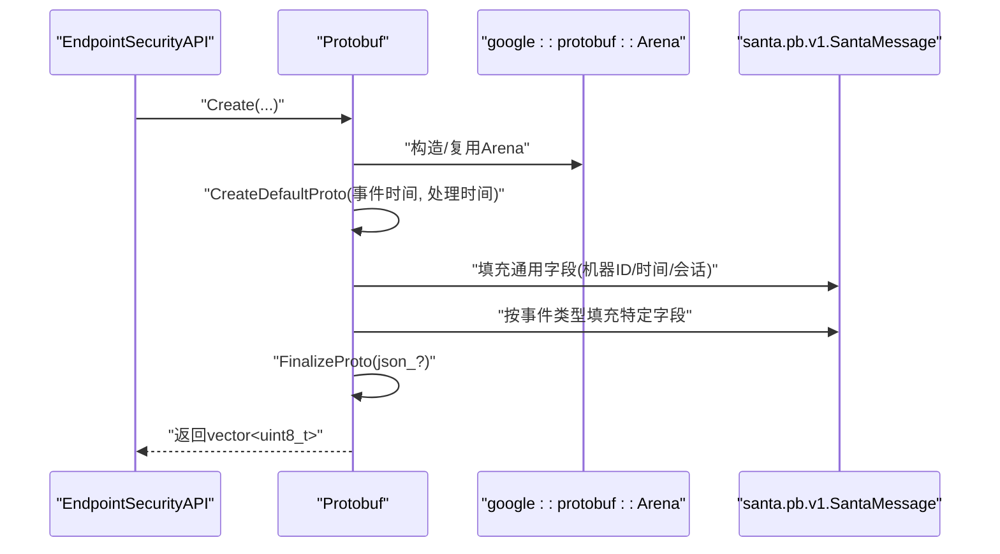
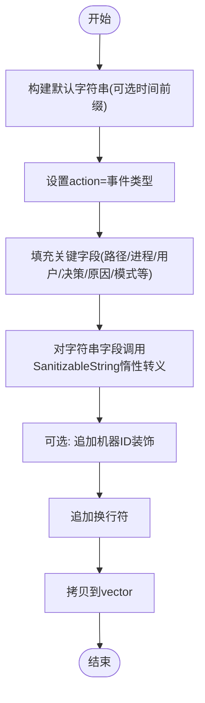
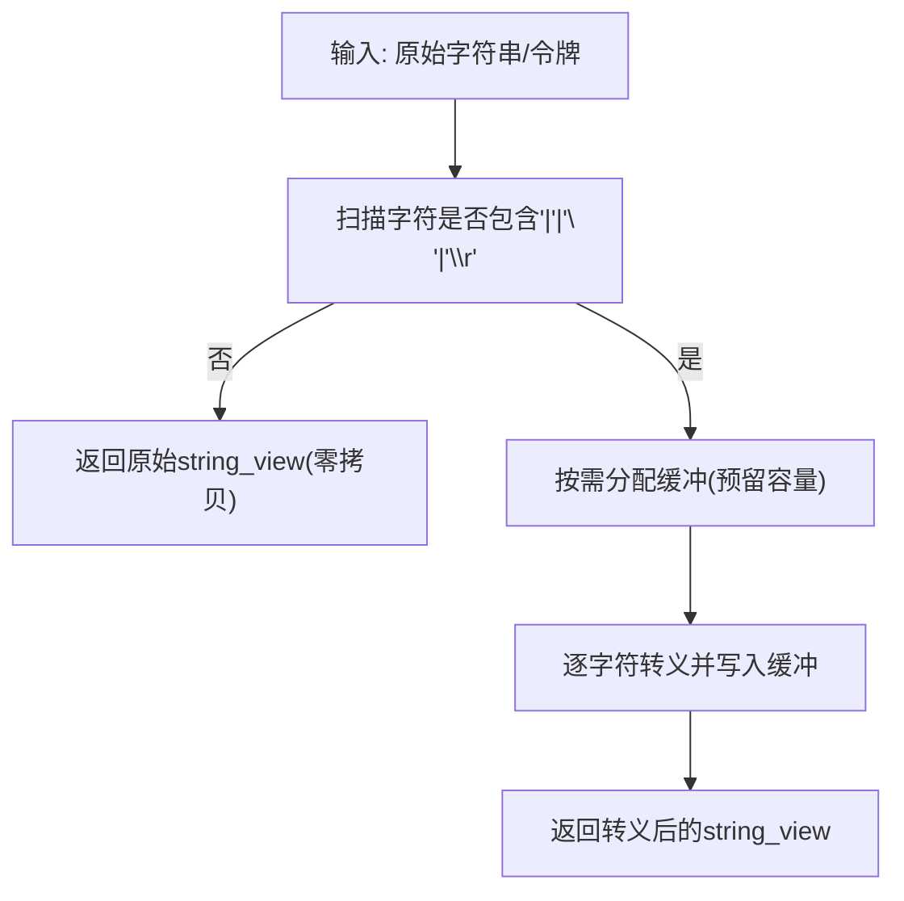
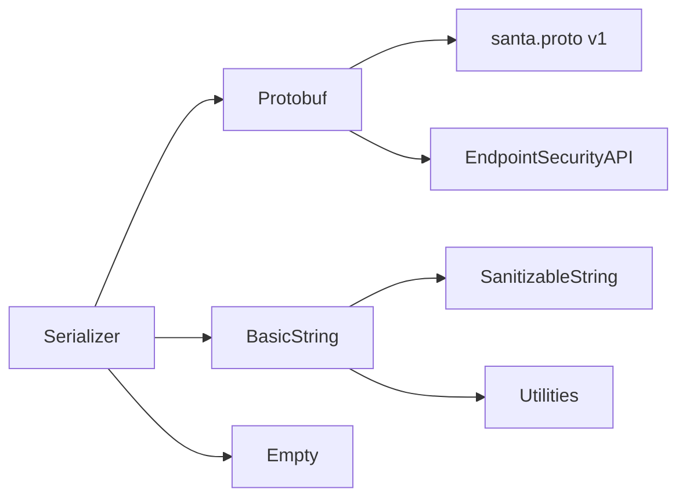

# 日志序列化

<cite>
**本文引用的文件**
- [Serializer.h](file://Source/santad/Logs/EndpointSecurity/Serializers/Serializer.h)
- [Serializer.mm](file://Source/santad/Logs/EndpointSecurity/Serializers/Serializer.mm)
- [Protobuf.h](file://Source/santad/Logs/EndpointSecurity/Serializers/Protobuf.h)
- [Protobuf.mm](file://Source/santad/Logs/EndpointSecurity/Serializers/Protobuf.mm)
- [BasicString.h](file://Source/santad/Logs/EndpointSecurity/Serializers/BasicString.h)
- [BasicString.mm](file://Source/santad/Logs/EndpointSecurity/Serializers/BasicString.mm)
- [SanitizableString.h](file://Source/santad/Logs/EndpointSecurity/Serializers/SanitizableString.h)
- [SanitizableString.mm](file://Source/santad/Logs/EndpointSecurity/Serializers/SanitizableString.mm)
- [Empty.h](file://Source/santad/Logs/EndpointSecurity/Serializers/Empty.h)
- [Empty.mm](file://Source/santad/Logs/EndpointSecurity/Serializers/Empty.mm)
- [santa.proto](file://Source/common/santa.proto)
- [Utilities.h](file://Source/santad/Logs/EndpointSecurity/Serializers/Utilities.h)
- [ProtobufTest.mm](file://Source/santad/Logs/EndpointSecurity/Serializers/ProtobufTest.mm)
- [BasicStringTest.mm](file://Source/santad/Logs/EndpointSecurity/Serializers/BasicStringTest.mm)
- [SanitizableStringTest.mm](file://Source/santad/Logs/EndpointSecurity/Serializers/SanitizableStringTest.mm)
- [EmptyTest.mm](file://Source/santad/Logs/EndpointSecurity/Serializers/EmptyTest.mm)
</cite>

## 目录
1. [简介](#简介)
2. [项目结构](#项目结构)
3. [核心组件](#核心组件)
4. [架构总览](#架构总览)
5. [详细组件分析](#详细组件分析)
6. [依赖关系分析](#依赖关系分析)
7. [性能考量](#性能考量)
8. [故障排查指南](#故障排查指南)
9. [结论](#结论)
10. [附录](#附录)

## 简介
本文件面向Santa日志序列化系统，系统性梳理并解释Serializer接口设计、Protobuf序列化器、BasicString序列化器、SanitizableString敏感信息过滤器以及Empty空实现。文档覆盖以下主题：
- 接口抽象与多态分发：通过Serializer抽象基类统一事件序列化入口，派生类按事件类型实现具体编码。
- Protobuf序列化器：基于Protocol Buffers v1消息模型，支持二进制与JSON两种输出形式，涵盖执行、文件访问、登录会话、SSH、认证等丰富事件类型。
- BasicString序列化器：以键值对文本格式输出，便于人类可读与日志采集；内置路径与字段转义机制。
- SanitizableString：在不复制原缓冲的前提下惰性转义字符串，避免不必要的内存分配。
- Empty序列化器：用于禁用日志输出或占位场景。
- 性能优化：内存复用、Arena分配、延迟转义、最小化拷贝与字符串拼接。
- 错误处理：配置开关、异常分支与日志记录。
- 格式对比与选型建议：二进制vs文本、紧凑度、解析成本、兼容性。

## 项目结构
日志序列化位于santad模块的EndpointSecurity日志子系统中，采用“接口 + 多个实现”的设计，便于在不同场景切换序列化格式。

图示来源
- [Serializer.h](file://Source/santad/Logs/EndpointSecurity/Serializers/Serializer.h#L1-L133)
- [Protobuf.h](file://Source/santad/Logs/EndpointSecurity/Serializers/Protobuf.h#L1-L119)
- [BasicString.h](file://Source/santad/Logs/EndpointSecurity/Serializers/BasicString.h#L1-L105)
- [SanitizableString.h](file://Source/santad/Logs/EndpointSecurity/Serializers/SanitizableString.h#L1-L62)
- [Empty.h](file://Source/santad/Logs/EndpointSecurity/Serializers/Empty.h#L1-L87)
- [santa.proto](file://Source/common/santa.proto#L1-L200)
- [Utilities.h](file://Source/santad/Logs/EndpointSecurity/Serializers/Utilities.h#L1-L49)

章节来源
- [Serializer.h](file://Source/santad/Logs/EndpointSecurity/Serializers/Serializer.h#L1-L133)
- [Protobuf.h](file://Source/santad/Logs/EndpointSecurity/Serializers/Protobuf.h#L1-L119)
- [BasicString.h](file://Source/santad/Logs/EndpointSecurity/Serializers/BasicString.h#L1-L105)
- [SanitizableString.h](file://Source/santad/Logs/EndpointSecurity/Serializers/SanitizableString.h#L1-L62)
- [Empty.h](file://Source/santad/Logs/EndpointSecurity/Serializers/Empty.h#L1-L87)
- [santa.proto](file://Source/common/santa.proto#L1-L200)
- [Utilities.h](file://Source/santad/Logs/EndpointSecurity/Serializers/Utilities.h#L1-L49)

## 核心组件
- 抽象基类Serializer
  - 提供统一的SerializeMessage入口，内部使用std::visit分发到各事件类型的重载。
  - 统一注入机器标识装饰（可配置）、时间戳、引导会话UUID等通用字段。
  - 对执行事件提供模板方法，自动更新缓存决策的时间戳。
- Protobuf序列化器
  - 基于santa.proto v1消息模型，生成二进制或JSON输出。
  - 支持丰富的事件类型：执行、fork、exit、close、rename、unlink、link、exchangedata、codesigning无效化、磁盘、bundle、allowlist、file_access、loginwindow、screen_sharing、open_ssh、login_logout、authentication、clone、copyfile、gatekeeper_override、launch_item、tcc_modification、xprotect等。
  - 使用google::protobuf::Arena进行内存池化，减少频繁分配。
- BasicString序列化器
  - 输出“键=值”形式的文本行，便于日志收集与人类阅读。
  - 内置前缀控制、机器ID装饰、时间戳前缀等。
  - 所有字符串字段均通过SanitizableString进行惰性转义，避免无谓内存分配。
- SanitizableString
  - 仅在需要时才分配新缓冲进行转义，否则直接返回原始视图。
  - 转义字符集：'|'、'\n'、'\r'，分别替换为"<pipe>"、"\n"、"\r"。
- Empty序列化器
  - 返回空字节向量，用于禁用日志输出或测试场景。

章节来源
- [Serializer.h](file://Source/santad/Logs/EndpointSecurity/Serializers/Serializer.h#L1-L133)
- [Serializer.mm](file://Source/santad/Logs/EndpointSecurity/Serializers/Serializer.mm#L1-L113)
- [Protobuf.h](file://Source/santad/Logs/EndpointSecurity/Serializers/Protobuf.h#L1-L119)
- [Protobuf.mm](file://Source/santad/Logs/EndpointSecurity/Serializers/Protobuf.mm#L1-L200)
- [BasicString.h](file://Source/santad/Logs/EndpointSecurity/Serializers/BasicString.h#L1-L105)
- [BasicString.mm](file://Source/santad/Logs/EndpointSecurity/Serializers/BasicString.mm#L1-L120)
- [SanitizableString.h](file://Source/santad/Logs/EndpointSecurity/Serializers/SanitizableString.h#L1-L62)
- [SanitizableString.mm](file://Source/santad/Logs/EndpointSecurity/Serializers/SanitizableString.mm#L1-L112)
- [Empty.h](file://Source/santad/Logs/EndpointSecurity/Serializers/Empty.h#L1-L87)
- [Empty.mm](file://Source/santad/Logs/EndpointSecurity/Serializers/Empty.mm#L1-L179)

## 架构总览
下图展示序列化器与消息模型、工具函数之间的交互关系。

图示来源
- [Serializer.h](file://Source/santad/Logs/EndpointSecurity/Serializers/Serializer.h#L1-L133)
- [Protobuf.h](file://Source/santad/Logs/EndpointSecurity/Serializers/Protobuf.h#L1-L119)
- [BasicString.h](file://Source/santad/Logs/EndpointSecurity/Serializers/BasicString.h#L1-L105)
- [SanitizableString.h](file://Source/santad/Logs/EndpointSecurity/Serializers/SanitizableString.h#L1-L62)
- [Empty.h](file://Source/santad/Logs/EndpointSecurity/Serializers/Empty.h#L1-L87)

## 详细组件分析

### Serializer 抽象基类
- 设计要点
  - 通过std::visit将EnrichedMessage分发到对应事件重载，保证扩展性与类型安全。
  - 通用字段：机器ID装饰、事件时间、处理时间、引导会话UUID，均由基类注入。
  - 执行事件的模板方法在Notify+Allow场景下更新缓存决策时间戳，确保审计一致性。
- 关键行为
  - EnableMachineIDDecoration/MachineID/UpdateMachineID：线程安全地更新机器ID装饰状态与值。
  - SerializeFileAccess重载：基于进程PID、PID版本、Mach时间、线程ID与不变量状态计算操作ID，用于跨客户端关联同一操作产生的多条事件。

图示来源
- [Serializer.h](file://Source/santad/Logs/EndpointSecurity/Serializers/Serializer.h#L1-L133)
- [Serializer.mm](file://Source/santad/Logs/EndpointSecurity/Serializers/Serializer.mm#L1-L113)

章节来源
- [Serializer.h](file://Source/santad/Logs/EndpointSecurity/Serializers/Serializer.h#L1-L133)
- [Serializer.mm](file://Source/santad/Logs/EndpointSecurity/Serializers/Serializer.mm#L1-L113)

### Protobuf 序列化器
- 协议与消息模型
  - 基于santa.proto v1，包含UserInfo、GroupInfo、ProcessID、CodeSignature、Stat、Hash、FileInfo、ProcessInfo、Execution、Fork、Exit、Open、Close、Exchangedata、Rename、Unlink、Link、Disk、Bundle、Allowlist、FileAccess、LoginWindowSession/Login、ScreenSharing、OpenSSH、Authentication、Clone、Copyfile、GatekeeperOverride、LaunchItem、TCCModification、XProtect等消息类型。
  - 支持将消息序列化为二进制或JSON（通过json_标志），JSON模式下使用google::protobuf::json::MessageToJsonString。
- 编码流程
  - CreateDefaultProto：设置机器ID、事件时间、处理时间、引导会话UUID。
  - 各事件类型专用编码函数：如SerializeMessage(EnrichedExec)会填充instigator/target、args/envs/fds、决策/原因/模式、证书信息、解释、隔离URL、原始路径、权限等。
  - FinalizeProto：根据json_标志决定二进制SerializeWithCachedSizesToArray或JSON序列化，并追加换行。
- 性能特性
  - 使用Arena进行对象分配，降低频繁分配开销。
  - 字段枚举映射与延迟填充，避免冗余拷贝。
- 兼容性
  - 针对不同macOS版本的ES事件类型与字段差异，通过编译期宏控制条件编译。

图示来源
- [Protobuf.h](file://Source/santad/Logs/EndpointSecurity/Serializers/Protobuf.h#L1-L119)
- [Protobuf.mm](file://Source/santad/Logs/EndpointSecurity/Serializers/Protobuf.mm#L1-L200)
- [santa.proto](file://Source/common/santa.proto#L1-L200)

章节来源
- [Protobuf.h](file://Source/santad/Logs/EndpointSecurity/Serializers/Protobuf.h#L1-L119)
- [Protobuf.mm](file://Source/santad/Logs/EndpointSecurity/Serializers/Protobuf.mm#L1-L200)
- [santa.proto](file://Source/common/santa.proto#L1-L200)

### BasicString 序列化器
- 文本格式
  - 默认输出形如“action=...|键=值|...”，每条事件一行，末尾追加换行。
  - 可选前缀：时间戳与固定标识，便于日志聚合。
- 字段转义
  - 所有字符串字段通过SanitizableString进行惰性转义，避免'|'、'\n'、'\r'破坏字段分隔。
  - 保留原始视图，仅在需要时复制并转义。
- 事件覆盖
  - 实现了所有事件类型的序列化方法，包括执行、fork、exit、close、rename、unlink、link、exchangedata、codesigning无效化、clone、copyfile、loginwindow、screen_sharing、open_ssh、login/logout、authentication、launch_item、xprotect等。
- 机器ID装饰
  - 在启用时追加“machineid=...”。

图示来源
- [BasicString.mm](file://Source/santad/Logs/EndpointSecurity/Serializers/BasicString.mm#L1-L120)
- [SanitizableString.mm](file://Source/santad/Logs/EndpointSecurity/Serializers/SanitizableString.mm#L1-L112)

章节来源
- [BasicString.h](file://Source/santad/Logs/EndpointSecurity/Serializers/BasicString.h#L1-L105)
- [BasicString.mm](file://Source/santad/Logs/EndpointSecurity/Serializers/BasicString.mm#L1-L120)
- [SanitizableString.h](file://Source/santad/Logs/EndpointSecurity/Serializers/SanitizableString.h#L1-L62)
- [SanitizableString.mm](file://Source/santad/Logs/EndpointSecurity/Serializers/SanitizableString.mm#L1-L112)

### SanitizableString 敏感信息过滤器
- 设计目标
  - 在不复制原缓冲的前提下提供“已转义视图”，仅当检测到需要转义的字符时才分配新缓冲。
- 转义规则
  - '|' -> "<pipe>"
  - '\n' -> "\\n"
  - '\r' -> "\\r"
- 使用方式
  - 构造函数支持es_file_t、es_string_token_t、char*、长度、NSString等输入。
  - String()始终返回未转义的原始视图；Sanitized()返回转义后的视图。

图示来源
- [SanitizableString.mm](file://Source/santad/Logs/EndpointSecurity/Serializers/SanitizableString.mm#L1-L112)

章节来源
- [SanitizableString.h](file://Source/santad/Logs/EndpointSecurity/Serializers/SanitizableString.h#L1-L62)
- [SanitizableString.mm](file://Source/santad/Logs/EndpointSecurity/Serializers/SanitizableString.mm#L1-L112)

### Empty 序列化器
- 行为特征
  - 所有事件重载均返回空字节向量，适合禁用日志输出或测试场景。
- 适用场景
  - 开发调试、性能对比、占位实现。

章节来源
- [Empty.h](file://Source/santad/Logs/EndpointSecurity/Serializers/Empty.h#L1-L87)
- [Empty.mm](file://Source/santad/Logs/EndpointSecurity/Serializers/Empty.mm#L1-L179)

## 依赖关系分析
- 组件耦合
  - Protobuf与santa.proto强耦合，严格遵循消息定义；与EndpointSecurityAPI交互以获取动态参数（如exec参数、环境变量、文件描述符）。
  - BasicString依赖SanitizableString与Utilities工具函数（如OriginalPathForTranslocation、NormalizePath等）。
  - Serializer作为统一入口，向上游提供一致的序列化接口，向下屏蔽具体实现差异。
- 外部依赖
  - Protocol Buffers运行时（Arena、Timestamp、JSON转换）。
  - Foundation与Cocoa相关类型（NSString、NSDate等）。
  - macOS EndpointSecurity框架与内核常量。

图示来源
- [Protobuf.mm](file://Source/santad/Logs/EndpointSecurity/Serializers/Protobuf.mm#L1-L120)
- [BasicString.mm](file://Source/santad/Logs/EndpointSecurity/Serializers/BasicString.mm#L1-L120)
- [Utilities.h](file://Source/santad/Logs/EndpointSecurity/Serializers/Utilities.h#L1-L49)
- [santa.proto](file://Source/common/santa.proto#L1-L200)

章节来源
- [Protobuf.mm](file://Source/santad/Logs/EndpointSecurity/Serializers/Protobuf.mm#L1-L120)
- [BasicString.mm](file://Source/santad/Logs/EndpointSecurity/Serializers/BasicString.mm#L1-L120)
- [Utilities.h](file://Source/santad/Logs/EndpointSecurity/Serializers/Utilities.h#L1-L49)
- [santa.proto](file://Source/common/santa.proto#L1-L200)

## 性能考量
- 内存管理
  - Protobuf使用Arena进行对象分配，减少频繁分配与碎片化。
  - SanitizableString惰性转义，避免不必要的字符串复制。
  - BasicString在构造阶段预留容量，减少多次扩容。
- I/O与序列化
  - Protobuf二进制序列化比JSON更紧凑且解析更快；JSON便于人读与调试。
  - FinalizeProto在JSON模式下使用MessageToJsonString，注意其性能与错误处理。
- 并发与原子性
  - 机器ID更新使用原子操作与内存序，确保读写可见性。
- 事件特化
  - 执行事件的模板方法在Notify+Allow场景下更新缓存决策时间戳，避免重复查询。

章节来源
- [Protobuf.mm](file://Source/santad/Logs/EndpointSecurity/Serializers/Protobuf.mm#L1-L120)
- [BasicString.mm](file://Source/santad/Logs/EndpointSecurity/Serializers/BasicString.mm#L1-L120)
- [Serializer.mm](file://Source/santad/Logs/EndpointSecurity/Serializers/Serializer.mm#L1-L113)
- [SanitizableString.mm](file://Source/santad/Logs/EndpointSecurity/Serializers/SanitizableString.mm#L1-L112)

## 故障排查指南
- Protobuf输出为空或解析失败
  - 检查FinalizeProto中JSON转换返回的状态，必要时开启更详细的日志。
  - 确认事件类型与santa.proto版本匹配，避免字段缺失。
- BasicString转义异常
  - 确保SanitizableString构造参数正确（es_file_t/es_string_token_t/NSString等）。
  - 观察转义结果是否符合预期，长字符串场景注意缓冲预留。
- 机器ID装饰未生效
  - 检查配置项enableMachineIDDecoration与machineID是否正确设置。
  - 确认UpdateMachineID调用时机与线程安全性。
- 文件描述符列表截断
  - Protobuf在执行事件中会根据last_fd与实际返回数量判断是否截断，注意与上游ESAPI行为一致。

章节来源
- [Protobuf.mm](file://Source/santad/Logs/EndpointSecurity/Serializers/Protobuf.mm#L1-L120)
- [BasicStringTest.mm](file://Source/santad/Logs/EndpointSecurity/Serializers/BasicStringTest.mm#L1-L200)
- [ProtobufTest.mm](file://Source/santad/Logs/EndpointSecurity/Serializers/ProtobufTest.mm#L1-L120)
- [SanitizableStringTest.mm](file://Source/santad/Logs/EndpointSecurity/Serializers/SanitizableStringTest.mm#L1-L91)
- [EmptyTest.mm](file://Source/santad/Logs/EndpointSecurity/Serializers/EmptyTest.mm#L1-L53)

## 结论
Santa的日志序列化系统通过清晰的抽象与多种实现，实现了高扩展性与高性能的日志输出：
- Protobuf适合高吞吐、结构化存储与下游分析场景。
- BasicString适合人类可读与传统日志采集场景。
- SanitizableString在保证安全的同时最大化减少内存分配。
- Serializer提供了统一入口与通用装饰能力，便于未来扩展更多事件类型与序列化格式。

## 附录

### 序列化格式对比与选择指南
- Protobuf
  - 优点：紧凑、结构化、可自动生成解析器、支持JSON输出、版本演进友好。
  - 缺点：解析依赖外部库、调试不如文本直观。
  - 适用：生产监控、指标采集、跨系统传输。
- BasicString
  - 优点：简单易读、兼容性强、无需额外依赖。
  - 缺点：字段分隔符可能被污染，需转义；解析需自行解析键值。
  - 适用：运维审计、快速排障、轻量日志转发。
- SanitizableString
  - 优点：零拷贝优先、按需转义、内存友好。
  - 适用：所有字符串字段的转义场景。
- Empty
  - 优点：完全禁用日志输出。
  - 适用：测试、性能基准、临时关闭。

章节来源
- [Protobuf.mm](file://Source/santad/Logs/EndpointSecurity/Serializers/Protobuf.mm#L1-L120)
- [BasicString.mm](file://Source/santad/Logs/EndpointSecurity/Serializers/BasicString.mm#L1-L120)
- [SanitizableString.mm](file://Source/santad/Logs/EndpointSecurity/Serializers/SanitizableString.mm#L1-L112)
- [Empty.mm](file://Source/santad/Logs/EndpointSecurity/Serializers/Empty.mm#L1-L179)