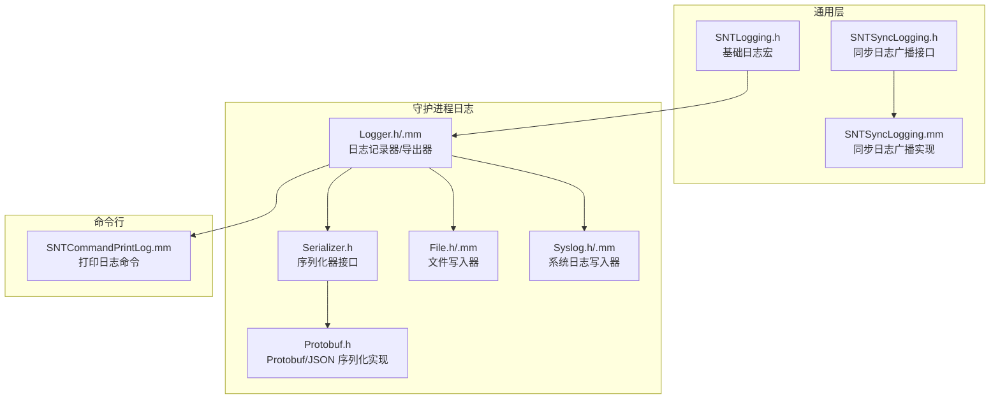
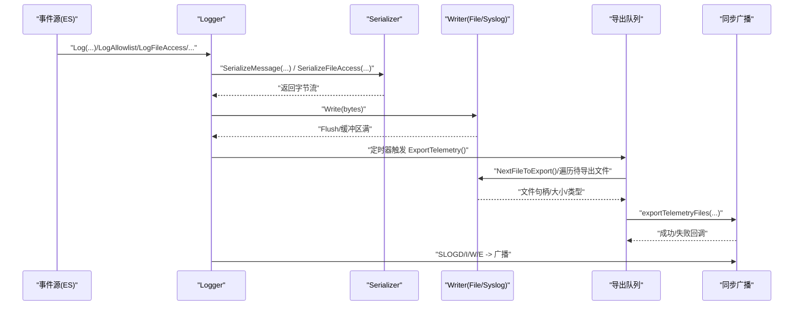
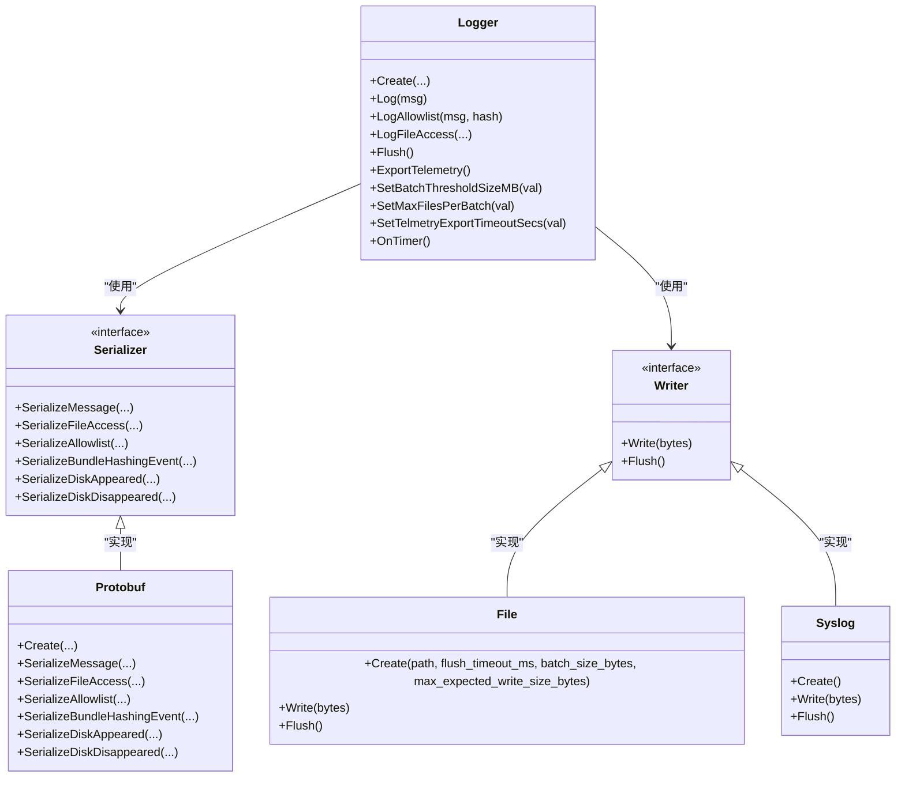
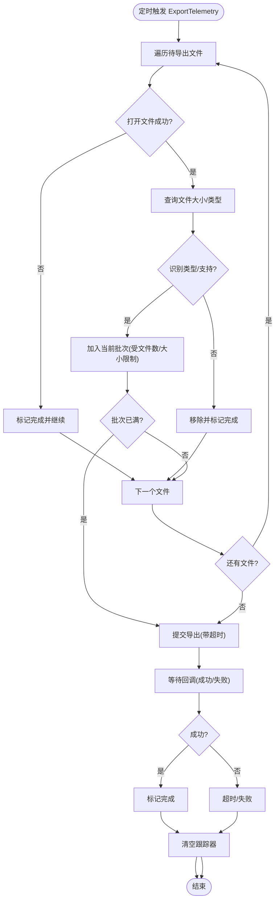
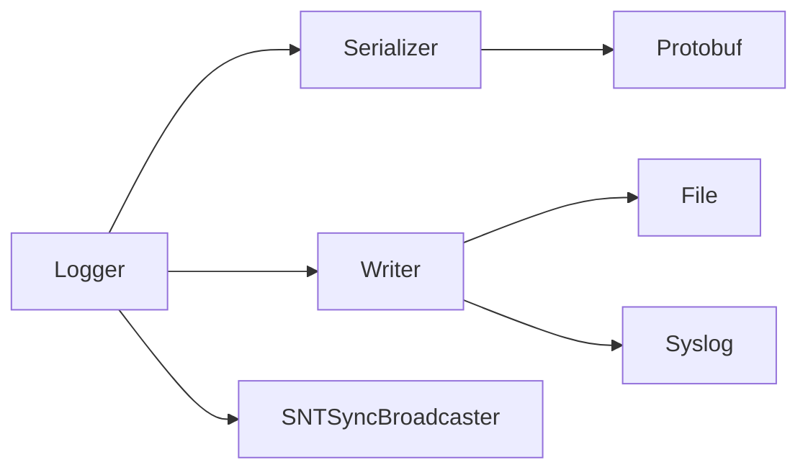

# 日志系统

<cite>
**本文引用的文件**
- [Source/common/SNTLogging.h](file://Source/common/SNTLogging.h)
- [Source/santasyncservice/SNTSyncLogging.h](file://Source/santasyncservice/SNTSyncLogging.h)
- [Source/santasyncservice/SNTSyncLogging.mm](file://Source/santasyncservice/SNTSyncLogging.mm)
- [Source/santad/Logs/EndpointSecurity/Logger.h](file://Source/santad/Logs/EndpointSecurity/Logger.h)
- [Source/santad/Logs/EndpointSecurity/Logger.mm](file://Source/santad/Logs/EndpointSecurity/Logger.mm)
- [Source/santad/Logs/EndpointSecurity/Serializers/Serializer.h](file://Source/santad/Logs/EndpointSecurity/Serializers/Serializer.h)
- [Source/santad/Logs/EndpointSecurity/Serializers/Protobuf.h](file://Source/santad/Logs/EndpointSecurity/Serializers/Protobuf.h)
- [Source/santad/Logs/EndpointSecurity/Writers/File.h](file://Source/santad/Logs/EndpointSecurity/Writers/File.h)
- [Source/santad/Logs/EndpointSecurity/Writers/File.mm](file://Source/santad/Logs/EndpointSecurity/Writers/File.mm)
- [Source/santad/Logs/EndpointSecurity/Writers/Syslog.h](file://Source/santad/Logs/EndpointSecurity/Writers/Syslog.h)
- [Source/santad/Logs/EndpointSecurity/Writers/Syslog.mm](file://Source/santad/Logs/EndpointSecurity/Writers/Syslog.mm)
- [Source/santactl/Commands/SNTCommandPrintLog.mm](file://Source/santactl/Commands/SNTCommandPrintLog.mm)
</cite>

## 目录
1. [简介](#简介)
2. [项目结构](#项目结构)
3. [核心组件](#核心组件)
4. [架构总览](#架构总览)
5. [详细组件分析](#详细组件分析)
6. [依赖关系分析](#依赖关系分析)
7. [性能考虑](#性能考虑)
8. [故障排除指南](#故障排除指南)
9. [结论](#结论)
10. [附录](#附录)

## 简介
本文件为 Santa 日志系统的全面技术文档，覆盖日志级别、日志格式、输出目标、事件分类与用途、序列化机制、格式转换器、写入器设计、日志轮转与存储管理、导出与清理、分析与监控集成、隐私与合规、故障排除与性能优化等主题。文档以源码为依据，结合类图、时序图与流程图，帮助开发者与运维人员理解并正确使用日志体系。

## 项目结构
Santa 的日志体系主要分布在以下模块：
- 通用日志宏与同步日志广播：common 与 syncservice
- ES（EndpointSecurity）日志记录器与导出：santad/Logs/EndpointSecurity
- 序列化器与写入器：santad/Logs/EndpointSecurity/Serializers 与 Writers
- 命令行查看日志：santactl/Commands

图表来源
- [Source/common/SNTLogging.h](file://Source/common/SNTLogging.h#L23-L66)
- [Source/santasyncservice/SNTSyncLogging.h](file://Source/santasyncservice/SNTSyncLogging.h#L23-L47)
- [Source/santasyncservice/SNTSyncLogging.mm](file://Source/santasyncservice/SNTSyncLogging.mm#L16-L23)
- [Source/santad/Logs/EndpointSecurity/Logger.h](file://Source/santad/Logs/EndpointSecurity/Logger.h#L47-L114)
- [Source/santad/Logs/EndpointSecurity/Logger.mm](file://Source/santad/Logs/EndpointSecurity/Logger.mm#L60-L132)
- [Source/santad/Logs/EndpointSecurity/Serializers/Serializer.h](file://Source/santad/Logs/EndpointSecurity/Serializers/Serializer.h#L36-L133)
- [Source/santad/Logs/EndpointSecurity/Serializers/Protobuf.h](file://Source/santad/Logs/EndpointSecurity/Serializers/Protobuf.h#L37-L117)
- [Source/santad/Logs/EndpointSecurity/Writers/File.h](file://Source/santad/Logs/EndpointSecurity/Writers/File.h#L31-L76)
- [Source/santad/Logs/EndpointSecurity/Writers/File.mm](file://Source/santad/Logs/EndpointSecurity/Writers/File.mm#L23-L80)
- [Source/santad/Logs/EndpointSecurity/Writers/Syslog.h](file://Source/santad/Logs/EndpointSecurity/Writers/Syslog.h#L24-L35)
- [Source/santad/Logs/EndpointSecurity/Writers/Syslog.mm](file://Source/santad/Logs/EndpointSecurity/Writers/Syslog.mm#L26-L35)
- [Source/santactl/Commands/SNTCommandPrintLog.mm](file://Source/santactl/Commands/SNTCommandPrintLog.mm)

章节来源
- [Source/common/SNTLogging.h](file://Source/common/SNTLogging.h#L23-L66)
- [Source/santasyncservice/SNTSyncLogging.h](file://Source/santasyncservice/SNTSyncLogging.h#L23-L47)
- [Source/santasyncservice/SNTSyncLogging.mm](file://Source/santasyncservice/SNTSyncLogging.mm#L16-L23)
- [Source/santad/Logs/EndpointSecurity/Logger.h](file://Source/santad/Logs/EndpointSecurity/Logger.h#L47-L114)
- [Source/santad/Logs/EndpointSecurity/Logger.mm](file://Source/santad/Logs/EndpointSecurity/Logger.mm#L60-L132)
- [Source/santad/Logs/EndpointSecurity/Serializers/Serializer.h](file://Source/santad/Logs/EndpointSecurity/Serializers/Serializer.h#L36-L133)
- [Source/santad/Logs/EndpointSecurity/Serializers/Protobuf.h](file://Source/santad/Logs/EndpointSecurity/Serializers/Protobuf.h#L37-L117)
- [Source/santad/Logs/EndpointSecurity/Writers/File.h](file://Source/santad/Logs/EndpointSecurity/Writers/File.h#L31-L76)
- [Source/santad/Logs/EndpointSecurity/Writers/File.mm](file://Source/santad/Logs/EndpointSecurity/Writers/File.mm#L23-L80)
- [Source/santad/Logs/EndpointSecurity/Writers/Syslog.h](file://Source/santad/Logs/EndpointSecurity/Writers/Syslog.h#L24-L35)
- [Source/santad/Logs/EndpointSecurity/Writers/Syslog.mm](file://Source/santad/Logs/EndpointSecurity/Writers/Syslog.mm#L26-L35)
- [Source/santactl/Commands/SNTCommandPrintLog.mm](file://Source/santactl/Commands/SNTCommandPrintLog.mm)

## 核心组件
- 日志级别与输出
  - 基础级别：DEBUG/INFO/WARNING/ERROR，通过系统日志接口输出。
  - TEE 变体：同时输出到系统日志与标准输出/错误流，便于命令行工具使用。
- 同步日志广播
  - 将日志消息同时广播给活动的监听者（如命令行或 UI），用于实时反馈。
- 日志记录器（Logger）
  - 负责根据配置选择合适的序列化器与写入器组合，并在定时器触发时执行遥测导出。
- 序列化器（Serializer）
  - 定义统一的序列化接口，支持多种事件类型；可按需扩展为 Protobuf 或 JSON。
- 写入器（Writer）
  - 文件写入器与系统日志写入器，分别负责持久化与系统日志通道输出。
- 导出与批处理
  - 支持按大小与数量限制进行批量导出，具备超时控制与完成状态跟踪。

章节来源
- [Source/common/SNTLogging.h](file://Source/common/SNTLogging.h#L23-L66)
- [Source/santasyncservice/SNTSyncLogging.h](file://Source/santasyncservice/SNTSyncLogging.h#L23-L47)
- [Source/santasyncservice/SNTSyncLogging.mm](file://Source/santasyncservice/SNTSyncLogging.mm#L16-L23)
- [Source/santad/Logs/EndpointSecurity/Logger.h](file://Source/santad/Logs/EndpointSecurity/Logger.h#L47-L114)
- [Source/santad/Logs/EndpointSecurity/Logger.mm](file://Source/santad/Logs/EndpointSecurity/Logger.mm#L247-L391)
- [Source/santad/Logs/EndpointSecurity/Serializers/Serializer.h](file://Source/santad/Logs/EndpointSecurity/Serializers/Serializer.h#L36-L133)
- [Source/santad/Logs/EndpointSecurity/Serializers/Protobuf.h](file://Source/santad/Logs/EndpointSecurity/Serializers/Protobuf.h#L37-L117)
- [Source/santad/Logs/EndpointSecurity/Writers/File.h](file://Source/santad/Logs/EndpointSecurity/Writers/File.h#L31-L76)
- [Source/santad/Logs/EndpointSecurity/Writers/Syslog.h](file://Source/santad/Logs/EndpointSecurity/Writers/Syslog.h#L24-L35)

## 架构总览
下图展示了从事件产生到日志落盘/系统日志输出的整体流程，以及遥测导出路径。

图表来源
- [Source/santad/Logs/EndpointSecurity/Logger.mm](file://Source/santad/Logs/EndpointSecurity/Logger.mm#L393-L445)
- [Source/santad/Logs/EndpointSecurity/Serializers/Serializer.h](file://Source/santad/Logs/EndpointSecurity/Serializers/Serializer.h#L36-L133)
- [Source/santad/Logs/EndpointSecurity/Writers/File.mm](file://Source/santad/Logs/EndpointSecurity/Writers/File.mm#L95-L145)
- [Source/santasyncservice/SNTSyncLogging.h](file://Source/santasyncservice/SNTSyncLogging.h#L23-L47)
- [Source/santasyncservice/SNTSyncLogging.mm](file://Source/santasyncservice/SNTSyncLogging.mm#L16-L23)

## 详细组件分析

### 日志级别与输出目标
- 系统日志级别
  - DEBUG/INFO/WARNING/ERROR 对应系统日志类型，适用于守护进程与服务日志。
  - TEE_* 变体在输出系统日志的同时，将文本写入 stdout/stderr，便于命令行工具与终端观察。
- 同步日志广播
  - 提供 SLOGD/I/W/E 宏，将消息同时发送至标准日志管道与活动监听者，便于实时展示。

章节来源
- [Source/common/SNTLogging.h](file://Source/common/SNTLogging.h#L23-L66)
- [Source/santasyncservice/SNTSyncLogging.h](file://Source/santasyncservice/SNTSyncLogging.h#L23-L47)
- [Source/santasyncservice/SNTSyncLogging.mm](file://Source/santasyncservice/SNTSyncLogging.mm#L16-L23)

### 日志记录器（Logger）与导出
- 组合策略
  - 根据配置选择序列化器与写入器组合，支持文件、系统日志、空写入、Protobuf 池化写入、流式压缩写入、JSON 输出等。
- 定时导出
  - 周期性触发导出，按最大文件数与总大小阈值聚合待导出文件，识别文件类型并设置 Content-Type 与扩展名，调用同步队列导出，超时控制与完成状态跟踪。
- 配置参数
  - 批量阈值大小（MB）、每批最大文件数、导出超时（秒）、刷新间隔等，均具备合理边界约束与告警。

图表来源
- [Source/santad/Logs/EndpointSecurity/Logger.h](file://Source/santad/Logs/EndpointSecurity/Logger.h#L47-L114)
- [Source/santad/Logs/EndpointSecurity/Logger.mm](file://Source/santad/Logs/EndpointSecurity/Logger.mm#L60-L132)
- [Source/santad/Logs/EndpointSecurity/Serializers/Serializer.h](file://Source/santad/Logs/EndpointSecurity/Serializers/Serializer.h#L36-L133)
- [Source/santad/Logs/EndpointSecurity/Serializers/Protobuf.h](file://Source/santad/Logs/EndpointSecurity/Serializers/Protobuf.h#L37-L117)
- [Source/santad/Logs/EndpointSecurity/Writers/File.h](file://Source/santad/Logs/EndpointSecurity/Writers/File.h#L31-L76)
- [Source/santad/Logs/EndpointSecurity/Writers/Syslog.h](file://Source/santad/Logs/EndpointSecurity/Writers/Syslog.h#L24-L35)

章节来源
- [Source/santad/Logs/EndpointSecurity/Logger.h](file://Source/santad/Logs/EndpointSecurity/Logger.h#L47-L114)
- [Source/santad/Logs/EndpointSecurity/Logger.mm](file://Source/santad/Logs/EndpointSecurity/Logger.mm#L60-L132)
- [Source/santad/Logs/EndpointSecurity/Logger.mm](file://Source/santad/Logs/EndpointSecurity/Logger.mm#L247-L391)

### 序列化机制与格式转换器
- 接口设计
  - Serializer 定义了对各类 ES 事件的序列化方法，派生类可按需实现。
- Protobuf 实现
  - 提供 Protobuf 二进制与 JSON 两种输出形式（通过布尔开关），统一生成消息对象并最终序列化为字节流。
- 机器标识装饰
  - 支持启用机器 ID 装饰并在需要时更新，便于跨主机关联与审计。

章节来源
- [Source/santad/Logs/EndpointSecurity/Serializers/Serializer.h](file://Source/santad/Logs/EndpointSecurity/Serializers/Serializer.h#L36-L133)
- [Source/santad/Logs/EndpointSecurity/Serializers/Protobuf.h](file://Source/santad/Logs/EndpointSecurity/Serializers/Protobuf.h#L37-L117)

### 写入器设计
- 文件写入器（File）
  - 使用环形缓冲与定时刷新，支持容量自动扩容、VNode 监听文件被删除/重命名后自动重建句柄。
- 系统日志写入器（Syslog）
  - 将日志以系统日志形式输出，单行长度限制，避免过长日志造成性能问题。

章节来源
- [Source/santad/Logs/EndpointSecurity/Writers/File.h](file://Source/santad/Logs/EndpointSecurity/Writers/File.h#L31-L76)
- [Source/santad/Logs/EndpointSecurity/Writers/File.mm](file://Source/santad/Logs/EndpointSecurity/Writers/File.mm#L23-L80)
- [Source/santad/Logs/EndpointSecurity/Writers/File.mm](file://Source/santad/Logs/EndpointSecurity/Writers/File.mm#L95-L145)
- [Source/santad/Logs/EndpointSecurity/Writers/Syslog.h](file://Source/santad/Logs/EndpointSecurity/Writers/Syslog.h#L24-L35)
- [Source/santad/Logs/EndpointSecurity/Writers/Syslog.mm](file://Source/santad/Logs/EndpointSecurity/Writers/Syslog.mm#L26-L35)

### 日志导出与清理
- 导出流程
  - 定时扫描待导出文件，识别文件类型（流式/压缩），聚合到批次，设置 Content-Type 与扩展名，调用同步队列导出，超时等待并根据结果标记完成或重试。
- 清理与跟踪
  - 使用跟踪器记录每个文件的导出状态，成功后标记完成，失败则在超时后重试；支持批量关闭文件句柄并清理状态。

图表来源
- [Source/santad/Logs/EndpointSecurity/Logger.mm](file://Source/santad/Logs/EndpointSecurity/Logger.mm#L252-L391)

章节来源
- [Source/santad/Logs/EndpointSecurity/Logger.mm](file://Source/santad/Logs/EndpointSecurity/Logger.mm#L252-L391)

### 日志轮转策略与存储管理
- 文件写入器的轮转
  - 通过 VNode 监听文件被删除/重命名，自动重建句柄并继续写入，确保在外部轮转工具替换文件时仍能持续写入。
- 存储阈值与批处理
  - 通过配置项控制目录总大小、单文件大小、刷新超时、导出批次阈值与最大文件数，避免磁盘压力过大。

章节来源
- [Source/santad/Logs/EndpointSecurity/Writers/File.mm](file://Source/santad/Logs/EndpointSecurity/Writers/File.mm#L61-L77)
- [Source/santad/Logs/EndpointSecurity/Writers/File.mm](file://Source/santad/Logs/EndpointSecurity/Writers/File.mm#L95-L145)
- [Source/santad/Logs/EndpointSecurity/Logger.mm](file://Source/santad/Logs/EndpointSecurity/Logger.mm#L166-L209)

### 事件日志、系统日志与调试日志
- 事件日志
  - 由 ES 事件丰富后的消息经序列化后写入，支持多种输出目标（文件、系统日志、池化/流式压缩）。
- 系统日志
  - 通过系统日志接口输出，便于系统级收集与分析。
- 调试日志
  - DEBUG 级别日志用于开发与排障，可在生产中按需开启。

章节来源
- [Source/common/SNTLogging.h](file://Source/common/SNTLogging.h#L23-L66)
- [Source/santad/Logs/EndpointSecurity/Logger.mm](file://Source/santad/Logs/EndpointSecurity/Logger.mm#L393-L445)

### 日志分析工具与监控集成
- 命令行查看
  - 提供打印日志命令，便于在终端查看当前日志状态与内容。
- 同步广播
  - 日志可通过广播机制分发到活动监听者，便于 UI 或 CLI 工具实时展示。

章节来源
- [Source/santactl/Commands/SNTCommandPrintLog.mm](file://Source/santactl/Commands/SNTCommandPrintLog.mm)
- [Source/santasyncservice/SNTSyncLogging.h](file://Source/santasyncservice/SNTSyncLogging.h#L23-L47)
- [Source/santasyncservice/SNTSyncLogging.mm](file://Source/santasyncservice/SNTSyncLogging.mm#L16-L23)

### 隐私保护、敏感信息过滤与合规
- 机器标识装饰
  - 支持启用机器 ID 装饰，便于审计关联；在需要时可更新以保持一致性。
- 敏感信息处理
  - 代码未直接暴露敏感字段；序列化器提供统一接口，可在实现中按合规要求进行脱敏或裁剪。
- 合规建议
  - 在生产环境中谨慎开启 DEBUG 级别日志；对导出数据进行最小化原则处理，遵守本地法规。

章节来源
- [Source/santad/Logs/EndpointSecurity/Serializers/Serializer.h](file://Source/santad/Logs/EndpointSecurity/Serializers/Serializer.h#L48-L51)
- [Source/santad/Logs/EndpointSecurity/Logger.mm](file://Source/santad/Logs/EndpointSecurity/Logger.mm#L441-L445)

## 依赖关系分析
- Logger 依赖 Serializer 与 Writer 接口，具体实现由配置决定。
- Serializer 依赖决策缓存与平台能力，Protobuf 实现依赖 Protobuf 编解码。
- Writer 的 File 实现依赖文件系统与异步队列，Syslog 实现依赖系统日志接口。
- 同步日志广播依赖广播器组件，向活动监听者推送日志。

图表来源
- [Source/santad/Logs/EndpointSecurity/Logger.h](file://Source/santad/Logs/EndpointSecurity/Logger.h#L47-L114)
- [Source/santad/Logs/EndpointSecurity/Serializers/Serializer.h](file://Source/santad/Logs/EndpointSecurity/Serializers/Serializer.h#L36-L133)
- [Source/santad/Logs/EndpointSecurity/Serializers/Protobuf.h](file://Source/santad/Logs/EndpointSecurity/Serializers/Protobuf.h#L37-L117)
- [Source/santad/Logs/EndpointSecurity/Writers/File.h](file://Source/santad/Logs/EndpointSecurity/Writers/File.h#L31-L76)
- [Source/santad/Logs/EndpointSecurity/Writers/Syslog.h](file://Source/santad/Logs/EndpointSecurity/Writers/Syslog.h#L24-L35)
- [Source/santasyncservice/SNTSyncLogging.h](file://Source/santasyncservice/SNTSyncLogging.h#L23-L47)

章节来源
- [Source/santad/Logs/EndpointSecurity/Logger.h](file://Source/santad/Logs/EndpointSecurity/Logger.h#L47-L114)
- [Source/santad/Logs/EndpointSecurity/Serializers/Serializer.h](file://Source/santad/Logs/EndpointSecurity/Serializers/Serializer.h#L36-L133)
- [Source/santad/Logs/EndpointSecurity/Serializers/Protobuf.h](file://Source/santad/Logs/EndpointSecurity/Serializers/Protobuf.h#L37-L117)
- [Source/santad/Logs/EndpointSecurity/Writers/File.h](file://Source/santad/Logs/EndpointSecurity/Writers/File.h#L31-L76)
- [Source/santad/Logs/EndpointSecurity/Writers/Syslog.h](file://Source/santad/Logs/EndpointSecurity/Writers/Syslog.h#L24-L35)
- [Source/santasyncservice/SNTSyncLogging.h](file://Source/santasyncservice/SNTSyncLogging.h#L23-L47)

## 性能考虑
- 缓冲与批处理
  - 文件写入器采用环形缓冲与定时刷新，减少系统调用次数；缓冲区容量动态扩容，避免频繁分配。
- 导出批处理
  - 通过最大文件数与总大小阈值聚合导出，降低网络与 IO 压力；超时控制避免长时间阻塞。
- 日志级别与输出
  - DEBUG 级别日志仅在必要时开启；TEE 变体会同时写入 stdout/stderr，注意对 CLI 工作流的影响。
- 单行长度限制
  - 系统日志写入器对单行长度有限制，避免过长日志导致性能问题。

章节来源
- [Source/santad/Logs/EndpointSecurity/Writers/File.mm](file://Source/santad/Logs/EndpointSecurity/Writers/File.mm#L122-L145)
- [Source/santad/Logs/EndpointSecurity/Writers/Syslog.mm](file://Source/santad/Logs/EndpointSecurity/Writers/Syslog.mm#L26-L35)
- [Source/santad/Logs/EndpointSecurity/Logger.mm](file://Source/santad/Logs/EndpointSecurity/Logger.mm#L166-L209)

## 故障排除指南
- 日志未见输出
  - 检查日志级别是否过高；确认是否使用 TEE 变体以便在终端看到输出。
- 导出失败或超时
  - 查看导出超时设置与网络状况；检查待导出文件类型识别与文件句柄状态。
- 文件轮转后无日志
  - 确认 VNode 监听是否生效，文件被重命名/删除后是否重建句柄。
- 同步日志未显示
  - 确认存在活动监听者；检查广播器状态。

章节来源
- [Source/common/SNTLogging.h](file://Source/common/SNTLogging.h#L23-L66)
- [Source/santasyncservice/SNTSyncLogging.h](file://Source/santasyncservice/SNTSyncLogging.h#L23-L47)
- [Source/santasyncservice/SNTSyncLogging.mm](file://Source/santasyncservice/SNTSyncLogging.mm#L16-L23)
- [Source/santad/Logs/EndpointSecurity/Writers/File.mm](file://Source/santad/Logs/EndpointSecurity/Writers/File.mm#L61-L77)
- [Source/santad/Logs/EndpointSecurity/Logger.mm](file://Source/santad/Logs/EndpointSecurity/Logger.mm#L252-L391)

## 结论
Santa 的日志系统以清晰的分层设计实现了事件采集、序列化、多目标输出与遥测导出。通过缓冲与批处理优化性能，通过类型识别与超时控制保障可靠性，通过同步广播增强可观测性。建议在生产环境合理配置日志级别与导出策略，结合外部轮转工具与合规要求，确保日志的可用性与安全性。

## 附录
- 关键配置项（示例）
  - 批量阈值大小（MB）：1–5120（默认由实现限定）
  - 每批最大文件数：1–100（默认由实现限定）
  - 导出超时（秒）：1–600（默认由实现限定）
  - 刷新间隔（毫秒）：固定常量（文件写入器）
  - 单行最大长度：1024（系统日志写入器）

章节来源
- [Source/santad/Logs/EndpointSecurity/Logger.mm](file://Source/santad/Logs/EndpointSecurity/Logger.mm#L166-L209)
- [Source/santad/Logs/EndpointSecurity/Writers/File.mm](file://Source/santad/Logs/EndpointSecurity/Writers/File.mm#L23-L48)
- [Source/santad/Logs/EndpointSecurity/Writers/Syslog.mm](file://Source/santad/Logs/EndpointSecurity/Writers/Syslog.mm#L26-L35)