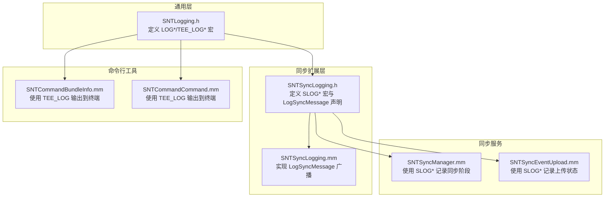
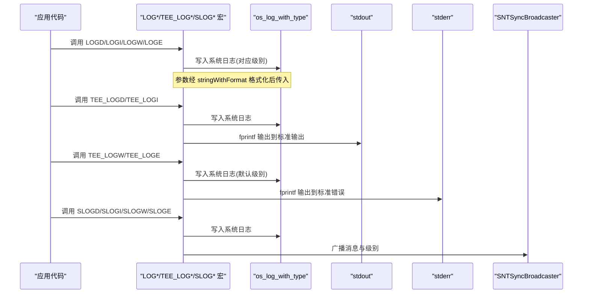
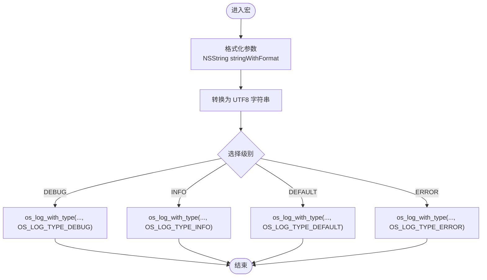
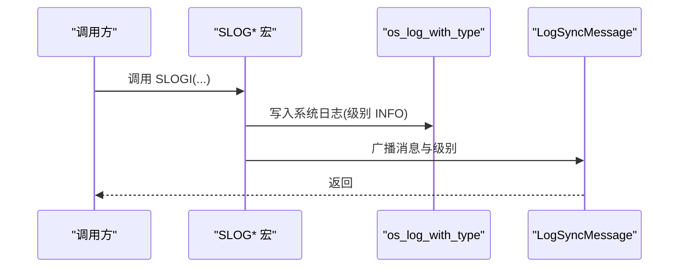
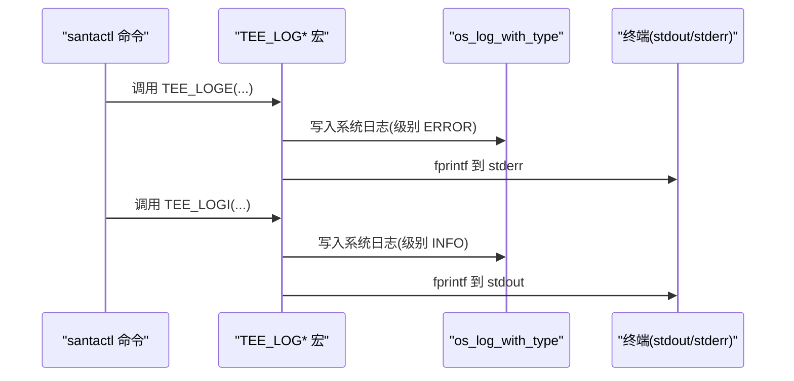
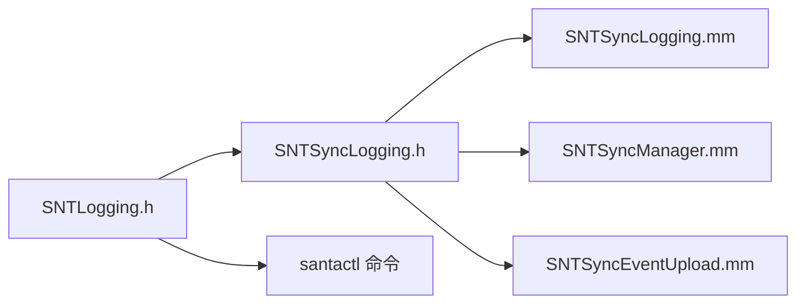

# 日志级别与格式

<cite>
**本文引用的文件**
- [Source/common/SNTLogging.h](file://Source/common/SNTLogging.h)
- [Source/santasyncservice/SNTSyncLogging.h](file://Source/santasyncservice/SNTSyncLogging.h)
- [Source/santasyncservice/SNTSyncLogging.mm](file://Source/santasyncservice/SNTSyncLogging.mm)
- [Source/santactl/Commands/SNTCommandBundleInfo.mm](file://Source/santactl/Commands/SNTCommandBundleInfo.mm)
- [Source/santactl/Commands/SNTCommandCommand.mm](file://Source/santactl/Commands/SNTCommandCommand.mm)
- [Source/santasyncservice/SNTSyncManager.mm](file://Source/santasyncservice/SNTSyncManager.mm)
- [Source/santasyncservice/SNTSyncEventUpload.mm](file://Source/santasyncservice/SNTSyncEventUpload.mm)
</cite>

## 目录
1. 引言
2. 项目结构
3. 核心组件
4. 架构总览
5. 详细组件分析
6. 依赖关系分析
7. 性能考量
8. 故障排查指南
9. 结论
10. 附录

## 引言
本文件系统性梳理 Santa 项目的日志体系，重点覆盖以下方面：
- 日志级别：OS_LOG_TYPE_DEBUG、OS_LOG_TYPE_INFO、OS_LOG_TYPE_DEFAULT、OS_LOG_TYPE_ERROR 的定义与使用场景
- 宏定义：LOGD、LOGI、LOGW、LOGE 的实现原理与调用方式
- TEE_LOG 系列：TEE_LOGD、TEE_LOGI、TEE_LOGW、TEE_LOGE 的设计目的与行为差异（同时输出到系统日志与标准输出/错误输出）
- 日志格式化规范、参数传递机制与性能考虑
- 实际使用示例与最佳实践建议

## 项目结构
围绕日志功能的核心文件分布如下：
- 通用日志头文件：定义基础日志宏与格式化逻辑
- 同步日志扩展：在系统日志之外，将日志广播给同步监听者
- 命令行工具日志：santactl 使用 TEE_LOG 将关键信息同时输出到终端
- 同步服务日志：通过 SLOG* 宏记录同步流程的关键节点

图表来源
- [Source/common/SNTLogging.h](file://Source/common/SNTLogging.h#L25-L68)
- [Source/santasyncservice/SNTSyncLogging.h](file://Source/santasyncservice/SNTSyncLogging.h#L16-L49)
- [Source/santasyncservice/SNTSyncLogging.mm](file://Source/santasyncservice/SNTSyncLogging.mm#L16-L23)
- [Source/santactl/Commands/SNTCommandBundleInfo.mm](file://Source/santactl/Commands/SNTCommandBundleInfo.mm#L50-L87)
- [Source/santactl/Commands/SNTCommandCommand.mm](file://Source/santactl/Commands/SNTCommandCommand.mm#L150-L197)
- [Source/santasyncservice/SNTSyncManager.mm](file://Source/santasyncservice/SNTSyncManager.mm#L209-L441)
- [Source/santasyncservice/SNTSyncEventUpload.mm](file://Source/santasyncservice/SNTSyncEventUpload.mm#L72-L85)

章节来源
- [Source/common/SNTLogging.h](file://Source/common/SNTLogging.h#L25-L68)
- [Source/santasyncservice/SNTSyncLogging.h](file://Source/santasyncservice/SNTSyncLogging.h#L16-L49)
- [Source/santasyncservice/SNTSyncLogging.mm](file://Source/santasyncservice/SNTSyncLogging.mm#L16-L23)

## 核心组件
- 通用日志宏（SNTLogging.h）
  - SNT_LOG_WITH_TYPE：封装 os_log_with_type，统一格式化为公共字符串
  - LOGD/LOGI/LOGW/LOGE：分别映射到 OS_LOG_TYPE_DEBUG/INFO/DEFAULT/ERROR
  - SNT_PRINT_LOG：将格式化后的消息写入指定文件指针（stdout/stderr）
  - TEE_LOGD/TEE_LOGI/TEE_LOGW/TEE_LOGE：在系统日志基础上，同时输出到 stdout 或 stderr
- 同步日志扩展（SNTSyncLogging.h/.mm）
  - SLOGD/SLOGI/SLOGW/SLOGE：在系统日志基础上，额外广播给同步监听者
  - LogSyncMessage：实现广播逻辑（由 .mm 文件提供）

章节来源
- [Source/common/SNTLogging.h](file://Source/common/SNTLogging.h#L25-L68)
- [Source/santasyncservice/SNTSyncLogging.h](file://Source/santasyncservice/SNTSyncLogging.h#L23-L46)
- [Source/santasyncservice/SNTSyncLogging.mm](file://Source/santasyncservice/SNTSyncLogging.mm#L16-L23)

## 架构总览
下图展示从应用代码到系统日志与同步广播的整体路径，以及 TEE_LOG 对终端输出的影响。

图表来源
- [Source/common/SNTLogging.h](file://Source/common/SNTLogging.h#L25-L68)
- [Source/santasyncservice/SNTSyncLogging.h](file://Source/santasyncservice/SNTSyncLogging.h#L23-L46)
- [Source/santasyncservice/SNTSyncLogging.mm](file://Source/santasyncservice/SNTSyncLogging.mm#L16-L23)

## 详细组件分析

### 通用日志宏（LOG*/TEE_LOG*）
- 实现要点
  - SNT_LOG_WITH_TYPE：将可变参数格式化为 NSString，再转为 UTF8 字符串，以“公共字符串”形式写入系统日志，避免敏感信息泄露
  - LOGD/LOGI/LOGW/LOGE：分别绑定到 OS_LOG_TYPE_DEBUG/INFO/DEFAULT/ERROR
  - SNT_PRINT_LOG：将格式化后的消息写入指定文件指针（用于 TEE_LOG）
  - TEE_LOGD/TEE_LOGI：同时输出到系统日志与 stdout
  - TEE_LOGW/TEE_LOGE：同时输出到系统日志与 stderr，避免污染 stdout
- 使用场景
  - LOG*：常规系统日志记录，遵循 os_log 的级别语义
  - TEE_LOG*：santactl 等命令行工具需要将关键信息同时显示在终端时使用

图表来源
- [Source/common/SNTLogging.h](file://Source/common/SNTLogging.h#L25-L35)

章节来源
- [Source/common/SNTLogging.h](file://Source/common/SNTLogging.h#L25-L68)

### 同步日志扩展（SLOG*）
- 设计目的
  - 在系统日志之外，将日志消息广播给当前活跃的同步监听者（如 santactl 或 UI），便于实时反馈
- 实现机制
  - SLOGD/SLOGI/SLOGW/SLOGE：先写系统日志，再调用 LogSyncMessage
  - LogSyncMessage：通过广播器将消息与级别传递给监听者
- 使用场景
  - 同步服务运行期间的关键阶段（预检、事件上传、规则下载、收尾）记录与广播

图表来源
- [Source/santasyncservice/SNTSyncLogging.h](file://Source/santasyncservice/SNTSyncLogging.h#L23-L46)
- [Source/santasyncservice/SNTSyncLogging.mm](file://Source/santasyncservice/SNTSyncLogging.mm#L16-L23)

章节来源
- [Source/santasyncservice/SNTSyncLogging.h](file://Source/santasyncservice/SNTSyncLogging.h#L23-L46)
- [Source/santasyncservice/SNTSyncLogging.mm](file://Source/santasyncservice/SNTSyncLogging.mm#L16-L23)

### 命令行工具日志（TEE_LOG*）
- 设计目的
  - 保证用户在终端中即时看到关键信息，同时保留系统日志以便审计与分析
- 行为差异
  - TEE_LOGI/TEE_LOGD：输出到 stdout
  - TEE_LOGW/TEE_LOGE：输出到 stderr，避免与 stdout 流混杂
- 典型使用
  - 错误处理与状态提示：如命令超时、无效响应、失败原因等
  - 成功结果与统计：如进程被成功终止的数量、哈希计算耗时等

图表来源
- [Source/common/SNTLogging.h](file://Source/common/SNTLogging.h#L45-L68)
- [Source/santactl/Commands/SNTCommandCommand.mm](file://Source/santactl/Commands/SNTCommandCommand.mm#L150-L197)
- [Source/santactl/Commands/SNTCommandBundleInfo.mm](file://Source/santactl/Commands/SNTCommandBundleInfo.mm#L50-L87)

章节来源
- [Source/common/SNTLogging.h](file://Source/common/SNTLogging.h#L37-L68)
- [Source/santactl/Commands/SNTCommandCommand.mm](file://Source/santactl/Commands/SNTCommandCommand.mm#L150-L197)
- [Source/santactl/Commands/SNTCommandBundleInfo.mm](file://Source/santactl/Commands/SNTCommandBundleInfo.mm#L50-L87)

### 同步服务日志（SLOG* 使用示例）
- 关键阶段
  - 预检开始/完成、事件上传开始/完成、规则下载开始/完成、收尾开始/完成
  - 失败与异常：超时、缺少必要配置、不安全传输等
- 示例定位
  - 预检与上传阶段：参见同步管理器与事件上传模块中的 SLOG* 调用位置

章节来源
- [Source/santasyncservice/SNTSyncManager.mm](file://Source/santasyncservice/SNTSyncManager.mm#L209-L441)
- [Source/santasyncservice/SNTSyncEventUpload.mm](file://Source/santasyncservice/SNTSyncEventUpload.mm#L72-L85)

## 依赖关系分析
- 组件耦合
  - 通用日志头文件是所有日志宏的基础，被同步扩展与各模块共享
  - 同步扩展依赖通用日志头文件，并通过 LogSyncMessage 与广播器交互
  - 命令行工具直接依赖通用日志头文件，实现 TEE_LOG* 的终端输出
- 潜在循环依赖
  - 当前结构清晰，无明显循环依赖；同步广播器接口在 .mm 中实现，避免头文件循环
- 外部依赖
  - os_log：Apple 系统日志基础设施
  - Foundation：NSString 格式化与 UTF8 转换

图表来源
- [Source/common/SNTLogging.h](file://Source/common/SNTLogging.h#L25-L68)
- [Source/santasyncservice/SNTSyncLogging.h](file://Source/santasyncservice/SNTSyncLogging.h#L16-L49)
- [Source/santasyncservice/SNTSyncLogging.mm](file://Source/santasyncservice/SNTSyncLogging.mm#L16-L23)
- [Source/santasyncservice/SNTSyncManager.mm](file://Source/santasyncservice/SNTSyncManager.mm#L209-L441)
- [Source/santasyncservice/SNTSyncEventUpload.mm](file://Source/santasyncservice/SNTSyncEventUpload.mm#L72-L85)

## 性能考量
- 字符串格式化成本
  - 所有日志宏均通过 stringWithFormat 进行格式化，建议仅在必要时构造复杂字符串，避免在高频路径上进行昂贵的格式化
- 缓冲与 I/O
  - fprintf 到 stdout/stderr 可能阻塞或影响吞吐，建议在批量输出时合并或减少调用次数
- 级别过滤
  - 使用 LOGW/TEE_LOGW 时，系统日志级别为 DEFAULT，有助于区分普通警告与错误
- 广播开销
  - SLOG* 会触发广播，若监听者较多或网络延迟较高，需关注广播对主流程的影响

## 故障排查指南
- 确认日志级别是否正确
  - 错误与严重问题使用 LOGE/TEE_LOGE，一般警告使用 LOGW/TEE_LOGW，信息使用 LOGI/TEE_LOGI，调试使用 LOGD
- 检查终端输出
  - 若期望在终端看到输出，请确认使用 TEE_LOGI/TEE_LOGW/TEE_LOGE；其中 TEE_LOGW/TEE_LOGE 会写入 stderr，避免与 stdout 混淆
- 审计与检索
  - 系统日志可通过 os_log 存储与检索；若需跨组件共享，优先使用 SLOG* 以确保广播到同步监听者
- 常见问题定位
  - 命令行工具返回码与日志：结合 TEE_LOG* 的错误输出快速定位失败原因
  - 同步服务异常：通过 SLOG* 记录的阶段信息判断卡点（预检、上传、下载、收尾）

章节来源
- [Source/common/SNTLogging.h](file://Source/common/SNTLogging.h#L37-L68)
- [Source/santactl/Commands/SNTCommandCommand.mm](file://Source/santactl/Commands/SNTCommandCommand.mm#L150-L197)
- [Source/santasyncservice/SNTSyncManager.mm](file://Source/santasyncservice/SNTSyncManager.mm#L209-L441)

## 结论
Santa 的日志体系以通用宏为基础，通过 LOG*/TEE_LOG* 与 SLOG* 实现了系统日志、终端输出与同步广播的多通道覆盖。合理选择日志级别与输出通道，既能满足审计与分析需求，也能提升用户体验与故障定位效率。

## 附录

### 日志级别与使用场景速览
- OS_LOG_TYPE_DEBUG：调试信息，建议仅在开发或开启调试时使用
- OS_LOG_TYPE_INFO：一般性信息，适合记录正常流程的状态
- OS_LOG_TYPE_DEFAULT：普通警告，不影响主流程但需注意
- OS_LOG_TYPE_ERROR：错误与异常，必须记录并采取相应措施

章节来源
- [Source/common/SNTLogging.h](file://Source/common/SNTLogging.h#L31-L35)

### 宏调用方式与参数传递
- 参数传递机制
  - 所有宏支持可变参数，内部通过 stringWithFormat 完成格式化，随后以 UTF8 字符串形式写入系统日志
  - TEE_LOG* 在此基础上追加 fprintf 到 stdout 或 stderr
- 最佳实践
  - 避免在高频路径上构造复杂字符串；必要时延迟格式化
  - 错误与异常使用 ERROR 级别，警告使用 DEFAULT 级别
  - 命令行工具优先使用 TEE_LOG* 保证用户可见性

章节来源
- [Source/common/SNTLogging.h](file://Source/common/SNTLogging.h#L25-L68)