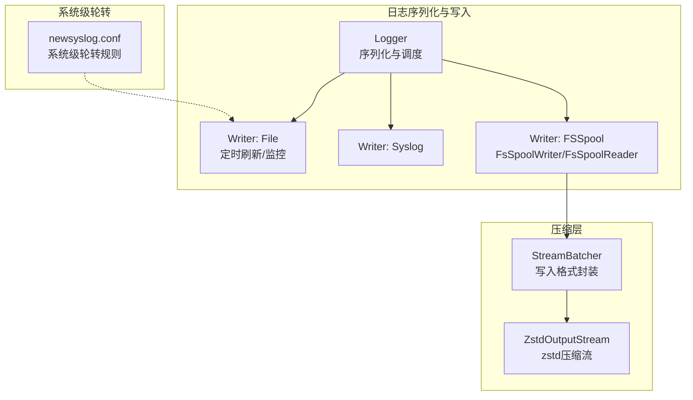
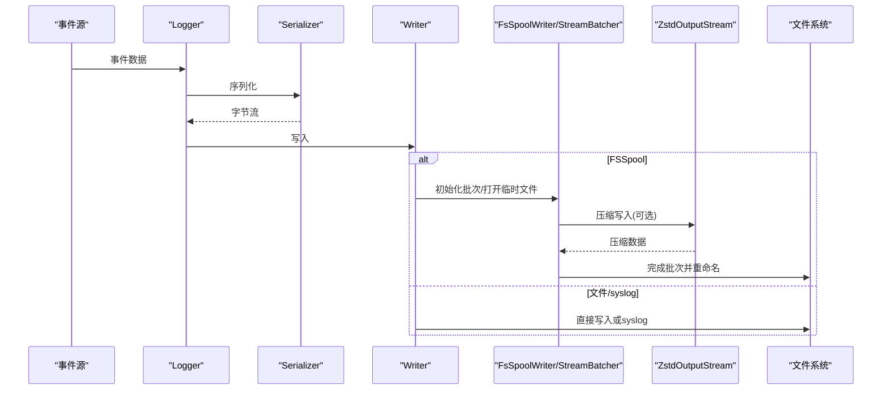
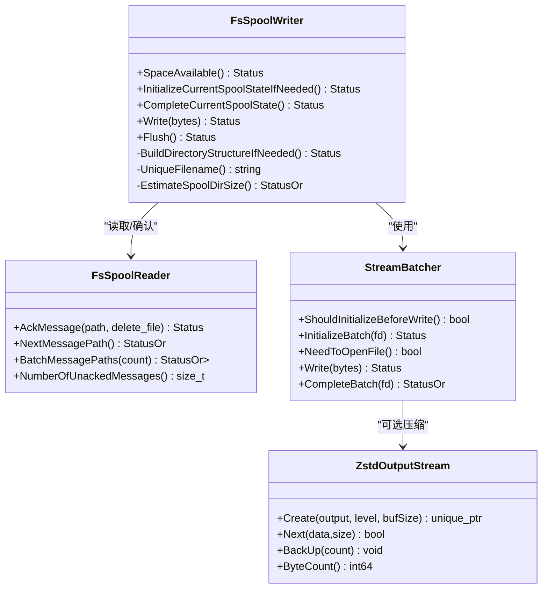
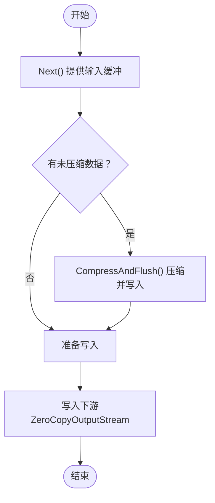
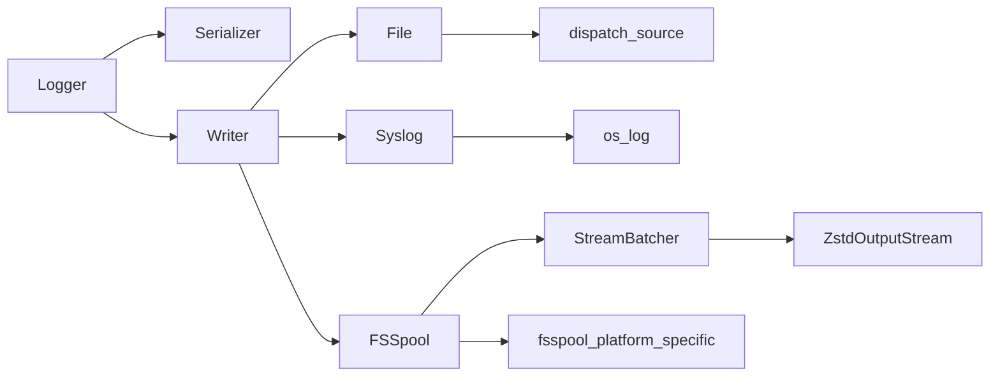

# 日志轮转

<cite>
**本文引用的文件**
- [Conf/com.northpolesec.santa.newsyslog.conf](file://Conf/com.northpolesec.santa.newsyslog.conf)
- [Source/common/SNTLogging.h](file://Source/common/SNTLogging.h)
- [Source/santad/Logs/EndpointSecurity/Logger.mm](file://Source/santad/Logs/EndpointSecurity/Logger.mm)
- [Source/santad/Logs/EndpointSecurity/Writers/FSSpool/fsspool.h](file://Source/santad/Logs/EndpointSecurity/Writers/FSSpool/fsspool.h)
- [Source/santad/Logs/EndpointSecurity/Writers/FSSpool/StreamBatcher.h](file://Source/santad/Logs/EndpointSecurity/Writers/FSSpool/StreamBatcher.h)
- [Source/santad/Logs/EndpointSecurity/Writers/FSSpool/ZstdOutputStream.h](file://Source/santad/Logs/EndpointSecurity/Writers/FSSpool/ZstdOutputStream.h)
- [Source/santad/Logs/EndpointSecurity/Writers/FSSpool/ZstdOutputStream.mm](file://Source/santad/Logs/EndpointSecurity/Writers/FSSpool/ZstdOutputStream.mm)
- [Source/santad/Logs/EndpointSecurity/Writers/FSSpool/fsspool_platform_specific.h](file://Source/santad/Logs/EndpointSecurity/Writers/FSSpool/fsspool_platform_specific.h)
- [Source/santad/Logs/EndpointSecurity/Writers/File.mm](file://Source/santad/Logs/EndpointSecurity/Writers/File.mm)
- [Source/santad/Logs/EndpointSecurity/Writers/Syslog.h](file://Source/santad/Logs/EndpointSecurity/Writers/Syslog.h)
- [Source/santad/Logs/EndpointSecurity/Writers/Syslog.mm](file://Source/santad/Logs/EndpointSecurity/Writers/Syslog.mm)
- [Source/santad/SantadDeps.mm](file://Source/santad/SantadDeps.mm)
- [Source/santad/EventProviders/RateLimiter.mm](file://Source/santad/EventProviders/RateLimiter.mm)
- [Source/santad/SNTApplicationCoreMetrics.mm](file://Source/santad/SNTApplicationCoreMetrics.mm)
</cite>

## 目录
1. [引言](#引言)
2. [项目结构](#项目结构)
3. [核心组件](#核心组件)
4. [架构总览](#架构总览)
5. [详细组件分析](#详细组件分析)
6. [依赖关系分析](#依赖关系分析)
7. [性能考量](#性能考量)
8. [故障排除指南](#故障排除指南)
9. [结论](#结论)
10. [附录](#附录)

## 引言
本文件面向Santa日志轮转系统，围绕以下目标展开：解析newsyslog.conf的语法与参数、阐述FSSpool文件系统级轮转机制（含大小限制、时间触发与空间管理）、说明ZstdOutputStream的zstd压缩集成与性能要点、给出轮转策略配置指南、磁盘空间监控与自动清理建议，并提供故障排除、性能影响分析与存储成本优化建议。

## 项目结构
Santa的日志子系统由“序列化器-写入器”链路构成，支持多种输出目标（文件、syslog、FSSpool等）。newsyslog.conf负责传统文本日志的系统级轮转；FSSpool通过文件系统目录实现高性能、无锁的事件缓冲与轮转；ZstdOutputStream为流式写入提供zstd压缩能力。

图示来源
- [Source/santad/Logs/EndpointSecurity/Logger.mm](file://Source/santad/Logs/EndpointSecurity/Logger.mm#L60-L122)
- [Source/santad/Logs/EndpointSecurity/Writers/File.mm](file://Source/santad/Logs/EndpointSecurity/Writers/File.mm#L29-L67)
- [Source/santad/Logs/EndpointSecurity/Writers/Syslog.h](file://Source/santad/Logs/EndpointSecurity/Writers/Syslog.h#L1-L34)
- [Source/santad/Logs/EndpointSecurity/Writers/FSSpool/StreamBatcher.h](file://Source/santad/Logs/EndpointSecurity/Writers/FSSpool/StreamBatcher.h#L33-L90)
- [Source/santad/Logs/EndpointSecurity/Writers/FSSpool/ZstdOutputStream.h](file://Source/santad/Logs/EndpointSecurity/Writers/FSSpool/ZstdOutputStream.h#L24-L66)
- [Conf/com.northpolesec.santa.newsyslog.conf](file://Conf/com.northpolesec.santa.newsyslog.conf#L1-L3)

章节来源
- [Source/santad/Logs/EndpointSecurity/Logger.mm](file://Source/santad/Logs/EndpointSecurity/Logger.mm#L60-L122)
- [Conf/com.northpolesec.santa.newsyslog.conf](file://Conf/com.northpolesec.santa.newsyslog.conf#L1-L3)

## 核心组件
- syslog与os_log：统一的日志接口，便于在不同输出目标间切换。
- Logger：根据配置选择序列化器与写入器，统一调度导出与阈值控制。
- File Writer：基于dispatch_source的文件写入器，具备定时刷新与VNODE监控。
- Syslog Writer：将消息写入系统日志。
- FSSpool：基于文件系统的事件缓冲与轮转，包含FsSpoolWriter与FsSpoolReader。
- StreamBatcher/ZstdOutputStream：流式写入与zstd压缩，支持可插拔压缩器工厂。

章节来源
- [Source/common/SNTLogging.h](file://Source/common/SNTLogging.h#L23-L68)
- [Source/santad/Logs/EndpointSecurity/Logger.mm](file://Source/santad/Logs/EndpointSecurity/Logger.mm#L60-L122)
- [Source/santad/Logs/EndpointSecurity/Writers/File.mm](file://Source/santad/Logs/EndpointSecurity/Writers/File.mm#L29-L67)
- [Source/santad/Logs/EndpointSecurity/Writers/Syslog.h](file://Source/santad/Logs/EndpointSecurity/Writers/Syslog.h#L1-L34)
- [Source/santad/Logs/EndpointSecurity/Writers/Syslog.mm](file://Source/santad/Logs/EndpointSecurity/Writers/Syslog.mm#L1-L38)
- [Source/santad/Logs/EndpointSecurity/Writers/FSSpool/fsspool.h](file://Source/santad/Logs/EndpointSecurity/Writers/FSSpool/fsspool.h#L64-L118)
- [Source/santad/Logs/EndpointSecurity/Writers/FSSpool/StreamBatcher.h](file://Source/santad/Logs/EndpointSecurity/Writers/FSSpool/StreamBatcher.h#L33-L90)
- [Source/santad/Logs/EndpointSecurity/Writers/FSSpool/ZstdOutputStream.h](file://Source/santad/Logs/EndpointSecurity/Writers/FSSpool/ZstdOutputStream.h#L24-L66)

## 架构总览
下图展示从Logger到具体写入器的调用路径，以及FSSpool的读写流程与压缩链路。

图示来源
- [Source/santad/Logs/EndpointSecurity/Logger.mm](file://Source/santad/Logs/EndpointSecurity/Logger.mm#L60-L122)
- [Source/santad/Logs/EndpointSecurity/Writers/FSSpool/StreamBatcher.h](file://Source/santad/Logs/EndpointSecurity/Writers/FSSpool/StreamBatcher.h#L33-L90)
- [Source/santad/Logs/EndpointSecurity/Writers/FSSpool/ZstdOutputStream.mm](file://Source/santad/Logs/EndpointSecurity/Writers/FSSpool/ZstdOutputStream.mm#L23-L52)
- [Source/santad/Logs/EndpointSecurity/Writers/File.mm](file://Source/santad/Logs/EndpointSecurity/Writers/File.mm#L29-L67)
- [Source/santad/Logs/EndpointSecurity/Writers/Syslog.mm](file://Source/santad/Logs/EndpointSecurity/Writers/Syslog.mm#L30-L36)

## 详细组件分析

### syslog与os_log日志接口
- 统一宏封装了os_log与printf输出，便于同时写入系统日志与终端。
- 在不同Writer中可按需选择输出目标。

章节来源
- [Source/common/SNTLogging.h](file://Source/common/SNTLogging.h#L23-L68)

### syslog写入器
- 将字节流截断后写入系统日志，适合平台日志聚合与审计。
- 无需文件句柄，开销低但不可轮转。

章节来源
- [Source/santad/Logs/EndpointSecurity/Writers/Syslog.h](file://Source/santad/Logs/EndpointSecurity/Writers/Syslog.h#L1-L34)
- [Source/santad/Logs/EndpointSecurity/Writers/Syslog.mm](file://Source/santad/Logs/EndpointSecurity/Writers/Syslog.mm#L1-L38)

### 文件写入器（定时刷新与VNODE监控）
- 使用dispatch_source定时触发Flush。
- 通过dispatch_source监控文件VNODE事件，实现删除/重命名时的清理与重置。

章节来源
- [Source/santad/Logs/EndpointSecurity/Writers/File.mm](file://Source/santad/Logs/EndpointSecurity/Writers/File.mm#L29-L67)

### FSSpool文件系统级轮转
- FsSpoolWriter
  - 空间检查：估算目录大小，超过阈值则拒绝写入，避免磁盘耗尽。
  - 临时文件与原子重命名：先写临时文件，完成后重命名为最终文件，保证一致性。
  - 批次初始化与完成：按需打开文件，写入后计算大小并累加估算。
- FsSpoolReader
  - 按修改时间顺序取最早未确认文件，维护未确认集合，支持批量拉取。
- 平台抽象
  - 提供目录创建、文件操作、目录遍历与大小估算等平台适配函数。

图示来源
- [Source/santad/Logs/EndpointSecurity/Writers/FSSpool/fsspool.h](file://Source/santad/Logs/EndpointSecurity/Writers/FSSpool/fsspool.h#L64-L118)
- [Source/santad/Logs/EndpointSecurity/Writers/FSSpool/fsspool.h](file://Source/santad/Logs/EndpointSecurity/Writers/FSSpool/fsspool.h#L257-L294)
- [Source/santad/Logs/EndpointSecurity/Writers/FSSpool/StreamBatcher.h](file://Source/santad/Logs/EndpointSecurity/Writers/FSSpool/StreamBatcher.h#L33-L90)
- [Source/santad/Logs/EndpointSecurity/Writers/FSSpool/ZstdOutputStream.h](file://Source/santad/Logs/EndpointSecurity/Writers/FSSpool/ZstdOutputStream.h#L24-L66)

章节来源
- [Source/santad/Logs/EndpointSecurity/Writers/FSSpool/fsspool.h](file://Source/santad/Logs/EndpointSecurity/Writers/FSSpool/fsspool.h#L64-L118)
- [Source/santad/Logs/EndpointSecurity/Writers/FSSpool/fsspool.h](file://Source/santad/Logs/EndpointSecurity/Writers/FSSpool/fsspool.h#L257-L294)
- [Source/santad/Logs/EndpointSecurity/Writers/FSSpool/fsspool_platform_specific.h](file://Source/santad/Logs/EndpointSecurity/Writers/FSSpool/fsspool_platform_specific.h#L27-L62)

### ZstdOutputStream压缩集成
- 工厂创建：传入底层ZeroCopyOutputStream与压缩等级，初始化压缩流。
- 缓冲策略：输入缓冲与输出缓冲，按块压缩并写入下游流。
- 生命周期：析构时完成剩余压缩并释放资源。
- 性能要点：默认缓冲区大小与zstd默认压缩等级，兼顾吞吐与压缩比。

图示来源
- [Source/santad/Logs/EndpointSecurity/Writers/FSSpool/ZstdOutputStream.mm](file://Source/santad/Logs/EndpointSecurity/Writers/FSSpool/ZstdOutputStream.mm#L54-L84)
- [Source/santad/Logs/EndpointSecurity/Writers/FSSpool/ZstdOutputStream.mm](file://Source/santad/Logs/EndpointSecurity/Writers/FSSpool/ZstdOutputStream.mm#L86-L119)
- [Source/santad/Logs/EndpointSecurity/Writers/FSSpool/ZstdOutputStream.mm](file://Source/santad/Logs/EndpointSecurity/Writers/FSSpool/ZstdOutputStream.mm#L121-L149)

章节来源
- [Source/santad/Logs/EndpointSecurity/Writers/FSSpool/ZstdOutputStream.h](file://Source/santad/Logs/EndpointSecurity/Writers/FSSpool/ZstdOutputStream.h#L24-L66)
- [Source/santad/Logs/EndpointSecurity/Writers/FSSpool/ZstdOutputStream.mm](file://Source/santad/Logs/EndpointSecurity/Writers/FSSpool/ZstdOutputStream.mm#L23-L52)

### syslog.conf（newsyslog.conf）语法与参数
- 语法行：日志文件名 [所有者:组] 权限 数量 大小(KiB) 触发标志 [/pid文件] [信号]
- 关键参数
  - 触发标志：如“*”表示按时间轮转；结合数量与大小限制实现多维轮转。
  - 压缩标志：Z表示压缩，便于减小磁盘占用。
- 实际配置
  - 示例：对/var/db/santa/santa.log进行轮转，最多10个副本，单文件上限约25MiB，启用压缩。

章节来源
- [Conf/com.northpolesec.santa.newsyslog.conf](file://Conf/com.northpolesec.santa.newsyslog.conf#L1-L3)

### 轮转策略配置指南
- 选择输出目标
  - 文件：适合本地持久化与离线分析。
  - Syslog：适合集中日志平台采集。
  - FSSpool：适合高吞吐、低延迟的事件缓冲与导出。
- 参数映射
  - Logger::Create根据配置选择Serializer/Writer组合。
  - FSSpool相关参数来自配置器：目录大小阈值、单文件大小阈值、最大刷新间隔等。
- 导出与批处理
  - 导出批阈值大小、最大文件数、超时时间等均有范围约束与默认值。

章节来源
- [Source/santad/Logs/EndpointSecurity/Logger.mm](file://Source/santad/Logs/EndpointSecurity/Logger.mm#L60-L122)
- [Source/santad/SantadDeps.mm](file://Source/santad/SantadDeps.mm#L138-L157)
- [Source/santad/Logs/EndpointSecurity/Logger.mm](file://Source/santad/Logs/EndpointSecurity/Logger.mm#L161-L200)

## 依赖关系分析
- Logger依赖序列化器与写入器，写入器可能依赖StreamBatcher与ZstdOutputStream。
- FSSpool依赖平台抽象函数进行目录与文件操作。
- File与Syslog分别依赖系统接口与dispatch_source。
- 日志类型枚举与指标上报用于运行时观测。

图示来源
- [Source/santad/Logs/EndpointSecurity/Logger.mm](file://Source/santad/Logs/EndpointSecurity/Logger.mm#L60-L122)
- [Source/santad/Logs/EndpointSecurity/Writers/File.mm](file://Source/santad/Logs/EndpointSecurity/Writers/File.mm#L29-L67)
- [Source/santad/Logs/EndpointSecurity/Writers/Syslog.mm](file://Source/santad/Logs/EndpointSecurity/Writers/Syslog.mm#L30-L36)
- [Source/santad/Logs/EndpointSecurity/Writers/FSSpool/StreamBatcher.h](file://Source/santad/Logs/EndpointSecurity/Writers/FSSpool/StreamBatcher.h#L33-L90)
- [Source/santad/Logs/EndpointSecurity/Writers/FSSpool/ZstdOutputStream.h](file://Source/santad/Logs/EndpointSecurity/Writers/FSSpool/ZstdOutputStream.h#L24-L66)
- [Source/santad/Logs/EndpointSecurity/Writers/FSSpool/fsspool_platform_specific.h](file://Source/santad/Logs/EndpointSecurity/Writers/FSSpool/fsspool_platform_specific.h#L27-L62)

章节来源
- [Source/santad/Logs/EndpointSecurity/Logger.mm](file://Source/santad/Logs/EndpointSecurity/Logger.mm#L60-L122)
- [Source/santad/Logs/EndpointSecurity/Writers/FSSpool/fsspool_platform_specific.h](file://Source/santad/Logs/EndpointSecurity/Writers/FSSpool/fsspool_platform_specific.h#L27-L62)

## 性能考量
- FSSpool写入
  - 估算目录大小以避免空间不足导致写入失败；采用临时文件+原子重命名降低锁竞争。
  - 流式写入与可选zstd压缩在吞吐与存储之间权衡。
- File写入
  - 定时刷新与VNODE监控减少频繁I/O与不必要的打开/关闭。
- 压缩
  - 默认缓冲区大小与默认压缩等级在性能与压缩率之间折中；可根据场景调整压缩等级。
- 导出批处理
  - 对导出批阈值大小、最大文件数与超时时间进行合理配置，避免导出路径过载。

章节来源
- [Source/santad/Logs/EndpointSecurity/Writers/FSSpool/fsspool.h](file://Source/santad/Logs/EndpointSecurity/Writers/FSSpool/fsspool.h#L100-L118)
- [Source/santad/Logs/EndpointSecurity/Writers/File.mm](file://Source/santad/Logs/EndpointSecurity/Writers/File.mm#L29-L67)
- [Source/santad/Logs/EndpointSecurity/Writers/FSSpool/ZstdOutputStream.h](file://Source/santad/Logs/EndpointSecurity/Writers/FSSpool/ZstdOutputStream.h#L24-L66)
- [Source/santad/Logs/EndpointSecurity/Logger.mm](file://Source/santad/Logs/EndpointSecurity/Logger.mm#L161-L200)

## 故障排除指南
- FSSpool空间不足
  - 现象：写入返回资源耗尽错误或DataLoss错误。
  - 排查：检查目录大小估算与阈值；确认Flush是否定期执行；查看临时文件是否残留。
- 导出异常
  - 现象：导出批大小、文件数或超时配置不当导致导出阻塞或失败。
  - 排查：核对配置范围与默认值；观察导出队列状态与指标。
- syslog写入异常
  - 现象：系统日志不可见或截断。
  - 排查：确认消息长度限制与目标权限；检查os_log可用性。
- 文件写入异常
  - 现象：文件无法写入或被系统删除/重命名。
  - 排查：确认VNODE监控回调与文件句柄状态；检查定时刷新是否生效。

章节来源
- [Source/santad/Logs/EndpointSecurity/Writers/FSSpool/fsspool.h](file://Source/santad/Logs/EndpointSecurity/Writers/FSSpool/fsspool.h#L181-L206)
- [Source/santad/Logs/EndpointSecurity/Logger.mm](file://Source/santad/Logs/EndpointSecurity/Logger.mm#L161-L200)
- [Source/santad/Logs/EndpointSecurity/Writers/Syslog.mm](file://Source/santad/Logs/EndpointSecurity/Writers/Syslog.mm#L30-L36)
- [Source/santad/Logs/EndpointSecurity/Writers/File.mm](file://Source/santad/Logs/EndpointSecurity/Writers/File.mm#L29-L67)

## 结论
Santa的日志轮转体系通过newsyslog.conf实现系统级文本日志轮转，通过FSSpool实现文件系统级高效缓冲与轮转，并通过ZstdOutputStream提供可选压缩能力。配合Logger的导出批处理与阈值控制，可在保证性能的同时有效管理磁盘空间与存储成本。

## 附录

### syslog.conf（newsyslog.conf）参数速查
- 日志文件名：目标日志路径
- 所有者:组：文件属主与属组
- 权限：文件权限
- 数量：保留的旧日志文件个数
- 大小(KiB)：单文件大小上限
- 触发标志：轮转触发条件（如按时间）
- 压缩标志Z：启用压缩
- 可选PID文件与信号

章节来源
- [Conf/com.northpolesec.santa.newsyslog.conf](file://Conf/com.northpolesec.santa.newsyslog.conf#L1-L3)

### FSSpool关键行为与阈值
- 目录大小阈值：超过即拒绝新写入
- 单文件大小阈值：影响批次大小与导出效率
- 最大刷新间隔：控制写入频率与I/O压力
- 临时文件与原子重命名：确保一致性

章节来源
- [Source/santad/SantadDeps.mm](file://Source/santad/SantadDeps.mm#L138-L157)
- [Source/santad/Logs/EndpointSecurity/Writers/FSSpool/fsspool.h](file://Source/santad/Logs/EndpointSecurity/Writers/FSSpool/fsspool.h#L64-L118)

### 导出批处理与超时配置
- 批阈值大小：1–5120 MB（默认范围内钳制）
- 最大文件数：1–100（默认范围内钳制）
- 超时时间：1–600 秒（默认范围内钳制）

章节来源
- [Source/santad/Logs/EndpointSecurity/Logger.mm](file://Source/santad/Logs/EndpointSecurity/Logger.mm#L161-L200)
- [Source/santad/Logs/EndpointSecurity/Logger.mm](file://Source/santad/Logs/EndpointSecurity/Logger.mm#L197-L200)

### 运行时观测与指标
- 日志类型指标：记录当前使用的日志类型（protobuf/stream/gzip/zstd/syslog/null/file）。
- 速率限制：全局日志速率限制与窗口大小配置，避免过载。

章节来源
- [Source/santad/SNTApplicationCoreMetrics.mm](file://Source/santad/SNTApplicationCoreMetrics.mm#L60-L80)
- [Source/santad/EventProviders/RateLimiter.mm](file://Source/santad/EventProviders/RateLimiter.mm#L30-L57)