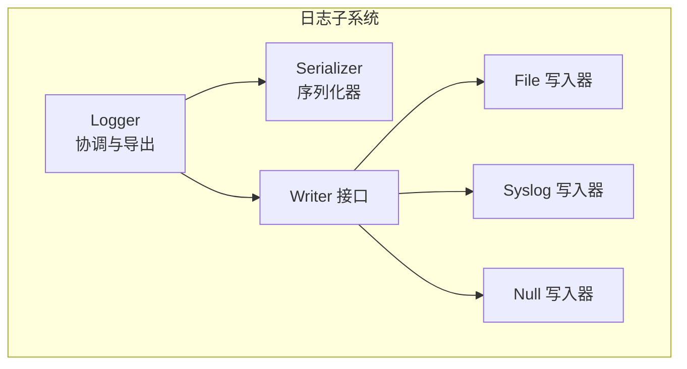
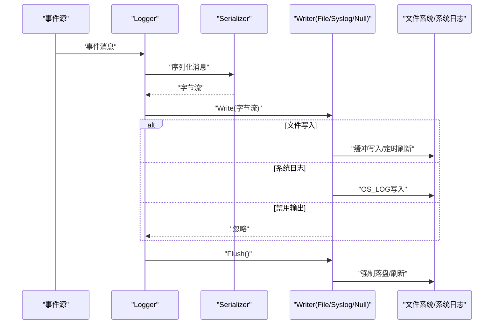
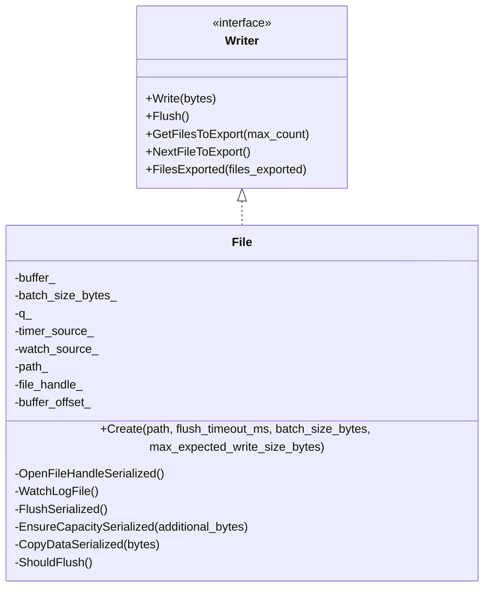
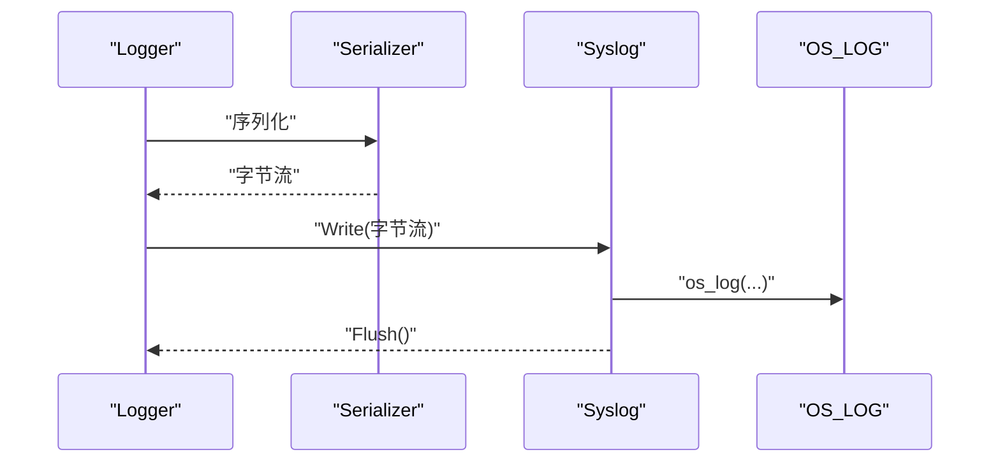
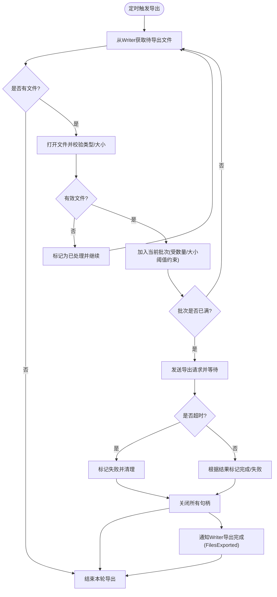
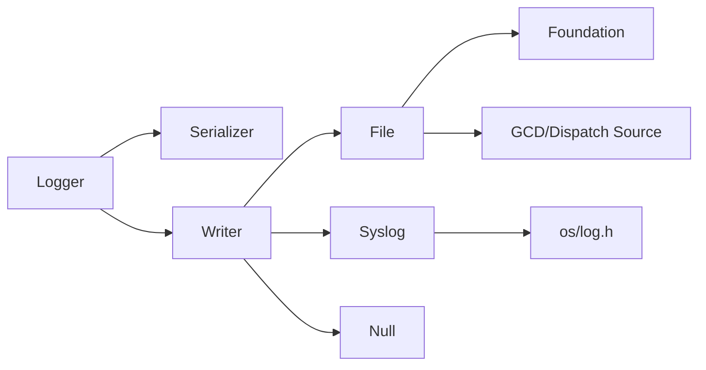

# 日志输出

<cite>
**本文引用的文件**
- [Writer.h](file://Source/santad/Logs/EndpointSecurity/Writers/Writer.h)
- [File.h](file://Source/santad/Logs/EndpointSecurity/Writers/File.h)
- [File.mm](file://Source/santad/Logs/EndpointSecurity/Writers/File.mm)
- [Syslog.h](file://Source/santad/Logs/EndpointSecurity/Writers/Syslog.h)
- [Syslog.mm](file://Source/santad/Logs/EndpointSecurity/Writers/Syslog.mm)
- [Null.h](file://Source/santad/Logs/EndpointSecurity/Writers/Null.h)
- [Null.mm](file://Source/santad/Logs/EndpointSecurity/Writers/Null.mm)
- [Logger.h](file://Source/santad/Logs/EndpointSecurity/Logger.h)
- [Logger.mm](file://Source/santad/Logs/EndpointSecurity/Logger.mm)
</cite>

## 目录
1. [引言](#引言)
2. [项目结构](#项目结构)
3. [核心组件](#核心组件)
4. [架构总览](#架构总览)
5. [详细组件分析](#详细组件分析)
6. [依赖关系分析](#依赖关系分析)
7. [性能考虑](#性能考虑)
8. [故障排查指南](#故障排查指南)
9. [结论](#结论)
10. [附录：输出目标选择与配置](#附录输出目标选择与配置)

## 引言
本文件面向Santa日志输出子系统，聚焦Writer接口设计与抽象架构，系统化阐述File写入器的文件操作与路径管理、Syslog写入器的系统日志集成与OS_LOG桥接、Null写入器的禁用与调试用途，并深入解析输出缓冲、异步写入与线程安全保障、性能调优、错误重试与资源清理机制，以及不同输出目标的选择原则与配置方法。

## 项目结构
日志输出体系位于Source/santad/Logs/EndpointSecurity目录下，采用“序列化器 + 写入器”的解耦架构：
- 序列化器负责将事件对象转换为字节流；
- Writer定义统一的写入与刷新接口；
- 具体Writer实现包括File（文件）、Syslog（系统日志）、Null（丢弃）；
- Logger作为协调者，串联序列化器与Writer，负责定时导出、批处理与错误处理。

图表来源
- [Logger.h](file://Source/santad/Logs/EndpointSecurity/Logger.h#L47-L114)
- [Logger.mm](file://Source/santad/Logs/EndpointSecurity/Logger.mm#L61-L132)
- [Writer.h](file://Source/santad/Logs/EndpointSecurity/Writers/Writer.h#L28-L46)
- [File.h](file://Source/santad/Logs/EndpointSecurity/Writers/File.h#L33-L71)
- [Syslog.h](file://Source/santad/Logs/EndpointSecurity/Writers/Syslog.h#L24-L31)
- [Null.h](file://Source/santad/Logs/EndpointSecurity/Writers/Null.h#L25-L33)

章节来源
- [Logger.h](file://Source/santad/Logs/EndpointSecurity/Logger.h#L47-L114)
- [Logger.mm](file://Source/santad/Logs/EndpointSecurity/Logger.mm#L61-L132)

## 核心组件
- Writer接口：定义Write与Flush抽象，支持可选的导出文件枚举与确认回调，便于Spool等Writer实现按需暴露待导出文件集合。
- File写入器：基于GCD队列与Dispatch Source实现异步缓冲写入，具备定时刷新、容量扩容、文件句柄监控与自动重建能力。
- Syslog写入器：通过OS_LOG桥接到系统日志服务，限制单行长度，适合系统级可观测性。
- Null写入器：空实现，用于禁用日志输出或在测试中屏蔽副作用。
- Logger：统一调度序列化与写入，内置定时导出、批量阈值控制、超时与错误处理、导出文件跟踪与确认。

章节来源
- [Writer.h](file://Source/santad/Logs/EndpointSecurity/Writers/Writer.h#L28-L46)
- [File.h](file://Source/santad/Logs/EndpointSecurity/Writers/File.h#L33-L71)
- [Syslog.h](file://Source/santad/Logs/EndpointSecurity/Writers/Syslog.h#L24-L31)
- [Null.h](file://Source/santad/Logs/EndpointSecurity/Writers/Null.h#L25-L33)
- [Logger.h](file://Source/santad/Logs/EndpointSecurity/Logger.h#L47-L114)

## 架构总览
Logger根据配置选择合适的Serializer与Writer组合；序列化后的字节流经Writer写入目标；Writer内部可进一步聚合到Spool等实现以支持导出流程。

图表来源
- [Logger.mm](file://Source/santad/Logs/EndpointSecurity/Logger.mm#L393-L440)
- [File.mm](file://Source/santad/Logs/EndpointSecurity/Writers/File.mm#L95-L144)
- [Syslog.mm](file://Source/santad/Logs/EndpointSecurity/Writers/Syslog.mm#L30-L36)
- [Null.mm](file://Source/santad/Logs/EndpointSecurity/Writers/Null.mm#L23-L30)

## 详细组件分析

### Writer接口与扩展点
- 抽象方法：Write(移动语义的字节流)、Flush；
- 可选扩展：GetFilesToExport/NextFileToExport/FilesExported，用于Writer暴露待导出文件集合并接收导出结果确认；
- 设计意图：将“如何写”与“写什么”解耦，允许不同Writer实现按需暴露导出能力。

章节来源
- [Writer.h](file://Source/santad/Logs/EndpointSecurity/Writers/Writer.h#L28-L46)

### File写入器：文件操作、路径管理与权限控制
- 创建与初始化
  - 通过工厂方法创建，内部建立串行队列与定时器源，设置刷新周期；
  - 初始化时打开文件句柄并定位至末尾，确保追加写入。
- 路径管理与权限
  - 若目标路径不存在则创建空文件；
  - 使用NSFileHandle进行写入，底层由操作系统内核负责权限检查与访问控制；
  - 文件删除/重命名事件通过VNODE监控，自动关闭旧句柄并重建新句柄。
- 缓冲与异步写入
  - 内部维护环形缓冲区，按批次大小触发刷新；
  - 写入通过队列异步执行，避免阻塞事件源；
  - 定时器到期或达到批次阈值触发FlushSerialized，使用原始fd写入并重置偏移。
- 线程安全
  - 所有对共享状态（缓冲、句柄、定时器）的操作均在串行队列上执行；
  - Flush()通过同步调用保证FlushSerialized的原子性；
  - 队列与定时器在析构时被取消，防止悬挂回调。
- 错误与健壮性
  - 文件监控回调中捕获异常并重建句柄；
  - 写入失败不影响后续写入流程，但可能造成数据丢失风险，建议结合Flush()与外部健康检查。

图表来源
- [Writer.h](file://Source/santad/Logs/EndpointSecurity/Writers/Writer.h#L28-L46)
- [File.h](file://Source/santad/Logs/EndpointSecurity/Writers/File.h#L33-L71)

章节来源
- [File.h](file://Source/santad/Logs/EndpointSecurity/Writers/File.h#L33-L71)
- [File.mm](file://Source/santad/Logs/EndpointSecurity/Writers/File.mm#L23-L48)
- [File.mm](file://Source/santad/Logs/EndpointSecurity/Writers/File.mm#L61-L77)
- [File.mm](file://Source/santad/Logs/EndpointSecurity/Writers/File.mm#L85-L94)
- [File.mm](file://Source/santad/Logs/EndpointSecurity/Writers/File.mm#L95-L144)

### Syslog写入器：系统日志集成与OS_LOG桥接
- 实现要点
  - 基于OS_LOG_DEFAULT通道输出，限制单行最大长度，避免过长日志导致性能问题；
  - Flush为空操作，无需额外刷新；
  - 适用于macOS系统日志服务，便于集中采集与过滤。
- 兼容性
  - 依赖os/log.h，运行于Apple平台；
  - 输出格式为纯文本，适合人类阅读与系统审计。

图表来源
- [Syslog.h](file://Source/santad/Logs/EndpointSecurity/Writers/Syslog.h#L24-L31)
- [Syslog.mm](file://Source/santad/Logs/EndpointSecurity/Writers/Syslog.mm#L30-L36)

章节来源
- [Syslog.h](file://Source/santad/Logs/EndpointSecurity/Writers/Syslog.h#L24-L31)
- [Syslog.mm](file://Source/santad/Logs/EndpointSecurity/Writers/Syslog.mm#L26-L36)

### Null写入器：禁用功能与调试用途
- 实现要点
  - Write/Flush均为空操作，不产生任何输出；
  - 适合在开发与测试阶段快速禁用日志输出，降低I/O开销与噪声。
- 使用场景
  - 性能测试、回归测试、CI流水线；
  - 临时屏蔽日志以便聚焦其他问题。

图表来源
- [Null.h](file://Source/santad/Logs/EndpointSecurity/Writers/Null.h#L25-L33)

章节来源
- [Null.h](file://Source/santad/Logs/EndpointSecurity/Writers/Null.h#L25-L33)
- [Null.mm](file://Source/santad/Logs/EndpointSecurity/Writers/Null.mm#L23-L30)

### Logger：导出流程、批处理与错误处理
- 组合与创建
  - 根据配置选择Serializer与Writer组合，如文件、系统日志、禁用、Protobuf流式等；
  - 默认定时器区间在最小/最大阈值之间，支持动态调整。
- 导出流程
  - 定时触发ExportTelemetry，串行队列中执行ExportTelemetrySerialized；
  - 从Writer查询待导出文件列表，逐个打开并校验类型与大小；
  - 按最大文件数与总大小阈值组成批次，构造文件名后通过syncd_queue发送导出请求；
  - 使用信号量等待导出完成，超时则标记失败并清理；
  - 将导出结果回传给Writer（FilesExported），Writer据此更新跟踪状态。
- 错误与健壮性
  - 对无法打开、非正规文件、未知类型等情况进行告警并跳过；
  - 导出超时统一处理，避免阻塞后续批次；
  - 导出完成后统一关闭句柄并清理跟踪状态。

图表来源
- [Logger.h](file://Source/santad/Logs/EndpointSecurity/Logger.h#L116-L174)
- [Logger.mm](file://Source/santad/Logs/EndpointSecurity/Logger.mm#L252-L391)

章节来源
- [Logger.h](file://Source/santad/Logs/EndpointSecurity/Logger.h#L116-L174)
- [Logger.mm](file://Source/santad/Logs/EndpointSecurity/Logger.mm#L252-L391)

## 依赖关系分析
- Logger依赖Serializer与Writer接口，具体实现由配置决定；
- File依赖Foundation与GCD，使用Dispatch Source进行文件监控与定时；
- Syslog依赖os/log.h；
- Null无外部依赖。

图表来源
- [Logger.mm](file://Source/santad/Logs/EndpointSecurity/Logger.mm#L61-L132)
- [File.mm](file://Source/santad/Logs/EndpointSecurity/Writers/File.mm#L23-L48)
- [Syslog.mm](file://Source/santad/Logs/EndpointSecurity/Writers/Syslog.mm#L15-L25)

章节来源
- [Logger.mm](file://Source/santad/Logs/EndpointSecurity/Logger.mm#L61-L132)
- [File.mm](file://Source/santad/Logs/EndpointSecurity/Writers/File.mm#L23-L48)
- [Syslog.mm](file://Source/santad/Logs/EndpointSecurity/Writers/Syslog.mm#L15-L25)

## 性能考虑
- 缓冲与批处理
  - File写入器按批次大小写入，减少系统调用次数；建议根据磁盘吞吐与内存预算调整批次大小。
- 刷新策略
  - 定时刷新与阈值触发双策略，避免长时间驻留内存；合理设置刷新间隔与批次阈值平衡延迟与吞吐。
- 序列化成本
  - Protobuf序列化相较字符串更紧凑，适合高吞吐场景；JSON序列化便于调试但体积较大。
- 导出批处理
  - Logger对导出文件按数量与总大小进行批处理，避免一次性打开过多文件；建议结合实际网络带宽与存储性能调优。
- 线程与锁
  - Writer内部通过串行队列与轻量状态变量保证线程安全，避免全局锁竞争；导出过程在独立队列执行，避免阻塞事件写入路径。

## 故障排查指南
- 文件写入异常
  - 现象：日志未落盘或写入中断；
  - 排查：检查文件路径是否存在、权限是否允许写入；确认VNODE监控是否生效；观察Flush()是否被调用。
- 导出超时
  - 现象：导出请求超时告警；
  - 排查：检查网络连通性、目标服务可用性；适当增大导出超时阈值；减少单批文件数量与总大小。
- 不支持的导出类型
  - 现象：未知魔数或压缩格式告警；
  - 排查：确认导出文件来源与格式一致性；必要时清理异常文件后重试。
- 系统日志噪音
  - 现象：OS_LOG输出过长导致截断或性能下降；
  - 排查：确认单条日志长度限制；必要时切换到文件输出以保留完整上下文。

章节来源
- [File.mm](file://Source/santad/Logs/EndpointSecurity/Writers/File.mm#L61-L77)
- [Logger.mm](file://Source/santad/Logs/EndpointSecurity/Logger.mm#L215-L236)
- [Logger.mm](file://Source/santad/Logs/EndpointSecurity/Logger.mm#L381-L391)
- [Syslog.mm](file://Source/santad/Logs/EndpointSecurity/Writers/Syslog.mm#L21-L25)

## 结论
Santa的日志输出系统通过Writer接口实现了序列化与写入的清晰分离，配合Logger的定时导出与批处理机制，既满足高吞吐场景下的稳定性，又兼顾了系统日志与文件输出的不同需求。File写入器提供了稳健的缓冲与异步写入能力，Syslog写入器无缝对接系统日志生态，Null写入器则为禁用与调试提供了便利。通过合理的参数调优与错误处理策略，可在生产环境中获得可靠的可观测性与较低的运维成本。

## 附录：输出目标选择与配置
- 文件输出（SNTEventLogTypeFilelog）
  - 适用：需要持久化、可离线分析的事件日志；
  - 特点：支持定时刷新与批次写入，适合高并发写入场景。
- 系统日志（SNTEventLogTypeSyslog）
  - 适用：需要与系统日志统一采集与检索；
  - 特点：轻量、跨组件统一入口，便于集中治理。
- 禁用输出（SNTEventLogTypeNull）
  - 适用：测试、性能基准或临时屏蔽日志输出。
- Protobuf/流式输出（SNTEventLogTypeProtobuf*）
  - 适用：需要结构化、可解析的事件数据，便于下游处理；
  - 特点：支持多种压缩与流式格式，适合大规模导出。

章节来源
- [Logger.mm](file://Source/santad/Logs/EndpointSecurity/Logger.mm#L61-L132)