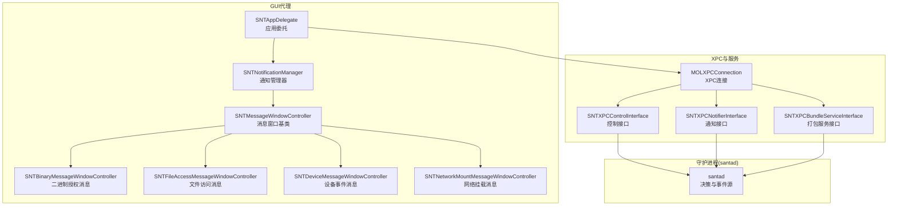
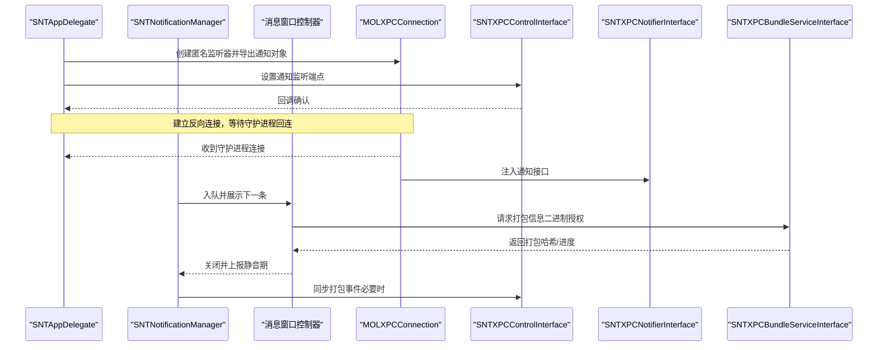
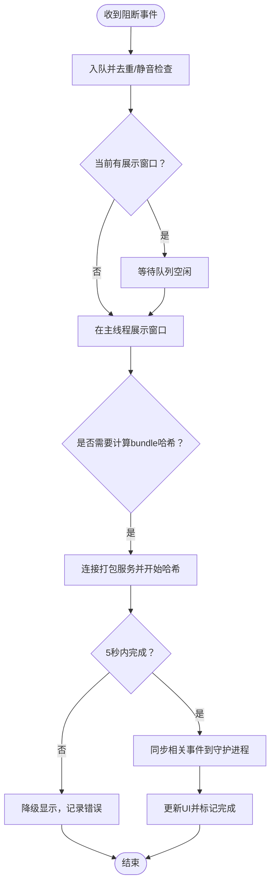
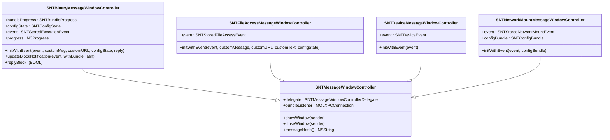
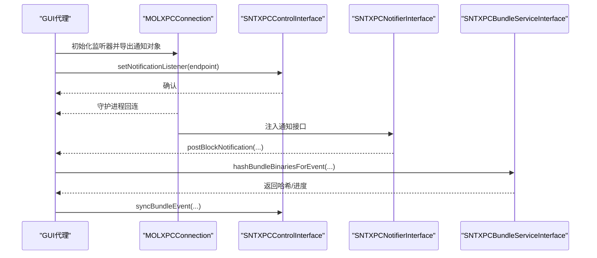
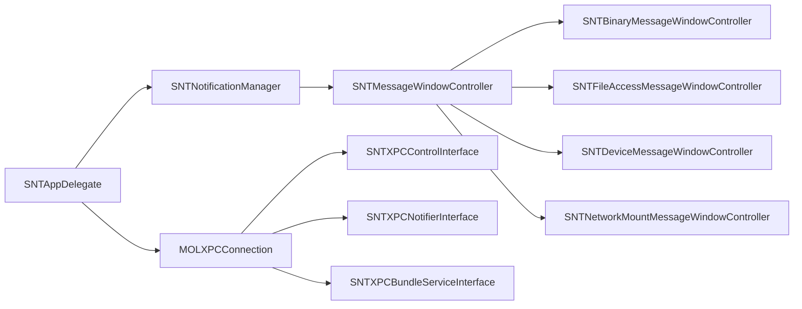

# GUI代理

<cite>
**本文引用的文件**
- [Source/gui/main.mm](file://Source/gui/main.mm)
- [Source/gui/SNTAppDelegate.h](file://Source/gui/SNTAppDelegate.h)
- [Source/gui/SNTAppDelegate.mm](file://Source/gui/SNTAppDelegate.mm)
- [Source/gui/SNTNotificationManager.h](file://Source/gui/SNTNotificationManager.h)
- [Source/gui/SNTNotificationManager.mm](file://Source/gui/SNTNotificationManager.mm)
- [Source/gui/SNTMessageWindowController.h](file://Source/gui/SNTMessageWindowController.h)
- [Source/gui/SNTMessageWindowController.mm](file://Source/gui/SNTMessageWindowController.mm)
- [Source/gui/SNTBinaryMessageWindowController.h](file://Source/gui/SNTBinaryMessageWindowController.h)
- [Source/gui/SNTBinaryMessageWindowController.mm](file://Source/gui/SNTBinaryMessageWindowController.mm)
- [Source/gui/SNTFileAccessMessageWindowController.h](file://Source/gui/SNTFileAccessMessageWindowController.h)
- [Source/gui/SNTFileAccessMessageWindowController.mm](file://Source/gui/SNTFileAccessMessageWindowController.mm)
- [Source/gui/SNTDeviceMessageWindowController.h](file://Source/gui/SNTDeviceMessageWindowController.h)
- [Source/gui/SNTDeviceMessageWindowController.mm](file://Source/gui/SNTDeviceMessageWindowController.mm)
- [Source/gui/SNTNetworkMountMessageWindowController.h](file://Source/gui/SNTNetworkMountMessageWindowController.h)
- [Source/gui/SNTNetworkMountMessageWindowController.mm](file://Source/gui/SNTNetworkMountMessageWindowController.mm)
- [Source/common/SNTXPCControlInterface.h](file://Source/common/SNTXPCControlInterface.h)
- [Source/common/SNTXPCControlInterface.mm](file://Source/common/SNTXPCControlInterface.mm)
- [Source/common/SNTXPCNotifierInterface.h](file://Source/common/SNTXPCNotifierInterface.h)
- [Source/common/SNTXPCNotifierInterface.mm](file://Source/common/SNTXPCNotifierInterface.mm)
- [Source/common/SNTXPCBundleServiceInterface.h](file://Source/common/SNTXPCBundleServiceInterface.h)
- [Source/common/SNTXPCBundleServiceInterface.mm](file://Source/common/SNTXPCBundleServiceInterface.mm)
- [Source/common/MOLXPCConnection.h](file://Source/common/MOLXPCConnection.h)
- [Source/common/MOLXPCConnection.mm](file://Source/common/MOLXPCConnection.mm)
- [Source/common/SNTStoredExecutionEvent.h](file://Source/common/SNTStoredExecutionEvent.h)
- [Source/common/SNTStoredExecutionEvent.mm](file://Source/common/SNTStoredExecutionEvent.mm)
- [Source/common/SNTStoredFileAccessEvent.h](file://Source/common/SNTStoredFileAccessEvent.h)
- [Source/common/SNTStoredFileAccessEvent.mm](file://Source/common/SNTStoredFileAccessEvent.mm)
- [Source/common/SNTStoredNetworkMountEvent.h](file://Source/common/SNTStoredNetworkMountEvent.h)
- [Source/common/SNTStoredNetworkMountEvent.mm](file://Source/common/SNTStoredNetworkMountEvent.mm)
- [Source/common/SNTDeviceEvent.h](file://Source/common/SNTDeviceEvent.h)
- [Source/common/SNTDeviceEvent.mm](file://Source/common/SNTDeviceEvent.mm)
- [Source/common/SNTConfigState.h](file://Source/common/SNTConfigState.h)
- [Source/common/SNTConfigState.mm](file://Source/common/SNTConfigState.mm)
- [Source/common/SNTBlockMessage.h](file://Source/common/SNTBlockMessage.h)
- [Source/common/SNTBlockMessage.mm](file://Source/common/SNTBlockMessage.mm)
- [Source/common/SNTConfigurator.h](file://Source/common/SNTConfigurator.h)
- [Source/common/SNTConfigurator.mm](file://Source/common/SNTConfigurator.mm)
- [Source/common/SNTLogging.h](file://Source/common/SNTLogging.h)
- [Source/common/SNTLogging.mm](file://Source/common/SNTLogging.mm)
- [Source/common/MOLCertificate.h](file://Source/common/MOLCertificate.h)
- [Source/common/MOLCertificate.mm](file://Source/common/MOLCertificate.mm)
- [Source/common/CertificateHelpers.h](file://Source/common/CertificateHelpers.h)
- [Source/common/CertificateHelpers.mm](file://Source/common/CertificateHelpers.mm)
- [Source/gui/Resources/de.lproj/Localizable.strings](file://Source/gui/Resources/de.lproj/Localizable.strings)
- [Source/gui/Resources/en.lproj/Localizable.strings](file://Source/gui/Resources/en.lproj/Localizable.strings)
- [Source/gui/Resources/ja.lproj/Localizable.strings](file://Source/gui/Resources/ja.lproj/Localizable.strings)
- [Source/gui/Resources/ru.lproj/Localizable.strings](file://Source/gui/Resources/ru.lproj/Localizable.strings)
- [Source/gui/Resources/uk.lproj/Localizable.strings](file://Source/gui/Resources/uk.lproj/Localizable.strings)
</cite>

## 目录
1. [简介](#简介)
2. [项目结构](#项目结构)
3. [核心组件](#核心组件)
4. [架构总览](#架构总览)
5. [组件详解](#组件详解)
6. [依赖关系分析](#依赖关系分析)
7. [性能考量](#性能考量)
8. [故障排查指南](#故障排查指南)
9. [结论](#结论)
10. [附录](#附录)

## 简介
本文件为 Santa GUI 代理（图形用户界面代理）的深度技术文档，聚焦于其作为用户交互界面的核心职责：通知管理、消息窗口控制器体系以及系统扩展管理。文档从架构设计（应用委托模式、视图控制器组织、用户界面组件）、通知系统实现（队列管理、消息展示、用户交互处理）、消息窗口控制器（二进制授权消息、设备事件消息、文件访问消息等）、GUI 与守护进程通信机制（XPC 接口、数据同步）、国际化与用户体验优化等方面进行系统化阐述。

## 项目结构
GUI 代理位于 Source/gui 目录，采用“应用委托 + 多种消息窗口控制器 + 通知管理器”的分层组织方式；同时通过 XPC 与守护进程（santad）及系统扩展（System Extension）进行交互。资源国际化位于 Resources 下的多语言本地化字符串文件。

图表来源
- [Source/gui/SNTAppDelegate.mm](file://Source/gui/SNTAppDelegate.mm#L121-L179)
- [Source/gui/SNTNotificationManager.mm](file://Source/gui/SNTNotificationManager.mm#L323-L401)
- [Source/gui/SNTMessageWindowController.mm](file://Source/gui/SNTMessageWindowController.mm#L41-L78)
- [Source/gui/SNTBinaryMessageWindowController.mm](file://Source/gui/SNTBinaryMessageWindowController.mm#L80-L100)
- [Source/gui/SNTFileAccessMessageWindowController.mm](file://Source/gui/SNTFileAccessMessageWindowController.mm#L50-L71)
- [Source/gui/SNTDeviceMessageWindowController.mm](file://Source/gui/SNTDeviceMessageWindowController.mm#L34-L44)
- [Source/gui/SNTNetworkMountMessageWindowController.mm](file://Source/gui/SNTNetworkMountMessageWindowController.mm#L31-L46)
- [Source/common/MOLXPCConnection.h](file://Source/common/MOLXPCConnection.h)
- [Source/common/SNTXPCControlInterface.h](file://Source/common/SNTXPCControlInterface.h)
- [Source/common/SNTXPCNotifierInterface.h](file://Source/common/SNTXPCNotifierInterface.h)
- [Source/common/SNTXPCBundleServiceInterface.h](file://Source/common/SNTXPCBundleServiceInterface.h)

章节来源
- [Source/gui/main.mm](file://Source/gui/main.mm#L56-L93)
- [Source/gui/SNTAppDelegate.mm](file://Source/gui/SNTAppDelegate.mm#L40-L93)
- [Source/gui/SNTNotificationManager.mm](file://Source/gui/SNTNotificationManager.mm#L103-L147)
- [Source/gui/SNTMessageWindowController.mm](file://Source/gui/SNTMessageWindowController.mm#L23-L39)

## 核心组件
- 应用委托（SNTAppDelegate）
  - 负责应用生命周期管理、菜单设置、与守护进程的 XPC 连接建立与重连、窗口关闭后的激活策略调整。
- 通知管理器（SNTNotificationManager）
  - 维护待展示通知队列，确保同一时间仅展示一个通知；支持静音配置、分布式通知广播、与打包服务的进度回调对接；实现多种通知类型的推送。
- 消息窗口控制器（SNTMessageWindowController 及其子类）
  - 提供统一的窗口展示与关闭流程、静音期设置、消息去重与哈希生成；各子类针对不同事件类型提供专用视图与交互逻辑。
- XPC 接口与连接（MOLXPCConnection、SNTXPCControlInterface、SNTXPCNotifierInterface、SNTXPCBundleServiceInterface）
  - 实现 GUI 与 santad 的双向通信，包括设置通知监听端点、接收阻断事件、触发规则同步、查询打包信息等。

章节来源
- [Source/gui/SNTAppDelegate.mm](file://Source/gui/SNTAppDelegate.mm#L40-L93)
- [Source/gui/SNTNotificationManager.h](file://Source/gui/SNTNotificationManager.h#L22-L30)
- [Source/gui/SNTNotificationManager.mm](file://Source/gui/SNTNotificationManager.mm#L58-L101)
- [Source/gui/SNTMessageWindowController.h](file://Source/gui/SNTMessageWindowController.h#L19-L43)
- [Source/gui/SNTMessageWindowController.mm](file://Source/gui/SNTMessageWindowController.mm#L41-L78)
- [Source/common/MOLXPCConnection.h](file://Source/common/MOLXPCConnection.h)
- [Source/common/SNTXPCControlInterface.h](file://Source/common/SNTXPCControlInterface.h)
- [Source/common/SNTXPCNotifierInterface.h](file://Source/common/SNTXPCNotifierInterface.h)
- [Source/common/SNTXPCBundleServiceInterface.h](file://Source/common/SNTXPCBundleServiceInterface.h)

## 架构总览
GUI 代理采用应用委托模式组织应用生命周期，通知管理器作为中枢协调消息展示与系统集成，消息窗口控制器按事件类型分层封装 UI 与交互，XPC 层负责与守护进程及系统扩展通信。

图表来源
- [Source/gui/SNTAppDelegate.mm](file://Source/gui/SNTAppDelegate.mm#L121-L179)
- [Source/gui/SNTNotificationManager.mm](file://Source/gui/SNTNotificationManager.mm#L226-L248)
- [Source/gui/SNTBinaryMessageWindowController.mm](file://Source/gui/SNTBinaryMessageWindowController.mm#L249-L321)
- [Source/common/SNTXPCControlInterface.mm](file://Source/common/SNTXPCControlInterface.mm)
- [Source/common/SNTXPCNotifierInterface.mm](file://Source/common/SNTXPCNotifierInterface.mm)
- [Source/common/SNTXPCBundleServiceInterface.mm](file://Source/common/SNTXPCBundleServiceInterface.mm)

## 组件详解

### 应用委托（SNTAppDelegate）
- 职责
  - 初始化菜单（含编辑快捷键）、监听工作空间会话状态变化以触发连接重建。
  - 建立与守护进程的 XPC 反向连接，导出通知管理器为受信接口，并将监听端点回传给守护进程。
  - 处理应用重新打开与拖拽打开文件信息窗口。
- 关键流程
  - 连接建立：创建匿名监听器，初始化 MOLXPCConnection 并设置受信接口与 acceptedHandler；随后通过控制接口告知守护进程连接端点。
  - 会话恢复：在工作空间会话激活时尝试重连；失效时清理并异步重建。
  - 窗口策略：当所有窗口关闭后恢复为附件级激活策略，避免常驻前台影响用户体验。

章节来源
- [Source/gui/SNTAppDelegate.mm](file://Source/gui/SNTAppDelegate.mm#L40-L93)
- [Source/gui/SNTAppDelegate.mm](file://Source/gui/SNTAppDelegate.mm#L121-L179)
- [Source/gui/main.mm](file://Source/gui/main.mm#L56-L93)

### 通知管理器（SNTNotificationManager）
- 职责
  - 维护当前展示窗口与待处理队列，保证同一时刻仅展示一个通知。
  - 去重与静音：基于消息哈希判断重复；根据用户静音配置与持久化静音表决定是否展示。
  - 分布式通知：对二进制执行与文件访问阻断事件发布系统范围广播，便于外部工具联动。
  - 打包信息：在二进制授权场景中，异步请求打包服务计算 bundle 哈希，更新 UI 并在需要时同步至守护进程。
  - 用户通知：通过 UNUserNotificationCenter 发送客户端模式切换与规则同步完成等系统通知。
- 关键算法与流程
  - 队列入队与展示：主线程安全地入队并尝试展示；若当前无展示则立即显示。
  - 去重与静音：检查静音表与配置项，避免重复打扰；支持按消息哈希静音一段时间。
  - 打包哈希：超时保护（最多等待 5 秒），失败则降级显示；成功后同步相关事件并更新 UI。
  - 分布式广播：对特定事件构造 userInfo 并立即投递，字段覆盖签名链、执行者、时间戳、进程信息等。

图表来源
- [Source/gui/SNTNotificationManager.mm](file://Source/gui/SNTNotificationManager.mm#L103-L147)
- [Source/gui/SNTNotificationManager.mm](file://Source/gui/SNTNotificationManager.mm#L226-L321)
- [Source/gui/SNTNotificationManager.mm](file://Source/gui/SNTNotificationManager.mm#L323-L401)

章节来源
- [Source/gui/SNTNotificationManager.h](file://Source/gui/SNTNotificationManager.h#L22-L30)
- [Source/gui/SNTNotificationManager.mm](file://Source/gui/SNTNotificationManager.mm#L58-L101)
- [Source/gui/SNTNotificationManager.mm](file://Source/gui/SNTNotificationManager.mm#L149-L225)
- [Source/gui/SNTNotificationManager.mm](file://Source/gui/SNTNotificationManager.mm#L226-L321)
- [Source/gui/SNTNotificationManager.mm](file://Source/gui/SNTNotificationManager.mm#L323-L401)

### 消息窗口控制器（SNTMessageWindowController 及子类）
- 基类（SNTMessageWindowController）
  - 提供默认窗口样式、展示/关闭入口、静音期回调委托、消息哈希抽象方法（由子类实现）。
- 子类
  - 二进制消息（SNTBinaryMessageWindowController）
    - 负责二进制授权阻断事件的展示与交互；支持自定义消息/链接；维护打包进度对象；在展示前构建视图工厂并注入事件、配置与回调。
    - 计算消息哈希为文件 SHA256，用于去重与静音。
  - 文件访问消息（SNTFileAccessMessageWindowController）
    - 展示文件访问阻断事件；支持自定义消息/链接/文本；消息哈希组合规则版本、规则名与进程路径，降低重复提示。
  - 设备事件消息（SNTDeviceMessageWindowController）
    - 展示设备阻断事件；消息哈希基于设备名称。
  - 网络挂载消息（SNTNetworkMountMessageWindowController）
    - 展示网络挂载阻断事件；消息哈希基于挂载来源名称。

图表来源
- [Source/gui/SNTMessageWindowController.h](file://Source/gui/SNTMessageWindowController.h#L19-L43)
- [Source/gui/SNTMessageWindowController.mm](file://Source/gui/SNTMessageWindowController.mm#L41-L78)
- [Source/gui/SNTBinaryMessageWindowController.h](file://Source/gui/SNTBinaryMessageWindowController.h#L24-L72)
- [Source/gui/SNTBinaryMessageWindowController.mm](file://Source/gui/SNTBinaryMessageWindowController.mm#L80-L100)
- [Source/gui/SNTFileAccessMessageWindowController.h](file://Source/gui/SNTFileAccessMessageWindowController.h#L15-L40)
- [Source/gui/SNTFileAccessMessageWindowController.mm](file://Source/gui/SNTFileAccessMessageWindowController.mm#L50-L71)
- [Source/gui/SNTDeviceMessageWindowController.h](file://Source/gui/SNTDeviceMessageWindowController.h#L15-L34)
- [Source/gui/SNTDeviceMessageWindowController.mm](file://Source/gui/SNTDeviceMessageWindowController.mm#L34-L44)
- [Source/gui/SNTNetworkMountMessageWindowController.h](file://Source/gui/SNTNetworkMountMessageWindowController.h#L15-L30)
- [Source/gui/SNTNetworkMountMessageWindowController.mm](file://Source/gui/SNTNetworkMountMessageWindowController.mm#L31-L46)

章节来源
- [Source/gui/SNTMessageWindowController.mm](file://Source/gui/SNTMessageWindowController.mm#L23-L39)
- [Source/gui/SNTBinaryMessageWindowController.mm](file://Source/gui/SNTBinaryMessageWindowController.mm#L102-L104)
- [Source/gui/SNTFileAccessMessageWindowController.mm](file://Source/gui/SNTFileAccessMessageWindowController.mm#L73-L80)
- [Source/gui/SNTDeviceMessageWindowController.mm](file://Source/gui/SNTDeviceMessageWindowController.mm#L46-L49)
- [Source/gui/SNTNetworkMountMessageWindowController.mm](file://Source/gui/SNTNetworkMountMessageWindowController.mm#L48-L50)

### 通知系统实现机制
- 通知队列管理
  - 使用可变数组维护待展示队列；入队时先发布分布式通知，再进行去重与静音检查；若当前无展示则立即在主线程展示。
- 消息展示
  - 所有 UI 更新均在主线程执行；窗口采用弹出层级与可移动背景，提升可见性与易操作性。
- 用户交互处理
  - 窗口关闭时通过委托回调上报静音期；静音期结束后自动清除静音表项。
- 分布式通知广播
  - 对二进制执行与文件访问阻断事件发布系统范围通知，携带签名链、执行者、时间戳、进程信息等字段，便于企业工具联动。

章节来源
- [Source/gui/SNTNotificationManager.mm](file://Source/gui/SNTNotificationManager.mm#L103-L147)
- [Source/gui/SNTNotificationManager.mm](file://Source/gui/SNTNotificationManager.mm#L149-L225)
- [Source/gui/SNTMessageWindowController.mm](file://Source/gui/SNTMessageWindowController.mm#L54-L63)

### GUI 与守护进程通信机制（XPC）
- 连接建立
  - 应用启动时创建匿名监听器，初始化 MOLXPCConnection 并导出通知管理器为受信接口；通过控制接口将监听端点回传给守护进程，等待其回连。
- 接口契约
  - 通知接口（SNTXPCNotifierInterface）：接收来自守护进程的通知回调（如客户端模式变更、规则同步完成、阻断事件等）。
  - 控制接口（SNTXPCControlInterface）：用于设置监听端点、触发同步等。
  - 打包服务接口（SNTXPCBundleServiceInterface）：在二进制授权场景中查询/计算打包信息，返回哈希与进度。
- 数据同步
  - 在计算出 bundle 哈希后，通过控制接口将相关事件同步至守护进程，以便后续规则更新或审计。

图表来源
- [Source/gui/SNTAppDelegate.mm](file://Source/gui/SNTAppDelegate.mm#L121-L179)
- [Source/common/SNTXPCControlInterface.mm](file://Source/common/SNTXPCControlInterface.mm)
- [Source/common/SNTXPCNotifierInterface.mm](file://Source/common/SNTXPCNotifierInterface.mm)
- [Source/common/SNTXPCBundleServiceInterface.mm](file://Source/common/SNTXPCBundleServiceInterface.mm)
- [Source/gui/SNTNotificationManager.mm](file://Source/gui/SNTNotificationManager.mm#L226-L321)

章节来源
- [Source/gui/SNTAppDelegate.mm](file://Source/gui/SNTAppDelegate.mm#L121-L179)
- [Source/gui/SNTNotificationManager.mm](file://Source/gui/SNTNotificationManager.mm#L226-L321)
- [Source/common/MOLXPCConnection.mm](file://Source/common/MOLXPCConnection.mm)

### 系统扩展管理
- 启动/卸载系统扩展
  - 通过命令行参数识别加载/卸载操作；使用 OSSystemExtensionRequest 发起激活/停用请求，委托处理结果与超时退出。
- 与应用委托协作
  - 应用委托负责菜单与窗口策略；系统扩展管理由独立入口处理，完成后由应用委托接管常规运行。

章节来源
- [Source/gui/main.mm](file://Source/gui/main.mm#L56-L93)

## 依赖关系分析
- 组件耦合
  - SNTAppDelegate 与 SNTNotificationManager 高内聚，共同负责连接与通知展示。
  - SNTNotificationManager 与各类消息窗口控制器松耦合，通过协议与委托交互。
  - XPC 层为跨进程通信抽象，向上暴露接口，向下屏蔽连接细节。
- 外部依赖
  - Foundation（分布式通知、用户通知中心）、AppKit（窗口与视图）、SystemExtensions（系统扩展管理）。
- 潜在循环依赖
  - 当前结构未见直接循环；通知管理器对控制器的依赖为单向委托。

图表来源
- [Source/gui/SNTAppDelegate.mm](file://Source/gui/SNTAppDelegate.mm#L121-L179)
- [Source/gui/SNTNotificationManager.mm](file://Source/gui/SNTNotificationManager.mm#L323-L401)
- [Source/gui/SNTMessageWindowController.mm](file://Source/gui/SNTMessageWindowController.mm#L41-L78)
- [Source/common/MOLXPCConnection.h](file://Source/common/MOLXPCConnection.h)

章节来源
- [Source/gui/SNTNotificationManager.mm](file://Source/gui/SNTNotificationManager.mm#L58-L101)
- [Source/gui/SNTMessageWindowController.h](file://Source/gui/SNTMessageWindowController.h#L19-L43)

## 性能考量
- 主线程 UI 更新
  - 所有窗口创建与 UI 更新均在主线程执行，避免并发 UI 冲突。
- 异步与超时
  - 打包哈希计算在串行队列中执行；对打包服务设置最大等待时间，超时则降级显示并记录日志。
- 去重与静音
  - 基于消息哈希与静音表减少重复提示，降低 UI 抖动与系统负担。
- 连接健壮性
  - 工作空间会话切换时主动重建连接，保障通信连续性。

章节来源
- [Source/gui/SNTNotificationManager.mm](file://Source/gui/SNTNotificationManager.mm#L226-L321)
- [Source/gui/SNTNotificationManager.mm](file://Source/gui/SNTNotificationManager.mm#L103-L147)
- [Source/gui/SNTAppDelegate.mm](file://Source/gui/SNTAppDelegate.mm#L40-L93)

## 故障排查指南
- 无法连接守护进程
  - 检查应用委托中的连接建立流程与 acceptedHandler 是否被触发；确认控制接口已正确设置监听端点。
- 通知不显示或重复
  - 核对静音表与配置项；检查消息哈希生成逻辑是否一致；确认去重与静音检查分支。
- 打包哈希超时
  - 查看打包服务连接与超时处理逻辑；确认降级显示与错误日志输出。
- 系统扩展无法激活/停用
  - 检查命令行参数与 OSSystemExtensionRequest 委托回调；关注超时退出逻辑。

章节来源
- [Source/gui/SNTAppDelegate.mm](file://Source/gui/SNTAppDelegate.mm#L121-L179)
- [Source/gui/SNTNotificationManager.mm](file://Source/gui/SNTNotificationManager.mm#L226-L321)
- [Source/gui/main.mm](file://Source/gui/main.mm#L56-L93)

## 结论
Santa GUI 代理通过清晰的应用委托 + 通知管理器 + 多类型消息窗口控制器的分层设计，实现了稳定、可扩展且用户友好的交互体验。借助 XPC 与系统扩展能力，GUI 与守护进程协同工作，既满足企业级规则同步与审计需求，又提供了灵活的国际化与用户体验优化手段。

## 附录

### 国际化与本地化
- 资源位置
  - 英文、德文、日文、俄文、乌克兰文等本地化字符串位于 Resources 下对应语言目录。
- 使用建议
  - 文案与 HTML 自定义消息通过配置项注入，结合本地化字符串实现多语言支持；注意自定义消息的 HTML 清洗与安全渲染。

章节来源
- [Source/gui/Resources/en.lproj/Localizable.strings](file://Source/gui/Resources/en.lproj/Localizable.strings)
- [Source/gui/Resources/de.lproj/Localizable.strings](file://Source/gui/Resources/de.lproj/Localizable.strings)
- [Source/gui/Resources/ja.lproj/Localizable.strings](file://Source/gui/Resources/ja.lproj/Localizable.strings)
- [Source/gui/Resources/ru.lproj/Localizable.strings](file://Source/gui/Resources/ru.lproj/Localizable.strings)
- [Source/gui/Resources/uk.lproj/Localizable.strings](file://Source/gui/Resources/uk.lproj/Localizable.strings)

### 用户界面定制要点
- 视图控制器工厂
  - 各消息窗口控制器通过对应的 ViewFactory 创建视图，注入事件、配置与回调，便于统一风格与差异化展示。
- 静音与去重
  - 基于消息哈希与静音表实现去重与静音，减少干扰；静音期结束后自动清理。
- 通知类型
  - 客户端模式切换、规则同步完成、阻断事件等通过 UNUserNotificationCenter 或分布式通知呈现。

章节来源
- [Source/gui/SNTBinaryMessageWindowController.mm](file://Source/gui/SNTBinaryMessageWindowController.mm#L80-L100)
- [Source/gui/SNTFileAccessMessageWindowController.mm](file://Source/gui/SNTFileAccessMessageWindowController.mm#L50-L71)
- [Source/gui/SNTDeviceMessageWindowController.mm](file://Source/gui/SNTDeviceMessageWindowController.mm#L34-L44)
- [Source/gui/SNTNetworkMountMessageWindowController.mm](file://Source/gui/SNTNetworkMountMessageWindowController.mm#L31-L46)
- [Source/gui/SNTNotificationManager.mm](file://Source/gui/SNTNotificationManager.mm#L323-L401)