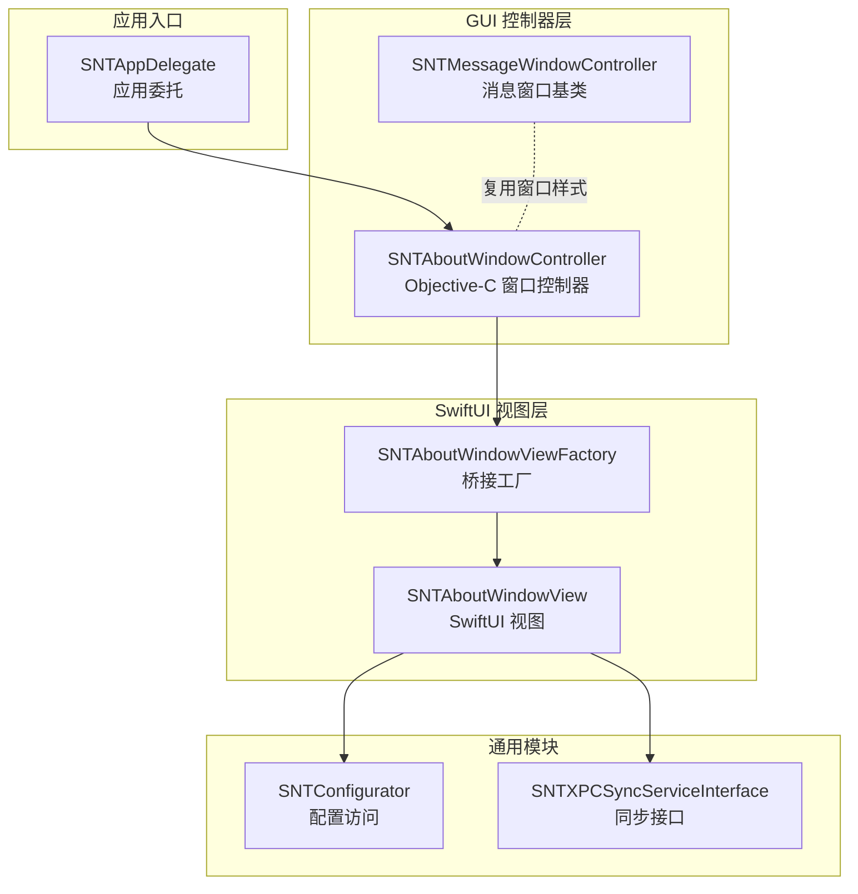
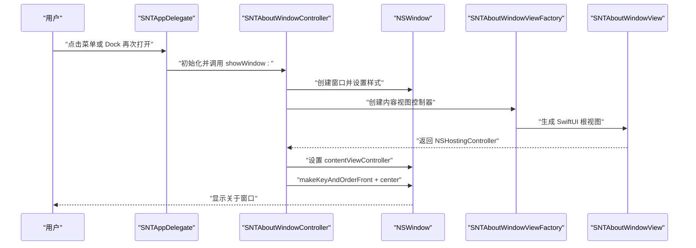
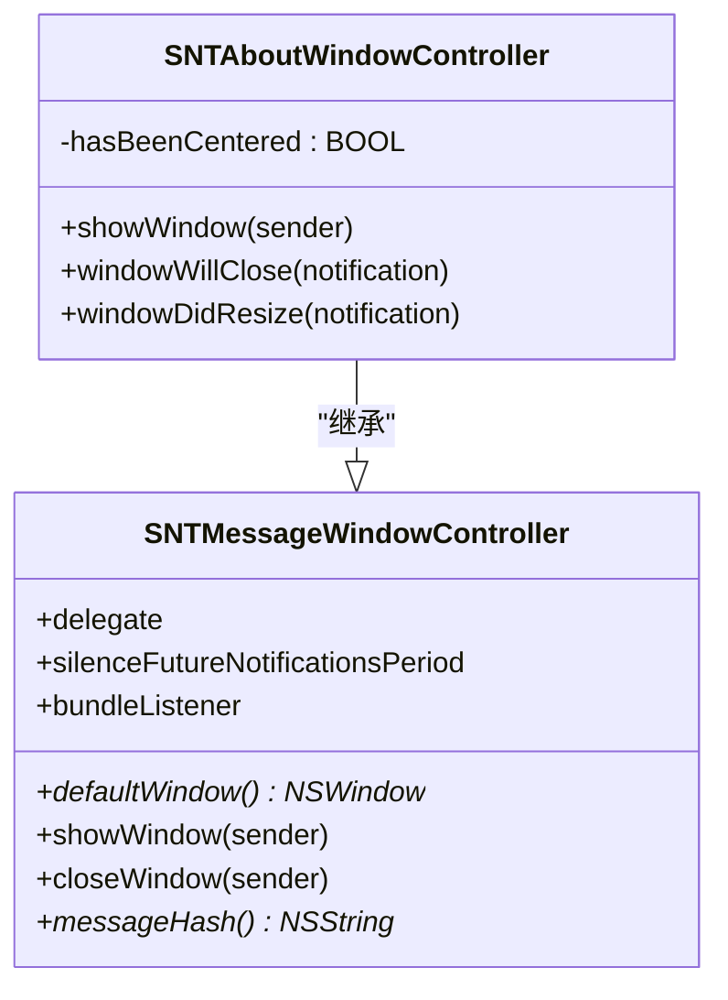
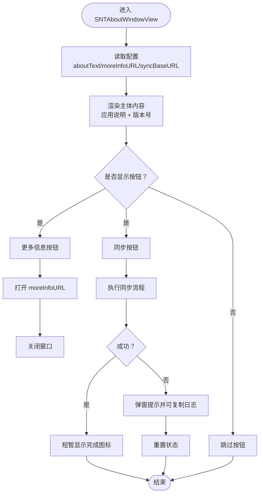
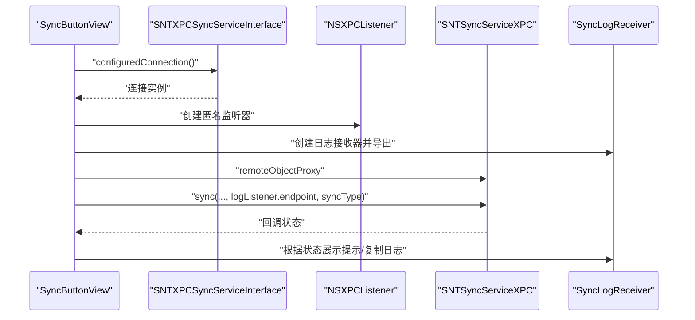
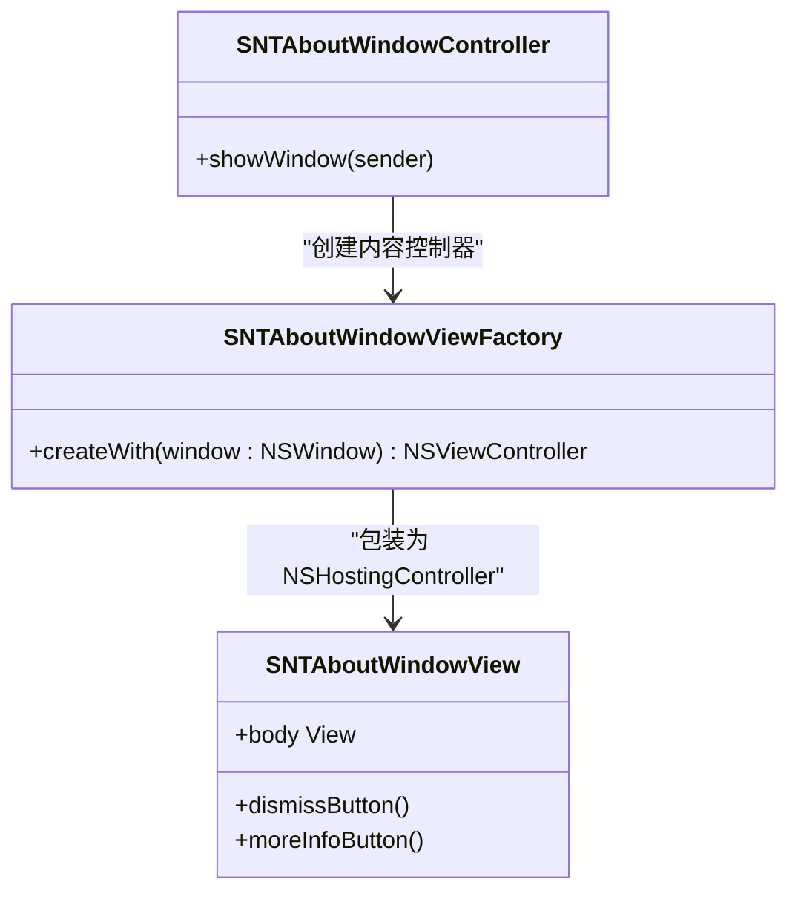
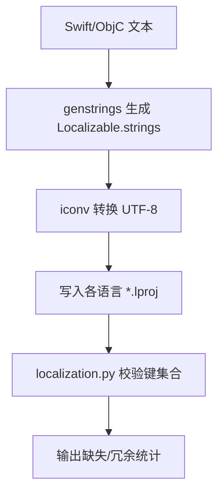
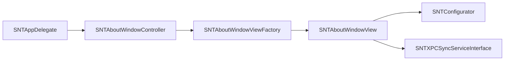

# 关于窗口控制器

<cite>
**本文引用的文件**
- [SNTAboutWindowController.h](file://Source/gui/SNTAboutWindowController.h)
- [SNTAboutWindowController.mm](file://Source/gui/SNTAboutWindowController.mm)
- [SNTAboutWindowView.swift](file://Source/gui/SNTAboutWindowView.swift)
- [SNTMessageWindowController.h](file://Source/gui/SNTMessageWindowController.h)
- [SNTMessageWindowController.mm](file://Source/gui/SNTMessageWindowController.mm)
- [SNTAppDelegate.mm](file://Source/gui/SNTAppDelegate.mm)
- [SNTXPCSyncServiceInterface.h](file://Source/common/SNTXPCSyncServiceInterface.h)
- [SNTConfigurator.h](file://Source/common/SNTConfigurator.h)
- [ThirdPartyLicenses.txt](file://Source/gui/Resources/ThirdPartyLicenses.txt)
- [Localizable.strings（英语）](file://Source/gui/Resources/en.lproj/Localizable.strings)
- [Localizable.strings（德语）](file://Source/gui/Resources/de.lproj/Localizable.strings)
- [Localizable.strings（日语）](file://Source/gui/Resources/ja.lproj/Localizable.strings)
- [localization.py](file://Testing/localization.py)
</cite>

## 目录
1. [简介](#简介)
2. [项目结构](#项目结构)
3. [核心组件](#核心组件)
4. [架构总览](#架构总览)
5. [详细组件分析](#详细组件分析)
6. [依赖关系分析](#依赖关系分析)
7. [性能考虑](#性能考虑)
8. [故障排查指南](#故障排查指南)
9. [结论](#结论)
10. [附录](#附录)

## 简介
本文件围绕 Santa GUI 代理中的“关于”窗口控制器进行系统化技术文档整理，重点覆盖以下方面：
- 设计与实现：关于窗口控制器的职责边界、界面布局与交互逻辑。
- 版本信息展示：如何从应用包信息中读取版本号并在界面中呈现。
- 许可证信息管理：第三方许可文本资源的组织与呈现方式。
- 应用详情显示：关于窗口中展示的应用说明、开发者信息与更多链接。
- Swift 与 Objective‑C 混合开发：视图控制器与 SwiftUI 视图的桥接与集成。
- 版本检测与更新提示：当前实现不包含自动版本检测与更新提示，但保留了扩展点（如“更多链接”）。
- 国际化支持：多语言文本处理、本地化资源管理与校验脚本。

## 项目结构
“关于”窗口位于 GUI 子模块中，采用 Cocoa + SwiftUI 的混合架构：
- Objective‑C 层负责窗口生命周期与外观控制（SNTAboutWindowController）。
- SwiftUI 层负责界面布局与交互（SNTAboutWindowView）。
- 通过工厂类桥接 Objective‑C 与 SwiftUI（SNTAboutWindowViewFactory）。
- 配置与同步接口由通用模块提供（SNTConfigurator、SNTXPCSyncServiceInterface）。
- 菜单与应用委托负责触发“关于”窗口的显示（SNTAppDelegate）。

图表来源
- [SNTAboutWindowController.mm](file://Source/gui/SNTAboutWindowController.mm#L26-L61)
- [SNTAboutWindowView.swift](file://Source/gui/SNTAboutWindowView.swift#L9-L15)
- [SNTMessageWindowController.mm](file://Source/gui/SNTMessageWindowController.mm#L23-L39)
- [SNTAppDelegate.mm](file://Source/gui/SNTAppDelegate.mm#L87-L93)
- [SNTConfigurator.h](file://Source/common/SNTConfigurator.h#L24-L41)
- [SNTXPCSyncServiceInterface.h](file://Source/common/SNTXPCSyncServiceInterface.h#L48-L78)

章节来源
- [SNTAboutWindowController.h](file://Source/gui/SNTAboutWindowController.h#L15-L19)
- [SNTAboutWindowController.mm](file://Source/gui/SNTAboutWindowController.mm#L26-L61)
- [SNTAboutWindowView.swift](file://Source/gui/SNTAboutWindowView.swift#L9-L15)
- [SNTMessageWindowController.h](file://Source/gui/SNTMessageWindowController.h#L15-L43)
- [SNTMessageWindowController.mm](file://Source/gui/SNTMessageWindowController.mm#L23-L39)
- [SNTAppDelegate.mm](file://Source/gui/SNTAppDelegate.mm#L87-L93)

## 核心组件
- SNTAboutWindowController：继承自 NSWindowController，负责创建并展示“关于”窗口，设置窗口外观与行为，处理窗口关闭与重排事件。
- SNTAboutWindowView：SwiftUI 视图，承载关于窗口的全部内容，包括应用说明、版本号、更多链接按钮、同步按钮与拖放行为。
- SNTAboutWindowViewFactory：Objective‑C 工厂类，用于将 SwiftUI 视图包装为 NSViewController 并注入到窗口内容区域。
- SNTMessageWindowController：消息窗口基类，提供统一的窗口样式、居中与关闭逻辑，供“关于”窗口复用。
- SNTAppDelegate：应用委托，响应应用重新打开事件以显示“关于”窗口。
- SNTConfigurator：全局配置访问器，提供 aboutText、moreInfoURL、syncBaseURL 等关键配置项。
- SNTXPCSyncServiceInterface：与同步服务通信的接口，支持同步状态回调与日志回传。

章节来源
- [SNTAboutWindowController.mm](file://Source/gui/SNTAboutWindowController.mm#L26-L61)
- [SNTAboutWindowView.swift](file://Source/gui/SNTAboutWindowView.swift#L17-L119)
- [SNTAboutWindowView.swift](file://Source/gui/SNTAboutWindowView.swift#L139-L236)
- [SNTAboutWindowView.swift](file://Source/gui/SNTAboutWindowView.swift#L244-L262)
- [SNTMessageWindowController.mm](file://Source/gui/SNTMessageWindowController.mm#L23-L39)
- [SNTAppDelegate.mm](file://Source/gui/SNTAppDelegate.mm#L87-L93)
- [SNTConfigurator.h](file://Source/common/SNTConfigurator.h#L24-L41)
- [SNTXPCSyncServiceInterface.h](file://Source/common/SNTXPCSyncServiceInterface.h#L48-L78)

## 架构总览
“关于”窗口的调用链路如下：

图表来源
- [SNTAppDelegate.mm](file://Source/gui/SNTAppDelegate.mm#L87-L93)
- [SNTAboutWindowController.mm](file://Source/gui/SNTAboutWindowController.mm#L26-L61)
- [SNTAboutWindowView.swift](file://Source/gui/SNTAboutWindowView.swift#L9-L15)

## 详细组件分析

### SNTAboutWindowController 分析
- 职责与行为
  - 创建并展示窗口：在 showWindow: 中销毁旧窗口引用，创建新的 NSWindow，设置标题栏透明、可拖动背景等属性。
  - 内容注入：通过 SNTAboutWindowViewFactory 将 SwiftUI 视图包装为 NSViewController 并设置为窗口内容。
  - 窗口事件：实现 windowWillClose: 与 windowDidResize:，确保首次调整大小后居中，避免重复居中。
- 与 SNTMessageWindowController 的关系
  - 复用统一的窗口样式与行为（标题栏透明、可拖动、隐藏标准按钮），保持一致的用户体验。

图表来源
- [SNTMessageWindowController.h](file://Source/gui/SNTMessageWindowController.h#L15-L43)
- [SNTMessageWindowController.mm](file://Source/gui/SNTMessageWindowController.mm#L23-L39)
- [SNTAboutWindowController.h](file://Source/gui/SNTAboutWindowController.h#L15-L19)
- [SNTAboutWindowController.mm](file://Source/gui/SNTAboutWindowController.mm#L26-L61)

章节来源
- [SNTAboutWindowController.mm](file://Source/gui/SNTAboutWindowController.mm#L26-L61)
- [SNTMessageWindowController.mm](file://Source/gui/SNTMessageWindowController.mm#L23-L39)

### SNTAboutWindowView 分析
- 版本信息展示
  - 从 Bundle.main.infoDictionary 读取 CFBundleShortVersionString 作为版本号；若缺失则回退为“unknown”。
  - 使用本地化字符串格式化“Version **%@**”，确保多语言显示。
- 应用详情与开发者信息
  - 若配置存在 aboutText，则优先显示该文本；否则显示默认说明文案。
  - 开发者信息以较小字号与 secondary 颜色显示，强调社区贡献。
- 更多信息与同步功能
  - “更多信息”按钮：若配置存在 moreInfoURL，则打开该链接；随后关闭窗口。
  - 同步按钮：当配置存在 syncBaseURL 时显示；支持普通同步与按住 Option 执行“清理同步”，失败时弹窗并允许复制日志。
- 拖放行为
  - 支持拖拽文件到窗口，标准化路径后交由应用打开，触发应用委托的 openURLs 处理。

图表来源
- [SNTAboutWindowView.swift](file://Source/gui/SNTAboutWindowView.swift#L17-L119)
- [SNTAboutWindowView.swift](file://Source/gui/SNTAboutWindowView.swift#L139-L236)

章节来源
- [SNTAboutWindowView.swift](file://Source/gui/SNTAboutWindowView.swift#L17-L119)
- [SNTAboutWindowView.swift](file://Source/gui/SNTAboutWindowView.swift#L139-L236)

### 同步按钮实现细节
- 连接与监听
  - 通过 SNTXPCSyncServiceInterface 获取连接，设置 invalidationHandler 与 resume。
  - 建立匿名 NSXPCListener，导出日志接收对象，回传给同步服务以便收集日志。
- 同步类型
  - 普通同步与清理同步（按住 Option 触发）。
- 状态反馈
  - 成功：短暂显示完成图标后自动恢复。
  - 失败：弹窗提示，提供复制日志与确认按钮，日志来自本地接收器。

图表来源
- [SNTAboutWindowView.swift](file://Source/gui/SNTAboutWindowView.swift#L139-L236)
- [SNTXPCSyncServiceInterface.h](file://Source/common/SNTXPCSyncServiceInterface.h#L48-L78)

章节来源
- [SNTAboutWindowView.swift](file://Source/gui/SNTAboutWindowView.swift#L139-L236)
- [SNTXPCSyncServiceInterface.h](file://Source/common/SNTXPCSyncServiceInterface.h#L48-L78)

### Swift 与 Objective‑C 混合开发集成
- 工厂桥接
  - SNTAboutWindowViewFactory 以 Objective‑C 类暴露静态方法，返回 NSHostingController 包装的 SwiftUI 视图，便于在 Objective‑C 环境中注入到窗口。
- 视图控制器与视图
  - SNTAboutWindowController 在 showWindow: 中创建窗口并设置 contentViewController 为工厂创建的控制器，完成桥接。

图表来源
- [SNTAboutWindowView.swift](file://Source/gui/SNTAboutWindowView.swift#L9-L15)
- [SNTAboutWindowController.mm](file://Source/gui/SNTAboutWindowController.mm#L26-L61)

章节来源
- [SNTAboutWindowView.swift](file://Source/gui/SNTAboutWindowView.swift#L9-L15)
- [SNTAboutWindowController.mm](file://Source/gui/SNTAboutWindowController.mm#L26-L61)

### 国际化与本地化资源
- 本地化键值
  - 英文、德文、日文的 Localizable.strings 文件包含“关于”视图所需的键值，如“Version **%@**”、“Santa is made with ❤️...”、“More Info...”、“Sync”等。
- 生成与校验
  - 使用 genstrings 与 iconv 生成基础 Localizable.strings，再由 localization.py 对比各语言包的键集合，输出缺失与冗余统计，保证多语言完整性。

图表来源
- [localization.py](file://Testing/localization.py#L1-L122)
- [Localizable.strings（英语）](file://Source/gui/Resources/en.lproj/Localizable.strings#L106-L110)
- [Localizable.strings（英语）](file://Source/gui/Resources/en.lproj/Localizable.strings#L178-L180)
- [Localizable.strings（德语）](file://Source/gui/Resources/de.lproj/Localizable.strings#L106-L111)
- [Localizable.strings（日语）](file://Source/gui/Resources/ja.lproj/Localizable.strings#L106-L110)

章节来源
- [Localizable.strings（英语）](file://Source/gui/Resources/en.lproj/Localizable.strings#L106-L111)
- [Localizable.strings（英语）](file://Source/gui/Resources/en.lproj/Localizable.strings#L178-L180)
- [Localizable.strings（德语）](file://Source/gui/Resources/de.lproj/Localizable.strings#L106-L111)
- [Localizable.strings（日语）](file://Source/gui/Resources/ja.lproj/Localizable.strings#L106-L110)
- [localization.py](file://Testing/localization.py#L1-L122)

### 许可证信息管理
- 第三方许可文本集中存放于 ThirdPartyLicenses.txt，包含常见开源库的许可证摘要与链接，便于在应用内引用或展示。
- 关于窗口未直接展示该文本，但可通过“更多信息”链接引导至外部页面或在应用内新增专门的“许可证”窗口。

章节来源
- [ThirdPartyLicenses.txt](file://Source/gui/Resources/ThirdPartyLicenses.txt#L1-L320)

### 版本检测与更新提示
- 当前实现
  - 关于窗口展示的是应用内置版本号（CFBundleShortVersionString），未包含自动版本检测与更新提示逻辑。
- 可扩展点
  - 可在“更多信息”按钮中指向在线发布页，或在应用委托中增加后台版本检查任务并通过通知或模态对话框提示更新。

章节来源
- [SNTAboutWindowView.swift](file://Source/gui/SNTAboutWindowView.swift#L17-L47)
- [SNTConfigurator.h](file://Source/common/SNTConfigurator.h#L24-L41)

## 依赖关系分析
- 组件耦合
  - SNTAboutWindowController 依赖 SNTAboutWindowViewFactory 与 SNTConfigurator；SNTAboutWindowView 依赖 SNTConfigurator 与 SNTXPCSyncServiceInterface。
- 外部依赖
  - 通过 NSWorkspace 打开 URL，通过 NSPasteboard 复制日志，通过 NSXPC 进行跨进程通信。
- 循环依赖
  - 未发现循环依赖；各模块职责清晰，通过接口与协议解耦。

图表来源
- [SNTAboutWindowController.mm](file://Source/gui/SNTAboutWindowController.mm#L26-L61)
- [SNTAboutWindowView.swift](file://Source/gui/SNTAboutWindowView.swift#L9-L15)
- [SNTAppDelegate.mm](file://Source/gui/SNTAppDelegate.mm#L87-L93)
- [SNTConfigurator.h](file://Source/common/SNTConfigurator.h#L24-L41)
- [SNTXPCSyncServiceInterface.h](file://Source/common/SNTXPCSyncServiceInterface.h#L48-L78)

章节来源
- [SNTAboutWindowController.mm](file://Source/gui/SNTAboutWindowController.mm#L26-L61)
- [SNTAboutWindowView.swift](file://Source/gui/SNTAboutWindowView.swift#L9-L15)
- [SNTAppDelegate.mm](file://Source/gui/SNTAppDelegate.mm#L87-L93)
- [SNTConfigurator.h](file://Source/common/SNTConfigurator.h#L24-L41)
- [SNTXPCSyncServiceInterface.h](file://Source/common/SNTXPCSyncServiceInterface.h#L48-L78)

## 性能考虑
- 窗口创建与居中
  - 首次调整大小后才居中，避免重复计算导致的闪烁与抖动。
- 同步操作
  - 同步队列串行执行，限制并发；失败时仅复制必要日志，减少 UI 卡顿。
- 视图渲染
  - SwiftUI 视图使用 fixedSize() 优化布局计算；按钮禁用与进度指示降低无效重绘。

## 故障排查指南
- 同步失败
  - 现象：弹窗提示失败，提供“复制日志”按钮。
  - 排查：检查网络连通性、同步服务可用性；查看日志列表是否为空。
- XPC 连接失效
  - 现象：回调中设置失败状态，稍后自动恢复。
  - 排查：确认同步服务已启动且接口正确导出；检查 invalidationHandler 是否被意外清除。
- 窗口无法居中
  - 现象：窗口尺寸变化后未居中。
  - 排查：确认 hasBeenCentered 标志位在 windowDidResize: 中被正确设置。

章节来源
- [SNTAboutWindowView.swift](file://Source/gui/SNTAboutWindowView.swift#L139-L236)
- [SNTAboutWindowController.mm](file://Source/gui/SNTAboutWindowController.mm#L49-L61)

## 结论
“关于”窗口控制器通过 Objective‑C 与 SwiftUI 的有机结合，提供了简洁、一致且可本地化的关于页面体验。其设计遵循单一职责原则，将窗口外观与行为抽象为基类，将界面内容与交互逻辑集中在 SwiftUI 视图中。当前版本聚焦于版本号展示、开发者信息与同步能力，未包含自动版本检测与更新提示，但已预留扩展点（更多链接、清理同步等）。国际化与本地化资源管理通过脚本与多语言字符串文件保障一致性。

## 附录
- 实际代码示例（以路径引用代替具体代码）
  - 显示“关于”窗口的入口
    - [应用委托触发显示](file://Source/gui/SNTAppDelegate.mm#L87-L93)
  - 窗口创建与内容注入
    - [窗口创建与样式设置](file://Source/gui/SNTAboutWindowController.mm#L26-L61)
    - [工厂桥接 SwiftUI 视图](file://Source/gui/SNTAboutWindowView.swift#L9-L15)
  - 版本号与本地化
    - [版本号读取与本地化格式化](file://Source/gui/SNTAboutWindowView.swift#L17-L47)
    - [英文本地化键值](file://Source/gui/Resources/en.lproj/Localizable.strings#L178-L180)
    - [德文本地化键值](file://Source/gui/Resources/de.lproj/Localizable.strings#L178-L180)
    - [日文本地化键值](file://Source/gui/Resources/ja.lproj/Localizable.strings#L178-L180)
  - 同步按钮与日志回传
    - [同步流程与状态反馈](file://Source/gui/SNTAboutWindowView.swift#L139-L236)
    - [同步接口定义](file://Source/common/SNTXPCSyncServiceInterface.h#L48-L78)
  - 许可证文本
    - [第三方许可汇总](file://Source/gui/Resources/ThirdPartyLicenses.txt#L1-L320)
  - 国际化校验脚本
    - [本地化键集合对比](file://Testing/localization.py#L1-L122)