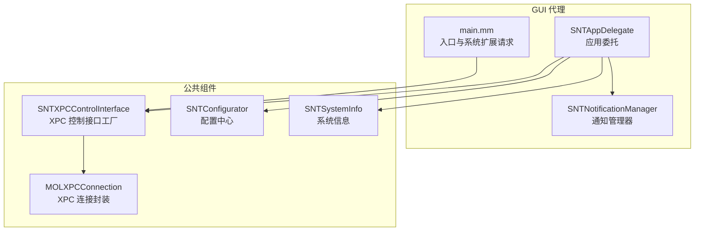
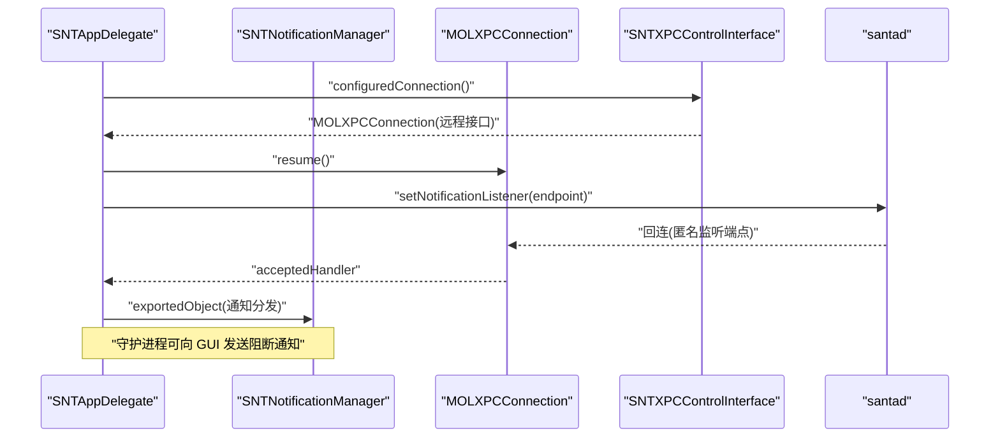
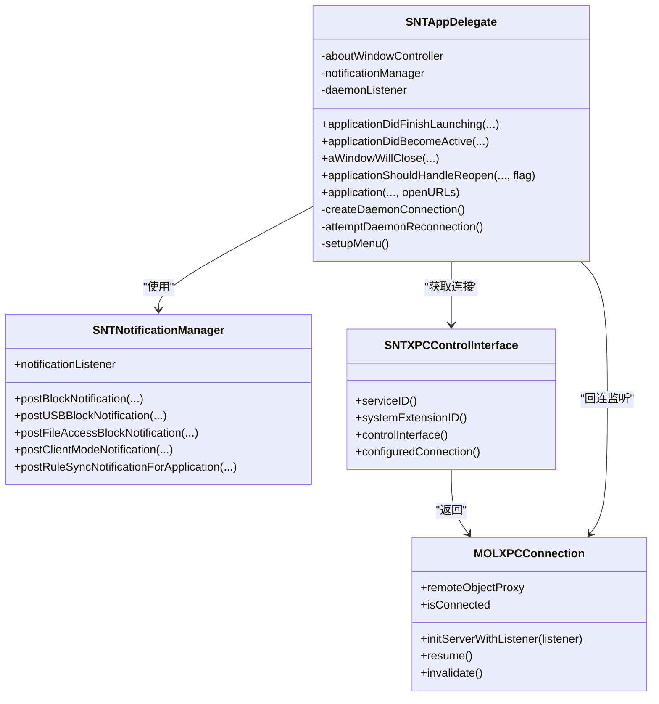
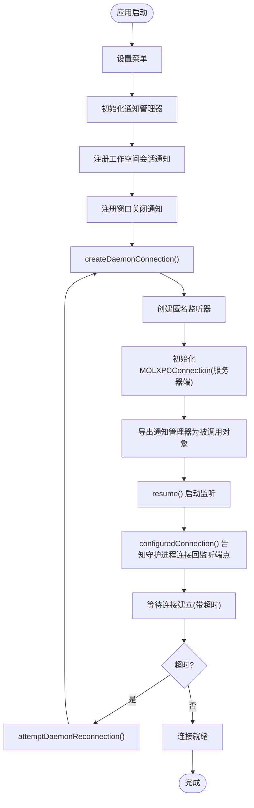
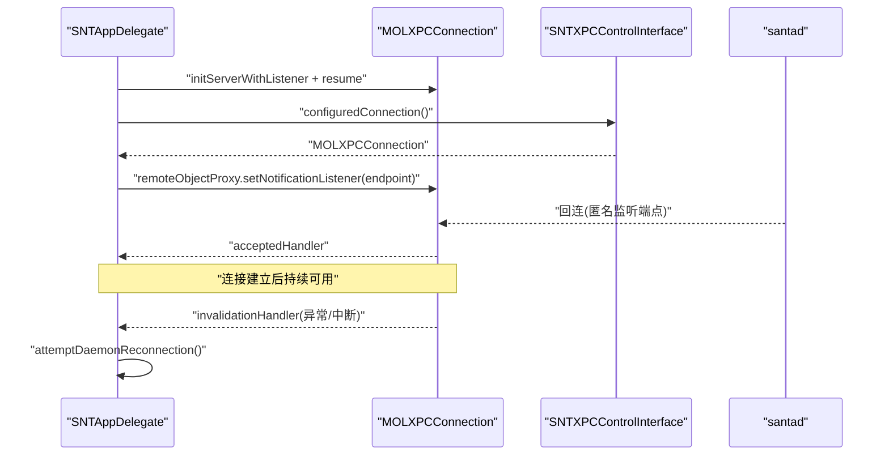
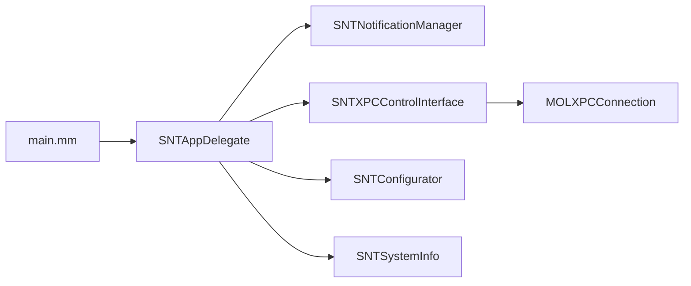

# 应用委托

<cite>
**本文引用的文件**
- [SNTAppDelegate.h](file://Source/gui/SNTAppDelegate.h)
- [SNTAppDelegate.mm](file://Source/gui/SNTAppDelegate.mm)
- [main.mm](file://Source/gui/main.mm)
- [SNTXPCControlInterface.h](file://Source/common/SNTXPCControlInterface.h)
- [SNTXPCControlInterface.mm](file://Source/common/SNTXPCControlInterface.mm)
- [MOLXPCConnection.h](file://Source/common/MOLXPCConnection.h)
- [MOLXPCConnection.mm](file://Source/common/MOLXPCConnection.mm)
- [SNTNotificationManager.h](file://Source/gui/SNTNotificationManager.h)
- [SNTNotificationManager.mm](file://Source/gui/SNTNotificationManager.mm)
- [SNTConfigurator.h](file://Source/common/SNTConfigurator.h)
- [SNTConfigurator.mm](file://Source/common/SNTConfigurator.mm)
- [SNTSystemInfo.h](file://Source/common/SNTSystemInfo.h)
- [SNTSystemInfo.mm](file://Source/common/SNTSystemInfo.mm)
- [Santa.app-adhoc.entitlements](file://Source/gui/Santa.app-adhoc.entitlements)
</cite>

## 目录
1. [简介](#简介)
2. [项目结构](#项目结构)
3. [核心组件](#核心组件)
4. [架构总览](#架构总览)
5. [详细组件分析](#详细组件分析)
6. [依赖关系分析](#依赖关系分析)
7. [性能考量](#性能考量)
8. [故障排查指南](#故障排查指南)
9. [结论](#结论)
10. [附录](#附录)

## 简介
本文件面向 Santa GUI 代理的应用委托模块，系统性阐述 SNTAppDelegate 的职责与实现，覆盖应用生命周期管理、与守护进程（santad）的连接建立与维护、启动流程、初始化过程、资源管理、菜单与窗口管理、系统集成、XPC 通信初始化与错误处理、应用配置与权限检查、系统扩展状态管理等主题。文档同时提供关键方法的调用时序图、连接建立流程图与类关系图，帮助读者快速理解并高效定位问题。

## 项目结构
GUI 代理位于 Source/gui 目录，应用委托类 SNTAppDelegate 负责应用生命周期事件处理、与守护进程的 XPC 连接、通知管理与窗口控制；公共通信与配置位于 Source/common 目录，系统信息与系统扩展能力通过系统框架暴露。

**图表来源**
- [SNTAppDelegate.mm](file://Source/gui/SNTAppDelegate.mm#L40-L181)
- [SNTNotificationManager.mm](file://Source/gui/SNTNotificationManager.mm#L58-L120)
- [main.mm](file://Source/gui/main.mm#L56-L93)
- [SNTXPCControlInterface.mm](file://Source/common/SNTXPCControlInterface.mm#L28-L96)
- [MOLXPCConnection.h](file://Source/common/MOLXPCConnection.h#L54-L155)
- [SNTConfigurator.h](file://Source/common/SNTConfigurator.h#L24-L120)
- [SNTSystemInfo.h](file://Source/common/SNTSystemInfo.h#L16-L82)

**章节来源**
- [SNTAppDelegate.h](file://Source/gui/SNTAppDelegate.h#L17-L22)
- [SNTAppDelegate.mm](file://Source/gui/SNTAppDelegate.mm#L40-L181)
- [main.mm](file://Source/gui/main.mm#L56-L93)

## 核心组件
- SNTAppDelegate：应用委托，负责应用启动、会话激活/失活监听、窗口关闭后的激活策略恢复、打开 URL 处理、以及与守护进程的 XPC 连接建立与重连。
- SNTNotificationManager：负责排队与展示阻断通知、静默配置、分布式通知广播、与捆绑包服务的进度回调对接。
- SNTXPCControlInterface：提供守护进程 XPC 接口的 Mach 服务名、系统扩展 ID、以及已配置的 MOLXPCConnection 获取方法。
- MOLXPCConnection：对 NSXPC 的封装，提供服务器端监听、客户端连接、签名校验、连接有效性保障与超时处理。
- SNTConfigurator：全局配置中心，提供运行模式、静默模式、消息文案、USB/网络挂载策略、统计与遥测等配置项。
- SNTSystemInfo：提供系统序列号、硬件 UUID、引导会话 UUID、OS 版本与构建号、主机名、设备型号及 Santa 自身版本信息。
- main.mm：应用入口，支持通过命令行参数触发系统扩展（System Extension）的安装/卸载请求，并设置应用委托。

**章节来源**
- [SNTAppDelegate.mm](file://Source/gui/SNTAppDelegate.mm#L40-L181)
- [SNTNotificationManager.h](file://Source/gui/SNTNotificationManager.h#L16-L30)
- [SNTNotificationManager.mm](file://Source/gui/SNTNotificationManager.mm#L58-L120)
- [SNTXPCControlInterface.h](file://Source/common/SNTXPCControlInterface.h#L79-L104)
- [SNTXPCControlInterface.mm](file://Source/common/SNTXPCControlInterface.mm#L28-L96)
- [MOLXPCConnection.h](file://Source/common/MOLXPCConnection.h#L54-L155)
- [MOLXPCConnection.mm](file://Source/common/MOLXPCConnection.mm#L55-L239)
- [SNTConfigurator.h](file://Source/common/SNTConfigurator.h#L24-L120)
- [SNTSystemInfo.h](file://Source/common/SNTSystemInfo.h#L16-L82)
- [main.mm](file://Source/gui/main.mm#L56-L93)

## 架构总览
下图展示了 GUI 代理与守护进程之间的 XPC 通信路径，以及通知管理器在其中的角色。

**图表来源**
- [SNTAppDelegate.mm](file://Source/gui/SNTAppDelegate.mm#L123-L157)
- [SNTXPCControlInterface.mm](file://Source/common/SNTXPCControlInterface.mm#L89-L96)
- [MOLXPCConnection.mm](file://Source/common/MOLXPCConnection.mm#L114-L157)

**章节来源**
- [SNTAppDelegate.mm](file://Source/gui/SNTAppDelegate.mm#L123-L157)
- [SNTXPCControlInterface.mm](file://Source/common/SNTXPCControlInterface.mm#L28-L96)
- [MOLXPCConnection.mm](file://Source/common/MOLXPCConnection.mm#L114-L157)

## 详细组件分析

### SNTAppDelegate 分析
SNTAppDelegate 实现了 NSApplicationDelegate 协议，承担以下职责：
- 应用启动后设置菜单、初始化通知管理器、注册工作空间会话激活/失活通知以维护 XPC 连接。
- 监听窗口关闭事件，根据是否仍有可见窗口决定恢复应用的激活策略（常规或附件）。
- 处理应用重新打开请求，显示“关于”窗口。
- 处理通过拖拽 URL 打开文件信息窗口。
- 建立与守护进程的双向 XPC 通道：先创建匿名监听器作为回连端点，再通过控制接口告知守护进程连接该端点；等待连接建立或超时重连。

**图表来源**
- [SNTAppDelegate.h](file://Source/gui/SNTAppDelegate.h#L17-L22)
- [SNTAppDelegate.mm](file://Source/gui/SNTAppDelegate.mm#L36-L181)
- [SNTNotificationManager.h](file://Source/gui/SNTNotificationManager.h#L16-L30)
- [SNTXPCControlInterface.h](file://Source/common/SNTXPCControlInterface.h#L79-L104)
- [MOLXPCConnection.h](file://Source/common/MOLXPCConnection.h#L54-L155)

**章节来源**
- [SNTAppDelegate.mm](file://Source/gui/SNTAppDelegate.mm#L40-L181)

#### 启动与初始化流程
- 设置编辑菜单（复制/全选），确保快捷键可用。
- 初始化通知管理器。
- 注册工作空间会话失活通知：在会话失活时使当前 XPC 监听失效并置空。
- 注册工作空间会话激活通知：在激活时尝试重新连接守护进程。
- 监听窗口关闭通知：若无其他可见窗口，将应用激活策略恢复为附件模式。
- 创建守护进程连接：创建匿名监听器、初始化 MOLXPCConnection 作为服务器端、导出通知管理器对象、设置接受/失效处理器、启动监听；同时通过控制接口告知守护进程连接回该端点；等待连接建立，超时则触发重连。

**图表来源**
- [SNTAppDelegate.mm](file://Source/gui/SNTAppDelegate.mm#L123-L157)

**章节来源**
- [SNTAppDelegate.mm](file://Source/gui/SNTAppDelegate.mm#L40-L122)

#### 与守护进程的连接机制与错误处理
- 服务器端：使用 MOLXPCConnection.initServerWithListener 创建监听，设置特权接口与导出对象，接受 Handler 在连接成功后唤醒等待；失效 Handler 触发重连。
- 客户端：通过 SNTXPCControlInterface.configuredConnection 获取已配置的连接，resume 后通过 remoteObjectProxy.setNotificationListener 将监听端点回传给守护进程。
- 错误处理：MOLXPCConnection.resume 内部在连接未在合理时间内建立时会主动失效连接并调用失效处理器；SNTAppDelegate 在会话激活时触发重连，避免长时间断连。

**图表来源**
- [SNTAppDelegate.mm](file://Source/gui/SNTAppDelegate.mm#L123-L163)
- [SNTXPCControlInterface.mm](file://Source/common/SNTXPCControlInterface.mm#L89-L96)
- [MOLXPCConnection.mm](file://Source/common/MOLXPCConnection.mm#L114-L157)

**章节来源**
- [SNTAppDelegate.mm](file://Source/gui/SNTAppDelegate.mm#L123-L163)
- [MOLXPCConnection.mm](file://Source/common/MOLXPCConnection.mm#L114-L157)

#### 应用委托模式与窗口管理
- 应用激活策略：应用成为活跃时设置为常规模式；当所有窗口关闭且无可见窗口时，恢复为附件模式，避免占用前台。
- 重新打开行为：当用户点击 Dock 或通过“关于”窗口重新打开时，显示“关于”窗口控制器。
- 打开 URL：支持拖拽 URL 到应用图标或“关于”窗口，解析文件信息并弹出详情窗口。

**章节来源**
- [SNTAppDelegate.mm](file://Source/gui/SNTAppDelegate.mm#L70-L122)

#### 通知管理与静默机制
- 队列与去重：同一哈希的消息不会重复入队，避免 UI 泄漏。
- 静默配置：基于用户默认存储记录静默截止时间，到期自动清除。
- 分布式通知：对二进制阻断与文件访问阻断事件发布系统级广播，便于外部工具联动。
- 捆绑包哈希：与捆绑包服务通信，异步计算并回填事件的捆绑包哈希，更新 UI 并同步到守护进程。

**章节来源**
- [SNTNotificationManager.mm](file://Source/gui/SNTNotificationManager.mm#L103-L147)
- [SNTNotificationManager.mm](file://Source/gui/SNTNotificationManager.mm#L149-L225)
- [SNTNotificationManager.mm](file://Source/gui/SNTNotificationManager.mm#L226-L322)

#### 应用配置与权限检查
- 配置中心：提供运行模式、静默模式、消息文案、USB/网络挂载策略、遥测与统计等配置项，支持从同步服务与移动配置读取。
- 权限与系统扩展：入口支持通过命令行参数触发系统扩展的激活/停用请求，使用 OSSystemExtensionRequest 与委托回调处理结果；应用具备系统扩展安装权限的 entitlement。

**章节来源**
- [SNTConfigurator.h](file://Source/common/SNTConfigurator.h#L24-L120)
- [SNTConfigurator.mm](file://Source/common/SNTConfigurator.mm#L397-L425)
- [main.mm](file://Source/gui/main.mm#L56-L93)
- [Santa.app-adhoc.entitlements](file://Source/gui/Santa.app-adhoc.entitlements#L1-L8)

### 关键方法与最佳实践
- 建立连接：在 applicationDidFinishLaunching 中完成菜单与通知管理器初始化，并立即开始连接守护进程；使用信号量等待连接建立，超时即重连。
- 会话感知：利用工作空间会话通知在会话失活时清理连接，在激活时重建，保证用户体验与连接稳定性。
- UI 线程安全：通知队列与窗口展示均在主线程执行，避免 UI 更新线程不一致导致的崩溃。
- 错误与超时：MOLXPCConnection.resume 对连接建立超时有明确处理；SNTAppDelegate 在失效时触发后台重连，避免 UI 长期不可用。
- 配置驱动：通过 SNTConfigurator 的 KVO 机制动态响应配置变化，如静默模式、消息文案与策略开关。

**章节来源**
- [SNTAppDelegate.mm](file://Source/gui/SNTAppDelegate.mm#L40-L181)
- [MOLXPCConnection.mm](file://Source/common/MOLXPCConnection.mm#L114-L157)
- [SNTNotificationManager.mm](file://Source/gui/SNTNotificationManager.mm#L226-L322)

## 依赖关系分析
SNTAppDelegate 与各组件的耦合关系如下：

**图表来源**
- [SNTAppDelegate.mm](file://Source/gui/SNTAppDelegate.mm#L36-L181)
- [SNTNotificationManager.h](file://Source/gui/SNTNotificationManager.h#L16-L30)
- [SNTXPCControlInterface.h](file://Source/common/SNTXPCControlInterface.h#L79-L104)
- [MOLXPCConnection.h](file://Source/common/MOLXPCConnection.h#L54-L155)
- [SNTConfigurator.h](file://Source/common/SNTConfigurator.h#L24-L120)
- [SNTSystemInfo.h](file://Source/common/SNTSystemInfo.h#L16-L82)
- [main.mm](file://Source/gui/main.mm#L56-L93)

**章节来源**
- [SNTAppDelegate.mm](file://Source/gui/SNTAppDelegate.mm#L36-L181)
- [SNTNotificationManager.h](file://Source/gui/SNTNotificationManager.h#L16-L30)
- [SNTXPCControlInterface.h](file://Source/common/SNTXPCControlInterface.h#L79-L104)
- [MOLXPCConnection.h](file://Source/common/MOLXPCConnection.h#L54-L155)
- [SNTConfigurator.h](file://Source/common/SNTConfigurator.h#L24-L120)
- [SNTSystemInfo.h](file://Source/common/SNTSystemInfo.h#L16-L82)
- [main.mm](file://Source/gui/main.mm#L56-L93)

## 性能考量
- 连接建立：MOLXPCConnection.resume 在客户端侧采用“验证接口 + 正式接口”的两阶段握手，确保连接有效后再进行 UI 更新，减少无效连接带来的 UI 卡顿。
- 异步任务：通知队列与捆绑包哈希计算均在后台队列执行，UI 层仅做轻量调度，避免阻塞主线程。
- 超时与重试：连接等待设置超时，超时后触发后台重连，降低前台等待时间。
- 静默与去重：通过静默配置与消息哈希去重，减少重复 UI 展示与系统广播，降低系统负载。

[本节为通用指导，无需具体文件引用]

## 故障排查指南
- 连接无法建立：检查 SNTXPCControlInterface.serviceID 是否正确生成（区分自签与正式签名场景）；确认守护进程已启动并允许回连；查看 MOLXPCConnection 的失效处理器日志。
- 会话断连：关注工作空间会话通知回调，确认在会话失活时是否正确失效监听，在激活时是否触发重连。
- UI 不响应：确认通知队列与窗口展示在主线程执行；检查静默配置是否导致消息被抑制。
- 系统扩展问题：通过命令行参数触发系统扩展激活/停用请求，观察委托回调输出；确认应用具备系统扩展安装权限的 entitlement。

**章节来源**
- [SNTXPCControlInterface.mm](file://Source/common/SNTXPCControlInterface.mm#L28-L44)
- [SNTAppDelegate.mm](file://Source/gui/SNTAppDelegate.mm#L40-L93)
- [main.mm](file://Source/gui/main.mm#L56-L93)
- [Santa.app-adhoc.entitlements](file://Source/gui/Santa.app-adhoc.entitlements#L1-L8)

## 结论
SNTAppDelegate 通过完善的生命周期管理、会话感知与 XPC 连接机制，实现了 GUI 代理与守护进程的稳定协作。结合 SNTNotificationManager 的通知队列与静默机制、SNTConfigurator 的配置驱动能力，以及系统扩展与权限检查，整体架构在保证安全性的同时兼顾了用户体验与可维护性。

[本节为总结性内容，无需具体文件引用]

## 附录
- 入口与系统扩展：main.mm 提供系统扩展激活/停用入口，便于自动化部署与运维。
- 系统信息：SNTSystemInfo 提供设备与系统版本信息，可用于遥测与诊断。

**章节来源**
- [main.mm](file://Source/gui/main.mm#L56-L93)
- [SNTSystemInfo.mm](file://Source/common/SNTSystemInfo.mm#L1-L121)