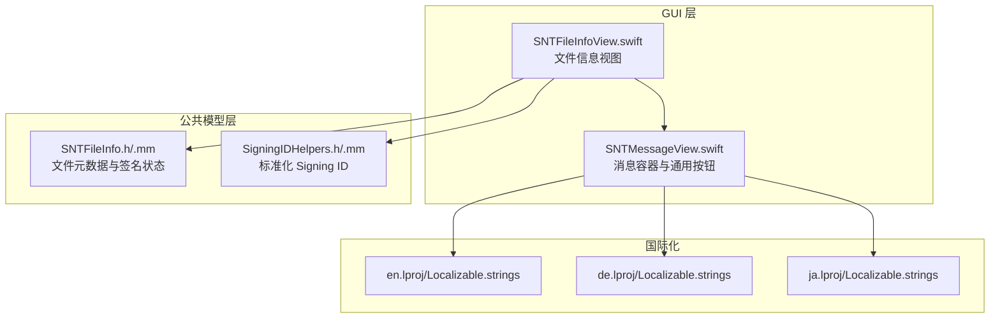
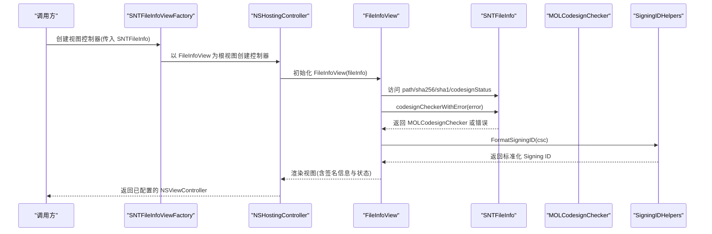
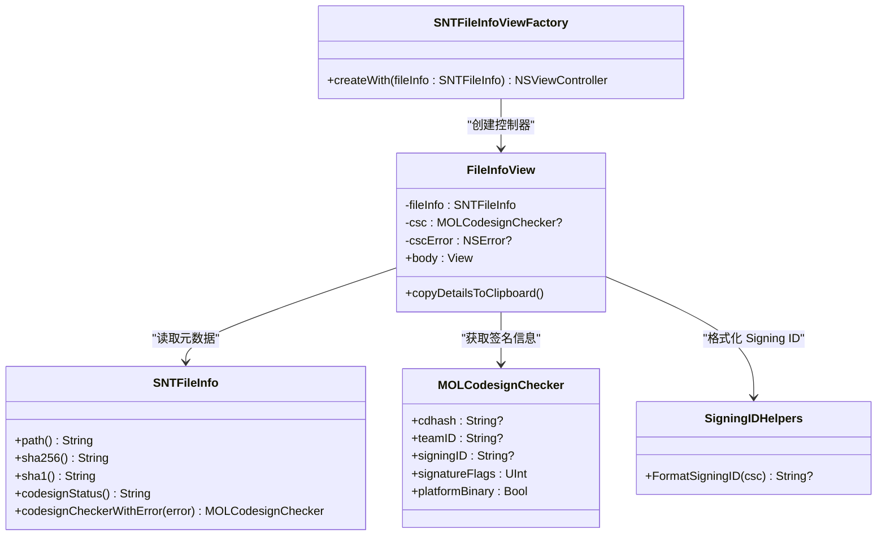
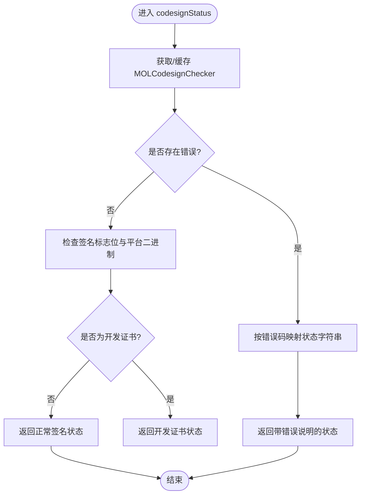
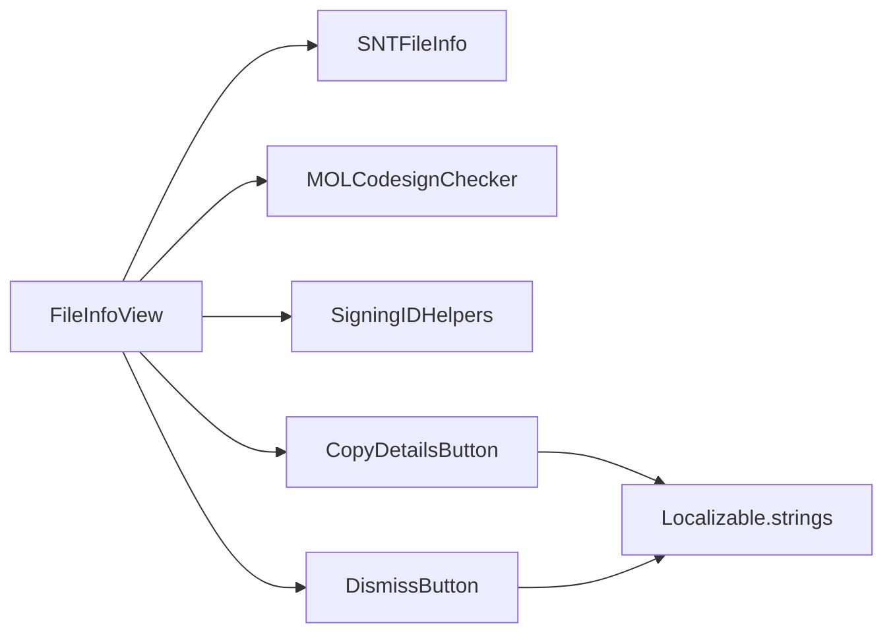

# 文件信息视图

<cite>
**本文引用的文件**
- [SNTFileInfoView.swift](file://Source/gui/SNTFileInfoView.swift)
- [SNTFileInfo.h](file://Source/common/SNTFileInfo.h)
- [SNTFileInfo.mm](file://Source/common/SNTFileInfo.mm)
- [SNTMessageView.swift](file://Source/gui/SNTMessageView.swift)
- [SigningIDHelpers.h](file://Source/common/SigningIDHelpers.h)
- [SigningIDHelpers.mm](file://Source/common/SigningIDHelpers.mm)
- [en.lproj/Localizable.strings](file://Source/gui/Resources/en.lproj/Localizable.strings)
- [de.lproj/Localizable.strings](file://Source/gui/Resources/de.lproj/Localizable.strings)
- [ja.lproj/Localizable.strings](file://Source/gui/Resources/ja.lproj/Localizable.strings)
</cite>

## 目录
1. [简介](#简介)
2. [项目结构](#项目结构)
3. [核心组件](#核心组件)
4. [架构总览](#架构总览)
5. [详细组件分析](#详细组件分析)
6. [依赖关系分析](#依赖关系分析)
7. [性能考量](#性能考量)
8. [故障排查指南](#故障排查指南)
9. [结论](#结论)
10. [附录](#附录)

## 简介
本文件面向 Santa GUI 代理中的“文件信息视图”，系统性梳理并说明 SNTFileInfoView 的 Swift 实现与设计模式，涵盖以下方面：
- 文件元数据展示：路径、SHA-256、SHA-1 等
- 代码签名信息显示：Signing ID、CDHash、Team ID 及签名状态
- 安全状态指示：基于 MOLCodesignChecker 的签名状态解析
- 数据绑定机制、属性映射与动态内容更新
- 文件信息获取流程、解析逻辑与格式化显示
- 国际化支持：多语言字符串资源管理与本地化文本处理
- 视图样式定制、主题适配与响应式布局
- 实际代码示例：文件信息的获取、展示与用户交互处理（以路径引用形式给出）

## 项目结构
围绕文件信息视图的相关模块分布如下：
- GUI 层（SwiftUI）：SNTFileInfoView.swift 提供视图与交互；SNTMessageView.swift 提供通用消息容器与按钮组件（CopyDetailsButton、DismissButton 等）
- 公共模型层（Objective-C）：SNTFileInfo.h/.mm 提供文件元数据与签名状态查询能力
- 签名辅助工具：SigningIDHelpers.h/.mm 提供标准化 Signing ID 格式化
- 国际化资源：en.lproj/de.lproj/ja.lproj 下的 Localizable.strings

**图表来源**
- [SNTFileInfoView.swift](file://Source/gui/SNTFileInfoView.swift#L1-L101)
- [SNTMessageView.swift](file://Source/gui/SNTMessageView.swift#L1-L371)
- [SNTFileInfo.h](file://Source/common/SNTFileInfo.h#L1-L248)
- [SNTFileInfo.mm](file://Source/common/SNTFileInfo.mm#L792-L848)
- [SigningIDHelpers.h](file://Source/common/SigningIDHelpers.h#L1-L33)
- [SigningIDHelpers.mm](file://Source/common/SigningIDHelpers.mm#L1-L35)
- [en.lproj/Localizable.strings](file://Source/gui/Resources/en.lproj/Localizable.strings#L1-L180)
- [de.lproj/Localizable.strings](file://Source/gui/Resources/de.lproj/Localizable.strings#L1-L180)
- [ja.lproj/Localizable.strings](file://Source/gui/Resources/ja.lproj/Localizable.strings#L1-L180)

**章节来源**
- [SNTFileInfoView.swift](file://Source/gui/SNTFileInfoView.swift#L1-L101)
- [SNTMessageView.swift](file://Source/gui/SNTMessageView.swift#L1-L371)
- [SNTFileInfo.h](file://Source/common/SNTFileInfo.h#L1-L248)
- [SNTFileInfo.mm](file://Source/common/SNTFileInfo.mm#L792-L848)
- [SigningIDHelpers.h](file://Source/common/SigningIDHelpers.h#L1-L33)
- [SigningIDHelpers.mm](file://Source/common/SigningIDHelpers.mm#L1-L35)
- [en.lproj/Localizable.strings](file://Source/gui/Resources/en.lproj/Localizable.strings#L1-L180)
- [de.lproj/Localizable.strings](file://Source/gui/Resources/de.lproj/Localizable.strings#L1-L180)
- [ja.lproj/Localizable.strings](file://Source/gui/Resources/ja.lproj/Localizable.strings#L1-L180)

## 核心组件
- SNTFileInfoViewFactory：工厂类，负责将 SNTFileInfo 对象包装为 SwiftUI 视图控制器，便于在 App 中展示
- FileInfoView（SwiftUI 结构体）：承载文件信息展示的主体视图，包含路径、哈希值、签名信息与状态、复制详情与关闭按钮
- SNTFileInfo（Objective-C）：封装文件元数据与签名状态，提供哈希计算、类型判断、Bundle 信息、签名检查器与签名状态解析等
- MOLCodesignChecker：底层签名检查器，用于获取签名标识、CDHash、Team ID 等
- SigningIDHelpers：标准化 Signing ID 输出格式（teamID:signingID 或 platform:signingID）
- SNTMessageView.swift 组件：提供 CopyDetailsButton、DismissButton 等通用 UI 组件与消息容器样式

关键职责与关系：
- FileInfoView 通过 SNTFileInfo 获取文件路径、哈希、签名状态；通过 MOLCodesignChecker 获取 Signing ID、CDHash、Team ID
- CopyDetailsButton 将关键字段复制到剪贴板；DismissButton 关闭窗口
- 国际化字符串通过 NSLocalizedString 使用 en/de/ja 资源文件

**章节来源**
- [SNTFileInfoView.swift](file://Source/gui/SNTFileInfoView.swift#L1-L101)
- [SNTFileInfo.h](file://Source/common/SNTFileInfo.h#L1-L248)
- [SNTFileInfo.mm](file://Source/common/SNTFileInfo.mm#L792-L848)
- [SigningIDHelpers.h](file://Source/common/SigningIDHelpers.h#L1-L33)
- [SigningIDHelpers.mm](file://Source/common/SigningIDHelpers.mm#L1-L35)
- [SNTMessageView.swift](file://Source/gui/SNTMessageView.swift#L121-L210)

## 架构总览
下图展示了从调用方到视图渲染的整体流程，以及各组件之间的依赖关系。

**图表来源**
- [SNTFileInfoView.swift](file://Source/gui/SNTFileInfoView.swift#L1-L101)
- [SNTFileInfo.h](file://Source/common/SNTFileInfo.h#L1-L248)
- [SNTFileInfo.mm](file://Source/common/SNTFileInfo.mm#L792-L848)
- [SigningIDHelpers.h](file://Source/common/SigningIDHelpers.h#L1-L33)
- [SigningIDHelpers.mm](file://Source/common/SigningIDHelpers.mm#L1-L35)

## 详细组件分析

### SNTFileInfoView 与 FileInfoView（SwiftUI）
- 设计模式
  - 工厂模式：SNTFileInfoViewFactory.createWith(fileInfo:) 将 SNTFileInfo 包装为 NSHostingController，统一入口
  - 值类型视图：FileInfoView 作为 struct View，无状态或少量状态（如复制确认动画），利于 SwiftUI 高效重绘
  - 组合与复用：复用 SNTMessageView.swift 中的 CopyDetailsButton、DismissButton 等通用组件
- 数据绑定与属性映射
  - 通过 SNTFileInfo 暴露的只读属性提供数据：path、sha256、sha1、codesignStatus
  - 通过 MOLCodesignChecker 提供的属性：cdhash、teamID、signingID（经 FormatSigningID 标准化）
- 动态内容更新
  - 当 FileInfoView 初始化时一次性获取并缓存 MOLCodesignChecker 与错误；若初始化失败，cscError 会携带 NSError
  - 视图主体根据 csc 是否存在决定是否展示 Signing ID/CDHash/Team ID 字段
- 用户交互
  - 复制详情：CopyDetailsButton 调用 copyDetailsToClipboard，将路径、哈希、签名信息与签名状态拼接后写入剪贴板
  - 关闭窗口：DismissButton 关闭当前 keyWindow

**图表来源**
- [SNTFileInfoView.swift](file://Source/gui/SNTFileInfoView.swift#L1-L101)
- [SNTFileInfo.h](file://Source/common/SNTFileInfo.h#L1-L248)
- [SNTFileInfo.mm](file://Source/common/SNTFileInfo.mm#L792-L848)
- [SigningIDHelpers.h](file://Source/common/SigningIDHelpers.h#L1-L33)
- [SigningIDHelpers.mm](file://Source/common/SigningIDHelpers.mm#L1-L35)

**章节来源**
- [SNTFileInfoView.swift](file://Source/gui/SNTFileInfoView.swift#L1-L101)
- [SNTMessageView.swift](file://Source/gui/SNTMessageView.swift#L121-L210)

### SNTFileInfo（文件元数据与签名状态）
- 文件元数据
  - 路径、大小、vnode、文件句柄等基础属性由内部存储与懒加载策略维护
  - 哈希计算：支持 SHA-1 与 SHA-256 同步计算，采用分块预读与内存管理策略，避免大文件内存压力
  - 文件类型识别：基于 Mach-O 头解析，支持可执行、动态库、Bundle、内核扩展、脚本、XAR、DMG 等
  - Bundle 信息：支持祖先 Bundle 查找与 Info.plist 解析，优先使用嵌入式 Info.plist，其次使用 CFBundle
- 签名状态解析
  - codesignStatus：综合 MOLCodesignChecker 错误码与标志位，返回人类可读的状态字符串，覆盖未签名、签名无效、资源无效、平台二进制、开发证书等多种情形
  - codesignCheckerWithError：缓存 MOLCodesignChecker 与错误，避免重复开销
- 国际化文本
  - 视图中使用的键（如“Path”“SHA-256”“Signed”“Signing ID”“CDHash”“Team ID”）来自 Localizable.strings

**图表来源**
- [SNTFileInfo.mm](file://Source/common/SNTFileInfo.mm#L800-L848)

**章节来源**
- [SNTFileInfo.h](file://Source/common/SNTFileInfo.h#L1-L248)
- [SNTFileInfo.mm](file://Source/common/SNTFileInfo.mm#L1-L848)

### 签名 ID 格式化（SigningIDHelpers）
- FormatSigningID 规范化输出格式：
  - 若存在 teamID，则输出 “teamID:signingID”
  - 若不存在 teamID 且为 platformBinary，则输出 “platform:signingID”
  - 否则返回 nil（不展示）
- 该函数被 FileInfoView 在展示 Signing ID 时调用，确保 UI 显示一致且可读

**章节来源**
- [SigningIDHelpers.h](file://Source/common/SigningIDHelpers.h#L1-L33)
- [SigningIDHelpers.mm](file://Source/common/SigningIDHelpers.mm#L1-L35)
- [SNTFileInfoView.swift](file://Source/gui/SNTFileInfoView.swift#L1-L101)

### 国际化支持（多语言字符串资源）
- 字符串资源位于 en.lproj/de.lproj/ja.lproj 的 Localizable.strings
- 视图中使用的键包括但不限于：
  - “Path”“SHA-256”“Signed”“Signing ID”“CDHash”“Team ID”“Copy Details”“Dismiss”
- SwiftUI 中通过 NSLocalizedString 使用对应语言资源，实现跨语言界面文本切换

**章节来源**
- [en.lproj/Localizable.strings](file://Source/gui/Resources/en.lproj/Localizable.strings#L1-L180)
- [de.lproj/Localizable.strings](file://Source/gui/Resources/de.lproj/Localizable.strings#L1-L180)
- [ja.lproj/Localizable.strings](file://Source/gui/Resources/ja.lproj/Localizable.strings#L1-L180)
- [SNTMessageView.swift](file://Source/gui/SNTMessageView.swift#L121-L210)

### 视图样式定制、主题适配与响应式布局
- 字体与排版
  - 使用等宽字体展示哈希与签名标识，便于对齐与对比
  - 文本可选中，提升可复制性与可读性
- 布局与间距
  - 使用 VStack/HStack 控制垂直与水平排列，设置固定间距与内边距，保证在不同窗口尺寸下的可读性
  - 使用 fixedSize 限制视图尺寸，结合 SNTMessageView 的最大宽度约束，实现响应式布局
- 交互反馈
  - 复制详情按钮在点击后短暂显示确认图标，提供即时反馈
  - 按钮支持键盘快捷键，提升可访问性

**章节来源**
- [SNTFileInfoView.swift](file://Source/gui/SNTFileInfoView.swift#L1-L101)
- [SNTMessageView.swift](file://Source/gui/SNTMessageView.swift#L1-L371)

## 依赖关系分析
- 组件耦合
  - FileInfoView 依赖 SNTFileInfo 与 MOLCodesignChecker，耦合集中在数据访问层
  - 通过 SigningIDHelpers 进行格式化，降低 UI 对签名细节的直接依赖
- 外部依赖
  - Foundation、SwiftUI、LocalAuthentication（授权相关）、系统剪贴板（NSPasteboard）
- 潜在循环依赖
  - 未见循环导入；视图层仅消费模型层接口，保持单向依赖

**图表来源**
- [SNTFileInfoView.swift](file://Source/gui/SNTFileInfoView.swift#L1-L101)
- [SNTMessageView.swift](file://Source/gui/SNTMessageView.swift#L121-L210)
- [SNTFileInfo.h](file://Source/common/SNTFileInfo.h#L1-L248)
- [SNTFileInfo.mm](file://Source/common/SNTFileInfo.mm#L792-L848)
- [SigningIDHelpers.h](file://Source/common/SigningIDHelpers.h#L1-L33)
- [SigningIDHelpers.mm](file://Source/common/SigningIDHelpers.mm#L1-L35)

**章节来源**
- [SNTFileInfoView.swift](file://Source/gui/SNTFileInfoView.swift#L1-L101)
- [SNTMessageView.swift](file://Source/gui/SNTMessageView.swift#L121-L210)
- [SNTFileInfo.h](file://Source/common/SNTFileInfo.h#L1-L248)
- [SNTFileInfo.mm](file://Source/common/SNTFileInfo.mm#L792-L848)
- [SigningIDHelpers.h](file://Source/common/SigningIDHelpers.h#L1-L33)
- [SigningIDHelpers.mm](file://Source/common/SigningIDHelpers.mm#L1-L35)

## 性能考量
- 哈希计算
  - 采用分块读取与预读建议，减少随机 IO 开销；对超大文件进行合理分块，避免内存峰值
- 缓存策略
  - SNTFileInfo 对签名检查器与哈希结果进行缓存，避免重复计算与系统调用
- 视图渲染
  - 值类型视图与最小状态更新，配合 SwiftUI 的增量重绘，提高滚动与切换体验
- 剪贴板写入
  - 复制详情为一次性字符串拼接与写入，开销极低

[本节为通用性能讨论，无需特定文件分析]

## 故障排查指南
- 签名状态异常
  - 若 codesignCheckerWithError 返回错误，codesignStatus 会根据错误码映射到具体提示（如签名无效、资源无效、证书吊销等）
  - 可通过 cscError 字段定位底层错误来源
- 无法获取签名信息
  - 若 FormatSigningID 返回 nil，可能由于缺少 teamID 且非 platformBinary，导致不展示 Signing ID
- 剪贴板复制失败
  - 检查 NSPasteboard 权限与系统设置；确认 copyDetailsToClipboard 被正确触发
- 国际化文本未生效
  - 确认 Localizable.strings 中键名与视图引用一致；检查应用语言设置与资源包加载

**章节来源**
- [SNTFileInfo.mm](file://Source/common/SNTFileInfo.mm#L800-L848)
- [SNTFileInfoView.swift](file://Source/gui/SNTFileInfoView.swift#L1-L101)
- [SNTMessageView.swift](file://Source/gui/SNTMessageView.swift#L121-L210)

## 结论
SNTFileInfoView 通过清晰的工厂与视图分离、稳健的模型层数据访问、标准化的签名 ID 格式化与完善的国际化支持，实现了对文件元数据与安全状态的直观展示。其 SwiftUI 设计兼顾可读性与交互效率，适合在 GUI 代理中作为通用的信息面板使用。

[本节为总结性内容，无需特定文件分析]

## 附录

### 实际代码示例（以路径引用形式）
- 创建并展示文件信息视图控制器
  - [SNTFileInfoViewFactory.createWith(fileInfo:)](file://Source/gui/SNTFileInfoView.swift#L1-L14)
- 初始化 FileInfoView 并访问 SNTFileInfo
  - [FileInfoView.init(fileInfo:)](file://Source/gui/SNTFileInfoView.swift#L16-L30)
- 获取并展示签名信息
  - [SNTFileInfo.codesignCheckerWithError(_:)](file://Source/common/SNTFileInfo.h#L236-L240)
  - [SigningIDHelpers.FormatSigningID(_)](file://Source/common/SigningIDHelpers.mm#L1-L35)
- 复制详情到剪贴板
  - [FileInfoView.copyDetailsToClipboard()](file://Source/gui/SNTFileInfoView.swift#L32-L54)
- 关闭窗口
  - [DismissButton 行为](file://Source/gui/SNTFileInfoView.swift#L91-L97)
- 国际化文本键
  - [en.lproj/Localizable.strings 中的键](file://Source/gui/Resources/en.lproj/Localizable.strings#L80-L120)
  - [de.lproj/Localizable.strings 中的键](file://Source/gui/Resources/de.lproj/Localizable.strings#L80-L120)
  - [ja.lproj/Localizable.strings 中的键](file://Source/gui/Resources/ja.lproj/Localizable.strings#L80-L120)