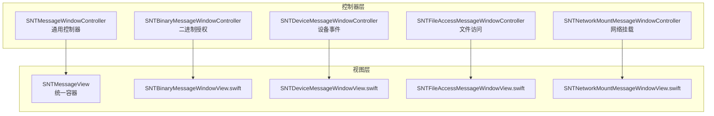
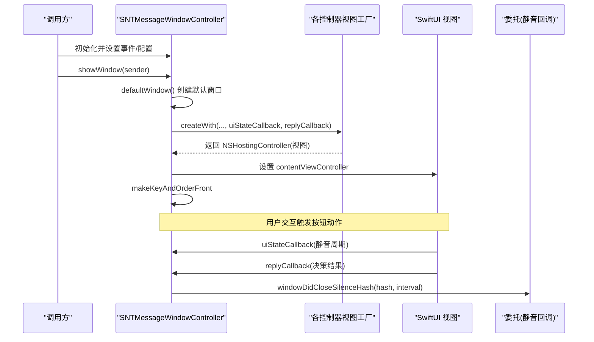
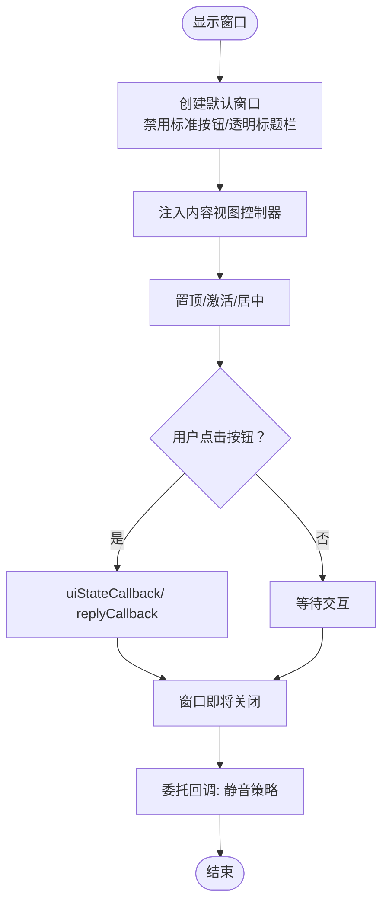
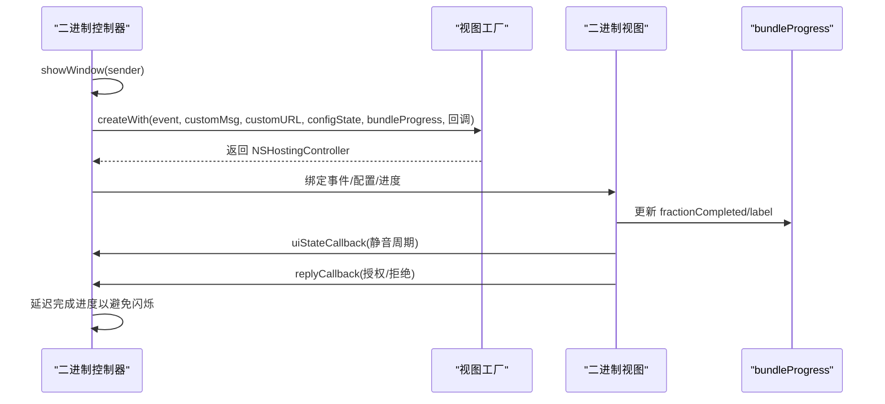
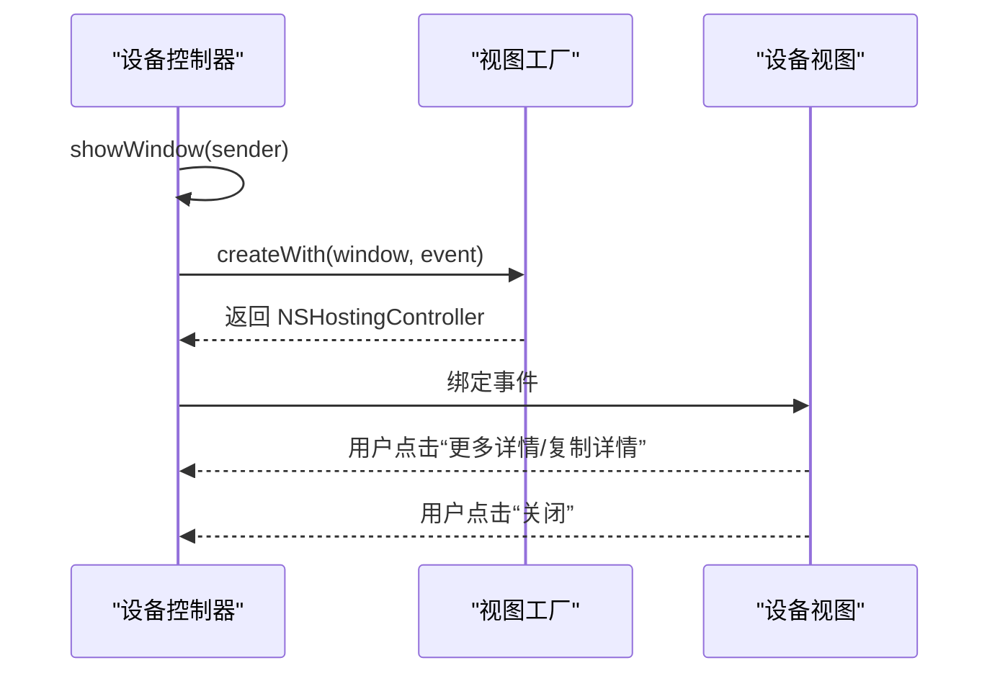
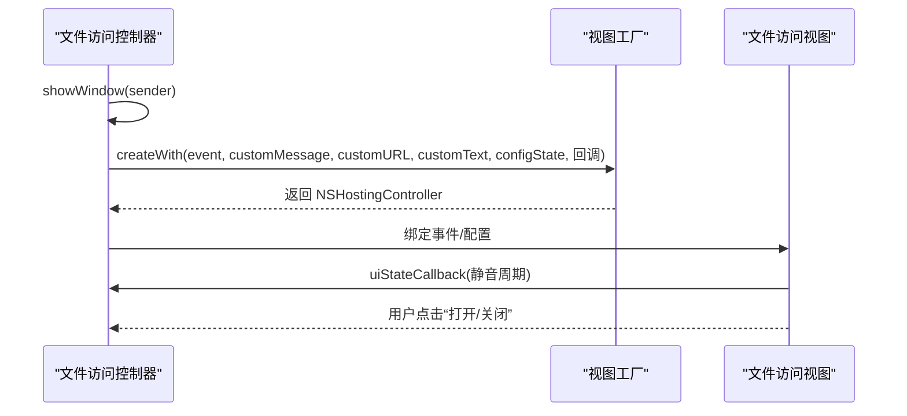
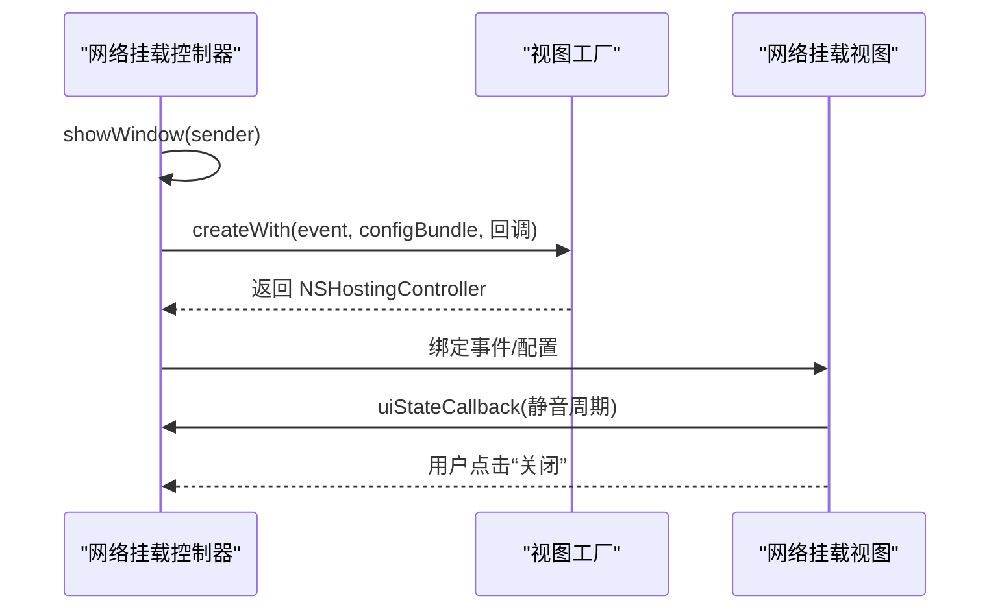
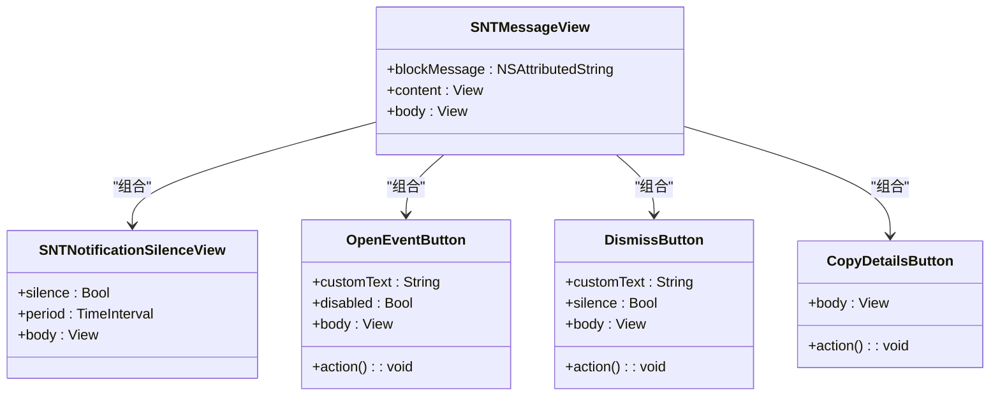
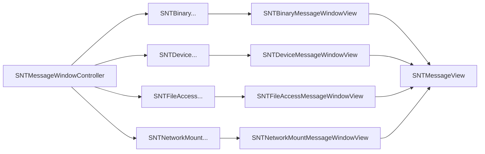

# 消息窗口控制器

<cite>
**本文引用的文件**
- [SNTMessageWindowController.h](file://Source/gui/SNTMessageWindowController.h)
- [SNTMessageWindowController.mm](file://Source/gui/SNTMessageWindowController.mm)
- [SNTBinaryMessageWindowController.h](file://Source/gui/SNTBinaryMessageWindowController.h)
- [SNTBinaryMessageWindowController.mm](file://Source/gui/SNTBinaryMessageWindowController.mm)
- [SNTBinaryMessageWindowView.swift](file://Source/gui/SNTBinaryMessageWindowView.swift)
- [SNTDeviceMessageWindowController.h](file://Source/gui/SNTDeviceMessageWindowController.h)
- [SNTDeviceMessageWindowController.mm](file://Source/gui/SNTDeviceMessageWindowController.mm)
- [SNTDeviceMessageWindowView.swift](file://Source/gui/SNTDeviceMessageWindowView.swift)
- [SNTFileAccessMessageWindowController.h](file://Source/gui/SNTFileAccessMessageWindowController.h)
- [SNTFileAccessMessageWindowController.mm](file://Source/gui/SNTFileAccessMessageWindowController.mm)
- [SNTFileAccessMessageWindowView.swift](file://Source/gui/SNTFileAccessMessageWindowView.swift)
- [SNTNetworkMountMessageWindowController.h](file://Source/gui/SNTNetworkMountMessageWindowController.h)
- [SNTNetworkMountMessageWindowController.mm](file://Source/gui/SNTNetworkMountMessageWindowController.mm)
- [SNTNetworkMountMessageWindowView.swift](file://Source/gui/SNTNetworkMountMessageWindowView.swift)
- [SNTMessageView.swift](file://Source/gui/SNTMessageView.swift)
</cite>

## 目录
1. [简介](#简介)
2. [项目结构](#项目结构)
3. [核心组件](#核心组件)
4. [架构总览](#架构总览)
5. [详细组件分析](#详细组件分析)
6. [依赖关系分析](#依赖关系分析)
7. [性能考虑](#性能考虑)
8. [故障排查指南](#故障排查指南)
9. [结论](#结论)
10. [附录](#附录)

## 简介
本文件系统性梳理 Santa GUI 代理中的“消息窗口控制器”体系，覆盖通用控制器与四类专用控制器：二进制授权消息窗口、设备事件消息窗口、文件访问消息窗口、网络挂载消息窗口。重点说明各控制器的设计模式（继承自统一基类）、生命周期管理、视图绑定与用户交互处理；解释消息数据模型、界面布局与响应式设计；阐述窗口显示策略、模态对话框处理与用户确认流程；并提供针对不同消息类型的处理逻辑与界面定制方法的路径指引。

## 项目结构
GUI 层采用“控制器 + SwiftUI 视图”的分层组织方式：
- 控制器层：以 SNTMessageWindowController 为基类，派生出四类专用控制器，负责窗口生命周期、事件数据绑定、用户交互回调与静音策略持久化。
- 视图层：每类控制器通过对应的 Swift 工厂创建 SwiftUI 内容视图，统一由 SNTMessageView 承载标题与消息正文，子视图负责具体字段展示与按钮行为。
- 数据模型：各控制器持有对应事件对象（执行、设备、文件访问、网络挂载），用于渲染与决策回传。

图表来源
- [SNTMessageWindowController.h](file://Source/gui/SNTMessageWindowController.h#L23-L42)
- [SNTBinaryMessageWindowController.mm](file://Source/gui/SNTBinaryMessageWindowController.mm#L80-L100)
- [SNTDeviceMessageWindowController.mm](file://Source/gui/SNTDeviceMessageWindowController.mm#L34-L44)
- [SNTFileAccessMessageWindowController.mm](file://Source/gui/SNTFileAccessMessageWindowController.mm#L50-L71)
- [SNTNetworkMountMessageWindowController.mm](file://Source/gui/SNTNetworkMountMessageWindowController.mm#L31-L46)
- [SNTMessageView.swift](file://Source/gui/SNTMessageView.swift#L17-L75)

章节来源
- [SNTMessageWindowController.h](file://Source/gui/SNTMessageWindowController.h#L23-L42)
- [SNTMessageWindowController.mm](file://Source/gui/SNTMessageWindowController.mm#L23-L78)
- [SNTBinaryMessageWindowController.mm](file://Source/gui/SNTBinaryMessageWindowController.mm#L80-L100)
- [SNTDeviceMessageWindowController.mm](file://Source/gui/SNTDeviceMessageWindowController.mm#L34-L44)
- [SNTFileAccessMessageWindowController.mm](file://Source/gui/SNTFileAccessMessageWindowController.mm#L50-L71)
- [SNTNetworkMountMessageWindowController.mm](file://Source/gui/SNTNetworkMountMessageWindowController.mm#L31-L46)
- [SNTMessageView.swift](file://Source/gui/SNTMessageView.swift#L17-L75)

## 核心组件
- 通用消息窗口控制器（SNTMessageWindowController）
  - 职责：提供默认窗口样式、显示/关闭、窗口关闭时的静音策略回调、消息唯一标识计算接口。
  - 关键点：默认窗口禁用标准控制按钮、透明标题栏、可拖拽背景移动；窗口关闭前通过委托回调携带静音周期，用于后续去重与抑制通知。
- 二进制授权消息窗口控制器（SNTBinaryMessageWindowController）
  - 职责：承载执行事件详情、自定义消息/链接、配置状态、进度对象；在显示时注入 SwiftUI 视图工厂，支持“静音未来通知”与“打开事件详情”等交互。
  - 关键点：当需要计算 bundle 哈希时，显示不确定进度并延迟完成以避免闪烁；支持本地生物识别授权（独立模式）。
- 设备事件消息窗口控制器（SNTDeviceMessageWindowController）
  - 职责：展示设备挂载/卸载相关事件，如挂载点、重挂载参数等。
- 文件访问消息窗口控制器（SNTFileAccessMessageWindowController）
  - 职责：展示文件访问被阻止事件，包含访问路径、进程信息、规则名称与版本等。
- 网络挂载消息窗口控制器（SNTNetworkMountMessageWindowController）
  - 职责：展示网络共享挂载被阻止事件，包含源地址、目标挂载点、文件系统类型等，并支持配置驱动的自定义消息与静音策略开关。

章节来源
- [SNTMessageWindowController.h](file://Source/gui/SNTMessageWindowController.h#L19-L42)
- [SNTMessageWindowController.mm](file://Source/gui/SNTMessageWindowController.mm#L23-L78)
- [SNTBinaryMessageWindowController.h](file://Source/gui/SNTBinaryMessageWindowController.h#L27-L72)
- [SNTBinaryMessageWindowController.mm](file://Source/gui/SNTBinaryMessageWindowController.mm#L80-L126)
- [SNTDeviceMessageWindowController.h](file://Source/gui/SNTDeviceMessageWindowController.h#L21-L34)
- [SNTDeviceMessageWindowController.mm](file://Source/gui/SNTDeviceMessageWindowController.mm#L26-L53)
- [SNTFileAccessMessageWindowController.h](file://Source/gui/SNTFileAccessMessageWindowController.h#L21-L40)
- [SNTFileAccessMessageWindowController.mm](file://Source/gui/SNTFileAccessMessageWindowController.mm#L32-L83)
- [SNTNetworkMountMessageWindowController.h](file://Source/gui/SNTNetworkMountMessageWindowController.h#L15-L30)
- [SNTNetworkMountMessageWindowController.mm](file://Source/gui/SNTNetworkMountMessageWindowController.mm#L19-L53)

## 架构总览
下图展示控制器到视图的调用链路与数据流：

图表来源
- [SNTMessageWindowController.mm](file://Source/gui/SNTMessageWindowController.mm#L41-L70)
- [SNTBinaryMessageWindowController.mm](file://Source/gui/SNTBinaryMessageWindowController.mm#L80-L100)
- [SNTFileAccessMessageWindowController.mm](file://Source/gui/SNTFileAccessMessageWindowController.mm#L50-L71)
- [SNTNetworkMountMessageWindowController.mm](file://Source/gui/SNTNetworkMountMessageWindowController.mm#L31-L46)
- [SNTDeviceMessageWindowController.mm](file://Source/gui/SNTDeviceMessageWindowController.mm#L34-L44)

## 详细组件分析

### 通用消息窗口控制器（SNTMessageWindowController）
- 设计模式：基于 NSWindowController 的轻量封装，提供统一的窗口样式与生命周期钩子；通过委托在窗口关闭时回传静音策略，便于后续去重与抑制。
- 生命周期管理：
  - 显示：提升窗口层级、允许通过窗口背景拖动、置顶并居中、激活应用。
  - 关闭：在窗口即将关闭时，根据是否设置了静音周期，调用委托回调传递 hash 与间隔。
  - 首次调整大小：首次尺寸变化后进行居中，确保窗口稳定显示。
- 视图绑定：默认窗口由子类在 showWindow 中注入内容视图控制器。
- 用户交互：交由各专用视图处理，控制器仅负责窗口级行为与静音策略持久化。

图表来源
- [SNTMessageWindowController.mm](file://Source/gui/SNTMessageWindowController.mm#L41-L70)

章节来源
- [SNTMessageWindowController.h](file://Source/gui/SNTMessageWindowController.h#L23-L42)
- [SNTMessageWindowController.mm](file://Source/gui/SNTMessageWindowController.mm#L23-L78)

### 二进制授权消息窗口控制器（SNTBinaryMessageWindowController）
- 功能要点：
  - 接收执行事件、自定义消息/链接、配置状态与回复回调。
  - 在显示时创建 SwiftUI 视图，支持“静音未来通知”“打开事件详情”“更多详情”“复制详情”等。
  - 当事件需要计算 bundle 哈希时，显示线性进度并延迟完成，避免快速扫描导致的视觉闪烁。
  - 支持独立模式下的 Touch ID 授权，替代“打开事件”按钮。
- 数据模型：事件对象包含文件信息、签名信息、父进程信息等；哈希用于去重与静音。
- 界面布局：统一由 SNTMessageView 承载标题与正文，内部嵌套事件详情视图与操作区。

图表来源
- [SNTBinaryMessageWindowController.mm](file://Source/gui/SNTBinaryMessageWindowController.mm#L80-L126)
- [SNTBinaryMessageWindowView.swift](file://Source/gui/SNTBinaryMessageWindowView.swift#L238-L318)
- [SNTBinaryMessageWindowView.swift](file://Source/gui/SNTBinaryMessageWindowView.swift#L319-L427)

章节来源
- [SNTBinaryMessageWindowController.h](file://Source/gui/SNTBinaryMessageWindowController.h#L27-L72)
- [SNTBinaryMessageWindowController.mm](file://Source/gui/SNTBinaryMessageWindowController.mm#L40-L126)
- [SNTBinaryMessageWindowView.swift](file://Source/gui/SNTBinaryMessageWindowView.swift#L1-L120)
- [SNTBinaryMessageWindowView.swift](file://Source/gui/SNTBinaryMessageWindowView.swift#L120-L220)
- [SNTBinaryMessageWindowView.swift](file://Source/gui/SNTBinaryMessageWindowView.swift#L220-L320)
- [SNTBinaryMessageWindowView.swift](file://Source/gui/SNTBinaryMessageWindowView.swift#L320-L427)

### 设备事件消息窗口控制器（SNTDeviceMessageWindowController）
- 功能要点：
  - 展示设备挂载/卸载事件，如挂载点名称、重挂载参数等。
  - 提供“更多详情”与“复制详情”能力，便于审计与取证。
- 数据模型：事件对象包含挂载点、重挂载参数等字段。
- 界面布局：统一由 SNTMessageView 承载，事件详情视图展示关键字段。

图表来源
- [SNTDeviceMessageWindowController.mm](file://Source/gui/SNTDeviceMessageWindowController.mm#L34-L44)
- [SNTDeviceMessageWindowView.swift](file://Source/gui/SNTDeviceMessageWindowView.swift#L30-L70)

章节来源
- [SNTDeviceMessageWindowController.h](file://Source/gui/SNTDeviceMessageWindowController.h#L21-L34)
- [SNTDeviceMessageWindowController.mm](file://Source/gui/SNTDeviceMessageWindowController.mm#L26-L53)
- [SNTDeviceMessageWindowView.swift](file://Source/gui/SNTDeviceMessageWindowView.swift#L1-L70)

### 文件访问消息窗口控制器（SNTFileAccessMessageWindowController）
- 功能要点：
  - 展示文件访问被阻止事件，包含访问路径、进程信息、规则名称与版本等。
  - 支持自定义消息、自定义链接与自定义按钮文本；提供“静音未来通知”选项。
- 数据模型：事件对象包含访问路径、进程信息、规则元数据等。
- 界面布局：统一由 SNTMessageView 承载，事件详情视图展示关键字段与“更多详情/复制详情”。

图表来源
- [SNTFileAccessMessageWindowController.mm](file://Source/gui/SNTFileAccessMessageWindowController.mm#L50-L83)
- [SNTFileAccessMessageWindowView.swift](file://Source/gui/SNTFileAccessMessageWindowView.swift#L221-L277)

章节来源
- [SNTFileAccessMessageWindowController.h](file://Source/gui/SNTFileAccessMessageWindowController.h#L21-L40)
- [SNTFileAccessMessageWindowController.mm](file://Source/gui/SNTFileAccessMessageWindowController.mm#L32-L83)
- [SNTFileAccessMessageWindowView.swift](file://Source/gui/SNTFileAccessMessageWindowView.swift#L1-L120)
- [SNTFileAccessMessageWindowView.swift](file://Source/gui/SNTFileAccessMessageWindowView.swift#L120-L220)
- [SNTFileAccessMessageWindowView.swift](file://Source/gui/SNTFileAccessMessageWindowView.swift#L220-L277)

### 网络挂载消息窗口控制器（SNTNetworkMountMessageWindowController）
- 功能要点：
  - 展示网络共享挂载被阻止事件，包含源地址、目标挂载点、文件系统类型等。
  - 支持配置驱动的自定义消息与静音策略开关。
- 数据模型：事件对象包含网络挂载来源、目标、文件系统类型及进程信息等。
- 界面布局：统一由 SNTMessageView 承载，事件详情视图展示关键字段与“更多详情/复制详情”。

图表来源
- [SNTNetworkMountMessageWindowController.mm](file://Source/gui/SNTNetworkMountMessageWindowController.mm#L31-L53)
- [SNTNetworkMountMessageWindowView.swift](file://Source/gui/SNTNetworkMountMessageWindowView.swift#L206-L260)

章节来源
- [SNTNetworkMountMessageWindowController.h](file://Source/gui/SNTNetworkMountMessageWindowController.h#L15-L30)
- [SNTNetworkMountMessageWindowController.mm](file://Source/gui/SNTNetworkMountMessageWindowController.mm#L19-L53)
- [SNTNetworkMountMessageWindowView.swift](file://Source/gui/SNTNetworkMountMessageWindowView.swift#L1-L120)
- [SNTNetworkMountMessageWindowView.swift](file://Source/gui/SNTNetworkMountMessageWindowView.swift#L120-L206)
- [SNTNetworkMountMessageWindowView.swift](file://Source/gui/SNTNetworkMountMessageWindowView.swift#L206-L260)

### 共享视图与响应式设计（SNTMessageView.swift）
- 统一容器：SNTMessageView 负责标题区（含品牌图标与节日主题切换）、消息正文（支持富文本）、内容区域与底部按钮区。
- 响应式设计：固定最大宽高，内容区域自适应；按钮区采用等宽按钮与键盘快捷键提示，提升可用性。
- 交互组件：
  - 更多详情：弹出详情面板，支持复制全部信息。
  - 复制详情：一键复制结构化文本到剪贴板，带短暂确认反馈。
  - 静音未来通知：可选时间段（天/周/月），自动勾选复选框。
  - 按钮：打开事件、批准（独立模式）、关闭等，均支持键盘快捷键。

图表来源
- [SNTMessageView.swift](file://Source/gui/SNTMessageView.swift#L17-L75)
- [SNTMessageView.swift](file://Source/gui/SNTMessageView.swift#L77-L120)
- [SNTMessageView.swift](file://Source/gui/SNTMessageView.swift#L121-L210)
- [SNTMessageView.swift](file://Source/gui/SNTMessageView.swift#L211-L371)

章节来源
- [SNTMessageView.swift](file://Source/gui/SNTMessageView.swift#L1-L371)

## 依赖关系分析
- 控制器对视图的依赖：各控制器通过工厂方法注入 SwiftUI 视图，形成“控制器负责生命周期与数据，视图负责渲染与交互”的清晰边界。
- 控制器对委托的依赖：通用控制器在窗口关闭时通过委托回调传递静音策略，避免重复通知。
- 视图对配置的依赖：视图从配置对象读取自定义消息、按钮文本、静音策略开关等，实现界面定制。
- 数据模型依赖：各控制器持有对应事件对象，作为视图渲染与决策回传的数据源。

图表来源
- [SNTMessageWindowController.h](file://Source/gui/SNTMessageWindowController.h#L23-L42)
- [SNTBinaryMessageWindowController.h](file://Source/gui/SNTBinaryMessageWindowController.h#L27-L72)
- [SNTDeviceMessageWindowController.h](file://Source/gui/SNTDeviceMessageWindowController.h#L21-L34)
- [SNTFileAccessMessageWindowController.h](file://Source/gui/SNTFileAccessMessageWindowController.h#L21-L40)
- [SNTNetworkMountMessageWindowController.h](file://Source/gui/SNTNetworkMountMessageWindowController.h#L15-L30)
- [SNTMessageView.swift](file://Source/gui/SNTMessageView.swift#L17-L75)

章节来源
- [SNTMessageWindowController.h](file://Source/gui/SNTMessageWindowController.h#L23-L42)
- [SNTBinaryMessageWindowController.h](file://Source/gui/SNTBinaryMessageWindowController.h#L27-L72)
- [SNTDeviceMessageWindowController.h](file://Source/gui/SNTDeviceMessageWindowController.h#L21-L34)
- [SNTFileAccessMessageWindowController.h](file://Source/gui/SNTFileAccessMessageWindowController.h#L21-L40)
- [SNTNetworkMountMessageWindowController.h](file://Source/gui/SNTNetworkMountMessageWindowController.h#L15-L30)
- [SNTMessageView.swift](file://Source/gui/SNTMessageView.swift#L17-L75)

## 性能考虑
- 进度更新与主线程调度：二进制授权控制器通过 KVO 观察进度对象并在主线程更新 UI，避免跨线程更新导致的闪烁与卡顿。
- 延迟完成策略：在 bundle 哈希计算完成后延迟一段时间再标记完成，减少短时扫描造成的 UI 抖动。
- 视图固定尺寸：视图采用 fixedSize 并限制最大宽高，有助于布局稳定与渲染性能。
- 键盘快捷键：为常用操作绑定快捷键，减少鼠标交互开销，提升效率。

章节来源
- [SNTBinaryMessageWindowController.mm](file://Source/gui/SNTBinaryMessageWindowController.mm#L68-L78)
- [SNTBinaryMessageWindowController.mm](file://Source/gui/SNTBinaryMessageWindowController.mm#L110-L123)
- [SNTMessageView.swift](file://Source/gui/SNTMessageView.swift#L6-L16)
- [SNTMessageView.swift](file://Source/gui/SNTMessageView.swift#L315-L371)

## 故障排查指南
- 无法显示窗口或无响应
  - 检查控制器是否正确创建默认窗口并注入内容视图控制器。
  - 确认窗口层级与激活状态已设置。
  - 参考路径：[显示窗口流程](file://Source/gui/SNTMessageWindowController.mm#L41-L52)
- 静音策略未生效
  - 确认用户选择了“静音未来通知”，并检查委托回调是否收到静音周期。
  - 参考路径：[窗口关闭回调](file://Source/gui/SNTMessageWindowController.mm#L54-L63)
- Touch ID 授权失败
  - 检查设备是否支持生物识别与策略配置；查看授权辅助函数返回值。
  - 参考路径：[Touch ID 授权](file://Source/gui/SNTMessageView.swift#L223-L235)
- 详情复制无效
  - 确认剪贴板写入逻辑与按钮点击事件绑定正常。
  - 参考路径：[复制详情实现](file://Source/gui/SNTBinaryMessageWindowView.swift#L59-L86)
- 网络挂载消息未按配置显示
  - 检查配置包中的自定义消息与静音策略开关是否正确加载。
  - 参考路径：[网络挂载视图消息获取](file://Source/gui/SNTNetworkMountMessageWindowView.swift#L233-L239)

章节来源
- [SNTMessageWindowController.mm](file://Source/gui/SNTMessageWindowController.mm#L41-L70)
- [SNTMessageView.swift](file://Source/gui/SNTMessageView.swift#L223-L235)
- [SNTBinaryMessageWindowView.swift](file://Source/gui/SNTBinaryMessageWindowView.swift#L59-L86)
- [SNTNetworkMountMessageWindowView.swift](file://Source/gui/SNTNetworkMountMessageWindowView.swift#L233-L239)

## 结论
Santa GUI 的消息窗口控制器体系以统一基类为核心，结合专用控制器与 SwiftUI 视图，实现了高度一致的用户体验与灵活的界面定制能力。通过委托回调与配置驱动，系统在保证安全策略执行的同时，提供了便捷的用户交互与审计能力。建议在扩展新类型消息时遵循现有模式：控制器负责生命周期与数据绑定，视图负责渲染与交互，配置驱动界面文案与行为。

## 附录
- 实际代码示例路径（不直接展示代码内容）：
  - 二进制授权窗口显示与进度绑定：[显示与进度](file://Source/gui/SNTBinaryMessageWindowController.mm#L80-L126)
  - 文件访问窗口显示与静音回调：[显示与回调](file://Source/gui/SNTFileAccessMessageWindowController.mm#L50-L83)
  - 网络挂载窗口显示与配置读取：[显示与配置](file://Source/gui/SNTNetworkMountMessageWindowController.mm#L31-L53)
  - 通用窗口关闭静音回调：[关闭回调](file://Source/gui/SNTMessageWindowController.mm#L54-L63)
  - 统一视图容器与交互组件：[视图容器与按钮](file://Source/gui/SNTMessageView.swift#L17-L75)