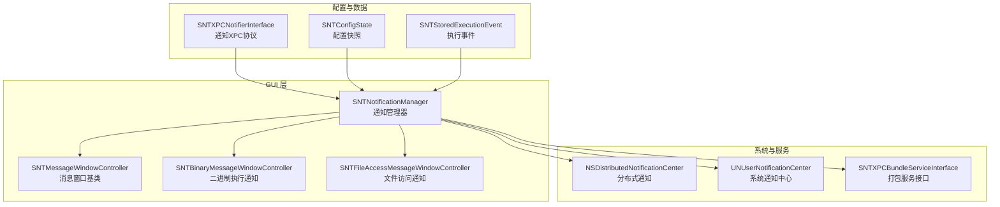
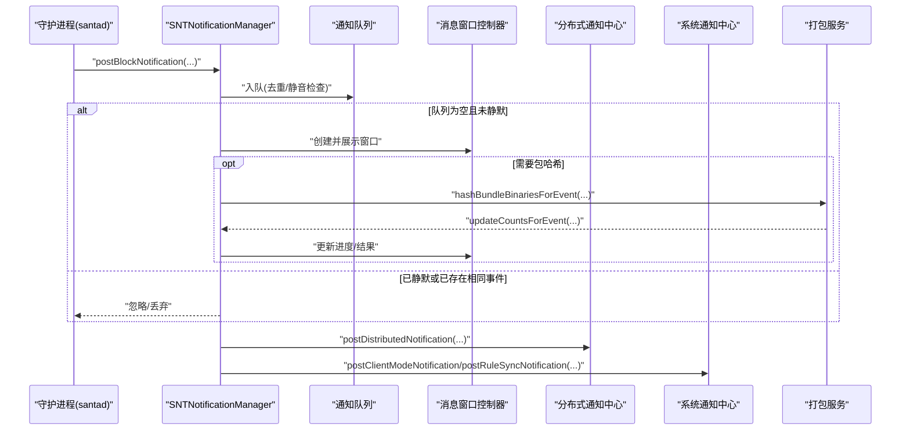
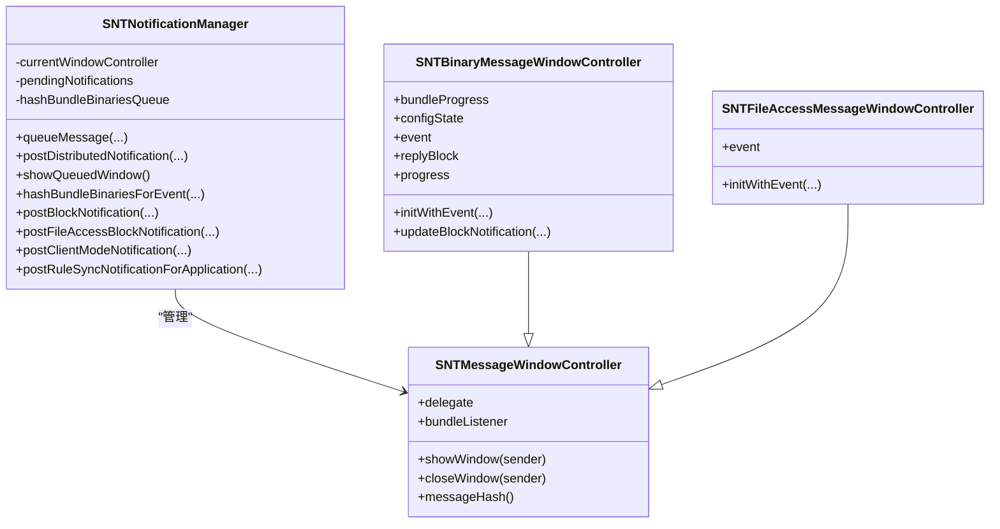
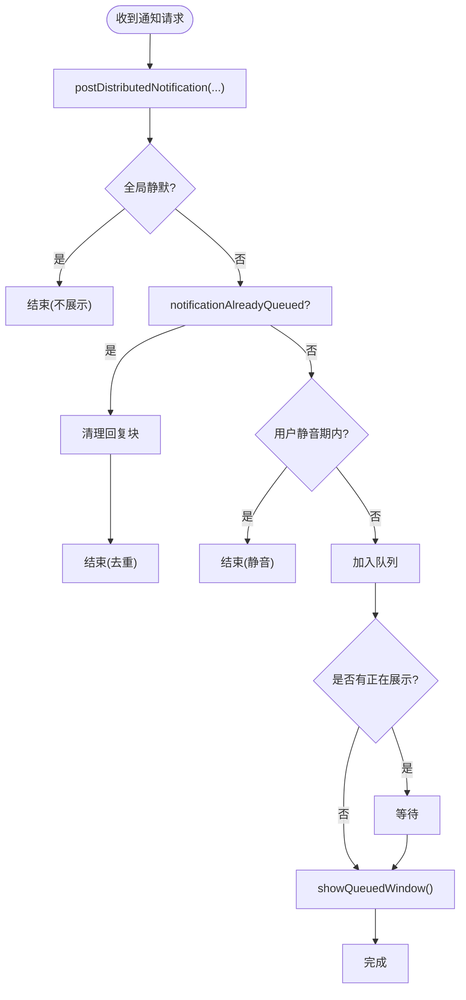
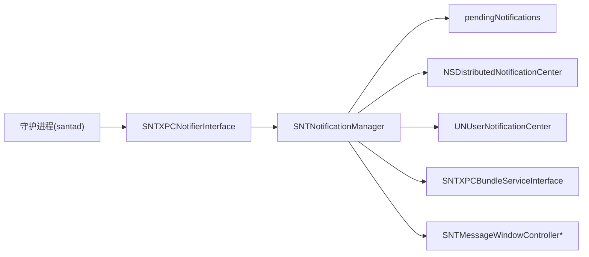

# 通知管理器

<cite>
**本文引用的文件**
- [SNTNotificationManager.h](file://Source/gui/SNTNotificationManager.h)
- [SNTNotificationManager.mm](file://Source/gui/SNTNotificationManager.mm)
- [SNTMessageWindowController.h](file://Source/gui/SNTMessageWindowController.h)
- [SNTMessageWindowController.mm](file://Source/gui/SNTMessageWindowController.mm)
- [SNTBinaryMessageWindowController.h](file://Source/gui/SNTBinaryMessageWindowController.h)
- [SNTBinaryMessageWindowController.mm](file://Source/gui/SNTBinaryMessageWindowController.mm)
- [SNTFileAccessMessageWindowController.h](file://Source/gui/SNTFileAccessMessageWindowController.h)
- [SNTFileAccessMessageWindowController.mm](file://Source/gui/SNTFileAccessMessageWindowController.mm)
- [SNTXPCNotifierInterface.h](file://Source/common/SNTXPCNotifierInterface.h)
- [SNTXPCBundleServiceInterface.h](file://Source/common/SNTXPCBundleServiceInterface.h)
- [SNTConfigState.h](file://Source/common/SNTConfigState.h)
- [SNTStoredExecutionEvent.h](file://Source/common/SNTStoredExecutionEvent.h)
- [SNTCommonEnums.h](file://Source/common/SNTCommonEnums.h)
- [SNTNotificationManagerTest.mm](file://Source/gui/SNTNotificationManagerTest.mm)
</cite>

## 目录
1. [简介](#简介)
2. [项目结构](#项目结构)
3. [核心组件](#核心组件)
4. [架构总览](#架构总览)
5. [组件详解](#组件详解)
6. [依赖关系分析](#依赖关系分析)
7. [性能考量](#性能考量)
8. [故障排查指南](#故障排查指南)
9. [结论](#结论)
10. [附录：使用示例路径](#附录使用示例路径)

## 简介
本文件面向 Santa GUI 代理的通知管理器，系统性阐述 SNTNotificationManager 的设计与实现，覆盖通知队列管理、消息分发、用户交互处理、分布式通知广播、系统通知中心集成、本地化与配置驱动的消息格式化、以及与打包服务的异步进度回调等关键能力。文档同时给出通知类型分类、优先级与批量处理机制说明，并提供可直接定位到源码的示例路径，帮助开发者快速理解并扩展通知系统。

## 项目结构
通知系统主要由 GUI 层的 SNTNotificationManager 与多种消息窗口控制器组成，通过 XPC 接口与守护进程通信，并借助系统分布式通知与 UNUserNotificationCenter 实现跨进程与系统级通知。

图示来源
- [SNTNotificationManager.mm](file://Source/gui/SNTNotificationManager.mm#L1-L120)
- [SNTMessageWindowController.h](file://Source/gui/SNTMessageWindowController.h#L1-L43)
- [SNTBinaryMessageWindowController.h](file://Source/gui/SNTBinaryMessageWindowController.h#L1-L72)
- [SNTFileAccessMessageWindowController.h](file://Source/gui/SNTFileAccessMessageWindowController.h#L1-L40)
- [SNTXPCNotifierInterface.h](file://Source/common/SNTXPCNotifierInterface.h#L1-L57)
- [SNTXPCBundleServiceInterface.h](file://Source/common/SNTXPCBundleServiceInterface.h#L1-L77)
- [SNTConfigState.h](file://Source/common/SNTConfigState.h#L1-L32)
- [SNTStoredExecutionEvent.h](file://Source/common/SNTStoredExecutionEvent.h#L1-L142)

章节来源
- [SNTNotificationManager.h](file://Source/gui/SNTNotificationManager.h#L1-L30)
- [SNTNotificationManager.mm](file://Source/gui/SNTNotificationManager.mm#L1-L120)

## 核心组件
- SNTNotificationManager：GUI 侧通知中枢，负责排队、去重、静音控制、分布式通知广播、系统通知中心推送、以及与打包服务的异步进度回调对接。
- SNTMessageWindowController 及其子类：
  - SNTBinaryMessageWindowController：处理二进制执行阻断通知，支持打包哈希计算进度与结果回填。
  - SNTFileAccessMessageWindowController：处理文件访问阻断通知。
- SNTXPCNotifierInterface：定义 GUI 作为 XPC 服务端接收守护进程通知的方法集合。
- SNTXPCBundleServiceInterface：定义与打包服务的 XPC 协议，用于异步计算打包哈希并上报进度。
- SNTConfigState：将当前配置快照传递给消息窗口，影响消息文案与行为（如启用静音）。
- SNTStoredExecutionEvent：执行事件数据模型，承载签名链、包信息、进程上下文等。

章节来源
- [SNTNotificationManager.mm](file://Source/gui/SNTNotificationManager.mm#L1-L120)
- [SNTMessageWindowController.h](file://Source/gui/SNTMessageWindowController.h#L1-L43)
- [SNTBinaryMessageWindowController.h](file://Source/gui/SNTBinaryMessageWindowController.h#L1-L72)
- [SNTFileAccessMessageWindowController.h](file://Source/gui/SNTFileAccessMessageWindowController.h#L1-L40)
- [SNTXPCNotifierInterface.h](file://Source/common/SNTXPCNotifierInterface.h#L1-L57)
- [SNTXPCBundleServiceInterface.h](file://Source/common/SNTXPCBundleServiceInterface.h#L1-L77)
- [SNTConfigState.h](file://Source/common/SNTConfigState.h#L1-L32)
- [SNTStoredExecutionEvent.h](file://Source/common/SNTStoredExecutionEvent.h#L1-L142)

## 架构总览
SNTNotificationManager 采用“单实例串行队列 + 主线程 UI 更新”的模式，确保同一时刻仅展示一个通知；对重复事件进行去重；支持用户静音与全局静默模式；在二进制执行阻断场景下，异步调用打包服务计算包哈希，并通过 XPC 进度回调更新 UI；同时向系统分布式通知中心与 UNUserNotificationCenter 广播阻断事件与客户端模式变更通知。

图示来源
- [SNTNotificationManager.mm](file://Source/gui/SNTNotificationManager.mm#L103-L147)
- [SNTNotificationManager.mm](file://Source/gui/SNTNotificationManager.mm#L226-L248)
- [SNTNotificationManager.mm](file://Source/gui/SNTNotificationManager.mm#L323-L401)
- [SNTXPCBundleServiceInterface.h](file://Source/common/SNTXPCBundleServiceInterface.h#L37-L77)

章节来源
- [SNTNotificationManager.mm](file://Source/gui/SNTNotificationManager.mm#L103-L147)
- [SNTNotificationManager.mm](file://Source/gui/SNTNotificationManager.mm#L226-L248)
- [SNTNotificationManager.mm](file://Source/gui/SNTNotificationManager.mm#L323-L401)

## 组件详解

### SNTNotificationManager 设计与实现
- 职责
  - 维护 pendingNotifications 队列，保证同一时间仅展示一个通知。
  - 去重：基于消息窗口的 messageHash 判重。
  - 静音：支持用户静音与全局静默模式；静音键值存储于 standardUserDefaults。
  - 分布式通知：对二进制执行与文件访问阻断事件广播系统范围通知。
  - 系统通知：向 UNUserNotificationCenter 推送客户端模式切换与规则同步完成通知。
  - 打包哈希：对需要包哈希的二进制事件，异步连接打包服务，监听进度并回填 UI。
- 关键方法与流程
  - queueMessage：入队、去重、静音检查、主线程展示。
  - postDistributedNotification：按事件类型选择广播通道。
  - showQueuedWindow：从队列取首个元素并在主线程展示。
  - hashBundleBinariesForEvent：建立 XPC 连接、设置进度、超时处理、回填事件与触发同步。
  - SNTNotifierXPC 实现：postBlockNotification/postFileAccessBlockNotification/postClientModeNotification/postRuleSyncNotificationForApplication 等。
  - SNTBundleServiceProgressXPC 实现：updateCountsForEvent，用于 UI 进度更新。

图示来源
- [SNTNotificationManager.h](file://Source/gui/SNTNotificationManager.h#L1-L30)
- [SNTNotificationManager.mm](file://Source/gui/SNTNotificationManager.mm#L1-L120)
- [SNTMessageWindowController.h](file://Source/gui/SNTMessageWindowController.h#L1-L43)
- [SNTBinaryMessageWindowController.h](file://Source/gui/SNTBinaryMessageWindowController.h#L1-L72)
- [SNTFileAccessMessageWindowController.h](file://Source/gui/SNTFileAccessMessageWindowController.h#L1-L40)

章节来源
- [SNTNotificationManager.mm](file://Source/gui/SNTNotificationManager.mm#L60-L120)
- [SNTNotificationManager.mm](file://Source/gui/SNTNotificationManager.mm#L149-L225)
- [SNTNotificationManager.mm](file://Source/gui/SNTNotificationManager.mm#L249-L321)
- [SNTNotificationManager.mm](file://Source/gui/SNTNotificationManager.mm#L323-L401)

### 通知队列管理与消息分发
- 入队与去重
  - 使用 notificationAlreadyQueued 检查是否已有相同 messageHash 的通知在队列中。
  - 若存在，则清理回复块避免内存泄漏。
- 静音与全局静默
  - 若开启全局静默，直接返回。
  - 启用用户静音时，读取 standardUserDefaults 中的静音字典，若仍处于静音期内则丢弃。
- 分布式通知广播
  - 对二进制执行与文件访问阻断事件分别广播，携带事件关键字段（如文件哈希、路径、签名链、进程信息等）。
- UI 展示
  - 当前无展示中的通知时，从队列取出第一个并调用 showWindow；否则等待下一个空闲槽位。

图示来源
- [SNTNotificationManager.mm](file://Source/gui/SNTNotificationManager.mm#L103-L147)
- [SNTNotificationManager.mm](file://Source/gui/SNTNotificationManager.mm#L149-L225)
- [SNTNotificationManager.mm](file://Source/gui/SNTNotificationManager.mm#L226-L248)

章节来源
- [SNTNotificationManager.mm](file://Source/gui/SNTNotificationManager.mm#L103-L147)
- [SNTNotificationManager.mm](file://Source/gui/SNTNotificationManager.mm#L149-L225)
- [SNTNotificationManager.mm](file://Source/gui/SNTNotificationManager.mm#L226-L248)

### 用户交互与静音机制
- 窗口关闭时回调 delegate，携带 messageHash 与静音间隔；管理器据此更新 standardUserDefaults 中的静音字典。
- messageHash 的生成策略：
  - 二进制执行：使用文件 SHA-256。
  - 文件访问：组合规则版本、规则名与进程路径，用于区分不同规则下的同进程访问。
- 窗口生命周期
  - 默认窗口样式、置顶、居中、激活应用等，确保用户可见性与易操作性。

章节来源
- [SNTMessageWindowController.mm](file://Source/gui/SNTMessageWindowController.mm#L41-L78)
- [SNTBinaryMessageWindowController.mm](file://Source/gui/SNTBinaryMessageWindowController.mm#L102-L104)
- [SNTFileAccessMessageWindowController.mm](file://Source/gui/SNTFileAccessMessageWindowController.mm#L73-L80)

### 通知类型分类、优先级与批量处理
- 通知类型
  - 二进制执行阻断：postBlockNotification。
  - 文件访问阻断：postFileAccessBlockNotification。
  - USB 设备阻断：postUSBBlockNotification。
  - 网络挂载阻断：postNetworkMountNotification。
  - 客户端模式变更：postClientModeNotification（监控/锁定/独立模式）。
  - 规则同步完成：postRuleSyncNotificationForApplication。
- 优先级与批量
  - 采用单一活动通知 + 队列排队的策略，不存在显式的多级优先队列；通过去重与静音控制实现“批量”去噪。
  - 对二进制执行阻断，若事件标记 needsBundleHash，则并发异步计算包哈希，完成后统一回填 UI。

章节来源
- [SNTXPCNotifierInterface.h](file://Source/common/SNTXPCNotifierInterface.h#L28-L47)
- [SNTStoredExecutionEvent.h](file://Source/common/SNTStoredExecutionEvent.h#L34-L40)
- [SNTNotificationManager.mm](file://Source/gui/SNTNotificationManager.mm#L403-L466)

### 通知生成流程、消息格式化与本地化
- 生成流程
  - 守护进程通过 SNTNotifierXPC 将事件封装为对应消息窗口控制器并交由管理器入队。
  - 管理器根据配置决定是否广播分布式通知与是否展示系统通知。
- 消息格式化
  - 分布式通知：按事件类型构造 userInfo 字典，包含文件/进程/签名链等关键字段。
  - 系统通知：标题固定为应用名，正文根据配置项与本地化字符串生成；支持空字符串禁用通知。
- 本地化
  - 使用 NSLocalizedString 与 HTML 文本转换工具，确保多语言环境下的正确显示。

章节来源
- [SNTNotificationManager.mm](file://Source/gui/SNTNotificationManager.mm#L149-L225)
- [SNTNotificationManager.mm](file://Source/gui/SNTNotificationManager.mm#L323-L401)
- [SNTXPCNotifierInterface.h](file://Source/common/SNTXPCNotifierInterface.h#L28-L47)

### 与系统通知中心集成与用户点击处理
- 分布式通知
  - 使用 NSDistributedNotificationCenter 广播阻断事件，对象标识与通知名称遵循约定命名空间。
- 系统通知中心
  - 使用 UNUserNotificationCenter 添加请求，支持客户端模式变更与规则同步完成两类通知。
- 用户点击处理
  - 管理器不直接处理点击动作；点击后由系统通知中心回调至应用，应用可在应用委托中处理跳转或联动逻辑（本仓库未在通知管理器内实现具体点击回调）。

章节来源
- [SNTNotificationManager.mm](file://Source/gui/SNTNotificationManager.mm#L149-L225)
- [SNTNotificationManager.mm](file://Source/gui/SNTNotificationManager.mm#L323-L401)

### 通知配置选项、显示策略与用户体验优化
- 配置选项
  - enableSilentMode：全局静默，阻止所有通知展示与系统通知。
  - enableNotificationSilences：允许用户针对特定事件进行静音。
  - 模式通知自定义文本：监控/锁定/独立模式下可配置自定义 HTML 文本，空字符串可禁用该类通知。
- 显示策略
  - 单一活动通知 + 队列排队，避免 UI 抢占。
  - 对二进制执行阻断，延迟进度完成动画，防止“闪烁”。
- 用户体验优化
  - 窗口默认置顶、居中、激活应用，提升可见性。
  - 进度条与标签实时反映打包扫描状态。

章节来源
- [SNTConfigState.h](file://Source/common/SNTConfigState.h#L20-L32)
- [SNTNotificationManager.mm](file://Source/gui/SNTNotificationManager.mm#L323-L401)
- [SNTBinaryMessageWindowController.mm](file://Source/gui/SNTBinaryMessageWindowController.mm#L108-L123)

## 依赖关系分析
- 内部耦合
  - SNTNotificationManager 依赖多种消息窗口控制器以适配不同事件类型。
  - 通过 SNTXPCNotifierInterface 与守护进程解耦，接收事件并通过队列与 UI 解耦。
- 外部依赖
  - NSDistributedNotificationCenter：跨进程广播阻断事件。
  - UNUserNotificationCenter：系统级通知推送。
  - SNTXPCBundleServiceInterface：与打包服务异步通信，获取包哈希与进度。
- 协议与接口
  - SNTNotifierXPC：GUI 作为服务端接收守护进程通知。
  - SNTBundleServiceProgressXPC：GUI 作为服务端接收打包服务进度回调。

图示来源
- [SNTXPCNotifierInterface.h](file://Source/common/SNTXPCNotifierInterface.h#L28-L47)
- [SNTNotificationManager.mm](file://Source/gui/SNTNotificationManager.mm#L103-L147)
- [SNTXPCBundleServiceInterface.h](file://Source/common/SNTXPCBundleServiceInterface.h#L37-L77)

章节来源
- [SNTXPCNotifierInterface.h](file://Source/common/SNTXPCNotifierInterface.h#L28-L47)
- [SNTNotificationManager.mm](file://Source/gui/SNTNotificationManager.mm#L103-L147)
- [SNTXPCBundleServiceInterface.h](file://Source/common/SNTXPCBundleServiceInterface.h#L37-L77)

## 性能考量
- 队列与线程
  - 使用串行队列处理打包哈希请求，避免并发竞争。
  - UI 更新统一回到主线程，保证线程安全与一致性。
- 超时与容错
  - 连接打包服务设置最大等待时间，超时则放弃哈希并回填 UI，避免阻塞。
- 去重与静音
  - 通过去重与静音减少无效 UI 展示，降低 CPU 与内存占用。
- 进度与渲染
  - 延迟进度完成动画，减少频繁刷新带来的抖动。

章节来源
- [SNTNotificationManager.mm](file://Source/gui/SNTNotificationManager.mm#L249-L321)
- [SNTNotificationManager.mm](file://Source/gui/SNTNotificationManager.mm#L103-L147)

## 故障排查指南
- 无法收到阻断事件通知
  - 检查全局静默配置与用户静音设置。
  - 确认分布式通知广播是否被触发（可通过测试用例验证）。
- 二进制执行阻断未显示包哈希
  - 检查 needsBundleHash 标记与打包服务可用性。
  - 查看超时日志与 XPC 连接状态。
- 系统通知未出现
  - 检查客户端模式通知配置与权限。
  - 确认通知标识符唯一性与内容长度限制。

章节来源
- [SNTNotificationManagerTest.mm](file://Source/gui/SNTNotificationManagerTest.mm#L40-L82)
- [SNTNotificationManager.mm](file://Source/gui/SNTNotificationManager.mm#L249-L321)
- [SNTNotificationManager.mm](file://Source/gui/SNTNotificationManager.mm#L323-L401)

## 结论
SNTNotificationManager 通过清晰的职责划分与严格的线程与队列约束，实现了稳定可靠的通知系统：既能满足阻断事件的即时反馈，又能兼顾去重、静音与系统级广播；在二进制执行场景下，结合打包服务异步进度回调，提供了良好的用户体验。配合配置驱动的消息格式化与本地化，通知系统在企业环境中具备良好的可扩展性与可控性。

## 附录：使用示例路径
以下示例均提供到源码文件的路径，便于快速定位实现细节：

- 创建并发送二进制执行阻断通知
  - [postBlockNotification:withCustomMessage:customURL:configState:andReply:](file://Source/gui/SNTNotificationManager.mm#L403-L421)
  - [SNTStoredExecutionEvent 初始化与属性](file://Source/common/SNTStoredExecutionEvent.h#L23-L142)
  - [SNTBinaryMessageWindowController 初始化与展示](file://Source/gui/SNTBinaryMessageWindowController.mm#L42-L100)

- 发送文件访问阻断通知
  - [postFileAccessBlockNotification:customMessage:customURL:customText:configState:](file://Source/gui/SNTNotificationManager.mm#L448-L466)
  - [SNTFileAccessMessageWindowController 初始化与展示](file://Source/gui/SNTFileAccessMessageWindowController.mm#L34-L71)

- 客户端模式变更通知
  - [postClientModeNotification:](file://Source/gui/SNTNotificationManager.mm#L325-L376)
  - [SNTClientMode 枚举](file://Source/common/SNTCommonEnums.h#L84-L89)

- 规则同步完成通知
  - [postRuleSyncNotificationForApplication:](file://Source/gui/SNTNotificationManager.mm#L378-L401)

- 分布式通知广播（二进制执行）
  - [postBinaryDistributedNotification:](file://Source/gui/SNTNotificationManager.mm#L167-L201)

- 分布式通知广播（文件访问）
  - [postFileAccessDistributedNotification:](file://Source/gui/SNTNotificationManager.mm#L203-L224)

- 打包哈希异步处理与进度回调
  - [hashBundleBinariesForEvent:withController:](file://Source/gui/SNTNotificationManager.mm#L249-L321)
  - [SNTBundleServiceProgressXPC 回调](file://Source/common/SNTXPCBundleServiceInterface.h#L30-L35)

- 队列入队与去重
  - [queueMessage:enableSilences:](file://Source/gui/SNTNotificationManager.mm#L103-L147)
  - [notificationAlreadyQueued:](file://Source/gui/SNTNotificationManager.mm#L96-L101)

- 用户静音与窗口关闭回调
  - [windowDidCloseSilenceHash:withInterval:](file://Source/gui/SNTNotificationManager.mm#L72-L82)
  - [updateSilenceDate:forHash:](file://Source/gui/SNTNotificationManager.mm#L84-L94)
  - [SNTMessageWindowController 窗口关闭回调](file://Source/gui/SNTMessageWindowController.mm#L54-L63)

- 测试用例参考
  - [SNTNotificationManagerTest 断言分布式通知字段](file://Source/gui/SNTNotificationManagerTest.mm#L40-L82)