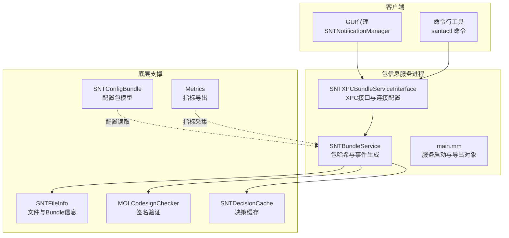
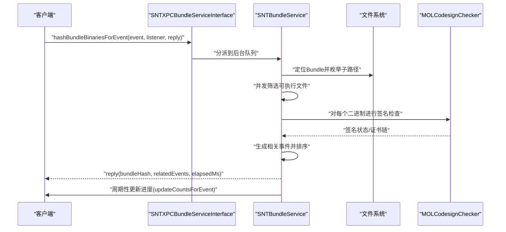
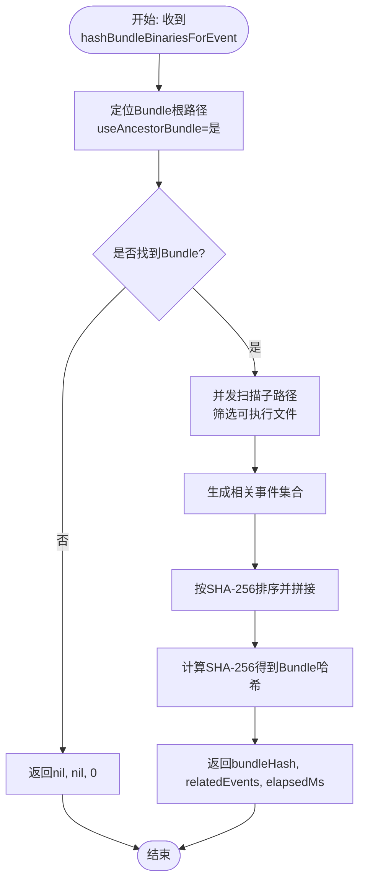
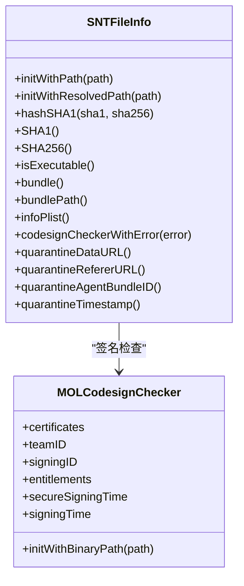
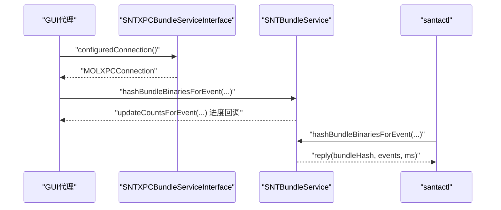
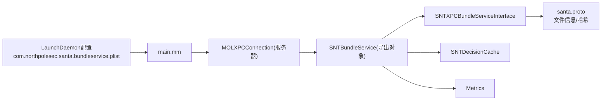

# 包信息服务

<cite>
**本文引用的文件**
- [SNTBundleService.h](file://Source/santabundleservice/SNTBundleService.h)
- [SNTBundleService.mm](file://Source/santabundleservice/SNTBundleService.mm)
- [main.mm](file://Source/santabundleservice/main.mm)
- [SNTXPCBundleServiceInterface.h](file://Source/common/SNTXPCBundleServiceInterface.h)
- [SNTXPCBundleServiceInterface.mm](file://Source/common/SNTXPCBundleServiceInterface.mm)
- [SNTNotificationManager.mm](file://Source/gui/SNTNotificationManager.mm)
- [SNTCommandFileInfo.mm](file://Source/santactl/Commands/SNTCommandFileInfo.mm)
- [SNTFileInfo.h](file://Source/common/SNTFileInfo.h)
- [SNTFileInfo.mm](file://Source/common/SNTFileInfo.mm)
- [MOLCodesignChecker.h](file://Source/common/MOLCodesignChecker.h)
- [MOLCodesignChecker.mm](file://Source/common/MOLCodesignChecker.mm)
- [com.northpolesec.santa.bundleservice.plist](file://Conf/com.northpolesec.santa.bundleservice.plist)
- [santa.proto](file://Source/common/santa.proto)
- [SNTConfigBundle.h](file://Source/common/SNTConfigBundle.h)
- [SNTConfigBundle.mm](file://Source/common/SNTConfigBundle.mm)
- [SNTDecisionCache.mm](file://Source/santad/SNTDecisionCache.mm)
- [Metrics.mm](file://Source/santad/Metrics.mm)
</cite>

## 目录
1. [简介](#简介)
2. [项目结构](#项目结构)
3. [核心组件](#核心组件)
4. [架构总览](#架构总览)
5. [详细组件分析](#详细组件分析)
6. [依赖关系分析](#依赖关系分析)
7. [性能考量](#性能考量)
8. [故障排查指南](#故障排查指南)
9. [结论](#结论)
10. [附录](#附录)

## 简介
本文件面向Santa包信息服务（santabundleservice）的技术文档，系统阐述其在应用包检测与管理中的核心职责：包信息提取、配置包处理与应用关联、以及与GUI代理的通信机制。文档覆盖服务启动流程、请求处理与响应机制、文件信息提取（元数据解析、签名验证、属性获取）、配置包处理（Plist解析、验证与应用）、缓存策略、性能优化与错误处理，并提供调试方法、监控指标与维护策略。

## 项目结构
包信息服务位于独立可执行程序中，通过XPC协议向外部客户端（GUI与命令行工具）提供能力；内部以SNTBundleService为核心，围绕SNTFileInfo与MOLCodesignChecker等模块完成文件与签名信息的提取与校验；配置包由SNTConfigBundle抽象并暴露访问器，供上层逻辑按需读取与应用。

图示来源
- [SNTBundleService.mm](file://Source/santabundleservice/SNTBundleService.mm#L47-L115)
- [SNTXPCBundleServiceInterface.mm](file://Source/common/SNTXPCBundleServiceInterface.mm#L22-L45)
- [main.mm](file://Source/santabundleservice/main.mm#L23-L35)
- [SNTNotificationManager.mm](file://Source/gui/SNTNotificationManager.mm#L254-L278)
- [SNTCommandFileInfo.mm](file://Source/santactl/Commands/SNTCommandFileInfo.mm#L763-L806)
- [SNTFileInfo.mm](file://Source/common/SNTFileInfo.mm#L1-L222)
- [MOLCodesignChecker.mm](file://Source/common/MOLCodesignChecker.mm#L141-L179)
- [SNTConfigBundle.mm](file://Source/common/SNTConfigBundle.mm#L103-L228)
- [SNTDecisionCache.mm](file://Source/santad/SNTDecisionCache.mm#L39-L83)
- [Metrics.mm](file://Source/santad/Metrics.mm#L301-L337)

章节来源
- [SNTBundleService.h](file://Source/santabundleservice/SNTBundleService.h#L1-L20)
- [SNTBundleService.mm](file://Source/santabundleservice/SNTBundleService.mm#L47-L115)
- [SNTXPCBundleServiceInterface.h](file://Source/common/SNTXPCBundleServiceInterface.h#L25-L76)
- [SNTXPCBundleServiceInterface.mm](file://Source/common/SNTXPCBundleServiceInterface.mm#L22-L45)
- [main.mm](file://Source/santabundleservice/main.mm#L23-L35)
- [com.northpolesec.santa.bundleservice.plist](file://Conf/com.northpolesec.santa.bundleservice.plist#L1-L33)

## 核心组件
- 包信息服务主入口与导出对象
  - 服务以XPC服务器方式启动，导出SNTBundleService实例，接受来自客户端的调用。
  - 关键路径参考：[main.mm](file://Source/santabundleservice/main.mm#L23-L35)
- XPC接口与连接配置
  - 提供SNTBundleServiceXPC协议的NSXPCInterface配置，确保自定义类参数正确注册；提供预配置的MOLXPCConnection用于客户端连接。
  - 关键路径参考：[SNTXPCBundleServiceInterface.h](file://Source/common/SNTXPCBundleServiceInterface.h#L25-L76)，[SNTXPCBundleServiceInterface.mm](file://Source/common/SNTXPCBundleServiceInterface.mm#L22-L45)
- 包处理服务实现
  - 实现hashBundleBinariesForEvent:listener:reply:，负责定位Bundle、并发扫描二进制、生成相关事件、计算Bundle哈希，并通过回调上报进度。
  - 关键路径参考：[SNTBundleService.mm](file://Source/santabundleservice/SNTBundleService.mm#L47-L115)
- 文件信息与签名
  - SNTFileInfo负责文件哈希、类型判断、Bundle信息、嵌入式Info.plist解析、Quarantine数据、Mach-O头解析等；MOLCodesignChecker负责签名验证与证书链提取。
  - 关键路径参考：[SNTFileInfo.h](file://Source/common/SNTFileInfo.h#L1-L248)，[SNTFileInfo.mm](file://Source/common/SNTFileInfo.mm#L1-L222)，[MOLCodesignChecker.h](file://Source/common/MOLCodesignChecker.h#L1-L210)，[MOLCodesignChecker.mm](file://Source/common/MOLCodesignChecker.mm#L141-L179)
- 配置包处理
  - SNTConfigBundle提供安全编码/解码支持与多字段访问器，便于上层按需读取配置项。
  - 关键路径参考：[SNTConfigBundle.h](file://Source/common/SNTConfigBundle.h#L1-L48)，[SNTConfigBundle.mm](file://Source/common/SNTConfigBundle.mm#L103-L228)
- 决策缓存与指标
  - SNTDecisionCache提供基于vnode的决策缓存；Metrics模块负责指标采集与导出。
  - 关键路径参考：[SNTDecisionCache.mm](file://Source/santad/SNTDecisionCache.mm#L39-L83)，[Metrics.mm](file://Source/santad/Metrics.mm#L301-L337)

章节来源
- [SNTBundleService.mm](file://Source/santabundleservice/SNTBundleService.mm#L47-L115)
- [SNTFileInfo.mm](file://Source/common/SNTFileInfo.mm#L1-L222)
- [MOLCodesignChecker.mm](file://Source/common/MOLCodesignChecker.mm#L141-L179)
- [SNTConfigBundle.mm](file://Source/common/SNTConfigBundle.mm#L103-L228)
- [SNTDecisionCache.mm](file://Source/santad/SNTDecisionCache.mm#L39-L83)
- [Metrics.mm](file://Source/santad/Metrics.mm#L301-L337)

## 架构总览
包信息服务采用“XPC服务器 + 多线程并发处理”的架构。客户端通过SNTXPCBundleServiceInterface建立连接，服务端在后台队列中执行耗时任务，同时通过NSProgress与匿名监听器回传进度，最终返回Bundle哈希与相关事件列表。

图示来源
- [SNTBundleService.mm](file://Source/santabundleservice/SNTBundleService.mm#L47-L115)
- [SNTXPCBundleServiceInterface.mm](file://Source/common/SNTXPCBundleServiceInterface.mm#L22-L45)
- [SNTNotificationManager.mm](file://Source/gui/SNTNotificationManager.mm#L254-L278)

章节来源
- [SNTBundleService.mm](file://Source/santabundleservice/SNTBundleService.mm#L47-L115)
- [SNTXPCBundleServiceInterface.mm](file://Source/common/SNTXPCBundleServiceInterface.mm#L22-L45)
- [SNTNotificationManager.mm](file://Source/gui/SNTNotificationManager.mm#L254-L278)

## 详细组件分析

### 组件A：包信息服务（SNTBundleService）
- 职责
  - 接收阻断事件，定位最高层级Bundle，扫描其中的可执行二进制，生成相关事件，计算Bundle级SHA-256哈希。
  - 通过NSProgress与匿名监听器向客户端推送进度，支持取消与超时控制。
- 关键流程
  - 初始化后台队列，接收事件后设置useAncestorBundle以向上查找Bundle根目录。
  - 并发遍历子路径，筛选可执行文件，生成SNTStoredExecutionEvent并汇总。
  - 对事件集合按SHA-256排序拼接后二次哈希，得到Bundle哈希。
- 性能要点
  - 使用dispatch_apply与共享数组避免锁竞争；原子计数与批量进度上报减少主线程压力。
  - 进度分段（目录扫描80%、事件生成15%、哈希5%），便于UI反馈。
- 错误与超时
  - 若无法定位Bundle或扫描被取消，返回空结果；总超时约10分钟，避免阻塞。
- 参考路径
  - [SNTBundleService.mm](file://Source/santabundleservice/SNTBundleService.mm#L47-L115)
  - [SNTBundleService.mm](file://Source/santabundleservice/SNTBundleService.mm#L117-L284)

图示来源
- [SNTBundleService.mm](file://Source/santabundleservice/SNTBundleService.mm#L47-L115)
- [SNTBundleService.mm](file://Source/santabundleservice/SNTBundleService.mm#L117-L284)

章节来源
- [SNTBundleService.mm](file://Source/santabundleservice/SNTBundleService.mm#L47-L115)
- [SNTBundleService.mm](file://Source/santabundleservice/SNTBundleService.mm#L117-L284)

### 组件B：文件信息提取（SNTFileInfo）
- 能力
  - 文件哈希（SHA-1/SHA-256）：分块顺序读取，预读建议与RA读头关闭，降低I/O开销。
  - 类型判断：Mach-O头解析、Fat二进制多架构支持、脚本/XAR/DMG识别。
  - Bundle信息：Info.plist解析（优先嵌入式，其次CFBundleCopyInfoDictionaryInDirectory），Bundle元数据读取。
  - Quarantine数据：从LaunchServices数据库中查询下载来源、Referer、时间戳等。
  - 签名状态：通过MOLCodesignChecker缓存与复用，避免重复开销。
- 性能与健壮性
  - safeSubdataWithRange内联异常捕获，越界或读取不完整直接返回nil。
  - 缓存bundleRef、infoDict、quarantineDict与machHeaders，减少重复解析。
- 参考路径
  - [SNTFileInfo.h](file://Source/common/SNTFileInfo.h#L1-L248)
  - [SNTFileInfo.mm](file://Source/common/SNTFileInfo.mm#L1-L222)
  - [SNTFileInfo.mm](file://Source/common/SNTFileInfo.mm#L335-L461)
  - [SNTFileInfo.mm](file://Source/common/SNTFileInfo.mm#L462-L748)

图示来源
- [SNTFileInfo.h](file://Source/common/SNTFileInfo.h#L1-L248)
- [MOLCodesignChecker.h](file://Source/common/MOLCodesignChecker.h#L1-L210)

章节来源
- [SNTFileInfo.h](file://Source/common/SNTFileInfo.h#L1-L248)
- [SNTFileInfo.mm](file://Source/common/SNTFileInfo.mm#L1-L222)
- [MOLCodesignChecker.mm](file://Source/common/MOLCodesignChecker.mm#L141-L179)

### 组件C：配置包处理（SNTConfigBundle）
- 能力
  - 安全编码/解码支持，提供多字段访问器（如启用Bundle、启用传递规则、网络挂载策略、事件上传开关等）。
  - 通过block回调方式读取配置值，便于上层按需应用。
- 应用场景
  - 在包信息服务运行前或运行期间，读取配置决定是否启用Bundle模式、是否生成传递规则等。
- 参考路径
  - [SNTConfigBundle.h](file://Source/common/SNTConfigBundle.h#L1-L48)
  - [SNTConfigBundle.mm](file://Source/common/SNTConfigBundle.mm#L103-L228)

章节来源
- [SNTConfigBundle.h](file://Source/common/SNTConfigBundle.h#L1-L48)
- [SNTConfigBundle.mm](file://Source/common/SNTConfigBundle.mm#L103-L228)

### 组件D：与GUI代理的通信（XPC接口与进度回调）
- 通信机制
  - 客户端通过SNTXPCBundleServiceInterface的configuredConnection建立到santabundleservice的XPC连接。
  - 服务端在hashBundleBinariesForEvent:listener:reply:中通过NSXPCListenerEndpoint回连客户端，使用SNTBundleServiceProgressXPC协议推送进度。
- 超时与容错
  - GUI侧等待连接建立最多5秒，超时则放弃等待并回退显示阻断事件。
- 参考路径
  - [SNTXPCBundleServiceInterface.mm](file://Source/common/SNTXPCBundleServiceInterface.mm#L22-L45)
  - [SNTNotificationManager.mm](file://Source/gui/SNTNotificationManager.mm#L254-L278)
  - [SNTCommandFileInfo.mm](file://Source/santactl/Commands/SNTCommandFileInfo.mm#L763-L806)

图示来源
- [SNTNotificationManager.mm](file://Source/gui/SNTNotificationManager.mm#L254-L278)
- [SNTCommandFileInfo.mm](file://Source/santactl/Commands/SNTCommandFileInfo.mm#L763-L806)
- [SNTXPCBundleServiceInterface.mm](file://Source/common/SNTXPCBundleServiceInterface.mm#L22-L45)

章节来源
- [SNTNotificationManager.mm](file://Source/gui/SNTNotificationManager.mm#L254-L278)
- [SNTCommandFileInfo.mm](file://Source/santactl/Commands/SNTCommandFileInfo.mm#L763-L806)
- [SNTXPCBundleServiceInterface.mm](file://Source/common/SNTXPCBundleServiceInterface.mm#L22-L45)

## 依赖关系分析
- 服务启动与导出
  - main.mm初始化MOLXPCConnection为服务器端，设置特权/非特权接口一致，导出SNTBundleService实例。
  - 服务注册于LaunchDaemon配置，Mach服务名为com.northpolesec.santa.bundleservice。
- 协议与接口
  - SNTBundleServiceXPC定义对外方法；SNTBundleServiceProgressXPC定义进度回调。
  - SNTXPCBundleServiceInterface统一配置NSXPCInterface与连接。
- 数据模型与序列化
  - santa.proto定义了文件信息与哈希等消息格式，用于日志与事件序列化。
- 决策与指标
  - SNTDecisionCache提供文件级决策缓存；Metrics模块负责指标采集与导出。

图示来源
- [com.northpolesec.santa.bundleservice.plist](file://Conf/com.northpolesec.santa.bundleservice.plist#L1-L33)
- [main.mm](file://Source/santabundleservice/main.mm#L23-L35)
- [SNTXPCBundleServiceInterface.mm](file://Source/common/SNTXPCBundleServiceInterface.mm#L22-L45)
- [santa.proto](file://Source/common/santa.proto#L89-L152)
- [SNTDecisionCache.mm](file://Source/santad/SNTDecisionCache.mm#L39-L83)
- [Metrics.mm](file://Source/santad/Metrics.mm#L301-L337)

章节来源
- [com.northpolesec.santa.bundleservice.plist](file://Conf/com.northpolesec.santa.bundleservice.plist#L1-L33)
- [main.mm](file://Source/santabundleservice/main.mm#L23-L35)
- [santa.proto](file://Source/common/santa.proto#L89-L152)
- [SNTDecisionCache.mm](file://Source/santad/SNTDecisionCache.mm#L39-L83)
- [Metrics.mm](file://Source/santad/Metrics.mm#L301-L337)

## 性能考量
- 并发与内存
  - 使用dispatch_apply对每个文件调度一次任务，避免锁竞争；共享指针数组存储结果，空间换时间。
  - 对大体积Bundle（如Xcode.app）控制数组规模，权衡内存占用与速度。
- I/O优化
  - 分块顺序读取，设置预读建议与RA读头关闭，减少随机I/O。
  - safeSubdataWithRange内联异常捕获，避免崩溃与重复开销。
- 进度与用户体验
  - 将总工作拆分为三段进度，UI可感知阶段性进展；主线程仅做少量进度同步与回调。
- 缓存策略
  - SNTFileInfo缓存bundleRef、infoDict、quarantineDict、machHeaders与codesignChecker，显著降低重复解析成本。
  - SNTDecisionCache以vnode为键缓存决策，限制容量并使用串行队列平衡吞吐与一致性。
- 指标与可观测性
  - Metrics模块定期导出事件计数与时间分布，结合SNTMetricSet进行指标注册与回调。

章节来源
- [SNTBundleService.mm](file://Source/santabundleservice/SNTBundleService.mm#L117-L284)
- [SNTFileInfo.mm](file://Source/common/SNTFileInfo.mm#L1-L222)
- [SNTDecisionCache.mm](file://Source/santad/SNTDecisionCache.mm#L39-L83)
- [Metrics.mm](file://Source/santad/Metrics.mm#L301-L337)

## 故障排查指南
- 连接超时
  - GUI侧等待santabundleservice连接最多5秒，超时会回退显示阻断事件。检查服务是否正常加载与Mach服务是否可用。
  - 参考路径：[SNTNotificationManager.mm](file://Source/gui/SNTNotificationManager.mm#L254-L278)
- 无Bundle路径
  - 当无法定位Bundle根路径时，服务返回空结果。确认事件中的fileBundlePath是否有效且存在。
  - 参考路径：[SNTBundleService.mm](file://Source/santabundleservice/SNTBundleService.mm#L77-L105)
- 扫描被取消
  - NSProgress被取消或超时（约10分钟），服务会终止并返回空结果。检查系统负载与磁盘I/O。
  - 参考路径：[SNTBundleService.mm](file://Source/santabundleservice/SNTBundleService.mm#L108-L115)
- 签名验证失败
  - MOLCodesignChecker初始化或验证失败会返回错误。检查二进制签名状态、证书链与平台二进制标识。
  - 参考路径：[MOLCodesignChecker.mm](file://Source/common/MOLCodesignChecker.mm#L141-L179)
- Quarantine数据缺失
  - 若文件所有者或磁盘映像导致无法查询数据库，将返回nil。检查用户权限与LaunchServices数据库。
  - 参考路径：[SNTFileInfo.mm](file://Source/common/SNTFileInfo.mm#L683-L748)
- 配置未生效
  - 确认SNTConfigBundle字段已正确设置并通过访问器读取；检查配置同步与应用时机。
  - 参考路径：[SNTConfigBundle.mm](file://Source/common/SNTConfigBundle.mm#L103-L228)

章节来源
- [SNTNotificationManager.mm](file://Source/gui/SNTNotificationManager.mm#L254-L278)
- [SNTBundleService.mm](file://Source/santabundleservice/SNTBundleService.mm#L77-L115)
- [MOLCodesignChecker.mm](file://Source/common/MOLCodesignChecker.mm#L141-L179)
- [SNTFileInfo.mm](file://Source/common/SNTFileInfo.mm#L683-L748)
- [SNTConfigBundle.mm](file://Source/common/SNTConfigBundle.mm#L103-L228)

## 结论
包信息服务通过XPC提供稳定、可扩展的包哈希与事件生成能力，结合SNTFileInfo与MOLCodesignChecker实现对文件与签名的全面解析与验证；通过SNTConfigBundle与SNTDecisionCache等模块，形成从配置到决策的闭环。其并发扫描、进度回调与缓存策略共同保障了在大型Bundle场景下的性能与用户体验；配合Metrics与日志体系，满足生产环境的可观测性需求。

## 附录
- 服务启动与配置
  - LaunchDaemon配置与Mach服务注册见：[com.northpolesec.santa.bundleservice.plist](file://Conf/com.northpolesec.santa.bundleservice.plist#L1-L33)
  - 服务入口与导出对象见：[main.mm](file://Source/santabundleservice/main.mm#L23-L35)
- 数据模型参考
  - 文件信息与哈希消息定义见：[santa.proto](file://Source/common/santa.proto#L89-L152)
- 命令行与GUI交互
  - GUI代理连接与进度回调见：[SNTNotificationManager.mm](file://Source/gui/SNTNotificationManager.mm#L254-L278)
  - 命令行工具读取Bundle信息见：[SNTCommandFileInfo.mm](file://Source/santactl/Commands/SNTCommandFileInfo.mm#L763-L806)