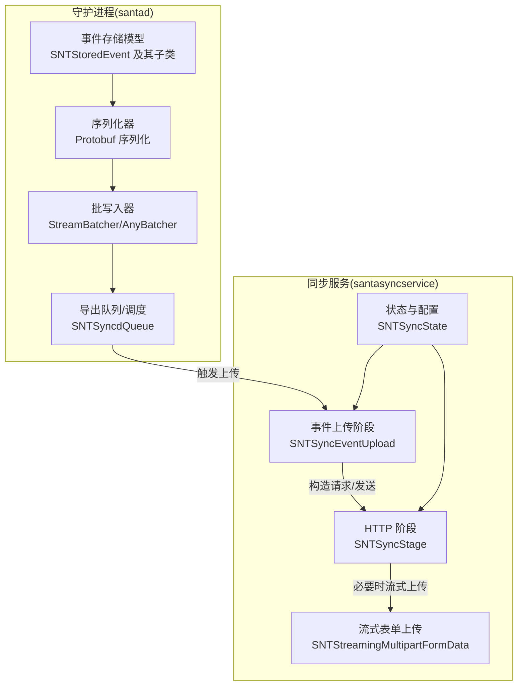
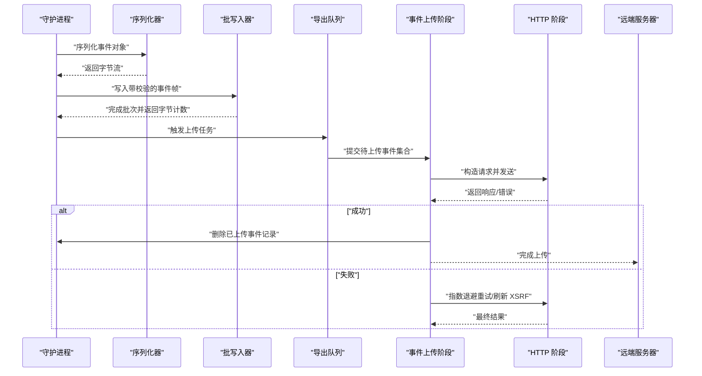
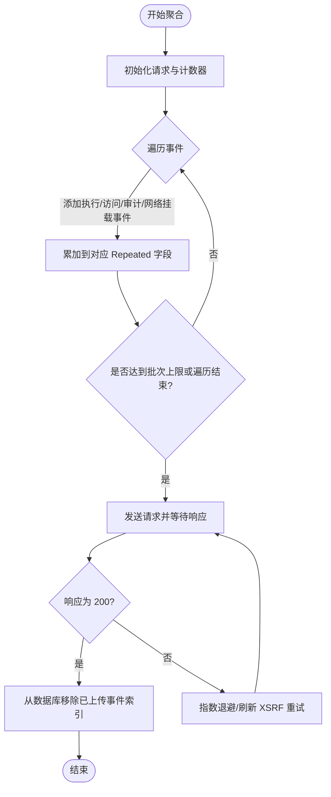
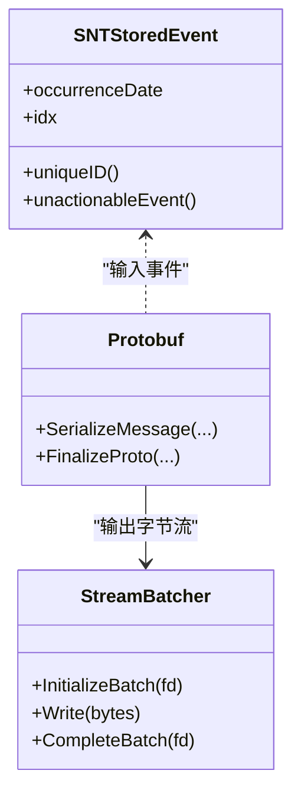
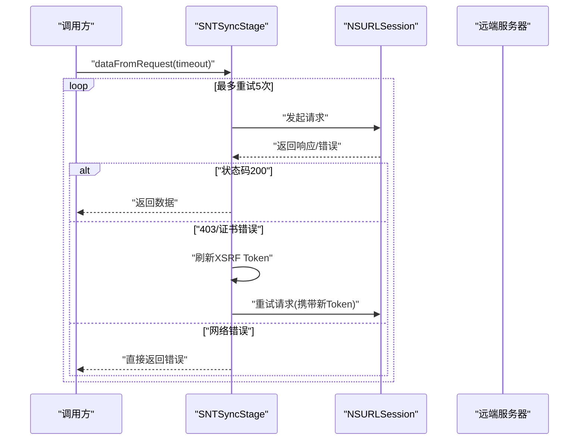
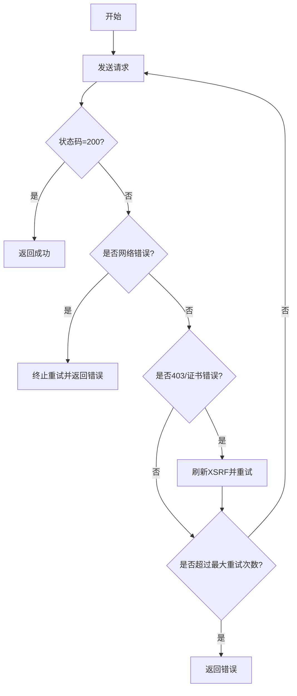
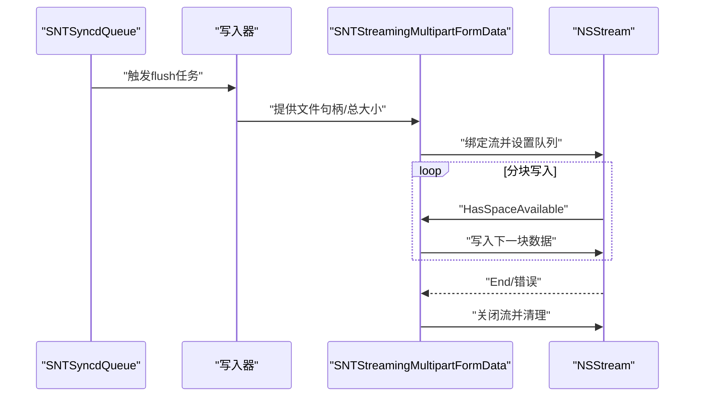
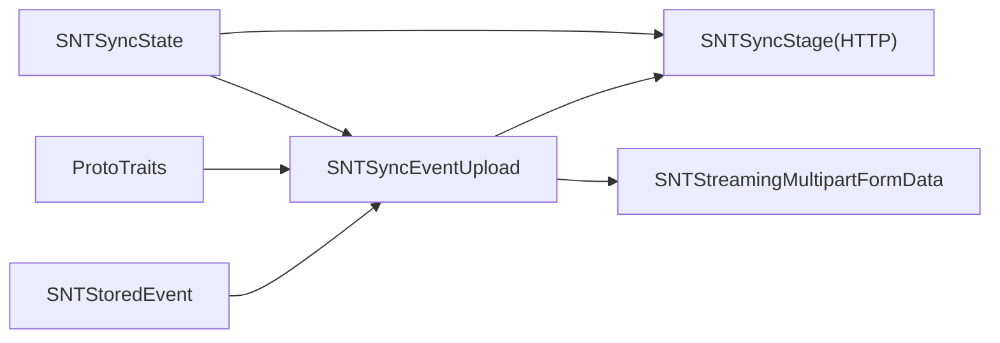

# 事件上传机制

<cite>
**本文引用的文件**
- [SNTSyncEventUpload.mm](file://Source/santasyncservice/SNTSyncEventUpload.mm)
- [ProtoTraits.h](file://Source/santasyncservice/ProtoTraits.h)
- [SNTSyncStage.mm](file://Source/santasyncservice/SNTSyncStage.mm)
- [SNTStreamingMultipartFormData.mm](file://Source/santasyncservice/SNTStreamingMultipartFormData.mm)
- [SNTSyncState.h](file://Source/santasyncservice/SNTSyncState.h)
- [SNTStoredEvent.h](file://Source/common/SNTStoredEvent.h)
- [Protobuf.mm](file://Source/santad/Logs/EndpointSecurity/Serializers/Protobuf.mm)
- [StreamBatcher.h](file://Source/santad/Logs/EndpointSecurity/Writers/FSSpool/StreamBatcher.h)
- [AnyBatcher.h](file://Source/santad/Logs/EndpointSecurity/Writers/FSSpool/AnyBatcher.h)
- [fsspool.h](file://Source/santad/Logs/EndpointSecurity/Writers/FSSpool/fsspool.h)
- [SNTSyncdQueue.mm](file://Source/santad/SNTSyncdQueue.mm)
- [SNTSyncLogging.h](file://Source/santasyncservice/SNTSyncLogging.h)
- [SNTError.mm](file://Source/common/SNTError.mm)
- [SNTConfigurator.h](file://Source/common/SNTConfigurator.h)
- [SNTSyncEventUploadTest.mm](file://Source/santasyncservice/testdata/sync_eventupload_input_basic.plist)
</cite>

## 目录
1. [引言](#引言)
2. [项目结构](#项目结构)
3. [核心组件](#核心组件)
4. [架构总览](#架构总览)
5. [详细组件分析](#详细组件分析)
6. [依赖关系分析](#依赖关系分析)
7. [性能考虑](#性能考虑)
8. [故障排查指南](#故障排查指南)
9. [结论](#结论)
10. [附录](#附录)

## 引言
本文件系统性阐述 Santa 项目中的“事件上传机制”，覆盖事件收集与聚合、缓冲与压缩、批处理策略、格式化与序列化、上传协议与认证、重试与错误处理、并发与资源管理、以及监控与调试方法。目标读者既包括需要快速上手的工程师，也包括希望深入理解实现细节的高级用户。

## 项目结构
事件上传涉及两大子系统：
- 同步服务（santasyncservice）：负责构建上传请求、执行 HTTP 传输、解析响应、处理重试与认证、协调批量发送。
- 守护进程日志导出（santad）：负责事件采集、序列化、落盘批处理、分片与压缩、以及通过同步服务进行流式上传。

图表来源
- [SNTStoredEvent.h](file://Source/common/SNTStoredEvent.h#L1-L36)
- [Protobuf.mm](file://Source/santad/Logs/EndpointSecurity/Serializers/Protobuf.mm#L440-L467)
- [StreamBatcher.h](file://Source/santad/Logs/EndpointSecurity/Writers/FSSpool/StreamBatcher.h#L31-L90)
- [AnyBatcher.h](file://Source/santad/Logs/EndpointSecurity/Writers/FSSpool/AnyBatcher.h#L24-L46)
- [SNTSyncdQueue.mm](file://Source/santad/SNTSyncdQueue.mm#L208-L247)
- [SNTSyncEventUpload.mm](file://Source/santasyncservice/SNTSyncEventUpload.mm#L460-L485)
- [SNTSyncStage.mm](file://Source/santasyncservice/SNTSyncStage.mm#L150-L220)
- [SNTStreamingMultipartFormData.mm](file://Source/santasyncservice/SNTStreamingMultipartFormData.mm#L1-L120)
- [SNTSyncState.h](file://Source/santasyncservice/SNTSyncState.h#L1-L116)

章节来源
- [SNTStoredEvent.h](file://Source/common/SNTStoredEvent.h#L1-L36)
- [SNTSyncEventUpload.mm](file://Source/santasyncservice/SNTSyncEventUpload.mm#L460-L485)
- [SNTSyncStage.mm](file://Source/santasyncservice/SNTSyncStage.mm#L150-L220)
- [SNTStreamingMultipartFormData.mm](file://Source/santasyncservice/SNTStreamingMultipartFormData.mm#L1-L120)
- [SNTSyncState.h](file://Source/santasyncservice/SNTSyncState.h#L1-L116)

## 核心组件
- 事件存储与标识
  - SNTStoredEvent 及其子类承载事件元数据与索引，用于去重、回滚与数据库清理。
- 序列化与格式化
  - Protobuf 序列化器将事件对象编码为二进制或 JSON 行，支持时间戳、决策、签名链等字段。
- 批处理与压缩
  - StreamBatcher/AnyBatcher 将序列化后的事件以带校验的帧形式写入文件，支持 gzip/zstd/uncompressed 等压缩策略。
- 上传阶段与协议
  - SNTSyncEventUpload 构建 v1/v2 协议请求，按批次发送；SNTSyncStage 负责 HTTP 请求、超时、重试、XSRF 认证与响应解析。
- 流式上传
  - SNTStreamingMultipartFormData 提供基于 NSStream 的流式 multipart/form-data 上传，支持分块与断点续传语义。
- 状态与配置
  - SNTSyncState 持有机器 ID、批次大小、编码方式、推送配置等，贯穿上传流程。

章节来源
- [SNTStoredEvent.h](file://Source/common/SNTStoredEvent.h#L1-L36)
- [Protobuf.mm](file://Source/santad/Logs/EndpointSecurity/Serializers/Protobuf.mm#L440-L467)
- [StreamBatcher.h](file://Source/santad/Logs/EndpointSecurity/Writers/FSSpool/StreamBatcher.h#L31-L90)
- [AnyBatcher.h](file://Source/santad/Logs/EndpointSecurity/Writers/FSSpool/AnyBatcher.h#L24-L46)
- [SNTSyncEventUpload.mm](file://Source/santasyncservice/SNTSyncEventUpload.mm#L91-L177)
- [SNTSyncStage.mm](file://Source/santasyncservice/SNTSyncStage.mm#L150-L220)
- [SNTStreamingMultipartFormData.mm](file://Source/santasyncservice/SNTStreamingMultipartFormData.mm#L1-L120)
- [SNTSyncState.h](file://Source/santasyncservice/SNTSyncState.h#L63-L116)

## 架构总览
事件从守护进程采集到服务器端的端到端流程如下：

图表来源
- [Protobuf.mm](file://Source/santad/Logs/EndpointSecurity/Serializers/Protobuf.mm#L440-L467)
- [StreamBatcher.h](file://Source/santad/Logs/EndpointSecurity/Writers/FSSpool/StreamBatcher.h#L52-L81)
- [SNTSyncdQueue.mm](file://Source/santad/SNTSyncdQueue.mm#L208-L247)
- [SNTSyncEventUpload.mm](file://Source/santasyncservice/SNTSyncEventUpload.mm#L91-L177)
- [SNTSyncStage.mm](file://Source/santasyncservice/SNTSyncStage.mm#L150-L220)

## 详细组件分析

### 事件收集与聚合（缓冲、压缩、批处理）
- 收集与序列化
  - 事件对象经 Protobuf 序列化为二进制或 JSON 行，包含时间戳、决策、签名链、进程链等关键字段。
- 批处理与落盘
  - StreamBatcher/AnyBatcher 将事件帧写入文件，每帧包含魔数、xxhash64 校验、长度与正文，支持 gzip/zstd/uncompressed。
  - fsspool 提供目录级估算与当前批次状态管理，避免频繁 IO 开销。
- 聚合策略
  - SNTSyncEventUpload 按事件类型分类聚合，达到批次阈值或遍历结束即发送；v2 支持新增审计与网络挂载事件类型。
- 压缩与完整性
  - 写入前计算 xxhash64 并写入帧头，读取端可据此验证完整性；压缩由底层流完成，减少磁盘占用与网络带宽。

图表来源
- [SNTSyncEventUpload.mm](file://Source/santasyncservice/SNTSyncEventUpload.mm#L91-L177)
- [StreamBatcher.h](file://Source/santad/Logs/EndpointSecurity/Writers/FSSpool/StreamBatcher.h#L52-L81)
- [fsspool.h](file://Source/santad/Logs/EndpointSecurity/Writers/FSSpool/fsspool.h#L257-L294)

章节来源
- [Protobuf.mm](file://Source/santad/Logs/EndpointSecurity/Serializers/Protobuf.mm#L440-L467)
- [StreamBatcher.h](file://Source/santad/Logs/EndpointSecurity/Writers/FSSpool/StreamBatcher.h#L31-L90)
- [AnyBatcher.h](file://Source/santad/Logs/EndpointSecurity/Writers/FSSpool/AnyBatcher.h#L24-L46)
- [fsspool.h](file://Source/santad/Logs/EndpointSecurity/Writers/FSSpool/fsspool.h#L257-L294)
- [SNTSyncEventUpload.mm](file://Source/santasyncservice/SNTSyncEventUpload.mm#L91-L177)

### 事件格式化与序列化（数据转换与完整性校验）
- 数据转换
  - 将事件对象映射到 v1/v2 协议消息体，填充时间戳、决策枚举、签名链、进程链、文件属性等字段。
  - JSON 输出在末尾追加换行符，便于逐行解析。
- 完整性校验
  - 每帧写入 xxhash64 校验值，保证读取端可验证数据未被破坏。
- 复杂度与性能
  - 序列化采用 Arena 分配，减少内存分配次数；字段按需 Reserve，降低扩容成本。

图表来源
- [SNTStoredEvent.h](file://Source/common/SNTStoredEvent.h#L1-L36)
- [Protobuf.mm](file://Source/santad/Logs/EndpointSecurity/Serializers/Protobuf.mm#L440-L467)
- [StreamBatcher.h](file://Source/santad/Logs/EndpointSecurity/Writers/FSSpool/StreamBatcher.h#L31-L90)

章节来源
- [Protobuf.mm](file://Source/santad/Logs/EndpointSecurity/Serializers/Protobuf.mm#L440-L467)
- [StreamBatcher.h](file://Source/santad/Logs/EndpointSecurity/Writers/FSSpool/StreamBatcher.h#L52-L81)

### 上传协议与认证（HTTP 请求构建、认证机制与响应处理）
- 请求构建
  - SNTSyncEventUpload 根据 SNTSyncState 构造 URL 与请求体，设置机器 ID、批次大小等参数。
- 认证与安全
  - SNTSyncStage 在 403 或证书相关错误时尝试刷新 XSRF Token，并将其注入请求头。
- 响应处理
  - 支持二进制 proto 与 JSON 两种响应格式；对 XSSI 前缀进行剥离后解析；非 200 统一转为错误码。
- 超时与并发
  - 使用 NSURLSession 异步任务，支持超时取消；重试采用指数退避，避免雪崩。

图表来源
- [SNTSyncStage.mm](file://Source/santasyncservice/SNTSyncStage.mm#L150-L220)

章节来源
- [SNTSyncEventUpload.mm](file://Source/santasyncservice/SNTSyncEventUpload.mm#L460-L485)
- [SNTSyncStage.mm](file://Source/santasyncservice/SNTSyncStage.mm#L150-L220)

### 重试策略与错误处理（网络异常与服务器错误）
- 指数退避
  - 从第 2 次尝试起按 2^attempt 秒退避，最多 5 次。
- 特殊错误分支
  - 无网络错误直接终止重试；403/证书相关错误尝试刷新 XSRF 并重试一次。
- 错误码与日志
  - 将解析失败、HTTP 错误统一映射为 SNTErrorCode，便于上层诊断。

图表来源
- [SNTSyncStage.mm](file://Source/santasyncservice/SNTSyncStage.mm#L150-L220)
- [SNTError.mm](file://Source/common/SNTError.mm#L1-L200)

章节来源
- [SNTSyncStage.mm](file://Source/santasyncservice/SNTSyncStage.mm#L150-L220)
- [SNTError.mm](file://Source/common/SNTError.mm#L1-L200)

### 并发控制与资源管理（队列、定时器与流式上传）
- 导出队列
  - SNTSyncdQueue 使用串行队列与定时器驱动 flush 任务，避免过多并发打开文件。
- 流式上传
  - SNTStreamingMultipartFormData 使用 NSStream 与固定缓冲区，按块读取文件句柄，支持断点续传语义与错误恢复。
- 事件背压
  - 对同一主哈希（文件 SHA256 或包哈希）设置 10 分钟冷却，防止重复事件风暴。

图表来源
- [SNTSyncdQueue.mm](file://Source/santad/SNTSyncdQueue.mm#L208-L247)
- [SNTStreamingMultipartFormData.mm](file://Source/santasyncservice/SNTStreamingMultipartFormData.mm#L120-L291)

章节来源
- [SNTSyncdQueue.mm](file://Source/santad/SNTSyncdQueue.mm#L208-L247)
- [SNTStreamingMultipartFormData.mm](file://Source/santasyncservice/SNTStreamingMultipartFormData.mm#L120-L291)

### 监控与调试（日志、状态与测试）
- 日志与状态
  - SNTSyncLogging 提供上传阶段的日志接口；SNTSyncState 暴露批次大小、编码方式、推送配置等运行态参数。
- 错误映射
  - SNTError 统一错误码，便于在 UI 或日志中定位问题。
- 测试与样例
  - 提供事件上传输入样例与单元测试，覆盖序列化、批处理与流式上传场景。

章节来源
- [SNTSyncLogging.h](file://Source/santasyncservice/SNTSyncLogging.h#L1-L200)
- [SNTSyncState.h](file://Source/santasyncservice/SNTSyncState.h#L63-L116)
- [SNTError.mm](file://Source/common/SNTError.mm#L1-L200)
- [SNTSyncEventUploadTest.mm](file://Source/santasyncservice/testdata/sync_eventupload_input_basic.plist#L1-L200)

## 依赖关系分析
- 事件模型依赖
  - SNTStoredEvent 是所有事件的基础，SNTSyncEventUpload 通过其 idx 进行数据库清理。
- 协议与版本
  - ProtoTraits.h 定义 v1/v2 协议类型别名，SNTSyncEventUpload 通过模板参数选择不同版本的消息体。
- 上传通道
  - SNTSyncEventUpload 依赖 SNTSyncStage 的 HTTP 能力；当启用流式上传时，SNTStreamingMultipartFormData 作为补充通道。

图表来源
- [SNTStoredEvent.h](file://Source/common/SNTStoredEvent.h#L1-L36)
- [ProtoTraits.h](file://Source/santasyncservice/ProtoTraits.h#L24-L120)
- [SNTSyncEventUpload.mm](file://Source/santasyncservice/SNTSyncEventUpload.mm#L91-L177)
- [SNTSyncStage.mm](file://Source/santasyncservice/SNTSyncStage.mm#L150-L220)
- [SNTStreamingMultipartFormData.mm](file://Source/santasyncservice/SNTStreamingMultipartFormData.mm#L1-L120)
- [SNTSyncState.h](file://Source/santasyncservice/SNTSyncState.h#L63-L116)

章节来源
- [ProtoTraits.h](file://Source/santasyncservice/ProtoTraits.h#L24-L120)
- [SNTSyncEventUpload.mm](file://Source/santasyncservice/SNTSyncEventUpload.mm#L91-L177)
- [SNTSyncStage.mm](file://Source/santasyncservice/SNTSyncStage.mm#L150-L220)
- [SNTStreamingMultipartFormData.mm](file://Source/santasyncservice/SNTStreamingMultipartFormData.mm#L1-L120)
- [SNTSyncState.h](file://Source/santasyncservice/SNTSyncState.h#L63-L116)

## 性能考虑
- 批量大小与延迟权衡
  - SNTSyncState.eventBatchSize 控制单次上传事件数量，增大批次可提升吞吐但增加延迟。
- 压缩策略
  - StreamBatcher 支持 gzip/zstd/uncompressed，建议在带宽受限场景使用 zstd；磁盘空间紧张时优先压缩。
- I/O 与并发
  - fsspool 估算目录大小与当前批次状态，避免频繁 stat；SNTSyncdQueue 使用串行队列与定时器，降低上下文切换开销。
- 流式上传
  - SNTStreamingMultipartFormData 使用固定缓冲区与块读取，适合大文件上传；注意磁盘与网络抖动下的重试与断点续传。

## 故障排查指南
- 常见错误与定位
  - HTTP 非 200：检查 SNTSyncStage 日志与状态码；若为 403/证书错误，确认 XSRF 刷新是否生效。
  - 解析失败：Protobuf JSON/二进制解析失败时，查看 SNTError 映射与日志级别。
  - 网络错误：NSURLErrorNotConnectedToInternet 直接终止重试，等待网络恢复。
- 调试建议
  - 启用 SNTSyncLogging 与 SNTSyncStage 的详细日志；在本地复现时使用测试样例与单元测试。
  - 观察 SNTSyncState 中的批次大小、编码方式与推送配置，确保与服务器一致。

章节来源
- [SNTSyncStage.mm](file://Source/santasyncservice/SNTSyncStage.mm#L150-L220)
- [SNTError.mm](file://Source/common/SNTError.mm#L1-L200)
- [SNTSyncLogging.h](file://Source/santasyncservice/SNTSyncLogging.h#L1-L200)

## 结论
Santa 的事件上传机制通过“序列化—批处理—压缩—HTTP 上传”的流水线，结合指数退避、XSRF 自动刷新与流式上传能力，在保证数据完整性的同时兼顾性能与可靠性。通过合理配置批次大小、压缩策略与并发参数，可在不同网络与磁盘环境下取得稳定表现。

## 附录
- 关键配置项
  - 机器 ID、批次大小、内容编码、推送配置等均在 SNTSyncState 中集中管理。
- 相关实现参考路径
  - 事件序列化与帧格式：[Protobuf.mm](file://Source/santad/Logs/EndpointSecurity/Serializers/Protobuf.mm#L440-L467)、[StreamBatcher.h](file://Source/santad/Logs/EndpointSecurity/Writers/FSSpool/StreamBatcher.h#L52-L81)
  - 上传阶段与重试：[SNTSyncEventUpload.mm](file://Source/santasyncservice/SNTSyncEventUpload.mm#L91-L177)、[SNTSyncStage.mm](file://Source/santasyncservice/SNTSyncStage.mm#L150-L220)
  - 流式上传：[SNTStreamingMultipartFormData.mm](file://Source/santasyncservice/SNTStreamingMultipartFormData.mm#L120-L291)
  - 导出队列与背压：[SNTSyncdQueue.mm](file://Source/santad/SNTSyncdQueue.mm#L208-L247)