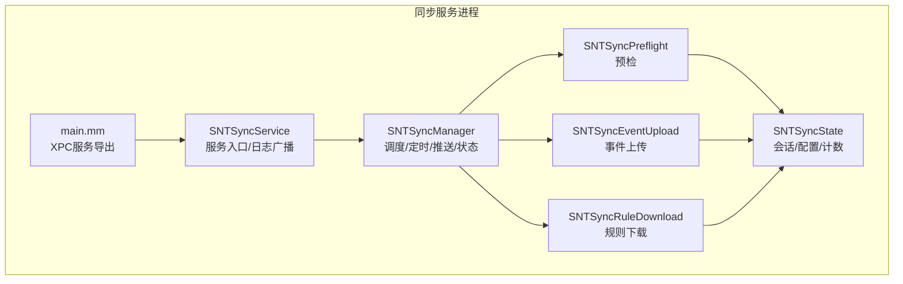
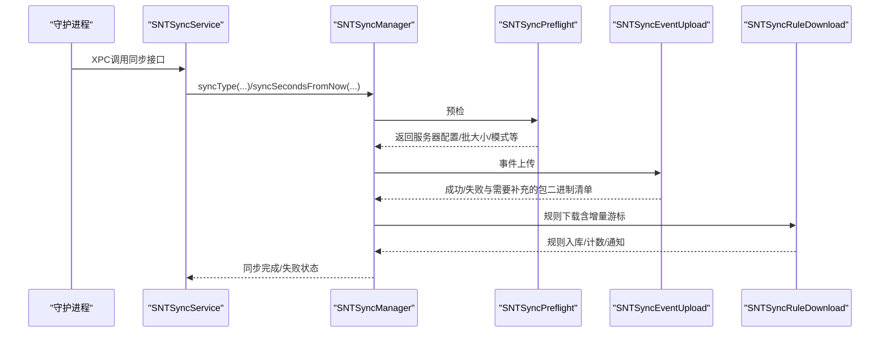
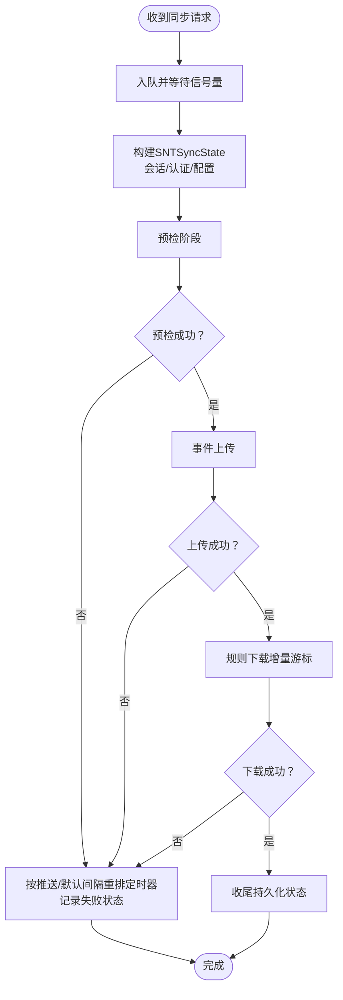
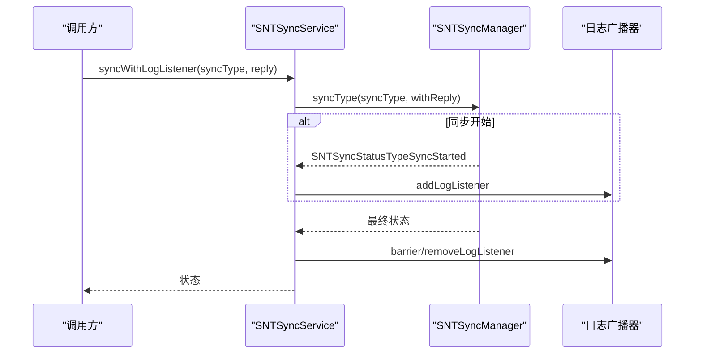
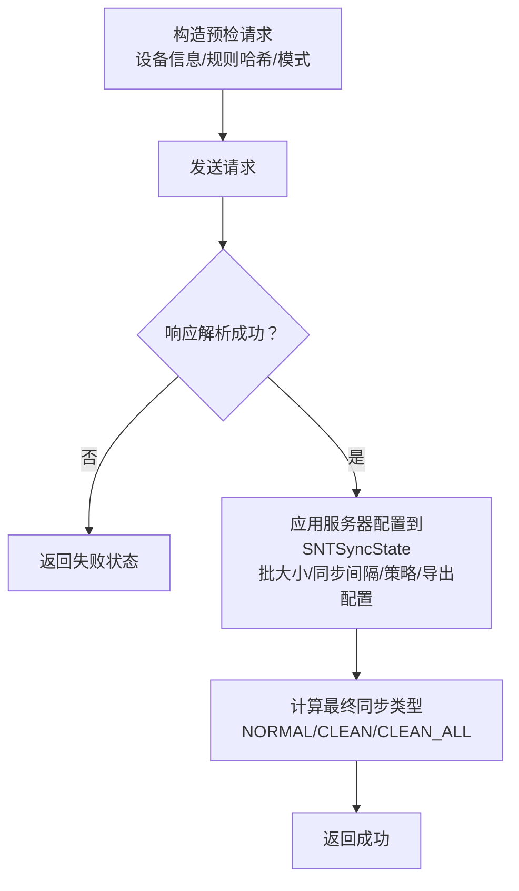
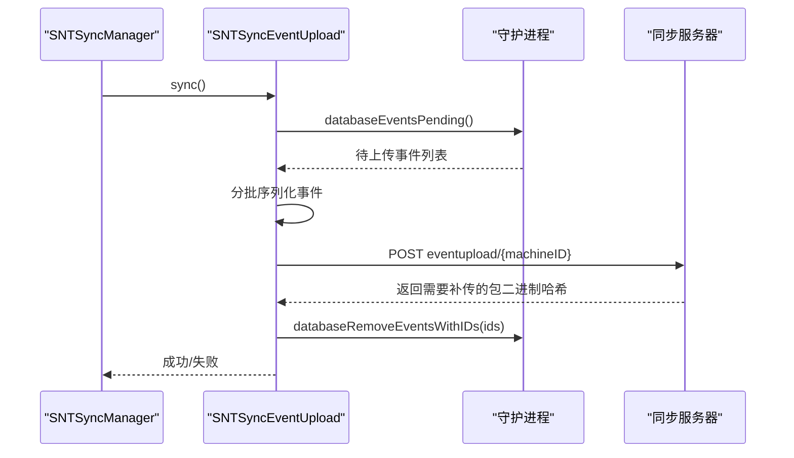
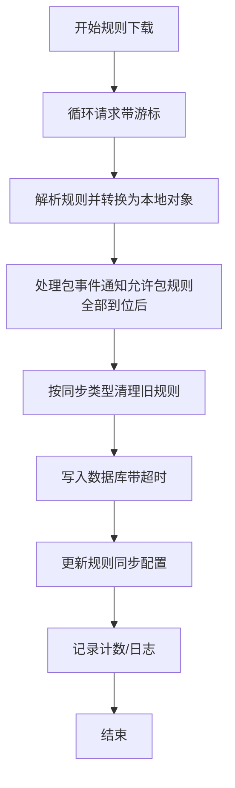
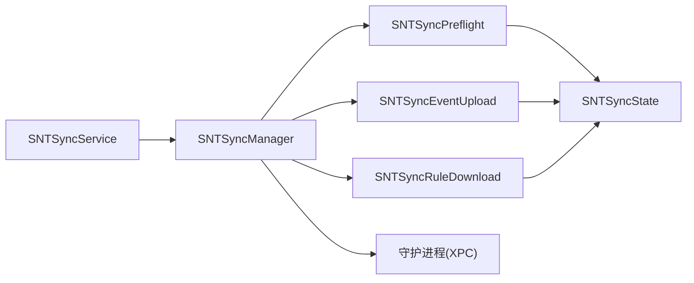

# 同步服务

<cite>
**本文引用的文件**
- [SNTSyncManager.h](file://Source/santasyncservice/SNTSyncManager.h)
- [SNTSyncManager.mm](file://Source/santasyncservice/SNTSyncManager.mm)
- [SNTSyncService.h](file://Source/santasyncservice/SNTSyncService.h)
- [SNTSyncService.mm](file://Source/santasyncservice/SNTSyncService.mm)
- [SNTSyncPreflight.h](file://Source/santasyncservice/SNTSyncPreflight.h)
- [SNTSyncPreflight.mm](file://Source/santasyncservice/SNTSyncPreflight.mm)
- [SNTSyncRuleDownload.h](file://Source/santasyncservice/SNTSyncRuleDownload.h)
- [SNTSyncRuleDownload.mm](file://Source/santasyncservice/SNTSyncRuleDownload.mm)
- [SNTSyncEventUpload.h](file://Source/santasyncservice/SNTSyncEventUpload.h)
- [SNTSyncEventUpload.mm](file://Source/santasyncservice/SNTSyncEventUpload.mm)
- [SNTSyncState.h](file://Source/santasyncservice/SNTSyncState.h)
- [SNTSyncState.mm](file://Source/santasyncservice/SNTSyncState.mm)
- [SNTSyncConstants.h](file://Source/common/SNTSyncConstants.h)
- [main.mm](file://Source/santasyncservice/main.mm)
</cite>

## 目录
1. [简介](#简介)
2. [项目结构](#项目结构)
3. [核心组件](#核心组件)
4. [架构总览](#架构总览)
5. [详细组件分析](#详细组件分析)
6. [依赖关系分析](#依赖关系分析)
7. [性能考量](#性能考量)
8. [故障排除指南](#故障排除指南)
9. [结论](#结论)
10. [附录](#附录)

## 简介
本文件面向Santa同步服务的技术文档，系统性阐述其作为远程策略管理核心的职责与实现：包括策略预检、规则下载与事件上传机制；同步管理器的架构设计（状态管理、任务调度、错误处理）；同步协议设计（HTTP API接口、数据格式与通信流程）；规则下载的增量更新、冲突解决与版本管理；事件上传的收集、压缩传输与重试机制；以及配置选项、性能优化与安全考虑，并提供监控、排障与维护策略。

## 项目结构
同步服务位于Source/santasyncservice目录，围绕“阶段化流水线”组织代码，每个阶段通过统一的SNTSyncStage抽象进行扩展，使用SNTSyncState在各阶段间传递上下文信息。入口程序负责XPC导出服务接口，服务启动后由守护进程触发首次同步。

图示来源
- [main.mm](file://Source/santasyncservice/main.mm#L1-L38)
- [SNTSyncService.mm](file://Source/santasyncservice/SNTSyncService.mm#L44-L106)
- [SNTSyncManager.mm](file://Source/santasyncservice/SNTSyncManager.mm#L66-L103)
- [SNTSyncPreflight.mm](file://Source/santasyncservice/SNTSyncPreflight.mm#L406-L428)
- [SNTSyncEventUpload.mm](file://Source/santasyncservice/SNTSyncEventUpload.mm#L458-L484)
- [SNTSyncRuleDownload.mm](file://Source/santasyncservice/SNTSyncRuleDownload.mm#L395-L473)
- [SNTSyncState.h](file://Source/santasyncservice/SNTSyncState.h#L25-L116)

章节来源
- [main.mm](file://Source/santasyncservice/main.mm#L1-L38)
- [SNTSyncService.mm](file://Source/santasyncservice/SNTSyncService.mm#L44-L106)
- [SNTSyncManager.mm](file://Source/santasyncservice/SNTSyncManager.mm#L66-L103)

## 核心组件
- 同步服务入口（SNTSyncService）：负责权限降级、配置初始化、XPC连接、日志广播、统计上报与对外接口暴露。
- 同步管理器（SNTSyncManager）：统一编排预检、事件上传、规则下载与收尾，维护定时器、并发限制与网络可达性监听。
- 阶段组件（SNTSyncStage子类）：预检（SNTSyncPreflight）、事件上传（SNTSyncEventUpload）、规则下载（SNTSyncRuleDownload）。
- 同步状态（SNTSyncState）：贯穿各阶段的共享上下文，承载会话、认证、服务器下发配置、批大小、计数等。
- 常量与协议（SNTSyncConstants）：定义HTTP键名、默认批大小、最小全量同步间隔等。

章节来源
- [SNTSyncService.h](file://Source/santasyncservice/SNTSyncService.h#L15-L21)
- [SNTSyncService.mm](file://Source/santasyncservice/SNTSyncService.mm#L44-L106)
- [SNTSyncManager.h](file://Source/santasyncservice/SNTSyncManager.h#L24-L78)
- [SNTSyncManager.mm](file://Source/santasyncservice/SNTSyncManager.mm#L66-L103)
- [SNTSyncPreflight.h](file://Source/santasyncservice/SNTSyncPreflight.h#L15-L21)
- [SNTSyncEventUpload.h](file://Source/santasyncservice/SNTSyncEventUpload.h#L15-L26)
- [SNTSyncRuleDownload.h](file://Source/santasyncservice/SNTSyncRuleDownload.h#L15-L23)
- [SNTSyncState.h](file://Source/santasyncservice/SNTSyncState.h#L25-L116)
- [SNTSyncConstants.h](file://Source/common/SNTSyncConstants.h#L150-L166)

## 架构总览
同步服务采用“阶段化流水线 + 统一状态”的架构。管理器以定时器驱动周期同步，结合推送通知调整全量同步节奏；每个阶段通过SNTSyncStage抽象复用请求封装、超时控制与错误传播；SNTSyncState在阶段间传递会话、认证令牌、服务器配置与运行指标。

图示来源
- [SNTSyncService.mm](file://Source/santasyncservice/SNTSyncService.mm#L108-L186)
- [SNTSyncManager.mm](file://Source/santasyncservice/SNTSyncManager.mm#L196-L228)
- [SNTSyncPreflight.mm](file://Source/santasyncservice/SNTSyncPreflight.mm#L406-L428)
- [SNTSyncEventUpload.mm](file://Source/santasyncservice/SNTSyncEventUpload.mm#L458-L484)
- [SNTSyncRuleDownload.mm](file://Source/santasyncservice/SNTSyncRuleDownload.mm#L395-L473)

## 详细组件分析

### 同步管理器（SNTSyncManager）
- 职责
  - 接收外部同步请求（立即、延时、带回复回调），串行排队并限制并发。
  - 维护全量同步与规则同步定时器，根据推送配置动态调整周期。
  - 管理网络可达性监听，网络恢复后自动触发同步。
  - 在各阶段间传递SNTSyncState，更新XSRF令牌与批大小。
  - 处理事件上传与包事件的特殊返回语义（需要补传二进制事件、存储待传等）。
- 关键点
  - 并发限制：使用信号量限制同时进行的同步请求数。
  - 定时器：全量同步定时器与规则同步定时器分离，避免互相干扰。
  - 推送集成：支持FCM/NATS推送，按服务器下发的全量同步间隔动态调整。
  - 错误处理：非网络错误时启动可达性监听，网络恢复后自动重试。

图示来源
- [SNTSyncManager.mm](file://Source/santasyncservice/SNTSyncManager.mm#L196-L228)
- [SNTSyncManager.mm](file://Source/santasyncservice/SNTSyncManager.mm#L297-L400)
- [SNTSyncManager.mm](file://Source/santasyncservice/SNTSyncManager.mm#L404-L539)

章节来源
- [SNTSyncManager.h](file://Source/santasyncservice/SNTSyncManager.h#L24-L78)
- [SNTSyncManager.mm](file://Source/santasyncservice/SNTSyncManager.mm#L66-L103)
- [SNTSyncManager.mm](file://Source/santasyncservice/SNTSyncManager.mm#L196-L228)
- [SNTSyncManager.mm](file://Source/santasyncservice/SNTSyncManager.mm#L297-L400)
- [SNTSyncManager.mm](file://Source/santasyncservice/SNTSyncManager.mm#L404-L539)

### 同步服务入口（SNTSyncService）
- 职责
  - 权限降级后初始化配置，建立与守护进程的XPC连接。
  - 导出XPC接口供外部调用（事件上传、包事件、推送状态查询、同步触发与日志广播）。
  - 提供遥测文件流式上传能力（multipart/form-data）。
  - 启动统计上报定时器，按最小间隔提交统计数据。
- 关键点
  - 日志广播：通过SNTSyncBroadcaster向订阅者转发同步日志。
  - 统计上报：每日尝试提交，受版本与时间间隔约束。

图示来源
- [SNTSyncService.mm](file://Source/santasyncservice/SNTSyncService.mm#L168-L186)
- [SNTSyncService.mm](file://Source/santasyncservice/SNTSyncService.mm#L108-L186)

章节来源
- [SNTSyncService.h](file://Source/santasyncservice/SNTSyncService.h#L15-L21)
- [SNTSyncService.mm](file://Source/santasyncservice/SNTSyncService.mm#L44-L106)
- [SNTSyncService.mm](file://Source/santasyncservice/SNTSyncService.mm#L168-L186)

### 策略预检（SNTSyncPreflight）
- 职责
  - 向服务器发送预检请求，携带设备信息、当前规则哈希、客户端模式等。
  - 解析服务器响应，设置批大小、全量同步间隔、是否启用包事件、是否启用透明规则、路径正则、USB/网络挂载策略、FAA覆盖动作、导出配置、事件详情链接/文案等。
  - 计算最终同步类型（NORMAL/CLEAN/CLEAN_ALL），兼容新旧字段。
  - 支持V2推送配置（NATS服务器、nkey/JWT、设备ID、标签、HMAC校验密钥）与模式切换（撤销/按需监控模式）。
- 关键点
  - 兼容性：对已废弃字段提供回退逻辑。
  - 动态配置：将服务器下发的配置写入SNTSyncState，供后续阶段使用。

图示来源
- [SNTSyncPreflight.mm](file://Source/santasyncservice/SNTSyncPreflight.mm#L80-L120)
- [SNTSyncPreflight.mm](file://Source/santasyncservice/SNTSyncPreflight.mm#L151-L210)
- [SNTSyncPreflight.mm](file://Source/santasyncservice/SNTSyncPreflight.mm#L260-L323)
- [SNTSyncPreflight.mm](file://Source/santasyncservice/SNTSyncPreflight.mm#L325-L404)
- [SNTSyncPreflight.mm](file://Source/santasyncservice/SNTSyncPreflight.mm#L406-L428)

章节来源
- [SNTSyncPreflight.h](file://Source/santasyncservice/SNTSyncPreflight.h#L15-L21)
- [SNTSyncPreflight.mm](file://Source/santasyncservice/SNTSyncPreflight.mm#L80-L120)
- [SNTSyncPreflight.mm](file://Source/santasyncservice/SNTSyncPreflight.mm#L151-L210)
- [SNTSyncPreflight.mm](file://Source/santasyncservice/SNTSyncPreflight.mm#L260-L323)
- [SNTSyncPreflight.mm](file://Source/santasyncservice/SNTSyncPreflight.mm#L325-L404)
- [SNTSyncPreflight.mm](file://Source/santasyncservice/SNTSyncPreflight.mm#L406-L428)

### 事件上传（SNTSyncEventUpload）
- 职责
  - 从数据库拉取待上传事件，按SNTSyncState.eventBatchSize分批打包。
  - 将不同类型的事件序列化为协议消息（执行、文件访问、临时监控审计、网络挂载等）。
  - 发送批量事件请求，接收服务器返回的“需要补传的包二进制哈希列表”。
  - 成功后删除已上传事件ID；若发生错误，保持事件在数据库中等待重试。
- 关键点
  - 批量策略：按批大小或到达末尾时发送。
  - 类型过滤：部分事件类型在特定场景下会被忽略（如透明规则事件）。
  - 补传机制：根据服务器指示补传包内二进制事件，避免仅上传包事件导致策略不完整。

图示来源
- [SNTSyncEventUpload.mm](file://Source/santasyncservice/SNTSyncEventUpload.mm#L458-L484)
- [SNTSyncEventUpload.mm](file://Source/santasyncservice/SNTSyncEventUpload.mm#L91-L177)
- [SNTSyncEventUpload.mm](file://Source/santasyncservice/SNTSyncEventUpload.mm#L179-L368)
- [SNTSyncEventUpload.mm](file://Source/santasyncservice/SNTSyncEventUpload.mm#L370-L454)

章节来源
- [SNTSyncEventUpload.h](file://Source/santasyncservice/SNTSyncEventUpload.h#L15-L26)
- [SNTSyncEventUpload.mm](file://Source/santasyncservice/SNTSyncEventUpload.mm#L91-L177)
- [SNTSyncEventUpload.mm](file://Source/santasyncservice/SNTSyncEventUpload.mm#L179-L368)
- [SNTSyncEventUpload.mm](file://Source/santasyncservice/SNTSyncEventUpload.mm#L370-L454)
- [SNTSyncEventUpload.mm](file://Source/santasyncservice/SNTSyncEventUpload.mm#L458-L484)

### 规则下载（SNTSyncRuleDownload）
- 职责
  - 通过游标分页从服务器拉取增量规则，转换为本地规则对象。
  - 根据同步类型决定清理策略（NORMAL/CLEAN/CLEAN_ALL）。
  - 将规则写入数据库，记录成功/失败与告警；更新规则同步配置。
  - 处理包事件通知：当允许的包规则全部下载完成后，触发系统通知。
- 关键点
  - 增量更新：使用游标遍历所有规则批次，累计计数。
  - 版本管理：V2支持文件访问规则（FAA）与更丰富的规则元数据。
  - 冲突解决：服务器可强制选择CLEAN/CLEAN_ALL，客户端尊重服务器决策（除CLEAN_ALL优先级更高外）。

图示来源
- [SNTSyncRuleDownload.mm](file://Source/santasyncservice/SNTSyncRuleDownload.mm#L87-L154)
- [SNTSyncRuleDownload.mm](file://Source/santasyncservice/SNTSyncRuleDownload.mm#L156-L219)
- [SNTSyncRuleDownload.mm](file://Source/santasyncservice/SNTSyncRuleDownload.mm#L220-L283)
- [SNTSyncRuleDownload.mm](file://Source/santasyncservice/SNTSyncRuleDownload.mm#L285-L347)
- [SNTSyncRuleDownload.mm](file://Source/santasyncservice/SNTSyncRuleDownload.mm#L349-L473)

章节来源
- [SNTSyncRuleDownload.h](file://Source/santasyncservice/SNTSyncRuleDownload.h#L15-L23)
- [SNTSyncRuleDownload.mm](file://Source/santasyncservice/SNTSyncRuleDownload.mm#L87-L154)
- [SNTSyncRuleDownload.mm](file://Source/santasyncservice/SNTSyncRuleDownload.mm#L349-L473)

### 同步状态（SNTSyncState）
- 职责
  - 作为阶段间共享载体，保存会话、认证令牌、服务器下发配置、批大小、计数、推送配置等。
  - 生命周期：随每次同步创建，结束后释放会话。
- 关键点
  - 令牌与头：XSRF令牌与对应头部名称用于请求签名。
  - 协议版本：标记是否使用V2协议，影响字段与行为。
  - 计数：记录规则接收/处理数量，便于监控与调试。

章节来源
- [SNTSyncState.h](file://Source/santasyncservice/SNTSyncState.h#L25-L116)
- [SNTSyncState.mm](file://Source/santasyncservice/SNTSyncState.mm#L15-L22)

### 同步协议与数据格式
- 协议版本
  - V1/V2：通过服务器预检响应与编译期开关共同决定；V2引入更多策略字段与推送配置。
- HTTP端点
  - 预检：preflight/{machineID}
  - 事件上传：eventupload/{machineID}
  - 规则下载：ruledownload/{machineID}
- 数据格式
  - 事件：执行事件、文件访问事件、临时监控审计事件、网络挂载事件（V2）。
  - 规则：标识符、类型、策略（允许/阻止/静默阻止/移除/CEL）、自定义消息/链接、CEL表达式等。
  - 批大小：服务器下发，客户端按该值分批发送。
- 通信流程
  - 预检→事件上传→规则下载→收尾；期间可能因服务器指示触发包二进制补传。

章节来源
- [SNTSyncPreflight.mm](file://Source/santasyncservice/SNTSyncPreflight.mm#L406-L428)
- [SNTSyncEventUpload.mm](file://Source/santasyncservice/SNTSyncEventUpload.mm#L458-L484)
- [SNTSyncRuleDownload.mm](file://Source/santasyncservice/SNTSyncRuleDownload.mm#L395-L401)
- [SNTSyncConstants.h](file://Source/common/SNTSyncConstants.h#L150-L166)

## 依赖关系分析
- 组件耦合
  - SNTSyncService依赖SNTSyncManager；SNTSyncManager依赖各阶段组件与SNTSyncState。
  - 各阶段通过SNTSyncStage抽象复用请求封装，减少重复代码。
- 外部依赖
  - 与守护进程通过XPC交互（数据库事件、规则入库、状态更新）。
  - 与网络栈集成（Reachability、NSURLSession、证书固定）。
- 潜在环路
  - 无直接循环依赖；阶段间通过SNTSyncState单向传递。

图示来源
- [SNTSyncService.mm](file://Source/santasyncservice/SNTSyncService.mm#L108-L186)
- [SNTSyncManager.mm](file://Source/santasyncservice/SNTSyncManager.mm#L196-L228)
- [SNTSyncPreflight.mm](file://Source/santasyncservice/SNTSyncPreflight.mm#L406-L428)
- [SNTSyncEventUpload.mm](file://Source/santasyncservice/SNTSyncEventUpload.mm#L458-L484)
- [SNTSyncRuleDownload.mm](file://Source/santasyncservice/SNTSyncRuleDownload.mm#L395-L473)

章节来源
- [SNTSyncService.mm](file://Source/santasyncservice/SNTSyncService.mm#L108-L186)
- [SNTSyncManager.mm](file://Source/santasyncservice/SNTSyncManager.mm#L196-L228)

## 性能考量
- 批量与分页
  - 使用服务器下发的批大小控制事件上传规模，降低单次请求负载。
  - 规则下载采用游标分页，避免一次性拉取过多规则。
- 并发与节流
  - 同步请求并发上限为2，防止资源争用；定时器设置调度余量，避免抖动。
- 传输优化
  - 可配置内容编码（由SNTSyncState.contentEncoding携带），配合服务器端压缩策略。
- 连接与证书
  - 使用固定根证书或配置的CA链，减少握手开销；拒绝重定向，确保目标稳定。
- 统计上报
  - 每小时尝试一次，但每日仅在满足最小间隔与版本变化条件下提交，避免频繁网络开销。

章节来源
- [SNTSyncManager.mm](file://Source/santasyncservice/SNTSyncManager.mm#L41-L42)
- [SNTSyncManager.mm](file://Source/santasyncservice/SNTSyncManager.mm#L404-L416)
- [SNTSyncEventUpload.mm](file://Source/santasyncservice/SNTSyncEventUpload.mm#L144-L168)
- [SNTSyncRuleDownload.mm](file://Source/santasyncservice/SNTSyncRuleDownload.mm#L101-L148)
- [SNTSyncService.mm](file://Source/santasyncservice/SNTSyncService.mm#L192-L246)

## 故障排除指南
- 常见错误与处理
  - 缺少同步基地址或机器ID：预检阶段直接返回缺失状态，需检查配置。
  - 非HTTPS基地址：发出警告，建议改为HTTPS。
  - 守护进程超时：更新规则阶段等待超时，需检查守护进程健康与权限。
  - 事件上传失败：记录错误并启动可达性监听，网络恢复后自动重试。
  - 规则入库失败：打印错误明细，必要时回滚或重试。
- 网络问题
  - 使用Reachability监听网络状态，恢复后立即触发同步。
- 日志与监控
  - 通过日志广播器订阅同步日志，定位阶段与错误位置。
  - 关注规则接收/处理计数、事件批大小、推送配置变更等指标。

章节来源
- [SNTSyncManager.mm](file://Source/santasyncservice/SNTSyncManager.mm#L418-L499)
- [SNTSyncManager.mm](file://Source/santasyncservice/SNTSyncManager.mm#L502-L539)
- [SNTSyncEventUpload.mm](file://Source/santasyncservice/SNTSyncEventUpload.mm#L60-L89)
- [SNTSyncRuleDownload.mm](file://Source/santasyncservice/SNTSyncRuleDownload.mm#L420-L459)
- [SNTSyncService.mm](file://Source/santasyncservice/SNTSyncService.mm#L168-L186)

## 结论
同步服务通过清晰的阶段化设计与统一状态传递，实现了从预检到规则下载再到事件上传的闭环。其具备完善的推送集成、批量化与增量更新能力、严格的错误处理与重试机制，以及可观测的日志广播与统计上报。在安全方面，采用证书固定与HTTPS、XSRF令牌与严格的会话管理，确保与服务器通信的安全性与稳定性。

## 附录
- 配置要点（来自SNTSyncState与预检响应）
  - 服务器基地址与HTTPS要求、机器ID与所有者信息、推送令牌与服务器地址（V2）。
  - 全量同步间隔、推送全量同步间隔、全局规则同步截止时间。
  - 是否启用包事件、透明规则、全量事件上传、未知事件上传禁用、USB/网络挂载策略、FAA覆盖动作。
  - 导出配置（URL与表单参数）、事件详情链接/文案、批大小。
- 安全与合规
  - 证书固定与CA链配置，避免中间人攻击。
  - XSRF令牌与头部名称，防止跨站请求伪造。
  - 严格拒绝重定向，确保请求目标稳定。
- 维护策略
  - 定期检查推送配置与服务器连通性，关注最小同步间隔与批大小设置。
  - 监控规则接收/处理计数与事件上传成功率，异常时查看日志与重试队列。
  - 在升级协议版本前评估兼容性与服务器支持情况。

章节来源
- [SNTSyncState.h](file://Source/santasyncservice/SNTSyncState.h#L25-L116)
- [SNTSyncPreflight.mm](file://Source/santasyncservice/SNTSyncPreflight.mm#L181-L210)
- [SNTSyncPreflight.mm](file://Source/santasyncservice/SNTSyncPreflight.mm#L211-L267)
- [SNTSyncPreflight.mm](file://Source/santasyncservice/SNTSyncPreflight.mm#L325-L404)
- [SNTSyncConstants.h](file://Source/common/SNTSyncConstants.h#L150-L166)