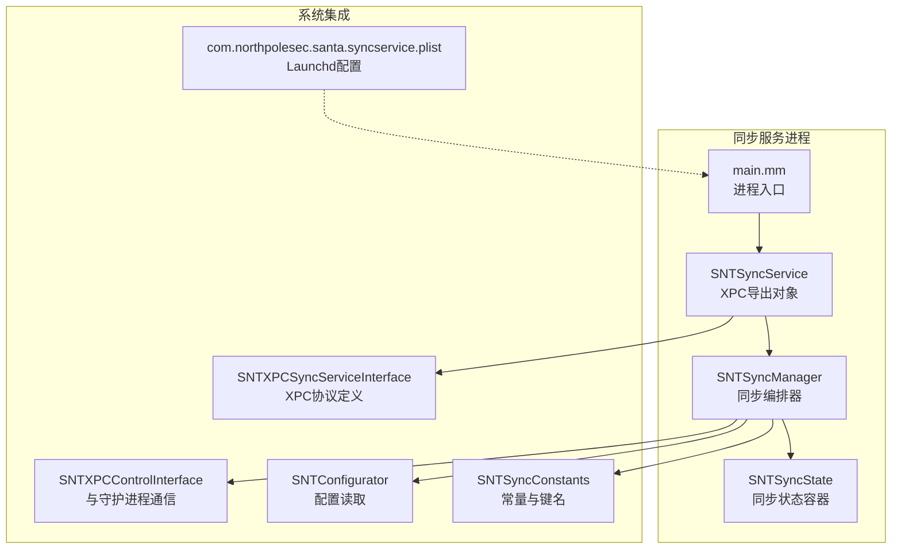
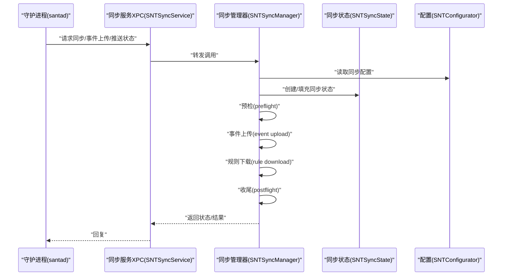
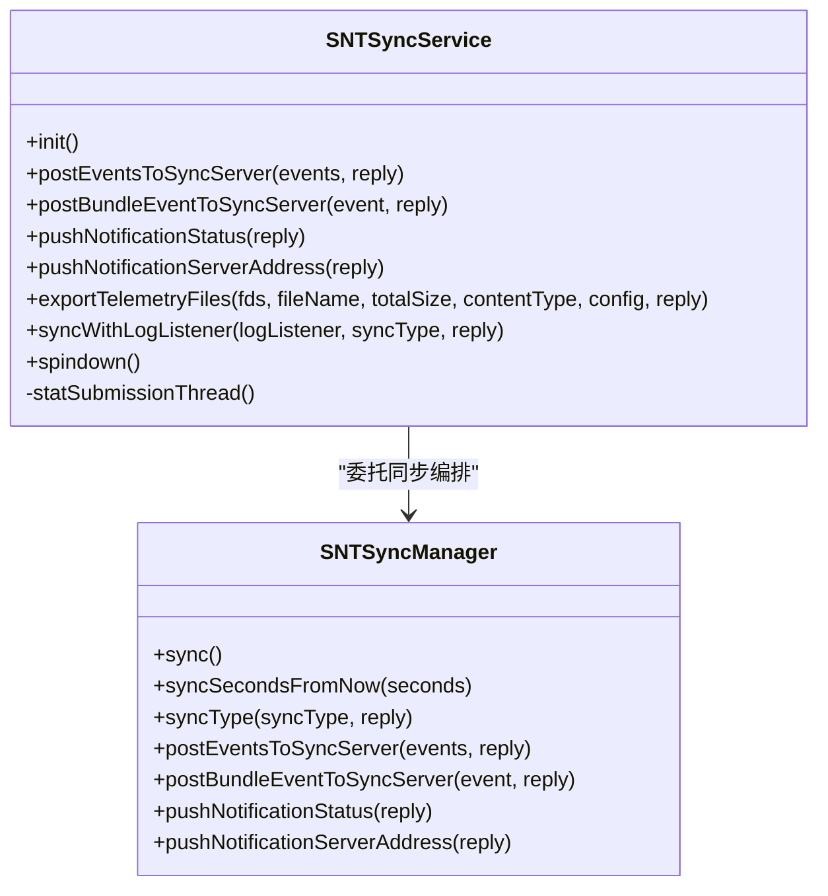
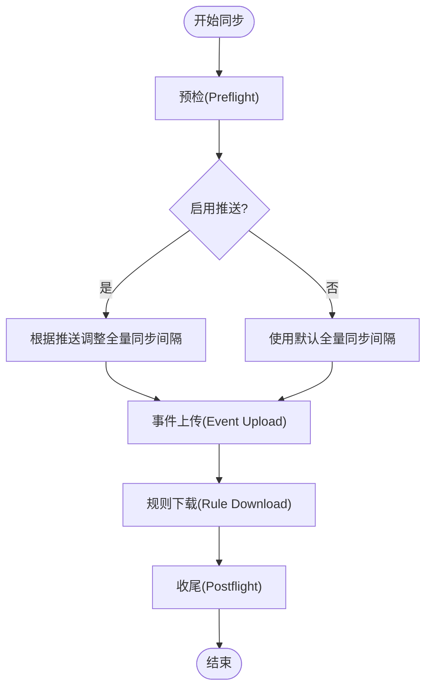
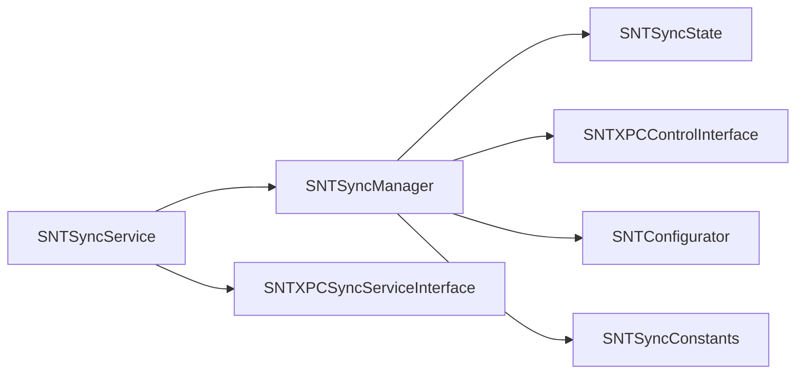

# 同步服务概述

<cite>
**本文引用的文件**
- [main.mm](file://Source/santasyncservice/main.mm)
- [SNTSyncService.h](file://Source/santasyncservice/SNTSyncService.h)
- [SNTSyncService.mm](file://Source/santasyncservice/SNTSyncService.mm)
- [SNTSyncManager.h](file://Source/santasyncservice/SNTSyncManager.h)
- [SNTSyncManager.mm](file://Source/santasyncservice/SNTSyncManager.mm)
- [SNTSyncState.h](file://Source/santasyncservice/SNTSyncState.h)
- [SNTSyncState.mm](file://Source/santasyncservice/SNTSyncState.mm)
- [SNTXPCSyncServiceInterface.h](file://Source/common/SNTXPCSyncServiceInterface.h)
- [SNTXPCControlInterface.h](file://Source/common/SNTXPCControlInterface.h)
- [SNTConfigurator.h](file://Source/common/SNTConfigurator.h)
- [SNTConfigurator.mm](file://Source/common/SNTConfigurator.mm)
- [SNTSyncConstants.h](file://Source/common/SNTSyncConstants.h)
- [com.northpolesec.santa.syncservice.plist](file://Conf/com.northpolesec.santa.syncservice.plist)
</cite>

## 目录
1. [简介](#简介)
2. [项目结构](#项目结构)
3. [核心组件](#核心组件)
4. [架构总览](#架构总览)
5. [详细组件分析](#详细组件分析)
6. [依赖关系分析](#依赖关系分析)
7. [性能考量](#性能考量)
8. [监控与排障指南](#监控与排障指南)
9. [结论](#结论)
10. [附录：配置与运行参数](#附录配置与运行参数)

## 简介
本文件面向Santa同步服务（santasyncservice），提供综合性概述与技术文档。内容涵盖同步服务的整体架构、启动流程、XPC接口设计、进程管理模式、与守护进程及配置管理的交互方式、配置选项与运行参数、性能特征、监控方法以及基础故障排除建议。目标是帮助读者快速理解同步服务在Santa体系中的定位与职责，并能基于本文进行部署、运维与问题排查。

## 项目结构
同步服务位于Source/santasyncservice目录，核心入口为main.mm，对外通过XPC暴露SNTSyncService接口，内部由SNTSyncManager协调预检、事件上传、规则下载、收尾等阶段，并通过SNTSyncState在各阶段间传递状态数据。同步服务与守护进程（santad）通过SNTXPCControlInterface建立连接，与配置管理（SNTConfigurator）交互以读取同步相关配置。

图表来源
- [main.mm](file://Source/santasyncservice/main.mm#L22-L37)
- [SNTSyncService.mm](file://Source/santasyncservice/SNTSyncService.mm#L44-L106)
- [SNTSyncManager.mm](file://Source/santasyncservice/SNTSyncManager.mm#L69-L103)
- [SNTSyncState.h](file://Source/santasyncservice/SNTSyncState.h#L25-L115)
- [SNTXPCSyncServiceInterface.h](file://Source/common/SNTXPCSyncServiceInterface.h#L30-L100)
- [SNTXPCControlInterface.h](file://Source/common/SNTXPCControlInterface.h#L25-L103)
- [SNTConfigurator.h](file://Source/common/SNTConfigurator.h#L543-L680)
- [SNTSyncConstants.h](file://Source/common/SNTSyncConstants.h#L1-L166)
- [com.northpolesec.santa.syncservice.plist](file://Conf/com.northpolesec.santa.syncservice.plist#L1-L27)

章节来源
- [main.mm](file://Source/santasyncservice/main.mm#L22-L37)
- [com.northpolesec.santa.syncservice.plist](file://Conf/com.northpolesec.santa.syncservice.plist#L1-L27)

## 核心组件
- 进程入口与XPC服务器
  - 入口函数初始化XPC服务器，绑定服务ID与接口，导出SNTSyncService实例，并进入主循环。
- 同步服务对象（SNTSyncService）
  - 实现SNTSyncServiceXPC协议，负责接收来自守护进程或ctl的调用，转发至SNTSyncManager；同时处理日志广播、统计上报、权限降级等。
- 同步管理器（SNTSyncManager）
  - 负责周期性同步、推送通知、串行化同步队列、网络可达性监听、构建同步会话与状态等。
- 同步状态（SNTSyncState）
  - 在各同步阶段之间传递会话、认证信息、机器标识、推送令牌、批大小、规则计数等。
- 配置与常量
  - SNTConfigurator提供同步相关的配置项（如SyncBaseURL、代理、客户端认证、推送开关等）。
  - SNTSyncConstants提供同步过程中的键名、默认间隔、批量大小等常量。

章节来源
- [SNTSyncService.h](file://Source/santasyncservice/SNTSyncService.h#L15-L21)
- [SNTSyncService.mm](file://Source/santasyncservice/SNTSyncService.mm#L44-L106)
- [SNTSyncManager.h](file://Source/santasyncservice/SNTSyncManager.h#L24-L78)
- [SNTSyncManager.mm](file://Source/santasyncservice/SNTSyncManager.mm#L69-L103)
- [SNTSyncState.h](file://Source/santasyncservice/SNTSyncState.h#L25-L115)
- [SNTConfigurator.h](file://Source/common/SNTConfigurator.h#L543-L680)
- [SNTSyncConstants.h](file://Source/common/SNTSyncConstants.h#L1-L166)

## 架构总览
同步服务采用“XPC服务器 + 同步编排器 + 状态容器”的分层架构。守护进程通过XPC与同步服务交互，同步服务再通过SNTSyncManager与远端同步服务器进行预检、事件上传、规则下载与收尾操作。配置通过SNTConfigurator集中管理，常量通过SNTSyncConstants统一维护。

图表来源
- [SNTSyncService.mm](file://Source/santasyncservice/SNTSyncService.mm#L108-L185)
- [SNTSyncManager.mm](file://Source/santasyncservice/SNTSyncManager.mm#L297-L400)
- [SNTConfigurator.h](file://Source/common/SNTConfigurator.h#L543-L680)

## 详细组件分析

### 组件A：同步服务对象（SNTSyncService）
- 职责
  - 初始化与守护进程的XPC连接，监听连接失效并自旋退出。
  - 权限降级后初始化配置器，记录当前版本并禁用默认URL缓存以避免沙箱错误。
  - 提供XPC接口：事件上传、包事件上传、推送状态查询、推送服务器地址查询、遥测导出、用户触发同步、自旋退出。
  - 定时统计上报线程，按天/小时策略提交统计数据到Polaris。
- 关键行为
  - 使用KVO监听配置变化，当启用推送开关改变时触发自旋退出，等待重新拉起。
  - 用户触发同步时，通过日志监听端点将日志回传给调用方。

图表来源
- [SNTSyncService.h](file://Source/santasyncservice/SNTSyncService.h#L15-L21)
- [SNTSyncService.mm](file://Source/santasyncservice/SNTSyncService.mm#L108-L190)
- [SNTSyncManager.h](file://Source/santasyncservice/SNTSyncManager.h#L24-L78)

章节来源
- [SNTSyncService.mm](file://Source/santasyncservice/SNTSyncService.mm#L44-L106)
- [SNTSyncService.mm](file://Source/santasyncservice/SNTSyncService.mm#L108-L190)

### 组件B：同步管理器（SNTSyncManager）
- 职责
  - 周期性全量同步与规则同步，支持串行化与并发限制。
  - 推送通知（FCM/NATS）集成，动态调整全量同步间隔。
  - 网络可达性监听，网络恢复后自动触发同步。
  - 构建同步会话与状态，串联预检、事件上传、规则下载、收尾四个阶段。
- 关键机制
  - 同步队列与信号量保证并发安全与排队控制。
  - 通过SNTXPCControlInterface与守护进程通信，更新同步设置、保存统计状态等。
  - 从SNTConfigurator读取同步基地址、代理、认证、推送开关等配置。

图表来源
- [SNTSyncManager.mm](file://Source/santasyncservice/SNTSyncManager.mm#L297-L400)
- [SNTSyncManager.mm](file://Source/santasyncservice/SNTSyncManager.mm#L402-L539)

章节来源
- [SNTSyncManager.mm](file://Source/santasyncservice/SNTSyncManager.mm#L69-L103)
- [SNTSyncManager.mm](file://Source/santasyncservice/SNTSyncManager.mm#L297-L400)
- [SNTSyncManager.mm](file://Source/santasyncservice/SNTSyncManager.mm#L502-L539)

### 组件C：同步状态（SNTSyncState）
- 职责
  - 承载一次同步会话所需的所有上下文数据，包括会话、守护进程连接、同步基地址、XSRF令牌、推送令牌与配置、机器标识与所有者、批大小、规则计数、是否仅预检、是否推送同步、协议版本等。
  - 生命周期内持有NSURLSession并在析构时失效与取消任务，避免悬挂连接。

章节来源
- [SNTSyncState.h](file://Source/santasyncservice/SNTSyncState.h#L25-L115)
- [SNTSyncState.mm](file://Source/santasyncservice/SNTSyncState.mm#L15-L22)

### 组件D：XPC接口与进程管理
- 同步服务XPC接口
  - SNTSyncServiceXPC定义了事件上传、包事件上传、推送状态查询、遥测导出、用户触发同步、自旋退出等方法。
  - SNTSyncServiceLogReceiverXPC用于用户触发同步时的日志回传。
- 进程管理
  - Launchd配置文件声明服务名称、可执行路径、Mach服务注册、是否随系统加载、是否保持常驻等。
  - 同步服务作为XPC服务器，仅在有客户端连接时运行，满足按需启动与资源节约。

章节来源
- [SNTXPCSyncServiceInterface.h](file://Source/common/SNTXPCSyncServiceInterface.h#L30-L100)
- [com.northpolesec.santa.syncservice.plist](file://Conf/com.northpolesec.santa.syncservice.plist#L1-L27)

## 依赖关系分析
- 组件耦合
  - SNTSyncService依赖SNTSyncManager完成具体同步逻辑；依赖SNTConfigurator读取配置；依赖SNTXPCControlInterface与守护进程通信。
  - SNTSyncManager依赖SNTConfigurator、SNTSyncState、SNTXPCControlInterface、网络栈与推送客户端实现。
- 外部依赖
  - 配置管理：SNTConfigurator集中管理SyncBaseURL、代理、认证、推送开关、统计开关等。
  - 常量与键名：SNTSyncConstants统一同步过程中的键名与默认值。
  - 推送：FCM/NATS推送客户端在SNTSyncManager中按配置选择启用。

图表来源
- [SNTSyncService.mm](file://Source/santasyncservice/SNTSyncService.mm#L44-L106)
- [SNTSyncManager.mm](file://Source/santasyncservice/SNTSyncManager.mm#L69-L103)
- [SNTConfigurator.h](file://Source/common/SNTConfigurator.h#L543-L680)
- [SNTSyncConstants.h](file://Source/common/SNTSyncConstants.h#L1-L166)
- [SNTXPCSyncServiceInterface.h](file://Source/common/SNTXPCSyncServiceInterface.h#L30-L100)
- [SNTXPCControlInterface.h](file://Source/common/SNTXPCControlInterface.h#L25-L103)

## 性能考量
- 并发与排队
  - 使用串行队列与信号量限制并发同步数量，避免资源争用与重复工作。
- 时间调度
  - 全量同步与规则同步采用dispatch_source定时器，带调度leeway，降低系统唤醒频率。
- 网络效率
  - 事件批大小可由预检阶段动态调整；支持内容编码配置；拒绝重定向以减少额外开销。
- 统计上报
  - 每小时尝试收集，但每日仅提交一次（容忍约23.5小时窗口），避免频繁网络请求。
- 可达性监听
  - 使用网络框架监控网络状态变化，网络恢复后立即触发同步，提升用户体验。

章节来源
- [SNTSyncManager.mm](file://Source/santasyncservice/SNTSyncManager.mm#L402-L416)
- [SNTSyncManager.mm](file://Source/santasyncservice/SNTSyncManager.mm#L418-L501)
- [SNTSyncService.mm](file://Source/santasyncservice/SNTSyncService.mm#L192-L246)

## 监控与排障指南
- 日志与广播
  - 用户触发同步时，可通过日志监听端点接收实时日志，便于诊断。
  - 同步完成后移除监听端点，避免资源泄漏。
- 状态查询
  - 可查询推送连接状态与推送服务器地址（仅在NATS且已连接时返回）。
- 常见问题定位
  - 同步失败：检查SyncBaseURL是否为HTTPS；确认推送启用与证书固定策略；查看网络可达性与重试逻辑。
  - 配置变更：启用推送开关变化将导致服务自旋退出，等待重新拉起。
  - 统计上报：确认统计开关与组织ID配置，观察定时器与最小提交间隔。
- 建议操作
  - 使用用户触发同步功能获取完整日志链路。
  - 在网络异常后检查可达性回调与后续同步是否被触发。
  - 关注日志中的状态码与错误信息，结合配置项逐项核对。

章节来源
- [SNTSyncService.mm](file://Source/santasyncservice/SNTSyncService.mm#L168-L190)
- [SNTSyncManager.mm](file://Source/santasyncservice/SNTSyncManager.mm#L165-L192)
- [SNTSyncManager.mm](file://Source/santasyncservice/SNTSyncManager.mm#L502-L539)

## 结论
同步服务在Santa体系中承担“与远端同步服务器交互”的关键角色，通过XPC与守护进程协作，借助SNTSyncManager实现可靠的周期性与按需同步。其设计强调安全性（HTTPS、证书固定）、可扩展性（推送驱动、批大小动态调整）与可观测性（日志广播、状态查询）。配合完善的配置与监控手段，可满足企业级部署对策略下发、规则同步与合规审计的需求。

## 附录：配置与运行参数
- 同步服务进程
  - 可执行路径与参数：由Launchd配置文件指定，支持通过命令行参数接入系统日志。
  - Mach服务注册：通过服务ID向系统注册，供守护进程与ctl连接。
- 同步相关配置（来自SNTConfigurator）
  - 同步基地址、代理、额外请求头、机器ID/所有者、推送开关、统计开关与组织ID、客户端内容编码、服务端/客户端认证根证书与证书等。
- 常量与默认值（来自SNTSyncConstants）
  - 默认事件批大小、全量/推送全量同步间隔、键名集合等。
- 运行参数
  - --syslog：将日志输出到系统日志设施，便于集中采集与分析。

章节来源
- [com.northpolesec.santa.syncservice.plist](file://Conf/com.northpolesec.santa.syncservice.plist#L1-L27)
- [SNTConfigurator.h](file://Source/common/SNTConfigurator.h#L543-L680)
- [SNTSyncConstants.h](file://Source/common/SNTSyncConstants.h#L1-L166)