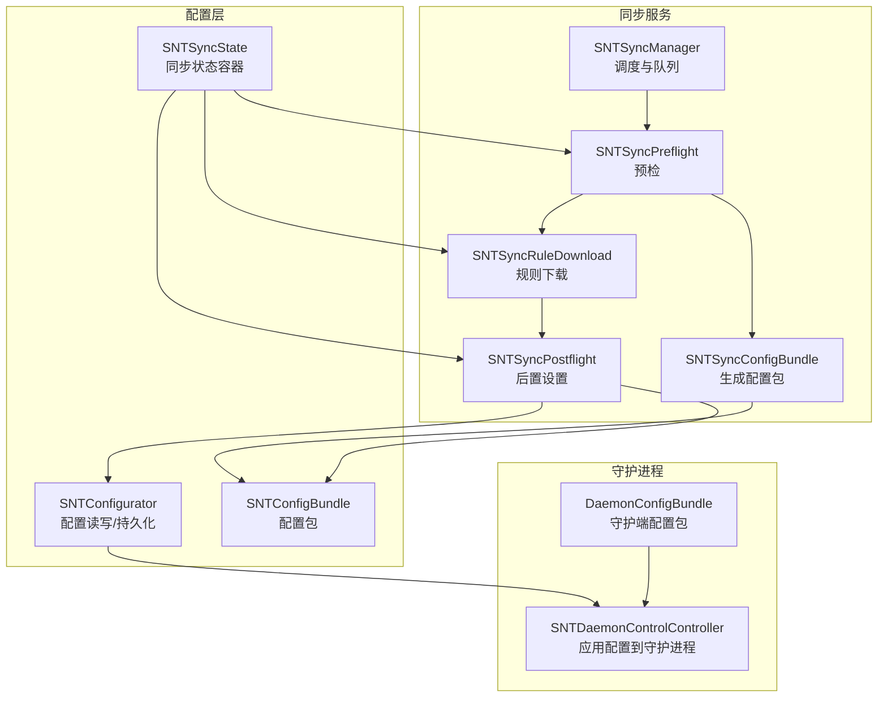
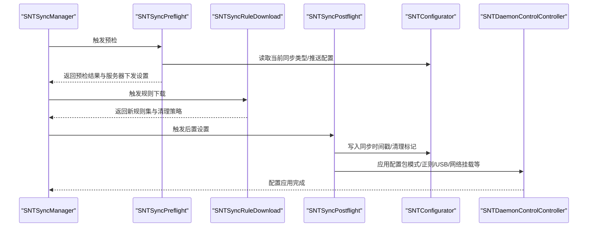
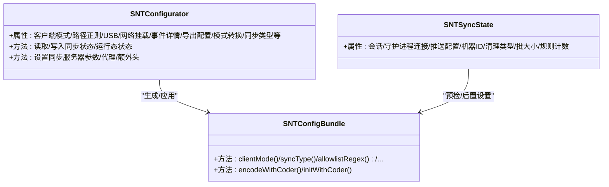
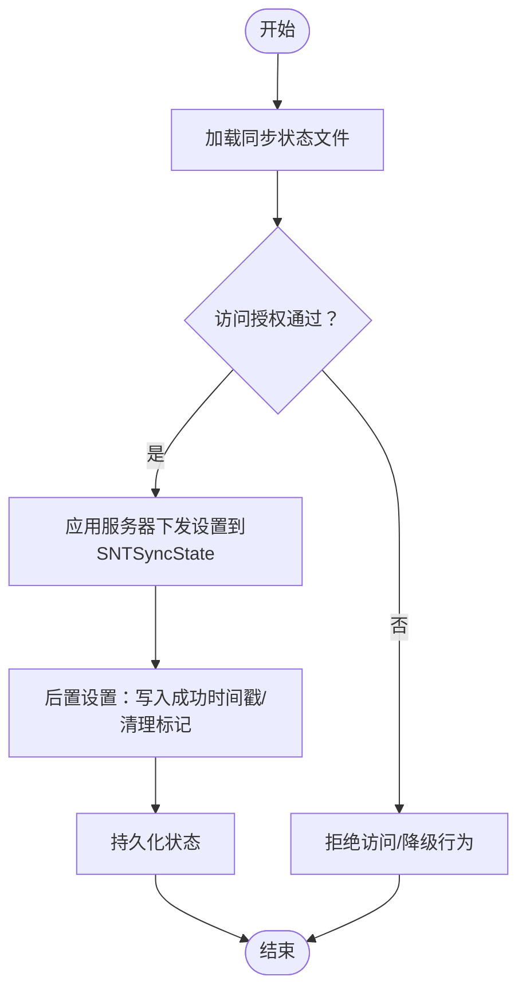
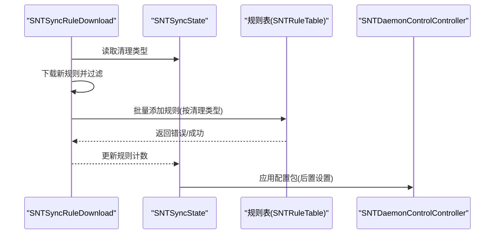
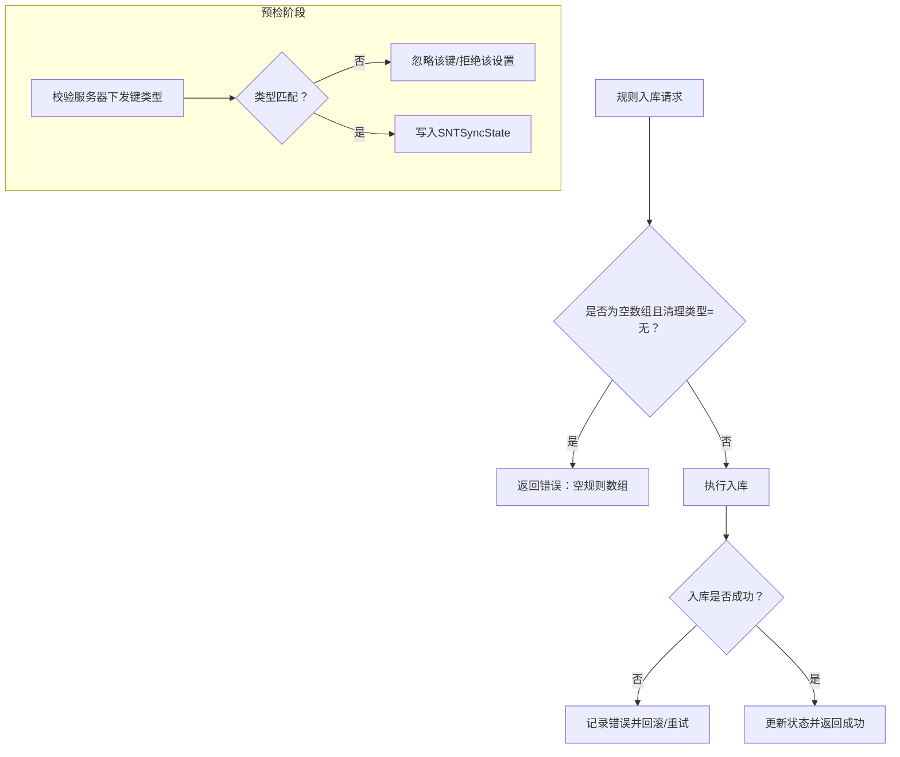
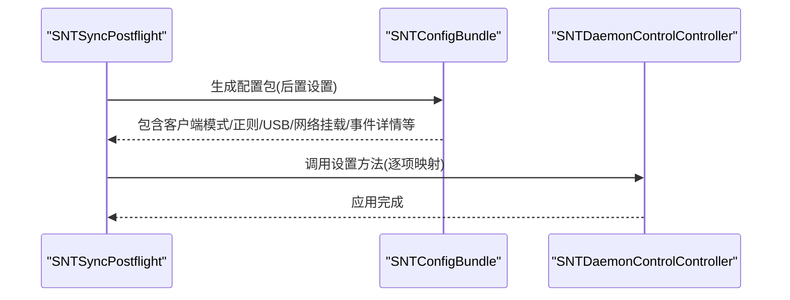
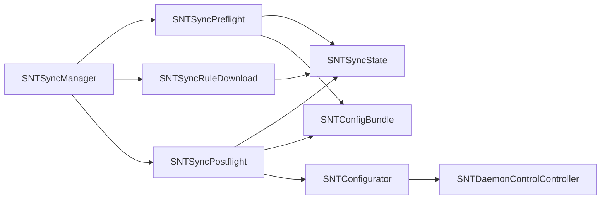

# 同步配置管理

<cite>
**本文引用的文件**
- [SNTConfigurator.h](file://Source/common/SNTConfigurator.h)
- [SNTConfigurator.mm](file://Source/common/SNTConfigurator.mm)
- [SNTConfigBundle.h](file://Source/common/SNTConfigBundle.h)
- [SNTConfigBundle.mm](file://Source/common/SNTConfigBundle.mm)
- [SNTSyncState.h](file://Source/santasyncservice/SNTSyncState.h)
- [SNTSyncState.mm](file://Source/santasyncservice/SNTSyncState.mm)
- [SNTSyncManager.h](file://Source/santasyncservice/SNTSyncManager.h)
- [SNTSyncManager.mm](file://Source/santasyncservice/SNTSyncManager.mm)
- [SNTSyncPreflight.h](file://Source/santasyncservice/SNTSyncPreflight.h)
- [SNTSyncPreflight.mm](file://Source/santasyncservice/SNTSyncPreflight.mm)
- [SNTSyncPostflight.h](file://Source/santasyncservice/SNTSyncPostflight.h)
- [SNTSyncPostflight.mm](file://Source/santasyncservice/SNTSyncPostflight.mm)
- [SNTSyncConfigBundle.h](file://Source/santasyncservice/SNTSyncConfigBundle.h)
- [SNTSyncConfigBundle.mm](file://Source/santasyncservice/SNTSyncConfigBundle.mm)
- [SNTSyncRuleDownload.mm](file://Source/santasyncservice/SNTSyncRuleDownload.mm)
- [SNTDaemonControlController.mm](file://Source/santad/SNTDaemonControlController.mm)
- [DaemonConfigBundle.h](file://Source/santad/DaemonConfigBundle.h)
- [DaemonConfigBundle.mm](file://Source/santad/DaemonConfigBundle.mm)
- [SNTError.h](file://Source/common/SNTError.h)
- [SNTRuleTable.mm](file://Source/santad/DataLayer/SNTRuleTable.mm)
- [SNTSyncTest.mm](file://Source/santasyncservice/SNTSyncTest.mm)
- [SNTConfiguratorTest.mm](file://Source/common/SNTConfiguratorTest.mm)
</cite>

## 目录
1. [引言](#引言)
2. [项目结构](#项目结构)
3. [核心组件](#核心组件)
4. [架构总览](#架构总览)
5. [详细组件分析](#详细组件分析)
6. [依赖关系分析](#依赖关系分析)
7. [性能考量](#性能考量)
8. [故障排查指南](#故障排查指南)
9. [结论](#结论)
10. [附录](#附录)

## 引言
本文件面向“同步配置管理”的技术文档，系统性阐述 Santa 项目中配置包的结构与内容、同步状态管理机制（含持久化、状态转换与一致性）、配置更新传播（增量与全量替换）、配置验证与回滚策略，并提供最佳实践与常见问题解决方案。目标是帮助开发者与运维人员在不深入源码的前提下，理解并正确使用配置同步能力。

## 项目结构
围绕“同步配置管理”，相关代码主要分布在以下模块：
- 配置读写与持久化：SNTConfigurator（单例，负责从磁盘读取/写入配置与状态）
- 配置打包与下发：SNTConfigBundle（跨进程传输的配置载体）
- 同步状态容器：SNTSyncState（贯穿各同步阶段的状态传递对象）
- 同步编排器：SNTSyncManager（调度预检、规则下载、事件上传、后置设置等）
- 同步阶段实现：SNTSyncPreflight（预检）、SNTSyncPostflight（后置设置）、SNTSyncRuleDownload（规则下载）
- 守护进程对接：SNTDaemonControlController（将配置应用到守护进程）
- 验证与错误模型：SNTError、SNTRuleTable（规则入库校验）

图表来源
- [SNTSyncManager.mm](file://Source/santasyncservice/SNTSyncManager.mm#L66-L120)
- [SNTSyncPreflight.mm](file://Source/santasyncservice/SNTSyncPreflight.mm#L404-L429)
- [SNTSyncRuleDownload.mm](file://Source/santasyncservice/SNTSyncRuleDownload.mm#L87-L104)
- [SNTSyncPostflight.mm](file://Source/santasyncservice/SNTSyncPostflight.mm#L1-L200)
- [SNTSyncConfigBundle.mm](file://Source/santasyncservice/SNTSyncConfigBundle.mm#L45-L86)
- [SNTConfigurator.mm](file://Source/common/SNTConfigurator.mm#L219-L231)
- [SNTConfigBundle.mm](file://Source/common/SNTConfigBundle.mm#L45-L101)
- [SNTSyncState.h](file://Source/santasyncservice/SNTSyncState.h#L25-L116)
- [SNTDaemonControlController.mm](file://Source/santad/SNTDaemonControlController.mm#L336-L375)
- [DaemonConfigBundle.mm](file://Source/santad/DaemonConfigBundle.mm#L1-L34)

章节来源
- [SNTSyncManager.h](file://Source/santasyncservice/SNTSyncManager.h#L1-L78)
- [SNTSyncManager.mm](file://Source/santasyncservice/SNTSyncManager.mm#L66-L120)
- [SNTSyncState.h](file://Source/santasyncservice/SNTSyncState.h#L25-L116)
- [SNTConfigurator.h](file://Source/common/SNTConfigurator.h#L543-L800)
- [SNTConfigurator.mm](file://Source/common/SNTConfigurator.mm#L219-L231)

## 核心组件
- SNTConfigurator（配置读写与持久化）
  - 单例接口，负责从磁盘读取/写入配置与状态，维护同步状态文件与普通状态文件路径，提供 KVO 兼容属性集合。
  - 关键职责：读取/写入同步状态、读取/写入运行态状态、迁移旧状态、KVO 属性暴露给其他组件。
  - 默认值与访问控制：通过初始化器限制访问条件（如仅在 root 且特定进程名时才允许访问），并在属性层面提供默认值语义。
- SNTConfigBundle（配置包）
  - 跨进程安全编码的配置载体，支持按需回调读取字段；用于后置设置阶段将服务器下发的配置应用到客户端。
- SNTSyncState（同步状态容器）
  - 横跨预检、规则下载、事件上传、后置设置等阶段的状态传递对象，包含会话、守护进程连接、推送配置、机器标识、清理类型、批大小、规则计数等。
- SNTSyncManager（同步编排器）
  - 调度周期性全量同步与规则同步，串行执行，限制最大排队数量；根据推送能力动态调整全量同步间隔；封装事件上传与推送状态查询。
- SNTSyncPreflight/SNTSyncPostflight（预检/后置）
  - 预检：向服务器发起预检请求，读取服务器下发的设置（如客户端模式、正则、USB/网络挂载策略、事件详情等）并写入 SNTSyncState。
  - 后置：将 SNTSyncState 中的设置转换为 SNTConfigBundle 并应用到守护进程，同时更新本地同步时间戳。
- SNTSyncRuleDownload（规则下载）
  - 下载新规则并转换为内部规则对象，依据同步类型选择清理策略（正常/清理/全量清理），支持 v1/v2 协议差异。
- 守护进程对接
  - SNTDaemonControlController 将 SNTConfigBundle 的字段映射到守护进程配置，触发模式切换、路径正则、USB/网络挂载策略等变更。
  - DaemonConfigBundle 提供守护端专用的配置包构造方法，便于 UI 或守护端消费。

章节来源
- [SNTConfigurator.h](file://Source/common/SNTConfigurator.h#L543-L800)
- [SNTConfigurator.mm](file://Source/common/SNTConfigurator.mm#L219-L231)
- [SNTConfigBundle.h](file://Source/common/SNTConfigBundle.h#L1-L48)
- [SNTConfigBundle.mm](file://Source/common/SNTConfigBundle.mm#L45-L101)
- [SNTSyncState.h](file://Source/santasyncservice/SNTSyncState.h#L25-L116)
- [SNTSyncManager.h](file://Source/santasyncservice/SNTSyncManager.h#L1-L78)
- [SNTSyncManager.mm](file://Source/santasyncservice/SNTSyncManager.mm#L66-L120)
- [SNTSyncPreflight.h](file://Source/santasyncservice/SNTSyncPreflight.h#L1-L21)
- [SNTSyncPreflight.mm](file://Source/santasyncservice/SNTSyncPreflight.mm#L404-L429)
- [SNTSyncPostflight.mm](file://Source/santasyncservice/SNTSyncPostflight.mm#L1-L200)
- [SNTSyncRuleDownload.mm](file://Source/santasyncservice/SNTSyncRuleDownload.mm#L87-L104)
- [SNTDaemonControlController.mm](file://Source/santad/SNTDaemonControlController.mm#L336-L375)
- [DaemonConfigBundle.h](file://Source/santad/DaemonConfigBundle.h#L1-L28)
- [DaemonConfigBundle.mm](file://Source/santad/DaemonConfigBundle.mm#L1-L34)

## 架构总览
下图展示从同步编排到配置应用的端到端流程，以及关键组件之间的交互关系。

图表来源
- [SNTSyncManager.mm](file://Source/santasyncservice/SNTSyncManager.mm#L66-L120)
- [SNTSyncPreflight.mm](file://Source/santasyncservice/SNTSyncPreflight.mm#L404-L429)
- [SNTSyncRuleDownload.mm](file://Source/santasyncservice/SNTSyncRuleDownload.mm#L87-L104)
- [SNTSyncPostflight.mm](file://Source/santasyncservice/SNTSyncPostflight.mm#L1-L200)
- [SNTConfigurator.mm](file://Source/common/SNTConfigurator.mm#L219-L231)
- [SNTDaemonControlController.mm](file://Source/santad/SNTDaemonControlController.mm#L336-L375)

## 详细组件分析

### 配置包与默认值、验证规则
- 配置包结构
  - SNTConfigBundle 支持多种配置字段的可选读取回调，包括客户端模式、同步类型、允许/阻止路径正则、USB/网络挂载策略、事件详情、通知静默开关、导出配置、模式转换等。
  - 字段采用 NSSecureCoding，便于跨进程传输与持久化。
- 默认值与访问控制
  - SNTConfigurator 在初始化时限定同步状态文件与运行态状态文件的访问权限（例如仅 root 且特定进程名），并通过属性提供默认值语义。
  - 同步状态文件与旧状态文件路径硬编码于实现中，便于迁移与兼容。
- 验证规则
  - 规则入库前进行有效性检查（空数组、标识符、策略、类型、CEL 表达式等），失败时返回明确错误码，避免脏数据进入数据库。
  - 预检阶段对服务器下发的配置进行类型校验（如布尔、数组、字符串、日期等），不符合预期的键会被忽略或拒绝。

图表来源
- [SNTConfigurator.h](file://Source/common/SNTConfigurator.h#L543-L800)
- [SNTConfigBundle.h](file://Source/common/SNTConfigBundle.h#L1-L48)
- [SNTSyncState.h](file://Source/santasyncservice/SNTSyncState.h#L25-L116)

章节来源
- [SNTConfigurator.mm](file://Source/common/SNTConfigurator.mm#L219-L231)
- [SNTConfigBundle.mm](file://Source/common/SNTConfigBundle.mm#L45-L101)
- [SNTError.h](file://Source/common/SNTError.h#L32-L67)
- [SNTRuleTable.mm](file://Source/santad/DataLayer/SNTRuleTable.mm#L619-L649)

### 同步状态管理与持久化
- 状态容器
  - SNTSyncState 持有会话、守护进程连接、推送令牌与服务器地址、全量同步间隔、机器标识、清理类型、事件批大小、规则接收/处理计数等，贯穿整个同步生命周期。
- 持久化与迁移
  - SNTConfigurator 维护同步状态文件与旧状态文件路径，初始化时设置访问授权器，确保只有在满足条件（如 root、特定进程名）时才允许访问。
  - 测试覆盖了同步状态迁移场景（如 SyncCleanRequired 已废弃键的处理、空状态等），保证兼容性。
- 一致性保证
  - 后置设置阶段在应用配置前更新“最近一次成功同步时间”等字段，确保后续同步逻辑能基于一致的时间戳推进。

图表来源
- [SNTConfigurator.mm](file://Source/common/SNTConfigurator.mm#L219-L231)
- [SNTSyncState.h](file://Source/santasyncservice/SNTSyncState.h#L25-L116)
- [SNTSyncPostflight.mm](file://Source/santasyncservice/SNTSyncPostflight.mm#L1-L200)

章节来源
- [SNTConfigurator.mm](file://Source/common/SNTConfigurator.mm#L219-L231)
- [SNTSyncState.mm](file://Source/santasyncservice/SNTSyncState.mm#L1-L22)
- [SNTConfiguratorTest.mm](file://Source/common/SNTConfiguratorTest.mm#L90-L110)

### 配置更新传播机制（增量与全量替换）
- 增量更新
  - 规则下载阶段根据同步类型选择清理策略：正常同步不清理；清理同步清理非传递规则；全量清理清理全部规则。
  - 事件上传采用批处理，支持批量大小配置，失败时重试并等待可达性恢复。
- 全量替换
  - 后置设置阶段将服务器下发的配置转换为 SNTConfigBundle 并应用到守护进程，覆盖当前配置（如客户端模式、路径正则、USB/网络挂载策略等）。
  - SNTSyncConfigBundle 提供不同用途的配置包工厂函数：后置设置包、规则同步包、同步类型包，分别用于不同的同步阶段。

图表来源
- [SNTSyncRuleDownload.mm](file://Source/santasyncservice/SNTSyncRuleDownload.mm#L87-L104)
- [SNTRuleTable.mm](file://Source/santad/DataLayer/SNTRuleTable.mm#L619-L649)
- [SNTDaemonControlController.mm](file://Source/santad/SNTDaemonControlController.mm#L336-L375)

章节来源
- [SNTSyncRuleDownload.mm](file://Source/santasyncservice/SNTSyncRuleDownload.mm#L87-L104)
- [SNTSyncConfigBundle.mm](file://Source/santasyncservice/SNTSyncConfigBundle.mm#L45-L86)
- [SNTSyncManager.mm](file://Source/santasyncservice/SNTSyncManager.mm#L105-L164)

### 配置验证与回滚策略
- 验证策略
  - 规则入库前进行完整性与合法性检查，若为空数组且清理类型为“无”，直接报错并拒绝入库。
  - 预检阶段对服务器下发的键进行类型校验，不符合预期的键被忽略，避免破坏现有配置。
- 回滚策略
  - 当规则下载失败或应用配置失败时，系统记录错误并等待可达性恢复后重试；后置设置阶段仅在成功时更新“最近一次成功同步时间”等字段，确保一致性。
  - 对于已应用但后续失败的配置，可通过重新触发后置设置或清理同步来恢复至期望状态（取决于清理类型）。

图表来源
- [SNTRuleTable.mm](file://Source/santad/DataLayer/SNTRuleTable.mm#L619-L649)
- [SNTError.h](file://Source/common/SNTError.h#L32-L67)
- [SNTSyncPreflight.mm](file://Source/santasyncservice/SNTSyncPreflight.mm#L404-L429)

章节来源
- [SNTRuleTable.mm](file://Source/santad/DataLayer/SNTRuleTable.mm#L619-L649)
- [SNTError.h](file://Source/common/SNTError.h#L32-L67)
- [SNTSyncManager.mm](file://Source/santasyncservice/SNTSyncManager.mm#L105-L164)

### 守护进程配置应用流程
- 应用入口
  - SNTDaemonControlController 接收 SNTConfigBundle，逐项映射到守护进程配置（如客户端模式、路径正则、USB/网络挂载策略、事件详情等）。
- UI/守护端专用配置
  - DaemonConfigBundle 提供守护端专用的配置包构造方法，便于 UI 或守护端消费（如网络挂载阻断消息）。

图表来源
- [SNTSyncPostflight.mm](file://Source/santasyncservice/SNTSyncPostflight.mm#L1-L200)
- [SNTDaemonControlController.mm](file://Source/santad/SNTDaemonControlController.mm#L336-L375)
- [DaemonConfigBundle.mm](file://Source/santad/DaemonConfigBundle.mm#L1-L34)

章节来源
- [SNTDaemonControlController.mm](file://Source/santad/SNTDaemonControlController.mm#L336-L375)
- [DaemonConfigBundle.mm](file://Source/santad/DaemonConfigBundle.mm#L1-L34)

## 依赖关系分析
- 组件耦合
  - SNTSyncManager 作为编排器，依赖 SNTSyncPreflight、SNTSyncRuleDownload、SNTSyncPostflight、SNTSyncConfigBundle、SNTConfigurator、SNTDaemonControlController 等。
  - SNTConfigBundle 作为配置载体，被后置设置阶段使用；SNTSyncState 作为状态容器贯穿所有阶段。
- 外部依赖
  - 网络栈：NSURLSession（认证会话、代理、额外头）。
  - 推送：FCM/NATS（根据配置与域名固定策略启用）。
  - 数据库：规则表入库（SNTRuleTable）。

图表来源
- [SNTSyncManager.mm](file://Source/santasyncservice/SNTSyncManager.mm#L66-L120)
- [SNTSyncPreflight.mm](file://Source/santasyncservice/SNTSyncPreflight.mm#L404-L429)
- [SNTSyncRuleDownload.mm](file://Source/santasyncservice/SNTSyncRuleDownload.mm#L87-L104)
- [SNTSyncPostflight.mm](file://Source/santasyncservice/SNTSyncPostflight.mm#L1-L200)
- [SNTConfigurator.mm](file://Source/common/SNTConfigurator.mm#L219-L231)
- [SNTDaemonControlController.mm](file://Source/santad/SNTDaemonControlController.mm#L336-L375)

章节来源
- [SNTSyncManager.h](file://Source/santasyncservice/SNTSyncManager.h#L1-L78)
- [SNTSyncManager.mm](file://Source/santasyncservice/SNTSyncManager.mm#L66-L120)

## 性能考量
- 同步频率与推送
  - 全量同步间隔受推送状态影响：启用推送时使用推送配置的间隔；否则使用默认间隔。
  - 规则同步采用串行队列与信号量限制并发，避免资源争用。
- 事件上传批大小
  - 可配置事件批大小，平衡吞吐与延迟；失败时等待可达性恢复再重试。
- 规则入库
  - 批量入库减少事务开销；对空数组且清理类型为“无”的情况快速失败，避免无效操作。

章节来源
- [SNTSyncManager.mm](file://Source/santasyncservice/SNTSyncManager.mm#L66-L120)
- [SNTSyncManager.mm](file://Source/santasyncservice/SNTSyncManager.mm#L105-L164)
- [SNTRuleTable.mm](file://Source/santad/DataLayer/SNTRuleTable.mm#L619-L649)

## 故障排查指南
- 常见错误与定位
  - 规则入库失败：检查规则数组是否为空且清理类型为“无”；查看错误码与日志输出。
  - 预检失败：确认服务器响应中的键类型是否符合预期；检查同步状态文件访问授权。
  - 事件上传失败：检查网络可达性与推送状态；关注批大小与超时配置。
- 诊断建议
  - 使用测试用例覆盖的场景（如预检开启/关闭 USB 挂载、切换清理类型等）进行回归验证。
  - 在调试构建中检查同步状态文件路径与访问授权器逻辑。

章节来源
- [SNTError.h](file://Source/common/SNTError.h#L32-L67)
- [SNTSyncTest.mm](file://Source/santasyncservice/SNTSyncTest.mm#L342-L408)
- [SNTConfiguratorTest.mm](file://Source/common/SNTConfiguratorTest.mm#L90-L110)

## 结论
Santa 的同步配置管理以 SNTConfigurator 为核心，结合 SNTConfigBundle、SNTSyncState 与 SNTSyncManager 实现了从预检、规则下载、事件上传到后置设置的完整闭环。通过严格的类型校验、清理策略与错误回退机制，系统在保证稳定性的同时提供了灵活的增量/全量更新能力。建议在生产环境中合理配置推送与批大小，并持续监控规则入库与事件上传的健康状况。

## 附录
- 最佳实践
  - 明确区分“正常/清理/全量清理”三种同步类型，按需选择，避免不必要的全量清理。
  - 在启用推送时，确保域名固定与推送令牌有效，以获得更短的全量同步间隔。
  - 对服务器下发的配置进行最小化变更，优先使用增量更新，减少对现有策略的影响。
  - 定期检查同步状态文件的访问授权与磁盘空间，防止因权限或容量不足导致同步失败。
- 常见问题
  - 同步未生效：确认后置设置阶段是否成功应用配置包；检查守护进程连接状态。
  - 规则未生效：确认规则下载阶段是否成功入库；检查清理类型与规则合法性。
  - 事件上传积压：增大批大小或缩短推送间隔，同时关注网络可达性。