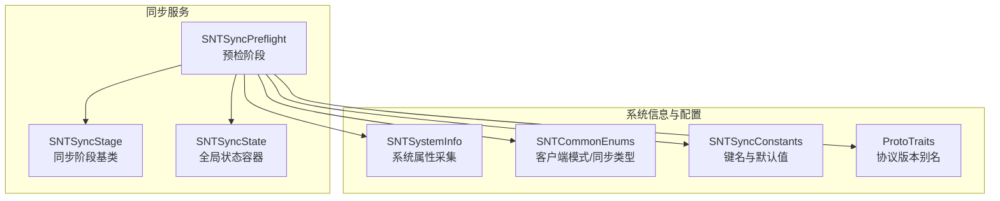
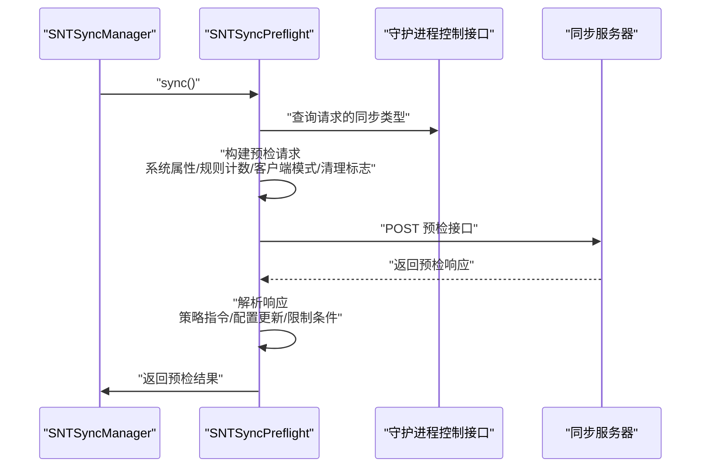
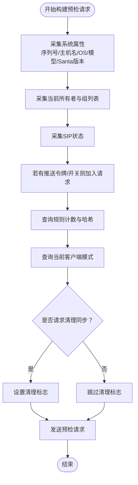
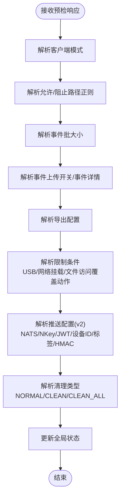
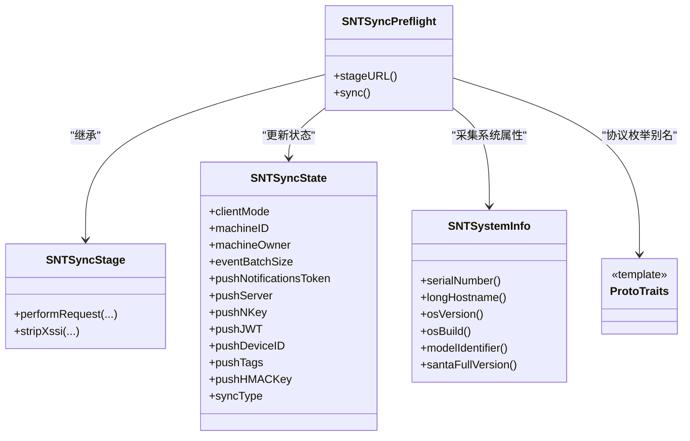

# 同步预检机制

<cite>
**本文引用的文件**
- [SNTSyncPreflight.h](file://Source/santasyncservice/SNTSyncPreflight.h)
- [SNTSyncPreflight.mm](file://Source/santasyncservice/SNTSyncPreflight.mm)
- [SNTSyncStage.mm](file://Source/santasyncservice/SNTSyncStage.mm)
- [SNTSyncState.h](file://Source/santasyncservice/SNTSyncState.h)
- [SNTSyncState.mm](file://Source/santasyncservice/SNTSyncState.mm)
- [SNTCommonEnums.h](file://Source/common/SNTCommonEnums.h)
- [SNTSystemInfo.h](file://Source/common/SNTSystemInfo.h)
- [SNTSystemInfo.mm](file://Source/common/SNTSystemInfo.mm)
- [SNTSyncConstants.h](file://Source/common/SNTSyncConstants.h)
- [ProtoTraits.h](file://Source/santasyncservice/ProtoTraits.h)
- [SNTSyncTest.mm](file://Source/santasyncservice/SNTSyncTest.mm)
- [SNTCommandDoctor.mm](file://Source/santactl/Commands/SNTCommandDoctor.mm)
- [SNTSyncPreflight 基础预检响应示例](file://Source/santasyncservice/testdata/sync_preflight_basic.json)
- [SNTSyncPreflight 锁定模式响应示例](file://Source/santasyncservice/testdata/sync_preflight_lockdown.json)
- [SNTSyncPreflight 独立模式响应示例](file://Source/santasyncservice/testdata/sync_preflight_standalone.json)
</cite>

## 目录
1. [引言](#引言)
2. [项目结构](#项目结构)
3. [核心组件](#核心组件)
4. [架构总览](#架构总览)
5. [详细组件分析](#详细组件分析)
6. [依赖关系分析](#依赖关系分析)
7. [性能考量](#性能考量)
8. [故障排查指南](#故障排查指南)
9. [结论](#结论)
10. [附录](#附录)

## 引言
本文件系统性阐述 Santa 客户端“同步预检”（Preflight）机制的设计目标、实现细节与运行流程。预检阶段在每次同步会话开始前执行，负责向服务器查询并应用策略指令、配置更新与限制条件，同时决定本次同步的类型（普通、清理、全量清理）。该阶段还负责收集系统状态、配置验证与环境适配，确保后续规则下载、事件上传等阶段在正确的策略下运行。

## 项目结构
与预检机制直接相关的代码主要位于以下模块：
- 预检阶段实现：SNTSyncPreflight（封装预检请求构建与响应解析）
- 同步阶段基类：SNTSyncStage（提供通用请求发送与JSON解析能力）
- 全局状态容器：SNTSyncState（承载预检/后置阶段共享的状态）
- 枚举与常量：SNTCommonEnums、SNTSyncConstants（定义客户端模式、同步类型、键名等）
- 系统信息采集：SNTSystemInfo（序列号、主机名、OS 版本、模型等）
- 协议与版本兼容：ProtoTraits（v1/v2 协议枚举别名）
- 测试与示例：SNTSyncTest、testdata 下的预检响应样例

图表来源
- [SNTSyncPreflight.mm](file://Source/santasyncservice/SNTSyncPreflight.mm#L80-L430)
- [SNTSyncStage.mm](file://Source/santasyncservice/SNTSyncStage.mm#L247-L283)
- [SNTSyncState.h](file://Source/santasyncservice/SNTSyncState.h#L1-L116)
- [SNTSystemInfo.h](file://Source/common/SNTSystemInfo.h#L1-L82)
- [SNTCommonEnums.h](file://Source/common/SNTCommonEnums.h#L84-L118)
- [SNTSyncConstants.h](file://Source/common/SNTSyncConstants.h#L1-L166)
- [ProtoTraits.h](file://Source/santasyncservice/ProtoTraits.h#L25-L223)

章节来源
- [SNTSyncPreflight.h](file://Source/santasyncservice/SNTSyncPreflight.h#L1-L21)
- [SNTSyncPreflight.mm](file://Source/santasyncservice/SNTSyncPreflight.mm#L80-L430)
- [SNTSyncStage.mm](file://Source/santasyncservice/SNTSyncStage.mm#L247-L283)
- [SNTSyncState.h](file://Source/santasyncservice/SNTSyncState.h#L1-L116)
- [SNTSystemInfo.h](file://Source/common/SNTSystemInfo.h#L1-L82)
- [SNTCommonEnums.h](file://Source/common/SNTCommonEnums.h#L84-L118)
- [SNTSyncConstants.h](file://Source/common/SNTSyncConstants.h#L1-L166)
- [ProtoTraits.h](file://Source/santasyncservice/ProtoTraits.h#L25-L223)

## 核心组件
- 预检阶段（SNTSyncPreflight）
  - 负责构建预检请求（系统属性、规则计数、客户端模式、清理标志等），发送到服务器，并解析响应中的策略指令与配置项，更新全局状态容器。
- 同步阶段基类（SNTSyncStage）
  - 提供通用的请求发送与JSON解析能力，统一错误处理与日志记录。
- 全局状态容器（SNTSyncState）
  - 存储预检/后置阶段共享的配置与运行参数，如客户端模式、批大小、事件详情、推送配置、清理类型等。
- 系统信息采集（SNTSystemInfo）
  - 提供序列号、主机名、OS 版本/构建、模型标识、Santa 版本等信息，作为预检请求的一部分。
- 枚举与常量（SNTCommonEnums、SNTSyncConstants）
  - 定义客户端模式（监控/锁定/独立）、同步类型（普通/清理/全量清理）、键名（允许/阻止路径正则、批量大小、事件上传开关等）。
- 协议与版本兼容（ProtoTraits）
  - 通过模板特化区分 v1 与 v2 协议，映射枚举别名，保证同一套解析逻辑兼容不同版本。

章节来源
- [SNTSyncPreflight.mm](file://Source/santasyncservice/SNTSyncPreflight.mm#L80-L430)
- [SNTSyncStage.mm](file://Source/santasyncservice/SNTSyncStage.mm#L247-L283)
- [SNTSyncState.h](file://Source/santasyncservice/SNTSyncState.h#L1-L116)
- [SNTSystemInfo.mm](file://Source/common/SNTSystemInfo.mm#L1-L121)
- [SNTCommonEnums.h](file://Source/common/SNTCommonEnums.h#L84-L118)
- [SNTSyncConstants.h](file://Source/common/SNTSyncConstants.h#L1-L166)
- [ProtoTraits.h](file://Source/santasyncservice/ProtoTraits.h#L25-L223)

## 架构总览
预检阶段在同步流程中处于首位，其职责是“先策略、后执行”。整体流程如下：

图表来源
- [SNTSyncPreflight.mm](file://Source/santasyncservice/SNTSyncPreflight.mm#L413-L426)
- [SNTSyncPreflight.mm](file://Source/santasyncservice/SNTSyncPreflight.mm#L84-L158)
- [SNTSyncStage.mm](file://Source/santasyncservice/SNTSyncStage.mm#L247-L283)

## 详细组件分析

### 预检请求构建（系统状态检查、配置验证与环境适配）
- 请求字段来源
  - 系统属性：序列号、主机名、OS 版本/构建、模型标识、Santa 版本、主机名等，来自系统信息采集模块。
  - 用户与组：当前所有者与所属组列表，用于策略分发。
  - SIP 状态：系统完整性保护状态，影响部分策略行为。
  - 推送令牌与开关：若存在，随请求上报。
  - 规则计数与哈希：数据库中各类规则数量与哈希，帮助服务器判断是否需要全量或增量同步。
  - 客户端模式：从守护进程查询当前模式（监控/锁定/独立）。
  - 清理标志：根据上一次请求的同步类型设置“请求清理同步”标志。
- 配置验证与环境适配
  - 通过系统属性与规则状态，服务器可判断是否需要强制清理、切换模式或调整批大小。
  - 若服务器返回新的推送配置（NATS 地址、密钥、设备ID、标签、HMAC），预检阶段会更新全局状态以启用推送订阅。

图表来源
- [SNTSyncPreflight.mm](file://Source/santasyncservice/SNTSyncPreflight.mm#L89-L149)

章节来源
- [SNTSyncPreflight.mm](file://Source/santasyncservice/SNTSyncPreflight.mm#L89-L149)
- [SNTSystemInfo.mm](file://Source/common/SNTSystemInfo.mm#L20-L111)
- [SNTCommonEnums.h](file://Source/common/SNTCommonEnums.h#L84-L118)

### 预检响应解析（策略指令、配置更新与限制条件）
- 策略指令
  - 客户端模式：监控/锁定/独立，预检阶段直接更新全局状态。
  - 允许/阻止路径正则：支持新旧键名兼容，预检阶段解析并保存。
  - 清理类型：服务器可返回 NORMAL/CLEAN/CLEAN_ALL；若客户端请求 CLEAN_ALL，则优先执行全量清理。
- 配置更新
  - 批量大小：事件上传批大小，预检阶段解析并保存。
  - 事件详情：事件详情链接与文案，预检阶段解析并保存。
  - 事件上传开关：是否上传未知事件、是否上传全部事件。
  - 导出配置：签名后的表单提交配置，预检阶段解析并保存。
- 限制条件
  - USB 挂载限制：是否禁止 USB 挂载及强制重新挂载模式。
  - 网络挂载限制：是否禁止网络挂载及允许的主机列表。
  - 文件访问覆盖动作：NONE/AUDIT_ONLY/DISABLE。
- 推送配置（v2）
  - NATS 服务器地址、nkey、JWT、设备ID、标签、HMAC 密钥，预检阶段解析并保存，供后续推送订阅使用。
- 清理同步决策逻辑
  - 服务器可覆盖客户端请求的清理类型，但 CLEAN_ALL 的请求具有最高优先级。

图表来源
- [SNTSyncPreflight.mm](file://Source/santasyncservice/SNTSyncPreflight.mm#L159-L323)
- [SNTSyncPreflight.mm](file://Source/santasyncservice/SNTSyncPreflight.mm#L325-L403)

章节来源
- [SNTSyncPreflight.mm](file://Source/santasyncservice/SNTSyncPreflight.mm#L159-L323)
- [SNTSyncPreflight.mm](file://Source/santasyncservice/SNTSyncPreflight.mm#L325-L403)
- [SNTSyncState.h](file://Source/santasyncservice/SNTSyncState.h#L67-L112)

### 不同预检场景的处理逻辑
- 正常模式（监控）
  - 服务器返回客户端模式为监控，预检阶段将全局状态设为监控模式；允许/阻止路径正则为空表示不强制限制。
- 锁定模式
  - 服务器返回客户端模式为锁定，预检阶段将全局状态设为锁定模式；通常伴随更严格的限制条件（如文件访问覆盖动作）。
- 独立模式
  - 服务器返回客户端模式为独立，预检阶段将全局状态设为独立模式；独立模式下的规则清理与行为可能有特殊处理。

章节来源
- [SNTSyncPreflight 基础预检响应示例](file://Source/santasyncservice/testdata/sync_preflight_basic.json#L1-L2)
- [SNTSyncPreflight 锁定模式响应示例](file://Source/santasyncservice/testdata/sync_preflight_lockdown.json#L1-L2)
- [SNTSyncPreflight 独立模式响应示例](file://Source/santasyncservice/testdata/sync_preflight_standalone.json#L1-L2)
- [SNTSyncTest.mm](file://Source/santasyncservice/SNTSyncTest.mm#L784-L794)

### 预检失败的错误处理与重试策略
- 失败场景
  - 预检请求发送失败或响应解析失败时，预检阶段返回失败，同步流程终止于预检阶段。
  - JSON 解析失败时，统一记录错误并返回错误对象。
- 重试策略
  - 预检阶段未内置自动重试逻辑；重试通常由上层同步管理器在特定条件下触发（例如网络可达性变化或推送通知到达后再次尝试）。
  - 对于 doctor 命令，预检仅用于探测服务器连通性，失败时打印错误并退出。

章节来源
- [SNTSyncPreflight.mm](file://Source/santasyncservice/SNTSyncPreflight.mm#L154-L157)
- [SNTSyncStage.mm](file://Source/santasyncservice/SNTSyncStage.mm#L247-L283)
- [SNTCommandDoctor.mm](file://Source/santactl/Commands/SNTCommandDoctor.mm#L199-L248)

## 依赖关系分析
- 组件耦合
  - SNTSyncPreflight 依赖 SNTSyncStage 提供的请求发送与 JSON 解析能力。
  - 依赖 SNTSystemInfo 获取系统属性，依赖 SNTCommonEnums/SNTSyncConstants 进行模式与键名映射。
  - 通过 ProtoTraits 实现 v1/v2 协议的统一处理。
- 外部集成点
  - 守护进程控制接口：用于查询当前客户端模式与清理类型。
  - 同步服务器：接收预检请求并返回策略与配置。

图表来源
- [SNTSyncPreflight.h](file://Source/santasyncservice/SNTSyncPreflight.h#L1-L21)
- [SNTSyncPreflight.mm](file://Source/santasyncservice/SNTSyncPreflight.mm#L406-L428)
- [SNTSyncStage.mm](file://Source/santasyncservice/SNTSyncStage.mm#L247-L283)
- [SNTSyncState.h](file://Source/santasyncservice/SNTSyncState.h#L1-L116)
- [SNTSystemInfo.h](file://Source/common/SNTSystemInfo.h#L1-L82)
- [ProtoTraits.h](file://Source/santasyncservice/ProtoTraits.h#L25-L223)

## 性能考量
- 预检请求体积控制
  - 仅携带必要的系统属性与规则统计，避免冗余数据导致带宽浪费。
- 响应解析优化
  - 使用 Arena 分配器减少内存分配开销；忽略未知字段以提升兼容性。
- 批大小与推送间隔
  - 预检阶段设置事件批大小与推送全量同步间隔，有助于平衡实时性与资源消耗。

章节来源
- [SNTSyncPreflight.mm](file://Source/santasyncservice/SNTSyncPreflight.mm#L181-L203)
- [SNTSyncStage.mm](file://Source/santasyncservice/SNTSyncStage.mm#L247-L264)

## 故障排查指南
- 预检请求无法发送
  - 检查同步基础 URL 与机器 ID 是否有效；确认网络可达性与代理设置。
  - 查看预检阶段返回的错误对象与日志。
- 预检响应解析失败
  - 确认服务器返回的 JSON 结构符合协议规范；关注未知字段与键名差异。
- doctor 命令探测失败
  - doctor 会发起预检探测请求，失败时打印 HTTP 状态码与错误信息，便于定位问题。

章节来源
- [SNTSyncStage.mm](file://Source/santasyncservice/SNTSyncStage.mm#L247-L283)
- [SNTCommandDoctor.mm](file://Source/santactl/Commands/SNTCommandDoctor.mm#L199-L248)

## 结论
预检机制通过在同步会话开始前拉取服务器策略与配置，确保后续阶段在正确模式与限制条件下运行。它整合了系统状态检查、配置验证与环境适配，并对不同模式（监控/锁定/独立）与清理场景（普通/清理/全量清理）进行统一处理。对于失败与异常，预检阶段提供明确的错误输出，便于快速定位问题。

## 附录
- 关键键名与默认值参考
  - 客户端模式、允许/阻止路径正则、批大小、事件上传开关、推送配置等键名定义见同步常量头文件。
- 示例响应
  - 基础预检响应、锁定模式响应、独立模式响应可用于本地调试与测试。

章节来源
- [SNTSyncConstants.h](file://Source/common/SNTSyncConstants.h#L1-L166)
- [SNTSyncPreflight 基础预检响应示例](file://Source/santasyncservice/testdata/sync_preflight_basic.json#L1-L2)
- [SNTSyncPreflight 锁定模式响应示例](file://Source/santasyncservice/testdata/sync_preflight_lockdown.json#L1-L2)
- [SNTSyncPreflight 独立模式响应示例](file://Source/santasyncservice/testdata/sync_preflight_standalone.json#L1-L2)