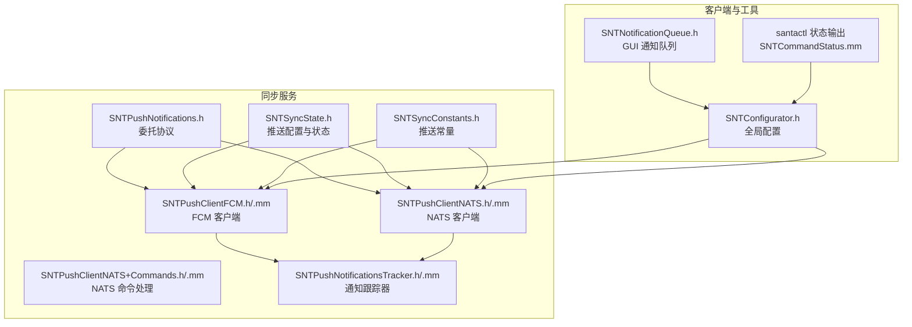
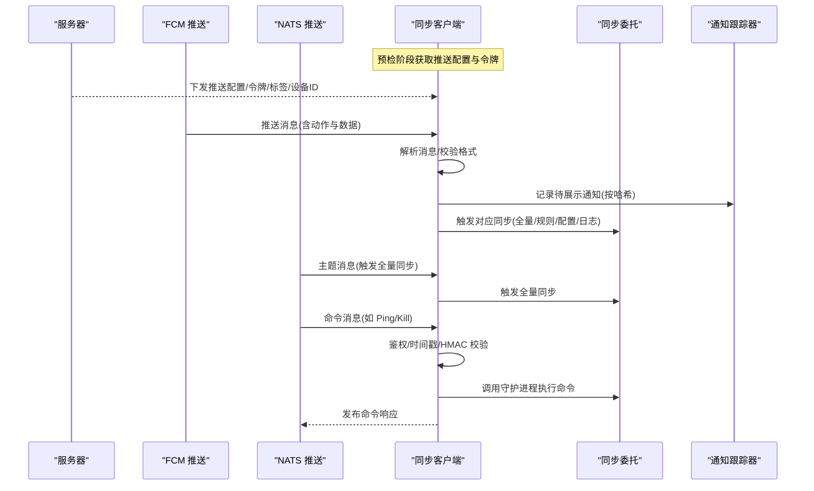
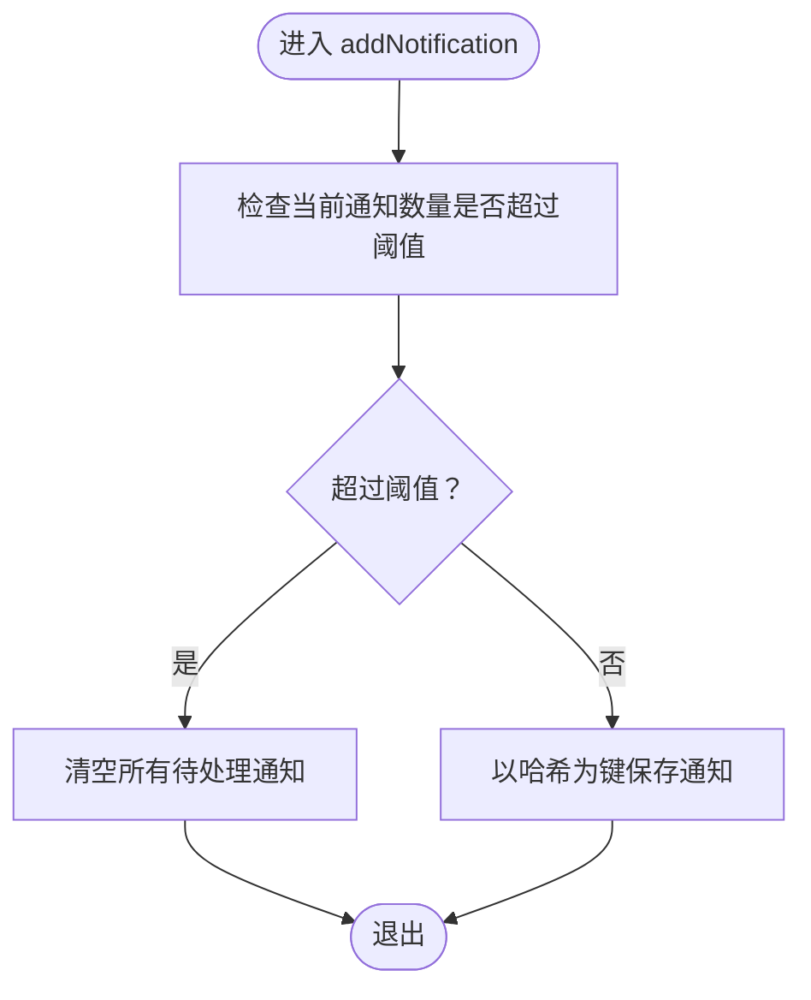
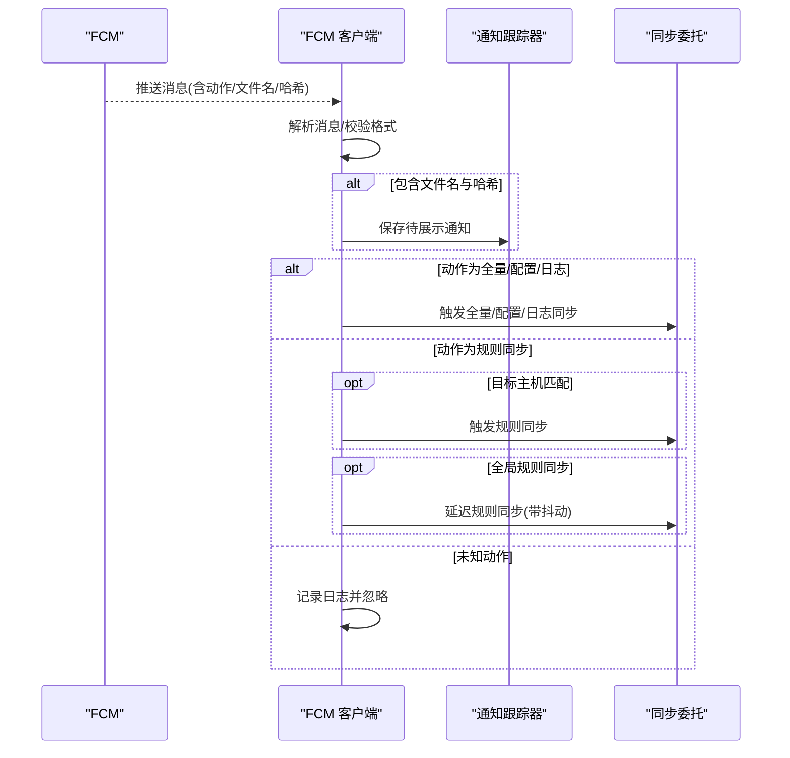
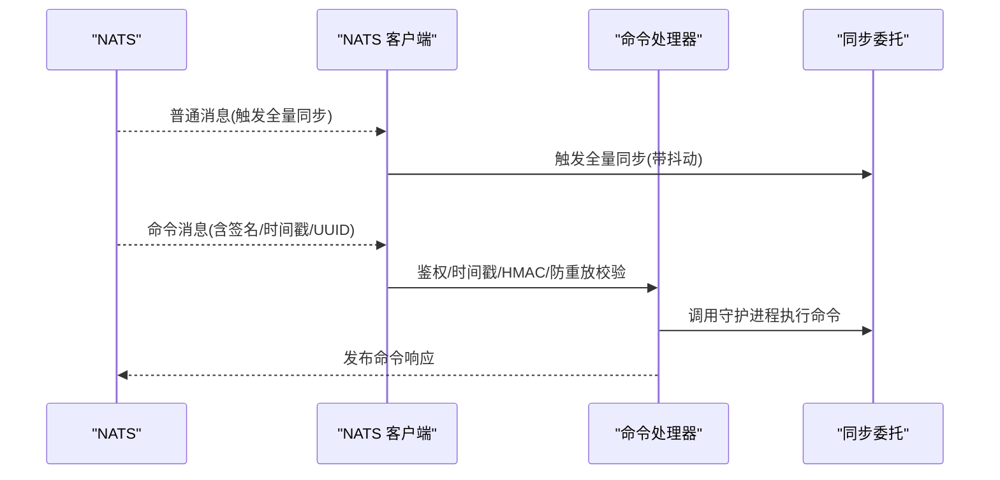
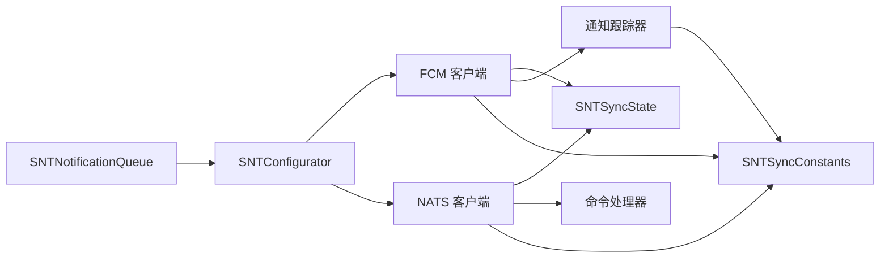

# 推送通知系统

<cite>
**本文引用的文件**
- [SNTPushNotifications.h](file://Source/santasyncservice/SNTPushNotifications.h)
- [SNTPushNotificationsTracker.h](file://Source/santasyncservice/SNTPushNotificationsTracker.h)
- [SNTPushNotificationsTracker.mm](file://Source/santasyncservice/SNTPushNotificationsTracker.mm)
- [SNTPushClientFCM.h](file://Source/santasyncservice/SNTPushClientFCM.h)
- [SNTPushClientFCM.mm](file://Source/santasyncservice/SNTPushClientFCM.mm)
- [SNTPushClientNATS.h](file://Source/santasyncservice/SNTPushClientNATS.h)
- [SNTPushClientNATS.mm](file://Source/santasyncservice/SNTPushClientNATS.mm)
- [SNTPushClientNATS+Commands.h](file://Source/santasyncservice/SNTPushClientNATS+Commands.h)
- [SNTPushClientNATS+Commands.mm](file://Source/santasyncservice/SNTPushClientNATS+Commands.mm)
- [SNTSyncConstants.h](file://Source/common/SNTSyncConstants.h)
- [SNTSyncState.h](file://Source/santasyncservice/SNTSyncState.h)
- [SNTConfigurator.h](file://Source/common/SNTConfigurator.h)
- [SNTNotificationQueue.h](file://Source/santad/SNTNotificationQueue.h)
- [SNTCommandStatus.mm](file://Source/santactl/Commands/SNTCommandStatus.mm)
</cite>

## 目录
1. [引言](#引言)
2. [项目结构](#项目结构)
3. [核心组件](#核心组件)
4. [架构总览](#架构总览)
5. [详细组件分析](#详细组件分析)
6. [依赖关系分析](#依赖关系分析)
7. [性能考量](#性能考量)
8. [故障排除指南](#故障排除指南)
9. [结论](#结论)
10. [附录](#附录)

## 引言
本技术文档围绕 Santa 推送通知系统展开，重点说明以下方面：
- 推送通知的触发机制与通知类型（策略更新、事件提醒、系统状态变更）
- 通知跟踪器的实现（状态管理、重复通知过滤、历史记录）
- 推送渠道选择与配置（FCM 与 NATS 的支持）
- 通知优先级与用户偏好设置
- 监控、调试与故障排除方法

该系统通过推送通道在客户端与服务器之间建立低延迟的同步触发机制，结合本地规则下载与执行决策，确保策略更新与事件响应的及时性。

## 项目结构
推送通知系统主要位于同步服务模块中，涉及两类推送客户端（FCM 与 NATS）、通知跟踪器以及同步状态与常量定义。下图给出与推送相关的模块关系概览：

图表来源
- [SNTPushNotifications.h](file://Source/santasyncservice/SNTPushNotifications.h#L1-L40)
- [SNTPushClientFCM.h](file://Source/santasyncservice/SNTPushClientFCM.h#L1-L21)
- [SNTPushClientFCM.mm](file://Source/santasyncservice/SNTPushClientFCM.mm#L1-L197)
- [SNTPushClientNATS.h](file://Source/santasyncservice/SNTPushClientNATS.h#L1-L21)
- [SNTPushClientNATS.mm](file://Source/santasyncservice/SNTPushClientNATS.mm#L1-L800)
- [SNTPushClientNATS+Commands.h](file://Source/santasyncservice/SNTPushClientNATS+Commands.h#L1-L32)
- [SNTPushClientNATS+Commands.mm](file://Source/santasyncservice/SNTPushClientNATS+Commands.mm#L1-L435)
- [SNTPushNotificationsTracker.h](file://Source/santasyncservice/SNTPushNotificationsTracker.h#L1-L32)
- [SNTPushNotificationsTracker.mm](file://Source/santasyncservice/SNTPushNotificationsTracker.mm#L1-L100)
- [SNTSyncState.h](file://Source/santasyncservice/SNTSyncState.h#L1-L116)
- [SNTSyncConstants.h](file://Source/common/SNTSyncConstants.h#L1-L166)
- [SNTConfigurator.h](file://Source/common/SNTConfigurator.h#L1-L961)
- [SNTNotificationQueue.h](file://Source/santad/SNTNotificationQueue.h#L1-L46)
- [SNTCommandStatus.mm](file://Source/santactl/Commands/SNTCommandStatus.mm#L425-L449)

章节来源
- [SNTPushNotifications.h](file://Source/santasyncservice/SNTPushNotifications.h#L1-L40)
- [SNTPushClientFCM.h](file://Source/santasyncservice/SNTPushClientFCM.h#L1-L21)
- [SNTPushClientFCM.mm](file://Source/santasyncservice/SNTPushClientFCM.mm#L1-L197)
- [SNTPushClientNATS.h](file://Source/santasyncservice/SNTPushClientNATS.h#L1-L21)
- [SNTPushClientNATS.mm](file://Source/santasyncservice/SNTPushClientNATS.mm#L1-L800)
- [SNTPushClientNATS+Commands.h](file://Source/santasyncservice/SNTPushClientNATS+Commands.h#L1-L32)
- [SNTPushClientNATS+Commands.mm](file://Source/santasyncservice/SNTPushClientNATS+Commands.mm#L1-L435)
- [SNTPushNotificationsTracker.h](file://Source/santasyncservice/SNTPushNotificationsTracker.h#L1-L32)
- [SNTPushNotificationsTracker.mm](file://Source/santasyncservice/SNTPushNotificationsTracker.mm#L1-L100)
- [SNTSyncState.h](file://Source/santasyncservice/SNTSyncState.h#L1-L116)
- [SNTSyncConstants.h](file://Source/common/SNTSyncConstants.h#L1-L166)
- [SNTConfigurator.h](file://Source/common/SNTConfigurator.h#L1-L961)
- [SNTNotificationQueue.h](file://Source/santad/SNTNotificationQueue.h#L1-L46)
- [SNTCommandStatus.mm](file://Source/santactl/Commands/SNTCommandStatus.mm#L425-L449)

## 核心组件
- 推送通知委托协议：定义了同步委托接口，用于触发全量/增量/规则同步与预检同步等操作。
- FCM 客户端：负责连接 FCM、解析消息、根据动作触发相应同步流程，并维护令牌与连接错误处理。
- NATS 客户端：负责连接 NATS 推送服务、订阅主题、处理命令消息、进行鉴权与重连控制。
- 通知跟踪器：以哈希为键存储待展示的通知元信息，支持去重、计数递减与批量清理。
- 同步状态与常量：提供推送间隔、令牌、设备/标签等配置项，以及动作常量（如全量/规则/配置/日志同步）。
- 配置与 GUI 通知：全局配置暴露推送相关参数；GUI 通知队列承载用户可见的阻断/授权提示。

章节来源
- [SNTPushNotifications.h](file://Source/santasyncservice/SNTPushNotifications.h#L1-L40)
- [SNTPushClientFCM.mm](file://Source/santasyncservice/SNTPushClientFCM.mm#L1-L197)
- [SNTPushClientNATS.mm](file://Source/santasyncservice/SNTPushClientNATS.mm#L1-L800)
- [SNTPushNotificationsTracker.mm](file://Source/santasyncservice/SNTPushNotificationsTracker.mm#L1-L100)
- [SNTSyncState.h](file://Source/santasyncservice/SNTSyncState.h#L1-L116)
- [SNTSyncConstants.h](file://Source/common/SNTSyncConstants.h#L1-L166)
- [SNTConfigurator.h](file://Source/common/SNTConfigurator.h#L1-L961)
- [SNTNotificationQueue.h](file://Source/santad/SNTNotificationQueue.h#L1-L46)

## 架构总览
下图展示了推送通知从服务端到客户端的端到端流程，包括 FCM 与 NATS 两条路径：

图表来源
- [SNTPushClientFCM.mm](file://Source/santasyncservice/SNTPushClientFCM.mm#L99-L164)
- [SNTPushClientNATS.mm](file://Source/santasyncservice/SNTPushClientNATS.mm#L572-L622)
- [SNTPushClientNATS+Commands.mm](file://Source/santasyncservice/SNTPushClientNATS+Commands.mm#L356-L435)
- [SNTPushNotificationsTracker.mm](file://Source/santasyncservice/SNTPushNotificationsTracker.mm#L47-L97)
- [SNTPushNotifications.h](file://Source/santasyncservice/SNTPushNotifications.h#L20-L39)

## 详细组件分析

### 组件A：通知跟踪器（SNTPushNotificationsTracker）
职责与特性
- 单例模式提供线程安全的通知存储
- 以二进制/包哈希为键，保存待展示通知的名称与关联规则计数
- 提供添加、移除、计数递减与查询全部通知的方法
- 内置容量上限与丢弃保护，避免堆积导致阻塞

关键行为流程（添加通知）

图表来源
- [SNTPushNotificationsTracker.mm](file://Source/santasyncservice/SNTPushNotificationsTracker.mm#L47-L66)

章节来源
- [SNTPushNotificationsTracker.h](file://Source/santasyncservice/SNTPushNotificationsTracker.h#L1-L32)
- [SNTPushNotificationsTracker.mm](file://Source/santasyncservice/SNTPushNotificationsTracker.mm#L1-L100)

### 组件B：FCM 推送客户端（SNTPushClientFCM）
触发机制
- 监听来自 FCM 的推送消息，解析动作字段
- 支持的动作包括：全量同步、配置同步、日志同步、规则同步
- 对于规则同步，区分目标主机与全局规则同步，采用抖动延迟避免“惊群效应”

消息处理流程

图表来源
- [SNTPushClientFCM.mm](file://Source/santasyncservice/SNTPushClientFCM.mm#L99-L164)
- [SNTPushClientFCM.mm](file://Source/santasyncservice/SNTPushClientFCM.mm#L165-L196)
- [SNTSyncConstants.h](file://Source/common/SNTSyncConstants.h#L145-L149)
- [SNTSyncState.h](file://Source/santasyncservice/SNTSyncState.h#L44-L66)

章节来源
- [SNTPushClientFCM.h](file://Source/santasyncservice/SNTPushClientFCM.h#L1-L21)
- [SNTPushClientFCM.mm](file://Source/santasyncservice/SNTPushClientFCM.mm#L1-L197)
- [SNTSyncConstants.h](file://Source/common/SNTSyncConstants.h#L145-L166)
- [SNTSyncState.h](file://Source/santasyncservice/SNTSyncState.h#L44-L66)

### 组件C：NATS 推送客户端（SNTPushClientNATS）
推送与订阅
- 连接 NATS 推送服务，使用 JWT/NKey 进行认证
- 订阅标签主题与命令主题，支持动态重连与订阅变更
- 处理普通消息与命令消息，前者触发全量同步，后者执行命令并返回响应

连接与重连策略
- 使用指数退避与抖动，避免“惊群”
- 断线/重连回调中更新内部状态并调度同步

命令处理要点
- HMAC 签名校验与时间戳校验
- 防重放：基于 UUID 的非重复窗口缓存
- 将命令转发给守护进程执行，超时处理与错误映射

NATS 消息处理流程

图表来源
- [SNTPushClientNATS.mm](file://Source/santasyncservice/SNTPushClientNATS.mm#L572-L622)
- [SNTPushClientNATS+Commands.mm](file://Source/santasyncservice/SNTPushClientNATS+Commands.mm#L356-L435)
- [SNTPushClientNATS.mm](file://Source/santasyncservice/SNTPushClientNATS.mm#L720-L762)

章节来源
- [SNTPushClientNATS.h](file://Source/santasyncservice/SNTPushClientNATS.h#L1-L21)
- [SNTPushClientNATS.mm](file://Source/santasyncservice/SNTPushClientNATS.mm#L1-L800)
- [SNTPushClientNATS+Commands.h](file://Source/santasyncservice/SNTPushClientNATS+Commands.h#L1-L32)
- [SNTPushClientNATS+Commands.mm](file://Source/santasyncservice/SNTPushClientNATS+Commands.mm#L1-L435)

### 组件D：委托协议与同步状态
- 委托协议定义了触发同步与预检同步的方法，以及获取守护进程连接的能力
- 同步状态对象承载推送令牌、服务器地址、设备ID、标签、HMAC 密钥等配置，以及推送间隔与截止时间等参数

章节来源
- [SNTPushNotifications.h](file://Source/santasyncservice/SNTPushNotifications.h#L20-L39)
- [SNTSyncState.h](file://Source/santasyncservice/SNTSyncState.h#L44-L115)

### 组件E：通知类型与优先级
- 通知类型
  - 策略更新：全量同步、规则同步、配置同步、日志同步
  - 事件提醒：由 FCM 消息携带文件名与哈希，待规则应用后展示
  - 系统状态变更：模式切换、USB/网络挂载策略变更等（由配置与 GUI 通知队列呈现）
- 优先级处理
  - NATS 普通消息直接触发全量同步，具备较高优先级
  - FCM 规则同步支持目标主机与全局两种路径，全局规则同步采用抖动延迟降低并发压力
- 用户偏好设置
  - GUI 通知静音开关、事件详情按钮文案与链接、静默模式等由全局配置提供

章节来源
- [SNTSyncConstants.h](file://Source/common/SNTSyncConstants.h#L145-L166)
- [SNTConfigurator.h](file://Source/common/SNTConfigurator.h#L410-L542)
- [SNTNotificationQueue.h](file://Source/santad/SNTNotificationQueue.h#L1-L46)

## 依赖关系分析
- FCM 客户端依赖同步状态中的推送令牌与会话配置，以及通知跟踪器进行待展示通知管理
- NATS 客户端依赖同步状态中的服务器地址、JWT/NKey、设备ID与标签，命令处理依赖守护进程连接
- 通知跟踪器独立于具体推送通道，仅依赖同步常量中的键名与动作常量
- 全局配置为推送与 GUI 行为提供统一入口

图表来源
- [SNTPushClientFCM.mm](file://Source/santasyncservice/SNTPushClientFCM.mm#L61-L110)
- [SNTPushClientNATS.mm](file://Source/santasyncservice/SNTPushClientNATS.mm#L297-L396)
- [SNTPushNotificationsTracker.mm](file://Source/santasyncservice/SNTPushNotificationsTracker.mm#L47-L97)
- [SNTSyncState.h](file://Source/santasyncservice/SNTSyncState.h#L44-L115)
- [SNTSyncConstants.h](file://Source/common/SNTSyncConstants.h#L145-L166)
- [SNTConfigurator.h](file://Source/common/SNTConfigurator.h#L540-L622)
- [SNTNotificationQueue.h](file://Source/santad/SNTNotificationQueue.h#L1-L46)

章节来源
- [SNTPushClientFCM.mm](file://Source/santasyncservice/SNTPushClientFCM.mm#L61-L110)
- [SNTPushClientNATS.mm](file://Source/santasyncservice/SNTPushClientNATS.mm#L297-L396)
- [SNTPushNotificationsTracker.mm](file://Source/santasyncservice/SNTPushNotificationsTracker.mm#L47-L97)
- [SNTSyncState.h](file://Source/santasyncservice/SNTSyncState.h#L44-L115)
- [SNTSyncConstants.h](file://Source/common/SNTSyncConstants.h#L145-L166)
- [SNTConfigurator.h](file://Source/common/SNTConfigurator.h#L540-L622)
- [SNTNotificationQueue.h](file://Source/santad/SNTNotificationQueue.h#L1-L46)

## 性能考量
- NATS 连接与重连
  - 指数退避与抖动减少集中重连风险
  - 断线/重连回调中仅调度一次同步，避免重复触发
- FCM 规则同步
  - 全局规则同步采用随机抖动延迟，降低“惊群效应”
- 通知跟踪器
  - 设置容量上限并在溢出时清空，防止堆积影响后续处理
- 命令处理
  - 非重复窗口限制命令吞吐，HMAC/时间戳校验保障安全性

[本节为通用指导，不直接分析具体文件]

## 故障排除指南
- FCM 连接失败
  - 现象：连接错误回调被触发，令牌清空，触发全量同步延迟
  - 排查：检查令牌有效性、网络连通性与服务器响应
- NATS 连接异常
  - 现象：断开/重连回调触发，可能因权限或订阅违规导致部分主题不可用
  - 排查：确认服务器域名后缀与 TLS 前缀、JWT/NKey 是否正确、设备ID/标签变更是否导致重新订阅
- 命令无法执行
  - 现象：命令响应超时或签名/时间戳校验失败
  - 排查：核对 HMAC 密钥、时间戳偏差、UUID 防重放窗口
- 通知未显示
  - 现象：规则已下载但通知未出现
  - 排查：确认通知跟踪器中是否存在对应哈希记录；检查规则应用完成后再展示

章节来源
- [SNTPushClientFCM.mm](file://Source/santasyncservice/SNTPushClientFCM.mm#L99-L110)
- [SNTPushClientNATS.mm](file://Source/santasyncservice/SNTPushClientNATS.mm#L703-L762)
- [SNTPushClientNATS+Commands.mm](file://Source/santasyncservice/SNTPushClientNATS+Commands.mm#L40-L110)
- [SNTPushNotificationsTracker.mm](file://Source/santasyncservice/SNTPushNotificationsTracker.mm#L47-L66)

## 结论
Santa 的推送通知系统通过 FCM 与 NATS 两条通道实现低延迟的策略与事件同步，结合通知跟踪器与严格的鉴权/校验机制，确保了高可用与安全性。FCM 适合面向终端用户的事件提醒与规则同步触发，NATS 则更适合大规模、高可靠的消息分发与命令下发。通过合理的抖动与重连策略，系统在复杂网络环境下仍能保持稳定运行。

[本节为总结性内容，不直接分析具体文件]

## 附录
- 监控与调试
  - 查看推送服务状态与全量同步间隔：通过命令行工具查看推送启用状态与推送服务器地址
  - 日志定位：关注 FCM/NATS 客户端的日志输出，定位连接、订阅与命令处理问题

章节来源
- [SNTCommandStatus.mm](file://Source/santactl/Commands/SNTCommandStatus.mm#L425-L449)