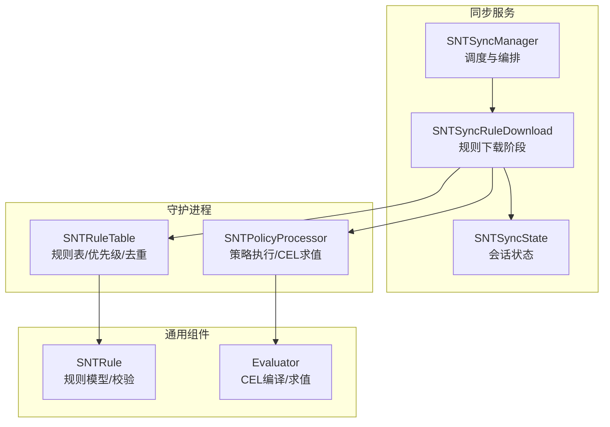
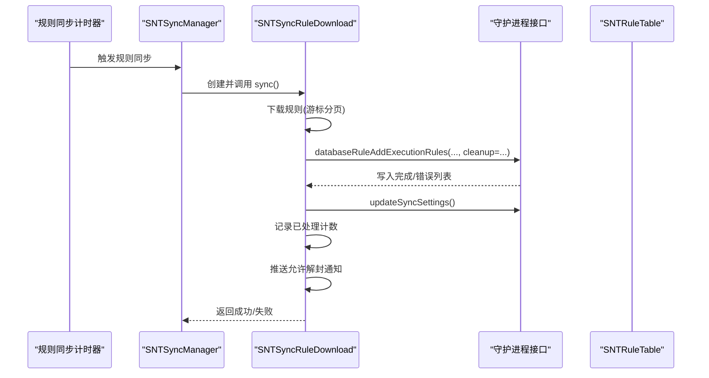
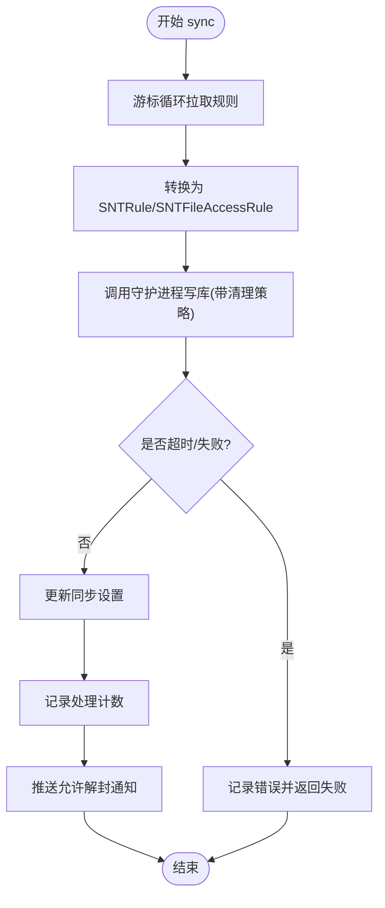
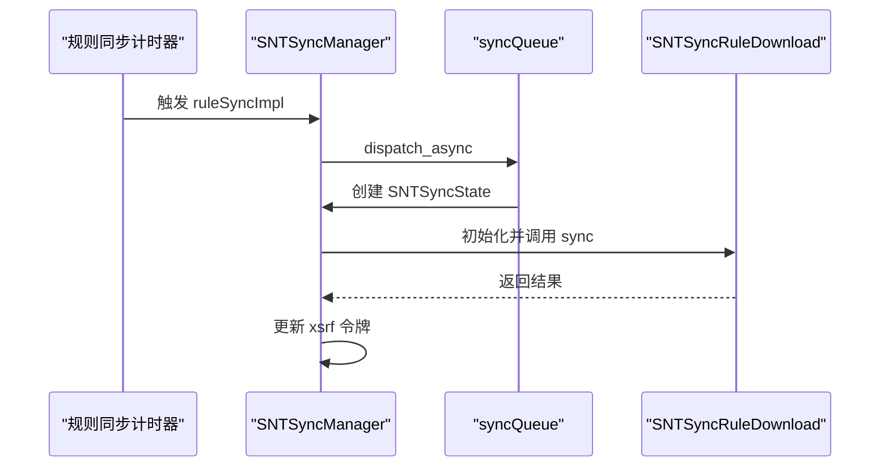
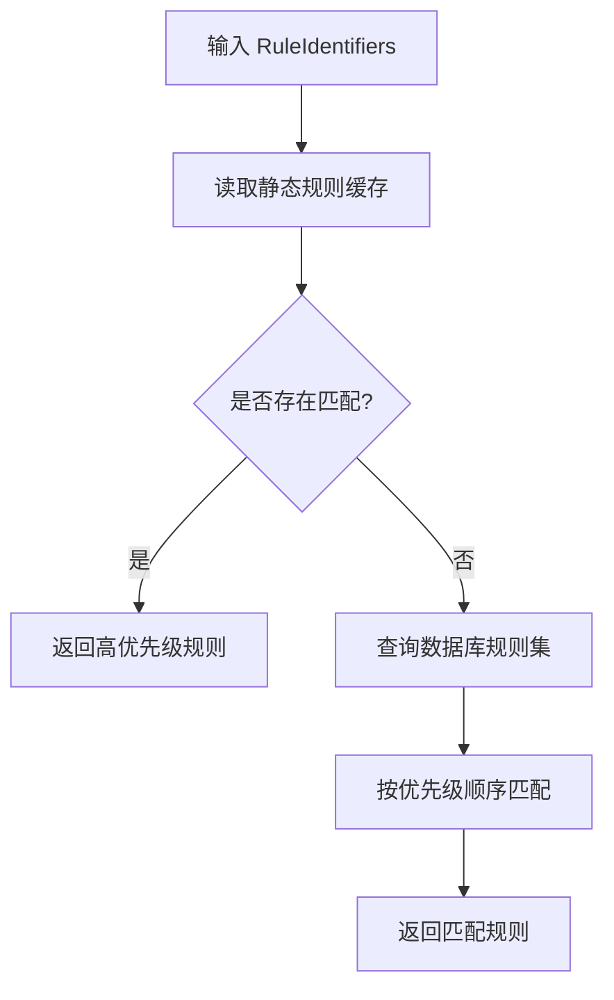
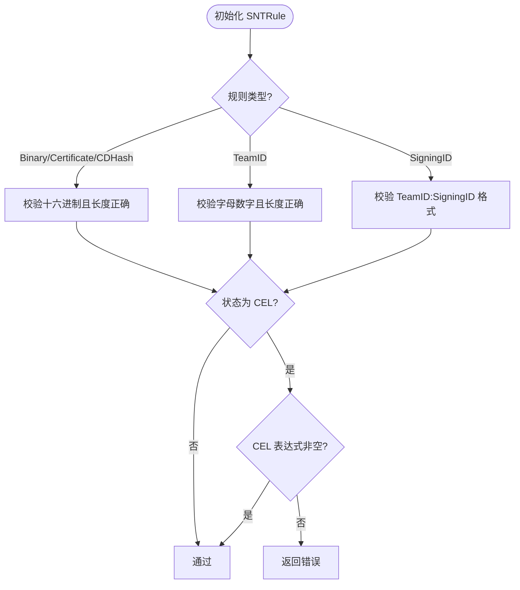
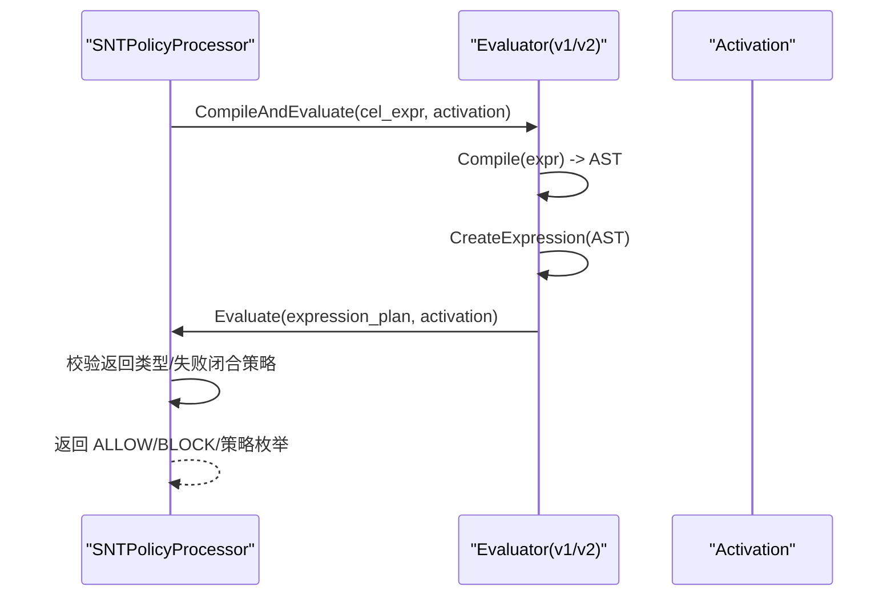
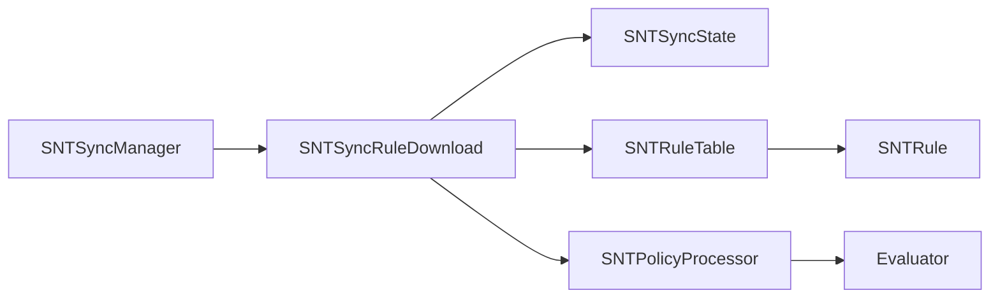

# 规则下载系统

<cite>
**本文引用的文件**
- [SNTSyncRuleDownload.h](file://Source/santasyncservice/SNTSyncRuleDownload.h)
- [SNTSyncRuleDownload.mm](file://Source/santasyncservice/SNTSyncRuleDownload.mm)
- [SNTSyncManager.mm](file://Source/santasyncservice/SNTSyncManager.mm)
- [SNTSyncState.h](file://Source/santasyncservice/SNTSyncState.h)
- [SNTSyncState.mm](file://Source/santasyncservice/SNTSyncState.mm)
- [SNTRuleTable.mm](file://Source/santad/DataLayer/SNTRuleTable.mm)
- [SNTRule.mm](file://Source/common/SNTRule.mm)
- [Evaluator.mm](file://Source/common/cel/Evaluator.mm)
- [SNTPolicyProcessor.mm](file://Source/santad/SNTPolicyProcessor.mm)
- [SNTSyncTest.mm](file://Source/santasyncservice/SNTSyncTest.mm)
- [SNTCommandRule.mm](file://Source/santactl/Commands/SNTCommandRule.mm)
- [SNTMetricSetTest.mm](file://Source/common/SNTMetricSetTest.mm)
- [monarch.json](file://Source/santametricservice/Formats/testdata/json/monarch.json)
</cite>

## 目录
1. [引言](#引言)
2. [项目结构](#项目结构)
3. [核心组件](#核心组件)
4. [架构总览](#架构总览)
5. [详细组件分析](#详细组件分析)
6. [依赖关系分析](#依赖关系分析)
7. [性能考虑](#性能考虑)
8. [故障排除指南](#故障排除指南)
9. [结论](#结论)
10. [附录](#附录)

## 引言
本技术文档围绕 Santa 的“规则下载系统”展开，目标是为规则下载的架构设计、批量处理、增量更新与版本管理、规则解析与验证（含 CEL 表达式）、规则应用的优先级与去重、下载进度跟踪、错误恢复与重试、并发与内存优化以及监控指标与故障排除提供系统化说明。文档以代码为依据，结合流程图与类图，帮助读者从高层到细节全面理解该子系统的实现。

## 项目结构
规则下载系统主要由以下模块构成：
- 同步服务层：负责调度与编排，包括定时器、状态传递与阶段编排。
- 规则下载阶段：负责从服务器拉取规则、分批游标迭代、转换为内部规则对象、调用守护进程写入数据库并通知。
- 守护进程数据层：负责规则入库、静态规则缓存、优先级判定与去重、时间戳维护等。
- 规则模型与校验：负责规则对象初始化、标识符合法性校验、CEL 表达式校验与求值。
- 监控与度量：负责规则数量等指标采集与输出。

图表来源
- [SNTSyncManager.mm](file://Source/santasyncservice/SNTSyncManager.mm#L234-L262)
- [SNTSyncRuleDownload.mm](file://Source/santasyncservice/SNTSyncRuleDownload.mm#L402-L472)
- [SNTSyncState.h](file://Source/santasyncservice/SNTSyncState.h#L1-L116)
- [SNTRuleTable.mm](file://Source/santad/DataLayer/SNTRuleTable.mm#L438-L454)
- [SNTPolicyProcessor.mm](file://Source/santad/SNTPolicyProcessor.mm#L115-L150)
- [SNTRule.mm](file://Source/common/SNTRule.mm#L1-L200)
- [Evaluator.mm](file://Source/common/cel/Evaluator.mm#L1-L190)

章节来源
- [SNTSyncManager.mm](file://Source/santasyncservice/SNTSyncManager.mm#L234-L262)
- [SNTSyncRuleDownload.mm](file://Source/santasyncservice/SNTSyncRuleDownload.mm#L402-L472)
- [SNTSyncState.h](file://Source/santasyncservice/SNTSyncState.h#L1-L116)

## 核心组件
- SNTSyncManager：负责全量/增量同步的调度，串行队列保证规则同步不与全量同步重叠；基于计时器触发规则同步；限制并发同步任务数。
- SNTSyncRuleDownload：规则下载阶段，支持 v1/v2 协议，使用游标分页拉取，转换为 SNTRule/SNTFileAccessRule，调用守护进程写库并记录成功同步设置，最后进行推送通知。
- SNTSyncState：贯穿各阶段的状态容器，承载会话、令牌、机器信息、计数统计、是否 v2 等关键字段。
- SNTRuleTable：规则数据库层，负责优先级判定、去重、静态规则缓存、时间戳更新、过期传播规则清理等。
- SNTRule：规则模型，负责标识符合法性校验、CEL 表达式存在性校验、导出表示等。
- Evaluator：CEL 编译与求值器，支持 v1/v2 上下文变量注册、AST 校验、运行时求值与结果类型检查。
- SNTPolicyProcessor：策略执行器，根据规则状态选择直接决策或通过 CEL 求值，支持失败闭合策略。

章节来源
- [SNTSyncManager.mm](file://Source/santasyncservice/SNTSyncManager.mm#L234-L262)
- [SNTSyncRuleDownload.mm](file://Source/santasyncservice/SNTSyncRuleDownload.mm#L402-L472)
- [SNTSyncState.h](file://Source/santasyncservice/SNTSyncState.h#L1-L116)
- [SNTRuleTable.mm](file://Source/santad/DataLayer/SNTRuleTable.mm#L438-L454)
- [SNTRule.mm](file://Source/common/SNTRule.mm#L1-L200)
- [Evaluator.mm](file://Source/common/cel/Evaluator.mm#L1-L190)
- [SNTPolicyProcessor.mm](file://Source/santad/SNTPolicyProcessor.mm#L115-L150)

## 架构总览
规则下载系统采用“服务端 -> 同步服务 -> 守护进程”的分层架构。同步服务通过定时器驱动规则同步，下载阶段按游标分页拉取规则，转换为内部对象后写入数据库，并在必要时触发推送通知。策略执行阶段在守护进程中根据规则类型（含 CEL）进行决策。

图表来源
- [SNTSyncManager.mm](file://Source/santasyncservice/SNTSyncManager.mm#L234-L262)
- [SNTSyncRuleDownload.mm](file://Source/santasyncservice/SNTSyncRuleDownload.mm#L402-L472)

## 详细组件分析

### 组件A：SNTSyncRuleDownload（规则下载阶段）
职责与流程要点：
- 游标分页：根据响应中的 cursor 循环请求，直到为空，累计接收与处理计数。
- 规则转换：将协议规则转换为 SNTRule 或 SNTFileAccessRule，过滤无效规则。
- 写库与清理：调用守护进程接口写入执行规则与文件访问规则，按同步类型选择清理策略。
- 成功记录与通知：更新同步设置，记录处理计数；对允许解封的二进制/包发送推送通知。
- 超时与错误：写库与设置同步均设置超时，失败时记录日志并返回失败。

图表来源
- [SNTSyncRuleDownload.mm](file://Source/santasyncservice/SNTSyncRuleDownload.mm#L402-L472)

章节来源
- [SNTSyncRuleDownload.mm](file://Source/santasyncservice/SNTSyncRuleDownload.mm#L402-L472)
- [SNTSyncTest.mm](file://Source/santasyncservice/SNTSyncTest.mm#L1020-L1055)

### 组件B：SNTSyncManager（同步调度）
职责与流程要点：
- 计时器：分别维护全量同步与规则同步计时器；规则同步在独立串行队列执行，避免与全量同步重叠。
- 并发控制：使用信号量限制同时排队的同步任务数。
- 状态创建：每次同步前创建 SNTSyncState，传递给后续阶段。
- 失败处理：事件上传失败时启动可达性监听，等待网络恢复后重试。

图表来源
- [SNTSyncManager.mm](file://Source/santasyncservice/SNTSyncManager.mm#L234-L262)

章节来源
- [SNTSyncManager.mm](file://Source/santasyncservice/SNTSyncManager.mm#L234-L262)

### 组件C：SNTRuleTable（规则数据库层）
职责与流程要点：
- 优先级判定：按隐式顺序（例如 cdhash 优先于 binary）在静态规则缓存中查找匹配规则。
- 去重与覆盖：通过数据库查询与时间戳更新实现规则覆盖与去重。
- 传播规则清理：定期清理过期的传递规则，降低数据库膨胀。
- 时间戳维护：重置规则时间戳用于后续策略更新。

图表来源
- [SNTRuleTable.mm](file://Source/santad/DataLayer/SNTRuleTable.mm#L438-L454)

章节来源
- [SNTRuleTable.mm](file://Source/santad/DataLayer/SNTRuleTable.mm#L438-L454)

### 组件D：SNTRule（规则模型与校验）
职责与流程要点：
- 标识符校验：针对不同规则类型（二进制、证书、团队 ID、签名 ID、CDHash）进行长度与字符集校验，并强制大小写规范。
- CEL 表达式校验：当规则状态为 CEL 时，要求必须提供 CEL 表达式。
- 导出表示：提供字典表示，便于导出与调试。

图表来源
- [SNTRule.mm](file://Source/common/SNTRule.mm#L1-L200)

章节来源
- [SNTRule.mm](file://Source/common/SNTRule.mm#L1-L200)

### 组件E：Evaluator 与 SNTPolicyProcessor（CEL 表达式处理）
职责与流程要点：
- Evaluator：构建编译器（标准库、字符串扩展、上下文变量），编译 AST 并生成可执行计划；运行时求值，严格校验返回类型（布尔或策略枚举）。
- SNTPolicyProcessor：根据规则状态选择直接决策或调用 CEL 求值；失败时若配置为“失败闭合”，则阻断未知。

图表来源
- [Evaluator.mm](file://Source/common/cel/Evaluator.mm#L1-L190)
- [SNTPolicyProcessor.mm](file://Source/santad/SNTPolicyProcessor.mm#L115-L150)

章节来源
- [Evaluator.mm](file://Source/common/cel/Evaluator.mm#L1-L190)
- [SNTPolicyProcessor.mm](file://Source/santad/SNTPolicyProcessor.mm#L115-L150)

### 组件F：SNTSyncState（状态容器）
职责与流程要点：
- 会话与连接：保存 NSURLSession、守护进程连接、基础 API URL、XSRF 令牌与头。
- 同步参数：全量/推送同步间隔、机器信息、推送订阅参数、内容编码、是否 v2。
- 计数统计：规则接收/处理计数（执行规则与文件访问规则）。
- 生命周期：析构时失效并取消会话。

章节来源
- [SNTSyncState.h](file://Source/santasyncservice/SNTSyncState.h#L1-L116)
- [SNTSyncState.mm](file://Source/santasyncservice/SNTSyncState.mm#L1-L22)

## 依赖关系分析
- SNTSyncManager 依赖 SNTSyncRuleDownload 与 SNTSyncState，确保串行与并发控制。
- SNTSyncRuleDownload 依赖 SNTSyncState、守护进程接口（写库与设置同步）、推送通知追踪器。
- SNTRuleTable 依赖 SNTRule 与数据库层，负责优先级与去重。
- SNTPolicyProcessor 依赖 Evaluator 与 Activation，负责 CEL 求值与策略决策。
- SNTRule 为通用模型，被下载阶段与策略阶段共同使用。

图表来源
- [SNTSyncManager.mm](file://Source/santasyncservice/SNTSyncManager.mm#L234-L262)
- [SNTSyncRuleDownload.mm](file://Source/santasyncservice/SNTSyncRuleDownload.mm#L402-L472)
- [SNTRuleTable.mm](file://Source/santad/DataLayer/SNTRuleTable.mm#L438-L454)
- [SNTPolicyProcessor.mm](file://Source/santad/SNTPolicyProcessor.mm#L115-L150)
- [SNTRule.mm](file://Source/common/SNTRule.mm#L1-L200)
- [Evaluator.mm](file://Source/common/cel/Evaluator.mm#L1-L190)

章节来源
- [SNTSyncManager.mm](file://Source/santasyncservice/SNTSyncManager.mm#L234-L262)
- [SNTSyncRuleDownload.mm](file://Source/santasyncservice/SNTSyncRuleDownload.mm#L402-L472)
- [SNTRuleTable.mm](file://Source/santad/DataLayer/SNTRuleTable.mm#L438-L454)
- [SNTPolicyProcessor.mm](file://Source/santad/SNTPolicyProcessor.mm#L115-L150)
- [SNTRule.mm](file://Source/common/SNTRule.mm#L1-L200)
- [Evaluator.mm](file://Source/common/cel/Evaluator.mm#L1-L190)

## 性能考虑
- 并发与串行化
  - 规则同步在独立串行队列执行，避免与全量同步重叠，减少锁竞争与资源争用。
  - 使用信号量限制排队的同步任务数，防止瞬时风暴。
- 批量与游标分页
  - 下载阶段采用游标分页，避免单次请求过大；在 autoreleasepool 中循环处理，降低峰值内存占用。
- 写库与清理策略
  - 根据同步类型选择清理策略（无清理/仅非传递/全部清理），平衡增量与一致性。
- 内存管理
  - 使用 Arena 与局部作用域对象，配合 autoreleasepool 控制临时对象生命周期。
- 策略执行优化
  - Evaluator 预构建编译器与表达式计划，减少重复编译开销；CEL 求值返回可缓存标记，利于结果缓存。

章节来源
- [SNTSyncManager.mm](file://Source/santasyncservice/SNTSyncManager.mm#L234-L262)
- [SNTSyncRuleDownload.mm](file://Source/santasyncservice/SNTSyncRuleDownload.mm#L90-L147)
- [Evaluator.mm](file://Source/common/cel/Evaluator.mm#L1-L190)

## 故障排除指南
- 规则下载失败
  - 检查网络与基础 URL 配置；确认 XSRF 令牌与头是否正确设置。
  - 关注写库超时与错误列表，定位守护进程侧问题。
- 事件上传失败
  - 启动可达性监听，等待网络恢复后自动重试。
- CEL 表达式错误
  - 查看编译与求值错误日志；若启用失败闭合，未知将被阻断。
- 规则未生效或优先级异常
  - 检查静态规则缓存与数据库查询顺序；确认时间戳更新与传播规则清理是否触发。
- CLI 与测试验证
  - 使用命令行工具查看添加/移除规则结果；参考单元测试用例验证分页与 CEL 场景。

章节来源
- [SNTSyncManager.mm](file://Source/santasyncservice/SNTSyncManager.mm#L105-L129)
- [SNTSyncRuleDownload.mm](file://Source/santasyncservice/SNTSyncRuleDownload.mm#L420-L472)
- [SNTPolicyProcessor.mm](file://Source/santad/SNTPolicyProcessor.mm#L136-L150)
- [SNTSyncTest.mm](file://Source/santasyncservice/SNTSyncTest.mm#L1020-L1055)
- [SNTCommandRule.mm](file://Source/santactl/Commands/SNTCommandRule.mm#L427-L447)

## 结论
规则下载系统通过清晰的阶段划分与严格的错误处理，实现了稳定高效的规则同步能力。其核心特性包括：
- 游标分页的批量下载与增量更新
- 版本兼容（v1/v2）与清理策略
- 规则解析与验证（含 CEL）
- 应用优先级与去重（静态缓存 + 数据库查询）
- 进度统计与推送通知
- 并发控制与内存优化
- 监控指标采集与输出

这些设计共同保障了在复杂环境下的可靠性与可观测性。

## 附录
- 监控指标示例
  - 规则数量指标（按规则类型分组）与常量指标（如是否使用端点安全框架）可通过度量系统采集与输出。
  - 参考格式样例与测试用例路径如下所示。

章节来源
- [SNTMetricSetTest.mm](file://Source/common/SNTMetricSetTest.mm#L551-L588)
- [monarch.json](file://Source/santametricservice/Formats/testdata/json/monarch.json#L1-L53)