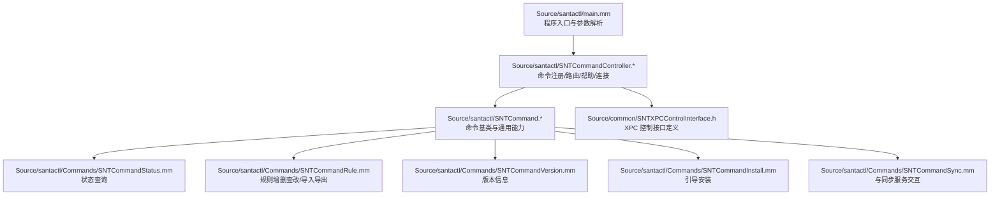
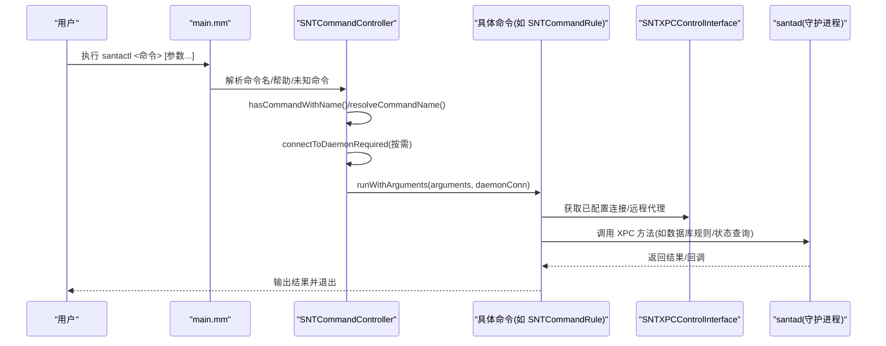
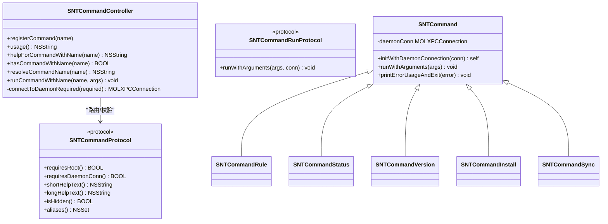
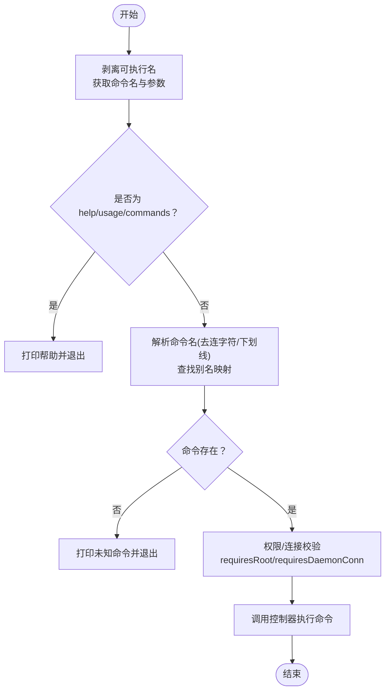
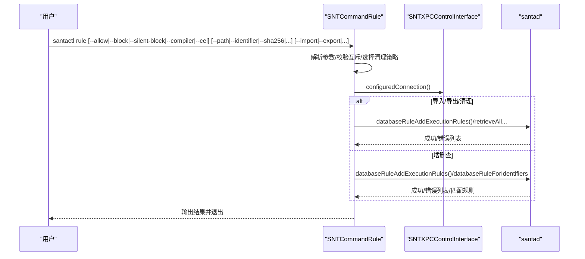
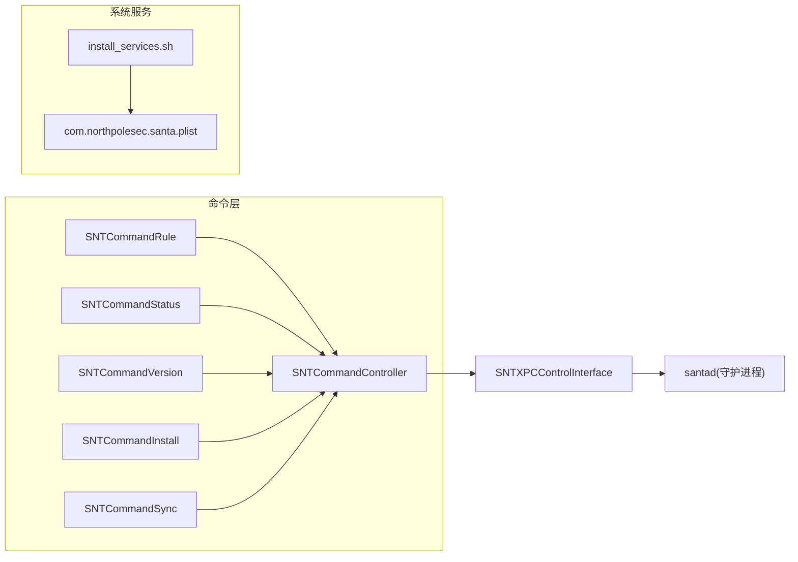

# santactl 概述

<cite>
**本文引用的文件**
- [Source/santactl/main.mm](file://Source/santactl/main.mm)
- [Source/santactl/SNTCommandController.h](file://Source/santactl/SNTCommandController.h)
- [Source/santactl/SNTCommandController.mm](file://Source/santactl/SNTCommandController.mm)
- [Source/santactl/SNTCommand.h](file://Source/santactl/SNTCommand.h)
- [Source/santactl/SNTCommand.mm](file://Source/santactl/SNTCommand.mm)
- [Source/santactl/Commands/SNTCommandRule.mm](file://Source/santactl/Commands/SNTCommandRule.mm)
- [Source/santactl/Commands/SNTCommandStatus.mm](file://Source/santactl/Commands/SNTCommandStatus.mm)
- [Source/santactl/Commands/SNTCommandVersion.mm](file://Source/santactl/Commands/SNTCommandVersion.mm)
- [Source/santactl/Commands/SNTCommandInstall.mm](file://Source/santactl/Commands/SNTCommandInstall.mm)
- [Source/santactl/Commands/SNTCommandSync.mm](file://Source/santactl/Commands/SNTCommandSync.mm)
- [Source/common/SNTXPCControlInterface.h](file://Source/common/SNTXPCControlInterface.h)
- [Conf/install.sh](file://Conf/install.sh)
- [Conf/install_services.sh](file://Conf/install_services.sh)
- [Conf/com.northpolesec.santa.plist](file://Conf/com.northpolesec.santa.plist)
</cite>

## 目录
1. [简介](#简介)
2. [项目结构](#项目结构)
3. [核心组件](#核心组件)
4. [架构总览](#架构总览)
5. [详细组件分析](#详细组件分析)
6. [依赖关系分析](#依赖关系分析)
7. [性能考虑](#性能考虑)
8. [故障排查指南](#故障排查指南)
9. [结论](#结论)
10. [附录：安装与运行环境](#附录安装与运行环境)

## 简介
santactl 是 Santa 系统的命令行管理工具，用于在终端中对 Santa 守护进程（santad）进行状态查询、规则管理、同步控制、版本信息展示以及安装引导等操作。其设计理念是“命令即插拔”，通过统一的命令注册与路由机制，将不同功能封装为独立命令类，既保证了扩展性，也确保了用户交互的一致性。

## 项目结构
santactl 的代码位于 Source/santactl 目录下，采用“主入口 + 命令控制器 + 基础命令基类 + 多个具体命令”的分层组织方式；同时通过 XPC 接口与系统扩展守护进程通信，实现特权操作与状态查询。

图示来源
- [Source/santactl/main.mm](file://Source/santactl/main.mm#L1-L84)
- [Source/santactl/SNTCommandController.mm](file://Source/santactl/SNTCommandController.mm#L1-L159)
- [Source/santactl/SNTCommand.mm](file://Source/santactl/SNTCommand.mm#L1-L47)
- [Source/santactl/Commands/SNTCommandStatus.mm](file://Source/santactl/Commands/SNTCommandStatus.mm#L1-L472)
- [Source/santactl/Commands/SNTCommandRule.mm](file://Source/santactl/Commands/SNTCommandRule.mm#L1-L597)
- [Source/santactl/Commands/SNTCommandVersion.mm](file://Source/santactl/Commands/SNTCommandVersion.mm#L1-L99)
- [Source/santactl/Commands/SNTCommandInstall.mm](file://Source/santactl/Commands/SNTCommandInstall.mm#L1-L81)
- [Source/santactl/Commands/SNTCommandSync.mm](file://Source/santactl/Commands/SNTCommandSync.mm#L1-L119)
- [Source/common/SNTXPCControlInterface.h](file://Source/common/SNTXPCControlInterface.h#L1-L104)

章节来源
- [Source/santactl/main.mm](file://Source/santactl/main.mm#L1-L84)
- [Source/santactl/SNTCommandController.h](file://Source/santactl/SNTCommandController.h#L1-L74)
- [Source/santactl/SNTCommandController.mm](file://Source/santactl/SNTCommandController.mm#L1-L159)
- [Source/santactl/SNTCommand.h](file://Source/santactl/SNTCommand.h#L1-L81)
- [Source/santactl/SNTCommand.mm](file://Source/santactl/SNTCommand.mm#L1-L47)

## 核心组件
- 程序入口与参数解析：负责剥离可执行名、打印帮助、识别命令并调用控制器执行。
- 命令控制器：维护命令注册表、别名映射、生成帮助、解析命令名、决定是否需要守护进程连接及权限校验，并启动对应命令。
- 命令基类：提供统一的初始化、参数转发、错误输出与退出策略，以及与守护进程的连接持有。
- 具体命令：如 status、rule、version、install、sync 等，各自实现协议方法与业务逻辑。
- XPC 控制接口：定义与守护进程通信的协议与连接配置，支持特权操作与状态查询。

章节来源
- [Source/santactl/main.mm](file://Source/santactl/main.mm#L1-L84)
- [Source/santactl/SNTCommandController.h](file://Source/santactl/SNTCommandController.h#L1-L74)
- [Source/santactl/SNTCommandController.mm](file://Source/santactl/SNTCommandController.mm#L1-L159)
- [Source/santactl/SNTCommand.h](file://Source/santactl/SNTCommand.h#L1-L81)
- [Source/santactl/SNTCommand.mm](file://Source/santactl/SNTCommand.mm#L1-L47)
- [Source/common/SNTXPCControlInterface.h](file://Source/common/SNTXPCControlInterface.h#L1-L104)

## 架构总览
santactl 采用“命令控制器 + 命令基类 + 具体命令 + XPC 通信”的分层架构。命令通过 +load 钩子自动注册到控制器，控制器根据命令需求决定是否需要守护进程连接与 root 权限，并在命令内部完成与守护进程或同步服务的交互。

图示来源
- [Source/santactl/main.mm](file://Source/santactl/main.mm#L1-L84)
- [Source/santactl/SNTCommandController.mm](file://Source/santactl/SNTCommandController.mm#L114-L156)
- [Source/santactl/SNTCommand.mm](file://Source/santactl/SNTCommand.mm#L19-L47)
- [Source/common/SNTXPCControlInterface.h](file://Source/common/SNTXPCControlInterface.h#L79-L104)
- [Source/santactl/Commands/SNTCommandRule.mm](file://Source/santactl/Commands/SNTCommandRule.mm#L125-L447)
- [Source/santactl/Commands/SNTCommandStatus.mm](file://Source/santactl/Commands/SNTCommandStatus.mm#L85-L178)

## 详细组件分析

### 命令控制器设计与实现
- 命令注册：每个命令类在 +load 中通过宏将自身注册到控制器，支持别名注册与重复别名检测。
- 命令路由：根据输入的第一个参数解析真实命令名（去除连字符与下划线），并检查是否存在。
- 权限与连接：按命令声明的 requiresRoot 与 requiresDaemonConn 决定是否需要 root 权限与 XPC 连接；连接失败时提供清晰的错误提示。
- 执行控制：构造命令实例并调用 runWithArguments，随后启动主运行循环等待异步回调完成。

图示来源
- [Source/santactl/SNTCommandController.h](file://Source/santactl/SNTCommandController.h#L1-L74)
- [Source/santactl/SNTCommandController.mm](file://Source/santactl/SNTCommandController.mm#L1-L159)
- [Source/santactl/SNTCommand.h](file://Source/santactl/SNTCommand.h#L1-L81)
- [Source/santactl/SNTCommand.mm](file://Source/santactl/SNTCommand.mm#L1-L47)
- [Source/santactl/Commands/SNTCommandRule.mm](file://Source/santactl/Commands/SNTCommandRule.mm#L35-L60)
- [Source/santactl/Commands/SNTCommandStatus.mm](file://Source/santactl/Commands/SNTCommandStatus.mm#L61-L84)
- [Source/santactl/Commands/SNTCommandVersion.mm](file://Source/santactl/Commands/SNTCommandVersion.mm#L25-L48)
- [Source/santactl/Commands/SNTCommandInstall.mm](file://Source/santactl/Commands/SNTCommandInstall.mm#L23-L49)
- [Source/santactl/Commands/SNTCommandSync.mm](file://Source/santactl/Commands/SNTCommandSync.mm#L27-L59)

章节来源
- [Source/santactl/SNTCommandController.h](file://Source/santactl/SNTCommandController.h#L1-L74)
- [Source/santactl/SNTCommandController.mm](file://Source/santactl/SNTCommandController.mm#L1-L159)
- [Source/santactl/SNTCommand.h](file://Source/santactl/SNTCommand.h#L1-L81)
- [Source/santactl/SNTCommand.mm](file://Source/santactl/SNTCommand.mm#L1-L47)

### 参数解析与执行控制流程
- 参数剥离：移除 argv[0] 后，第一个参数作为命令名，其余为该命令的参数数组。
- 帮助与未知命令：若命令名为 usage/commands 或 help/-h/--help，则打印帮助；否则校验命令是否存在。
- 权限与连接：若命令声明需要 root 或守护进程连接，则在执行前进行校验与连接建立。
- 异步执行：命令完成后由命令自身负责退出，控制器启动主运行循环等待异步回调。

图示来源
- [Source/santactl/main.mm](file://Source/santactl/main.mm#L27-L83)
- [Source/santactl/SNTCommandController.mm](file://Source/santactl/SNTCommandController.mm#L130-L156)

章节来源
- [Source/santactl/main.mm](file://Source/santactl/main.mm#L1-L84)
- [Source/santactl/SNTCommandController.mm](file://Source/santactl/SNTCommandController.mm#L114-L156)

### 命令：规则管理（rule）
- 功能要点：添加/删除/静默阻止/编译器允许/CEL 规则；基于路径/标识符（SHA-256、Team ID、Signing ID、CDHash、证书 SHA-256）进行规则增删查；支持导入/导出执行规则与文件访问规则；支持清理非传递/全部规则。
- 参数解析：通过遍历参数设置状态、类型、消息、注释、清理策略、导入/导出路径等；对互斥选项进行严格校验。
- 与守护进程交互：通过 XPC 远程代理提交规则变更、查询规则状态、导出规则到 JSON/Plist 文件；对返回的错误进行聚合输出。
- 安全限制：当启用中心化同步或静态规则时，禁止手动修改规则（调试构建除外）。

图示来源
- [Source/santactl/Commands/SNTCommandRule.mm](file://Source/santactl/Commands/SNTCommandRule.mm#L125-L447)
- [Source/common/SNTXPCControlInterface.h](file://Source/common/SNTXPCControlInterface.h#L38-L77)

章节来源
- [Source/santactl/Commands/SNTCommandRule.mm](file://Source/santactl/Commands/SNTCommandRule.mm#L1-L597)

### 命令：状态查询（status）
- 功能要点：输出守护进程模式、事件日志类型、USB 阻断状态、缓存计数、规则类型统计、Watch Items 状态、同步状态（服务器地址、上次成功时间、推送通知状态）、指标导出配置等；支持 --json 输出。
- 数据来源：通过同步远程代理一次性收集多类指标，避免多次往返；对超时场景（如推送通知探测）采用信号量与定时器保护。
- 输出格式：默认表格与 JSON 两种格式，便于自动化集成。

章节来源
- [Source/santactl/Commands/SNTCommandStatus.mm](file://Source/santactl/Commands/SNTCommandStatus.mm#L1-L472)

### 命令：版本信息（version）
- 功能要点：显示 santad、santactl、SantaGUI 的版本信息，包含产品版本、构建号与提交哈希摘要；支持 --json 输出。
- 实现要点：从 Info.plist 中读取版本元数据，组合为统一格式字符串。

章节来源
- [Source/santactl/Commands/SNTCommandVersion.mm](file://Source/santactl/Commands/SNTCommandVersion.mm#L1-L99)

### 命令：安装引导（install）
- 功能要点：请求守护进程从指定路径安装 Santa.app；带超时等待；隐藏命令，仅在升级场景使用。
- 实现要点：通过 XPC 远程代理调用 installSantaApp，等待结果或超时后退出。

章节来源
- [Source/santactl/Commands/SNTCommandInstall.mm](file://Source/santactl/Commands/SNTCommandInstall.mm#L1-L81)

### 命令：同步控制（sync）
- 功能要点：与同步服务通信，触发正常/清理同步；支持 --clean/--clean-all；支持 --debug 输出详细日志。
- 实现要点：降权执行，直接连接同步服务；通过匿名监听接收日志流并按级别输出；等待同步完成并返回状态码。

章节来源
- [Source/santactl/Commands/SNTCommandSync.mm](file://Source/santactl/Commands/SNTCommandSync.mm#L1-L119)

## 依赖关系分析
- 命令到控制器：所有命令类通过 +load 自动注册，控制器集中管理命令生命周期与帮助文本。
- 控制器到 XPC：控制器负责建立与守护进程的 XPC 连接，命令仅消费连接对象。
- 命令到守护进程：通过 SNTDaemonControlXPC 协议进行规则、事件、配置、控制等操作。
- 安装脚本与服务：安装脚本负责系统扩展加载与服务安装；服务清单由 launchd 管理。

图示来源
- [Source/santactl/SNTCommandController.mm](file://Source/santactl/SNTCommandController.mm#L114-L156)
- [Source/common/SNTXPCControlInterface.h](file://Source/common/SNTXPCControlInterface.h#L79-L104)
- [Conf/com.northpolesec.santa.plist](file://Conf/com.northpolesec.santa.plist#L1-L22)
- [Conf/install_services.sh](file://Conf/install_services.sh#L1-L64)

章节来源
- [Source/santactl/SNTCommandController.mm](file://Source/santactl/SNTCommandController.mm#L1-L159)
- [Source/common/SNTXPCControlInterface.h](file://Source/common/SNTXPCControlInterface.h#L1-L104)
- [Conf/com.northpolesec.santa.plist](file://Conf/com.northpolesec.santa.plist#L1-L22)
- [Conf/install_services.sh](file://Conf/install_services.sh#L1-L64)

## 性能考虑
- 异步回调与主运行循环：命令执行期间通过 XPC 异步调用守护进程，控制器启动主运行循环等待回调，避免阻塞。
- 批量操作：规则导入/导出与清理通过一次 RPC 完成，减少往返次数。
- 超时与保护：状态查询中的网络探测设置超时，防止长时间阻塞；同步命令使用信号量与定时器保障响应性。
- 输出格式：默认表格便于人类阅读，--json 便于自动化处理，降低二次解析成本。

## 故障排查指南
- 无法连接守护进程：控制器在连接失效时会打印明确的错误提示，建议检查守护进程是否运行以及是否授予磁盘访问权限。
- 权限不足：当命令声明 requiresRoot 且当前非 root 用户时，会提示需要 root 权限并退出。
- 未知命令：检查命令拼写或使用 help/usage 查看可用命令列表。
- 同步失败：检查 SyncBaseURL 配置与网络连通性；必要时使用 --debug 获取详细日志。
- 版本不一致：使用 version 命令核对各组件版本，确认升级是否生效。

章节来源
- [Source/santactl/SNTCommandController.mm](file://Source/santactl/SNTCommandController.mm#L114-L128)
- [Source/santactl/Commands/SNTCommandSync.mm](file://Source/santactl/Commands/SNTCommandSync.mm#L60-L107)
- [Source/santactl/Commands/SNTCommandVersion.mm](file://Source/santactl/Commands/SNTCommandVersion.mm#L49-L68)

## 结论
santactl 通过清晰的命令注册与路由机制、严格的权限与连接校验、以及与守护进程稳定的 XPC 通信，实现了对 Santa 系统的高效管理。其模块化设计便于扩展新命令，同时为运维与自动化提供了友好的接口与输出格式。

## 附录：安装与运行环境
- 安装位置
  - 可执行文件：/Applications/Santa.app/Contents/MacOS/santactl
  - 守护进程：/Applications/Santa.app/Contents/MacOS/Santa
  - GUI 应用：/Applications/Santa.app
- 权限要求
  - 多数命令无需 root；部分命令（如规则修改、安装引导）声明需要 root。
  - 与守护进程通信需具备 Full Disk Access 权限。
- 运行环境配置
  - 服务安装：使用 install_services.sh 安装并加载 LaunchDaemon/LaunchAgent。
  - 系统扩展：首次运行或更新后需加载系统扩展。
  - 升级流程：使用 install.sh 引导升级，必要时在 Lockdown 模式下放行相关签名 ID。

章节来源
- [Conf/install.sh](file://Conf/install.sh#L1-L68)
- [Conf/install_services.sh](file://Conf/install_services.sh#L1-L64)
- [Conf/com.northpolesec.santa.plist](file://Conf/com.northpolesec.santa.plist#L1-L22)
- [Source/santactl/Commands/SNTCommandInstall.mm](file://Source/santactl/Commands/SNTCommandInstall.mm#L50-L81)