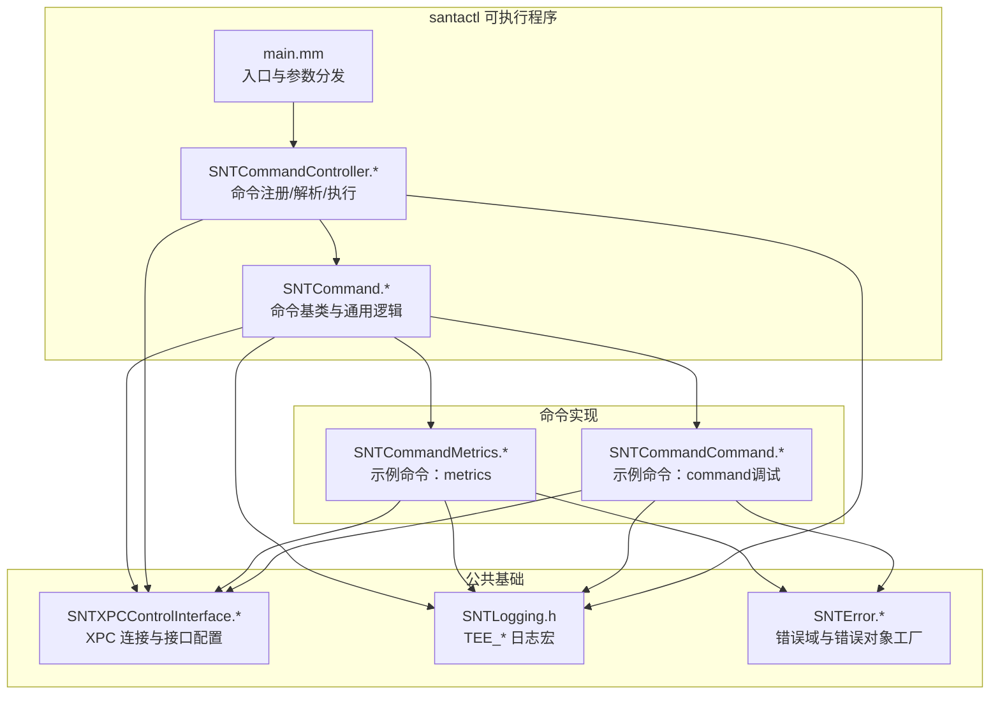
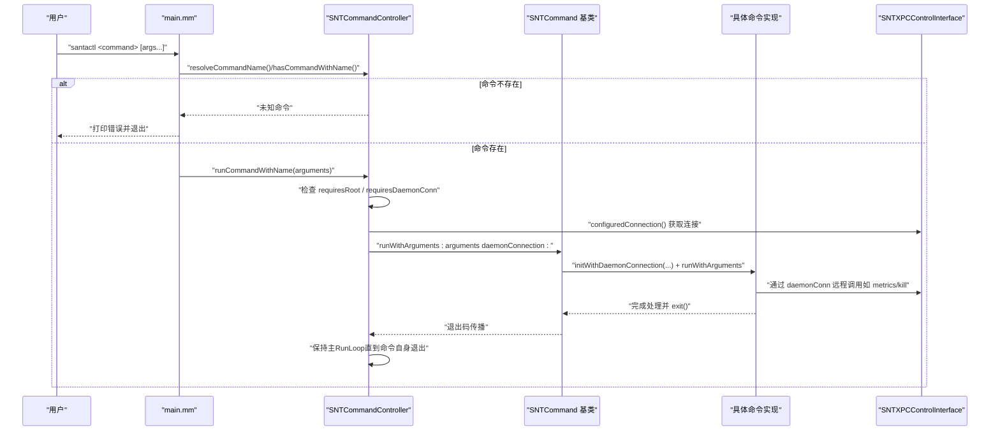
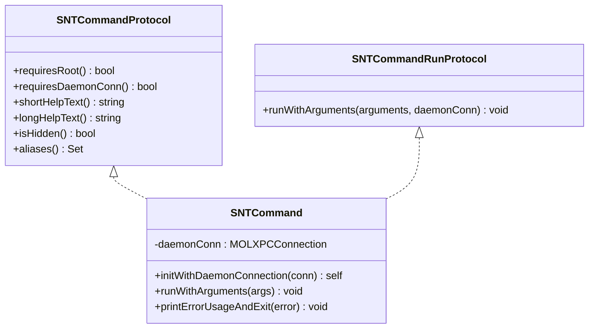
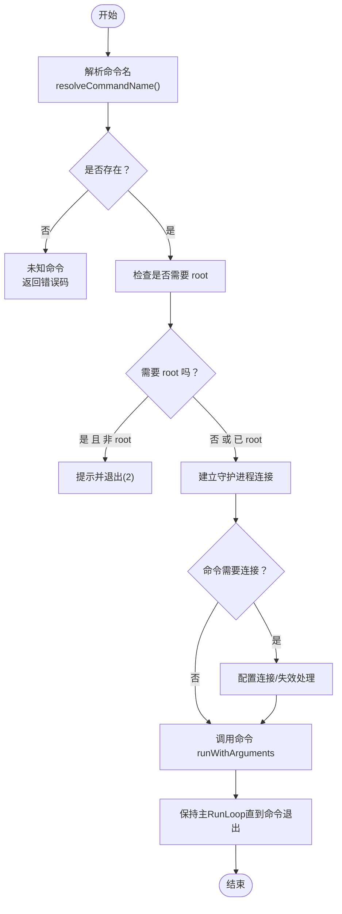
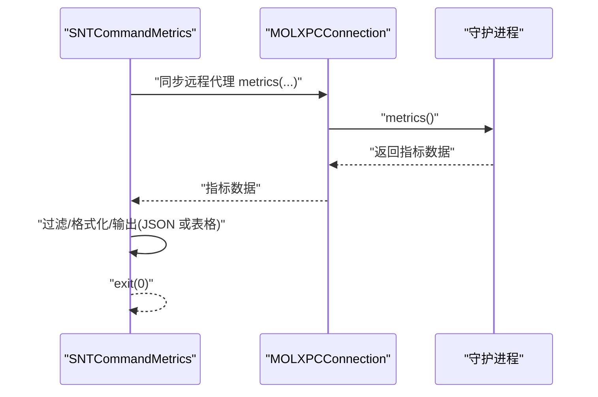
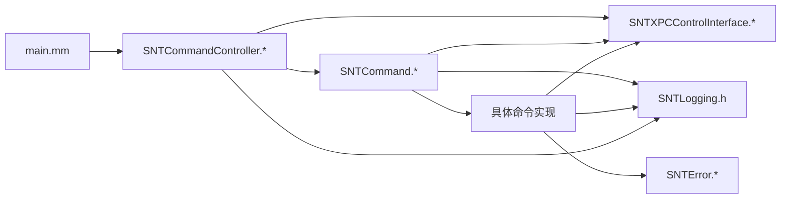

# 命令执行框架

<cite>
**本文引用的文件**
- [SNTCommand.h](file://Source/santactl/SNTCommand.h)
- [SNTCommand.mm](file://Source/santactl/SNTCommand.mm)
- [SNTCommandController.h](file://Source/santactl/SNTCommandController.h)
- [SNTCommandController.mm](file://Source/santactl/SNTCommandController.mm)
- [main.mm](file://Source/santactl/main.mm)
- [SNTCommandMetrics.h](file://Source/santactl/Commands/SNTCommandMetrics.h)
- [SNTCommandMetrics.mm](file://Source/santactl/Commands/SNTCommandMetrics.mm)
- [SNTCommandCommand.mm](file://Source/santactl/Commands/SNTCommandCommand.mm)
- [SNTXPCControlInterface.h](file://Source/common/SNTXPCControlInterface.h)
- [SNTXPCControlInterface.mm](file://Source/common/SNTXPCControlInterface.mm)
- [SNTLogging.h](file://Source/common/SNTLogging.h)
- [SNTError.h](file://Source/common/SNTError.h)
- [SNTError.mm](file://Source/common/SNTError.mm)
</cite>

## 目录
1. [简介](#简介)
2. [项目结构](#项目结构)
3. [核心组件](#核心组件)
4. [架构总览](#架构总览)
5. [详细组件分析](#详细组件分析)
6. [依赖关系分析](#依赖关系分析)
7. [性能考量](#性能考量)
8. [故障排查指南](#故障排查指南)
9. [结论](#结论)
10. [附录：自定义命令开发指南与最佳实践](#附录自定义命令开发指南与最佳实践)

## 简介
本技术文档系统性阐述 Santa 项目中命令执行框架的设计与实现，重点覆盖以下方面：
- SNTCommand 基类的设计模式与抽象接口：命令生命周期、参数校验与执行流程。
- SNTCommandController 的命令注册机制、动态发现与实例化过程。
- 命令执行的上下文管理（XPC 连接）、错误处理与结果返回机制。
- 命令参数解析规则、类型转换与默认值处理策略。
- 自定义命令开发指南与最佳实践。
- 调试方法与性能监控技巧。

该框架通过协议驱动与宏注册的方式，实现了命令的自动发现与统一调度；通过 XPC 与守护进程交互，确保命令在需要时具备必要的权限与上下文。

## 项目结构
命令执行框架位于 santactl 子模块中，围绕 SNTCommand 与 SNTCommandController 展开，并通过 SNTXPCControlInterface 与守护进程建立连接。命令实现位于 Commands 目录下，每个命令均通过宏进行注册，从而被控制器统一管理。

图表来源
- [main.mm](file://Source/santactl/main.mm#L1-L84)
- [SNTCommandController.mm](file://Source/santactl/SNTCommandController.mm#L1-L159)
- [SNTCommand.mm](file://Source/santactl/SNTCommand.mm#L1-L47)
- [SNTCommandMetrics.mm](file://Source/santactl/Commands/SNTCommandMetrics.mm#L1-L182)
- [SNTCommandCommand.mm](file://Source/santactl/Commands/SNTCommandCommand.mm#L1-L197)
- [SNTXPCControlInterface.mm](file://Source/common/SNTXPCControlInterface.mm#L1-L97)
- [SNTLogging.h](file://Source/common/SNTLogging.h#L1-L68)
- [SNTError.h](file://Source/common/SNTError.h#L1-L93)

章节来源
- [main.mm](file://Source/santactl/main.mm#L1-L84)
- [SNTCommandController.h](file://Source/santactl/SNTCommandController.h#L1-L74)
- [SNTCommand.h](file://Source/santactl/SNTCommand.h#L1-L81)

## 核心组件
- SNTCommand 协议族与基类
  - SNTCommandProtocol：声明命令元信息与可选能力（是否需要 root、是否需要守护进程连接、简短/详细帮助文本、别名、隐藏标记等）。
  - SNTCommandRunProtocol：声明运行接口 runWithArguments:daemonConnection:，由控制器统一调用。
  - SNTCommand 基类：封装 XPC 连接注入、默认 runWithArguments: 抛出未识别选择器异常、统一错误输出与退出流程。
- SNTCommandController 控制器
  - 静态注册表：维护命令名到类的映射，以及别名到真实命令名的映射。
  - 动态发现：通过 +load 宏注册命令，无需手动初始化。
  - 执行编排：根据命令需求决定是否需要 root 与守护进程连接，建立 XPC 连接，调用命令 run 方法，并维持主运行循环。
- 入口 main
  - 解析用户输入，支持 help/usage/commands 等内置行为，委派给控制器生成帮助或执行具体命令。

章节来源
- [SNTCommand.h](file://Source/santactl/SNTCommand.h#L1-L81)
- [SNTCommand.mm](file://Source/santactl/SNTCommand.mm#L1-L47)
- [SNTCommandController.h](file://Source/santactl/SNTCommandController.h#L1-L74)
- [SNTCommandController.mm](file://Source/santactl/SNTCommandController.mm#L1-L159)
- [main.mm](file://Source/santactl/main.mm#L1-L84)

## 架构总览
下图展示了从命令行到具体命令执行的端到端流程，包括参数解析、命令发现、上下文准备与执行。

图表来源
- [main.mm](file://Source/santactl/main.mm#L1-L84)
- [SNTCommandController.mm](file://Source/santactl/SNTCommandController.mm#L114-L156)
- [SNTCommand.mm](file://Source/santactl/SNTCommand.mm#L21-L44)
- [SNTXPCControlInterface.mm](file://Source/common/SNTXPCControlInterface.mm#L89-L96)

## 详细组件分析

### SNTCommand 基类与协议
- 设计要点
  - 协议分离：元信息与运行职责分离，便于静态分析与动态发现。
  - 统一入口：控制器仅依赖协议接口，不关心具体实现细节。
  - 上下文注入：通过构造函数注入 MOLXPCConnection，避免命令内部重复建立连接。
  - 错误与退出：提供 printErrorUsageAndExit:，统一错误输出与使用说明提示。
- 生命周期
  - 初始化：保存 daemonConn。
  - 执行：子类必须重写 runWithArguments:；基类默认实现会抛出未识别选择器，用于强制子类实现。
  - 结束：命令自行负责调用 exit()，控制器随后进入主运行循环等待命令退出。

图表来源
- [SNTCommand.h](file://Source/santactl/SNTCommand.h#L20-L81)
- [SNTCommand.mm](file://Source/santactl/SNTCommand.mm#L21-L44)

章节来源
- [SNTCommand.h](file://Source/santactl/SNTCommand.h#L20-L81)
- [SNTCommand.mm](file://Source/santactl/SNTCommand.mm#L21-L44)

### SNTCommandController：注册、解析与执行
- 注册机制
  - 使用静态字典维护命令名到类的映射；若命令声明了 aliases，则建立别名到真实命令名的映射，并对重复别名进行严格校验。
  - 通过 REGISTER_COMMAND_NAME 宏在 +load 中自动注册，实现零样板代码的动态发现。
- 命令解析
  - 支持去除连字符与下划线的规范化；通过 resolveCommandName 将别名映射回真实命令名。
- 执行编排
  - 权限检查：若命令 requiresRoot 且当前非 root，直接提示并退出。
  - 连接管理：按需建立守护进程连接；若需要连接且失败，invalidationHandler 会打印故障排除指引并退出。
  - 执行：调用命令 runWithArguments:daemonConnection:，随后启动主运行循环，等待命令自身退出。

图表来源
- [SNTCommandController.mm](file://Source/santactl/SNTCommandController.mm#L130-L156)
- [SNTCommandController.mm](file://Source/santactl/SNTCommandController.mm#L114-L128)

章节来源
- [SNTCommandController.h](file://Source/santactl/SNTCommandController.h#L1-L74)
- [SNTCommandController.mm](file://Source/santactl/SNTCommandController.mm#L1-L159)

### 命令执行上下文管理与结果返回
- 上下文管理
  - XPC 连接：通过 SNTXPCControlInterface 提供的 configuredConnection 获取已配置的特权连接，设置 remoteInterface 并 resume。
  - 连接失效：当 requiresDaemonConn 为真时，连接失效会打印故障排除指引并退出，避免静默失败。
- 结果返回
  - 命令自行负责 exit()，控制器不接管退出码；命令可通过标准输出打印结果，错误通过 TEE_LOGE 输出到系统日志与 stderr。
  - 对于异步操作（如远程调用），命令应等待响应并在完成后退出。

章节来源
- [SNTXPCControlInterface.h](file://Source/common/SNTXPCControlInterface.h#L79-L104)
- [SNTXPCControlInterface.mm](file://Source/common/SNTXPCControlInterface.mm#L82-L96)
- [SNTCommandController.mm](file://Source/santactl/SNTCommandController.mm#L114-L128)
- [SNTCommand.mm](file://Source/santactl/SNTCommand.mm#L39-L44)

### 参数解析、类型转换与默认值处理
- 参数解析规则
  - 入口 main 会剥离 argv[0]，将第一个剩余参数作为命令名，支持 help/-h/--help 等内置帮助行为。
  - 命令内部的参数解析由各命令自行实现；例如 SNTCommandCommand 对子操作（如 kill）与选项（如 --process/--cdhash/--signingid/--teamid）进行解析。
- 类型转换
  - 数值型参数（如 pid/pidversion）在解析时进行整型转换；字符串参数按原样传递。
- 默认值处理
  - 框架未提供全局默认值机制；各命令应在自身 runWithArguments: 中显式处理默认值与必填项校验。

章节来源
- [main.mm](file://Source/santactl/main.mm#L39-L84)
- [SNTCommandCommand.mm](file://Source/santactl/Commands/SNTCommandCommand.mm#L63-L149)

### 示例命令：metrics 与 command
- SNTCommandMetrics
  - 元信息：requiresRoot=NO，requiresDaemonConn=YES，提供简短与详细帮助文本。
  - 执行流程：通过 daemonConn 的同步代理获取指标数据，支持过滤前缀与 JSON 导出，最后 exit(0)。
- SNTCommandCommand（调试）
  - 元信息：requiresRoot=YES，requiresDaemonConn=YES，仅在调试构建启用。
  - 执行流程：解析子操作（如 kill），构造请求对象，通过 XPC 远程调用守护进程，等待响应并打印统计与错误信息后退出。

图表来源
- [SNTCommandMetrics.mm](file://Source/santactl/Commands/SNTCommandMetrics.mm#L168-L179)
- [SNTXPCControlInterface.h](file://Source/common/SNTXPCControlInterface.h#L69-L71)

章节来源
- [SNTCommandMetrics.h](file://Source/santactl/Commands/SNTCommandMetrics.h#L1-L22)
- [SNTCommandMetrics.mm](file://Source/santactl/Commands/SNTCommandMetrics.mm#L1-L182)
- [SNTCommandCommand.mm](file://Source/santactl/Commands/SNTCommandCommand.mm#L1-L197)

## 依赖关系分析
- 组件耦合
  - SNTCommandController 与 SNTCommand 基类之间通过协议解耦；命令实现仅依赖基类与协议，不依赖控制器。
  - 命令与守护进程交互通过 SNTXPCControlInterface 抽象，避免直接耦合到底层 XPC 实现。
- 外部依赖
  - Foundation、os_log、MOLXPCConnection、SNTXPCControlInterface。
- 循环依赖
  - 未见循环依赖迹象；注册通过 +load 宏在编译期注入，避免运行时循环。

图表来源
- [main.mm](file://Source/santactl/main.mm#L1-L84)
- [SNTCommandController.mm](file://Source/santactl/SNTCommandController.mm#L1-L159)
- [SNTCommand.mm](file://Source/santactl/SNTCommand.mm#L1-L47)
- [SNTXPCControlInterface.mm](file://Source/common/SNTXPCControlInterface.mm#L1-L97)
- [SNTLogging.h](file://Source/common/SNTLogging.h#L1-L68)
- [SNTError.h](file://Source/common/SNTError.h#L1-L93)

章节来源
- [SNTCommandController.mm](file://Source/santactl/SNTCommandController.mm#L1-L159)
- [SNTXPCControlInterface.mm](file://Source/common/SNTXPCControlInterface.mm#L1-L97)

## 性能考量
- 连接复用
  - 通过 SNTXPCControlInterface 提供的单例式连接配置，减少重复初始化成本。
- 异步/同步调用
  - 命令内部应尽量采用异步回调以避免阻塞主线程；必要时使用同步代理时注意超时控制与退出路径。
- 输出与日志
  - 使用 TEE_LOG* 将关键信息同时写入系统日志与终端，便于审计与快速定位问题。
- 主运行循环
  - 控制器在命令执行期间维持主RunLoop，确保事件循环正常工作；命令应尽快完成并退出，避免长时间占用。

[本节为通用指导，不直接分析具体文件]

## 故障排查指南
- 无法连接守护进程
  - 现象：连接失效或无响应。
  - 排查：检查守护进程是否运行、Full Disk Access 权限是否授予；查看 invalidationHandler 提示的故障排除链接。
- 权限不足
  - 现象：提示需要 root。
  - 排查：确认命令 requiresRoot=true 且当前以 root 运行。
- 未知命令
  - 现象：打印未知命令并退出。
  - 排查：确认命令名大小写、连字符/下划线规范化；使用 help/usage 查看可用命令列表。
- 参数错误
  - 现象：printErrorUsageAndExit 输出错误并显示长帮助文本。
  - 排查：核对命令要求的参数与选项，参考 longHelpText。
- 错误日志
  - 使用 TEE_LOGE 输出错误信息；结合系统日志工具定位问题。

章节来源
- [SNTCommandController.mm](file://Source/santactl/SNTCommandController.mm#L114-L128)
- [SNTCommand.mm](file://Source/santactl/SNTCommand.mm#L39-L44)
- [SNTLogging.h](file://Source/common/SNTLogging.h#L1-L68)

## 结论
该命令执行框架通过协议与基类抽象、宏驱动的动态注册、严格的上下文管理与清晰的错误处理，实现了可扩展、易维护的命令体系。命令实现只需关注自身业务逻辑与参数解析，其余由控制器与基类统一处理。配合 XPC 与日志/错误工具，开发者可以快速构建高质量的命令行工具。

[本节为总结，不直接分析具体文件]

## 附录：自定义命令开发指南与最佳实践
- 开发步骤
  - 新建类继承 SNTCommand，并实现 SNTCommandProtocol。
  - 在实现文件顶部添加 REGISTER_COMMAND_NAME(@”your-command-name”) 宏，确保命令自动注册。
  - 实现 shortHelpText/longHelpText/isHidden/aliases（可选）。
  - 实现 runWithArguments:，在其中完成参数解析、必要校验、XPC 调用与结果输出，并最终调用 exit()。
- 最佳实践
  - 明确 requiresRoot 与 requiresDaemonConn，避免不必要的权限与连接。
  - 使用 TEE_LOGI/TEE_LOGE 输出信息与错误，保证日志一致性。
  - 对外部依赖（如守护进程）增加超时与重试策略，提升鲁棒性。
  - 提供详尽的 longHelpText 与 aliases，改善用户体验。
  - 对数值型参数进行边界检查与类型转换校验，防止崩溃。
  - 将复杂逻辑拆分为私有方法，保持 runWithArguments: 清晰可读。
- 调试与性能
  - 使用调试构建运行命令，结合日志与断点定位问题。
  - 关注 XPC 调用耗时，必要时引入并发与缓存。
  - 使用 exit() 返回明确状态码，便于上层脚本判断。

章节来源
- [SNTCommand.h](file://Source/santactl/SNTCommand.h#L20-L81)
- [SNTCommand.mm](file://Source/santactl/SNTCommand.mm#L21-L44)
- [SNTCommandController.h](file://Source/santactl/SNTCommandController.h#L66-L74)
- [SNTCommandMetrics.mm](file://Source/santactl/Commands/SNTCommandMetrics.mm#L168-L179)
- [SNTCommandCommand.mm](file://Source/santactl/Commands/SNTCommandCommand.mm#L63-L191)
- [SNTLogging.h](file://Source/common/SNTLogging.h#L1-L68)
- [SNTError.h](file://Source/common/SNTError.h#L1-L93)
- [SNTError.mm](file://Source/common/SNTError.mm#L1-L102)