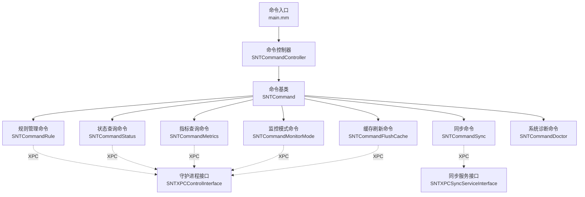
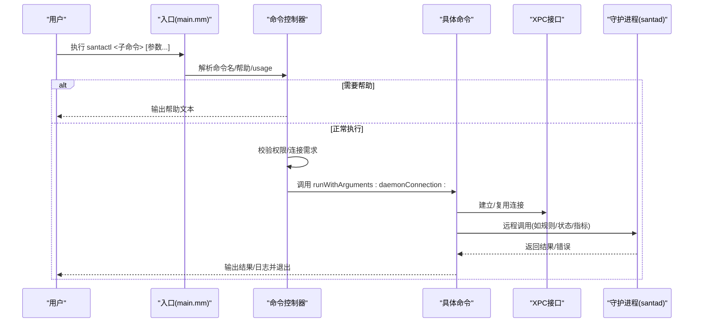
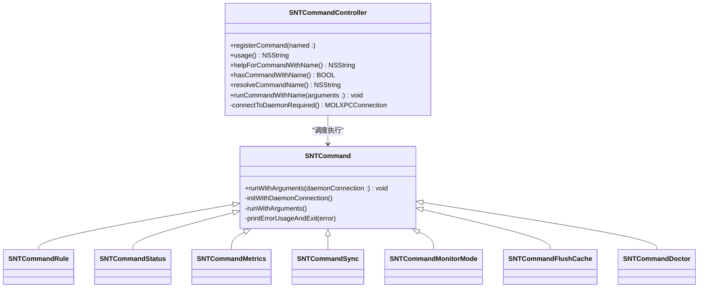
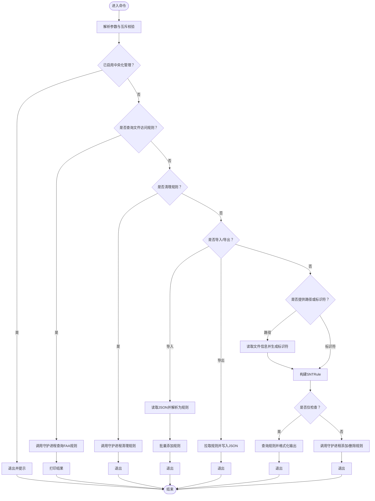
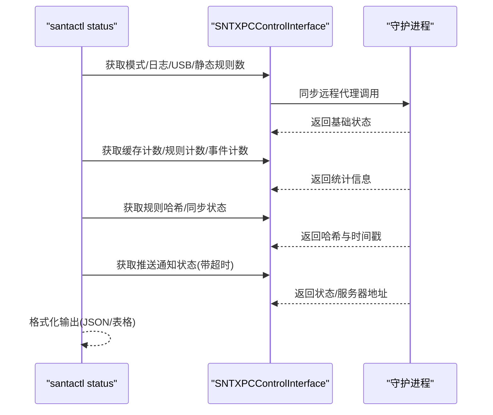
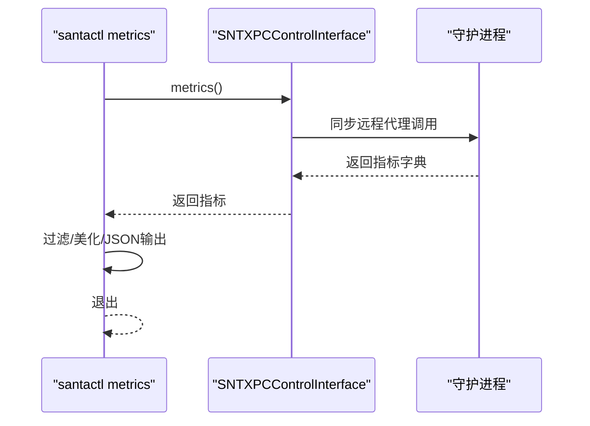
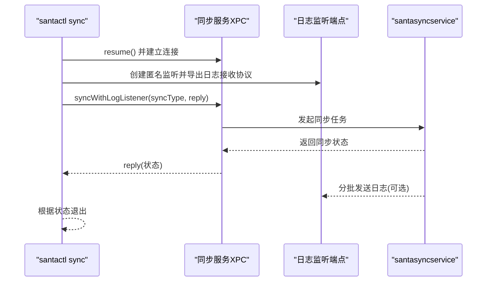
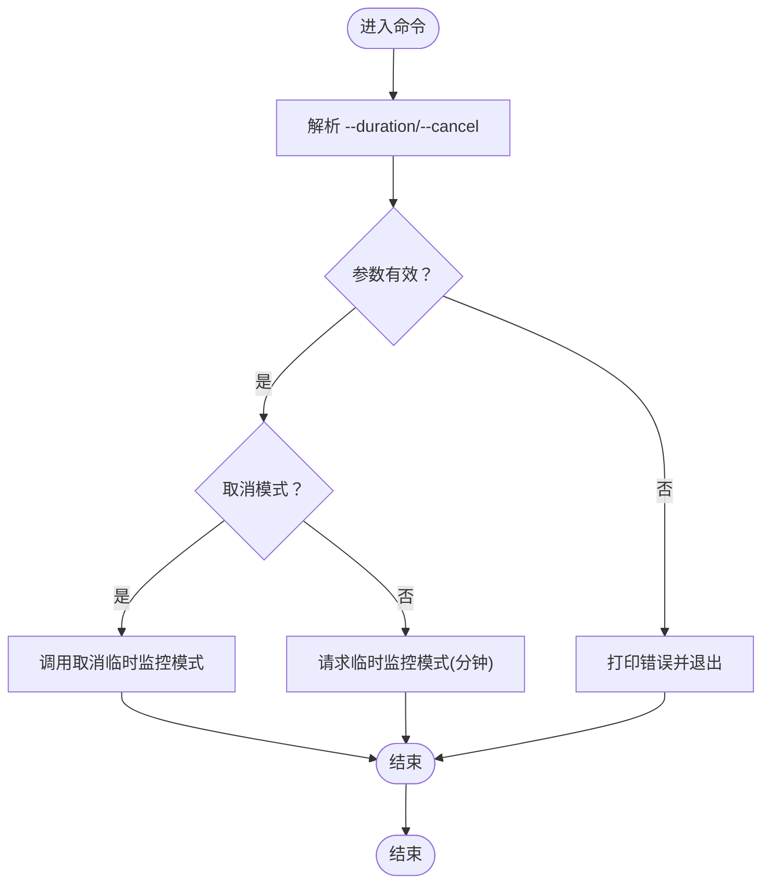
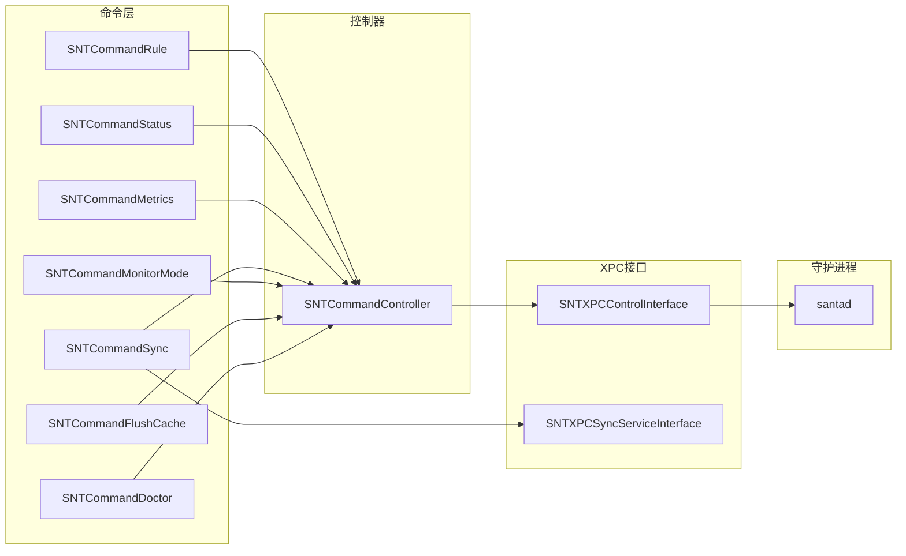

# 命令行工具

<cite>
**本文引用的文件**
- [main.mm](file://Source/santactl/main.mm)
- [SNTCommandController.h](file://Source/santactl/SNTCommandController.h)
- [SNTCommandController.mm](file://Source/santactl/SNTCommandController.mm)
- [SNTCommand.h](file://Source/santactl/SNTCommand.h)
- [SNTCommand.mm](file://Source/santactl/SNTCommand.mm)
- [SNTCommandRule.mm](file://Source/santactl/Commands/SNTCommandRule.mm)
- [SNTCommandStatus.mm](file://Source/santactl/Commands/SNTCommandStatus.mm)
- [SNTCommandMetrics.mm](file://Source/santactl/Commands/SNTCommandMetrics.mm)
- [SNTCommandSync.mm](file://Source/santactl/Commands/SNTCommandSync.mm)
- [SNTCommandMonitorMode.mm](file://Source/santactl/Commands/SNTCommandMonitorMode.mm)
- [SNTCommandFlushCache.mm](file://Source/santactl/Commands/SNTCommandFlushCache.mm)
- [SNTCommandDoctor.mm](file://Source/santactl/Commands/SNTCommandDoctor.mm)
- [SNTXPCControlInterface.h](file://Source/common/SNTXPCControlInterface.h)
- [SNTXPCControlInterface.mm](file://Source/common/SNTXPCControlInterface.mm)
</cite>

## 目录
1. [简介](#简介)
2. [项目结构](#项目结构)
3. [核心组件](#核心组件)
4. [架构总览](#架构总览)
5. [详细组件分析](#详细组件分析)
6. [依赖关系分析](#依赖关系分析)
7. [性能考虑](#性能考虑)
8. [故障排除指南](#故障排除指南)
9. [结论](#结论)
10. [附录：常用命令与用法](#附录常用命令与用法)

## 简介
本文件为 Santa 命令行工具（santactl）的全面技术文档，聚焦于命令解析、参数处理、执行流程与结果输出。文档详细说明命令控制器的注册机制、运行时调度、与守护进程（santad）及同步服务（santasyncservice）之间的 XPC 通信方式，并对规则管理、状态查询、指标获取、临时监控模式切换、缓存刷新与系统诊断等命令进行深入分析。同时提供常见用法示例、批量操作技巧、自动化脚本编写建议以及调试与故障排除策略。

## 项目结构
santactl 位于 Source/santactl 目录下，采用“命令即插件”的架构：顶层入口负责参数解析与帮助信息展示；命令控制器维护命令注册表并按需调用具体命令；各命令通过 XPC 与守护进程交互，或直接与同步服务交互。

图表来源
- [main.mm](file://Source/santactl/main.mm#L1-L84)
- [SNTCommandController.h](file://Source/santactl/SNTCommandController.h#L1-L74)
- [SNTCommandController.mm](file://Source/santactl/SNTCommandController.mm#L1-L159)
- [SNTCommand.h](file://Source/santactl/SNTCommand.h#L1-L81)
- [SNTCommand.mm](file://Source/santactl/SNTCommand.mm#L1-L47)
- [SNTCommandRule.mm](file://Source/santactl/Commands/SNTCommandRule.mm#L1-L597)
- [SNTCommandStatus.mm](file://Source/santactl/Commands/SNTCommandStatus.mm#L1-L472)
- [SNTCommandMetrics.mm](file://Source/santactl/Commands/SNTCommandMetrics.mm#L1-L182)
- [SNTCommandSync.mm](file://Source/santactl/Commands/SNTCommandSync.mm#L1-L119)
- [SNTCommandMonitorMode.mm](file://Source/santactl/Commands/SNTCommandMonitorMode.mm#L1-L158)
- [SNTCommandFlushCache.mm](file://Source/santactl/Commands/SNTCommandFlushCache.mm#L1-L66)
- [SNTCommandDoctor.mm](file://Source/santactl/Commands/SNTCommandDoctor.mm#L1-L249)
- [SNTXPCControlInterface.h](file://Source/common/SNTXPCControlInterface.h#L1-L104)
- [SNTXPCControlInterface.mm](file://Source/common/SNTXPCControlInterface.mm#L1-L97)

章节来源
- [main.mm](file://Source/santactl/main.mm#L1-L84)
- [SNTCommandController.h](file://Source/santactl/SNTCommandController.h#L1-L74)
- [SNTCommandController.mm](file://Source/santactl/SNTCommandController.mm#L1-L159)

## 核心组件
- 命令入口与帮助系统
  - 解析 argv，支持 usage/commands/help/-h/--help 子命令，打印可用命令列表或指定命令的帮助文本。
- 命令控制器
  - 维护命令名到类的映射，支持别名解析、隐藏命令过滤、权限与连接需求检查、统一执行入口。
- 命令基类
  - 提供 runWithArguments:daemonConnection: 的设计者初始化与默认未识别选择器行为，统一错误输出与退出码。
- XPC 接口
  - 提供与守护进程通信的控制接口与预配置连接；同步服务独立 XPC 连接用于离线同步场景。

章节来源
- [main.mm](file://Source/santactl/main.mm#L1-L84)
- [SNTCommandController.h](file://Source/santactl/SNTCommandController.h#L1-L74)
- [SNTCommandController.mm](file://Source/santactl/SNTCommandController.mm#L1-L159)
- [SNTCommand.h](file://Source/santactl/SNTCommand.h#L1-L81)
- [SNTCommand.mm](file://Source/santactl/SNTCommand.mm#L1-L47)
- [SNTXPCControlInterface.h](file://Source/common/SNTXPCControlInterface.h#L1-L104)
- [SNTXPCControlInterface.mm](file://Source/common/SNTXPCControlInterface.mm#L1-L97)

## 架构总览
santactl 的执行流从入口开始，经由命令控制器完成命令解析与路由，再根据命令声明的权限与连接要求决定是否建立 XPC 连接，最后在命令内部完成参数解析、调用守护进程或同步服务 API，并以结构化输出或日志形式返回结果。

图表来源
- [main.mm](file://Source/santactl/main.mm#L1-L84)
- [SNTCommandController.mm](file://Source/santactl/SNTCommandController.mm#L1-L159)
- [SNTCommand.h](file://Source/santactl/SNTCommand.h#L1-L81)
- [SNTCommand.mm](file://Source/santactl/SNTCommand.mm#L1-L47)
- [SNTXPCControlInterface.h](file://Source/common/SNTXPCControlInterface.h#L1-L104)

## 详细组件分析

### 命令控制器与注册机制
- 注册方式
  - 每个命令类在实现中使用宏将自身注册到控制器，键为命令名，值为类对象；支持别名集合，重复别名会触发致命错误。
- 别名解析
  - 将输入中的连字符与下划线标准化后查找真实命令名；支持大小写不敏感匹配。
- 权限与连接校验
  - 若命令声明需要 root 或需要与守护进程连接，则在执行前进行检查；失败时输出提示并退出。
- 执行流程
  - 通过同步/异步远程代理调用命令 runWithArguments:daemonConnection:，随后启动主 RunLoop 以等待回调完成。

图表来源
- [SNTCommandController.h](file://Source/santactl/SNTCommandController.h#L1-L74)
- [SNTCommandController.mm](file://Source/santactl/SNTCommandController.mm#L1-L159)
- [SNTCommand.h](file://Source/santactl/SNTCommand.h#L1-L81)
- [SNTCommand.mm](file://Source/santactl/SNTCommand.mm#L1-L47)
- [SNTCommandRule.mm](file://Source/santactl/Commands/SNTCommandRule.mm#L1-L597)
- [SNTCommandStatus.mm](file://Source/santactl/Commands/SNTCommandStatus.mm#L1-L472)
- [SNTCommandMetrics.mm](file://Source/santactl/Commands/SNTCommandMetrics.mm#L1-L182)
- [SNTCommandSync.mm](file://Source/santactl/Commands/SNTCommandSync.mm#L1-L119)
- [SNTCommandMonitorMode.mm](file://Source/santactl/Commands/SNTCommandMonitorMode.mm#L1-L158)
- [SNTCommandFlushCache.mm](file://Source/santactl/Commands/SNTCommandFlushCache.mm#L1-L66)
- [SNTCommandDoctor.mm](file://Source/santactl/Commands/SNTCommandDoctor.mm#L1-L249)

章节来源
- [SNTCommandController.h](file://Source/santactl/SNTCommandController.h#L1-L74)
- [SNTCommandController.mm](file://Source/santactl/SNTCommandController.mm#L1-L159)
- [SNTCommand.h](file://Source/santactl/SNTCommand.h#L1-L81)
- [SNTCommand.mm](file://Source/santactl/SNTCommand.mm#L1-L47)

### 规则管理命令（rule）
- 功能概览
  - 添加/移除/检查执行规则（允许/阻止/静默阻止/编译器/CEL 表达式），导入/导出非静态规则 JSON 文件，清理数据库规则，查询文件访问规则关联。
- 参数与约束
  - 状态：--allow/--block/--silent-block/--compiler/--cel/--remove/--check
  - 标识符类型：--path/--identifier/--sha256/--teamid/--signingid/--certificate/--cdhash/--file-access
  - 其他：--message/--comment/--clean/--clean-all/--import/--export/--export-file-access（DEBUG）
  - 中央化限制：当配置了同步服务器或静态规则时，默认禁止手动修改（可通过 DEBUG 下的 --force 放开）。
- 执行流程
  - 参数解析与互斥校验，必要时读取文件信息生成标识符，构造 SNTRule 并通过 XPC 调用守护进程添加/删除/查询；导出/导入 JSON 文件时进行序列化/反序列化与批量写入。
- 返回与错误
  - 成功/失败均通过日志输出并设置退出码；部分操作返回数组型错误以便区分警告与失败。

图表来源
- [SNTCommandRule.mm](file://Source/santactl/Commands/SNTCommandRule.mm#L1-L597)

章节来源
- [SNTCommandRule.mm](file://Source/santactl/Commands/SNTCommandRule.mm#L1-L597)

### 状态查询命令（status）
- 功能概览
  - 查询守护进程当前模式、事件日志类型、USB 阻断与重挂载策略、静态规则数、缓存计数、各类规则数量、规则哈希、同步状态（上次成功时间、是否需要清洁同步）、推送通知状态与服务器地址、文件访问策略状态、指标导出配置等。
- 输出格式
  - 支持人类可读表格与 JSON 两种格式；JSON 包含关键字段如模式、缓存计数、规则类型分布、同步状态、指标导出等。
- 异步与超时
  - 对推送通知状态查询使用异步请求与信号量超时，避免阻塞。

图表来源
- [SNTCommandStatus.mm](file://Source/santactl/Commands/SNTCommandStatus.mm#L1-L472)
- [SNTXPCControlInterface.h](file://Source/common/SNTXPCControlInterface.h#L1-L104)

章节来源
- [SNTCommandStatus.mm](file://Source/santactl/Commands/SNTCommandStatus.mm#L1-L472)

### 指标查询命令（metrics）
- 功能概览
  - 拉取守护进程导出的指标集合并进行美化打印；支持按前缀过滤；支持 JSON 输出。
- 输出与格式化
  - 人类可读输出包含根标签与指标明细（名称、描述、类型、字段、创建/更新时间、数据）；JSON 输出包含规范化后的 ISO8601 时间戳。

图表来源
- [SNTCommandMetrics.mm](file://Source/santactl/Commands/SNTCommandMetrics.mm#L1-L182)
- [SNTXPCControlInterface.h](file://Source/common/SNTXPCControlInterface.h#L1-L104)

章节来源
- [SNTCommandMetrics.mm](file://Source/santactl/Commands/SNTCommandMetrics.mm#L1-L182)

### 同步命令（sync）
- 功能概览
  - 在配置了同步服务器的情况下，触发一次与同步服务的交互；支持普通同步、清洁同步（保留/清除非传递规则）与全量清洁同步；支持开启调试日志。
- 通信方式
  - 不直接连接守护进程，而是通过 SNTXPCSyncServiceInterface 与同步服务通信；同时启动匿名监听接收同步过程日志。
- 返回值
  - 以同步状态类型作为退出码，便于脚本判断后续动作。

图表来源
- [SNTCommandSync.mm](file://Source/santactl/Commands/SNTCommandSync.mm#L1-L119)

章节来源
- [SNTCommandSync.mm](file://Source/santactl/Commands/SNTCommandSync.mm#L1-L119)

### 临时监控模式命令（monitormode）
- 功能概览
  - 在满足条件时申请临时 Monitor Mode，或取消临时 Monitor Mode 回退至 Lockdown Mode；支持以分钟、小时、天为单位的时间字符串解析。
- 参数与校验
  - --duration 支持整数（分钟）或形如 10m/2h/3d 的字符串；--cancel 取消临时模式。
- 结果
  - 成功/失败分别记录日志并设置退出码。

图表来源
- [SNTCommandMonitorMode.mm](file://Source/santactl/Commands/SNTCommandMonitorMode.mm#L1-L158)

章节来源
- [SNTCommandMonitorMode.mm](file://Source/santactl/Commands/SNTCommandMonitorMode.mm#L1-L158)

### 缓存刷新命令（flushcache）
- 功能概览
  - 请求守护进程刷新授权缓存；仅开发用途，生产环境谨慎使用。
- 权限
  - 需要 root 权限。
- 结果
  - 成功/失败分别记录日志并设置退出码。

章节来源
- [SNTCommandFlushCache.mm](file://Source/santactl/Commands/SNTCommandFlushCache.mm#L1-L66)

### 系统诊断命令（doctor）
- 功能概览
  - 检查系统进程（Santa GUI、santad、santasyncservice）、配置有效性与同步健康度；HTTPS 使用情况、代理配置、证书认证链等；通过预检请求验证同步服务可达性。
- 返回值
  - 发现问题时以非零退出码返回，便于自动化脚本捕获。

章节来源
- [SNTCommandDoctor.mm](file://Source/santactl/Commands/SNTCommandDoctor.mm#L1-L249)

## 依赖关系分析
- 命令到控制器
  - 命令类通过宏在加载时向控制器注册；控制器维护静态字典与别名映射。
- 控制器到命令
  - 控制器根据命令声明的 requiresRoot 与 requiresDaemonConn 决定是否降权与连接守护进程；随后统一调用 runWithArguments:daemonConnection:。
- 命令到守护进程
  - 通过 SNTXPCControlInterface 获取预配置连接，使用同步/异步远程代理调用守护进程提供的 API。
- 命令到同步服务
  - 同步命令通过 SNTXPCSyncServiceInterface 直接与同步服务通信，无需守护进程参与。

图表来源
- [SNTCommandController.mm](file://Source/santactl/SNTCommandController.mm#L1-L159)
- [SNTXPCControlInterface.h](file://Source/common/SNTXPCControlInterface.h#L1-L104)
- [SNTCommandSync.mm](file://Source/santactl/Commands/SNTCommandSync.mm#L1-L119)

章节来源
- [SNTCommandController.mm](file://Source/santactl/SNTCommandController.mm#L1-L159)
- [SNTXPCControlInterface.mm](file://Source/common/SNTXPCControlInterface.mm#L1-L97)

## 性能考虑
- 异步回调与 RunLoop
  - 多数命令在 XPC 回调完成后才退出，确保所有异步操作完成；同步代理调用用于关键状态查询，避免不必要的阻塞。
- 日志与输出
  - 人类可读输出采用列对齐格式，JSON 输出便于机器解析与管道处理；建议在自动化脚本中优先使用 --json 以降低解析成本。
- 超时与并发
  - 推送通知状态查询设置了超时，避免长时间等待；同步服务日志接收通过匿名监听异步推送，不影响主流程。

## 故障排除指南
- 无法连接守护进程
  - 现象：连接失效处理器被触发并提示检查 Full Disk Access 权限与进程状态。
  - 处理：确认 santad 已运行且具备所需权限；使用 doctor 命令检查进程与配置。
- 权限不足
  - 现象：需要 root 的命令在非 root 用户下执行失败。
  - 处理：以 root 或 sudo 执行相应命令。
- 中央化规则管理
  - 现象：配置了 SyncBaseURL 或静态规则时，手动修改规则被拒绝。
  - 处理：通过同步服务或集中策略管理规则；DEBUG 构建可使用 --force（不推荐）。
- 同步失败
  - 现象：同步状态异常或日志显示 Too many syncs in progress。
  - 处理：稍后再试；检查同步服务状态与网络连通性；使用 --debug 查看详细日志。
- 指标为空或未配置
  - 现象：metrics 输出提示未配置指标导出。
  - 处理：检查配置项 exportMetrics、metricURL、metricFormat、metricExportInterval。

章节来源
- [SNTCommandController.mm](file://Source/santactl/SNTCommandController.mm#L1-L159)
- [SNTCommandRule.mm](file://Source/santactl/Commands/SNTCommandRule.mm#L1-L597)
- [SNTCommandSync.mm](file://Source/santactl/Commands/SNTCommandSync.mm#L1-L119)
- [SNTCommandMetrics.mm](file://Source/santactl/Commands/SNTCommandMetrics.mm#L1-L182)
- [SNTCommandDoctor.mm](file://Source/santactl/Commands/SNTCommandDoctor.mm#L1-L249)

## 结论
santactl 通过模块化的命令体系与清晰的 XPC 通信抽象，实现了对 Santa 守护进程与同步服务的高效管理与诊断。命令控制器承担了注册、解析与路由职责，命令类专注于业务逻辑与参数校验，XPC 接口屏蔽了底层通信细节。配合丰富的参数与输出格式，既能满足日常运维，也能支撑自动化脚本与集成场景。

## 附录：常用命令与用法
- 基础
  - 查看帮助：santactl help 或 santactl --help
  - 列出命令：santactl commands 或 santactl usage
- 规则管理
  - 添加允许规则：santactl rule --allow --path /Applications/Example.app
  - 添加阻止规则：santactl rule --block --identifier sha256:<hash>
  - 导出规则：santactl rule --export /tmp/rules.json
  - 清理规则：santactl rule --clean
- 状态查询
  - 人类可读：santactl status
  - JSON 输出：santactl status --json
- 指标查询
  - 过滤前缀：santactl metrics <prefix...>
  - JSON 输出：santactl metrics --json
- 同步
  - 普通同步：santactl sync
  - 清洁同步：santactl sync --clean
  - 全量清洁：santactl sync --clean-all
  - 开启调试：santactl sync --debug
- 临时监控模式
  - 申请临时监控：santactl monitormode --duration 30m
  - 取消临时监控：santactl monitormode --cancel
- 缓存刷新（开发）
  - 刷新缓存：santactl flushcache
- 系统诊断
  - 自检：santactl doctor

章节来源
- [SNTCommandRule.mm](file://Source/santactl/Commands/SNTCommandRule.mm#L1-L597)
- [SNTCommandStatus.mm](file://Source/santactl/Commands/SNTCommandStatus.mm#L1-L472)
- [SNTCommandMetrics.mm](file://Source/santactl/Commands/SNTCommandMetrics.mm#L1-L182)
- [SNTCommandSync.mm](file://Source/santactl/Commands/SNTCommandSync.mm#L1-L119)
- [SNTCommandMonitorMode.mm](file://Source/santactl/Commands/SNTCommandMonitorMode.mm#L1-L158)
- [SNTCommandFlushCache.mm](file://Source/santactl/Commands/SNTCommandFlushCache.mm#L1-L66)
- [SNTCommandDoctor.mm](file://Source/santactl/Commands/SNTCommandDoctor.mm#L1-L249)