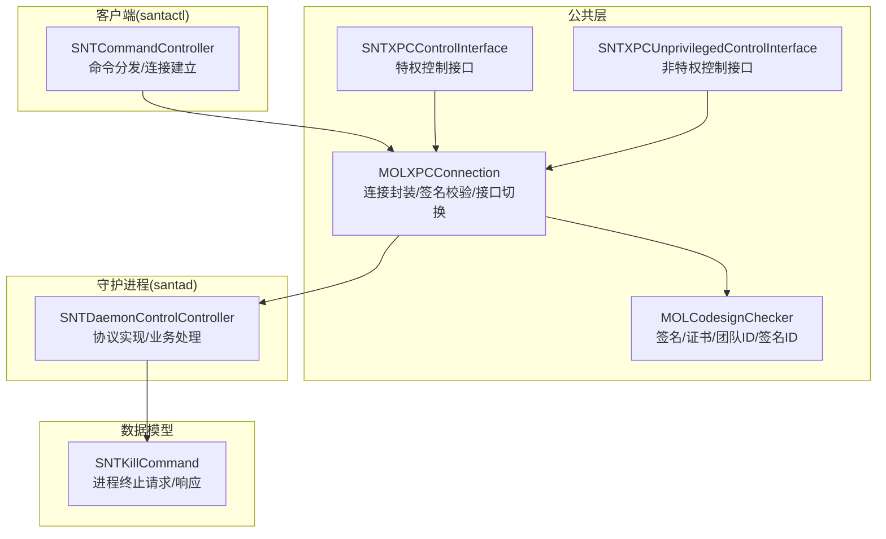
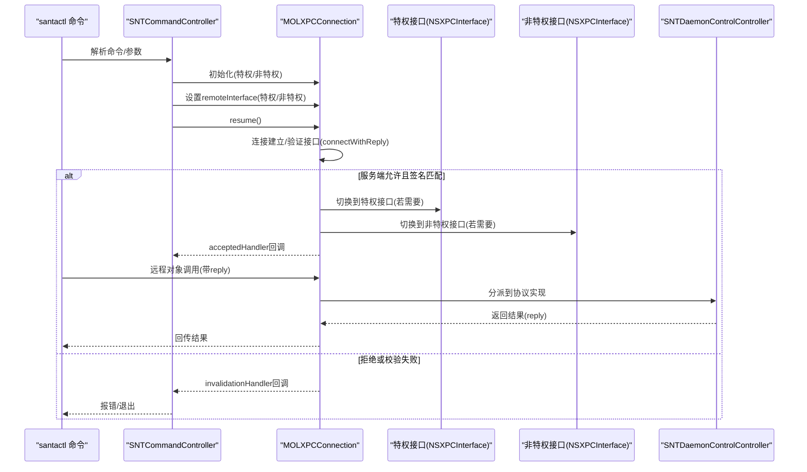
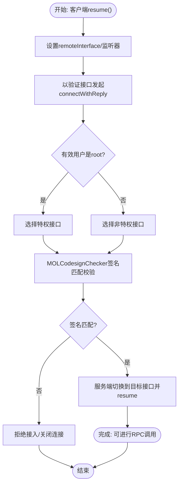
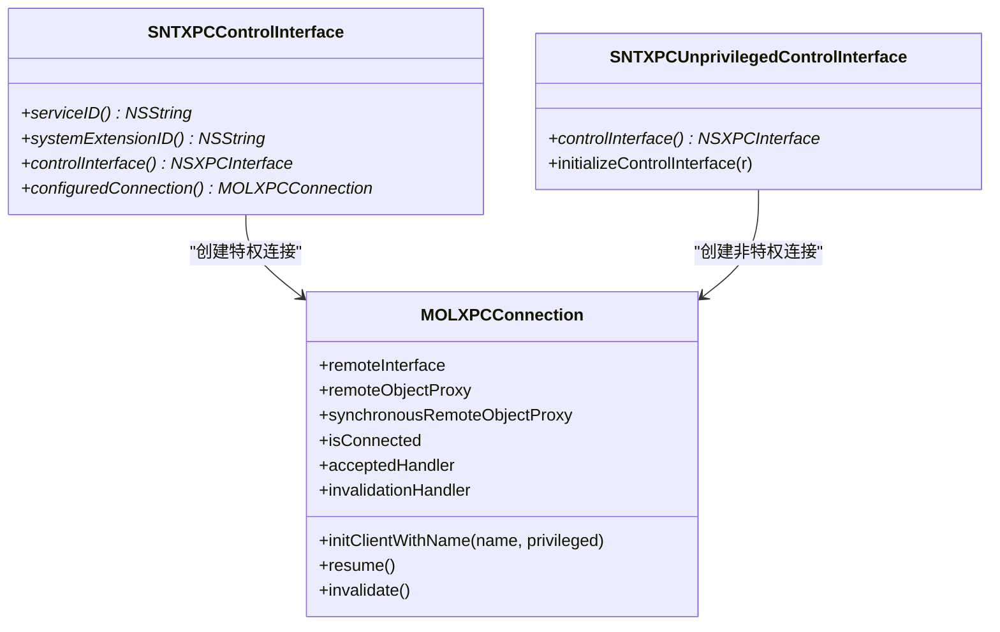
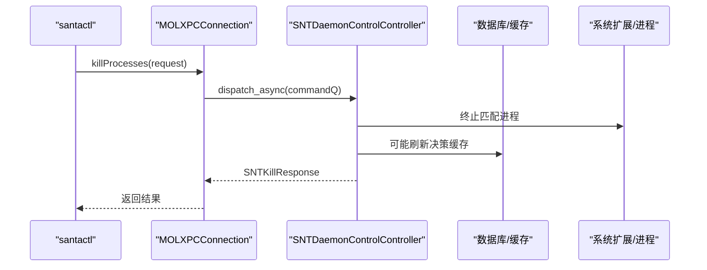
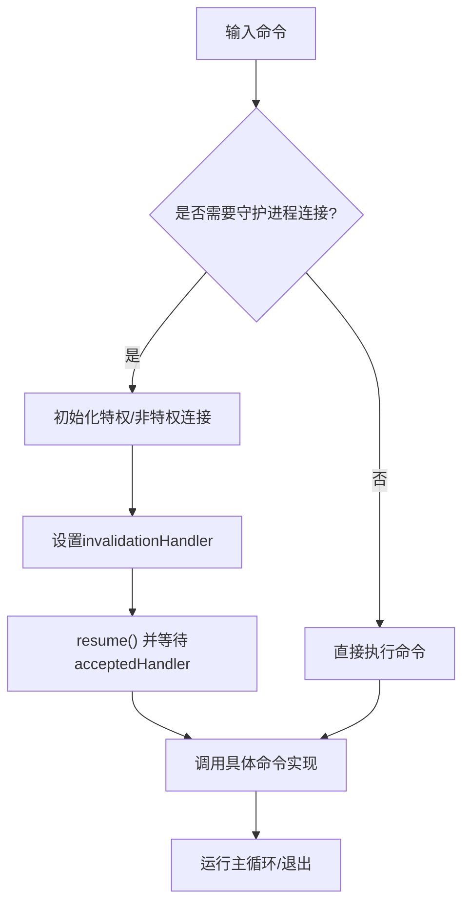
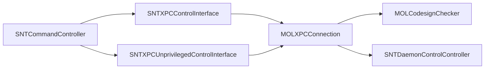

# 命令通信机制

<cite>
**本文引用的文件**
- [MOLXPCConnection.h](file://Source/common/MOLXPCConnection.h)
- [MOLXPCConnection.mm](file://Source/common/MOLXPCConnection.mm)
- [SNTXPCControlInterface.h](file://Source/common/SNTXPCControlInterface.h)
- [SNTXPCControlInterface.mm](file://Source/common/SNTXPCControlInterface.mm)
- [SNTXPCUnprivilegedControlInterface.h](file://Source/common/SNTXPCUnprivilegedControlInterface.h)
- [SNTXPCUnprivilegedControlInterface.mm](file://Source/common/SNTXPCUnprivilegedControlInterface.mm)
- [SNTDaemonControlController.mm](file://Source/santad/SNTDaemonControlController.mm)
- [SNTCommandController.mm](file://Source/santactl/SNTCommandController.mm)
- [SNTKillCommand.h](file://Source/common/SNTKillCommand.h)
- [SNTKillCommand.mm](file://Source/common/SNTKillCommand.mm)
- [MOLCodesignChecker.h](file://Source/common/MOLCodesignChecker.h)
- [MOLCodesignChecker.mm](file://Source/common/MOLCodesignChecker.mm)
</cite>

## 目录
1. [引言](#引言)
2. [项目结构](#项目结构)
3. [核心组件](#核心组件)
4. [架构总览](#架构总览)
5. [详细组件分析](#详细组件分析)
6. [依赖关系分析](#依赖关系分析)
7. [性能考量](#性能考量)
8. [故障排查指南](#故障排查指南)
9. [结论](#结论)
10. [附录](#附录)

## 引言
本文件面向Santa项目中的命令通信机制，系统性阐述XPC接口设计与实现，重点覆盖：
- 特权控制接口与非特权控制接口的差异、职责边界与使用场景
- 守护进程与客户端（santactl）之间的通信协议、消息格式与数据序列化
- XPC连接的建立、维护、断开与错误处理
- 权限控制、签名验证与访问限制
- 超时与重连策略、调试与监控方法

## 项目结构
围绕命令通信的关键代码分布在以下模块：
- 公共XPC基础设施：MOLXPCConnection（连接封装、签名校验、接口切换）
- 控制接口定义：SNTXPCControlInterface（特权）、SNTXPCUnprivilegedControlInterface（非特权）
- 守护进程端实现：SNTDaemonControlController（协议实现、业务处理）
- 客户端入口：SNTCommandController（命令分发、连接建立）
- 数据模型：SNTKillCommand（进程终止请求/响应等）
- 签名验证：MOLCodesignChecker（签名信息、证书链、团队ID、签名ID）

图表来源
- [MOLXPCConnection.h](file://Source/common/MOLXPCConnection.h#L54-L155)
- [MOLXPCConnection.mm](file://Source/common/MOLXPCConnection.mm#L55-L239)
- [SNTXPCControlInterface.h](file://Source/common/SNTXPCControlInterface.h#L26-L104)
- [SNTXPCControlInterface.mm](file://Source/common/SNTXPCControlInterface.mm#L28-L97)
- [SNTXPCUnprivilegedControlInterface.h](file://Source/common/SNTXPCUnprivilegedControlInterface.h#L40-L133)
- [SNTXPCUnprivilegedControlInterface.mm](file://Source/common/SNTXPCUnprivilegedControlInterface.mm#L23-L42)
- [SNTDaemonControlController.mm](file://Source/santad/SNTDaemonControlController.mm#L105-L661)
- [SNTCommandController.mm](file://Source/santactl/SNTCommandController.mm#L114-L159)
- [SNTKillCommand.h](file://Source/common/SNTKillCommand.h#L15-L85)
- [SNTKillCommand.mm](file://Source/common/SNTKillCommand.mm#L21-L306)
- [MOLCodesignChecker.h](file://Source/common/MOLCodesignChecker.h#L15-L210)
- [MOLCodesignChecker.mm](file://Source/common/MOLCodesignChecker.mm#L1-L453)

章节来源
- [MOLXPCConnection.h](file://Source/common/MOLXPCConnection.h#L15-L164)
- [MOLXPCConnection.mm](file://Source/common/MOLXPCConnection.mm#L55-L239)
- [SNTXPCControlInterface.h](file://Source/common/SNTXPCControlInterface.h#L26-L104)
- [SNTXPCControlInterface.mm](file://Source/common/SNTXPCControlInterface.mm#L28-L97)
- [SNTXPCUnprivilegedControlInterface.h](file://Source/common/SNTXPCUnprivilegedControlInterface.h#L40-L133)
- [SNTXPCUnprivilegedControlInterface.mm](file://Source/common/SNTXPCUnprivilegedControlInterface.mm#L23-L42)
- [SNTDaemonControlController.mm](file://Source/santad/SNTDaemonControlController.mm#L105-L661)
- [SNTCommandController.mm](file://Source/santactl/SNTCommandController.mm#L114-L159)
- [SNTKillCommand.h](file://Source/common/SNTKillCommand.h#L15-L85)
- [SNTKillCommand.mm](file://Source/common/SNTKillCommand.mm#L21-L306)
- [MOLCodesignChecker.h](file://Source/common/MOLCodesignChecker.h#L15-L210)
- [MOLCodesignChecker.mm](file://Source/common/MOLCodesignChecker.mm#L1-L453)

## 核心组件
- MOLXPCConnection：提供服务器监听与客户端连接封装，支持“验证接口”阶段完成签名校验与接口切换，确保远程对象代理在建立后符合预期协议；内置失效/中断处理器与连接状态查询。
- SNTXPCControlInterface：构建特权控制接口（基于SNTDaemonControlXPC），配置参数化类映射，生成已初始化的NSXPCInterface，并返回预配置的MOLXPCConnection（特权模式）。
- SNTXPCUnprivilegedControlInterface：构建非特权控制接口（基于SNTUnprivilegedDaemonControlXPC），配置参数化类映射，生成已初始化的NSXPCInterface。
- SNTDaemonControlController：守护进程端协议实现，涵盖缓存、数据库、配置、同步、指标、通知、临时监控模式等操作；对特权命令（如安装应用、进程终止）进行异步处理与安全校验。
- SNTCommandController：santactl侧命令入口，负责命令注册、别名解析、连接建立（必要时阻塞等待连接有效），并调用具体命令执行。
- SNTKillCommand：进程终止相关数据模型，定义不同类型的终止请求与响应，含安全编码支持与字段校验。

章节来源
- [MOLXPCConnection.h](file://Source/common/MOLXPCConnection.h#L54-L155)
- [MOLXPCConnection.mm](file://Source/common/MOLXPCConnection.mm#L55-L239)
- [SNTXPCControlInterface.h](file://Source/common/SNTXPCControlInterface.h#L26-L104)
- [SNTXPCControlInterface.mm](file://Source/common/SNTXPCControlInterface.mm#L28-L97)
- [SNTXPCUnprivilegedControlInterface.h](file://Source/common/SNTXPCUnprivilegedControlInterface.h#L40-L133)
- [SNTXPCUnprivilegedControlInterface.mm](file://Source/common/SNTXPCUnprivilegedControlInterface.mm#L23-L42)
- [SNTDaemonControlController.mm](file://Source/santad/SNTDaemonControlController.mm#L105-L661)
- [SNTCommandController.mm](file://Source/santactl/SNTCommandController.mm#L114-L159)
- [SNTKillCommand.h](file://Source/common/SNTKillCommand.h#L15-L85)
- [SNTKillCommand.mm](file://Source/common/SNTKillCommand.mm#L21-L306)

## 架构总览
下图展示从santactl到santad的典型调用路径与XPC连接生命周期。

图表来源
- [SNTCommandController.mm](file://Source/santactl/SNTCommandController.mm#L114-L159)
- [MOLXPCConnection.mm](file://Source/common/MOLXPCConnection.mm#L114-L202)
- [SNTXPCControlInterface.mm](file://Source/common/SNTXPCControlInterface.mm#L82-L97)
- [SNTXPCUnprivilegedControlInterface.mm](file://Source/common/SNTXPCUnprivilegedControlInterface.mm#L23-L42)
- [SNTDaemonControlController.mm](file://Source/santad/SNTDaemonControlController.mm#L105-L661)

## 详细组件分析

### XPC连接与安全握手
- 连接建立流程
  - 客户端通过MOLXPCConnection初始化（特权/非特权），设置remoteInterface，调用resume。
  - 首次建立时，先以“验证接口”进行握手，发送connectWithReply，服务端完成签名校验与接口切换后恢复连接。
  - 若未在合理时间内完成握手，触发超时逻辑，清理remoteObjectInterface并使连接失效。
- 服务端接入策略
  - 根据连接的有效用户身份选择使用特权或非特权接口。
  - 使用MOLCodesignChecker对对端签名进行匹配校验，仅允许签名一致的进程接入。
  - 接入后以“验证接口”导出对象，待客户端connectWithReply后再切换到实际接口。
- 连接状态与错误处理
  - 提供isConnected判断当前是否处于最终接口状态。
  - 提供invalidationHandler/interruptionHandler统一处理断开/失效事件，必要时触发清理与重试。

图表来源
- [MOLXPCConnection.mm](file://Source/common/MOLXPCConnection.mm#L114-L202)
- [MOLCodesignChecker.h](file://Source/common/MOLCodesignChecker.h#L15-L210)
- [MOLCodesignChecker.mm](file://Source/common/MOLCodesignChecker.mm#L1-L453)

章节来源
- [MOLXPCConnection.mm](file://Source/common/MOLXPCConnection.mm#L114-L202)
- [MOLCodesignChecker.h](file://Source/common/MOLCodesignChecker.h#L15-L210)
- [MOLCodesignChecker.mm](file://Source/common/MOLCodesignChecker.mm#L1-L453)

### 特权控制接口 vs 非特权控制接口
- 特权接口（SNTDaemonControlXPC）
  - 由SNTXPCControlInterface负责构建，包含数据库、缓存、配置、同步、命令（如安装应用、进程终止）等能力。
  - 通过MOLXPCConnection以特权模式初始化，确保santactl具备足够权限执行系统级操作。
- 非特权接口（SNTUnprivilegedDaemonControlXPC）
  - 由SNTXPCUnprivilegedControlInterface负责构建，包含缓存统计、规则计数、配置状态查询、指标、通知监听、临时监控模式等能力。
  - 通过MOLXPCConnection以非特权模式初始化，适合普通用户态查询与轻量操作。

图表来源
- [SNTXPCControlInterface.h](file://Source/common/SNTXPCControlInterface.h#L26-L104)
- [SNTXPCControlInterface.mm](file://Source/common/SNTXPCControlInterface.mm#L28-L97)
- [SNTXPCUnprivilegedControlInterface.h](file://Source/common/SNTXPCUnprivilegedControlInterface.h#L40-L133)
- [SNTXPCUnprivilegedControlInterface.mm](file://Source/common/SNTXPCUnprivilegedControlInterface.mm#L23-L42)
- [MOLXPCConnection.h](file://Source/common/MOLXPCConnection.h#L54-L155)

章节来源
- [SNTXPCControlInterface.h](file://Source/common/SNTXPCControlInterface.h#L26-L104)
- [SNTXPCControlInterface.mm](file://Source/common/SNTXPCControlInterface.mm#L28-L97)
- [SNTXPCUnprivilegedControlInterface.h](file://Source/common/SNTXPCUnprivilegedControlInterface.h#L40-L133)
- [SNTXPCUnprivilegedControlInterface.mm](file://Source/common/SNTXPCUnprivilegedControlInterface.mm#L23-L42)
- [MOLXPCConnection.h](file://Source/common/MOLXPCConnection.h#L54-L155)

### 守护进程端协议实现与命令处理
- 协议实现范围
  - 缓存操作：统计、刷新、命中查询
  - 数据库操作：规则增删改查、事件查询与清理、规则哈希
  - 配置操作：客户端模式、同步类型、USB挂载策略、事件上传开关等
  - 同步与通知：推送状态、服务器地址、规则同步通知
  - 指标与遥测：导出指标、导出遥测
  - 临时监控模式：请求、取消、剩余秒数查询
  - 安装应用：路径校验、权限设置、替换与重载系统扩展
- 特权命令处理
  - killProcesses：异步队列处理，返回批量进程终止结果与错误码
  - installSantaApp：严格校验签名团队ID与签名ID，设置所有权与权限，替换安装目录并触发系统扩展加载

图表来源
- [SNTDaemonControlController.mm](file://Source/santad/SNTDaemonControlController.mm#L441-L446)
- [SNTKillCommand.h](file://Source/common/SNTKillCommand.h#L15-L85)
- [SNTKillCommand.mm](file://Source/common/SNTKillCommand.mm#L21-L306)

章节来源
- [SNTDaemonControlController.mm](file://Source/santad/SNTDaemonControlController.mm#L105-L661)
- [SNTKillCommand.h](file://Source/common/SNTKillCommand.h#L15-L85)
- [SNTKillCommand.mm](file://Source/common/SNTKillCommand.mm#L21-L306)

### 客户端命令入口与连接策略
- 命令注册与别名解析：支持命令名称与别名映射，避免重复别名。
- 连接建立策略：
  - 对于需要守护进程连接的命令，设置invalidationHandler并在resume后阻塞等待连接有效。
  - 对于不需要守护进程连接的命令，可直接执行。
- 权限要求：若命令声明需要root，则在执行前检查UID，否则直接退出。

图表来源
- [SNTCommandController.mm](file://Source/santactl/SNTCommandController.mm#L114-L159)

章节来源
- [SNTCommandController.mm](file://Source/santactl/SNTCommandController.mm#L114-L159)

### 数据序列化与消息格式
- 参数化类映射
  - 在特权/非特权接口初始化时，通过NSXPCInterface为特定SEL设置参数中自定义类的映射，确保跨进程传递复杂对象（如规则、事件、响应体）时正确反序列化。
- 安全编码
  - SNTKillCommand系列对象实现NSSecureCoding，保证跨进程传输的安全性与完整性。
- 基本类型与数组
  - 支持基础类型、数组、字典等常见容器类型作为参数或回复。

章节来源
- [SNTXPCControlInterface.mm](file://Source/common/SNTXPCControlInterface.mm#L46-L87)
- [SNTXPCUnprivilegedControlInterface.mm](file://Source/common/SNTXPCUnprivilegedControlInterface.mm#L23-L42)
- [SNTKillCommand.h](file://Source/common/SNTKillCommand.h#L15-L85)
- [SNTKillCommand.mm](file://Source/common/SNTKillCommand.mm#L21-L306)

### 权限控制、安全验证与访问限制
- 用户权限判定
  - 服务端根据连接的有效用户ID选择特权或非特权接口，限制高危操作仅对root开放。
- 签名验证
  - 使用MOLCodesignChecker对对端签名进行匹配校验，仅允许与本地签名一致的进程接入，防止伪造客户端。
- 应用安装安全
  - installSantaApp在替换前严格校验签名团队ID与签名ID，设置所有权与权限，最后触发系统扩展重载，降低越权风险。

章节来源
- [MOLXPCConnection.mm](file://Source/common/MOLXPCConnection.mm#L159-L202)
- [MOLCodesignChecker.h](file://Source/common/MOLCodesignChecker.h#L15-L210)
- [MOLCodesignChecker.mm](file://Source/common/MOLCodesignChecker.mm#L1-L453)
- [SNTDaemonControlController.mm](file://Source/santad/SNTDaemonControlController.mm#L540-L633)

### 通信错误处理、重连策略与超时管理
- 连接超时
  - 客户端在resume后等待connectWithReply，在超时时间内未完成则主动使连接失效，避免悬挂状态。
- 失效/中断处理
  - 提供invalidationHandler/interruptionHandler统一回调，可在回调中记录日志、释放资源或触发重试。
- 重连策略建议
  - 在客户端侧，可在失效回调中重新初始化MOLXPCConnection并resume，结合指数退避策略避免频繁重试。
  - 对于关键命令，可在超时或失效后提示用户检查守护进程状态与权限配置。

章节来源
- [MOLXPCConnection.mm](file://Source/common/MOLXPCConnection.mm#L114-L157)
- [SNTCommandController.mm](file://Source/santactl/SNTCommandController.mm#L114-L128)

### 通信调试工具与监控方法
- 日志输出
  - 守护进程端广泛使用日志宏记录关键事件（如安装、规则变更、缓存刷新、临时监控模式），便于问题定位。
- 指标导出
  - 提供metrics接口导出内部指标，辅助运行时监控。
- 遥测导出
  - 支持导出遥测数据，便于离线分析。
- 建议的调试步骤
  - 确认守护进程运行状态与Full Disk Access权限
  - 使用metrics/status命令查看守护进程健康度
  - 观察日志输出定位异常

章节来源
- [SNTDaemonControlController.mm](file://Source/santad/SNTDaemonControlController.mm#L449-L454)
- [SNTDaemonControlController.mm](file://Source/santad/SNTDaemonControlController.mm#L635-L638)

## 依赖关系分析
- 组件耦合
  - SNTCommandController依赖SNTXPCControlInterface/SNTXPCUnprivilegedControlInterface创建MOLXPCConnection，体现高层命令与底层通信的解耦。
  - SNTDaemonControlController实现具体协议，依赖数据库、缓存、系统扩展等子系统。
- 外部依赖
  - MOLCodesignChecker依赖系统安全框架进行签名验证。
  - NSXPCInterface用于跨进程类型映射与序列化。

图表来源
- [SNTCommandController.mm](file://Source/santactl/SNTCommandController.mm#L114-L159)
- [SNTXPCControlInterface.mm](file://Source/common/SNTXPCControlInterface.mm#L82-L97)
- [SNTXPCUnprivilegedControlInterface.mm](file://Source/common/SNTXPCUnprivilegedControlInterface.mm#L23-L42)
- [MOLXPCConnection.mm](file://Source/common/MOLXPCConnection.mm#L55-L239)
- [MOLCodesignChecker.h](file://Source/common/MOLCodesignChecker.h#L15-L210)
- [SNTDaemonControlController.mm](file://Source/santad/SNTDaemonControlController.mm#L105-L661)

章节来源
- [SNTCommandController.mm](file://Source/santactl/SNTCommandController.mm#L114-L159)
- [SNTXPCControlInterface.mm](file://Source/common/SNTXPCControlInterface.mm#L82-L97)
- [SNTXPCUnprivilegedControlInterface.mm](file://Source/common/SNTXPCUnprivilegedControlInterface.mm#L23-L42)
- [MOLXPCConnection.mm](file://Source/common/MOLXPCConnection.mm#L55-L239)
- [MOLCodesignChecker.h](file://Source/common/MOLCodesignChecker.h#L15-L210)
- [SNTDaemonControlController.mm](file://Source/santad/SNTDaemonControlController.mm#L105-L661)

## 性能考量
- 连接延迟
  - 首次建立连接包含签名校验与接口切换，通常在毫秒级完成；若超时未达，会触发失效以避免长时间阻塞。
- 异步处理
  - 特权命令（如进程终止）在专用串行队列中异步执行，避免阻塞XPC消息处理。
- 批量操作
  - 数据库规则批量添加时，按需决定是否刷新决策缓存，减少不必要的缓存抖动。

章节来源
- [MOLXPCConnection.mm](file://Source/common/MOLXPCConnection.mm#L114-L157)
- [SNTDaemonControlController.mm](file://Source/santad/SNTDaemonControlController.mm#L441-L446)
- [SNTDaemonControlController.mm](file://Source/santad/SNTDaemonControlController.mm#L159-L201)

## 故障排查指南
- 连接失败
  - 检查守护进程是否运行、Full Disk Access权限是否授予
  - 查看invalidationHandler回调输出，确认是否因签名不匹配或超时导致断开
- 命令无响应
  - 确认命令是否需要守护进程连接，必要时启用连接等待
  - 对于耗时命令（如规则批量导入），观察日志与指标
- 权限不足
  - 某些命令需要root权限，检查UID或使用sudo
- 安装失败
  - 核对签名团队ID与签名ID，检查所有权与权限设置

章节来源
- [SNTCommandController.mm](file://Source/santactl/SNTCommandController.mm#L114-L159)
- [MOLXPCConnection.mm](file://Source/common/MOLXPCConnection.mm#L114-L157)
- [SNTDaemonControlController.mm](file://Source/santad/SNTDaemonControlController.mm#L540-L633)

## 结论
Santa的命令通信机制以MOLXPCConnection为核心，结合特权/非特权双接口与严格的签名验证，实现了安全、可控且高性能的守护进程通信。通过清晰的协议划分、完善的错误处理与可观测性手段，系统能够在复杂环境中稳定运行并满足不同用户场景的需求。

## 附录
- 关键接口与职责
  - 特权接口：数据库/缓存/安装/进程终止等系统级操作
  - 非特权接口：查询/统计/通知/临时监控等用户态操作
- 建议实践
  - 在客户端侧实现指数退避重连
  - 对关键命令增加超时与重试策略
  - 使用metrics与日志进行持续监控