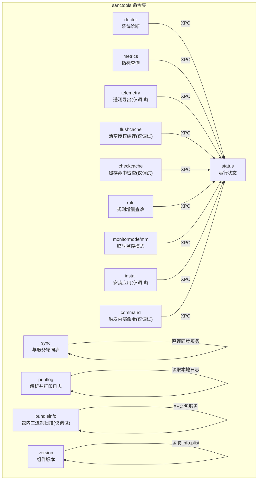
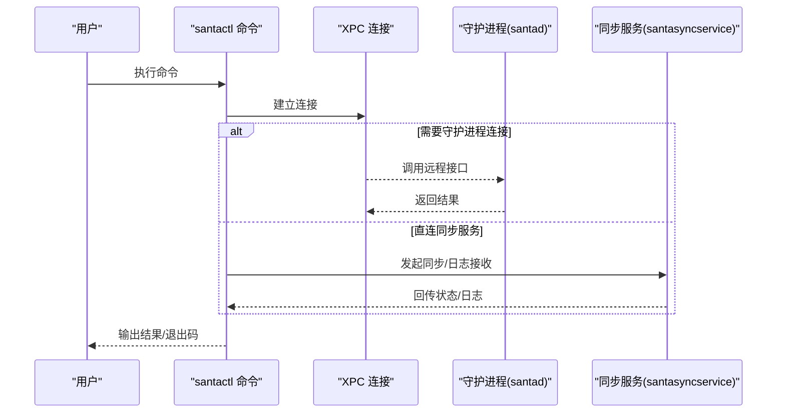
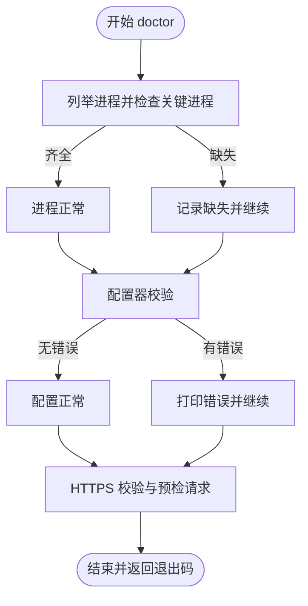
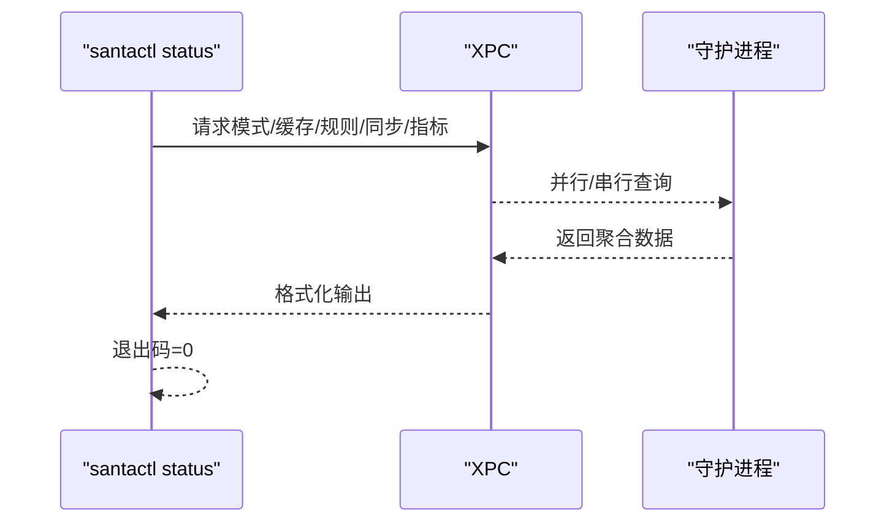
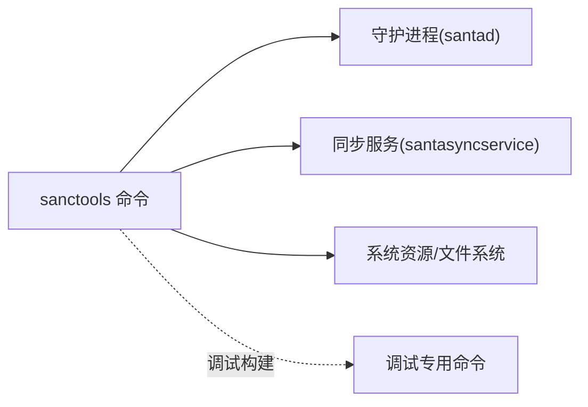

# 实用工具命令

<cite>
**本文引用的文件**
- [Source/santactl/Commands/SNTCommandDoctor.mm](file://Source/santactl/Commands/SNTCommandDoctor.mm)
- [Source/santactl/Commands/SNTCommandMetrics.mm](file://Source/santactl/Commands/SNTCommandMetrics.mm)
- [Source/santactl/Commands/SNTCommandTelemetry.mm](file://Source/santactl/Commands/SNTCommandTelemetry.mm)
- [Source/santactl/Commands/SNTCommandFlushCache.mm](file://Source/santactl/Commands/SNTCommandFlushCache.mm)
- [Source/santactl/Commands/SNTCommandCheckCache.mm](file://Source/santactl/Commands/SNTCommandCheckCache.mm)
- [Source/santactl/Commands/SNTCommandStatus.mm](file://Source/santactl/Commands/SNTCommandStatus.mm)
- [Source/santactl/Commands/SNTCommandVersion.mm](file://Source/santactl/Commands/SNTCommandVersion.mm)
- [Source/santactl/Commands/SNTCommandPrintLog.mm](file://Source/santactl/Commands/SNTCommandPrintLog.mm)
- [Source/santactl/Commands/SNTCommandCommand.mm](file://Source/santactl/Commands/SNTCommandCommand.mm)
- [Source/santactl/Commands/SNTCommandInstall.mm](file://Source/santactl/Commands/SNTCommandInstall.mm)
- [Source/santactl/Commands/SNTCommandRule.mm](file://Source/santactl/Commands/SNTCommandRule.mm)
- [Source/santactl/Commands/SNTCommandMonitorMode.mm](file://Source/santactl/Commands/SNTCommandMonitorMode.mm)
- [Source/santactl/Commands/SNTCommandSync.mm](file://Source/santactl/Commands/SNTCommandSync.mm)
- [Source/santactl/Commands/SNTCommandBundleInfo.mm](file://Source/santactl/Commands/SNTCommandBundleInfo.mm)
</cite>

## 目录
1. [简介](#简介)
2. [项目结构](#项目结构)
3. [核心组件](#核心组件)
4. [架构总览](#架构总览)
5. [详细组件分析](#详细组件分析)
6. [依赖关系分析](#依赖关系分析)
7. [性能考虑](#性能考虑)
8. [故障排除指南](#故障排除指南)
9. [结论](#结论)
10. [附录](#附录)

## 简介
本指南面向系统管理员与工程人员，围绕 Santa 的实用工具命令（sanctools）提供从诊断到运维的完整操作手册。内容覆盖：
- 诊断命令：系统健康检查、配置验证与问题定位
- 缓存清理命令：清理策略与数据恢复注意事项
- 遥测命令：数据导出流程与调试要点
- 通用命令：规则管理、状态查询、版本信息、临时监控模式等
- 故障排除：日志分析、常见错误与修复路径
- 性能优化与自动化：批处理与脚本模板建议

## 项目结构
sanctools 命令集中于 Source/santactl/Commands 下，每个命令以独立类实现，统一继承 SNTCommand 并注册命令名。命令通过 XPC 与守护进程交互，或直接访问系统资源。

图表来源
- [Source/santactl/Commands/SNTCommandDoctor.mm](file://Source/santactl/Commands/SNTCommandDoctor.mm#L1-L249)
- [Source/santactl/Commands/SNTCommandStatus.mm](file://Source/santactl/Commands/SNTCommandStatus.mm#L1-L472)
- [Source/santactl/Commands/SNTCommandMetrics.mm](file://Source/santactl/Commands/SNTCommandMetrics.mm#L1-L182)
- [Source/santactl/Commands/SNTCommandTelemetry.mm](file://Source/santactl/Commands/SNTCommandTelemetry.mm#L1-L112)
- [Source/santactl/Commands/SNTCommandFlushCache.mm](file://Source/santactl/Commands/SNTCommandFlushCache.mm#L1-L66)
- [Source/santactl/Commands/SNTCommandCheckCache.mm](file://Source/santactl/Commands/SNTCommandCheckCache.mm#L1-L86)
- [Source/santactl/Commands/SNTCommandRule.mm](file://Source/santactl/Commands/SNTCommandRule.mm#L1-L597)
- [Source/santactl/Commands/SNTCommandSync.mm](file://Source/santactl/Commands/SNTCommandSync.mm#L1-L119)
- [Source/santactl/Commands/SNTCommandMonitorMode.mm](file://Source/santactl/Commands/SNTCommandMonitorMode.mm#L1-L158)
- [Source/santactl/Commands/SNTCommandPrintLog.mm](file://Source/santactl/Commands/SNTCommandPrintLog.mm#L1-L410)
- [Source/santactl/Commands/SNTCommandInstall.mm](file://Source/santactl/Commands/SNTCommandInstall.mm#L1-L81)
- [Source/santactl/Commands/SNTCommandCommand.mm](file://Source/santactl/Commands/SNTCommandCommand.mm#L1-L197)
- [Source/santactl/Commands/SNTCommandBundleInfo.mm](file://Source/santactl/Commands/SNTCommandBundleInfo.mm#L1-L87)
- [Source/santactl/Commands/SNTCommandVersion.mm](file://Source/santactl/Commands/SNTCommandVersion.mm#L1-L99)

章节来源
- [Source/santactl/Commands/SNTCommandDoctor.mm](file://Source/santactl/Commands/SNTCommandDoctor.mm#L1-L249)
- [Source/santactl/Commands/SNTCommandStatus.mm](file://Source/santactl/Commands/SNTCommandStatus.mm#L1-L472)

## 核心组件
- doctor：系统级诊断，校验进程、配置与同步链路，非零退出码表示发现潜在问题
- status：运行时状态聚合输出，含模式、缓存、规则、同步、指标等关键指标
- metrics：从守护进程拉取指标并可按前缀过滤，支持 JSON 输出
- telemetry：在调试构建中导出当前遥测数据（需守护进程连接）
- flushcache/checkcache：开发用途的缓存操作与命中检查
- rule：规则增删改查、导入导出、CEL 规则与文件访问规则（调试）
- sync：与同步服务交互，支持普通/清洁同步与日志回传
- monitormode/mm：请求临时监控模式或取消
- printlog：解析并打印压缩/流式日志文件为 JSON
- install/command/bundleinfo：安装应用、触发内部命令、包内二进制扫描（调试）
- version：打印各组件版本信息

章节来源
- [Source/santactl/Commands/SNTCommandDoctor.mm](file://Source/santactl/Commands/SNTCommandDoctor.mm#L1-L249)
- [Source/santactl/Commands/SNTCommandStatus.mm](file://Source/santactl/Commands/SNTCommandStatus.mm#L1-L472)
- [Source/santactl/Commands/SNTCommandMetrics.mm](file://Source/santactl/Commands/SNTCommandMetrics.mm#L1-L182)
- [Source/santactl/Commands/SNTCommandTelemetry.mm](file://Source/santactl/Commands/SNTCommandTelemetry.mm#L1-L112)
- [Source/santactl/Commands/SNTCommandFlushCache.mm](file://Source/santactl/Commands/SNTCommandFlushCache.mm#L1-L66)
- [Source/santactl/Commands/SNTCommandCheckCache.mm](file://Source/santactl/Commands/SNTCommandCheckCache.mm#L1-L86)
- [Source/santactl/Commands/SNTCommandRule.mm](file://Source/santactl/Commands/SNTCommandRule.mm#L1-L597)
- [Source/santactl/Commands/SNTCommandSync.mm](file://Source/santactl/Commands/SNTCommandSync.mm#L1-L119)
- [Source/santactl/Commands/SNTCommandMonitorMode.mm](file://Source/santactl/Commands/SNTCommandMonitorMode.mm#L1-L158)
- [Source/santactl/Commands/SNTCommandPrintLog.mm](file://Source/santactl/Commands/SNTCommandPrintLog.mm#L1-L410)
- [Source/santactl/Commands/SNTCommandInstall.mm](file://Source/santactl/Commands/SNTCommandInstall.mm#L1-L81)
- [Source/santactl/Commands/SNTCommandCommand.mm](file://Source/santactl/Commands/SNTCommandCommand.mm#L1-L197)
- [Source/santactl/Commands/SNTCommandBundleInfo.mm](file://Source/santactl/Commands/SNTCommandBundleInfo.mm#L1-L87)
- [Source/santactl/Commands/SNTCommandVersion.mm](file://Source/santactl/Commands/SNTCommandVersion.mm#L1-L99)

## 架构总览
sanctools 通过 XPC 与守护进程通信；部分命令直接访问系统资源或同步服务。整体交互如下：

图表来源
- [Source/santactl/Commands/SNTCommandStatus.mm](file://Source/santactl/Commands/SNTCommandStatus.mm#L1-L472)
- [Source/santactl/Commands/SNTCommandSync.mm](file://Source/santactl/Commands/SNTCommandSync.mm#L1-L119)
- [Source/santactl/Commands/SNTCommandMetrics.mm](file://Source/santactl/Commands/SNTCommandMetrics.mm#L1-L182)
- [Source/santactl/Commands/SNTCommandTelemetry.mm](file://Source/santactl/Commands/SNTCommandTelemetry.mm#L1-L112)

## 详细组件分析

### 诊断命令 doctor
- 功能：检查进程、配置与同步链路，失败时返回非零退出码
- 关键点：
  - 进程校验：确认 GUI、守护进程与同步服务是否运行
  - 配置校验：调用配置器进行格式与字段校验
  - 同步校验：对同步服务器发起预检请求，检测协议与证书配置
- 使用建议：
  - 以 root 权限运行，确保可读取进程列表与网络配置
  - 若返回非零，结合 status 与 printlog 定位问题

图表来源
- [Source/santactl/Commands/SNTCommandDoctor.mm](file://Source/santactl/Commands/SNTCommandDoctor.mm#L1-L249)

章节来源
- [Source/santactl/Commands/SNTCommandDoctor.mm](file://Source/santactl/Commands/SNTCommandDoctor.mm#L1-L249)

### 状态查询 status
- 功能：聚合输出运行时状态，含模式、缓存、规则、同步、指标等
- 关键点：
  - 模式：监控/锁定/临时监控
  - 缓存：根与非根缓存计数
  - 规则：各类规则数量与哈希
  - 同步：服务器地址、最近成功时间、推送状态、事件待上传数
  - 指标：是否启用、导出间隔、服务器
- 使用建议：
  - 结合 --json 便于自动化采集
  - 关注 watchdog CPU/RAM 峰值与 USB 阻断设置

图表来源
- [Source/santactl/Commands/SNTCommandStatus.mm](file://Source/santactl/Commands/SNTCommandStatus.mm#L1-L472)

章节来源
- [Source/santactl/Commands/SNTCommandStatus.mm](file://Source/santactl/Commands/SNTCommandStatus.mm#L1-L472)

### 指标命令 metrics
- 功能：从守护进程拉取指标，支持前缀过滤与 JSON 输出
- 关键点：
  - 通过配置器决定是否导出与目标服务器
  - 支持 --json 直接输出规范化 JSON
- 使用建议：
  - 在需要自动化采集场景使用 --json
  - 结合 status 中的指标配置核对导出周期

章节来源
- [Source/santactl/Commands/SNTCommandMetrics.mm](file://Source/santactl/Commands/SNTCommandMetrics.mm#L1-L182)

### 遥测命令 telemetry（调试）
- 功能：在调试构建中导出当前遥测数据
- 关键点：
  - 仅在调试构建可用
  - 通过同步远程代理触发导出，并设置超时等待
- 使用建议：
  - 与日志配合分析异常行为
  - 导出后结合 printlog 解析底层事件

章节来源
- [Source/santactl/Commands/SNTCommandTelemetry.mm](file://Source/santactl/Commands/SNTCommandTelemetry.mm#L1-L112)

### 缓存清理命令 flushcache/checkcache（调试）
- 功能：
  - flushcache：清空授权缓存（开发用途）
  - checkcache：根据文件 vnode 检查缓存命中类型
- 关键点：
  - 需要 root 权限
  - flushcache 为开发用途，生产环境谨慎使用
- 使用建议：
  - 清理后观察短期策略变化
  - 与 status 的缓存计数对比

章节来源
- [Source/santactl/Commands/SNTCommandFlushCache.mm](file://Source/santactl/Commands/SNTCommandFlushCache.mm#L1-L66)
- [Source/santactl/Commands/SNTCommandCheckCache.mm](file://Source/santactl/Commands/SNTCommandCheckCache.mm#L1-L86)

### 规则管理命令 rule
- 功能：添加/删除/检查规则，支持导入导出、CEL 表达式与文件访问规则（调试）
- 关键点：
  - 受中心化配置限制：当存在同步或静态规则时，默认禁止修改
  - 支持多种标识符类型（SHA-256、TeamID、SigningID、CDHash、证书 SHA-256）
  - 支持清理非传递规则或全部规则
- 使用建议：
  - 生产环境优先通过服务端下发策略
  - 调试时可使用 --force 绕过限制（调试构建）

章节来源
- [Source/santactl/Commands/SNTCommandRule.mm](file://Source/santactl/Commands/SNTCommandRule.mm#L1-L597)

### 同步命令 sync
- 功能：与同步服务交互，支持普通/清洁同步与日志回传
- 关键点：
  - 直接连接同步服务，不依赖守护进程
  - 支持 --clean 与 --clean-all
  - 支持 --debug 输出详细日志
- 使用建议：
  - 清洁同步会重置本地规则，谨慎使用
  - 结合 status 的规则哈希与事件计数核对同步效果

章节来源
- [Source/santactl/Commands/SNTCommandSync.mm](file://Source/santactl/Commands/SNTCommandSync.mm#L1-L119)

### 临时监控模式 monitormode/mm
- 功能：请求临时监控模式或取消
- 关键点：
  - 支持 --duration 参数，单位支持 m/h/d
  - 支持 --cancel 取消临时监控
- 使用建议：
  - 用于紧急排查时降低策略强度
  - 注意与策略配置的时长上限匹配

章节来源
- [Source/santactl/Commands/SNTCommandMonitorMode.mm](file://Source/santactl/Commands/SNTCommandMonitorMode.mm#L1-L158)

### 日志解析命令 printlog
- 功能：解析压缩/流式日志文件为 JSON
- 关键点：
  - 支持 zstd/gzip/流式/Any 格式
  - 对压缩文件大小有限制，避免过大内存占用
  - 将多文件内容合并为外层数组
- 使用建议：
  - 先解压再解析，避免超大文件导致内存压力
  - 结合 status 的事件计数核对导出完整性

章节来源
- [Source/santactl/Commands/SNTCommandPrintLog.mm](file://Source/santactl/Commands/SNTCommandPrintLog.mm#L1-L410)

### 版本命令 version
- 功能：打印 santad/santactl/SantaGUI 版本
- 关键点：
  - 支持 --json 输出
  - 从 Info.plist 提取版本与提交哈希
- 使用建议：
  - 升级前后对比版本，确认升级生效

章节来源
- [Source/santactl/Commands/SNTCommandVersion.mm](file://Source/santactl/Commands/SNTCommandVersion.mm#L1-L99)

### 安装/命令/包信息（调试）
- install：指示守护进程安装应用（调试）
- command：触发内部命令（调试），如按 PID/签名标识等批量终止进程
- bundleinfo：扫描包内二进制并输出摘要（调试）
- 关键点：这些命令为调试用途，通常仅在开发/测试环境使用

章节来源
- [Source/santactl/Commands/SNTCommandInstall.mm](file://Source/santactl/Commands/SNTCommandInstall.mm#L1-L81)
- [Source/santactl/Commands/SNTCommandCommand.mm](file://Source/santactl/Commands/SNTCommandCommand.mm#L1-L197)
- [Source/santactl/Commands/SNTCommandBundleInfo.mm](file://Source/santactl/Commands/SNTCommandBundleInfo.mm#L1-L87)

## 依赖关系分析
- 命令与守护进程：大多数命令通过 XPC 连接守护进程，获取实时状态与执行操作
- 命令与同步服务：sync 命令直接连接同步服务，绕过守护进程
- 命令与系统资源：doctor 需要进程列表与网络配置；printlog 需要文件系统访问
- 调试构建限定：telemetry、flushcache/checkcache、command、bundleinfo、install 多为调试构建专属

图表来源
- [Source/santactl/Commands/SNTCommandStatus.mm](file://Source/santactl/Commands/SNTCommandStatus.mm#L1-L472)
- [Source/santactl/Commands/SNTCommandSync.mm](file://Source/santactl/Commands/SNTCommandSync.mm#L1-L119)
- [Source/santactl/Commands/SNTCommandDoctor.mm](file://Source/santactl/Commands/SNTCommandDoctor.mm#L1-L249)
- [Source/santactl/Commands/SNTCommandPrintLog.mm](file://Source/santactl/Commands/SNTCommandPrintLog.mm#L1-L410)
- [Source/santactl/Commands/SNTCommandTelemetry.mm](file://Source/santactl/Commands/SNTCommandTelemetry.mm#L1-L112)
- [Source/santactl/Commands/SNTCommandFlushCache.mm](file://Source/santactl/Commands/SNTCommandFlushCache.mm#L1-L66)
- [Source/santactl/Commands/SNTCommandCommand.mm](file://Source/santactl/Commands/SNTCommandCommand.mm#L1-L197)
- [Source/santactl/Commands/SNTCommandBundleInfo.mm](file://Source/santactl/Commands/SNTCommandBundleInfo.mm#L1-L87)
- [Source/santactl/Commands/SNTCommandInstall.mm](file://Source/santactl/Commands/SNTCommandInstall.mm#L1-L81)

## 性能考虑
- doctor：进程枚举与网络请求可能产生开销，建议在维护窗口执行
- status：并发查询多个指标，注意守护进程负载；必要时使用 --json 供下游处理
- printlog：大文件解析会占用内存，建议先解压或分片处理
- flushcache：清空缓存可能导致短期内策略判定延迟，应评估影响范围
- sync：清洁同步会重置本地规则，建议在低峰期执行并提前备份

## 故障排除指南
- 进程缺失
  - 现象：doctor 报告缺少 GUI/守护进程/同步服务
  - 排查：确认服务已安装并启动；查看守护进程日志
- 配置错误
  - 现象：doctor 配置校验失败
  - 排查：核对配置项与证书路径；使用 status 核对导出配置
- 同步失败
  - 现象：sync 返回错误或频繁提示“同步过多”
  - 排查：检查网络与证书；减少并发；必要时使用 --clean/--clean-all
- 遥测导出失败
  - 现象：telemetry 超时或失败
  - 排查：确认守护进程连接；查看日志；缩短导出范围
- 缓存相关
  - 现象：策略误判或频繁弹窗
  - 排查：使用 checkcache 核对命中类型；必要时 flushcache；观察 status 缓存计数
- 日志解析异常
  - 现象：printlog 报错或无法识别文件类型
  - 排查：确认压缩格式；检查文件大小限制；先解压再解析

章节来源
- [Source/santactl/Commands/SNTCommandDoctor.mm](file://Source/santactl/Commands/SNTCommandDoctor.mm#L1-L249)
- [Source/santactl/Commands/SNTCommandSync.mm](file://Source/santactl/Commands/SNTCommandSync.mm#L1-L119)
- [Source/santactl/Commands/SNTCommandTelemetry.mm](file://Source/santactl/Commands/SNTCommandTelemetry.mm#L1-L112)
- [Source/santactl/Commands/SNTCommandFlushCache.mm](file://Source/santactl/Commands/SNTCommandFlushCache.mm#L1-L66)
- [Source/santactl/Commands/SNTCommandCheckCache.mm](file://Source/santactl/Commands/SNTCommandCheckCache.mm#L1-L86)
- [Source/santactl/Commands/SNTCommandPrintLog.mm](file://Source/santactl/Commands/SNTCommandPrintLog.mm#L1-L410)

## 结论
sanctools 提供了从诊断、状态、指标到规则与同步的全链路运维能力。生产环境建议优先使用 status、metrics、doctor 与 sync；在调试阶段可借助 telemetry、flushcache/checkcache、command、bundleinfo 等命令快速定位问题。配合 printlog 与版本信息，可形成完整的排障闭环。

## 附录
- 自动化脚本模板（概念性示例）
  - 采集状态：定期执行 status --json 并写入监控系统
  - 诊断巡检：定时执行 doctor，捕获非零退出码并告警
  - 日志解析：定期归档日志，使用 printlog 导出 JSON 供分析
  - 规则管理：通过 sync --clean/--clean-all 执行批量同步
  - 临时模式：在排查期间使用 monitormode 设置短时宽松策略
- 批量操作技巧
  - 使用 --json 输出便于机器解析
  - 将 doctor 与 status 结合，先定位进程/配置，再核对指标与规则
  - 清洁同步前做好规则导出备份