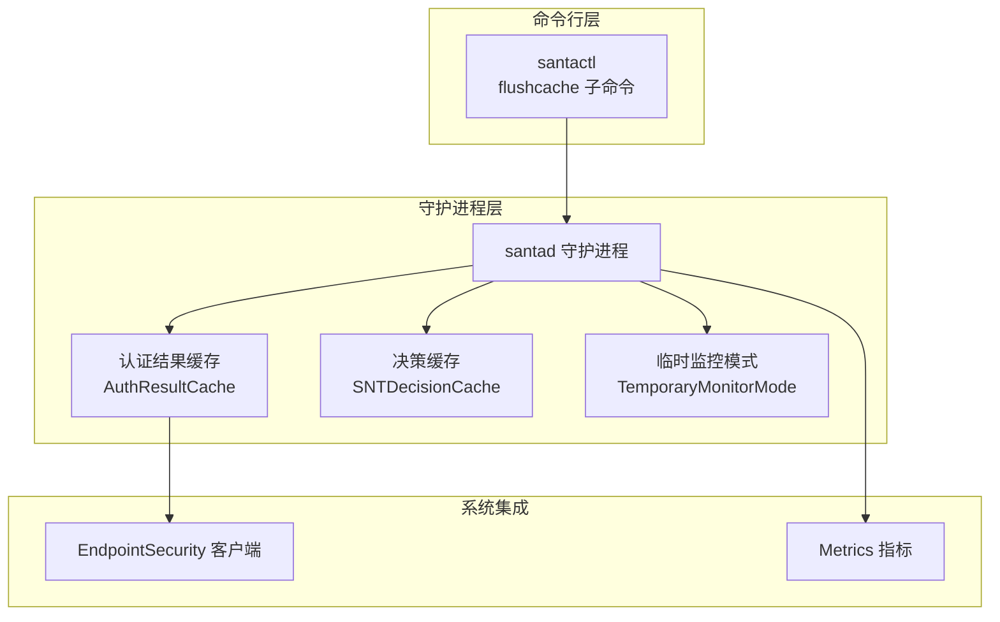
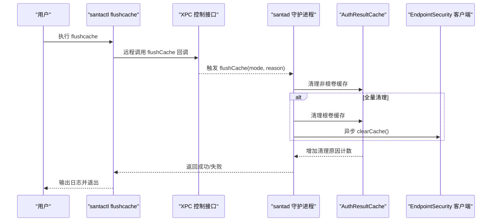
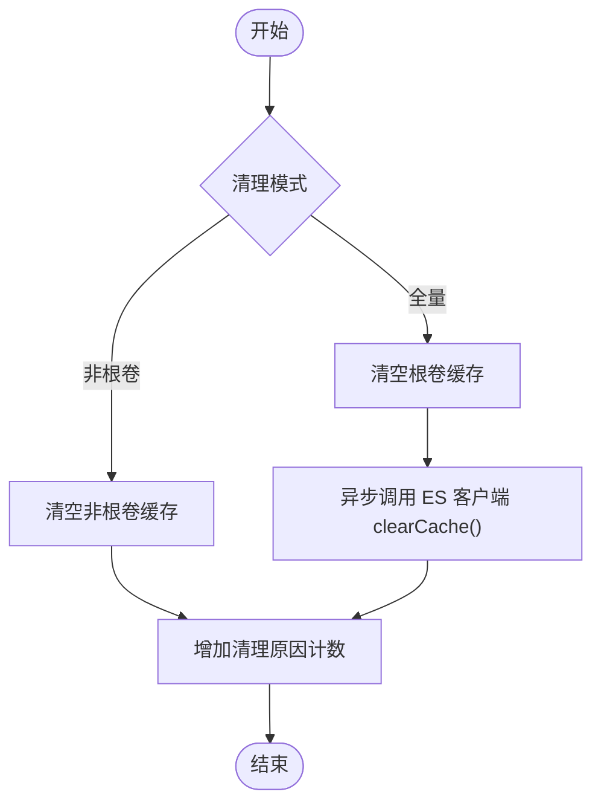
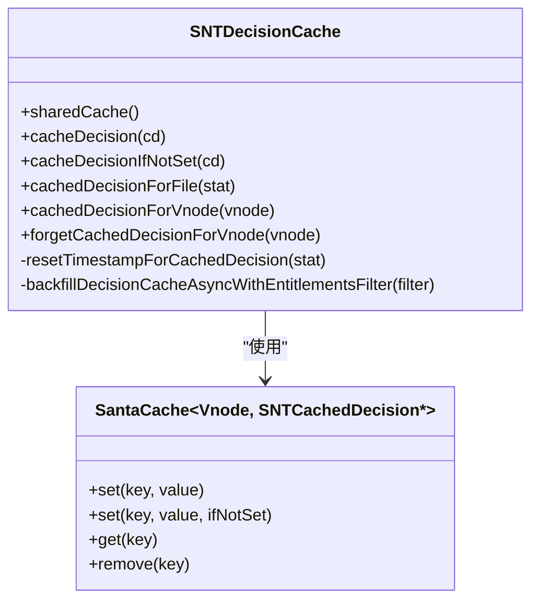
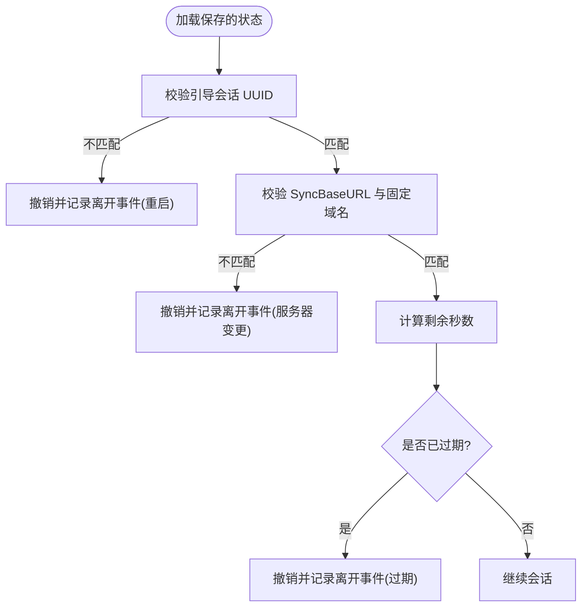
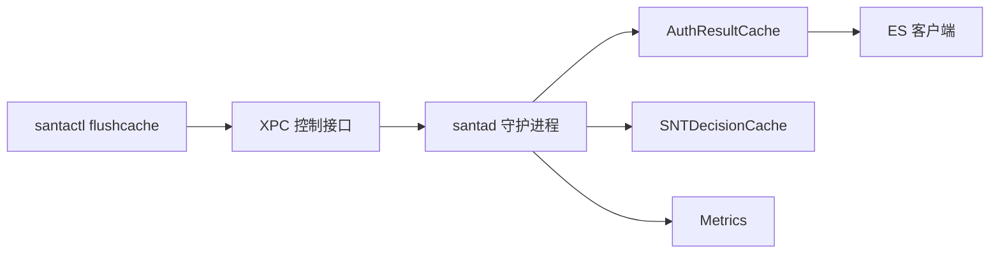

# 缓存清理命令

<cite>
**本文引用的文件**
- [Source/santactl/Commands/SNTCommandFlushCache.mm](file://Source/santactl/Commands/SNTCommandFlushCache.mm)
- [Source/santad/EventProviders/AuthResultCache.h](file://Source/santad/EventProviders/AuthResultCache.h)
- [Source/santad/EventProviders/AuthResultCache.mm](file://Source/santad/EventProviders/AuthResultCache.mm)
- [Source/santad/SNTDecisionCache.mm](file://Source/santad/SNTDecisionCache.mm)
- [Source/santactl/Commands/SNTCommandStatus.mm](file://Source/santactl/Commands/SNTCommandStatus.mm)
- [Source/santactl/Commands/SNTCommandCheckCache.mm](file://Source/santactl/Commands/SNTCommandCheckCache.mm)
- [Source/common/SantaCache.h](file://Source/common/SantaCache.h)
- [Source/santad/TemporaryMonitorMode.mm](file://Source/santad/TemporaryMonitorMode.mm)
- [Source/common/SNTStoredTemporaryMonitorModeAuditEvent.h](file://Source/common/SNTStoredTemporaryMonitorModeAuditEvent.h)
- [Source/santasyncservice/SNTSyncEventUpload.mm](file://Source/santasyncservice/SNTSyncEventUpload.mm)
- [Source/santad/Metrics.mm](file://Source/santad/Metrics.mm)
- [Source/santad/SNTApplicationCoreMetrics.mm](file://Source/santad/SNTApplicationCoreMetrics.mm)
</cite>

## 目录
1. [简介](#简介)
2. [项目结构](#项目结构)
3. [核心组件](#核心组件)
4. [架构总览](#架构总览)
5. [详细组件分析](#详细组件分析)
6. [依赖关系分析](#依赖关系分析)
7. [性能考量](#性能考量)
8. [故障排查指南](#故障排查指南)
9. [结论](#结论)
10. [附录](#附录)

## 简介
本指南围绕 Santa 项目中的缓存清理命令“flush-cache”展开，系统讲解其功能、工作机制、清理策略与数据恢复流程，并覆盖决策缓存、认证结果缓存与临时监控模式相关状态的清理要点。文档同时提供触发条件与时机建议、清理后的验证方法、性能监控技巧以及自动化与批量管理思路，帮助运维与开发人员在生产环境中安全、可控地使用缓存清理能力。

## 项目结构
与“flush-cache”直接相关的代码分布在以下模块：
- 命令行层：santactl 提供 flushcache 子命令，通过 XPC 调用守护进程接口。
- 守护进程层：santad 实现认证结果缓存（AuthResultCache）与决策缓存（SNTDecisionCache），并支持清理与计数上报。
- 事件与状态：临时监控模式（TemporaryMonitorMode）与相关审计事件模型，用于理解清理对会话状态的影响。
- 监控与指标：Metrics 与应用核心指标注册，辅助清理后的性能验证与回归分析。

图示来源
- [Source/santactl/Commands/SNTCommandFlushCache.mm](file://Source/santactl/Commands/SNTCommandFlushCache.mm#L53-L63)
- [Source/santad/EventProviders/AuthResultCache.mm](file://Source/santad/EventProviders/AuthResultCache.mm#L177-L197)
- [Source/santad/SNTDecisionCache.mm](file://Source/santad/SNTDecisionCache.mm#L49-L91)
- [Source/santad/TemporaryMonitorMode.mm](file://Source/santad/TemporaryMonitorMode.mm#L92-L145)
- [Source/santad/Metrics.mm](file://Source/santad/Metrics.mm#L367-L408)

章节来源
- [Source/santactl/Commands/SNTCommandFlushCache.mm](file://Source/santactl/Commands/SNTCommandFlushCache.mm#L29-L63)
- [Source/santad/EventProviders/AuthResultCache.mm](file://Source/santad/EventProviders/AuthResultCache.mm#L177-L197)
- [Source/santad/SNTDecisionCache.mm](file://Source/santad/SNTDecisionCache.mm#L49-L91)
- [Source/santad/TemporaryMonitorMode.mm](file://Source/santad/TemporaryMonitorMode.mm#L92-L145)
- [Source/santad/Metrics.mm](file://Source/santad/Metrics.mm#L367-L408)

## 核心组件
- 认证结果缓存（AuthResultCache）
  - 负责短期授权决策的缓存与过期处理，支持按根卷/非根卷分区缓存，提供清理接口与原因计数。
  - 清理时可选择仅清理非根卷缓存或同时清理根卷缓存，并异步通知 ES 客户端清空内核侧缓存。
- 决策缓存（SNTDecisionCache）
  - 面向二进制执行决策的缓存，支持回填、时间戳重置与按 vnode 删除。
- 临时监控模式（TemporaryMonitorMode）
  - 维护临时 Monitor Mode 的会话状态与审计事件，清理后会话状态可能被撤销或失效。
- 指标与监控（Metrics）
  - 提供清理次数等指标的计数器，便于清理后的效果验证与回归分析。

章节来源
- [Source/santad/EventProviders/AuthResultCache.h](file://Source/santad/EventProviders/AuthResultCache.h#L34-L98)
- [Source/santad/EventProviders/AuthResultCache.mm](file://Source/santad/EventProviders/AuthResultCache.mm#L177-L197)
- [Source/santad/SNTDecisionCache.mm](file://Source/santad/SNTDecisionCache.mm#L49-L91)
- [Source/santad/TemporaryMonitorMode.mm](file://Source/santad/TemporaryMonitorMode.mm#L92-L145)
- [Source/santad/Metrics.mm](file://Source/santad/Metrics.mm#L367-L408)

## 架构总览
下图展示 flush-cache 命令从 CLI 到守护进程再到各缓存子系统的调用链路与清理策略：

图示来源
- [Source/santactl/Commands/SNTCommandFlushCache.mm](file://Source/santactl/Commands/SNTCommandFlushCache.mm#L53-L63)
- [Source/santad/EventProviders/AuthResultCache.mm](file://Source/santad/EventProviders/AuthResultCache.mm#L177-L197)

## 详细组件分析

### 认证结果缓存（AuthResultCache）清理机制
- 清理模式
  - 非根卷仅清除非根卷缓存；全量清理还会清空根卷缓存，并异步调用 ES 客户端清空内核缓存，避免潜在死锁。
- 清理原因
  - 支持多种原因枚举，如客户端模式变更、规则变化、显式命令、文件系统卸载、权限过滤器变化等；原因字符串映射便于指标统计。
- 过期与命中
  - deny 结果带过期时间，超时后自动移除；allow/hold 等状态不缓存或按状态机移除，确保规则更新后的快速生效。
- 计数与可观测性
  - 每次清理增加对应原因的计数器，便于追踪清理频率与触发场景。

图示来源
- [Source/santad/EventProviders/AuthResultCache.mm](file://Source/santad/EventProviders/AuthResultCache.mm#L177-L197)
- [Source/santad/EventProviders/AuthResultCache.h](file://Source/santad/EventProviders/AuthResultCache.h#L34-L48)

章节来源
- [Source/santad/EventProviders/AuthResultCache.h](file://Source/santad/EventProviders/AuthResultCache.h#L34-L98)
- [Source/santad/EventProviders/AuthResultCache.mm](file://Source/santad/EventProviders/AuthResultCache.mm#L177-L197)

### 决策缓存（SNTDecisionCache）清理机制
- 功能要点
  - 提供按 vnode 删除缓存项的能力，支持回填（基于运行中进程快照）以提升启动阶段的决策效率。
  - 对于“传递白名单”类决策，定期重置数据库中规则的时间戳，避免频繁写入。
- 与 flush-cache 的关系
  - 决策缓存通常由规则/签名信息变化触发重建或删除，flush-cache 主要针对认证结果缓存；但两者协同保证策略一致性。

图示来源
- [Source/santad/SNTDecisionCache.mm](file://Source/santad/SNTDecisionCache.mm#L49-L112)
- [Source/common/SantaCache.h](file://Source/common/SantaCache.h)

章节来源
- [Source/santad/SNTDecisionCache.mm](file://Source/santad/SNTDecisionCache.mm#L49-L112)

### 临时监控模式（TemporaryMonitorMode）与清理的关系
- 状态读取与校验
  - 重启、同步服务器变更、未固定域名等情况下，会撤销或终止当前会话，并生成相应的离开审计事件。
- 清理影响
  - flush-cache 不直接撤销临时监控模式会话，但若规则/模式变更导致状态失效，系统会在状态校验阶段撤销会话，从而间接影响临时模式的持续性。

图示来源
- [Source/santad/TemporaryMonitorMode.mm](file://Source/santad/TemporaryMonitorMode.mm#L92-L145)
- [Source/common/SNTStoredTemporaryMonitorModeAuditEvent.h](file://Source/common/SNTStoredTemporaryMonitorModeAuditEvent.h#L38-L91)
- [Source/santasyncservice/SNTSyncEventUpload.mm](file://Source/santasyncservice/SNTSyncEventUpload.mm#L391-L432)

章节来源
- [Source/santad/TemporaryMonitorMode.mm](file://Source/santad/TemporaryMonitorMode.mm#L92-L145)
- [Source/common/SNTStoredTemporaryMonitorModeAuditEvent.h](file://Source/common/SNTStoredTemporaryMonitorModeAuditEvent.h#L38-L91)
- [Source/santasyncservice/SNTSyncEventUpload.mm](file://Source/santasyncservice/SNTSyncEventUpload.mm#L391-L432)

## 依赖关系分析
- 命令到守护进程
  - santactl 的 flushcache 子命令通过 XPC 远程调用守护进程的 flushCache 接口。
- 守护进程内部
  - AuthResultCache 负责认证结果缓存的清理与 ES 客户端交互；SNTDecisionCache 负责决策层面的缓存维护；Metrics 提供清理计数等指标。
- 外部系统
  - ES 客户端负责内核态缓存的同步清理，flush-cache 通过异步队列调用，避免阻塞。

图示来源
- [Source/santactl/Commands/SNTCommandFlushCache.mm](file://Source/santactl/Commands/SNTCommandFlushCache.mm#L53-L63)
- [Source/santad/EventProviders/AuthResultCache.mm](file://Source/santad/EventProviders/AuthResultCache.mm#L177-L197)
- [Source/santad/Metrics.mm](file://Source/santad/Metrics.mm#L367-L408)

章节来源
- [Source/santactl/Commands/SNTCommandFlushCache.mm](file://Source/santactl/Commands/SNTCommandFlushCache.mm#L53-L63)
- [Source/santad/EventProviders/AuthResultCache.mm](file://Source/santad/EventProviders/AuthResultCache.mm#L177-L197)
- [Source/santad/Metrics.mm](file://Source/santad/Metrics.mm#L367-L408)

## 性能考量
- 清理时机
  - 在规则大规模变更（新增 deny 规则）后进行全量清理，可减少 deny 结果过期前的误判；deny 结果缓存过期时间需平衡“快速生效”与“缓存收益”。
- 影响范围
  - 非根卷清理不会触达内核缓存，适合局部热区；全量清理会同步 ES 客户端，注意异步调用避免阻塞。
- 指标观测
  - 使用 Metrics 中的清理计数器与核心指标（内存/CPU）观察清理前后系统资源占用变化，结合状态输出确认缓存规模变化。

章节来源
- [Source/santad/EventProviders/AuthResultCache.h](file://Source/santad/EventProviders/AuthResultCache.h#L50-L60)
- [Source/santad/Metrics.mm](file://Source/santad/Metrics.mm#L367-L408)
- [Source/santad/SNTApplicationCoreMetrics.mm](file://Source/santad/SNTApplicationCoreMetrics.mm#L82-L116)

## 故障排查指南
- 命令执行失败
  - 检查 XPC 连接状态与守护进程健康；查看 CLI 日志输出与返回码。
- 清理无效
  - 使用“检查缓存”命令确认目标文件是否仍在缓存；通过状态输出查看根/非根缓存计数变化。
- 临时监控模式异常
  - 关注状态校验失败的原因（重启、服务器变更、未固定域名、过期），必要时撤销并重新进入会话。

章节来源
- [Source/santactl/Commands/SNTCommandFlushCache.mm](file://Source/santactl/Commands/SNTCommandFlushCache.mm#L53-L63)
- [Source/santactl/Commands/SNTCommandCheckCache.mm](file://Source/santactl/Commands/SNTCommandCheckCache.mm#L31-L45)
- [Source/santactl/Commands/SNTCommandStatus.mm](file://Source/santactl/Commands/SNTCommandStatus.mm#L394-L396)
- [Source/santad/TemporaryMonitorMode.mm](file://Source/santad/TemporaryMonitorMode.mm#L92-L145)

## 结论
flush-cache 命令通过“非根卷优先、全量可选”的策略，配合 ES 客户端异步清理，能够在规则变更后快速恢复策略一致性。结合指标与状态输出，可有效验证清理效果并评估性能影响。对于临时监控模式，清理本身不直接撤销会话，但状态校验逻辑会在关键条件下自动撤销，确保策略变更后的安全边界。

## 附录

### flush-cache 使用步骤
- 权限要求
  - 需要 root 权限并通过 XPC 连接守护进程。
- 执行方式
  - 通过 santactl 的 flushcache 子命令触发；守护进程收到请求后执行清理并返回结果。
- 清理策略选择
  - 非根卷仅清空非根卷缓存；全量清理同时清空根卷缓存并异步清空 ES 内核缓存。

章节来源
- [Source/santactl/Commands/SNTCommandFlushCache.mm](file://Source/santactl/Commands/SNTCommandFlushCache.mm#L31-L63)
- [Source/santad/EventProviders/AuthResultCache.mm](file://Source/santad/EventProviders/AuthResultCache.mm#L177-L197)

### 触发条件与时机建议
- 规则变更（尤其是新增 deny 规则）后进行全量清理，确保 deny 结果尽快生效。
- 文件系统卸载或权限过滤器配置变更时，可考虑清理以消除陈旧状态。
- 开发/调试阶段可使用隐藏的 flushcache 子命令进行快速验证。

章节来源
- [Source/santad/EventProviders/AuthResultCache.h](file://Source/santad/EventProviders/AuthResultCache.h#L39-L48)
- [Source/santactl/Commands/SNTCommandFlushCache.mm](file://Source/santactl/Commands/SNTCommandFlushCache.mm#L43-L51)

### 清理后的验证与性能监控
- 验证方法
  - 使用“检查缓存”命令确认目标文件是否已不在缓存；通过“状态”输出查看根/非根缓存计数变化。
- 性能监控
  - 关注 Metrics 中的清理计数器与核心指标（内存/CPU），对比清理前后的趋势，评估清理对系统的影响。

章节来源
- [Source/santactl/Commands/SNTCommandCheckCache.mm](file://Source/santactl/Commands/SNTCommandCheckCache.mm#L31-L45)
- [Source/santactl/Commands/SNTCommandStatus.mm](file://Source/santactl/Commands/SNTCommandStatus.mm#L394-L396)
- [Source/santad/Metrics.mm](file://Source/santad/Metrics.mm#L367-L408)
- [Source/santad/SNTApplicationCoreMetrics.mm](file://Source/santad/SNTApplicationCoreMetrics.mm#L82-L116)

### 自动化与批量管理建议
- 自动化脚本
  - 建议在规则发布或配置变更后，统一调用 flushcache 并记录清理原因与时间戳；结合指标告警判断清理效果。
- 批量操作
  - 在多主机环境下，先在小范围灰度执行，观察指标与日志后再扩大范围；必要时分批进行全量清理以降低瞬时影响。

[本节为通用实践建议，不直接分析具体文件，故无章节来源]